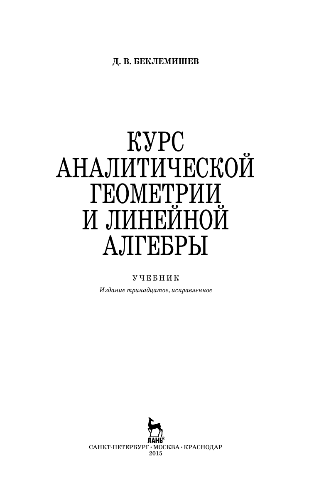

# ВСТУПИТЕЛЬНЫЕ МАТЕРИАЛЫ

## Вступительные материалы

---
**стр. 1**
---

**Д. В. БЕКЛЕМИШЕВ**

**КУРС**
**АНАЛИТИЧЕСКОЙ**
**ГЕОМЕТРИИ**
**И ЛИНЕЙНОЙ**
**АЛГЕБРЫ**

УЧЕБНИК

*Издание тринадцатое, исправленное*

ЛАНЬ®

САНКТ-ПЕТЕРБУРГ • МОСКВА • КРАСНОДАР

2015

---
**стр. 2**
---

ББК 22.151.5я73
Б 42

Б 42 Беклемишев Д. В.

**Курс аналитической геометрии и линейной алгебры:** Учебник. — 13-е изд., испр. — СПб.: Издательство «Лань», 2015. — 448 с.: ил. — (Учебники для вузов. Специальная литература).

ISBN 978-5-8114-1844-2

В учебнике изложен основной материал, входящий в объединенный курс аналитической геометрии и линейной алгебры: векторная алгебра, прямые и плоскости, линии и поверхности второго порядка, аффинные преобразования, матричная алгебра и системы линейных уравнений, линейные пространства, евклидовы и унитарные пространства, аффинные пространства, тензорная алгебра.

Учебник предназначен для студентов, изучающих курсы математики в классических университетах, а также технических вузах.

ББК 22.151.5я73

Обложка

*Е. А. ВЛАСОВА*

*Охраняется законом РФ об авторском праве. Воспроизведение всей книги или любой ее части запрещается без письменного разрешения издателя. Любые попытки нарушения закона будут преследоваться в судебном порядке.*

© Издательство «Лань», 2015
© Д. В. Беклемишев, 2015
© Издательство «Лань»,
художественное оформление, 2015

---
**стр. 3**
---

# ГРЕЧЕСКИЙ АЛФАВИТ

| | | | |
|:---:|:---:|:---:|:---:|
| $A, \alpha$ | $B, \beta$ | $\Gamma, \gamma$ | $\Delta, \delta$ |
| альфа | бета | гамма | дельта |
| $E, \varepsilon$ | $Z, \zeta$ | $H, \eta$ | $\Theta, \theta$ |
| епсилон | дзета | эта | тета |
| $I, \iota$ | $K, \kappa$ | $\Lambda, \lambda$ | $M, \mu$ |
| йота | каппа | лямбда | мю |
| $N, \nu$ | $\Xi, \xi$ | $O, o$ | $\Pi, \pi$ |
| ню | кси | омикрон | пи |
| $P, \rho$ | $\Sigma, \sigma$ | $T, \tau$ | $\Upsilon, \upsilon$ |
| ро | сигма | тау | ипсилон |
| $\Phi, \varphi$ | $X, \chi$ | $\Psi, \psi$ | $\Omega, \omega$ |
| фи | хи | пси | омега |

---
**стр. 4**
---

# ПРЕДИСЛОВИЕ

Эта книга отражает многолетний опыт преподавания соответствующего курса в Московском физико-техническом институте. Особенности подготовки студентов в МФТИ вызывают необходимость ускоренного изложения курса математики, по объему приближающегося к университетскому. В связи с этим аналитическая геометрия излагается так, чтобы на простом и доступном материале подготовить студента к изучению линейной алгебры. Собственно линейной алгебре, т. е. теории линейных пространств, предпослана большая глава о системах линейных уравнений и матрицах. Ее цель — дать читателю исследование систем линейных уравнений, независимое от методов линейной алгебры. В этой же главе собраны и другие сведения, необходимые для дальнейшего. Более подробное представление о строении книги можно получить из оглавления.

В настоящем издании по сравнению с предыдущим улучшены многие доказательства, заново написаны параграфы о жордановой форме матрицы и о поливекторах и внешних формах. Внесено большое количество мелких изменений, способствующих улучшению изложения, и исправлены некоторые погрешности.

Мне хочется с благодарностью отметить то влияние, которое оказали на эту книгу преподаватели кафедры математики МФТИ, больше других — все, читавшие лекции по курсу аналитической геометрии и линейной алгебры. Особенно я благодарен проф. А. А. Абрамову, проф. Л. А. Беклемишевой, чл.-корр. РАН Л. Д. Кудрявцеву, проф. В. Б. Лидскому, акад. Л. В. Овсянникову, проф. С. С. Рышкову, проф. С. А. Теляковскому.
