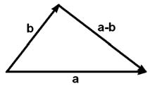
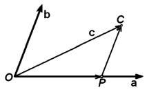
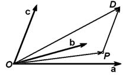

# Глава I. Векторная алгебра

## § 1. Векторы

**1. Предварительные замечания.** Первые главы этой книги можно рассматривать как продолжение школьного курса геометрии. Известно, что каждая математическая дисциплина основывается на некоторой системе недоказываемых предложений, называемых аксиомами. Полный перечень аксиом геометрии, также как и обсуждение роли аксиом в математике, можно найти в книге Н. В. Ефимова [5]. (Цифры в квадратных скобках означают ссылки на список рекомендуемой литературы, помещенный в конце книги.)

Мы не ставим себе целью изложение логических основ предмета и потому просто опираемся на теоремы, доказываемые в курсе элементарной геометрии. Равным образом, мы не пытаемся дать определение основных геометрических понятий: точки, прямой, плоскости. Читатель, интересующийся их строгим введением, может обратиться к той же книге Н. В. Ефимова, мы же просто будем считать, что эти и другие введенные в школе понятия известны читателю.

Предполагаются также известными определение вещественных (действительных) чисел и их основные свойства. (Строгая теория вещественного числа приводится в учебниках математического анализа.) Будет широко использоваться то обстоятельство, что при выбранной единице измерения каждому отрезку можно сопоставить положительное вещественное число, называемое его длиной. Единицу измерения длин мы будем считать выбранной раз навсегда и, говоря

---
**стр. 6**

---

о длинах отрезков, не будем указывать, какой единицей они измеряются.

**2. Определение вектора.** Понятие вектора также известно из школьного курса, но лучше напомнить основные факты, с ним связанные.

Пару точек мы называем упорядоченной, если про эти точки известно, какая из них первая, а какая — вторая.

**Определение 1.** *Отрезок, концы которого упорядочены, называется направленным отрезком или вектором.* Первый из его концов называется началом, второй — концом вектора. К векторам относится и нулевой вектор, у которого начало и конец совпадают.

Направление вектора на рисунке принято обозначать стрелкой, над буквенным обозначением вектора тоже ставится стрелка, например, $\overrightarrow{AB}$ (при этом буква, обозначающая начало, обязательно пишется первой). В книгах буквы, обозначающие векторы, набираются полужирным шрифтом, например, $\mathbf{a}$. Нулевой вектор обозначается $\mathbf{0}$.

Расстояние между началом и концом вектора называется его длиной (а также модулем или абсолютной величиной). Длина вектора обозначается $|\mathbf{a}|$ или $|\overrightarrow{AB}|$.

Векторы называются коллинеарными, если существует такая прямая, которой они параллельны. Векторы компланарны, если существует плоскость, которой они параллельны. Нулевой вектор считается коллинеарным любому вектору, так как он не имеет определенного направления. Длина его, разумеется, равна нулю.

**Определение 2.** *Два вектора называются равными, если они коллинеарны, одинаково направлены, и имеют равные длины.*

Из этого определения вытекает, что, выбрав любую точку $A'$, мы можем построить (и притом только один) вектор $\overrightarrow{A'B'}$, равный некоторому заданному вектору $\overrightarrow{AB}$, или, как говорят, перенести вектор $\overrightarrow{AB}$ в точку $A'$.

**3. О другом определении вектора.** Понятие равенства векторов существенно отличается от понятия равенства, например, чисел. Каждое число равно только самому себе, иначе говоря, два равных

---
**стр. 7**

---

числа при всех обстоятельствах могут рассматриваться как одно и то же число. С векторами дело обстоит по-другому: в силу определения существуют различные, но равные между собой векторы. Хотя в большинстве случаев у нас не будет необходимости различать их между собой, вполне может оказаться, что в какой-то момент нас будет интересовать именно вектор $\overrightarrow{AB}$, а не равный ему вектор $\overrightarrow{A'B'}$.

Для того чтобы упростить понятие равенства и снять некоторые связанные с ним трудности, иногда идут на усложнение определения вектора. Мы не будем пользоваться этим усложненным определением, но сформулируем его. Чтобы не путать, будем писать «Вектор» (с большой буквы) для обозначения определяемого ниже понятия.

**Определение 3.** *Пусть дан направленный отрезок. Множество всех направленных отрезков, равных данному в смысле определения 2, называется Вектором.*

Таким образом, каждый направленный отрезок определяет один и тот же Вектор тогда и только тогда, когда они равны согласно определению 2. Для Векторов, как и для чисел, равенство означает совпадение.

Из начального курса физики хорошо известно, что сила может быть изображена направленным отрезком. Но она не может быть изображена Вектором, поскольку сила, изображаемая равными направленными отрезками, производит, вообще говоря, различные действия. (Если сила действует на упругое тело, то изображающий ее отрезок не может быть перенесен даже вдоль той прямой, на которой он лежит.)

Это только одна из причин, по которым наряду с Векторами приходится рассматривать и направленные отрезки. При этих обстоятельствах применение определения 3 осложняется большим числом оговорок. Мы будем придерживаться определения 1, причем по общему смыслу всегда будет ясно, идет ли речь об определенном векторе, или на его место может быть подставлен любой, ему равный.

В связи со сказанным, стоит разъяснить значение некоторых слов, встречающихся в литературе. Вместо определения 2 можно ввести для векторов другое определение равенства, согласно которому векторы равны, если они равны по длине, лежат на одной прямой и направлены в одну сторону. В этом случае вектор не может быть перенесен в любую точку пространства, а переносится только вдоль той прямой, на которой он лежит. При таком понимании равенства векторы называются скользящими. В механике сила,

---
**стр. 8**

---

действующая на абсолютно твердое тело, изображается скользящим вектором.

Можно для векторов не давать никакого особого определения равенства, то есть считать, что вектор характеризуется помимо длины и направления в пространстве, еще и точкой приложения. В этом случае векторы называются приложенными. Как уже упоминалось, сила, действующая на упругое тело, изображается приложенным вектором.

Если нужно подчеркнуть, что равенство векторов понимается в смысле определения 2, то векторы называются свободными.

**4. Линейные операции.** Так называются сложение векторов и умножение вектора на число. Напомним их определения.

**Определение.** Пусть даны два вектора $\mathbf{a}$ и $\mathbf{b}$. Построим равные им векторы $\overrightarrow{AB}$ и $\overrightarrow{BC}$. Тогда вектор $\overrightarrow{AC}$ называется суммой векторов $\mathbf{a}$ и $\mathbf{b}$ и обозначается $\mathbf{a} + \mathbf{b}$.

Заметим, что, выбрав вместо $B$ другую точку $B'$, мы получили бы другой вектор $\overrightarrow{A'C'}$, равный вектору $\overrightarrow{AC}$.

**Определение.** Произведением вектора $\mathbf{a}$ на вещественное число $\alpha$ называется вектор $\mathbf{b}$, удовлетворяющий следующим условиям:

а) $|\mathbf{b}| = |\alpha| |\mathbf{a}|$;

б) $\mathbf{b}$ коллинеарен $\mathbf{a}$;

в) $\mathbf{b}$ и $\mathbf{a}$ направлены одинаково, если $\alpha > 0$, и противоположно, если $\alpha < 0$. (Если же $\alpha = 0$, то из первого условия следует $\mathbf{b} = \mathbf{0}$.)

Произведение вектора $\mathbf{a}$ на число $\alpha$ обозначается $\alpha\mathbf{a}$.

Приведенное определение определяет вектор $\alpha\mathbf{a}$ не единственным образом, но все удовлетворяющие ему векторы равны между собой.

В курсе средней школы были выведены основные свойства линейных операций. Перечислим их без доказательства.

**Предложение 1.** *Для любых векторов $\mathbf{a}$, $\mathbf{b}$ и $\mathbf{c}$ и любых чисел $\alpha$ и $\beta$ выполнено:*

1. $\mathbf{a} + \mathbf{b} = \mathbf{b} + \mathbf{a}$ (сложение коммутативно).
2. $(\mathbf{a} + \mathbf{b}) + \mathbf{c} = \mathbf{a} + (\mathbf{b} + \mathbf{c})$ (сложение ассоциативно).
3. $\mathbf{a} + \mathbf{0} = \mathbf{a}$.
4. Вектор $(-1)\mathbf{a}$ — противоположный для $\mathbf{a}$, то есть $\mathbf{a} + (-1)\mathbf{a} = \mathbf{0}$.

---
**стр. 9**

---

5. $(\alpha\beta)\mathbf{a} = \alpha(\beta\mathbf{a})$.
6. $(\alpha + \beta)\mathbf{a} = \alpha\mathbf{a} + \beta\mathbf{a}$.
7. $\alpha(\mathbf{a} + \mathbf{b}) = \alpha\mathbf{a} + \alpha\mathbf{b}$.
8. $1\mathbf{a} = \mathbf{a}$.

Вектор $(-1)\mathbf{a}$ обозначается $-\mathbf{a}$. Разностью векторов $\mathbf{a}$ и $\mathbf{b}$ называется сумма векторов $\mathbf{a}$ и $-\mathbf{b}$. Она обозначается $\mathbf{a} - \mathbf{b}$.

Если $\mathbf{b} + \mathbf{x} = \mathbf{a}$, то $\mathbf{x} = \mathbf{a} - \mathbf{b}$ (рис. 1). В этом смысле вычитание — операция, сопоставляющая паре векторов разность первого и второго, есть операция обратная сложению, и мы не считаем его отдельной операцией. Точно так же мы не выделяем деление вектора на число $\alpha$, так как его можно определить как умножение на $\alpha^{-1}$.

Из определения произведения вектора на число прямо следует

**Предложение 2.** *Если $\mathbf{a} \neq \mathbf{0}$, то любой вектор $\mathbf{b}$, коллинеарный $\mathbf{a}$, представим в виде $\mathbf{b} = \pm(|\mathbf{b}|/|\mathbf{a}|)\mathbf{a}$. Знак плюс или минус берется смотря по тому, направлены $\mathbf{a}$ и $\mathbf{b}$ одинаково или нет.*

Применяя линейные операции, можно составлять суммы векторов, умноженных на числа: $\alpha_1\mathbf{a}_1 + \alpha_2\mathbf{a}_2 + \cdots + \alpha_k\mathbf{a}_k$. Выражения такого вида называются линейными комбинациями. Числа, входящие в линейную комбинацию, называются ее коэффициентами. Свойства, перечисленные в предложении 1, позволяют преобразовывать линейные комбинации по обычным правилам алгебры: раскрывать скобки, приводить подобные члены, переносить некоторые члены в другую часть равенства с противоположным знаком и т. д.

Предложение 1 дает в некотором смысле полный набор свойств: любые вычисления, использующие линейные операции, можно производить, основываясь на них и не обращаясь к определениям. Это будет иметь для нас принципиальное значение в гл. VI.

Линейные комбинации обладают следующим очевидным свойством: если векторы $\mathbf{a}_1, \ldots, \mathbf{a}_k$ коллинеарны, то любая их линейная комбинация им коллинеарна. Если же они

---
**стр. 10**

---

компланарны, то любая их линейная комбинация им компланарна. Это сразу следует из того, что вектор $\alpha\mathbf{a}$ коллинеарен $\mathbf{a}$, а сумма векторов компланарна слагаемым, и коллинеарна им, если они коллинеарны.

**5. Векторные пространства.** Множество называется замкнутым относительно некоторой операции, если для любых элементов множества результат применения этой операции принадлежит данному множеству.

**Определение.** *Непустое множество векторов, замкнутое относительно линейных операций, называется векторным пространством.* Если одно векторное пространство является подмножеством другого, то оно называется его подпространством.

Таким образом, можно сказать, что множество всех векторов, параллельных данной прямой, и множество всех векторов, параллельных данной плоскости, являются векторными пространствами. Чтобы различать эти два типа векторных пространств, их называют, соответственно, одномерными и двумерными пространствами.

Помимо упомянутых, существуют еще два векторных пространства: нулевое, или нульмерное, состоящее только из нулевого вектора, и трехмерное — множество всех векторов пространства.

Нулевое пространство является подпространством для каждого другого, и каждое векторное пространство является подпространством для трехмерного.

Если дана плоскость $P$, то множество векторов, параллельных этой плоскости, называется ее направляющим векторным подпространством. Необходимо подчеркнуть, что плоскость и ее направляющее подпространство — разные объекты: плоскость — это множество точек, а подпространство — множество векторов. Все плоскости, параллельные $P$, имеют одно и то же направляющее подпространство. Аналогично определяется направляющее векторное подпространство для прямой линии.

**6. Линейная зависимость векторов.** Мы будем говорить, что вектор $\mathbf{b}$ раскладывается по векторам $\mathbf{a}_1, \ldots, \mathbf{a}_k$, если он представим как их линейная комбинация: найдутся

---
**стр. 11**

---

такие коэффициенты, что $\mathbf{b} = \beta_1\mathbf{a}_1 + \cdots + \beta_k\mathbf{a}_k$. Вполне может случиться, что какой-то вектор раскладывается по данной системе векторов, и при этом коэффициенты разложения определены неоднозначно.

**Пример.** Если $\mathbf{a}_3 = \mathbf{a}_1 + \mathbf{a}_2$, то вектор $\mathbf{b} = -\mathbf{a}_3$ раскладывается также как $\mathbf{b} = -\mathbf{a}_1 - \mathbf{a}_2$ или $\mathbf{b} = \mathbf{a}_3 - 2\mathbf{a}_1 - 2\mathbf{a}_2$ и т. д. Посмотрим, с чем это связано.

Нулевой вектор раскладывается по любой системе векторов: мы получим нулевой вектор, если возьмем линейную комбинацию этих векторов с нулевыми коэффициентами. Такая линейная комбинация называется тривиальной.

**Определение.** *Система векторов $\mathbf{a}_1, \ldots, \mathbf{a}_k$ называется линейно независимой, если нулевой вектор раскладывается по ней единственным образом.*

Иначе говоря, система векторов линейно независима, если только тривиальная линейная комбинация этих векторов равна нулевому вектору, или, из равенства $\alpha_1\mathbf{a}_1 + \cdots + \alpha_k\mathbf{a}_k = \mathbf{0}$ следует, что $\alpha_1 = \cdots = \alpha_k = 0$.

Система векторов $\mathbf{a}_1, \ldots, \mathbf{a}_k$ *линейно зависима*, если нулевой вектор раскладывается по ней не единственным образом, то есть если найдутся такие коэффициенты $\alpha_1, \ldots, \alpha_k$, что $\alpha_1\mathbf{a}_1 + \cdots + \alpha_k\mathbf{a}_k = \mathbf{0}$, но не все они равны нулю:

$$\alpha_1^2 + \cdots + \alpha_k^2 \neq 0.$$

В приведенном выше примере векторы $\mathbf{a}_1, \mathbf{a}_2, \mathbf{a}_3$ линейно зависимы: $\mathbf{a}_1 + \mathbf{a}_2 - \mathbf{a}_3 = \mathbf{0}$.

Рассмотрим свойства линейно зависимых и линейно независимых систем векторов.

Если среди векторов $\mathbf{a}_1, \ldots, \mathbf{a}_k$ есть нулевой, то такая система линейно зависима. Действительно, рассмотрим линейную комбинацию, в которую $\mathbf{0}$ входит с коэффициентом 1, а остальные векторы с нулевыми коэффициентами. Такая линейная комбинация нетривиальна и равна нулевому вектору.

Это — частный случай более общего утверждения:

**Предложение 3.** *Если в системе векторов какая-то часть линейно зависима, то вся система обязательно линейно зависима.*

**Доказательство.** Если к линейно зависимой системе $\mathbf{a}_1, \ldots, \mathbf{a}_k$ дописать какие-либо векторы $\mathbf{b}_1, \ldots, \mathbf{b}_s$, то

---
**стр. 12**

---

полученная система векторов будет линейно зависимой. В самом деле, к имеющейся равной $\mathbf{0}$ нетривиальной линейной комбинации векторов $\mathbf{a}_1, \ldots, \mathbf{a}_k$ можно прибавить векторы $\mathbf{b}_1, \ldots, \mathbf{b}_s$ с нулевыми коэффициентами.

Отсюда от противного получаем

**Следствие.** *Любая часть линейно независимой системы линейно независима.*

**Предложение 4.** *Если вектор $\mathbf{x}$ раскладывается по системе векторов $\mathbf{a}_1, \ldots, \mathbf{a}_k$, то это разложение единственно тогда и только тогда, когда система векторов линейно независима.*

Действительно, пусть существуют два разложения $\mathbf{x} = \alpha_1\mathbf{a}_1 + \cdots + \alpha_k\mathbf{a}_k$ и $\mathbf{x} = \beta_1\mathbf{a}_1 + \cdots + \beta_k\mathbf{a}_k$. Вычитая их почленно одно из другого, мы получим $(\alpha_1 - \beta_1)\mathbf{a}_1 + \cdots + (\alpha_k - \beta_k)\mathbf{a}_k = \mathbf{0}$. Если векторы линейно независимы, отсюда следует, что $\alpha_1 - \beta_1 = 0, \ldots, \alpha_k - \beta_k = 0$, то есть оба разложения совпадают.

Обратно, если векторы линейно зависимы, существует их нетривиальная линейная комбинация, равная нулевому вектору: $\alpha_1\mathbf{a}_1 + \cdots + \alpha_k\mathbf{a}_k = \mathbf{0}$. Мы можем прибавить ее к имеющемуся разложению $\mathbf{x}$ по тем же векторам: $\mathbf{x} = (\alpha_1 + \beta_1)\mathbf{a}_1 + \cdots + (\alpha_k + \beta_k)\mathbf{a}_k$. Предложение доказано.

**Предложение 5.** *Система из $k > 1$ векторов линейно зависима тогда и только тогда, когда один из векторов раскладывается по остальным.*

**Доказательство.** Пусть система векторов $\mathbf{a}_1, \ldots, \mathbf{a}_k$ линейно зависима, то есть существуют такие коэффициенты $\alpha_1, \ldots, \alpha_k$, что $\alpha_1\mathbf{a}_1 + \cdots + \alpha_k\mathbf{a}_k = \mathbf{0}$, и, например, $\alpha_1$ отличен от нуля. В этом случае мы можем разложить $\mathbf{a}_1$ по остальным векторам:

$$\mathbf{a}_1 = -\frac{\alpha_2}{\alpha_1}\mathbf{a}_2 - \cdots - \frac{\alpha_k}{\alpha_1}\mathbf{a}_k.$$

Обратно, пусть один из векторов, например, $\mathbf{a}_1$ разложен по остальным векторам: $\mathbf{a}_1 = \beta_2\mathbf{a}_2 + \cdots + \beta_k\mathbf{a}_k$. Это означает, что линейная комбинация векторов $\mathbf{a}_1, \ldots, \mathbf{a}_k$ с коэффициентами $-1, \beta_2, \ldots, \beta_k$ равна нулевому вектору. Предложение доказано.

---
**стр. 13**

---

Понятие линейной зависимости будет играть большую роль в дальнейшем изложении, но сейчас мы могли бы обойтись без него ввиду простого геометрического смысла, который имеет это понятие.

**Теорема 1.** *Система из одного вектора линейно зависима тогда и только тогда, когда это — нулевой вектор.*

*Система из двух векторов линейно зависима тогда и только тогда, когда векторы коллинеарны.*

*Система из трех векторов линейно зависима тогда и только тогда, когда векторы компланарны.*

*Любые четыре вектора линейно зависимы.*

**Доказательство.** 1. Нулевой вектор составляет линейно зависимую систему, так как $1\mathbf{0} = \mathbf{0}$. Система, содержащая только ненулевой вектор, линейно независима, так как при его умножении на число, отличное от нуля, получится ненулевой вектор.

2. Пусть векторы $\mathbf{a}$ и $\mathbf{b}$ коллинеарны. Если $\mathbf{a} = \mathbf{0}$, то $\mathbf{a}$ и $\mathbf{b}$ линейно зависимы. Пусть $\mathbf{a} \neq \mathbf{0}$. Тогда по предложению 2 $\mathbf{b}$ раскладывается по $\mathbf{a}$. Таким образом, в любом случае коллинеарные векторы линейно зависимы.

Обратно, из двух линейно зависимых векторов один обязательно раскладывается по другому и, следовательно, ему коллинеарен.

3. Пусть векторы $\mathbf{a}$, $\mathbf{b}$ и $\mathbf{c}$ компланарны. Если $\mathbf{a}$ и $\mathbf{b}$ коллинеарны, то они линейно зависимы, и тогда линейно зависимы все три вектора.

Пусть $\mathbf{a}$ и $\mathbf{b}$ не коллинеарны. Разложим $\mathbf{c}$ по ним. Для этого поместим начала всех векторов в одну точку $O$ (рис. 2) и проведем через конец $C$ вектора $\mathbf{c}$ прямую, параллельную $\mathbf{b}$, до пересечения в точке $P$ с прямой, на которой лежит $\mathbf{a}$. (Это построение возможно, так как векторы $\mathbf{a}$ и $\mathbf{b}$ не коллинеарны и, в частности, оба не нулевые.) Теперь $\overrightarrow{OC} = \overrightarrow{OP} + \overrightarrow{PC}$, причем $\overrightarrow{OP}$ и $\overrightarrow{PC}$ коллинеарны, соответственно, $\mathbf{a}$ и $\mathbf{b}$. По доказанному выше, найдутся числа $\alpha$ и $\beta$

---
**стр. 14**

---

такие, что $\overrightarrow{OP} = \alpha\mathbf{a}$ и $\overrightarrow{PC} = \beta\mathbf{b}$. Таким образом, $\mathbf{c} = \alpha\mathbf{a} + \beta\mathbf{b}$. Это означает, что $\mathbf{a}$, $\mathbf{b}$ и $\mathbf{c}$ линейно зависимы.

Обратно, если $\mathbf{a}$, $\mathbf{b}$ и $\mathbf{c}$ линейно зависимы, то один из них раскладывается по двум другим и, следовательно, им компланарен.

4. Рассмотрим четыре вектора $\mathbf{a}$, $\mathbf{b}$, $\mathbf{c}$ и $\mathbf{d}$. Если $\mathbf{a}$, $\mathbf{b}$ и $\mathbf{c}$ компланарны, то они линейно зависимы сами по себе и вместе с вектором $\mathbf{d}$. Пусть $\mathbf{a}$, $\mathbf{b}$ и $\mathbf{c}$ не компланарны. Аналогично предыдущему докажем, что $\mathbf{d}$ раскладывается по ним. Поместим начала всех векторов в одну точку $O$ (рис. 3) и проведем через конец $D$ вектора $\mathbf{d}$ прямую, параллельную $\mathbf{c}$, до пересечения в точке $P$ с плоскостью, на которой лежат $\mathbf{a}$ и $\mathbf{b}$. Теперь $\overrightarrow{OD} = \overrightarrow{OP} + \overrightarrow{PD}$, причем $\overrightarrow{OP}$ компланарен $\mathbf{a}$ и $\mathbf{b}$, а $\overrightarrow{PD}$ коллинеарен $\mathbf{c}$. По доказанному выше, $\overrightarrow{OP}$ раскладывается по $\mathbf{a}$ и $\mathbf{b}$, а $\overrightarrow{PD}$ по $\mathbf{c}$. Значит $\mathbf{d}$ разложен по $\mathbf{a}$, $\mathbf{b}$ и $\mathbf{c}$ и составляет с ними линейно зависимую систему. Теорема доказана.

**7. Базис.** В конце п. 4 было дано определение векторного пространства. Введем следующее

**Определение.** *Базисом в векторном пространстве называется упорядоченная линейно независимая система векторов такая, что любой вектор этого пространства по ней раскладывается.*

Из теоремы 1 сразу вытекает, что

- В нулевом пространстве базиса не существует.
- В одномерном пространстве (на прямой линии) базис состоит из одного ненулевого вектора.
- В двумерном пространстве (на плоскости) базис — упорядоченная пара неколлинеарных векторов.
- В трехмерном пространстве базис — упорядоченная тройка некомпланарных векторов.

---
**стр. 15**

---

Например, в случае плоскости требование упорядоченности означает, что $\mathbf{a}, \mathbf{b}$ и $\mathbf{b}, \mathbf{a}$ — два разных базиса.

Так как векторы базиса линейно независимы, коэффициенты разложения по базису для каждого вектора пространства определены однозначно. Они называются компонентами или координатами вектора в этом базисе.

Таким образом, если $\mathbf{e}_1, \mathbf{e}_2, \mathbf{e}_3$ — базис трехмерного пространства, то по формуле $\mathbf{a} = \alpha_1\mathbf{e}_1 + \alpha_2\mathbf{e}_2 + \alpha_3\mathbf{e}_3$ каждому вектору сопоставлена единственная упорядоченная тройка чисел $\alpha_1, \alpha_2, \alpha_3$, и каждой тройке чисел — единственный вектор. Аналогично, вектор на плоскости имеет две компоненты, а на прямой — одну.

Компоненты пишутся в скобках после буквенного обозначения вектора. Например, $\mathbf{a}(1, 0, 1)$.

В аналитической геометрии геометрические рассуждения о векторах сводятся к вычислениям, в которых участвуют компоненты этих векторов. Следующее предложение показывает, как производятся линейные операции над векторами, если известны их компоненты.

**Предложение 6.** *При умножении вектора на число все его компоненты умножаются на это число. При сложении векторов складываются их соответствующие компоненты.*

Действительно, если $\mathbf{a} = \alpha_1\mathbf{e}_1 + \alpha_2\mathbf{e}_2 + \alpha_3\mathbf{e}_3$ и $\mathbf{b} = \beta_1\mathbf{e}_1 + \beta_2\mathbf{e}_2 + \beta_3\mathbf{e}_3$, то $\lambda\mathbf{a} = \lambda(\alpha_1\mathbf{e}_1 + \alpha_2\mathbf{e}_2 + \alpha_3\mathbf{e}_3) = (\lambda\alpha_1)\mathbf{e}_1 + (\lambda\alpha_2)\mathbf{e}_2 + (\lambda\alpha_3)\mathbf{e}_3$. Точно так же $\mathbf{a} + \mathbf{b} = (\alpha_1\mathbf{e}_1 + \alpha_2\mathbf{e}_2 + \alpha_3\mathbf{e}_3) + (\beta_1\mathbf{e}_1 + \beta_2\mathbf{e}_2 + \beta_3\mathbf{e}_3) = (\alpha_1 + \beta_1)\mathbf{e}_1 + (\alpha_2 + \beta_2)\mathbf{e}_2 + (\alpha_3 + \beta_3)\mathbf{e}_3$.

Для одномерного и двумерного пространств доказательство отличается только числом слагаемых.

**Следствие.** *Для того чтобы найти какую-либо координату линейной комбинации векторов, нужно вместо каждого из этих векторов подставить в линейную комбинацию его соответствующую координату.*

### Упражнения

1. Укажите на плоскости три таких вектора, по которым любой вектор этой плоскости может быть разложен с положительными коэффициентами.

---
**стр. 16**

---

2. Докажите, что точка $C$ лежит на отрезке $AB$ тогда и только тогда, когда существует число $\lambda \in [0, 1]$ такое, что для любой точки $O$ выполнено $\overrightarrow{OC} = \lambda\overrightarrow{OA} + (1-\lambda)\overrightarrow{OB}$. Если $\lambda$ дано, то в каком отношении точка $C$ делит отрезок $AB$?

3. Дан правильный шестиугольник $ABCDEF$, $|AB| = 2$. Найдите координаты вектора $\overrightarrow{AC}$ в базисе $\overrightarrow{AB}, \overrightarrow{AD}$.

4. В некотором базисе на плоскости заданы координаты векторов $\mathbf{a}(1, 2)$, $\mathbf{b}(2, 3)$ и $\mathbf{c}(-1, 1)$. Проверьте, что $\mathbf{a}$ и $\mathbf{b}$ линейно независимы, и найдите координаты вектора $\mathbf{c}$ в базисе $\mathbf{a}$, $\mathbf{b}$.

5. Даны три точки $A$, $B$ и $C$. Найдите такую точку $O$, что $\overrightarrow{OA} + \overrightarrow{OB} + \overrightarrow{OC} = \mathbf{0}$. Решите аналогичную задачу для четырех точек, докажите, что в треугольной пирамиде отрезки, соединяющие вершины с центрами тяжести противоположных граней, пересекаются в одной точке.
