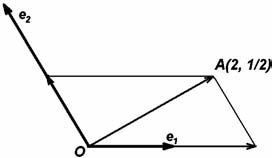
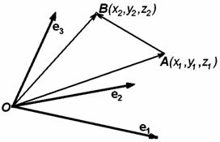
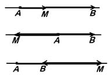
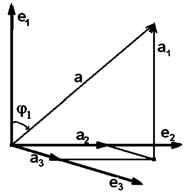
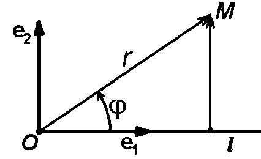
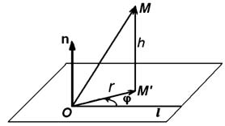
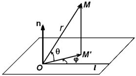

# Глава I. Векторная алгебра

## § 2. Системы координат

**1. Декартова система координат.** Фиксируем в пространстве точку $O$ и рассмотрим произвольную точку $M$. *Радиус-вектором* точки $M$ по отношению к точке $O$ называется вектор $\overrightarrow{OM}$. Если в пространстве кроме точки $O$ выбран некоторый базис, то точке $M$ сопоставляется упорядоченная тройка чисел — компоненты ее радиус-вектора.

*Декартовой системой координат* в пространстве называется совокупность точки и базиса.

Точка носит название начала координат; прямые, проходящие через начало координат в направлении базисных векторов, называются осями координат. Первая — осью абсцисс, вторая — осью ординат, третья — осью аппликат. Плоскости, проходящие через оси координат, называются координатными плоскостями.

**Определение.** *Пусть дана декартова система координат $O, \mathbf{e}_1, \mathbf{e}_2, \mathbf{e}_3$. Компоненты $x, y, z$ радиус-вектора $\overrightarrow{OM}$ точки $M$ называются координатами точки $M$ в данной системе координат:*

$$\overrightarrow{OM} = x\mathbf{e}_1 + y\mathbf{e}_2 + z\mathbf{e}_3.$$

Первая координата называется абсциссой, вторая — ординатой, а третья — аппликатой.

---
**стр. 17**

---

Аналогично определяются координаты на плоскости и на прямой линии. Разумеется, точка на плоскости имеет только две координаты, а на прямой линии — одну.

Координаты точки пишут в скобках после буквы, обозначающей точку. Например, запись $A(2, 1/2)$ означает, что точка $A$ имеет координаты 2 и 1/2 в ранее выбранной декартовой системе координат на плоскости (рис. 4).

Координаты точки, как и компоненты вектора — величины безразмерные. В частности, они не зависят от выбранной единицы измерения длин. В самом деле, раскладывая векторы в теореме 1, мы сводили дело к разложению вектора по коллинеарному с ним ненулевому вектору. А в этом случае компонента равна отношению длин, взятому с определенным знаком (предложение 2 § 1).

Легко видеть, что при заданной системе координат координаты точки определены однозначно. С другой стороны, если задана система координат, то для каждой упорядоченной тройки чисел найдется одна единственная точка, имеющая эти числа в качестве координат. Система координат на плоскости определяет такое же соответствие между точками плоскости и парами чисел. Задание системы координат на прямой сопоставляет каждой точке вещественное число, и каждому числу — точку.

Рассмотрим две точки $A$ и $B$, координаты которых относительно некоторой декартовой системы координат $O, \mathbf{e}_1, \mathbf{e}_2, \mathbf{e}_3$ соответственно равны $x_1, y_1, z_1$ и $x_2, y_2, z_2$. Поставим себе задачу найти компоненты вектора $\overrightarrow{AB}$. Очевидно, что

---
**стр. 18**

---

$\overrightarrow{AB} = \overrightarrow{OB} - \overrightarrow{OA}$ (рис. 5).

Компоненты радиус-векторов $\overrightarrow{OA}$ и $\overrightarrow{OB}$ по определению координат равны $(x_1, y_1, z_1)$ и $(x_2, y_2, z_2)$. Из предложения 6 § 1 следует, что $\overrightarrow{AB}$ имеет компоненты $(x_2 - x_1, y_2 - y_1, z_2 - z_1)$. Этим доказано следующее

**Предложение 1.** *Чтобы найти координаты вектора, нужно из координат его конца вычесть координаты его начала.*

**2. Деление отрезка в заданном отношении.** Пусть точка $M$ лежит на прямой $AB$ и не совпадает ни с одной из точек $A$ или $B$. Линейную зависимость векторов $\overrightarrow{AM}$ и $\overrightarrow{MB}$ можно представить в виде

$$\mu\overrightarrow{AM} = \lambda\overrightarrow{MB}. \tag{1}$$

Отсюда следует $|AM|/|MB| = |\lambda/\mu|$. Таким образом, точка $M$ делит отрезок $AB$ в отношении $|\lambda/\mu|$. При этом, если точка $M$ лежит на отрезке $AB$, то векторы $\overrightarrow{AM}$ и $\overrightarrow{MB}$ сонаправлены, и отношение $\lambda/\mu$ положительно (рис. 6). Если же точка $M$ лежит на прямой $AB$ вне отрезка, то векторы направлены противоположно, и отношение $\lambda/\mu$ отрицательно. Для точек, которые лежат на луче, начинающемся в $A$ и не содержащем $B$, отрезок $|AM|$ короче $|MB|$ и $-1 < \lambda/\mu < 0$, а для точек на луче, начинающемся в $B$ и не содержащем $A$ — наоборот $|AM| > |MB|$ и $\lambda/\mu < 0$. Равенство $\lambda/\mu = -1$ невозможно.

Выберем декартову систему координат $O, \mathbf{e}_1, \mathbf{e}_2, \mathbf{e}_3$ и обозначим через $(x_1, y_1, z_1)$ и $(x_2, y_2, z_2)$ соответственно координаты точек $A$ и $B$, а через $(x, y, z)$ координаты точки $M$. Очевидно, что $\overrightarrow{AM} = \overrightarrow{OM} - \overrightarrow{OA}$, и $\overrightarrow{MB} = \overrightarrow{OB} - \overrightarrow{OM}$. Таким образом, $\mu(\overrightarrow{OM} - \overrightarrow{OA}) = \lambda(\overrightarrow{OB} - \overrightarrow{OM})$. Найдем отсюда $\overrightarrow{OM}$:

$$\overrightarrow{OM} = \frac{\mu}{\lambda+\mu}\overrightarrow{OA} + \frac{\lambda}{\lambda+\mu}\overrightarrow{OB}.$$

(Деление возможно, так как $\lambda/\mu \neq -1$.) Разложим обе части равенства по базису. Компоненты векторов $\overrightarrow{OM}, \overrightarrow{OA}$ и $\overrightarrow{OB}$ равны соответственно координатам точек $M, A$ и $B$. Таким образом

$$x = \frac{\mu x_1 + \lambda x_2}{\lambda+\mu}, \quad y = \frac{\mu y_1 + \lambda y_2}{\lambda + \mu}, \quad z = \frac{\mu z_1 + \lambda z_2}{\lambda+\mu}. \tag{2}$$

---
**стр. 19**

---

На плоскости и на прямой линии задача о делении отрезка решается точно так же, только из трех равенств в (2) остается соответственно два или одно равенство.

**3. Декартова прямоугольная система координат.** Общие декартовы системы координат используются реже, чем специальный класс таких систем — декартовы прямоугольные системы координат.

**Определение.** *Базис называется ортонормированным, если его векторы попарно ортогональны и по длине равны единице. Декартова система координат, базис которой ортонормирован, называется декартовой прямоугольной системой координат.*

**Предложение 2.** *Если базис ортонормирован, то компоненты любого вектора $\mathbf{a}$ находятся по формулам*

$$\alpha_1 = |\mathbf{a}|\cos\varphi_1, \quad \alpha_2 = |\mathbf{a}|\cos\varphi_2, \quad \alpha_3 = |\mathbf{a}|\cos\varphi_3, \tag{3}$$

*где $\varphi_1, \varphi_2$ и $\varphi_3$ — углы между вектором $\mathbf{a}$ и соответствующими базисными векторами.*

**Доказательство.** Пусть $\mathbf{a} = \mathbf{a}_1 + \mathbf{a}_2 + \mathbf{a}_3$, причем каждое слагаемое коллинеарно соответствующему базисному вектору. Мы знаем из предложения 2 § 1, что $\alpha_1 = \pm|\mathbf{a}_1|/|\mathbf{e}_1|$, где выбирается знак + или − в зависимости от того, одинаково или противоположно направлены $\mathbf{a}_1$ и $\mathbf{e}_1$. Но, как видно из рис. 7, $\pm|\mathbf{a}_1| = |\mathbf{a}|\cos\varphi_1$, где $\varphi_1$ — угол между векторами $\mathbf{a}$ и $\mathbf{e}_1$. Итак, $\alpha_1 = |\mathbf{a}|\cos\varphi_1/|\mathbf{e}_1| = |\mathbf{a}|\cos\varphi_1$, так как для ортонормированного базиса $|\mathbf{e}_1| = 1$.

---
**стр. 20**

---

Аналогично вычисляются и остальные компоненты.

Для ортонормированного базиса на плоскости из формул (3) остаются первые две:

$$\alpha_1 = |\mathbf{a}|\cos\varphi_1, \quad \alpha_2 = |\mathbf{a}|\cos\varphi_2 = |\mathbf{a}|\sin\varphi_1.$$

**Определение.** *Косинусы углов между вектором $\mathbf{a}$ и базисными векторами декартовой прямоугольной системы координат называются направляющими косинусами этого вектора.*

Направляющие косинусы — это компоненты вектора $\mathbf{a}^0 = \mathbf{a}/|\mathbf{a}|$. Их отличительная особенность состоит в том, что сумма их квадратов равна квадрату длины диагонали прямоугольного параллелепипеда $|\mathbf{a}^0|^2$, то есть 1.

С помощью предложения 2, нетрудно проверить, что координаты точки относительно декартовой прямоугольной системы координат в пространстве по абсолютной величине равны расстояниям от этой точки до соответствующих координатных плоскостей. Они имеют знак плюс или минус в зависимости от того, лежит ли точка по ту же или другую сторону от плоскости, что и конец базисного вектора, перпендикулярного этой плоскости (считая, что начало вектора лежит в плоскости).

Точно так же находят координаты точки относительно декартовой прямоугольной системы координат на плоскости.

**4. Полярная система координат.** Декартовы системы координат — не единственный способ определять положение точки при помощи чисел. Для этого используются многие другие типы координатных систем. Здесь мы опишем некоторые из них.

На плоскости часто употребляется *полярная система координат*. Она определена, если задана точка $O$, называемая *полюсом*, и исходящий из полюса луч $l$, который называется *полярной осью*. Положение точки $M$ фиксируется двумя чис-

---
**стр. 21**

---

лами: радиусом $r = |OM|$ и углом $\varphi$ между полярной осью и вектором $\overrightarrow{OM}$. Этот угол называется *полярным углом* (рис. 8).

Мы будем измерять полярный угол в радианах и отсчитывать его от полярной оси против часовой стрелки. У полюса $r = 0$, а $\varphi$ не определен. У остальных точек $r > 0$, а $\varphi$ определяется с точностью до слагаемого, кратного $2\pi$. Это означает, что пары чисел $(r, \varphi)$, $(r, \varphi + 2\pi)$ и вообще $(r, \varphi + 2k\pi)$, где $k$ — любое целое число, представляют собой полярные координаты одной и той же точки.

Иногда ограничивают изменение полярного угла какими-нибудь условиями, например, $0 \leqslant \varphi < 2\pi$ или $-\pi < \varphi \leqslant \pi$. Это устраняет неоднозначность, зато вводит другие неудобства.

Пусть задана полярная система координат и упорядоченная пара чисел $(r, \varphi)$, из которых первое неотрицательно. Мы можем сопоставить этой паре точку, для которой эти числа являются полярными координатами. Именно, если $r = 0$, мы паре сопоставляем полюс. Если же $r > 0$, то паре $(r, \varphi)$ ставим в соответствие точку, радиус-вектор которой имеет длину $r$ и составляет с полярной осью угол $\varphi$. При этом парам чисел $(r, \varphi)$ и $(r_1, \varphi_1)$ сопоставляется одна и та же точка, если $r = r_1$, а $\varphi - \varphi_1 = 2\pi k$ — целое число.

Выберем на плоскости декартову прямоугольную систему координат, и, приняв за базис векторы $\mathbf{e}_1$ и $\mathbf{e}_2$ длины 1, направленные соответственно вдоль полярной оси и под углом $\pi/2$ к ней (угол отсчитывается против часовой стрелки), поместим ее начало в полюс $O$. Как легко видеть из рис. 8, декартовы координаты точки выражаются через ее полярные координаты формулами

$$x = r\cos\varphi, \quad y = r\sin\varphi. \tag{4}$$

**5. Цилиндрические и сферические координаты.** В пространстве обобщением полярных систем координат являются цилиндрические и сферические системы координат. И для тех и для других фигура, относительно которой определяется положение точки, состоит из точки $O$, луча $l$, исходящего из $O$, и вектора $\mathbf{n}$, равного по длине единице и перпендикулярного к $l$. Через точку $O$ проведем плоскость $\Theta$, перпендикулярную вектору $\mathbf{n}$. Луч $l$ лежит в этой плоскости.

---
**стр. 22**

---

Пусть дана точка $M$. Опустим из нее перпендикуляр $MM'$ на плоскость $\Theta$.

*Цилиндрические координаты* точки $M$ — это три числа $r, \varphi, h$. Числа $r$ и $\varphi$ — полярные координаты точки $M'$ по отношению к полюсу $O$ и полярной оси $l$, а $h$ — компонента вектора $\overrightarrow{M'M}$ по вектору $\mathbf{n}$. Она определена, так как эти векторы коллинеарны (рис. 9).

*Сферические координаты* точки — три числа $(r, \varphi, \theta)$. Они определяются так: $r = |\overrightarrow{OM}|$. Как и для цилиндрических координат, $\varphi$ — угол вектора $\overrightarrow{OM'}$ с лучом $l$, а $\theta$ — угол вектора $\overrightarrow{OM}$ с плоскостью $\Theta$ (рис. 10).

### Упражнения

1. Дан параллелограмм $OABC$. В нем $|\overrightarrow{OA}| = 2$, $|\overrightarrow{OC}| = 3$, угол $AOC$ равен $\pi/3$. Найдите координаты точки $B$ в системе координат $O, \overrightarrow{OC}, \overrightarrow{OA}$.

2. Даны три точки $A(x_1, y_1)$, $B(x_2, y_2)$, $C(x_3, y_3)$. Найдите координаты вершины $D$ параллелограмма $ABCD$.

3. Нарисуйте на плоскости множества точек, полярные координаты которых связаны соотношениями а) $r = 2/\cos\varphi$, б) $r = 2\cos\varphi$.

4. Пусть $O, l, \mathbf{n}$ — сферическая система координат. Введем декартову прямоугольную систему координат $O, \mathbf{e}_1, \mathbf{e}_2, \mathbf{n}$, где $\mathbf{e}_1$ направлен вдоль $l$, а угол $\pi/2$ от $\mathbf{e}_1$ к $\mathbf{e}_2$ — в сторону возрастания полярного угла. Напишите формулы, выражающие декартовы координаты через сферические.
