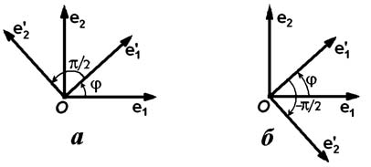

# Глава I. Векторная алгебра

## § 3. Замена базиса и системы координат

**1. Изменение базиса.** До сих пор мы предполагали, что рассматривается один базис. Однако выбор базиса ничем не ограничен, и принципиальное значение имеет задача о нахождении компонент вектора в одном базисе по его компонентам в другом базисе. При этом положение нового базиса относительно старого должно быть задано, а именно, должны быть известны компоненты новых базисных векторов $\mathbf{e}_1'$, $\mathbf{e}_2'$ и $\mathbf{e}_3'$ в старом базисе $\mathbf{e}_1, \mathbf{e}_2, \mathbf{e}_3$. Пусть1

$$
\begin{aligned}
\mathbf{e}_1' &= s_1^1\mathbf{e}_1 + s_1^2\mathbf{e}_2 + s_1^3\mathbf{e}_3, \\
\mathbf{e}_2' &= s_2^1\mathbf{e}_1 + s_2^2\mathbf{e}_2 + s_2^3\mathbf{e}_3, \\
\mathbf{e}_3' &= s_3^1\mathbf{e}_1 + s_3^2\mathbf{e}_2 + s_3^3\mathbf{e}_3.
\end{aligned}
\tag{1}
$$

Произвольный вектор $\mathbf{a}$ разложим по базису $\mathbf{e}_1', \mathbf{e}_2', \mathbf{e}_3'$:

$$\mathbf{a} = \alpha_1'\mathbf{e}_1' + \alpha_2'\mathbf{e}_2' + \alpha_3'\mathbf{e}_3'.$$

Компоненты этого же вектора в старом базисе обозначим $\alpha_1, \alpha_2, \alpha_3$. Раскладывая каждый член предыдущего равенства по базису $\mathbf{e}_1, \mathbf{e}_2, \mathbf{e}_3$, в силу предложения 6 § 1 имеем

$$
\begin{aligned}
\alpha_1 &= s_1^1\alpha_1' + s_2^1\alpha_2' + s_3^1\alpha_3', \\
\alpha_2 &= s_1^2\alpha_1' + s_2^2\alpha_2' + s_3^2\alpha_3', \\
\alpha_3 &= s_1^3\alpha_1' + s_2^3\alpha_2' + s_3^3\alpha_3'.
\end{aligned}
\tag{2}
$$

Соотношения (2) и являются решением нашей задачи. Если нас заинтересует выражение новых компонент через старые, то надо будет решить систему уравнений (2) относительно неизвестных $\alpha_1', \alpha_2', \alpha_3'$. Результат будет иметь такой же вид, как (2), только коэффициентами будут компоненты старых базисных векторов в новом базисе.

Точно тем же способом получаются формулы, связывающие компоненты вектора в разных базисах на плоскости. Вот они:

$$
\begin{aligned}
\alpha_1 &= s_1^1\alpha_1' + s_2^1\alpha_2', \\
\alpha_2 &= s_1^2\alpha_1' + s_2^2\alpha_2'.
\end{aligned}
\tag{3}
$$

1 Здесь для удобства один из индексов мы располагаем сверху. Это не показатель степени. Например, $s_3^1$ читается «$s$ один-три».

---
**стр. 24**

---

Коэффициенты в формулах (2) можно записать в таблицу

$$
\left\|
\begin{array}{ccc}
s_1^1 & s_2^1 & s_3^1 \\
s_1^2 & s_2^2 & s_3^2 \\
s_1^3 & s_2^3 & s_3^3
\end{array}
\right\|.
\tag{4}
$$

Она называется *матрицей перехода* от базиса $\mathbf{e}_1, \mathbf{e}_2, \mathbf{e}_3$ к базису $\mathbf{e}_1', \mathbf{e}_2', \mathbf{e}_3'$. В ее столбцах стоят компоненты векторов $\mathbf{e}_1', \mathbf{e}_2', \mathbf{e}_3'$ в старом базисе.

**2. Изменение системы координат.** Рассмотрим теперь две декартовы системы координат: старую $O, \mathbf{e}_1, \mathbf{e}_2, \mathbf{e}_3$ и новую $O', \mathbf{e}_1', \mathbf{e}_2', \mathbf{e}_3'$. Пусть $M$ — произвольная точка, и координаты ее в этих системах обозначены $(x, y, z)$ и $(x', y', z')$. Поставим себе задачу выразить $x, y$ и $z$ через $x', y'$ и $z'$, считая известным положение новой системы относительно старой. Оно определяется координатами $(s_0^1, s_0^2, s_0^3)$ точки $O'$ в системе координат $O, \mathbf{e}_1, \mathbf{e}_2, \mathbf{e}_3$ и компонентами векторов $\mathbf{e}_1', \mathbf{e}_2', \mathbf{e}_3'$, составляющими матрицу перехода (4).

Радиус-векторы точки $M$ относительно точек $O$ и $O'$ связаны равенством $\overrightarrow{OM} = \overrightarrow{OO'} + \overrightarrow{O'M}$, которое мы можем записать в виде

$$\overrightarrow{OM} = \overrightarrow{OO'} + x'\mathbf{e}_1' + y'\mathbf{e}_2' + z'\mathbf{e}_3',\tag{5}$$

так как $x', y'$ и $z'$ — компоненты $\overrightarrow{O'M}$ в базисе $\mathbf{e}_1', \mathbf{e}_2', \mathbf{e}_3'$. Разложим каждый член равенства (5) по базису $\mathbf{e}_1, \mathbf{e}_2, \mathbf{e}_3$, имея в виду, что компоненты векторов $\overrightarrow{OM}$ и $\overrightarrow{OO'}$ равны координатам точек $M$ и $O'$, которые мы обозначили $(x, y, z)$ и $(s_0^1, s_0^2, s_0^3)$. Мы получим

$$
\begin{aligned}
x &= s_0^1 + s_1^1x' + s_2^1y' + s_3^1z', \\
y &= s_0^2 + s_1^2x' + s_2^2y' + s_3^2z', \\
z &= s_0^3 + s_1^3x' + s_2^3y' + s_3^3z'.
\end{aligned}
\tag{6}
$$

Равенства (6) представляют собой закон преобразования координат точки при переходе от одной декартовой системы координат в пространстве к другой такой же системе.

**3. Замена декартовой прямоугольной системы координат на плоскости.** Формулы перехода от одной декартовой

---
**стр. 25**

---

системы координат на плоскости к другой получаются из (6), если там оставить только первые два равенства и в них вычеркнуть члены с $z'$:

$$
\begin{aligned}
x &= s_1^1x' + s_2^1y' + s_0^1, \\
y &= s_1^2x' + s_2^2y' + s_0^2.
\end{aligned}
\tag{7}
$$

Рассмотрим частный случай, когда обе системы координат декартовы прямоугольные. Через $\varphi$ обозначим угол между векторами $\mathbf{e}_1$ и $\mathbf{e}_1'$, отсчитываемый в направлении кратчайшего поворота от $\mathbf{e}_1$ к $\mathbf{e}_2$. Тогда (рис. 11)

$$\mathbf{e}_1' = \cos\varphi\,\mathbf{e}_1 + \sin\varphi\,\mathbf{e}_2,$$

$$\mathbf{e}_2' = \cos\left(\varphi \pm \frac{\pi}{2}\right)\mathbf{e}_1 + \sin\left(\varphi \pm \frac{\pi}{2}\right)\mathbf{e}_2.$$

В разложении $\mathbf{e}_2'$ ставится знак плюс, если кратчайший поворот от $\mathbf{e}_1'$ к $\mathbf{e}_2'$ направлен так же, как кратчайший поворот от $\mathbf{e}_1$ к $\mathbf{e}_2$, то есть если новый базис повернут относительно старого на угол $\varphi$ (рис. 11 а). Знак минус в разложении $\mathbf{e}_2'$ ставится в противоположном случае, когда новый базис не может быть получен поворотом старого (рис. 11 б).

Поскольку $\cos(\varphi \pm \pi/2) = \mp\sin\varphi$, $\sin(\varphi \pm \pi/2) = \pm\cos\varphi$, получаем

$$
\begin{aligned}
x &= x'\cos\varphi \mp y'\sin\varphi + s_0^1, \\
y &= x'\sin\varphi \pm y'\cos\varphi + s_0^2,
\end{aligned}
\tag{8}
$$

причем при повороте системы координат берутся верхние знаки.

---
**стр. 26**

---

### Упражнения

1. Выведите формулы замены базиса и замены системы координат на прямой линии. Как меняются координаты точек прямой при неизменном начале координат, если длина базисного вектора увеличивается вдвое?

2. Пусть $O'$ — середина стороны $AB$ треугольника $OAB$. Напишите формулы перехода от системы координат $O, \overrightarrow{OB}, \overrightarrow{OA}$ к системе $O', \overrightarrow{O'O}, \overrightarrow{O'B}$.

3. Дана декартова система координат $O, \mathbf{e}_1, \mathbf{e}_2, \mathbf{e}_3$. Как расположена относительно нее система координат $O', \mathbf{e}_1', \mathbf{e}_2', \mathbf{e}_3'$, если формулы перехода имеют вид $x = 1 - y' - z'$, $y = 1 - x' - z'$, $z = 1 - x' - y'$?

Решения всех трех упражнений: [[../reshebnik_beklemishev/rbek_g01_s03|Решебник, Гл. I §3]].
