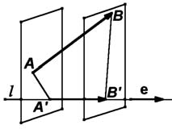

# Глава I. Векторная алгебра

## § 4. Скалярное произведение

**1. Определение.** Под углом между векторами мы понимаем угол между векторами, равными данным и имеющими общее начало. В некоторых случаях мы будем указывать от какого вектора и в каком направлении угол отсчитывается. Если такого указания не сделано, углом между векторами считается тот из углов, который не превосходит $\pi$. Если угол прямой, то векторы называются ортогональными.

О п р е д е л е н и е. *Скалярным произведением* двух векторов называется число, равное произведению длин этих векторов на косинус угла между ними. Если хоть один из векторов — нулевой, то угол не определен, и скалярное произведение по определению равно нулю.

Скалярное произведение векторов $\mathbf{a}$ и $\mathbf{b}$ обозначается $(\mathbf{a}, \mathbf{b})$ или $\mathbf{ab}$. Таким образом, мы можем написать

$$(\mathbf{a}, \mathbf{b}) = |\mathbf{a}|\,|\mathbf{b}|\cos\varphi,$$

где $\varphi$ — угол между векторами $\mathbf{a}$ и $\mathbf{b}$.

Необходимо подчеркнуть следующее принципиальное обстоятельство: скалярное произведение может быть определено только после того, как будет выбрана определенная единица измерения длин векторов. Иначе приведенное выше определение не имеет смысла.

---
**стр. 27**

---

**2. Свойства скалярного умножения.** Скалярное умножение имеет следующие очевидные свойства:

- Коммутативность: для любых $\mathbf{a}$ и $\mathbf{b}$ выполнено $(\mathbf{a}, \mathbf{b}) = (\mathbf{b}, \mathbf{a})$.
- $(\mathbf{a}, \mathbf{a}) = |\mathbf{a}|^2$ для любого вектора $\mathbf{a}$.
- Скалярное произведение равно нулю тогда и только тогда, когда сомножители ортогональны или хотя бы один из них равен $\mathbf{0}$.
- Если $(\mathbf{a}, \mathbf{x}) = 0$ для любого вектора $\mathbf{x}$, то $\mathbf{a} = \mathbf{0}$. Действительно, при $\mathbf{x} = \mathbf{a}$ мы получаем $(\mathbf{a}, \mathbf{a}) = 0$.
- Векторы ортонормированного базиса удовлетворяют равенствам

$$(\mathbf{e}_1, \mathbf{e}_1) = (\mathbf{e}_2, \mathbf{e}_2) = (\mathbf{e}_3, \mathbf{e}_3) = 1, \quad (\mathbf{e}_1, \mathbf{e}_2) = (\mathbf{e}_2, \mathbf{e}_3) = (\mathbf{e}_3, \mathbf{e}_1) = 0.$$

**Предложение 1.** *Если базисные векторы $\mathbf{e}_1, \mathbf{e}_2, \mathbf{e}_3$ попарно ортогональны, то компоненты любого вектора $\mathbf{a}$ находятся по формулам*

$$\alpha_1 = \frac{(\mathbf{a}, \mathbf{e}_1)}{|\mathbf{e}_1|^2}, \quad \alpha_2 = \frac{(\mathbf{a}, \mathbf{e}_2)}{|\mathbf{e}_2|^2}, \quad \alpha_3 = \frac{(\mathbf{a}, \mathbf{e}_3)}{|\mathbf{e}_3|^2}.$$

*В частности, если базис ортонормированный*

$$\alpha_1 = (\mathbf{a}, \mathbf{e}_1), \quad \alpha_2 = (\mathbf{a}, \mathbf{e}_2), \quad \alpha_3 = (\mathbf{a}, \mathbf{e}_3)\tag{1}$$

*и*

$$\mathbf{a} = (\mathbf{a}, \mathbf{e}_1)\mathbf{e}_1 + (\mathbf{a}, \mathbf{e}_2)\mathbf{e}_2 + (\mathbf{a}, \mathbf{e}_3)\mathbf{e}_3.$$

В самом деле, пусть $\mathbf{e}_1, \mathbf{e}_2, \mathbf{e}_3$ — попарно ортогональны. Тогда векторы $\mathbf{e}_1^0 = \mathbf{e}_1/|\mathbf{e}_1|$, $\mathbf{e}_2^0 = \mathbf{e}_2/|\mathbf{e}_2|$, $\mathbf{e}_3^0 = \mathbf{e}_3/|\mathbf{e}_3|$ составляют ортонормированный базис. Как мы видели в предложении 2 § 2, компоненты произвольного вектора $\mathbf{a}$ в ортонормированном базисе можно вычислить как $\alpha_1 = |\mathbf{a}|\cos\varphi_1$, $\alpha_2 = |\mathbf{a}|\cos\varphi_2$, $\alpha_3 = |\mathbf{a}|\cos\varphi_3$, где $\varphi_1, \varphi_2$ и $\varphi_3$ — углы между $\mathbf{a}$ и векторами базиса. Значит $\alpha_1 = (\mathbf{a}, \mathbf{e}_1)/|\mathbf{e}_1|$,

---
**стр. 28**

---

$\alpha_2 = (\mathbf{a}, \mathbf{e}_2)/|\mathbf{e}_2|$ и $\alpha_3 = (\mathbf{a}, \mathbf{e}_3)/|\mathbf{e}_3|$. Поэтому

$$
\mathbf{a} = \frac{(\mathbf{a}, \mathbf{e}_1)}{|\mathbf{e}_1|}\mathbf{e}_1^0 + \frac{(\mathbf{a}, \mathbf{e}_2)}{|\mathbf{e}_2|}\mathbf{e}_2^0 + \frac{(\mathbf{a}, \mathbf{e}_3)}{|\mathbf{e}_3|}\mathbf{e}_3^0 =
$$
$$
= \frac{(\mathbf{a}, \mathbf{e}_1)}{|\mathbf{e}_1|}\cdot\frac{\mathbf{e}_1}{|\mathbf{e}_1|} + \frac{(\mathbf{a}, \mathbf{e}_2)}{|\mathbf{e}_2|}\cdot\frac{\mathbf{e}_2}{|\mathbf{e}_2|} + \frac{(\mathbf{a}, \mathbf{e}_3)}{|\mathbf{e}_3|}\cdot\frac{\mathbf{e}_3}{|\mathbf{e}_3|},
$$

как и требовалось.

**Предложение 2.** *Для любых векторов $\mathbf{a}$, $\mathbf{b}$ и $\mathbf{c}$ и любых чисел $\alpha$, $\beta$ и $\gamma$ выполнены равенства*

$$(\alpha\mathbf{a} + \beta\mathbf{b}, \mathbf{c}) = \alpha(\mathbf{a}, \mathbf{c}) + \beta(\mathbf{b}, \mathbf{c}) \quad \text{и}$$
$$(\mathbf{a}, \beta\mathbf{b} + \gamma\mathbf{c}) = \beta(\mathbf{a}, \mathbf{b}) + \gamma(\mathbf{a}, \mathbf{c}).$$

*В частности, $(\alpha\mathbf{a}, \mathbf{c}) = \alpha(\mathbf{a}, \mathbf{c})$ и $(\mathbf{a} + \mathbf{b}, \mathbf{c}) = (\mathbf{a}, \mathbf{c}) + (\mathbf{b}, \mathbf{c})$.*

Докажем первое равенство. Если $\mathbf{c} = \mathbf{0}$, то оно очевидно. Пусть $\mathbf{c} \neq \mathbf{0}$. Примем $\mathbf{c}$ за первый вектор базиса, а остальные выберем ортогонально к нему и между собой. Число $(\alpha\mathbf{a} + \beta\mathbf{b}, \mathbf{c})/|\mathbf{c}|^2$ — первая компонента вектора $\alpha\mathbf{a} + \beta\mathbf{b}$. Точно так же $(\mathbf{a}, \mathbf{c})/|\mathbf{c}|^2$ и $(\mathbf{b}, \mathbf{c})/|\mathbf{c}|^2$ — первые компоненты векторов $\mathbf{a}$ и $\mathbf{b}$. Согласно предложению 6 § 1,

$$(\alpha\mathbf{a} + \beta\mathbf{b}, \mathbf{c})/|\mathbf{c}|^2 = \alpha(\mathbf{a}, \mathbf{c})/|\mathbf{c}|^2 + \beta(\mathbf{b}, \mathbf{c})/|\mathbf{c}|^2.$$

Отсюда прямо следует первое равенство. Второе мы получим используя коммутативность скалярного умножения.

Последовательно применяя предложение 2, легко показать, что скобки также могут быть раскрыты при скалярном умножении линейных комбинаций любого числа векторов.

**Теорема 1.** *Если базис ортонормированный, то скалярное произведение векторов $\mathbf{a}$ и $\mathbf{b}$ выражается через их компоненты $(\alpha_1, \alpha_2, \alpha_3)$ и $(\beta_1, \beta_2, \beta_3)$ по формуле*

$$(\mathbf{a}, \mathbf{b}) = \alpha_1\beta_1 + \alpha_2\beta_2 + \alpha_3\beta_3.\tag{2}$$

Действительно, подставим вместо $\mathbf{b}$ его разложение и воспользуемся предложением 2:

$$(\mathbf{a}, \mathbf{b}) = (\mathbf{a}, \beta_1\mathbf{e}_1 + \beta_2\mathbf{e}_2 + \beta_3\mathbf{e}_3) = \beta_1(\mathbf{a}, \mathbf{e}_1) + \beta_2(\mathbf{a}, \mathbf{e}_2) + \beta_3(\mathbf{a}, \mathbf{e}_3).$$

Теперь доказываемое следует из формул (1).

---
**стр. 29**

---

Теорема 1 позволяет выписать выражение длины вектора через его компоненты в ортонормированном базисе

$$|\mathbf{a}| = \sqrt{\alpha_1^2 + \alpha_2^2 + \alpha_3^2},\tag{3}$$

а также выражение косинуса угла между векторами

$$\cos\varphi = \frac{(\mathbf{a}, \mathbf{b})}{|\mathbf{a}|\,|\mathbf{b}|} = \frac{\alpha_1\beta_1 + \alpha_2\beta_2 + \alpha_3\beta_3}{\sqrt{\alpha_1^2 + \alpha_2^2 + \alpha_3^2}\sqrt{\beta_1^2 + \beta_2^2 + \beta_3^2}}.\tag{4}$$

Используя формулу (3), мы можем вычислить расстояние между двумя точками, если заданы их координаты в декартовой прямоугольной системе координат. В самом деле, пусть точки $A$ и $B$ имеют координаты $(x, y, z)$ и $(x_1, y_1, z_1)$. Тогда расстояние между ними равно

$$|\overrightarrow{AB}| = \sqrt{(x_1-x)^2 + (y_1-y)^2 + (z_1-z)^2}.\tag{5}$$

Отметим, что требование ортонормированности базиса очень существенно. В произвольном базисе выражение скалярного произведения через компоненты гораздо сложнее. Поэтому в задачах, связанных со скалярным произведением, чаще всего используются ортонормированные базисы.

Если почему-либо все же надо вычислить скалярное произведение в неортонормированном базисе, следует перемножить разложения сомножителей по базису и раскрыть скобки. После этого нужно подставить в полученное выражение скалярные произведения базисных векторов, которые должны быть известны.

**3. Биортогональный базис.** Однако, для общих рассуждений указанный выше способ вычисления скалярного произведения в неортогональном базисе не всегда удобен. В таких случаях часто применяется так называемый биортогональный базис.

Пусть задан базис $\mathbf{e}_1, \mathbf{e}_2, \mathbf{e}_3$. Рассмотрим векторы $\mathbf{e}_1^*, \mathbf{e}_2^*, \mathbf{e}_3^*$, которые для любых номеров $i$ и $j$ удовлетворяют равенствам

$$(\mathbf{e}_i, \mathbf{e}_j^*) = \begin{cases} 0, & \text{если } i \neq j \\ 1, & \text{если } i = j \end{cases}.\tag{6}$$

---
**стр. 30**

---

Векторы $\mathbf{e}_1^*, \mathbf{e}_2^*, \mathbf{e}_3^*$ однозначно определены этими условиями. Действительно, например, $\mathbf{e}_1^*$ коллинеарен прямой, перпендикулярной плоскости векторов $\mathbf{e}_2$ и $\mathbf{e}_3$. Его направление вдоль этой прямой и длина определены равенством $(\mathbf{e}_1, \mathbf{e}_1^*) = 1$: он направлен так, что угол $\alpha$ между ним и $\mathbf{e}_1$ острый, а его длина равна $(|\mathbf{e}_1|\cos\alpha)^{-1}$.

**Предложение 3.** *Векторы $\mathbf{e}_1^*, \mathbf{e}_2^*, \mathbf{e}_3^*$, определенные равенствами (6), составляют базис.*

Действительно, возьмем произвольный вектор $\mathbf{x}$ и допустим, что он раскладывается по этим векторам: $\mathbf{x} = \xi_1^*\mathbf{e}_1^* + \xi_2^*\mathbf{e}_2^* + \xi_3^*\mathbf{e}_3^*$. Умножая это равенство скалярно последовательно на $\mathbf{e}_1, \mathbf{e}_2, \mathbf{e}_3$, мы найдем

$$\xi_1^* = (\mathbf{x}, \mathbf{e}_1), \quad \xi_2^* = (\mathbf{x}, \mathbf{e}_2), \quad \xi_3^* = (\mathbf{x}, \mathbf{e}_3).\tag{7}$$

Таким образом, каждый вектор, который раскладывается по $\mathbf{e}_1^*, \mathbf{e}_2^*, \mathbf{e}_3^*$ (в том числе и нулевой) раскладывается однозначно. Это означает, что векторы линейно независимы и, следовательно, составляют базис. Это и требовалось доказать.

О п р е д е л е н и е. Базис, определяемый равенствами (6), называется базисом, *биортогональным* или *взаимным* базису $\mathbf{e}_1, \mathbf{e}_2, \mathbf{e}_3$.

Если базис ортонормированный, то он совпадает со своим биортогональным.

Одновременно с предложением 3 мы доказали, что для любого вектора $\mathbf{x}$ имеет место разложение:

$$\mathbf{x} = (\mathbf{x}, \mathbf{e}_1)\mathbf{e}_1^* + (\mathbf{x}, \mathbf{e}_2)\mathbf{e}_2^* + (\mathbf{x}, \mathbf{e}_3)\mathbf{e}_3^*.\tag{8}$$

Оба базиса входят в равенства (6) симметрично. Поэтому биортогональным для базиса $\mathbf{e}_1^*, \mathbf{e}_2^*, \mathbf{e}_3^*$ будет базис $\mathbf{e}_1, \mathbf{e}_2, \mathbf{e}_3$. Отсюда, в частности, следует, что для любого вектора $\mathbf{x}$ справедливо также разложение:

$$\mathbf{x} = (\mathbf{x}, \mathbf{e}_1^*)\mathbf{e}_1 + (\mathbf{x}, \mathbf{e}_2^*)\mathbf{e}_2 + (\mathbf{x}, \mathbf{e}_3^*)\mathbf{e}_3.\tag{9}$$

При заданном базисе $\mathbf{e}_1, \mathbf{e}_2, \mathbf{e}_3$ числа $\xi_1^* = (\mathbf{x}, \mathbf{e}_1)$, $\xi_2^* = (\mathbf{x}, \mathbf{e}_2)$, $\xi_3^* = (\mathbf{x}, \mathbf{e}_3)$ однозначно определяют вектор $\mathbf{x}$ по

---
**стр. 31**

---

формуле (8). Они называются *ковариантными координатами* вектора $\mathbf{x}$ в базисе $\mathbf{e}_1, \mathbf{e}_2, \mathbf{e}_3$. По отношению к биортогональному базису $\mathbf{e}_1^*, \mathbf{e}_2^*, \mathbf{e}_3^*$ — это его обыкновенные координаты. Обычные координаты, чтобы подчеркнуть их отличие от ковариантных координат, называют *контрвариантными* координатами.

Скалярное произведение векторов равно сумме произведений координат одного из них на ковариантные координаты другого. Действительно,

$$(\mathbf{a}, \mathbf{b}) = (\alpha_1\mathbf{e}_1 + \alpha_2\mathbf{e}_2 + \alpha_3\mathbf{e}_3, \mathbf{b}) =$$
$$= \alpha_1(\mathbf{e}_1, \mathbf{b}) + \alpha_2(\mathbf{e}_2, \mathbf{b}) + \alpha_3(\mathbf{e}_3, \mathbf{b}) =$$
$$= \alpha_1\beta_1^* + \alpha_2\beta_2^* + \alpha_3\beta_3^*.\tag{10}$$

На плоскости базис $\mathbf{e}_1^*, \mathbf{e}_2^*$, биортогональный базису $\mathbf{e}_1, \mathbf{e}_2$, определяется теми же формулами, и все сказанное о биортогональном базисе в пространстве с очевидными изменениями переносится на базисы на плоскости. Так равенства (8) и (9) должны содержать по два слагаемых, а в формулах (7) остаются только две координаты.

**4. Проекции.** Скалярное умножение тесно связано с понятием проекции вектора. Слово «проекция» употребляется в двух смыслах. Введем соответствующие определения.

Пусть задан вектор $\overrightarrow{AB}$ и некоторая прямая $l$. Опустим из точек $A$ и $B$ перпендикуляры на прямую и обозначим их основания $A'$ и $B'$ (рис. 12). Вектор $\overrightarrow{A'B'}$ называется (ортогональной) *векторной проекцией* вектора $\overrightarrow{AB}$ на прямую $l$ и обозначается $\mathbf{Пр}_l\overrightarrow{AB}$.

Из определения сразу следует, что векторные проекции равных векторов на параллельные прямые равны между собой.

Пусть $\mathbf{e}$ — ненулевой вектор на прямой $l$. Тогда $\overrightarrow{A'B'} = \alpha\mathbf{e}$ при некотором $\alpha$. Заметим, что $\overrightarrow{AB} = \overrightarrow{AA'} + \overrightarrow{A'B'} + \overrightarrow{B'B}$, где

---
**стр. 32**

---

$\overrightarrow{AA'}$ и $\overrightarrow{B'B}$ ортогональны $\mathbf{e}$. Значит, после скалярного умножения на $\mathbf{e}$ мы получим $(\overrightarrow{AB}, \mathbf{e}) = (\overrightarrow{A'B'}, \mathbf{e}) = \alpha(\mathbf{e}, \mathbf{e})$. Находя отсюда $\alpha$, имеем

$$\overrightarrow{A'B'} = \mathbf{Пр}_l\overrightarrow{AB} = \frac{(\overrightarrow{AB}, \mathbf{e})}{|\mathbf{e}|^2}\mathbf{e}.\tag{11}$$

Хотя на вид это выражение зависит от $\mathbf{e}$, фактически оно не меняется при замене $\mathbf{e}$ любым ненулевым вектором $\lambda\mathbf{e}$, коллинеарным $\mathbf{e}$.

Проекцию $\overrightarrow{A'B'}$ можно представить в виде

$$\frac{(\overrightarrow{AB}, \mathbf{e})}{|\mathbf{e}|}\cdot\frac{\mathbf{e}}{|\mathbf{e}|}$$

и заметить, что $(\overrightarrow{AB}, \mathbf{e})/|\mathbf{e}|$ — это компонента $\overrightarrow{A'B'}$ по вектору $\mathbf{e}^0 = \mathbf{e}/|\mathbf{e}|$. Так как $|\mathbf{e}^0| = 1$, компонента по абсолютной величине равна длине $\overrightarrow{A'B'}$. Она положительна, если направление $\overrightarrow{A'B'}$ совпадает с направлением $\mathbf{e}$, и отрицательна в противоположном случае.

Величина $(\overrightarrow{AB}, \mathbf{e})/|\mathbf{e}|$ не меняется при замене $\mathbf{e}$ на сонаправленный вектор $\lambda\mathbf{e}$, $\lambda > 0$ и меняет знак при замене $\mathbf{e}$ на противоположно направленный вектор.

Прямая линия называется *направленной прямой* (употребляются также термины *ориентированная прямая* и *ось*), если на ней указано определенное направление. Подробнее это определение рассматривается в начале § 5.

О п р е д е л е н и е. Число $(\overrightarrow{AB}, \mathbf{e})/|\mathbf{e}|$ называется *скалярной проекцией* вектора $\overrightarrow{AB}$ на ось $l$, определяемую вектором $\mathbf{e}$, (или на вектор $\mathbf{e}$) и обозначается $\text{Пр}_l\overrightarrow{AB}$ или $\text{Пр}_{\mathbf{e}}\overrightarrow{AB}$.

Из определения следует, что

$$\text{Пр}_l\overrightarrow{AB} = |\overrightarrow{AB}|\cos\varphi,$$

где $\varphi$ — угол между $\overrightarrow{AB}$ и $\mathbf{e}$. Компоненты вектора в ортонормированном базисе равны его скалярным проекциям на оси координат.

---
**стр. 33**

---

### Упражнения

1. Пусть в некотором базисе скалярное произведение вычисляется по формуле (2). Докажите, что базис ортонормированный.

2. Используя свойства скалярного умножения, докажите, что высоты произвольного треугольника пересекаются в одной точке.

3. Нарисуйте правильный треугольник $ABC$ и примите длину его стороны за 1. Нарисуйте на том же чертеже базис, биортогональный базису $\overrightarrow{AB}, \overrightarrow{AC}$.

4. Найдите сумму векторных проекций вектора $\mathbf{a}$ на стороны заданного правильного треугольника.

Решения всех четырех упражнений: [[../reshebnik_beklemishev/rbek_g01_s04|Решебник, Гл. I §4]].
