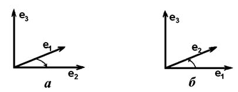
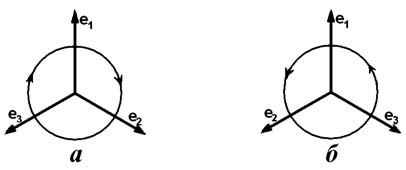
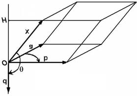

# Глава I. Векторная алгебра

## § 5. Смешанное и векторное произведения

**1. Ориентация прямой, плоскости и пространства.** В конце § 4 мы дали определение ориентированной прямой (оси). Скажем о нем подробнее с тем, чтобы аналогично ввести определение ориентированной плоскости и ориентированного пространства.

Все базисы (ненулевые векторы) на прямой разделяются на два класса: векторы из одного класса направлены одинаково, а векторы из разных классов направлены противоположно. Говорится, что прямая ориентирована, или что на ней задана *ориентация*, если из двух классов базисов выбран один. Базисы выбранного класса называются *положительно ориентированными* или *положительными*.

Задать ориентацию можно, указав какой-либо базис и считая положительно ориентированными все базисы того же класса. Однако то, что прямая ориентирована, не означает, что на ней выбран какой-то определенный базис.

Два базиса на плоскости называются *одинаково ориентированными*, если в обоих базисах кратчайший поворот от первого вектора ко второму производится в одну сторону, и *противоположно ориентированными* в противном случае. На рис. 11 а) базисы ориентированы одинаково, а на рис. 11 б) — противоположно. Если фиксировать какой то базис, то любой другой ориентирован с ним либо одинаково, либо противопо-

---
**стр. 34**

---

ложно, и, таким образом, все базисы распадаются на два класса: любые два базиса одного класса ориентированы одинаково, базисы разных классов ориентированы противоположно.

О п р е д е л е н и е. *Плоскость ориентирована*, если из двух классов базисов на ней выбран один класс.

Ориентацию можно задать, выбрав базис, и считая положительно ориентированными все базисы одного с ним класса. Но, конечно, задание ориентации не предполагает выбор определенного базиса.

В планиметрии часто ориентируют плоскость, считая положительными те базисы, у которых кратчайший поворот от первого вектора ко второму производится против часовой стрелки. Для плоскости в пространстве это соглашение не имеет смысла, так как видимое направление поворота зависит от того, с какой стороны смотреть на плоскость. Но если выбрать одно из полупространств, ограничиваемых плоскостью, и смотреть на повороты именно из него, то класс базиса определяется видимым направлением поворота.

О п р е д е л е н и е. Базис в пространстве называется *правым*, если (считая векторы имеющими общее начало) с конца третьего вектора мы видим кратчайший поворот от первого вектора ко второму направленным против часовой стрелки. В противном случае базис называется *левым* (рис. 13).

Представим себе, что на рис. 14 концы векторов лежат в плоскости рисунка, а их общее начало — за плоскостью. Тогда поворот от вектора $\mathbf{e}_1$ к вектору $\mathbf{e}_2$ и затем к $\mathbf{e}_3$ для правого

---
**стр. 35**

---

базиса нам виден против часовой стрелки, а для левого — по часовой стрелке.

О п р е д е л е н и е. *Пространство* называется *ориентированным*, если из двух классов базисов (правых или левых) выбран один. Базисы выбранного класса называются *положительно ориентированными*.

Ниже мы *всегда* будем выбирать правую ориентацию пространства, считая положительными правые базисы. Но важно помнить, что выбор ориентации мог бы быть противоположным.

Если пространство ориентировано, то ориентацию любой плоскости в нем можно задать, указав ориентацию прямой, перпендикулярной этой плоскости. При этом положительным базисом $\mathbf{a}$, $\mathbf{b}$ на плоскости считается такой, который вместе с положительным базисом $\mathbf{n}$ на прямой составляет положительный базис пространства $\mathbf{a}$, $\mathbf{b}$, $\mathbf{n}$. Это — внешний способ задания ориентации. Говорится, что *ориентация плоскости определяется нормальным вектором* $\mathbf{n}$.

Аналогично, в ориентированном пространстве можно внешним образом задать ориентацию прямой линии. Для этого нужно задать ориентацию плоскости, перпендикулярной этой прямой. Положительным базисом на прямой будет такой базис, который вместе с положительным базисом плоскости составляет положительный базис пространства.

**2. Площадь ориентированного параллелограмма, объем ориентированного параллелепипеда.** Если прямая ориен-

---
**стр. 36**

---

тирована, то длине ненулевого вектора на ней можно приписать знак: считать длину положительной, если вектор ориентирован положительно, и отрицательной в противоположном случае. Именно так мы приписываем знак длине векторной проекции, когда определяем скалярную проекцию. Обобщим это определение.

Рассмотрим параллелограмм, построенный на двух векторах так, что две его смежные стороны являются векторами с общим началом. *Параллелограмм называется ориентированным*, если пара векторов, на которой он построен, упорядочена. На ориентированной плоскости параллелограмм считается положительно или отрицательно ориентированным, смотря по тому, как ориентирована определяющая его пара векторов.

На ориентированной плоскости принято считать *площадь ориентированного параллелограмма* числом со знаком: она равна площади параллелограмма (положительна), если параллелограмм ориентирован положительно, и равна той же площади со знаком минус, если он ориентирован отрицательно. Мы будем обозначать площадь ориентированного параллелограмма, построенного на векторах $\mathbf{a}$ и $\mathbf{b}$, через $S_{\pm}(\mathbf{a}, \mathbf{b})$.

Рассмотрим теперь параллелепипед, построенный на трех векторах так, что три его ребра, исходящие из одной вершины, являются векторами с общим началом. Параллелепипед называется *ориентированным*, если эти три ребра упорядочены. В ориентированном пространстве ориентация параллелепипеда положительна или отрицательна смотря по тому, какую тройку образуют векторы, на которых он построен.

В ориентированном пространстве *объем ориентированного параллелепипеда* — число со знаком: объем положительно ориентированного параллелепипеда считается положительным, а отрицательно ориентированного — отрицательным.

При выбранной нами правой ориентации пространства положительными считаются объемы ориентированных параллелепипедов, построенных на правых тройках векторов.

**3. Смешанное произведение.** Если пространство ориентировано, мы можем ввести

О п р е д е л е н и е. *Смешанным произведением* векторов $\mathbf{a}$, $\mathbf{b}$ и $\mathbf{c}$ (в данном порядке) называется число, равное объе-

---
**стр. 37**

---

му ориентированного параллелепипеда, построенного на этих векторах, если они не компланарны, и равное нулю, если компланарны.

Смешанное произведение векторов $\mathbf{a}$, $\mathbf{b}$ и $\mathbf{c}$ обозначается $(\mathbf{a}, \mathbf{b}, \mathbf{c})$.

При перестановке сомножителей в смешанном произведении, самое большее, может измениться только ориентация тройки векторов. Поэтому абсолютная величина смешанного произведения не зависит от порядка сомножителей. Для любых векторов $\mathbf{a}$, $\mathbf{b}$ и $\mathbf{c}$ мы получаем, сравнивая ориентации троек векторов (см. рис. 14):

$$(\mathbf{a}, \mathbf{b}, \mathbf{c}) = (\mathbf{c}, \mathbf{a}, \mathbf{b}) = (\mathbf{b}, \mathbf{c}, \mathbf{a}) = -(\mathbf{b}, \mathbf{a}, \mathbf{c}) = -(\mathbf{c}, \mathbf{b}, \mathbf{a}) = -(\mathbf{a}, \mathbf{c}, \mathbf{b}).\tag{1}$$

Следующее предложение устанавливает связь между скалярным произведением и смешанным произведением.

**Предложение 1.** *Каковы бы ни были векторы $\mathbf{a}$ и $\mathbf{b}$, при выбранной ориентации пространства найдется единственный (не зависящий от $\mathbf{x}$) вектор $\mathbf{d}$ такой, что при любом $\mathbf{x}$ выполнено равенство*

$$(\mathbf{x}, \mathbf{a}, \mathbf{b}) = (\mathbf{x}, \mathbf{d}).\tag{2}$$

Д о к а з а т е л ь с т в о. Посмотрим сначала, какими свойствами должен обладать вектор $\mathbf{d}$, удовлетворяющий такому равенству. Если $\mathbf{a}$ и $\mathbf{b}$ коллинеарны, то $(\mathbf{x}, \mathbf{a}, \mathbf{b}) = 0$, и потому $(\mathbf{x}, \mathbf{d}) = 0$ при любом $\mathbf{x}$. Единственный вектор, перпендикулярный любому $\mathbf{x}$ — это нулевой. Таким образом, $\mathbf{d} = \mathbf{0}$ для коллинеарных $\mathbf{a}$ и $\mathbf{b}$. Наоборот, для неколлинеарных $\mathbf{a}$ и $\mathbf{b}$ вектор $\mathbf{d}$ нулевым быть не может, так как $(\mathbf{x}, \mathbf{a}, \mathbf{b}) \neq 0$ для любого не компланарного с ними вектора $\mathbf{x}$. Далее мы можем предполагать $\mathbf{a}$ и $\mathbf{b}$ неколлинеарными.

Если мы положим $\mathbf{x} = \mathbf{a}$, то найдем, что $(\mathbf{a}, \mathbf{d}) = 0$. Аналогично, при $\mathbf{x} = \mathbf{b}$ получаем $(\mathbf{b}, \mathbf{d}) = 0$. Таким образом, $\mathbf{d}$ перпендикулярен обоим векторам $\mathbf{a}$ и $\mathbf{b}$.

Равенство (2) должно выполняться и для самого вектора $\mathbf{d}$. Поэтому

$$(\mathbf{d}, \mathbf{a}, \mathbf{b}) = |\mathbf{d}|^2 > 0.\tag{3}$$

---
**стр. 38**

---

Это означает, что вектор $\mathbf{d}$ направлен так, что тройка векторов $\mathbf{d}$, $\mathbf{a}$, $\mathbf{b}$ положительно ориентирована.

Пусть $\mathbf{x} = \mathbf{d}/|\mathbf{d}|$. Тогда $(\mathbf{x}, \mathbf{a}, \mathbf{b}) = (\mathbf{x}, \mathbf{d}) = (\mathbf{d}, \mathbf{d})/|\mathbf{d}| = |\mathbf{d}|$. В левой части равенства — объем положительно ориентированного параллелепипеда, высота которого $|\mathbf{x}|$ равна единице. Этот объем численно равен площади основания $S$. Поэтому

$$|\mathbf{d}| = S = |\mathbf{a}|\,|\mathbf{b}|\sin\varphi,$$

где $\varphi$ — угол между векторами $\mathbf{a}$ и $\mathbf{b}$.

Итак, вектор $\mathbf{d}$ должен удовлетворять следующим условиям:

1. Вектор $\mathbf{d}$ нулевой тогда и только тогда, когда векторы $\mathbf{a}$ и $\mathbf{b}$ коллинеарны.
2. Если векторы $\mathbf{a}$ и $\mathbf{b}$ не коллинеарны, то
   - $|\mathbf{d}| = S = |\mathbf{a}|\,|\mathbf{b}|\sin\varphi$, где $\varphi$ — угол между векторами $\mathbf{a}$ и $\mathbf{b}$. (4)
   - $\mathbf{d}$ перпендикулярен векторам $\mathbf{a}$ и $\mathbf{b}$.
   - Тройка векторов $\mathbf{d}$, $\mathbf{a}$, $\mathbf{b}$ положительно ориентирована.

При выбранной ориентации пространства эти условия определяют вектор $\mathbf{d}$ так, что все векторы, им удовлетворяющие, равны между собой. Однако, нужно еще проверить, удовлетворяет ли такой вектор равенству (2) при любом $\mathbf{x}$. В случае коллинеарных $\mathbf{a}$ и $\mathbf{b}$ утвердительный ответ очевиден. Рассмотрим неколлинеарные $\mathbf{a}$ и $\mathbf{b}$ и построим по ним вектор $\mathbf{d}$. Если $\mathbf{x}$ компланарен с $\mathbf{a}$ и $\mathbf{b}$, обе части равенства (2) равны нулю.

Пусть $\mathbf{x}$ не компланарен с $\mathbf{a}$ и $\mathbf{b}$ (рис. 15). По определению скалярной проекции

$$\text{Пр}_{\mathbf{d}}\mathbf{x} = \frac{(\mathbf{x}, \mathbf{d})}{|\mathbf{d}|} = \pm|OH|.$$

---
**стр. 39**

---

При этом проекция положительна, если $\mathbf{d}$ и $\mathbf{x}$ направлены в одно полупространство относительно плоскости векторов $\mathbf{a}$ и $\mathbf{b}$, и отрицательна в противном случае. Таким образом, произведение $(\mathbf{x}, \mathbf{d}) = |\mathbf{d}|\text{Пр}_{\mathbf{d}}\mathbf{x}$ равно площади основания параллелепипеда $S = |\mathbf{d}|$, умноженной на $\pm|OH|$, где выбирается знак «+», если тройка $\mathbf{x}$, $\mathbf{a}$, $\mathbf{b}$ ориентирована положительно, и знак «−» в противном случае. Это заканчивает доказательство.

**4. Векторное произведение.** О п р е д е л е н и е. Вектор $\mathbf{d}$, определенный условиями (4), или, что то же, формулой (2), называется *векторным произведением* векторов $\mathbf{a}$ и $\mathbf{b}$.

Векторное произведение векторов $\mathbf{a}$ и $\mathbf{b}$ обозначают $[\mathbf{a}, \mathbf{b}]$ или $\mathbf{a} \times \mathbf{b}$. Используя это обозначение, мы можем написать формулу (2) в виде

$$(\mathbf{x}, \mathbf{a}, \mathbf{b}) = (\mathbf{x}, [\mathbf{a}, \mathbf{b}]).\tag{5}$$

Благодаря этому равенству смешанное произведение и получило свое название.

**Пример 1.** Пусть $\mathbf{e}_1$, $\mathbf{e}_2$, $\mathbf{e}_3$ — правый ортонормированный базис. Тогда при выбранной нами правой ориентации пространства

$$[\mathbf{e}_2, \mathbf{e}_3] = \mathbf{e}_1, \quad [\mathbf{e}_3, \mathbf{e}_1] = \mathbf{e}_2, \quad [\mathbf{e}_1, \mathbf{e}_2] = \mathbf{e}_3.\tag{6}$$

Если $\mathbf{f}_1$, $\mathbf{f}_2$, $\mathbf{f}_3$ — левый ортонормированный базис, то

$$[\mathbf{f}_2, \mathbf{f}_3] = -\mathbf{f}_1, \quad [\mathbf{f}_3, \mathbf{f}_1] = -\mathbf{f}_2, \quad [\mathbf{f}_1, \mathbf{f}_2] = -\mathbf{f}_3.$$

Подчеркнем, что для определения векторного произведения необходим не только выбор единицы измерения длин, но, как и для смешанного произведения, необходим выбор ориентации пространства. В самом деле, при изменении ориентации

---
**стр. 40**

---

левая часть формулы (2) меняет знак. При этом для сохранения равенства вектор $\mathbf{d}$ должен менять свое направление на противоположное. Это соответствует требованию того, чтобы тройка векторов $\mathbf{d}$, $\mathbf{b}$, $\mathbf{c}$ была положительно ориентирована.

Векторы, направление которых меняется при изменении ориентации пространства, называются *аксиальными* векторами. Из физических величин аксиальными векторами изображаются все те, в определение которых входит «правило правой руки» или какое-либо эквивалентное ему. Числа, знак которых меняется, как знак смешанного произведения, при изменении ориентации пространства, называются *псевдоскалярами*. Заметим, что

- Произведение аксиального вектора на псевдоскаляр — обычный вектор.
- Произведение обычного вектора на псевдоскаляр — вектор аксиальный.
- Векторное произведение обычного вектора и аксиального — обыкновенный вектор.
- Векторное произведение двух аксиальных векторов также аксиальный вектор.

Читатель без труда сможет продолжить этот список.

**Предложение 2.** *Векторное умножение антикоммутативно, то есть для любых векторов $[\mathbf{a}, \mathbf{b}] = -[\mathbf{b}, \mathbf{a}]$.*

Действительно, если $(\mathbf{x}, \mathbf{a}, \mathbf{b}) = (\mathbf{x}, \mathbf{d})$, то

$$(\mathbf{x}, \mathbf{b}, \mathbf{a}) = -(\mathbf{x}, \mathbf{d}) = (\mathbf{x}, (-\mathbf{d})).$$

Получим теперь свойство *линейности* смешанного и векторного произведений по каждому из сомножителей. Применяя предложение 2 § 4 к скалярному произведению $(\lambda\mathbf{a}_1 + \mu\mathbf{a}_2, [\mathbf{b}, \mathbf{c}])$, мы получим

$$(\lambda\mathbf{a}_1 + \mu\mathbf{a}_2, \mathbf{b}, \mathbf{c}) = \lambda(\mathbf{a}_1, \mathbf{b}, \mathbf{c}) + \mu(\mathbf{a}_2, \mathbf{b}, \mathbf{c}).\tag{7}$$

Из равенств (1) следуют аналогичные тождества для остальных сомножителей. Например, для второго сомножителя

$$(\mathbf{a}, \lambda\mathbf{b}_1 + \mu\mathbf{b}_2, \mathbf{c}) = \lambda(\mathbf{a}, \mathbf{b}_1, \mathbf{c}) + \mu(\mathbf{a}, \mathbf{b}_2, \mathbf{c}).\tag{8}$$

---
**стр. 41**

---

Действительно, мы можем переставить интересующий нас сомножитель на первое место, раскрыть скобки, а затем выполнить обратную перестановку.

**Предложение 3.** *Для любых векторов $\mathbf{b}_1$, $\mathbf{b}_2$, $\mathbf{c}$ и любых чисел $\lambda$ и $\mu$ имеет место равенство*

$$[\lambda\mathbf{b}_1 + \mu\mathbf{b}_2, \mathbf{c}] = \lambda[\mathbf{b}_1, \mathbf{c}] + \mu[\mathbf{b}_2, \mathbf{c}].$$

В самом деле, правой части формулы (8) можно придать вид $(\mathbf{a}, \lambda[\mathbf{b}_1, \mathbf{c}]) + (\mathbf{a}, \mu[\mathbf{b}_2, \mathbf{c}])$. Поэтому

$$(\mathbf{a}, [\lambda\mathbf{b}_1 + \mu\mathbf{b}_2, \mathbf{c}]) = (\mathbf{a}, \lambda[\mathbf{b}_1, \mathbf{c}] + \mu[\mathbf{b}_2, \mathbf{c}]).$$

Так как это верно для любого вектора $\mathbf{a}$, мы можем, выбрав ортонормированный базис $\mathbf{e}_1, \mathbf{e}_2, \mathbf{e}_3$, подставить на место $\mathbf{a}$ последовательно каждый вектор этого базиса. В силу предложения 1 § 4 мы получим равенство всех компонент векторов $[\lambda\mathbf{b}_1+\mu\mathbf{b}_2, \mathbf{c}]$ и $\lambda[\mathbf{b}_1,\mathbf{c}]+\mu[\mathbf{b}_2,\mathbf{c}]$, а отсюда и равенство векторов, которое нам нужно было доказать.

Линейность векторного произведения по второму сомножителю можно получить из свойства антикоммутативности.

**Предложение 4.** *Попарные векторные произведения $[\mathbf{b}, \mathbf{c}]$, $[\mathbf{c}, \mathbf{a}]$ и $[\mathbf{a}, \mathbf{b}]$ векторов $\mathbf{a}$, $\mathbf{b}$ и $\mathbf{c}$ линейно независимы тогда и только тогда, когда линейно независимы сами векторы $\mathbf{a}$, $\mathbf{b}$ и $\mathbf{c}$.*

Действительно, если $\mathbf{a}$, $\mathbf{b}$ и $\mathbf{c}$ все параллельны некоторой плоскости, то их попарные векторные произведения все перпендикулярны этой плоскости и значит коллинеарны.

Обратно, пусть векторы не компланарны, и $(\mathbf{a}, \mathbf{b}, \mathbf{c}) \neq 0$. Рассмотрим линейную комбинацию произведений $\lambda[\mathbf{b}, \mathbf{c}] + \mu[\mathbf{c}, \mathbf{a}] + \nu[\mathbf{a}, \mathbf{b}]$. Если она равна нулевому вектору, то умножим ее скалярно на $\mathbf{a}$. Мы получим $\lambda(\mathbf{a}, \mathbf{b}, \mathbf{c}) = 0$, откуда следует, что $\lambda = 0$. Аналогично, умножая на $\mathbf{b}$, $\mathbf{c}$, мы убедимся, что $\mu = 0$ и $\nu = 0$. Это означает, что рассматриваемые векторные произведения линейно независимы.

Пусть выбран базис $\mathbf{e}_1, \mathbf{e}_2, \mathbf{e}_3$. Как легко проверить, базис, составленный из векторов

$$\mathbf{e}_1^* = \frac{[\mathbf{e}_2, \mathbf{e}_3]}{(\mathbf{e}_1, \mathbf{e}_2, \mathbf{e}_3)}, \quad \mathbf{e}_2^* = \frac{[\mathbf{e}_3, \mathbf{e}_1]}{(\mathbf{e}_1, \mathbf{e}_2, \mathbf{e}_3)}, \quad \mathbf{e}_3^* = \frac{[\mathbf{e}_1, \mathbf{e}_2]}{(\mathbf{e}_1, \mathbf{e}_2, \mathbf{e}_3)},\tag{9}$$

---
**стр. 42**

---

удовлетворяет равенствам (6) § 4 и потому является *биортогональным* для базиса $\mathbf{e}_1, \mathbf{e}_2, \mathbf{e}_3$.

Обратите внимание, что эти векторы не являются аксиальными, хотя и коллинеарны соответствующим векторным произведениям.

**5. Выражение векторного и смешанного произведений через компоненты сомножителей.** Если заданы разложения векторов $\mathbf{a}$ и $\mathbf{b}$ по векторам некоторого базиса $\mathbf{e}_1, \mathbf{e}_2, \mathbf{e}_3$, то мы можем раскрыть скобки

$$[\mathbf{a}, \mathbf{b}] = [(\alpha_1\mathbf{e}_1 + \alpha_2\mathbf{e}_2 + \alpha_3\mathbf{e}_3), (\beta_1\mathbf{e}_1 + \beta_2\mathbf{e}_2 + \beta_3\mathbf{e}_3)] =$$
$$= (\alpha_1\beta_2 - \alpha_2\beta_1)[\mathbf{e}_1, \mathbf{e}_2] + (\alpha_2\beta_3 - \alpha_3\beta_2)[\mathbf{e}_2, \mathbf{e}_3]+$$
$$+ (\alpha_3\beta_1 - \alpha_1\beta_3)[\mathbf{e}_3, \mathbf{e}_1].\tag{10}$$

Здесь использовалась антикоммутативность векторного произведения и то, что векторное произведение двух одинаковых сомножителей — нулевой вектор. В примере 1 были сосчитаны попарные векторные произведения векторов ортонормированного базиса. Поэтому в случае ортонормированного базиса из формулы (10) следует

**Теорема 1.** *В положительно ориентированном ортонормированном базисе векторное произведение выражается через компоненты сомножителей формулой*

$$[\mathbf{a}, \mathbf{b}] = (\alpha_2\beta_3 - \alpha_3\beta_2)\mathbf{e}_1 + (\alpha_3\beta_1 - \alpha_1\beta_3)\mathbf{e}_2 + (\alpha_1\beta_2 - \alpha_2\beta_1)\mathbf{e}_3.\tag{11}$$

*Если базис ориентирован отрицательно, перед правой частью этой формулы следует поставить знак минус.*

Для произвольного базиса нетрудно получить ковариантные координаты векторного произведения. Действительно, сравнение формул (10) и (9) показывает, что

$$[\mathbf{a}, \mathbf{b}] = (\alpha_2\beta_3 - \alpha_3\beta_2)(\mathbf{e}_1, \mathbf{e}_2, \mathbf{e}_3)\mathbf{e}_1^*+$$
$$+ (\alpha_3\beta_1 - \alpha_1\beta_3)(\mathbf{e}_1, \mathbf{e}_2, \mathbf{e}_3)\mathbf{e}_2^* + (\alpha_1\beta_2 - \alpha_2\beta_1)(\mathbf{e}_1, \mathbf{e}_2, \mathbf{e}_3)\mathbf{e}_3^*.$$

Избежать постоянной заботы об ориентации базисов можно двумя способами. Можно договориться при правой ориен-

---
**стр. 43**

---

тации пространства, если не оговорено противное, использовать только правые базисы. Такого соглашения мы и будем придерживаться.

Второй способ состоит в том, чтобы не фиксировать заранее ориентацию пространства, а выбирать ее так, чтобы используемый базис был ориентирован положительно. При таком подходе векторное произведение всегда вычисляется по формуле (11), но приходится следить за тем, как векторное произведение направлено. Этот подход принят, например, в литературе по физике.

**Теорема 2.** *Смешанное произведение векторов $\mathbf{a}$, $\mathbf{b}$ и $\mathbf{c}$ выражается через их компоненты $(\alpha_1, \alpha_2, \alpha_3)$, $(\beta_1, \beta_2, \beta_3)$ и $(\gamma_1, \gamma_2, \gamma_3)$ в произвольном базисе $\mathbf{e}_1, \mathbf{e}_2, \mathbf{e}_3$ по формуле*

$$(\mathbf{a}, \mathbf{b}, \mathbf{c}) = (\alpha_1\beta_2\gamma_3 + \alpha_2\beta_3\gamma_1 + \alpha_3\beta_1\gamma_2 -$$
$$- \alpha_3\beta_2\gamma_1 - \alpha_2\beta_1\gamma_3 - \alpha_1\beta_3\gamma_2)(\mathbf{e}_1, \mathbf{e}_2, \mathbf{e}_3).$$

Для доказательства заметим, что $(\mathbf{a}, \mathbf{b}, \mathbf{c}) = (\mathbf{c}, [\mathbf{a}, \mathbf{b}])$ и умножим скалярно обе части равенства (10) на вектор $\mathbf{c} = \gamma_1\mathbf{e}_1+\gamma_2\mathbf{e}_2+\gamma_3\mathbf{e}_3$. Мы получим

$$(\mathbf{a}, \mathbf{b}, \mathbf{c}) = \gamma_1(\alpha_2\beta_3 - \alpha_3\beta_2)(\mathbf{e}_1, [\mathbf{e}_2, \mathbf{e}_3])+$$
$$+ \gamma_2(\alpha_3\beta_1 - \alpha_1\beta_3)(\mathbf{e}_2, [\mathbf{e}_3, \mathbf{e}_1])+$$
$$+ \gamma_3(\alpha_1\beta_2 - \alpha_2\beta_1)(\mathbf{e}_3, [\mathbf{e}_1, \mathbf{e}_2]).$$

(Слагаемые, содержащие смешанные произведения с одинаковыми сомножителями, мы не выписываем, так как они равны нулю.) Отсюда, учитывая равенства (1) и приводя подобные члены, мы получаем нужный нам результат.

**6. Детерминанты второго и третьего порядков.** Найденные нами формулы достаточно громоздки. Для их более компактной записи употребляются детерминанты (или определители) второго и третьего порядков.

Рассмотрим четыре числа $\alpha_1, \alpha_2, \beta_1, \beta_2$. Из них можно составить таблицу, называемую *матрицей второго порядка*:

$$\begin{Vmatrix} \alpha_1 & \alpha_2 \\ \beta_1 & \beta_2 \end{Vmatrix}.$$

---
**стр. 44**

---

Число $\alpha_1\beta_2 - \alpha_2\beta_1$ называется *детерминантом этой матрицы* или просто *детерминантом второго порядка* и обозначается

$$\begin{vmatrix} \alpha_1 & \alpha_2 \\ \beta_1 & \beta_2 \end{vmatrix}.$$

Теперь выражение векторного произведения в правом ортонормированном базисе перепишется так:

$$[\mathbf{a}, \mathbf{b}] = \begin{vmatrix} \alpha_2 & \alpha_3 \\ \beta_2 & \beta_3 \end{vmatrix}\mathbf{e}_1 + \begin{vmatrix} \alpha_3 & \alpha_1 \\ \beta_3 & \beta_1 \end{vmatrix}\mathbf{e}_2 + \begin{vmatrix} \alpha_1 & \alpha_2 \\ \beta_1 & \beta_2 \end{vmatrix}\mathbf{e}_3.$$

Из компонент трех векторов можно составить таблицу — *матрицу третьего порядка*

$$\begin{Vmatrix} \alpha_1 & \alpha_2 & \alpha_3 \\ \beta_1 & \beta_2 & \beta_3 \\ \gamma_1 & \gamma_2 & \gamma_3 \end{Vmatrix}.$$

Число

$$\alpha_1\begin{vmatrix} \beta_2 & \beta_3 \\ \gamma_2 & \gamma_3 \end{vmatrix} + \alpha_2\begin{vmatrix} \beta_3 & \beta_1 \\ \gamma_3 & \gamma_1 \end{vmatrix} + \alpha_3\begin{vmatrix} \beta_1 & \beta_2 \\ \gamma_1 & \gamma_2 \end{vmatrix}$$

или, что то же самое,

$$\alpha_1\beta_2\gamma_3 - \alpha_1\beta_3\gamma_2 + \alpha_2\beta_3\gamma_1 - \alpha_2\beta_1\gamma_3 + \alpha_3\beta_1\gamma_2 - \alpha_3\beta_2\gamma_1$$

называется *детерминантом этой матрицы* или *детерминантом третьего порядка* и обозначается

$$\begin{vmatrix} \alpha_1 & \alpha_2 & \alpha_3 \\ \beta_1 & \beta_2 & \beta_3 \\ \gamma_1 & \gamma_2 & \gamma_3 \end{vmatrix}.$$

По теореме 3 в новых обозначениях

$$(\mathbf{a}, \mathbf{b}, \mathbf{c}) = \begin{vmatrix} \alpha_1 & \alpha_2 & \alpha_3 \\ \beta_1 & \beta_2 & \beta_3 \\ \gamma_1 & \gamma_2 & \gamma_3 \end{vmatrix} (\mathbf{e}_1, \mathbf{e}_2, \mathbf{e}_3).\tag{12}$$

---
**стр. 45**

---

В частности, в правом ортонормированном базисе

$$(\mathbf{a}, \mathbf{b}, \mathbf{c}) = \begin{vmatrix} \alpha_1 & \alpha_2 & \alpha_3 \\ \beta_1 & \beta_2 & \beta_3 \\ \gamma_1 & \gamma_2 & \gamma_3 \end{vmatrix}.\tag{13}$$

При помощи теоремы 2 и определения детерминанта можно получить следующее выражение векторного произведения через компоненты сомножителей в правом ортонормированном базисе

$$[\mathbf{a}, \mathbf{b}] = \begin{vmatrix} \mathbf{e}_1 & \mathbf{e}_2 & \mathbf{e}_3 \\ \alpha_1 & \alpha_2 & \alpha_3 \\ \beta_1 & \beta_2 & \beta_3 \end{vmatrix}.\tag{14}$$

Остановимся на следующих свойствах детерминантов. Из равенств (1) следует, что детерминант меняет знак при перестановке каких-либо двух строк матрицы.

Формула (7) означает, что

$$\begin{vmatrix} \lambda a_1' + \mu a_1'' & \lambda a_2' + \mu a_2'' & \lambda a_3' + \mu a_3'' \\ b_1 & b_2 & b_3 \\ c_1 & c_2 & c_3 \end{vmatrix} =$$
$$= \lambda\begin{vmatrix} a_1' & a_2' & a_3' \\ b_1 & b_2 & b_3 \\ c_1 & c_2 & c_3 \end{vmatrix} + \mu\begin{vmatrix} a_1'' & a_2'' & a_3'' \\ b_1 & b_2 & b_3 \\ c_1 & c_2 & c_3 \end{vmatrix}.$$

**7. Условия коллинеарности и компланарности.** Получим условия на компоненты векторов в произвольном базисе, необходимые и достаточные для компланарности или коллинеарности векторов.

**Предложение 5.** *Равенство нулю детерминанта матрицы из компонент трех векторов необходимо и достаточно для компланарности векторов.*

Это — прямое следствие формулы (12), поскольку $(\mathbf{e}_1, \mathbf{e}_2, \mathbf{e}_3) \neq 0$.

**Предложение 6.** *Пусть $(\alpha_1, \alpha_2, \alpha_3)$ и $(\beta_1, \beta_2, \beta_3)$ — компоненты векторов $\mathbf{a}$ и $\mathbf{b}$ в некотором базисе. Эти векторы коллинеарны тогда и только тогда, когда*

---
**стр. 46**

---

$$\begin{vmatrix} \alpha_2 & \alpha_3 \\ \beta_2 & \beta_3 \end{vmatrix} = \begin{vmatrix} \alpha_3 & \alpha_1 \\ \beta_3 & \beta_1 \end{vmatrix} = \begin{vmatrix} \alpha_1 & \alpha_2 \\ \beta_1 & \beta_2 \end{vmatrix} = 0.\tag{15}$$

Достаточность условия очевидна: из равенств (15) по формуле (10) следует обращение в нуль $[\mathbf{a}, \mathbf{b}]$, что равносильно коллинеарности векторов. Заметим, что мы пользуемся формулой (10), которая справедлива для произвольного базиса. Наоборот, из обращения в нуль $[\mathbf{a}, \mathbf{b}]$ и формулы (10) мы можем вывести (15), так как векторы $[\mathbf{e}_2, \mathbf{e}_3]$, $[\mathbf{e}_3, \mathbf{e}_1]$ и $[\mathbf{e}_1, \mathbf{e}_2]$ линейно независимы.

В планиметрии признак коллинеарности двух векторов дает

**Предложение 7.** *Обращение в нуль детерминанта матрицы из компонент двух векторов на плоскости необходимо и достаточно для коллинеарности этих векторов.*

Для доказательства будем считать, что плоскость помещена в пространство, и базис в этой плоскости дополнен третьим вектором до базиса в пространстве. Тогда векторы $\mathbf{a}(\alpha_1, \alpha_2)$ и $\mathbf{b}(\beta_1, \beta_2)$ на плоскости имеют компоненты $(\alpha_1, \alpha_2, 0)$ и $(\beta_1, \beta_2, 0)$ относительно базиса в пространстве. Применяя предложение 6, получаем условие

$$\begin{vmatrix} \alpha_1 & \alpha_2 \\ \beta_1 & \beta_2 \end{vmatrix} = 0.$$

Остальные два детерминанта равны нулю, так как $\alpha_3 = \beta_3 = 0$.

**8. Системы линейных уравнений.** Детерминанты тесно связаны с системами линейных уравнений, решения которых удобно записывать с их помощью. Этим мы займемся в гл. V, а сейчас дадим только геометрическую иллюстрацию.

Пусть дана система из трех уравнений

$$a_1x + b_1y + c_1z = d_1,$$
$$a_2x + b_2y + c_2z = d_2,\tag{16}$$
$$a_3x + b_3y + c_3z = d_3.$$

Выберем в пространстве некоторый базис и рассмотрим векторы $\mathbf{a}(a_1, a_2, a_3)$, $\mathbf{b}(b_1, b_2, b_3)$, $\mathbf{c}(c_1, c_2, c_3)$ и $\mathbf{d}(d_1, d_2, d_3)$.

---
**стр. 47**

---

Тогда система является координатной записью векторного равенства

$$x\mathbf{a} + y\mathbf{b} + z\mathbf{c} = \mathbf{d}.\tag{17}$$

Поэтому решение системы $x$, $y$, $z$ — коэффициенты разложения $\mathbf{d}$ по $\mathbf{a}$, $\mathbf{b}$ и $\mathbf{c}$. Мы можем быть уверены, что система (16) имеет единственное решение тогда и только тогда, когда $\mathbf{a}$, $\mathbf{b}$ и $\mathbf{c}$ не компланарны.

Точно так же решение системы из двух линейных уравнений с двумя неизвестными

$$a_1x + b_1y = d_1,$$
$$a_2x + b_2y = d_2\tag{18}$$

— это компоненты разложения вектора $\mathbf{d}(d_1, d_2)$ по векторам $\mathbf{a}(a_1, a_2)$ и $\mathbf{b}(b_1, b_2)$, и система имеет единственное решение тогда и только тогда, когда $\mathbf{a}$ и $\mathbf{b}$ не коллинеарны. Теперь из предложений 5 и 7 следует

**Предложение 8.** *Система из трех уравнений с тремя неизвестными и система из двух уравнений с двумя неизвестными имеют единственное решение при любых свободных членах тогда и только тогда, когда детерминант матрицы из коэффициентов при неизвестных не равен нулю.*

Если выполнено условие $(\mathbf{a}, \mathbf{b}, \mathbf{c}) \neq 0$, то векторы $\mathbf{a}$, $\mathbf{b}$ и $\mathbf{c}$ составляют базис, и компоненты вектора $\mathbf{d}$ в этом базисе по формулам (9) § 4 равны $(\mathbf{d}, \mathbf{a}^*)$, $(\mathbf{d}, \mathbf{b}^*)$ и $(\mathbf{d}, \mathbf{c}^*)$, где $\mathbf{a}^*, \mathbf{b}^*, \mathbf{c}^*$ базис, биортогональный базису $\mathbf{a}, \mathbf{b}, \mathbf{c}$. Из формул (9) теперь следует, что

$$x = \frac{(\mathbf{d}, \mathbf{b}, \mathbf{c})}{(\mathbf{a}, \mathbf{b}, \mathbf{c})}, \quad y = \frac{(\mathbf{d}, \mathbf{c}, \mathbf{a})}{(\mathbf{a}, \mathbf{b}, \mathbf{c})}, \quad z = \frac{(\mathbf{d}, \mathbf{a}, \mathbf{b})}{(\mathbf{a}, \mathbf{b}, \mathbf{c})}.\tag{19}$$

Следовательно, например, $x$ равен отношению детерминантов

$$\begin{vmatrix} d_1 & d_2 & d_3 \\ b_1 & b_2 & b_3 \\ c_1 & c_2 & c_3 \end{vmatrix} \quad \text{и} \quad \begin{vmatrix} a_1 & a_2 & a_3 \\ b_1 & b_2 & b_3 \\ c_1 & c_2 & c_3 \end{vmatrix}.$$

Аналогично находятся и остальные неизвестные. Формулы (19) выражают *правило Крамера*.

---
**стр. 48**

---

**9. Площадь параллелограмма.** Если в пространстве заданы два неколлинеарных вектора, имеющих общее начало, то площадь параллелограмма, построенного на этих векторах, может быть найдена через их компоненты в ортонормированном базисе по формуле

$$S = |[\mathbf{a}, \mathbf{b}]| =$$
$$= \sqrt{(\alpha_2\beta_3 - \alpha_3\beta_2)^2+(\alpha_3\beta_1 - \alpha_1\beta_3)^2+(\alpha_1\beta_2-\alpha_2\beta_1)^2}.\tag{20}$$

Еще одно выражение для площади параллелограмма мы получим, если заметим, что

$$|[\mathbf{a}, \mathbf{b}]|^2 = |\mathbf{a}|^2|\mathbf{b}|^2\sin^2\varphi = |\mathbf{a}|^2|\mathbf{b}|^2(1-\cos^2\varphi).$$

В результате

$$S^2 = \begin{vmatrix} |\mathbf{a}|^2 & (\mathbf{a}, \mathbf{b}) \\ (\mathbf{a}, \mathbf{b}) & |\mathbf{b}|^2 \end{vmatrix}.\tag{21}$$

Найдем теперь площадь ориентированного параллелограмма на ориентированной плоскости. Пусть ориентацию плоскости определяет вектор $\mathbf{n}$, перпендикулярный плоскости и составляющий правую тройку с положительным базисом на плоскости. Будем предполагать, что $|\mathbf{n}| = 1$.

Рассмотрим ориентированный параллелограмм, построенный на векторах $\mathbf{a}$ и $\mathbf{b}$. Смешанное произведение $(\mathbf{a}, \mathbf{b}, \mathbf{n})$ по абсолютной величине равно его площади, так как это — объем параллелепипеда с таким основанием и высотой, равной 1. Кроме того, $(\mathbf{a}, \mathbf{b}, \mathbf{n})$ положительно, если пара векторов $\mathbf{a}$ и $\mathbf{b}$ положительно ориентирована, и отрицательно в противном случае. Таким образом,

$$S_{\pm}(\mathbf{a}, \mathbf{b}) = (\mathbf{a}, \mathbf{b}, \mathbf{n}).$$

На плоскости выберем произвольный, не обязательно положительно ориентированный, базис $\mathbf{e}_1, \mathbf{e}_2$ и примем $\mathbf{n}$ за третий базисный вектор. Выразим смешанное произведение через координаты сомножителей по формуле (12):

$$S_{\pm}(\mathbf{a}, \mathbf{b}) = \begin{vmatrix} \alpha_1 & \alpha_2 & 0 \\ \beta_1 & \beta_2 & 0 \\ 0 & 0 & 1 \end{vmatrix} (\mathbf{e}_1, \mathbf{e}_2, \mathbf{n}).$$

---
**стр. 49**

---

Вычисляя детерминант, находим, что он равен $\alpha_1\beta_2-\alpha_2\beta_1$, и получаем окончательное выражение

$$S_{\pm}(\mathbf{a}, \mathbf{b}) = \begin{vmatrix} \alpha_1 & \alpha_2 \\ \beta_1 & \beta_2 \end{vmatrix} S_{\pm}(\mathbf{e}_1, \mathbf{e}_2).\tag{22}$$

Эта формула сходна с формулой (12). По существу, это та же формула, написанная для двумерного пространства. Если $\mathbf{e}_1, \mathbf{e}_2$ — положительный ортонормированный базис, то

$$S_{\pm}(\mathbf{a}, \mathbf{b}) = \alpha_1\beta_2 - \alpha_2\beta_1.\tag{23}$$

Для площади неориентированного параллелограмма в ортонормированном базисе мы получаем формулу

$$S = |\alpha_1\beta_2 - \alpha_2\beta_1|,\tag{24}$$

которая следует и из (20).

**10. Двойное векторное произведение.** Выражение $[\mathbf{a}, [\mathbf{b}, \mathbf{c}]]$ называется *двойным векторным произведением*. Докажем, что

$$[\mathbf{a}, [\mathbf{b}, \mathbf{c}]] = (\mathbf{a}, \mathbf{c})\mathbf{b} - (\mathbf{a}, \mathbf{b})\mathbf{c}.\tag{25}$$

С этой целью выберем правый ортонормированный базис $\mathbf{e}_1, \mathbf{e}_2, \mathbf{e}_3$ так, чтобы $\mathbf{e}_1$ был коллинеарен $\mathbf{b}$, а $\mathbf{e}_2$ был компланарен $\mathbf{b}$ и $\mathbf{c}$. Тогда $\mathbf{b} = \beta\mathbf{e}_1$, $\mathbf{c} = \gamma_1\mathbf{e}_1 + \gamma_2\mathbf{e}_2$ и $\mathbf{a} = \alpha_1\mathbf{e}_1 + \alpha_2\mathbf{e}_2 + \alpha_3\mathbf{e}_3$. Отсюда получаем $[\mathbf{b}, \mathbf{c}] = \beta\gamma_2\mathbf{e}_3$ и

$$[\mathbf{a}, [\mathbf{b}, \mathbf{c}]] = -\alpha_1\beta\gamma_2\mathbf{e}_2 + \alpha_2\beta\gamma_2\mathbf{e}_1.$$

С другой стороны,

$$(\mathbf{a}, \mathbf{c})\mathbf{b} = (\alpha_1\gamma_1 + \alpha_2\gamma_2)\beta\mathbf{e}_1 \quad \text{и} \quad (\mathbf{a}, \mathbf{b})\mathbf{c} = \alpha_1\beta(\gamma_1\mathbf{e}_1 + \gamma_2\mathbf{e}_2).$$

Разность правых частей двух последних равенств совпадает с найденным выше двойным векторным произведением. Это заканчивает доказательство.

**11. О векторных величинах.** В приложениях математики часто рассматриваются величины, изображаемые векторами: силы, скорости, моменты сил и т. д. Векторам,

---
**стр. 50**

---

изображающим такие величины, приписывается размерность. Не вдаваясь в существо дела, мы ограничимся изложением формальных правил действий с размерностями.

С формальной точки зрения размерность — это одночлен, составленный из какого-то набора символов. Такие одночлены перемножаются и делятся как обычные одночлены. Имеют место следующие правила действий с векторными величинами.

- Модуль векторной величины имеет ту же размерность, что и сама величина.
- Складывать векторные величины можно только в том случае, когда их размерности совпадают. При этом размерность суммы та же, что и у слагаемых.
- При умножении векторной величины на скалярную их размерности перемножаются.
- Скалярное, векторное и смешанное произведения имеют размерность, равную произведению размерностей сомножителей. Это легко следует из первого правила, определений скалярного и векторного произведений и формулы (5).

Для того чтобы изобразить векторную величину на чертеже, мы должны условиться о масштабе: сколькими единицами длины (например, см) мы будем изображать одну единицу данной размерности (например, км, м/сек, Н).

Если в векторном произведении сомножители имеют размерность длины, то произведение имеет размерность площади. Масштаб для изображения единиц площади выбирается так, чтобы одна единица площади изображалась одной линейной единицей. При этом длина векторного произведения будет численно равна площади параллелограмма, построенного на сомножителях.

Поскольку единица длины у нас выбрана раз навсегда и не меняется, указанное соглашение ни к каким противоречиям привести не может. Однако оно не так безобидно, как может показаться. Именно, два математика, пользующиеся этим

---
**стр. 51**

---

соглашением, но разными единицами длины (например, француз, пользующийся сантиметрами, и англичанин — дюймами), для одних и тех же векторов нарисуют не совпадающие векторные произведения. Как связаны длины этих произведений?

### Упражнения

1. Построены векторы, перпендикулярные граням произвольного тетраэдра, равные по длине площадям этих граней и направленные в сторону вершин, противоположных граням. Докажите, что сумма этих векторов равна $\mathbf{0}$.

2. Дан трехгранный угол. Используя свойства векторного произведения, найдите выражение какого-либо из его двугранных углов через плоские углы.

3. Пусть дан положительный базис на ориентированной плоскости такой, что $|\mathbf{e}_1| = 2$, $|\mathbf{e}_2| = 3$ и $(\mathbf{e}_1, \mathbf{e}_2) = 2$. Найдите площадь ориентированного параллелограмма, построенного на векторах $\mathbf{a}(1, 2)$ и $\mathbf{b}(2, 1)$.

4. При каком условии на матрицу перехода от одного базиса к другому оба базиса ориентированы одинаково? Вопрос поставлен как для плоскости, так и для пространства.

5. Какова размерность векторов взаимного базиса $\mathbf{e}_1^*, \mathbf{e}_2^*, \mathbf{e}_3^*$, если векторы базиса $\mathbf{e}_1, \mathbf{e}_2, \mathbf{e}_3$ измеряются в сантиметрах?

6. Пусть стороны треугольника $P_1P_2P_3$ равны медианам треугольника $A_1A_2A_3$. Найдите отношение площадей этих треугольников.

Решения всех шести упражнений: [[../reshebnik_beklemishev/rbek_g01_s05|Решебник, Гл. I §5]].
