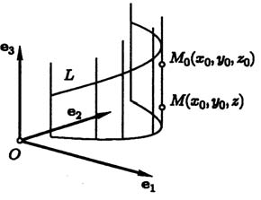
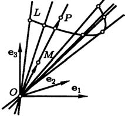

# Глава II. Прямые линии и плоскости

## § 1. Общее понятие об уравнениях

---
**стр. 52**
---

**1. Определения.** Начнем с простого примера. Пусть в пространстве задана декартова прямоугольная система координат. Рассмотрим сферу радиуса $r$, центр которой находится в точке $P$ с координатами $(a, b, c)$. Сфера — множество всех точек, отстоящих от центра на одно и то же расстояние $r$. Обозначим через $(x, y, z)$ координаты некоторой точки $M$ и выразим через них равенство $|\overrightarrow{PM}| = r$:

$$\sqrt{(x-a)^2 + (y-b)^2 + (z-c)^2} = r. \tag{1}$$

Возводя в квадрат обе части равенства, мы придадим ему более удобную форму

$$(x-a)^2 + (y-b)^2 + (z-c)^2 = r^2. \tag{2}$$

Очевидно, что это равенство выполнено для всех точек сферы и только для них, и, следовательно, его можно рассматривать как запись определения сферы при помощи координат. Равенство (2) называется *уравнением сферы* в рассматриваемой системе координат.

Приведем пример из геометрии на плоскости. *Графиком* функции $f$ называется линия $L$, состоящая из точек, координаты которых связаны соотношением $y = f(x)$. Если нас интересует, в первую очередь, линия, а не функция, мы можем встать на другую точку зрения и считать, что соотношение $y = f(x)$ есть уравнение линии $L$.

---
**стр. 53**

---

Вообще, под *уравнением множества* $S$ в некоторой системе координат следует понимать выражение определения множества $S$ через координаты его точек, то есть высказывание, верное для координат всех точек множества и неверное для координат точек, ему не принадлежащих.

Чаще всего, уравнение представляет собой равенство, записанное «математическими символами», но это вовсе не обязательно: оно может быть словесным описанием, перечислением и т. д. Например, высказывание «обе координаты точки — рациональные числа» мы будем считать уравнением соответствующего множества в какой-либо заранее выбранной системе координат. Это должно звучать естественно для читателя, знакомого со способами задания функций.

Часто уравнению множества точек в планиметрии можно придать вид $F(x, y) = 0$, а в стереометрии — $F(x, y, z) = 0$, где $F$ — функция, соответственно, двух или трех переменных. Уравнение сферы (2) имеет такой вид, если не замечать то несущественное обстоятельство, что член $r^2$ написан в другой части равенства.

Может случиться, что уравнение какого-либо множества удобнее записать в виде неравенства. Например, шар, ограниченный сферой с уравнением (2), имеет уравнение

$$(x-a)^2 + (y-b)^2 + (z-c)^2 \leqslant r^2.$$

Однако напрасно было бы надеяться разделить множества на такие, которые задаются равенствами, и такие, которые задаются неравенствами. Действительно, равенство

$$\Phi(x, y, z) = F(x, y, z) - |F(x, y, z)| = 0$$

задает то же множество, что и неравенство $F(x, y, z) \geqslant 0$.

Следует подчеркнуть зависимость уравнения от системы координат. При изменении системы координат меняются координаты точки, а потому уравнения одного и того же множества в разных системах координат, вообще говоря, различны.

---
**стр. 54**

---

Обучаясь математике, мы знакомимся с логическими и математическими правилами, по которым из одного верного высказывания можно получить другое верное высказывание. Строгое изучение этих правил относится к специальной науке — математической логике. Мы же, формулируя приведенные ниже предложения, просто будем считать, что такие правила известны. Естественно поэтому, что о доказательстве этих предложений не может быть речи.

- Если $P_S$ и $P_T$ — уравнения множеств $S$ и $T$, то уравнение пересечения $S \cap T$ есть высказывание, состоящее в том, что $P_S$ и $P_T$ верны одновременно. Такое высказывание обозначается $P_S \wedge P_T$.

  В случае, когда $P_S$ и $P_T$ — равенства, содержащие координаты точки, $F_S(x,y,z) = 0$ и $F_T(x,y,z) = 0$, уравнение пересечения есть система уравнений

  $$F_S(x,y,z) = 0, \quad F_T(x,y,z) = 0.$$

- Если $P_S$ и $P_T$ — уравнения множеств $S$ и $T$, то уравнение объединения $S \cup T$ — высказывание, состоящее в том, что из $P_S$ и $P_T$ верно хотя бы одно. Такое высказывание обозначается $P_S \vee P_T$.

  В случае, когда $P_S$ и $P_T$ — равенства, содержащие координаты точки, $F_S(x,y,z) = 0$ и $F_T(x,y,z) = 0$, уравнение объединения можно написать в виде

  $$F_S(x,y,z) \cdot F_T(x,y,z) = 0.$$

- Если $P_S$ и $P_T$ — уравнения множеств $S$ и $T$, и $S$ есть подмножество $T$, то из $P_S$ следует $P_T$.

- Множества $S$ и $T$ совпадают тогда и только тогда, когда их уравнения эквивалентны, то есть из $P_S$ следует $P_T$, а из $P_T$ следует $P_S$.

Иногда два последних утверждения считают определениями отношений «следует» и «эквивалентно» для уравнений.

---
**стр. 55**

---

Проиллюстрируем эти утверждения. Уравнения (1) и (2) эквивалентны. Переходя от (2) к (1) мы можем не ставить двойного знака перед корнем, так как $r \geqslant 0$. Наоборот, уравнение

$$z - c = \sqrt{r^2 - (x-a)^2 - (y-b)^2} \tag{3}$$

не эквивалентно уравнению (2). Действительно, хотя возведением в квадрат можно получить (2) из (3), левая часть уравнения (2) распадается на множители

$$\left((z-c) + \sqrt{r^2-(x-a)^2-(y-b)^2}\right) \times \left((z-c) - \sqrt{r^2-(x-a)^2-(y-b)^2}\right) = 0.$$

Это означает, что равенство (2) выполнено не только для точек, удовлетворяющих (3), но и для точек, удовлетворяющих уравнению

$$z - c = -\sqrt{r^2-(x-a)^2-(y-b)^2}. \tag{4}$$

Уравнение (2) следует также из (4). Таким образом, уравнения (3) и (4) определяют части сферы — «верхнюю» и «нижнюю» полусферы.

**2. Алгебраические линии и поверхности.** Изучение произвольных множеств точек — задача совершенно необъятная. В этом пункте мы определим сравнительно узкий класс множеств, все еще чересчур широкий для того, чтобы быть подробно изученным.

**Определение.** *Алгебраической поверхностью* называется множество точек, которое в какой-нибудь декартовой системе координат может быть задано уравнением вида

$$A_1 x^{k_1} y^{l_1} z^{m_1} + \cdots + A_s x^{k_s} y^{l_s} z^{m_s} = 0, \tag{5}$$

где все показатели степени — целые неотрицательные числа. Наибольшая из сумм[^1] $k_1+l_1+m_1, \ldots, k_s+l_s+m_s$

[^1]: Разумеется, здесь имеется в виду наибольшая из сумм, фактически входящих в уравнение, т. е. предполагается, что среди подобных членов найдется хотя бы одно слагаемое с ненулевым коэффициентом, имеющее такую сумму показателей. Это же замечание относится и к определению порядка алгебраической линии, приводимому ниже.

---
**стр. 56**

---

называется *степенью уравнения*, а также *порядком алгебраической поверхности*.

Это определение означает, в частности, что сфера, уравнение которой в декартовой прямоугольной системе координат имеет вид (2), является алгебраической поверхностью второго порядка.

**Определение.** *Алгебраической линией на плоскости* называется множество точек плоскости, которое в какой-нибудь декартовой системе координат может быть задано уравнением вида

$$A_1 x^{k_1} y^{l_1} + \cdots + A_s x^{k_s} y^{l_s} = 0, \tag{6}$$

где все показатели степени — целые неотрицательные числа. Наибольшая из сумм $k_1+l_1, \ldots, k_s+l_s$ называется *степенью уравнения*, а также *порядком алгебраической линии*.

Легко видеть, что алгебраическая поверхность не обязательно является поверхностью в том смысле, который мы интуитивно придаем этому слову. Например, уравнению $x^2+y^2+z^2+1=0$ не удовлетворяют координаты ни одной точки, уравнение

$$(x^2+y^2+z^2)[(x-1)^2+(y-1)^2+(z-1)^2] = 0$$

определяет две точки, уравнение $y^2+z^2=0$ определяет линию (ось абсцисс). Такое же замечание надо сделать и об алгебраических линиях. Читатель сам сможет найти соответствующие примеры.

Приведенные определения имеют существенный недостаток. Именно, неизвестно, какой вид имеет уравнение поверхности в какой-нибудь другой декартовой системе координат. Если же уравнение и имеет в другой системе координат уравнение вида (5), то порядок какого из этих уравнений мы будем называть порядком поверхности? Те же вопросы возникают и об алгебраических линиях. Ответом служат следующие теоремы.

**Теорема 1.** *Алгебраическая поверхность порядка $p$ в любой декартовой системе координат может быть задана уравнением вида (5) порядка $p$.*

---
**стр. 57**

---

**Теорема 2.** *Алгебраическая линия порядка $p$ на плоскости в любой декартовой системе координат может быть задана уравнением вида (6) порядка $p$.*

Обе теоремы доказываются одинаково. Докажем, например, теорему 2. Для этого перейдем от системы координат $O, \mathbf{e}_1, \mathbf{e}_2$, о которой шла речь в определении, к произвольной новой системе координат $O', \mathbf{e}_1', \mathbf{e}_2'$. Старые координаты $x, y$ связаны с новыми координатами $x', y'$ формулами (7) § 3 гл. I:

$$x = a_1^1 x' + a_1^2 y' + a_0^1, \quad y = a_2^1 x' + a_2^2 y' + a_0^2. \tag{7}$$

Чтобы получить уравнение линии в новой системе координат, подставим в ее уравнение $F(x, y) = 0$ выражение $x$ и $y$ через $x'$ и $y'$. При умножении многочленов их степени складываются. Поэтому $(a_1^1 x' + a_1^2 y' + a_0^1)^k$ — многочлен степени $k$ относительно $x'$ и $y'$, а $(a_2^1 x' + a_2^2 y' + a_0^2)^l$ — многочлен степени $l$. Таким образом, каждый одночлен вида $Ax^k y^l$ есть многочлен степени $k+l$ относительно $x'$ и $y'$. Степень суммы многочленов не выше максимальной из степеней слагаемых. (Она окажется максимальной, если члены с максимальными степенями не уничтожатся.)

Итак, мы доказали пока, что алгебраическая линия в любой декартовой системе координат может быть задана уравнением $G(x', y') = 0$ вида (6), причем степень многочлена $G(x', y')$ не больше степени многочлена $F(x, y)$, то есть степень уравнения не повышается.

Нам осталось доказать, что степень уравнения не может и понизиться, а потому не меняется при переходе к другой системе координат.

Это легко доказать от противного. Действительно,

$$G(x', y') = F(a_1^1 x' + a_1^2 y' + a_0^1, \; a_2^1 x' + a_2^2 y' + a_0^2).$$

Поэтому, если мы подставим в $G(x', y')$ выражения $x'$ и $y'$ через $x$ и $y$, полученные решением уравнений (7), мы получим многочлен $F(x, y)$. Если бы степень $G$ была меньше степени $F$, это означало бы, что при переходе от системы координат $O', \mathbf{e}_1', \mathbf{e}_2'$ к системе $O, \mathbf{e}_1, \mathbf{e}_2$ степень уравнения повысилась, чего, как мы видели, быть не может.

Порядок алгебраической линии — первый встретившийся нам пример инварианта. Вообще, *инвариантом* называют

---
**стр. 58**

---

всякую величину, не меняющуюся при изменении системы координат. Только инвариантные комбинации величин (коэффициентов, показателей и т. д.), входящих в уравнение линии или поверхности, характеризуют ее геометрические свойства, не зависящие от ее расположения относительно системы координат. Какой геометрический смысл имеет порядок линии, мы увидим в конце главы.

**Замечание.** Свойство неизменности порядка не относится к различным уравнениям, которые линия или поверхность могут иметь в одной и той же системе координат. Хотя такие уравнения эквивалентны, среди них могут быть уравнения различных степеней и даже не получаемые приравниванием многочлена нулю. Действительно, следующие три уравнения задают окружность радиуса 1 в декартовой прямоугольной системе координат на плоскости:

$$\sqrt{x^2+y^2} = 1, \quad x^2+y^2-1 = 0, \quad (x^2+y^2-1)^2 = 0.$$

Принято считать, что эквивалентные уравнения вида (6), имеющие разные степени, задают разные алгебраические линии (хотя соответствующие множества точек и совпадают!). Например, говорят, что последнее из приведенных выше уравнений задает «сдвоенную окружность». Основания для такой терминологии и удобства из нее вытекающие, в точности те же, что и в случае привычного читателю термина «кратный корень» квадратного уравнения.

Теперь мы можем указать основной предмет курса аналитической геометрии. Это — исследование линий и поверхностей первого и второго порядка, которые доступны для изучения средствами элементарной алгебры.

Однако перед этим полезно рассмотреть некоторые более общие уравнения. Мы будем говорить о линиях и поверхностях. Формулирование их общих определений не входит в нашу задачу. Читатель, который любит, чтобы все было точно определено, может под ними понимать соответственно алгебраическую линию и поверхность, однако все результаты имеют место и в более общем случае.

---
**стр. 59**

---

**3. Уравнения, не содержащие одной из координат.** Рассмотрим частный случай уравнения поверхности $F(x, y, z) = 0$, когда левая часть уравнения не зависит от одной из переменных, например от $z$, и уравнение имеет вид $F(x, y) = 0$.

Пусть точка $M_0(x_0, y_0, z_0)$ лежит на поверхности. Тогда все точки с координатами $x_0, y_0, z$ при любых $z$ также лежат на поверхности. Легко заметить, что точки с координатами такого вида заполняют прямую, проходящую через $M_0$ в направлении вектора $\mathbf{e}_3$. Таким образом, вместе со всякой точкой $M_0$ на поверхности лежит прямая, проходящая через $M_0$ в направлении вектора $\mathbf{e}_3$.

**Определение.** Поверхность, которая состоит из прямых линий, параллельных заданному направлению, называется *цилиндрической поверхностью* или *цилиндром*, а прямые линии — ее *образующими* (рис. 16). Линию, лежащую на поверхности и пересекающую все образующие, называют *направляющей*.

*Рис. 16. $L$ — направляющая, $M_0M$ — образующая.*

*Рис. 17. $L$ — направляющая, $MP$ — образующая.*

Мы показали, что уравнение, не содержащее одной из координат, определяет цилиндр с образующими, параллельными соответствующей координатной оси.

В качестве примера рекомендуем читателю нарисовать поверхность, заданную уравнением $x^2+y^2=r^2$ в декартовой прямоугольной системе координат в пространстве. Эта

---
**стр. 60**

---

поверхность — *прямой круговой цилиндр*. Еще один вопрос, над которым стоит подумать: как выглядят множества, уравнения которых не содержат двух из трех координат, то есть имеют, например, вид $F(x)=0$?

**4. Однородные уравнения. Конусы.** Пусть $F(x, y, z)$ — функция от трех переменных, а $s$ — натуральное число. Введем

**Определение.** Допустим, что для каждой тройки чисел $(x, y, z)$ из области определения функции, и для каждого числа $\lambda$ тройка чисел $(\lambda x, \lambda y, \lambda z)$ также принадлежит области определения функции, и, кроме того, $F(\lambda x, \lambda y, \lambda z) = \lambda^s F(x, y, z)$. Тогда $F$ называется *однородной функцией степени $s$*.

Рассмотрим поверхность, определяемую в некоторой декартовой системе координат уравнением $F(x, y, z) = 0$, где $F$ — однородная функция. Если точка $M$ с координатами $(x, y, z)$ принадлежит поверхности, то при любом $\lambda$ точка $P$ с координатами $(\lambda x, \lambda y, \lambda z)$ также принадлежит поверхности. Радиус-векторы точек $M$ и $P$ коллинеарны, и потому точка $P$ лежит на прямой $OM$ (рис. 17).

**Определение.** Поверхность, которая состоит из прямых линий, проходящих через фиксированную точку, называется *конической поверхностью* или *конусом*. Прямые линии называются ее *образующими*, а точка — *вершиной конуса* (рис. 17). Линию, лежащую на поверхности, не проходящую через вершину и пересекающую все образующие, называют *направляющей*.

Мы доказали, что уравнение $F(x, y, z) = 0$, где $F$ — однородная функция, определяет конус с вершиной в начале координат.

### Упражнения

1. В декартовой прямоугольной системе координат даны точки $A(1,0)$ и $B(4,0)$. Напишите уравнение множества точек, отстоящих от $B$ вдвое дальше, чем от $A$.

2. Каждое из двух уравнений системы $(x-2)^2+y^2=r^2$, $(x+2)^2+y^2=r^2$ в декартовой прямоугольной системе координат определяет окружность. Вычитая одно уравнение из другого, мы получим

---
**стр. 61**

---

следствие этой системы $x=0$. Как геометрически истолковать этот результат? Рассмотрите случаи $r=3$ и $r=1$.

3. Составьте уравнение цилиндра с направляющей, заданной системой уравнений $x^2+y^2+z^2=1$, $x+y+z=1$, и образующей, параллельной вектору $\mathbf{e}_3$.

4. Напишите уравнение конуса с вершиной в начале координат и с направляющей, заданной системой уравнений $x^2+y^2=4$, $z=1$.

5. Какая отличительная особенность уравнения конуса в сферической системе координат, центр которой находится в вершине конуса?

Решения всех пяти упражнений: [[../reshebnik_beklemishev/rbek_g02_s01|Решебник, Гл. II §1]].
