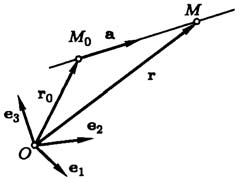
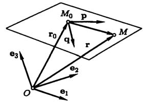
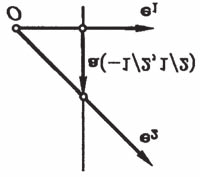
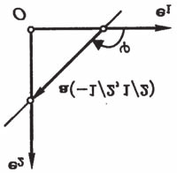

# Глава II. Прямые линии и плоскости

## § 2. Уравнения прямых и плоскостей

**1. Поверхности и линии первого порядка.** Уравнение первой степени, или линейное уравнение, связывающее координаты точки в пространстве, имеет вид

$$Ax+By+Cz+D=0, \tag{1}$$

причем предполагается, что коэффициенты при переменных не равны нулю одновременно, то есть $A^2+B^2+C^2 \neq 0$. Аналогично, линейное уравнение, связывающее координаты точки на плоскости, — это уравнение

$$Ax+By+C=0, \tag{2}$$

при условии $A^2+B^2 \neq 0$.

В школьном курсе доказывается, что в декартовой прямоугольной системе координат уравнения (1) и (2) определяют, соответственно, плоскость и прямую линию на плоскости. Из теорем 1 и 2 § 1 следует, что то же самое верно и в общей декартовой системе координат. Точнее, имеют место следующие теоремы.

**Теорема 1.** *В общей декартовой системе координат в пространстве каждая плоскость может быть задана линейным уравнением (1). Обратно, каждое линейное уравнение в общей декартовой системе координат определяет плоскость.*

**Теорема 2.** *В общей декартовой системе координат на плоскости каждая прямая может быть задана линейным уравнением (2). Обратно, каждое линейное уравнение в*

---
**стр. 62**

---

*общей декартовой системе координат на плоскости определяет прямую.*

Эти теоремы полностью решают вопрос об уравнениях плоскости и прямой линии на плоскости. Однако ввиду важности этих уравнений мы рассмотрим их в других формах. При этом будут получены независимые доказательства теорем этого пункта.

**2. Параметрические уравнения прямой и плоскости.** Прямая линия (на плоскости или в пространстве) полностью определена, если на ней задана точка $M_0$ и задан ненулевой вектор $\mathbf{a}$, параллельный этой прямой. Разумеется, и точку и вектор можно выбрать по-разному, но мы будем считать, что они как-то выбраны, и называть их *начальной точкой* и *направляющим вектором*. Аналогично, плоскость задается точкой и двумя неколлинеарными векторами, ей параллельными, — *начальной точкой* и *направляющими векторами плоскости*.

Мы будем предполагать, что задана декартова система координат в пространстве (или на плоскости, если мы изучаем прямую в планиметрии). Это, в частности, означает, что каждой точке сопоставлен ее радиус-вектор относительно начала координат.

Пусть дана прямая. Обозначим через $\mathbf{r}_0$ и $\mathbf{a}$ соответственно радиус-вектор ее начальной точки $M_0$ и направляющий вектор $\mathbf{a}$. Рассмотрим некоторую точку $M$ с радиус-вектором $\mathbf{r}$ (рис. 18). Вектор $\overrightarrow{M_0M} = \mathbf{r}-\mathbf{r}_0$, начало которого лежит на прямой, параллелен прямой тогда и только тогда, когда $M$ также лежит на прямой.

В этом и только этом случае для точки $M$ найдется такое число $t$, что

$$\mathbf{r}-\mathbf{r}_0 = t\mathbf{a}. \tag{3}$$

---
**стр. 63**

---

Наоборот, какое бы число мы ни подставили в формулу (3) в качестве $t$, вектор $\mathbf{r}$ в этой формуле определит некоторую точку на прямой.

Уравнение (3) называется *векторным параметрическим уравнением прямой*, а переменная величина $t$, принимающая любые вещественные значения, называется *параметром*.

Векторное параметрическое уравнение выглядит одинаково и в планиметрии, и в стереометрии, но при разложении по базису оно сводится к двум или трем скалярным уравнениям, смотря по тому, сколько векторов составляют базис. Рассмотрим прямую в пространстве. Пусть $(x,y,z)$ и $(x_0,y_0,z_0)$ — координаты точек $M$ и $M_0$, соответственно, а вектор $\mathbf{a}$ имеет компоненты $(a_1,a_2,a_3)$. Тогда, раскладывая по базису обе части уравнения (3), мы получим

$$x-x_0=a_1t, \quad y-y_0=a_2t, \quad z-z_0=a_3t. \tag{4}$$

Для прямой на плоскости мы получаем аналогично

$$x-x_0=a_1t, \quad y-y_0=a_2t. \tag{5}$$

Уравнения (4) или (5) называются *параметрическими уравнениями прямой*.

Получим теперь параметрические уравнения плоскости. Обозначим через $\mathbf{p}$ и $\mathbf{q}$ ее направляющие векторы, а через $\mathbf{r}_0$ — радиус-вектор ее начальной точки $M_0$. Пусть точка $M$ с радиус-вектором $\mathbf{r}$ — произвольная точка пространства (рис. 19).

Вектор $\overrightarrow{M_0M} = \mathbf{r}-\mathbf{r}_0$, начало которого лежит на плоскости, параллелен ей тогда и только тогда, когда его конец $M$ также лежит на плоскости. Так как $\mathbf{p}$ и $\mathbf{q}$ не коллинеарны, в этом и только в этом случае $\mathbf{r}-\mathbf{r}_0$ может быть им разложен. Поэтому, если точка $M$ лежит в плоскости (и только в этом случае),

---
**стр. 64**

---

найдутся такие числа $t_1$ и $t_2$, что

$$\mathbf{r}-\mathbf{r}_0 = t_1\mathbf{p}+t_2\mathbf{q}. \tag{6}$$

Это уравнение называется *векторным параметрическим уравнением плоскости*. Каждой точке плоскости оно сопоставляет значения двух *параметров* $t_1$ и $t_2$. Наоборот, какие бы числа мы ни подставили как значения $t_1$ и $t_2$, уравнение (6) определит некоторую точку плоскости.

Пусть $(x,y,z)$ и $(x_0,y_0,z_0)$ — координаты точек $M$ и $M_0$, соответственно, а векторы $\mathbf{p}$ и $\mathbf{q}$ имеют компоненты $(p_1,p_2,p_3)$ и $(q_1,q_2,q_3)$. Тогда, раскладывая по базису обе части уравнения (6), мы получим *параметрические уравнения плоскости*:

$$x-x_0=t_1p_1+t_2q_1, \quad y-y_0=t_1p_2+t_2q_2, \quad z-z_0=t_1p_3+t_2q_3. \tag{7}$$

Отметим, что начальная точка и направляющий вектор образуют на ней *внутреннюю декартову систему координат*. Значение параметра $t$, соответствующее какой-то точке, является координатой этой точки во внутренней системе координат. Точно так же, на плоскости начальная точка и направляющие векторы составляют внутреннюю систему координат, а значения параметров, соответствующие точке, — это ее координаты в этой системе. Направляющие векторы плоскости составляют базис в ее направляющем векторном подпространстве.

**3. Прямая линия на плоскости.** Параметрическое уравнение прямой утверждает, что точка $M$ лежит на прямой тогда и только тогда, когда разность ее радиус-вектора и радиус-вектора начальной точки $M_0$ коллинеарна направляющему вектору $\mathbf{a}$. Пусть в некоторой общей декартовой системе координат на плоскости заданы координаты точек и вектора: $M(x,y)$, $M_0(x_0,y_0)$, $\mathbf{a}(a_1,a_2)$. Тогда условие коллинеарности может быть записано в виде равенства

$$\begin{vmatrix} x-x_0 & y-y_0 \\ a_1 & a_2 \end{vmatrix} = 0. \tag{8}$$

Поэтому имеет место следующее

---
**стр. 65**

---

**Предложение 1.** *В любой декартовой системе координат на плоскости уравнение прямой с начальной точкой $M_0(x_0,y_0)$ и направляющим вектором $\mathbf{a}(a_1,a_2)$ может быть написано в виде (8).*

Уравнение (8) — линейное. Действительно, после преобразования оно принимает вид $a_2x-a_1y+(a_1y_0-a_2x_0)=0$, то есть $Ax+By+C=0$, где $A=a_2$, $B=-a_1$ и $C=a_1y_0-a_2x_0$.

С другой стороны, при заданной системе координат для произвольного линейного многочлена $Ax+By+C$, $A^2+B^2\neq 0$, найдутся такая точка $M_0(x_0,y_0)$ и такой вектор $\mathbf{a}(a_1,a_2)$, что

$$Ax+By+C = \begin{vmatrix} x-x_0 & y-y_0 \\ a_1 & a_2 \end{vmatrix}. \tag{9}$$

Действительно, выберем числа $x_0$ и $y_0$ так, чтобы $Ax_0+By_0+C=0$. В качестве таких чисел можно взять, например,

$$x_0 = \frac{-AC}{A^2+B^2}, \quad y_0 = \frac{-BC}{A^2+B^2}. \tag{10}$$

Если $C=-Ax_0-By_0$, то $Ax+By+C=A(x-x_0)+B(y-y_0)$, то есть выполнено равенство (9) при $a_2=A$, $a_1=-B$. Итак, мы получаем

**Предложение 2.** *Вектор с координатами $(-B,A)$ можно принять за направляющий вектор прямой с уравнением (2) в общей декартовой системе координат, а точку с координатами (10) за начальную точку.*

**Следствие.** *Если система координат декартова прямоугольная, то вектор $\mathbf{n}(A,B)$ перпендикулярен прямой с уравнением (1).*

Действительно, в этом случае $(\mathbf{a},\mathbf{n})=-BA+AB=0$.

Заметим, что из предложений 1 и 2 вытекает теорема 2.

Пусть в уравнении прямой $Ax+By+C=0$ коэффициент $B$ отличен от нуля. Это означает, что отлична от нуля первая компонента направляющего вектора, и прямая не параллельна оси ординат. В этом случае уравнение прямой можно представить в виде

$$y=kx+b, \tag{11}$$

---
**стр. 66**

---

*Рис. 20. а) Прямая $y=-x+1/2$, $k=-1$; б) прямая $y=-x+1/2$, $k=\operatorname{tg}\varphi=-1$.*

где $k=-A/B$, а $b=-C/B$. Мы видим, что $k$ равно отношению компонент направляющего вектора: $k=a_2/a_1$ (рис. 20 а).

**Определение.** Отношение компонент направляющего вектора $a_2/a_1$ называется *угловым коэффициентом прямой*.

Угловой коэффициент прямой в декартовой прямоугольной системе координат равен тангенсу угла, который прямая образует с осью абсцисс. Угол этот отсчитывается от оси абсцисс в направлении кратчайшего поворота от $\mathbf{e}_1$ к $\mathbf{e}_2$ (рис. 20 б).

Положив $x=0$ в уравнении (11), получаем $y=b$. Это означает, что свободный член уравнения $b$ является ординатой точки пересечения прямой с осью ординат.

Если же в уравнении прямой $B=0$, и ее уравнение нельзя представить в виде (11), то обязательно $A\neq 0$, прямая параллельна оси ординат, и ее уравнению можно придать вид $x=x_0$, где $x_0=-C/A$ — абсцисса точки пересечения прямой с осью абсцисс.

**4. Векторные уравнения плоскости и прямой.** Векторное уравнение прямой линии в пространстве может быть написано в виде

$$[\mathbf{r}-\mathbf{r}_0, \mathbf{a}] = \mathbf{0}. \tag{12}$$

Здесь $\mathbf{a}$ — направляющий вектор прямой, а $\mathbf{r}_0$ — радиус-вектор ее начальной точки. В самом деле, это уравнение, как

---
**стр. 67**

---

и векторное параметрическое, выражает коллинеарность векторов $\mathbf{r}_0$ и $\mathbf{a}$.

Параметрическое уравнение плоскости утверждает, что точка $M$ лежит на плоскости тогда и только тогда, когда разность ее радиус-вектора и радиус-вектора начальной точки $M_0$ компланарна направляющим векторам $\mathbf{p}$ и $\mathbf{q}$. Эту компланарность можно выразить и равенством

$$(\mathbf{r}-\mathbf{r}_0, \mathbf{p}, \mathbf{q}) = 0. \tag{13}$$

Вектор $\mathbf{n}=[\mathbf{p},\mathbf{q}]$ — ненулевой вектор, перпендикулярный плоскости. Используя его, мы можем записать уравнение (13) в виде

$$(\mathbf{r}-\mathbf{r}_0, \mathbf{n}) = 0. \tag{14}$$

Уравнения (13) и (14) называют *векторными уравнениями плоскости*. Им можно придать форму, в которую не входит радиус-вектор начальной точки. Например, положив в (14) $D=-(\mathbf{r}_0,\mathbf{n})$, получим

$$(\mathbf{r},\mathbf{n})+D=0. \tag{15}$$

Для прямой на плоскости можно также написать *векторные уравнения*, аналогичные (14) и (15):

$$(\mathbf{r}-\mathbf{r}_0, \mathbf{n})=0 \quad \text{или} \quad (\mathbf{r},\mathbf{n})+C=0.$$

Первое из них выражает тот факт, что вектор $\mathbf{r}-\mathbf{r}_0$ перпендикулярен ненулевому вектору $\mathbf{n}$, перпендикулярному направляющему вектору $\mathbf{a}$, и потому коллинеарен $\mathbf{a}$.

**Предложение 3.** *Пусть $x,y,z$ — компоненты вектора $\mathbf{r}$ в общей декартовой системе координат. Тогда скалярное произведение $(\mathbf{r}-\mathbf{r}_0, \mathbf{n})$ при $\mathbf{n}\neq \mathbf{0}$ записывается линейным многочленом*

$$Ax+By+Cz+D \qquad (A^2+B^2+C^2\neq 0).$$

*Обратно, если задана декартова система координат, то для любого линейного многочлена найдутся такие векторы $\mathbf{r}_0$ и $\mathbf{n}\neq \mathbf{0}$, что $Ax+By+Cz+D=(\mathbf{r}-\mathbf{r}_0,\mathbf{n})$, где $\mathbf{r}$ — вектор с координатами $(x,y,z)$.*

---
**стр. 68**

---

Первая часть предложения очевидна: подставим разложение вектора $\mathbf{r}$ по базису в данное скалярное произведение

$$(x\mathbf{e}_1+y\mathbf{e}_2+z\mathbf{e}_3-\mathbf{r}_0, \mathbf{n}),$$

раскроем скобки и получим многочлен $Ax+By+Cz+D$, в котором $D=-(\mathbf{r}_0,\mathbf{n})$, и

$$A=(\mathbf{e}_1,\mathbf{n}), \quad B=(\mathbf{e}_2,\mathbf{n}), \quad C=(\mathbf{e}_3,\mathbf{n}). \tag{16}$$

$A$, $B$, и $C$ одновременно не равны нулю, так как ненулевой вектор $\mathbf{n}$ не может быть ортогонален всем векторам базиса.

Для доказательства обратного утверждения найдем сначала вектор $\mathbf{n}$ из равенств (16), считая $A$, $B$, и $C$ заданными. Положим

$$\mathbf{n} = \frac{A[\mathbf{e}_2,\mathbf{e}_3]}{(\mathbf{e}_1,\mathbf{e}_2,\mathbf{e}_3)} + \frac{B[\mathbf{e}_3,\mathbf{e}_1]}{(\mathbf{e}_1,\mathbf{e}_2,\mathbf{e}_3)} + \frac{C[\mathbf{e}_1,\mathbf{e}_2]}{(\mathbf{e}_1,\mathbf{e}_2,\mathbf{e}_3)}. \tag{17}$$

Умножая этот вектор скалярно на $\mathbf{e}_1$, $\mathbf{e}_2$ и $\mathbf{e}_3$, мы убедимся, что он удовлетворяет равенствам (16). (Можно отметить, что (17) следует из формул (8) § 4 гл. I и (9) § 5 гл. I.)

Вектор $\mathbf{r}_0$ должен удовлетворять условию $D=-(\mathbf{r}_0,\mathbf{n})$. Один из таких векторов можно найти в виде $\mathbf{r}_0=\lambda\mathbf{n}$. Подставляя, видим, что $D=-\lambda(\mathbf{n},\mathbf{n})$, откуда $\lambda=-D/|\mathbf{n}|^2$.

Итак, мы нашли векторы $\mathbf{n}$ и $\mathbf{r}_0$ такие, что линейный многочлен записывается в виде

$$x(\mathbf{e}_1,\mathbf{n})+y(\mathbf{e}_2,\mathbf{n})+z(\mathbf{e}_3,\mathbf{n})-(\mathbf{r}_0,\mathbf{n}),$$

который совпадает с требуемым $(\mathbf{r}-\mathbf{r}_0,\mathbf{n})$.

Заметим, что доказанное предложение равносильно теореме 1.

**Предложение 4.** *Если система координат декартова прямоугольная, то вектор с компонентами $A,B,C$ является нормальным вектором для плоскости с уравнением $Ax+By+Cz+D=0$. В произвольной системе координат $A,B,C$ — ковариантные координаты нормального вектора.*

---
**стр. 69**

---

Первое утверждение сразу вытекает из формул (16) и выражения координат вектора в ортонормированном базисе через скалярные произведения (1) § 4 гл. I, а второе — из определения ковариантных координат ((7) § 4 гл. I).

Пусть вектор $\mathbf{a}$ с координатами $\alpha_1,\alpha_2,\alpha_3$ в общей декартовой системе координат $O,\mathbf{e}_1,\mathbf{e}_2,\mathbf{e}_3$ параллелен плоскости с уравнением $Ax+By+Cz+D=0$. Рассмотрим равный ему вектор $\overrightarrow{MN}$, концы которого $M(x_1,y_1,z_1)$ и $N(x_2,y_2,z_2)$ лежат в плоскости. Это значит, что $Ax_1+By_1+Cz_1+D=0$ и $Ax_2+By_2+Cz_2+D=0$. Вычитая первое равенство из второго, мы получим $A(x_2-x_1)+B(y_2-y_1)+C(z_2-z_1)=0$. Поэтому координаты вектора $\mathbf{a}$ удовлетворяют равенству

$$A\alpha_1+B\alpha_2+C\alpha_3=0. \tag{18}$$

Обратно, если условие (18) выполнено для координат некоторого вектора и его начало $M(x_1,y_1,z_1)$ лежит в плоскости, то, складывая равенства $Ax_1+By_1+Cz_1+D=0$ и (18), мы видим, что конец вектора также лежит в плоскости: $A(x_1+\alpha_1)+B(y_1+\alpha_2)+C(z_1+\alpha_3)+D=0$. Теперь очевидным становится следующее

**Предложение 5.** *Вектор $\mathbf{a}$ с компонентами $\alpha_1,\alpha_2,\alpha_3$ в общей декартовой системе координат параллелен плоскости с уравнением $Ax+By+Cz+D=0$ тогда и только тогда, когда выполнено условие (18).*

**Следствие.** *Любые два неколлинеарных вектора, удовлетворяющие уравнению (18), можно принять за направляющие векторы плоскости.*

Все, сказанное о плоскостях, почти без изменений может быть сказано и о прямых на плоскости. В частности, имеет место

**Предложение 6.** *Вектор $\mathbf{a}$ с компонентами $\alpha_1,\alpha_2$ в общей декартовой системе координат параллелен прямой с уравнением $Ax+By+C=0$ тогда и только тогда, когда*

$$A\alpha_1+B\alpha_2=0. \tag{19}$$

Действительно, $\alpha_1,\alpha_2$ должны быть пропорциональны компонентам $(-B,A)$ направляющего вектора прямой.

---
**стр. 70**

---

**5. Параллельность плоскостей и прямых на плоскости.** Ниже, говоря о параллельных прямых или плоскостях, мы будем считать, что параллельные плоскости (или прямые) не обязательно различны, то есть что плоскость (прямая) параллельна самой себе.

**Предложение 7.** *Прямые линии, задаваемые в общей декартовой системе координат уравнениями*

$$Ax+By+C=0, \quad A_1x+B_1y+C_1=0,$$

*параллельны тогда и только тогда, когда соответствующие коэффициенты в их уравнениях пропорциональны, т. е. существует такое число $\lambda$, что*

$$A_1=\lambda A, \quad B_1=\lambda B. \tag{20}$$

*Прямые совпадают в том и только том случае, когда их уравнения пропорциональны, т. е. помимо уравнения (20) выполнено (с тем же $\lambda$) равенство*

$$C_1=\lambda C. \tag{21}$$

**Доказательство.** Первая часть предложения прямо следует из того, что векторы с компонентами $(-B,A)$ и $(-B_1,A_1)$ — направляющие векторы прямых.

Докажем вторую часть. В равенствах (20) и (21) $\lambda\neq 0$, так как коэффициенты в уравнении прямой одновременно нулю не равны. Поэтому, если эти равенства выполнены, уравнения эквивалентны и определяют одну и ту же прямую.

Обратно, пусть прямые параллельны. В силу первой части предложения их уравнения должны иметь вид $Ax+By+C=0$ и $\lambda(Ax+By)+C_1=0$ при некотором $\lambda$. Если, кроме того, существует общая точка $M_0(x_0,y_0)$ обеих прямых, то $Ax_0+By_0+C=0$ и $\lambda(Ax_0+By_0)+C_1=0$. Вычитая из второго равенства первое, умноженное на $\lambda$, мы получаем $C_1=\lambda C$, как и требовалось.

Условия (20) выражают коллинеарность направляющих векторов прямых. Поэтому согласно предложению 7 § 5 гл. I

---
**стр. 71**

---

условие, необходимое и достаточное для параллельности прямых на плоскости, можно записать в виде

$$\begin{vmatrix} -B & A \\ -B_1 & A_1 \end{vmatrix} = 0, \tag{22}$$

что равносильно $\begin{vmatrix} A & B \\ A_1 & B_1 \end{vmatrix} = 0.$

Предложению 7 можно придать чисто алгебраическую формулировку, если учесть, что координаты точки пересечения прямых — это решение системы, составленной из их уравнений.

**Предложение 8.** *При условии (22) система линейных уравнений*

$$Ax+By+C=0, \quad A_1x+B_1y+C_1=0$$

*не имеет решений или имеет бесконечно много решений (в зависимости от $C$ и $C_1$). В последнем случае система равносильна одному из составляющих ее уравнений. Если же*

$$\begin{vmatrix} A & B \\ A_1 & B_1 \end{vmatrix} \neq 0,$$

*то при любых $C$ и $C_1$ система имеет единственное решение $(x,y)$.*

Это предложение дополняет предложение 8 § 5 гл. I, в котором рассмотрены системы с детерминантом, отличным от нуля. Конечно, такие системы определяют пересечение непараллельных прямых и потому имеют единственное решение при любых свободных членах.

Предложение 8 можно доказать и непосредственно и отсюда получить условие параллельности прямых. Исследованием произвольных систем линейных уравнений мы займемся в гл. V.

**Предложение 9.** *Плоскости, задаваемые в общей декартовой системе координат уравнениями*

$$Ax+By+Cz+D=0, \quad A_1x+B_1y+C_1z+D_1=0,$$

---
**стр. 72**

---

*параллельны тогда и только тогда, когда соответствующие коэффициенты в их уравнениях пропорциональны, т. е. существует такое число $\lambda$, что*

$$A_1=\lambda A, \quad B_1=\lambda B, \quad C_1=\lambda C. \tag{23}$$

*Плоскости совпадают в том и только том случае, когда их уравнения пропорциональны, т. е. помимо уравнений (23) выполнено (с тем же $\lambda$) равенство*

$$D_1=\lambda D. \tag{24}$$

**Доказательство.** Параллельность двух плоскостей означает, что их нормальные векторы $\mathbf{n}$ и $\mathbf{n}_1$ коллинеарны, и существует такое число $\lambda$, что $\mathbf{n}_1=\lambda\mathbf{n}$. В силу уравнений (16) $A_1=(\mathbf{e}_1,\mathbf{n}_1)=\lambda(\mathbf{e}_1,\mathbf{n})=\lambda A$. Аналогично доказываются и остальные равенства (23). Обратно, если равенства (23) выполнены, то из формулы (17) следует, что $\mathbf{n}_1=\lambda\mathbf{n}$. Это доказывает первую часть предложения. Вторая его часть доказывается так же, как вторая часть предложения 7.

Мы знаем, что коэффициенты $A,B,C$ и $A_1,B_1,C_1$ — это координаты векторов $\mathbf{n}$ и $\mathbf{n}_1$ в базисе $\mathbf{e}_1^*,\mathbf{e}_2^*,\mathbf{e}_3^*$, биортогональном базису выбранной системы координат. Поэтому из условия коллинеарности векторов в произвольном базисе (предложение 6 § 5 гл. I) следует такое необходимое и достаточное условие параллельности плоскостей в общей декартовой системе координат:

$$\begin{vmatrix} B & C \\ B_1 & C_1 \end{vmatrix} = \begin{vmatrix} C & A \\ C_1 & A_1 \end{vmatrix} = \begin{vmatrix} A & B \\ A_1 & B_1 \end{vmatrix} = 0. \tag{25}$$

Другими словами, плоскости не параллельны тогда и только тогда, когда хоть один из детерминантов в формуле (25) не равен нулю.

**6. Уравнения прямой в пространстве.** Прямая линия в пространстве может быть задана как пересечение двух плоскостей и, следовательно, в общей декартовой системе координат определяется системой уравнений вида

$$Ax+By+Cz+D=0, \quad A_1x+B_1y+C_1z+D_1=0. \tag{26}$$

---
**стр. 73**

---

Пересечение плоскостей — прямая линия тогда и только тогда, когда они не параллельны, то есть хоть один из детерминантов отличен от нуля:

$$\begin{vmatrix} B & C \\ B_1 & C_1 \end{vmatrix}^2 + \begin{vmatrix} C & A \\ C_1 & A_1 \end{vmatrix}^2 + \begin{vmatrix} A & B \\ A_1 & B_1 \end{vmatrix}^2 \neq 0. \tag{27}$$

Разумеется, систему (26) можно заменить на любую, ей эквивалентную. При этом прямая будет представлена как пересечение двух других проходящих через нее плоскостей.

Вспомним параметрические уравнения прямой (4). Допустим, что в них ни одна из компонент направляющего вектора не равна нулю. Тогда

$$t = \frac{x-x_0}{a_1}, \quad t=\frac{y-y_0}{a_2}, \quad t=\frac{z-z_0}{a_3},$$

и мы получаем два равенства

$$\frac{y-y_0}{a_2} = \frac{z-z_0}{a_3}, \quad \frac{x-x_0}{a_1} = \frac{z-z_0}{a_3}, \tag{28}$$

или, в более симметричном виде,

$$\frac{x-x_0}{a_1} = \frac{y-y_0}{a_2} = \frac{z-z_0}{a_3}. \tag{29}$$

Уравнения (28) представляют прямую как линию пересечения двух плоскостей, первая из которых параллельна оси абсцисс (в ее уравнение не входит переменная $x$), а вторая параллельна оси ординат.

Если обращается в нуль одна из компонент направляющего вектора, например $a_1$, то уравнения прямой принимают вид

$$x=x_0, \quad \frac{y-y_0}{a_2}=\frac{z-z_0}{a_3}. \tag{30}$$

Эта прямая лежит в плоскости $x=x_0$ и, следовательно, параллельна плоскости $x=0$. Аналогично пишутся уравнения прямой, если в нуль обращается не $a_1$, а другая компонента.

Когда равны нулю две компоненты направляющего вектора, например $a_1$ и $a_2$, то прямая имеет уравнения

$$x=x_0, \quad y=y_0. \tag{31}$$

---
**стр. 74**

---

Такая прямая параллельна одной из осей координат, в нашем случае — оси аппликат.

Важно уметь находить начальную точку и направляющий вектор прямой, заданной системой линейных уравнений (26). По условию (27) один из детерминантов отличен от нуля. Допустим для определенности, что $AB_1-A_1B\neq 0$. В силу предложения 8 при любом фиксированном $z$ система уравнений будет иметь единственное решение $(x,y)$, в котором $x$ и $y$, разумеется, зависят от $z$. Они — линейные многочлены от $z$: $x=\alpha_1z+\beta_1$, $y=\alpha_2z+\beta_2$. Не будем доказывать этого, хотя это и нетрудно сделать. Для ясности, заменяя $z$ на $t$, получаем параметрические уравнения прямой

$$x=\alpha_1t+\beta_1, \quad y=\alpha_2t+\beta_2, \quad z=t.$$

Первые две координаты начальной точки прямой $M_0(\beta_1,\beta_2,0)$ можно получить, решая систему (26) при значении $z=0$.

Из параметрических уравнений видно, что в этом случае направляющий вектор имеет координаты $(\alpha_1,\alpha_2,1)$. Найдем его компоненты в общем виде. Если система координат декартова прямоугольная, векторы с компонентами $(A,B,C)$ и $(A_1,B_1,C_1)$ перпендикулярны соответствующим плоскостям, а потому их векторное произведение параллельно прямой, по которой плоскости пересекаются. Вычисляя векторное произведение в ортонормированном базисе, мы получим компоненты направляющего вектора:

$$\begin{vmatrix} B & C \\ B_1 & C_1 \end{vmatrix}, \quad \begin{vmatrix} C & A \\ C_1 & A_1 \end{vmatrix}, \quad \begin{vmatrix} A & B \\ A_1 & B_1 \end{vmatrix}. \tag{32}$$

**Предложение 10.** *Вектор с компонентами (32) есть направляющий вектор прямой с уравнениями (26), какова бы ни была декартова система координат.*

**Доказательство.** Согласно предложению 5 каждый ненулевой вектор, компоненты которого $(\alpha_1,\alpha_2,\alpha_3)$ удовлетворяют уравнению $A\alpha_1+B\alpha_2+C\alpha_3=0$, параллелен плоскости с уравнением $Ax+By+Cz+D=0$. Если, кроме того, он удовлетворяет уравнению $A_1\alpha_1+B_1\alpha_2+C_1\alpha_3=0$, то

---
**стр. 75**

---

он параллелен и второй плоскости, то есть может быть принят за направляющий вектор прямой. Вектор с компонентами (32) — ненулевой в силу неравенства (27). Непосредственно легко проверить, что его компоненты удовлетворяют обоим написанным выше условиям. Так, левая часть первого из них после подстановки принимает вид

$$A\begin{vmatrix} B & C \\ B_1 & C_1 \end{vmatrix} + B\begin{vmatrix} C & A \\ C_1 & A_1 \end{vmatrix} + C\begin{vmatrix} A & B \\ A_1 & B_1 \end{vmatrix},$$

что равно детерминанту третьего порядка, имеющему две одинаковые строки.

На этом доказательство заканчивается.

### Упражнения

1. Найдите параметрические уравнения прямой, заданной уравнениями
$$x+y+z=4,$$
$$x-y+3z=0.$$

2. Найдите параметрические уравнения плоскости $x-2y+3z=1$.

3. Найдите координаты точки пересечения прямых с уравнениями: $x=1-t$, $y=1+t$, $z=1-t$ и $x=3t-1$, $y=2t-2$, $z=1+t$. Какое значение параметра соответствует этой точке на каждой из прямых? Как установить, что прямые пересекаются, не находя точки пересечения?

4. Напишите уравнение плоскости, в которой лежат прямые упражнения 3.

5. Напишите параметрические уравнения прямой, заданных векторными уравнениями
а) $[\mathbf{r},\mathbf{a}]=\mathbf{b}$, $(\mathbf{a},\mathbf{b})=0$, $\mathbf{a}\neq\mathbf{0}$.
б) $(\mathbf{r},\mathbf{n}_1)+D_1=0$, $(\mathbf{r},\mathbf{n}_2)+D_2=0$, $[\mathbf{n}_1,\mathbf{n}_2]\neq\mathbf{0}$.
В задаче (б) легче получить решение при условии $(\mathbf{n}_1,\mathbf{n}_2)=0$.

Решения всех пяти упражнений: [[../reshebnik_beklemishev/rbek_g02_s02|Решебник, Гл. II §2]].
