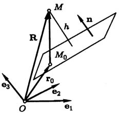
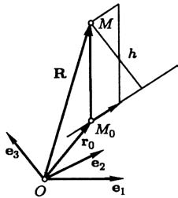
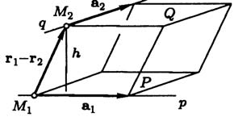
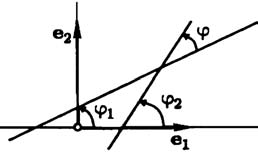
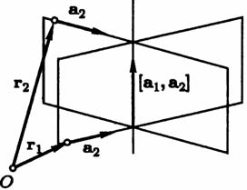

# Глава II. Прямые линии и плоскости

## § 3. Основные задачи о прямых и плоскостях

**1. Уравнение прямой, проходящей через две точки.** Пусть в пространстве задана общая декартова система координат и две точки $M_1$ и $M_2$ с координатами $(x_1,y_1,z_1)$ и $(x_2,y_2,z_2)$. Чтобы написать уравнение прямой $M_1M_2$ примем $M_1$ за начальную точку, а $\overrightarrow{M_1M_2}$ за направляющий вектор.

---
**стр. 76**

---

Этот вектор не нулевой, если точки не совпадают. По формуле (29) § 2 мы получаем

$$\frac{x-x_1}{x_2-x_1} = \frac{y-y_1}{y_2-y_1} = \frac{z-z_1}{z_2-z_1}. \tag{1}$$

Если в этих равенствах какой-либо из знаменателей равен нулю, то следует приравнять нулю соответствующий числитель.

В планиметрии задача решается так же. Отличие только в том, что координаты точек теперь $(x_1,y_1)$ и $(x_2,y_2)$, и мы получаем по формуле (8) § 2

$$\begin{vmatrix} x-x_1 & y-y_1 \\ x_2-x_1 & y_2-y_1 \end{vmatrix} = 0.$$

**2. Уравнение плоскости, проходящей через три точки.** Пусть $M_1$, $M_2$ и $M_3$ — не лежащие на одной прямой точки с координатами $(x_1,y_1,z_1)$, $(x_2,y_2,z_2)$ и $(x_3,y_3,z_3)$ в общей декартовой системе координат. Выберем $M_1$ в качестве начальной точки, а $\overrightarrow{M_1M_2}$ и $\overrightarrow{M_1M_3}$ в качестве направляющих векторов. Тогда по формулам (13) § 2 и (12) § 5 гл. I получаем уравнение плоскости

$$\begin{vmatrix} x-x_1 & y-y_1 & z-z_1 \\ x_2-x_1 & y_2-y_1 & z_2-z_1 \\ x_3-x_1 & y_3-y_1 & z_3-z_1 \end{vmatrix} = 0. \tag{2}$$

**3. Параллельность прямой и плоскости.** Пусть известен направляющий вектор прямой $\mathbf{a}(\alpha_1,\alpha_2,\alpha_3)$, а плоскость задана одним из уравнений $(\mathbf{r}-\mathbf{r}_0,\mathbf{n})=0$ или $(\mathbf{r}-\mathbf{r}_0,\mathbf{p},\mathbf{q})=0$. Прямая параллельна плоскости (а возможно, и лежит в ней) тогда и только тогда, когда соответственно $(\mathbf{a},\mathbf{n})=0$ или $(\mathbf{a},\mathbf{p},\mathbf{q})=0$. Если плоскость задана линейным уравнением $Ax+By+Cz+D=0$, то по предложению 5 § 2 условие параллельности

$$A\alpha_1+B\alpha_2+C\alpha_3=0. \tag{3}$$

Пусть прямая задана системой уравнений

$$A_1x+B_1y+C_1z+D_1=0, \quad A_2x+B_2y+C_2z+D_2=0.$$

---
**стр. 77**

---

Тогда по предложению 10 § 2 условие (3) переписывается в виде

$$A\begin{vmatrix} B_1 & C_1 \\ B_2 & C_2 \end{vmatrix} + B\begin{vmatrix} C_1 & A_1 \\ C_2 & A_2 \end{vmatrix} + C\begin{vmatrix} A_1 & B_1 \\ A_2 & B_2 \end{vmatrix} = 0$$

или

$$\begin{vmatrix} A & B & C \\ A_1 & B_1 & C_1 \\ A_2 & B_2 & C_2 \end{vmatrix} = 0. \tag{4}$$

Легко проверить, что все приведенные здесь условия являются не только необходимыми, но и достаточными. В частности, из формулы (4) следует, что три плоскости пересекаются в одной точке тогда и только тогда, когда коэффициенты их уравнений удовлетворяют условию

$$\begin{vmatrix} A & B & C \\ A_1 & B_1 & C_1 \\ A_2 & B_2 & C_2 \end{vmatrix} \neq 0. \tag{5}$$

Действительно, это неравенство означает, что прямая, по которой пересекаются две плоскости, не параллельна третьей.

Нужно сказать, что это условие было нами по существу получено в алгебраической форме в предложении 8 § 5 гл. I. Сейчас мы снова пришли к нему исходя из другой геометрической интерпретации системы линейных уравнений.

**4. Полупространства.** Пусть даны плоскость $P$ и определенный ее нормальный вектор $\mathbf{n}$. *Полупространством*, определяемым $P$ и $\mathbf{n}$, называется множество точек $M$ таких, что для некоторой точки $M_0$ на плоскости вектор $\overrightarrow{M_0M}$ составляет с $\mathbf{n}$ угол, не больший $\pi/2$.

Если $\mathbf{r}$ — радиус-вектор точки $M$, а $\mathbf{r}_0$ — точки $M_0$, то определение полупространства эквивалентно неравенству $(\mathbf{r}-\mathbf{r}_0,\mathbf{n}) \geqslant 0$. Это неравенство и есть *уравнение полупространства*.

Используя это, нетрудно проверить, что определение полупространства не зависит от выбора точки $M_0$. Действительно, если $M_1(\mathbf{r}_1)$ — другая точка плоскости, то вектор $\mathbf{a}=\mathbf{r}_1-\mathbf{r}_0$ лежит в плоскости, перпендикулярен $\mathbf{n}$, и мы имеем

$$(\mathbf{r}-\mathbf{r}_1,\mathbf{n}) = (\mathbf{r}-\mathbf{r}_0-\mathbf{a},\mathbf{n}) = (\mathbf{r}-\mathbf{r}_0,\mathbf{n}).$$

---
**стр. 78**

---

Мы получим уравнение полупространства в координатной форме, если вспомним, что согласно предложению 3 § 2 выражение $(\mathbf{r}-\mathbf{r}_0,\mathbf{n})$ в координатах записывается линейным многочленом $Ax+By+Cz+D$. Итак, полупространство в декартовой системе координат задается линейным неравенством

$$Ax+By+Cz+D \geqslant 0.$$

Обратно, любое такое неравенство можно записать как $(\mathbf{r}-\mathbf{r}_0,\mathbf{n})\geqslant0$, откуда сразу видно, что оно задает полупространство.

Плоскость $P$ и вектор $\mathbf{n}_1=-\mathbf{n}$ задают другое полупространство с уравнением $(\mathbf{r}-\mathbf{r}_0,\mathbf{n}_1) \geqslant 0$ или $(\mathbf{r}-\mathbf{r}_0,\mathbf{n}) \leqslant 0$. Его назовем «*отрицательным*», в отличие от «*положительного*» полупространства $(\mathbf{r}-\mathbf{r}_0,\mathbf{n})\geqslant 0$. Однако такое наименование условно — оно определяется выбором вектора $\mathbf{n}$. Изменение направления этого вектора равносильно умножению уравнения плоскости на $(-1)$. При этом «положительное» полупространство становится «отрицательным» и наоборот.

Вот, однако, факт, не зависящий от выбора направления нормального вектора: если $M_1(x_1,y_1,z_1)$ и $M_2(x_2,y_2,z_2)$ — не лежащие в плоскости точки, то результаты подстановки их координат в левую часть уравнения плоскости $Ax_1+By_1+Cz_1+D$ и $Ax_2+By_2+Cz_2+D$ имеют один знак тогда и только тогда, когда точки лежат в одном полупространстве.

В § 5 гл. I при обсуждении понятия ориентации плоскости мы отмечали, что задание ориентации плоскости в ориентированном пространстве равносильно выделению одного из полупространств, определяемых плоскостью. Здесь мы видим, что выбор одного из уравнений плоскости выделяет одно, «положительное», полупространство и тем самым определяет ориентацию плоскости.

Для решения задач бывает полезно следующее замечание: если точка $M_0(x_0,y_0,z_0)$ лежит на плоскости, то точка с координатами $x_0+A$, $y_0+B$, $z_0+C$ лежит в «положительном» полупространстве. Иначе говоря, вектор $\mathbf{p}(A,B,C)$ направлен в «положительное» полупространство. Это легко проверяется подстановкой.

---
**стр. 79**

---

Вполне аналогично сказанному о полупространствах мы можем определить, что такое *полуплоскость*, и доказать, что неравенство $Ax+By+C \geqslant 0$, связывающее декартовы координаты точки на плоскости, определяет полуплоскость. Вторая полуплоскость, ограниченная прямой $Ax+By+C=0$, задается неравенством $Ax+By+C \leqslant 0$.

Точки $M_1(x_1,y_1)$ и $M_2(x_2,y_2)$ лежат по одну сторону от прямой тогда и только тогда, когда $(Ax_1+By_1+C)(Ax_2+By_2+C) > 0$.

**5. Расстояние от точки до плоскости.** Пусть дана плоскость с уравнением $(\mathbf{r}-\mathbf{r}_0,\mathbf{n})=0$ и точка $M$ с радиус-вектором $\mathbf{R}$. Рассмотрим вектор $\overrightarrow{M_0M} = \mathbf{R}-\mathbf{r}_0$, соединяющий начальную точку плоскости с $M$ (рис. 21). Расстояние от точки до плоскости равно модулю его скалярной проекции на вектор $\mathbf{n}$, то есть

$$h = \frac{|(\mathbf{R}-\mathbf{r}_0,\mathbf{n})|}{|\mathbf{n}|}. \tag{6}$$

Если в декартовой прямоугольной системе координат точка $M$ имеет координаты $(X,Y,Z)$, то равенство (6) запишется согласно предложениям 3 и 4 § 2 так

$$h = \frac{|AX+BY+CZ+D|}{\sqrt{A^2+B^2+C^2}}. \tag{7}$$

**6. Расстояние от точки до прямой.** Если прямая задана уравнением $[\mathbf{r}-\mathbf{r}_0,\mathbf{a}]=\mathbf{0}$, то мы можем найти расстояние $h$ от точки $M$ с радиус-вектором $\mathbf{R}$ до этой прямой, разделив площадь параллелограмма, построенного на векторах $\mathbf{R}-\mathbf{r}_0$ и $\mathbf{a}$, на длину его основания (рис. 22). Результат можно записать формулой

$$h = \frac{|[\mathbf{R}-\mathbf{r}_0, \mathbf{a}]|}{|\mathbf{a}|}. \tag{8}$$

Для прямой в пространстве мы не будем получать координатной записи этого выражения.

---
**стр. 80**

---

Рассмотрим прямую на плоскости, заданную уравнением $Ax+By+C=0$ в декартовой прямоугольной системе координат. Пусть $M_0(x_0,y_0)$ — начальная точка прямой, а $M(X,Y)$ — некоторая точка плоскости. В качестве направляющего вектора возьмем вектор $\mathbf{a}(-B,A)$. Из формулы (24) § 5 гл. I следует, что площадь параллелограмма равна $S=|(X-x_0)A-(Y-y_0)(-B)|$. Но $-Ax_0-By_0=C$ и $S=|AX+BY+C|$. Следовательно,

$$h = \frac{|AX+BY+C|}{\sqrt{A^2+B^2}}. \tag{9}$$

Легко заметить также, что для нахождения расстояния от точки до прямой на плоскости можно воспользоваться рассуждением, примененным при выводе формулы (6). Полученное нами равенство (9) — координатная запись формулы (6) в декартовой прямоугольной системе координат, если $\mathbf{n}(A,B)$ — нормальный вектор прямой с координатами $(A,B)$.

**7. Расстояние между скрещивающимися прямыми.** Пусть прямые $p$ и $q$ не параллельны. Известно, что в этом случае существуют такие параллельные плоскости $P$ и $Q$, что прямая $p$ лежит в $P$, а прямая $q$ лежит в $Q$. (Если уравнения прямых $\mathbf{r}=\mathbf{r}_1+\mathbf{a}_1t$ и $\mathbf{r}=\mathbf{r}_2+\mathbf{a}_2t$, то плоскость $P$ имеет начальную точку $\mathbf{r}_1$ и направляющие векторы $\mathbf{a}_1$ и $\mathbf{a}_2$. Аналогично строится плоскость $Q$.)

*Расстоянием* $h$ между прямыми $p$ и $q$ называется расстояние между $P$ и $Q$. Если $p$ и $q$ пересекаются, то $P$ и $Q$ совпадают и $h=0$.

Для того чтобы найти расстояние $h$, проще всего разделить объем параллелепипеда, построенного на векторах $\mathbf{r}_2-\mathbf{r}_1$, $\mathbf{a}_1$ и $\mathbf{a}_2$, на площадь его основания (рис. 23). Мы получим

---
**стр. 81**

---

$$h = \frac{|(\mathbf{r}_2-\mathbf{r}_1, \mathbf{a}_1, \mathbf{a}_2)|}{|[\mathbf{a}_1, \mathbf{a}_2]|}.$$

Знаменатель этой дроби отличен от нуля, поскольку прямые не параллельны.

**Предложение 1.** *Прямые линии с уравнениями $\mathbf{r}=\mathbf{r}_1+\mathbf{a}_1t$ и $\mathbf{r}=\mathbf{r}_2+\mathbf{a}_2t$ пересекаются тогда и только тогда, когда $h=0$, то есть*

$$(\mathbf{r}_2-\mathbf{r}_1,\mathbf{a}_1,\mathbf{a}_2)=0, \quad [\mathbf{a}_1,\mathbf{a}_2]\neq\mathbf{0}.$$

**8. Вычисление углов.** Чтобы найти угол между двумя прямыми, следует найти их направляющие векторы и вычислить косинус угла между ними, используя скалярное произведение. При этом следует иметь в виду, что, изменив направление одного из векторов, мы получим косинус смежного угла.

Для нахождения угла между прямой и плоскостью определяют угол $\theta$ между направляющим вектором прямой и нормальным вектором плоскости. Если векторы выбрать так, чтобы $\cos\theta \geqslant 0$, и взять $0\leqslant\theta\leqslant\pi/2$, то искомый угол дополняет $\theta$ до $\pi/2$.

Угол между плоскостями находят как угол между их нормальными векторами.

Полезна бывает формула для угла между прямыми линиями на плоскости, заданными уравнениями $y=k_1x+b_1$ и $y=k_2x+b_2$ в декартовой прямоугольной системе координат. Обозначим через $\varphi$ угол между прямыми, отсчитываемый от первой прямой ко второй в том направлении, в котором производится кратчайший поворот от первого базисного вектора ко второму. Тогда $\operatorname{tg}\varphi$ можно найти как тангенс разности углов, которые прямые составляют с осью абсцисс (рис. 24). Так как тангенсы этих углов равны угловым коэффициентам прямых, мы получаем

$$\operatorname{tg}\varphi = \frac{k_2-k_1}{1+k_1k_2}. \tag{10}$$

---
**стр. 82**

---

Конечно, эта формула не имеет смысла, когда знаменатель дроби обращается в ноль. В этом случае прямые перпендикулярны. Действительно, согласно предложению 1 § 2 векторы с компонентами $(1,k_1)$ и $(1,k_2)$ — направляющие векторы прямых, и их скалярное произведение равно $1+k_1k_2$. Мы получили

**Предложение 2.** *Для перпендикулярности прямых с угловыми коэффициентами $k_1$ и $k_2$ в декартовой прямоугольной системе координат необходимо и достаточно выполнение равенства $1+k_1k_2=0$.*

**9. Некоторые задачи на построение.**

**а) Перпендикуляр из точки на плоскость. Проекция точки.** Если $(\mathbf{r}-\mathbf{r}_0,\mathbf{n})=0$ — уравнение плоскости, и дана точка $M$ с радиус-вектором $\mathbf{R}$, то прямая с уравнением $\mathbf{r}=\mathbf{R}+t\mathbf{n}$ проходит через $M$ и перпендикулярна плоскости. Решая совместно уравнения прямой и плоскости, найдем ортогональную проекцию $M$ на плоскость. Из $(\mathbf{R}-\mathbf{r}_0+t\mathbf{n},\mathbf{n})=0$ находим $t$ и подставляем в уравнение прямой. Мы получим радиус-вектор проекции

$$\mathbf{r}_1 = \mathbf{R} - \frac{(\mathbf{R}-\mathbf{r}_0,\mathbf{n})}{|\mathbf{n}|^2}\mathbf{n}.$$

Обратите внимание на структуру этой формулы: из радиус-вектора $\mathbf{R}$ вычитается проекция $\mathbf{R}-\mathbf{r}_0$ на нормальный вектор плоскости. Из этих соображений можно было получить ответ.

**б) Перпендикуляр из точки на прямую.** Пусть прямая задана уравнением $[\mathbf{r}-\mathbf{r}_0,\mathbf{a}]=\mathbf{0}$, и дана точка $M$ с радиус-

---
**стр. 83**

---

вектором $\mathbf{R}$. Вектор $\mathbf{p}=[\mathbf{R}-\mathbf{r}_0,\mathbf{a}]$ перпендикулярен плоскости, проходящей через прямую и точку $M$. Если точка не лежит на прямой, то $\mathbf{p}\neq\mathbf{0}$, и вектор $[\mathbf{a},\mathbf{p}]=[\mathbf{a},[\mathbf{R}-\mathbf{r}_0,\mathbf{a}]]$ также ненулевой и перпендикулярен $\mathbf{a}$ и $\mathbf{p}$. Следовательно, он лежит в указанной плоскости и перпендикулярен прямой. Итак, получено уравнение

$$\mathbf{r} = \mathbf{R} + t[\mathbf{a}, [\mathbf{R}-\mathbf{r}_0, \mathbf{a}]]$$

перпендикуляра, опущенного из точки $M$ на заданную прямую.

Применив формулу двойного векторного произведения, вы заметите, что $[\mathbf{a},\mathbf{p}]$ коллинеарен разности вектора $\mathbf{R}-\mathbf{r}_0$ и его проекции на вектор $\mathbf{a}$. Задачу можно было решить, заметив это свойство направляющего вектора перпендикуляра.

**в) Уравнение проекции прямой на плоскость.** Его просто получить, если не требуется находить направляющий вектор и начальную точку. Пусть заданная плоскость имеет уравнение $(\mathbf{r},\mathbf{n})+D=0$, а прямая — уравнение $[\mathbf{r}-\mathbf{r}_0,\mathbf{a}]=\mathbf{0}$, причем $[\mathbf{a},\mathbf{n}]\neq\mathbf{0}$. Тогда плоскость $(\mathbf{r}-\mathbf{r}_0,\mathbf{a},\mathbf{n})=0$ проходит через прямую перпендикулярно заданной плоскости. Таким образом, проекция прямой может быть задана системой из двух уравнений: $(\mathbf{r}-\mathbf{r}_0,\mathbf{a},\mathbf{n})=0$, $(\mathbf{r},\mathbf{n})+D=0$.

Направляющий вектор проекции $\mathbf{b}$ — проекция $\mathbf{a}$ на плоскость. Она получается из $\mathbf{a}$ вычитанием из него его проекции на нормаль:

$$\mathbf{b} = \mathbf{a} - \frac{(\mathbf{a},\mathbf{n})}{|\mathbf{n}|^2}\mathbf{n}.$$

За начальную точку может быть принята точка пересечения проектируемой прямой с плоскостью, если она существует, или же проекция начальной точки прямой.

**г) Общий перпендикуляр к двум скрещивающимся прямым.** Пусть прямые с уравнениями $\mathbf{r}=\mathbf{r}_1+t\mathbf{a}_1$ и $\mathbf{r}=\mathbf{r}_2+t\mathbf{a}_2$ не параллельны, то есть $[\mathbf{a}_1,\mathbf{a}_2]\neq\mathbf{0}$. Вектор $\mathbf{p}=[\mathbf{a}_1,\mathbf{a}_2]$ перпендикулярен обеим прямым. Следовательно, плоскость

$$(\mathbf{r}-\mathbf{r}_1, \mathbf{a}_1, [\mathbf{a}_1,\mathbf{a}_2]) = 0 \tag{11}$$

---
**стр. 84**

---

проходит через первую прямую и общий перпендикуляр к обеим прямым (рис. 25), а плоскость

$$(\mathbf{r}-\mathbf{r}_2, \mathbf{a}_2, [\mathbf{a}_1,\mathbf{a}_2]) = 0 \tag{12}$$

— через вторую прямую и общий перпендикуляр. Поэтому общий перпендикуляр можно задать системой уравнений (11), (12). Чтобы найти его начальную точку, можно решить совместно уравнение первой прямой и плоскость (12). Направляющий вектор — $[\mathbf{a}_1,\mathbf{a}_2]$.

**10. Пучок прямых.** *Пучком прямых* на плоскости называется множество прямых, проходящих через фиксированную точку — *центр пучка*. Пусть

$$A_1x+B_1y+C_1=0 \quad \text{и} \quad A_2x+B_2y+C_2=0 \tag{13}$$

— уравнения двух прямых, принадлежащих пучку. Тогда уравнение

$$\alpha(A_1x+B_1y+C_1)+\beta(A_2x+B_2y+C_2)=0 \tag{14}$$

при условии $\alpha^2+\beta^2\neq0$ называется *уравнением пучка прямых*. Основанием для этого служит

**Предложение 3.** *При любых $\alpha$ и $\beta$ ($\alpha^2+\beta^2\neq0$) уравнение (14) определяет прямую линию, принадлежащую пучку. Обратно, уравнение каждой прямой в пучке представимо в виде (14).*

Уравнение (14) может не быть уравнением прямой линии, если в нем коэффициенты при переменных $x$ и $y$ равны нулю. Докажем, что одновременно оба коэффициента равны нулю не могут быть. Прямые (13), порождающие пучок, имеют направляющие векторы $\mathbf{a}_1(-B_1,A_1)$ и $\mathbf{a}_2(-B_2,A_2)$. Коэффициенты при переменных в уравнении (14) равны $\alpha A_1+\beta A_2$ и $\alpha B_1+\beta B_2$. Рассмотрим вектор $\mathbf{a}$ с координатами $-(\alpha B_1+\beta B_2)$ и $\alpha A_1+\beta A_2$. Очевидно, что $\mathbf{a}=\alpha\mathbf{a}_1+\beta\mathbf{a}_2$. Так как прямые не параллельны, $\mathbf{a}_1$ и $\mathbf{a}_2$ не коллинеарны, и следовательно при $\alpha^2+\beta^2\neq0$ вектор $\mathbf{a}$ не равен нулю. Его координаты одновременно не равны нулю, и уравнение (14) действительно определяет прямую линию.

---
**стр. 85**

---

Пусть $M_0(x_0,y_0)$ — центр пучка. По условию

$$A_1x_0+B_1y_0+C_1=0, \quad A_2x_0+B_2y_0+C_2=0,$$

то есть обе скобки в уравнении (14) обращаются в нуль в точке $M_0$, и прямая проходит через центр пучка.

Докажем вторую часть предложения. Пусть $Ax+By+C=0$ — уравнение прямой, принадлежащей пучку. Ее направляющий вектор $\mathbf{a}(A,B)$ раскладывается в линейную комбинацию $\mathbf{a}=\alpha\mathbf{a}_1+\beta\mathbf{a}_2$ неколлинеарных векторов $\mathbf{a}_1$ и $\mathbf{a}_2$ (причем $\alpha^2+\beta^2\neq0$, так как $\mathbf{a}\neq\mathbf{0}$). Рассмотрим уравнение (14) с теми же самыми коэффициентами $\alpha$ и $\beta$. Оно определяет прямую, которая параллельна данной прямой и имеет с ней общую точку — центр пучка. Таким образом, рассматриваемое уравнение вида (14) и уравнение $Ax+By+C=0$ определяют одну и ту же прямую. Это заканчивает доказательство.

Заметим, что каждая пара чисел $\alpha$ и $\beta$ ($\alpha^2+\beta^2\neq0$) определяет в пучке единственную прямую, но каждой прямой соответствуют бесконечно много пропорциональных между собой пар чисел.

Если нам известны координаты центра пучка, то уравнение пучка можно написать в виде

$$\alpha(x-x_0)+\beta(y-y_0)=0,$$

положив, что пучок определяется прямыми $x-x_0=0$ и $y-y_0=0$. Впрочем, и без того очевидно, что это — уравнение произвольной прямой, проходящей через $M_0$.

Посмотрим на уравнение пучка прямых с несколько более общей точки зрения. Систему (13) из уравнений прямых, определяющих пучок, можно рассматривать как уравнение центра пучка. Поэтому уравнение каждой прямой пучка есть следствие этой системы. Теперь наш результат можно сформулировать так:

**Предложение 4.** *Если система линейных уравнений имеет решение, то некоторое линейное уравнение является ее следствием тогда и только тогда, когда оно есть сумма уравнений системы, умноженных на какие-то числа.*

---
**стр. 86**

---

Мы доказали это предложение для частного случая систем из двух уравнений с двумя неизвестными. В общем виде оно вытекает из результатов гл. V о системах линейных уравнений. Другими геометрическими интерпретациями этого предложения являются пучки и связки плоскостей.

*Пучком плоскостей* называется множество плоскостей, проходящих через фиксированную прямую — *ось пучка*. Уравнение пучка плоскостей имеет вид

$$\alpha(A_1x+B_1y+C_1z+D_1)+\beta(A_2x+B_2y+C_2z+D_2)=0,$$

где $\alpha^2+\beta^2\neq0$, а в скобках стоят левые части уравнений двух различных плоскостей пучка.

*Связкой плоскостей* называется множество плоскостей, проходящих через фиксированную точку — *центр связки*. Уравнение связки плоскостей имеет вид

$$\alpha(A_1x+B_1y+C_1z+D_1)+\beta(A_2x+B_2y+C_2z+D_2)+\gamma(A_3x+B_3y+C_3z+D_3)=0,$$

где $\alpha^2+\beta^2+\gamma^2\neq0$, а в скобках стоят левые части уравнений плоскостей связки, имеющих центр своей единственной общей точкой.

Предоставим читателю самостоятельно вывести эти уравнения, если он пожелает.

**11. О геометрическом смысле порядка алгебраической линии.** Пусть на плоскости дана алгебраическая линия $L$, имеющая в декартовой системе координат уравнение

$$A_1x^{k_1}y^{l_1}+\dots+A_sx^{k_s}y^{l_s}=0. \tag{15}$$

Рассмотрим произвольную прямую с параметрическими уравнениями

$$x=x_0+a_1t, \quad y=y_0+a_2t, \tag{16}$$

и найдем точки пересечения $L$ и прямой линии. Они будут известны, если мы найдем соответствующие им значения параметра $t$. Это будут те значения, при которых $x$ и $y$, выраженные по формулам (16), удовлетворяют уравнению (15).

---
**стр. 87**

---

Подставим (16) в (15):

$$A_1(x_0+a_1t)^{k_1}(y_0+a_2t)^{l_1}+\dots+A_s(x_0+a_1t)^{k_s}(y_0+a_2t)^{l_s}=0. \tag{17}$$

Раскрывая скобки в каждом члене, мы получим многочлены относительно $t$ степеней $k_1+l_1,\dots,k_s+l_s$. Их сумма будет многочленом, степень которого не выше, чем максимальная из степеней слагаемых. Но максимальное из чисел $k_1+l_1,\dots,k_s+l_s$ — это порядок линии $L$. Поэтому степень уравнения (17) не превосходит порядка линии.

Может, конечно, случиться, что все коэффициенты этого уравнения равны нулю, и оно представляет собой тождество. Если исключить этот случай, число корней уравнения и, следовательно, точек пересечения не превосходит порядка линии.

Мы доказали

**Предложение 5.** *Число точек пересечения алгебраической линии с прямой, которая на ней не лежит целиком, не превосходит порядка линии.*

Существуют линии, которые ни с одной прямой не имеют в принципе возможного числа точек пересечения, равного порядку линии.

**Пример 1.** Такой линией является линия четвертого порядка $(x^2+y^2)^2-1=0$. Найдем ее пересечение с осью абсцисс $y=0$. Уравнение $x^4=1$ имеет два вещественных корня $1$ и $-1$, и два комплексных $i$ и $-i$. Соответственно мы получаем две точки пересечения $(1,0)$ и $(-1,0)$. При этом говорят, что есть четыре точки пересечения, две из которых $(i,0)$ и $(-i,0)$ — «мнимые».

**Пример 2.** Линия $x^2+y^2=0$ содержит всего одну точку. Ее пересечение с прямой $y=0$ определяется уравнением $x^2=0$, которое имеет кратный корень. Поэтому точку пересечения считают кратной.

**Пример 3.** Линия $xy=1$ не имеет с прямой $y=0$ даже мнимых общих точек. В таких случаях говорят о «бесконечно удаленных» общих точках.

Если использовать такую терминологию, то можно сказать, что число точек пересечения алгебраической линии

---
**стр. 88**

---

с прямой, которая на ней не лежит целиком, всегда равно порядку линии.

**Пример 4.** *Архимедова спираль* — линия с уравнением $r=a\varphi$ в полярной системе координат — пересекает каждую прямую, проходящую через полюс, в бесконечном числе точек. Следовательно, она не является алгебраической линией.

### Упражнения

1. В декартовой прямоугольной системе координат даны координаты вершин треугольника: $A(20,-15)$, $B(-16,0)$ и $C(-8,6)$. Найдите координаты центра и радиус окружности, вписанной в треугольник.
2. Начало координат лежит в одном из углов, образованных прямыми с уравнениями $A_1x+B_1y+C_1=0$ и $A_2x+B_2y+C_2=0$ в декартовой прямоугольной системе координат. При каком необходимом и достаточном условии на коэффициенты уравнений этот угол острый?
3. Составьте уравнение прямой, проходящей через начало координат и пересекающей прямые с уравнениями $x=1+2t$, $y=2+3t$, $z=-t$ и $x=4t$, $y=5-5t$, $z=3+2t$.
4. В декартовой прямоугольной системе координат найдите координаты центра и радиус сферы, проходящей через точку $A(0,1,0)$ и касающейся плоскостей с уравнениями $x+y=0$, $x-y=0$ и $x+y+4z=0$.
5. В декартовой прямоугольной системе координат даны координаты вершин треугольника $A(1,2,3)$, $B(1,5,-1)$ и $C(5,3,-5)$. Найдите координаты центра окружности, описанной около треугольника.
6. Напишите уравнения прямой, которая параллельна прямой $\mathbf{r}=\mathbf{r}_0+\mathbf{a}_0t$ и пересекает прямые $\mathbf{r}=\mathbf{r}_1+\mathbf{a}_1t$ и $\mathbf{r}=\mathbf{r}_2+\mathbf{a}_2t$. Дано, что векторы $\mathbf{a}_0$, $\mathbf{a}_1$ и $\mathbf{a}_2$ не компланарны.

Решения упражнений 1–6: [[../reshebnik_beklemishev/rbek_g02_s03|Решебник, Гл. II §3]]. Там же приведена задача 7\* — она не из учебника, а добавлена самим автором сверх упражнений учебника (см. предисловие решебника: «...а также немногих других задач, которые мне показались полезными. Эти задачи отмечены звездочками»).
