# Глава III. Линии и поверхности второго порядка

## § 2. Эллипс, гипербола и парабола

В предыдущем параграфе мы познакомились с классификацией линий второго порядка. Геометрические свойства только трех классов линий не являются очевидными. Ими мы сейчас займемся.

**1. Эллипс.** Напомним, что мы назвали эллипсом линию, которая в некоторой декартовой прямоугольной системе координат определяется каноническим уравнением

$$\frac{x^2}{a^2}+\frac{y^2}{b^2}=1 \tag{1}$$

при условии $a\geqslant b>0$.

Из уравнения (1) следует, что для всех точек эллипса $|x|\leqslant a$ и $|y|\leqslant b$. Значит, эллипс лежит в прямоугольнике со сторонами $2a$ и $2b$ (рис. 26).

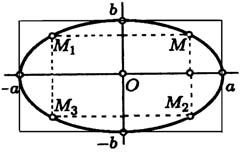

Точки пересечения эллипса с осями канонической системы координат, имеющие координаты $(a,0)$, $(-a,0)$, $(0,b)$ и $(0,-b)$, называются *вершинами* эллипса. Числа $a$ и $b$ называются соответственно *большой* и *малой полуосями* эллипса.

В соответствии с замечанием, сделанным на стр. 93, мы можем сформулировать

**Предложение 1.** *Оси канонической системы координат являются осями симметрии эллипса, а начало канонической системы — его центром симметрии (рис. 26).*

---
**стр. 97**

---

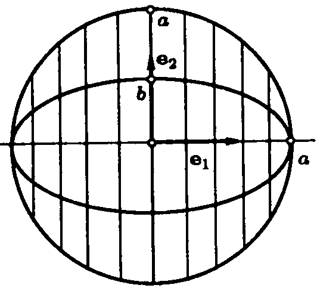
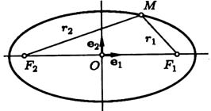

Внешний вид эллипса проще всего описать сравнением с окружностью радиуса $a$, центр которой в центре эллипса: $x^2+y^2=a^2$. При каждом $x$ таком, что $|x|<a$, найдутся две точки эллипса с ординатами $\pm b\sqrt{1-x^2/a^2}$ и две точки окружности с ординатами $\pm a\sqrt{1-x^2/a^2}$. Пусть точке эллипса соответствует точка окружности с ординатой того же знака. Тогда отношение ординат соответствующих точек равно $b/a$. Итак, эллипс получается из окружности таким сжатием ее к оси абсцисс, при котором ординаты всех точек уменьшаются в одном и том же отношении $b/a$ (рис. 27).

С эллипсом связаны две замечательные точки, называемые его *фокусами*. Пусть по определению

$$c^2=a^2-b^2 \tag{2}$$

и $c\geqslant0$. *Фокусами* называются точки $F_1$ и $F_2$ с координатами $(c,0)$ и $(-c,0)$ в канонической системе координат (рис. 28).

Для окружности $c=0$, и оба фокуса совпадают с центром. Ниже мы будем предполагать, что эллипс не является окружностью.

Отношение

$$\varepsilon=\frac{c}{a} \tag{3}$$

называется *эксцентриситетом* эллипса. Отметим, что $\varepsilon<1$.

---
**стр. 98**

---

**Предложение 2.** *Расстояние от произвольной точки $M(x,y)$, лежащей на эллипсе, до каждого из фокусов (рис. 28) является линейной функцией от ее абсциссы $x$:*

$$r_1=|F_1M|=a-\varepsilon x, \quad r_2=|F_2M|=a+\varepsilon x. \tag{4}$$

Доказательство. Очевидно, что $r_1^2=(x-c)^2+y^2$. Подставим сюда выражение для $y^2$, найденное из уравнения эллипса. Мы получим

$$r_1^2=x^2-2cx+c^2+b^2-\frac{b^2x^2}{a^2}.$$

Учитывая равенство (2), это можно привести к виду

$$r_1^2=a^2-2cx+\frac{c^2x^2}{a^2}=(a-\varepsilon x)^2.$$

Так как $|x|\leqslant a$ и $0<\varepsilon<1$, отсюда следует, что справедливо первое из равенств (4): $r_1=a-\varepsilon x$. Второе равенство доказывается аналогично.

**Предложение 3.** *Для того чтобы точка лежала на эллипсе, необходимо и достаточно, чтобы сумма ее расстояний до фокусов равнялась большой оси эллипса $2a$.*

Необходимость условия очевидна: если мы сложим равенства (4) почленно, то увидим, что

$$r_1+r_2=2a. \tag{5}$$

Докажем достаточность.

$$\sqrt{(x-c)^2+y^2}=2a-\sqrt{(x+c)^2+y^2}.$$

Возведем обе части равенства в квадрат и приведем подобные члены:

$$xc+a^2=a\sqrt{(x+c)^2+y^2}. \tag{6}$$

Это равенство также возведем в квадрат и приведем подобные члены, используя соотношение (2). Мы придем к равенству $b^2x^2+a^2y^2=a^2b^2$, равносильному уравнению эллипса (1).

---
**стр. 99**

---

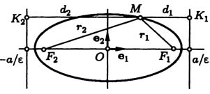

С эллипсом связаны две замечательные прямые, называемые его *директрисами*. Их уравнения в канонической системе координат (рис. 29)

$$x=\frac{a}{\varepsilon} \quad \text{и} \quad x=-\frac{a}{\varepsilon}. \tag{7}$$

Директрису и фокус, которые лежат по одну сторону от центра, будем считать соответствующими друг другу.

**Предложение 4.** *Для того чтобы точка лежала на эллипсе, необходимо и достаточно, чтобы отношение ее расстояния до фокуса к расстоянию до соответствующей директрисы равнялось эксцентриситету эллипса $\varepsilon$.*

Докажем это предложение для фокуса $F_2(-c,0)$. Пусть $M(x,y)$ — произвольная точка эллипса. Расстояние от $M$ до директрисы с уравнением $x=-a/\varepsilon$ по формуле (9) § 3 гл. II равно

$$d_2=\left|x+\frac{a}{\varepsilon}\right|=\frac{1}{\varepsilon}(\varepsilon x+a).$$

Из формулы (4) мы видим теперь, что $r_2/d_2=\varepsilon$.

Обратно, пусть для какой-то точки плоскости $r_2/d_2=\varepsilon$, то есть

$$\sqrt{(x+c)^2+y^2}=\varepsilon(x+a/\varepsilon).$$

Так как $\varepsilon=c/a$, это равенство легко приводится к виду (6), из которого, как мы знаем, следует уравнение эллипса.

Выведем уравнение касательной к эллипсу, заданному каноническим уравнением. Пусть $M_0(x_0,y_0)$ — точка на эллипсе и $y_0\neq0$. Через $M_0$ проходит график некоторой функции $y=f(x)$, который целиком лежит на эллипсе. (Для $y_0>0$ это — график $f_1(x)=b\sqrt{1-x^2/a^2}$, для $y_0<0$ — график $f_2(x)=-b\sqrt{1-x^2/a^2}$. Не уточняя знак $y_0$, обозначим $f(x)$ подходящую функцию.) Для нее выполнено тождество

$$\frac{x^2}{a^2}+\frac{(f(x))^2}{b^2}=1.$$

---
**стр. 100**

---

Дифференцируем его по $x$:

$$\frac{2x}{a^2}+\frac{2ff'}{b^2}=0.$$

Подставляя $x=x_0$ и $f(x_0)=y_0$, находим производную от $f$ в точке $x_0$, равную угловому коэффициенту касательной:

$$f'(x_0)=-\frac{b^2}{a^2}\frac{x_0}{y_0}.$$

Теперь мы можем написать уравнение касательной:

$$y-y_0=-\frac{b^2}{a^2}\frac{x_0}{y_0}(x-x_0).$$

Упрощая это уравнение, учтем, что $b^2x_0^2+a^2y_0^2=a^2b^2$, так как $M_0$ лежит на эллипсе. Результату можно придать вид

$$\frac{xx_0}{a^2}+\frac{yy_0}{b^2}=1. \tag{8}$$

При выводе уравнения (8) мы исключили вершины эллипса $(a,0)$ и $(-a,0)$, положив $y_0\neq0$. Для этих точек оно превращается соответственно в уравнения $x=a$ и $x=-a$. Эти уравнения определяют касательные в вершинах. Проверить это можно, заметив, что в вершинах $x$ как функция от $y$ достигает экстремума. Предоставим читателю проделать это подробно и показать тем самым, что уравнение (8) определяет касательную для любой точки $M_0(x_0,y_0)$ на эллипсе.

**Предложение 5.** *Касательная к эллипсу в точке $M_0(x_0,y_0)$ есть биссектриса угла, смежного с углом между отрезками, соединяющими эту точку с фокусами.*

Доказательство. Нам надо сравнить углы $\varphi_1$ и $\varphi_2$, составленные векторами $\overrightarrow{F_1M_0}$ и $\overrightarrow{F_2M_0}$ с вектором $\mathbf{n}$, перпендикулярным касательной (рис. 30). Из уравнения (8) находим, что $\mathbf{n}(x_0/a^2,y_0/b^2)$, и потому

$$(\overrightarrow{F_1M_0},\mathbf{n})=\frac{x_0}{a^2}(x_0-c)+\frac{y_0}{b^2}y_0=1-\frac{x_0c}{a^2}=\frac{a-\varepsilon x_0}{a}.$$

---
**стр. 101**

---

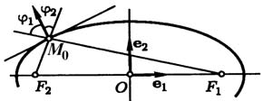
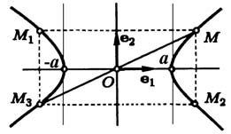

Используя (4), мы получаем отсюда, что $(\overrightarrow{F_1M_0},\mathbf{n})=r_1/a$, и $\cos\varphi_1=1/(a|\mathbf{n}|)$. Аналогично находим $\cos\varphi_2=1/(a|\mathbf{n}|)$. Предложение доказано.

**2. Гипербола.** Гиперболой мы назвали линию, которая в некоторой декартовой прямоугольной системе координат определяется каноническим уравнением

$$\frac{x^2}{a^2}-\frac{y^2}{b^2}=1. \tag{9}$$

Из этого уравнения видно, что для всех точек гиперболы $|x|\geqslant a$, то есть все точки гиперболы лежат вне вертикальной полосы ширины $2a$ (рис. 31). Ось абсцисс канонической системы координат пересекает гиперболу в точках с координатами $(a,0)$ и $(-a,0)$, называемых *вершинами* гиперболы. Ось ординат не пересекает гиперболу. Таким образом, гипербола состоит из двух не связанных между собой частей. Они называются ее *ветвями*. Числа $a$ и $b$ называются соответственно *вещественной* и *мнимой полуосями* гиперболы (рис. 31).

Как и для эллипса, из замечания на стр. 93 следует

**Предложение 6.** *Для гиперболы оси канонической системы координат являются осями симметрии, а начало канонической системы — центром симметрии (рис. 31).*

Для исследования формы гиперболы найдем ее пересечение с произвольной прямой, проходящей через начало координат. Уравнение прямой возьмем в виде $y=kx$, поскольку мы уже знаем, что прямая $x=0$ не пересекает гиперболу.

---
**стр. 102**

---

Абсциссы точек пересечения находятся из уравнения

$$\frac{x^2}{a^2}-\frac{k^2x^2}{b^2}=1.$$

Поэтому, если $b^2-a^2k^2>0$, то

$$x=\pm\frac{ab}{\sqrt{b^2-a^2k^2}}.$$

Это позволяет указать точки пересечения $(ab/v,abk/v)$ и $(-ab/v,-abk/v)$, где обозначено $v=(b^2-a^2k^2)^{1/2}$. В силу симметрии достаточно проследить за движением первой из точек при изменении $k$ (рис. 32).

Числитель дроби $ab/v$ постоянен, а знаменатель принимает наибольшее значение при $k=0$. Следовательно, наименьшую абсциссу имеет вершина $(a,0)$. С ростом $k$ знаменатель убывает, и $x$ растет, стремясь к бесконечности, когда $k$ приближается к числу $b/a$. Прямая $y=bx/a$ с угловым коэффициентом $b/a$ не пересекает гиперболу, и прямые с большими угловыми коэффициентами ее тем более не пересекают. Любая прямая с меньшим положительным угловым коэффициентом пересекает гиперболу.

Если мы будем поворачивать прямую от горизонтального положения по часовой стрелке, то $k$ будет убывать, $k^2$ — расти, а прямая будет пересекать гиперболу во все удаляющихся точках, пока не займет положения с угловым коэффициентом $-b/a$.

К прямой $y=-bx/a$ относится все, что было сказано о $y=bx/a$: она не пересекает гиперболу и отделяет прямые, пересекающие ее, от непересекающих. Из приведенных рассуждений вытекает, что гипербола имеет вид, изображенный на рис. 32.

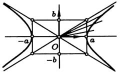

**Определение.** Прямые с уравнениями $y=bx/a$ и $y=-bx/a$ в канонической системе координат называются *асимптотами* гиперболы.

---
**стр. 103**

---

Запишем уравнения асимптот в виде $bx-ay=0$ и $bx+ay=0$. Расстояния от точки $M(x,y)$ до асимптот равны соответственно:

$$h_1=\frac{|bx-ay|}{\sqrt{a^2+b^2}}, \quad h_2=\frac{|bx+ay|}{\sqrt{a^2+b^2}}.$$

Если точка $M$ находится на гиперболе, то $b^2x^2-a^2y^2=a^2b^2$, и

$$h_1h_2=\frac{|b^2x^2-a^2y^2|}{a^2+b^2}=\frac{a^2b^2}{a^2+b^2}.$$

**Предложение 7.** *Произведение расстояний от точки гиперболы до асимптот постоянно и равно $a^2b^2/(a^2+b^2)$.*

Отсюда следует важное свойство асимптот.

**Предложение 8.** *Если точка движется по гиперболе так, что ее абсцисса по абсолютной величине неограниченно возрастает, то расстояние от точки до одной из асимптот стремится к нулю.*

Действительно, хотя бы одно из расстояний $h_1$ или $h_2$ при этих условиях должно неограниченно возрастать, и, если бы предложение было неверно, произведение не было бы постоянно.

Введем число $c$, положив

$$c^2=a^2+b^2 \tag{10}$$

и $c>0$. *Фокусами* гиперболы называются точки $F_1$ и $F_2$ с координатами $(c,0)$ и $(-c,0)$ в канонической системе координат (рис. 33).

Отношение $\varepsilon=c/a$, как и для эллипса, называется *эксцентриситетом*. У гиперболы $\varepsilon>1$.

**Предложение 9.** *Расстояния от произвольной точки $M(x,y)$ на гиперболе до каждого из фокусов следующим образом зависят от ее абсциссы $x$:*

$$r_1=|F_1M|=|a-\varepsilon x|, \quad r_2=|F_2M|=|a+\varepsilon x|. \tag{11}$$

Доказательство этого утверждения почти дословно совпадает

---
**стр. 104**

---

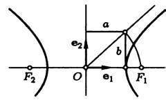
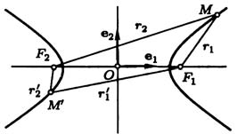

с доказательством предложения 2, и мы не будем его воспроизводить. Заметим, что равенства (11) можно подробнее записать так: для правой ветви гиперболы ($x\geqslant a$)

$$r_1=\varepsilon x-a, \quad r_2=\varepsilon x+a;$$

для левой ветви гиперболы ($x\leqslant-a$)

$$r_1=a-\varepsilon x, \quad r_2=-\varepsilon x-a;$$

Итак, для правой ветви $r_2-r_1=2a$, а для левой ветви $r_1-r_2=2a$. В обоих случаях

$$|r_2-r_1|=2a. \tag{12}$$

**Предложение 10.** *Для того, чтобы точка $M$ лежала на гиперболе, необходимо и достаточно, чтобы разность ее расстояний до фокусов по абсолютной величине равнялась вещественной оси гиперболы $2a$.*

Необходимость условия уже доказана. Для доказательства достаточности условия его нужно представить в виде

$$\sqrt{(x-c)^2+y^2}=\pm2a+\sqrt{(x+c)^2+y^2}.$$

Дальнейшее отличается от доказательства предложения 3 только тем, что нужно воспользоваться равенством (10), а не (2).

*Директрисами* гиперболы называются прямые, задаваемые в канонической системе координат уравнениями

$$x=\frac{a}{\varepsilon}, \quad x=-\frac{a}{\varepsilon}. \tag{13}$$

---
**стр. 105**

---

Директрисы лежат ближе к центру, чем вершины, и, следовательно, не пересекают гиперболу. Директриса и фокус, лежащие по одну сторону от центра, считаются соответствующими друг другу.

**Предложение 11.** *Для того, чтобы точка лежала на гиперболе, необходимо и достаточно, чтобы отношение ее расстояния до фокуса к расстоянию до соответствующей директрисы равнялось эксцентриситету $\varepsilon$ (рис. 35).*

Доказательство повторяет доказательство предложения 4. Докажем, например, необходимость условия для фокуса $F_2(-c,0)$. Пусть $M(x,y)$ — точка гиперболы. Расстояние от $M$ до директрисы с уравнением $x=-a/\varepsilon$ по формуле (9) § 3 гл. II равно

$$d_2=\left|x+\frac{a}{\varepsilon}\right|=\frac{1}{\varepsilon}|\varepsilon x+a|.$$

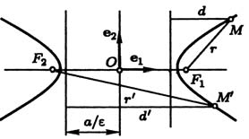

Из формулы (11) мы видим теперь, что $r_2/d_2=\varepsilon$.

Уравнение касательной к гиперболе в точке $M_0(x_0,y_0)$, лежащей на ней, выводится так же, как соответствующее уравнение (8) для эллипса. Оно имеет вид

$$\frac{xx_0}{a^2}-\frac{yy_0}{b^2}=1. \tag{14}$$

**Предложение 12.** *Касательная к гиперболе в точке $M_0(x_0,y_0)$ есть биссектриса угла между отрезками, соединяющими эту точку с фокусами.*

Доказательство почти не отличается от доказательства предложения 5. Рекомендуем читателю полностью провести доказательства этого и остальных утверждений, здесь сформулированных, но не доказанных для гиперболы.

**3. Парабола.** Параболой мы назвали линию, которая в некоторой декартовой прямоугольной системе координат определяется каноническим уравнением

$$y^2=2px \tag{15}$$

при условии $p>0$.

---
**стр. 106**

---

Из уравнения (15) вытекает, что для всех точек параболы $x\geqslant0$. Парабола проходит через начало канонической системы координат. Эта точка называется *вершиной* параболы.

Форма параболы известна из курса средней школы, где она встречается в качестве графика функции $y=ax^2$. Отличие уравнений объясняется тем, что в канонической системе координат по сравнению с прежней оси координат поменялись местами, а коэффициенты связаны равенством $a=1/2p$.

*Фокусом* параболы называется точка $F$ с координатами $(p/2,0)$ в канонической системе координат.

*Директрисой* параболы называется прямая с уравнением $x=-p/2$ в канонической системе координат (прямая $PQ$ на рис. 36).

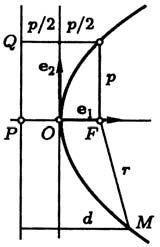

**Предложение 13.** *Расстояние от точки $M(x,y)$, лежащей на параболе, до фокуса равно*

$$r=x+\frac{p}{2}. \tag{16}$$

Для доказательства вычислим квадрат расстояния от точки $M(x,y)$ до фокуса по координатам этих точек: $r^2=(x-p/2)^2+y^2$ и подставим сюда $y^2$ из канонического уравнения параболы. Мы получаем

$$r^2=\left(x-\frac{p}{2}\right)^2+2px=\left(x+\frac{p}{2}\right)^2.$$

Отсюда в силу $x\geqslant0$ получаем (16).

Заметим, что расстояние от точки $M$ до директрисы по формуле (9) § 3 гл. II также равно

$$d=x+\frac{p}{2}. \tag{17}$$

Отсюда вытекает необходимость следующего условия:

**Предложение 14.** *Для того, чтобы точка $M$ лежала на параболе, необходимо и достаточно, чтобы она была одинаково удалена от фокуса и от директрисы этой параболы.*

---
**стр. 107**

---

Докажем достаточность. Пусть точка $M(x,y)$ одинаково удалена от фокуса и от директрисы параболы:

$$\sqrt{\left(x-\frac{p}{2}\right)^2+y^2}=x+\frac{p}{2}.$$

Возводя это уравнение в квадрат и приводя в нем подобные члены, мы получаем из него уравнение параболы (15). Это заканчивает доказательство.

Параболе приписывается эксцентриситет $\varepsilon=1$. В силу этого соглашения формула

$$\frac{r}{d}=\varepsilon$$

верна и для эллипса, и для гиперболы, и для параболы.

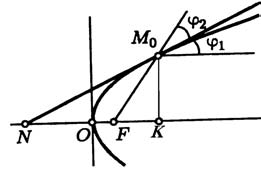

Выведем уравнение касательной к параболе в точке $M_0(x_0,y_0)$, лежащей на ней. Пусть $y_0\neq0$. Через точку $M_0$ проходит график функции $y=f(x)$, целиком лежащий на параболе. (Это $y=\sqrt{2px}$ или же $y=-\sqrt{2px}$, смотря по знаку $y_0$.) Для функции $f(x)$ выполнено тождество $(f(x))^2=2px$, дифференцируя которое, имеем $2f(x)f'(x)=2p$. Подставляя $x=x_0$ и $f(x_0)=y_0$, находим $f'(x_0)=p/y_0$. Теперь мы можем написать уравнение касательной к параболе

$$y-y_0=\frac{p}{y_0}(x-x_0).$$

Упростим его. Для этого раскроем скобки и вспомним, что $y_0^2=2px_0$. Уравнение касательной принимает окончательный вид

$$yy_0=p(x+x_0). \tag{18}$$

Заметим, что для вершины параболы, которую мы исключили, положив $y_0\neq0$, уравнение (18) превращается в уравнение $x=0$, то есть в уравнение касательной в вершине.

---
**стр. 108**

---

Поэтому уравнение (18) справедливо для любой точки на параболе.

**Предложение 15.** *Касательная к параболе в точке $M_0$ есть биссектриса угла, смежного с углом между отрезком, который соединяет $M_0$ с фокусом, и лучом, выходящим из этой точки в направлении оси параболы (рис. 37).*

Действительно, касательная к параболе в точке $M_0(x_0,y_0)$ пересекает ось абсцисс в точке $N(-x_0,0)$. Следовательно, если фокус параболы $F(p/2,0)$, то $|NF|=x_0+p/2$. С другой стороны, по формуле (16) $|M_0F|=x_0+p/2$.

Значит, треугольник $M_0NF$ равнобедренный и потому

$$\varphi_1=\angle M_0NF=\angle NM_0F=\varphi_2,$$

как и требовалось.

Отметим как самостоятельный результат, что $|M_0F|=|NF|=|OK|$.

### Упражнения

1. Докажите, что вершины гиперболы и точки пересечения ее асимптот с директрисами лежат на одной окружности.

2. Фокус эллипса (гиперболы или параболы) делит проходящую через него хорду на отрезки длины $u$ и $v$. Докажите, что сумма $1/u+1/v$ постоянна.

3. Выведите уравнение эллипса, гиперболы и параболы в полярной системе координат, приняв за полюс фокус, а за полярную ось — луч, лежащий на оси симметрии и не пересекающий директрису, соответствующую данному фокусу.

4. На плоскости нарисованы эллипс и парабола вместе с их осями симметрии. Как с помощью циркуля и линейки построить их фокусы и директрисы? Тот же вопрос относительно гиперболы, у которой нарисованы асимптоты. (Задача построения осей симметрии и асимптот решается на основании материала § 3.)

5. Пусть $u$ и $v$ — длины двух взаимно перпендикулярных радиусов эллипса. Выразите сумму $1/u^2+1/v^2$ через полуоси эллипса.

6. Найдите кратчайшее расстояние от параболы $y^2=12x$ до прямой $x-y+7=0$.

7. Докажите, что отрезок касательной, заключенный между асимптотами гиперболы, делится пополам точкой касания.

8. В уравнение (8) касательной к эллипсу в качестве $x_0$ и $y_0$ подставлены координаты точки, лежащей не на эллипсе, а вне эллипса. Как расположена получившаяся прямая?

9. Из точки на директрисе проведены две касательные к параболе. Докажите, что они взаимно перпендикулярны и отрезок, соединяющий точки касания, проходит через фокус.

Решения упражнений 1–9: [[../reshebnik_beklemishev/rbek_g03_s02|Решебник, Гл. III §2]].
