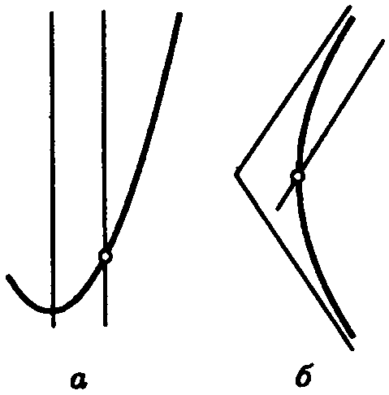
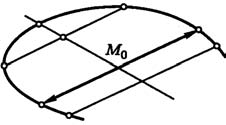
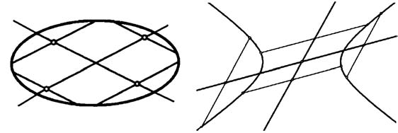
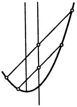

# Глава III. Линии и поверхности второго порядка

## § 3. Линия второго порядка, заданная общим уравнением

---
**стр. 109**
---

**1. Пересечение линии второго порядка и прямой.** Рассмотрим линию второго порядка, заданную общим уравнением

$$Ax^2+2Bxy+Cy^2+2Dx+2Ey+F=0 \tag{1}$$

в декартовой системе координат, и исследуем пересечение этой линии с произвольной прямой

$$x=x_0+\alpha t, \quad y=y_0+\beta t. \tag{2}$$

Значения параметра $t$, соответствующие точкам пересечения, должны удовлетворять уравнению, получаемому подстановкой (2) в (1):

$$A(x_0+\alpha t)^2+2B(x_0+\alpha t)(y_0+\beta t)+C(y_0+\beta t)^2+2D(x_0+\alpha t)+2E(y_0+\beta t)+F=0. \tag{3}$$

Раскрывая скобки и приводя подобные члены, мы получим уравнение

$$Pt^2+2Qt+R=0, \tag{4}$$

в котором

$$P=A\alpha^2+2B\alpha\beta+C\beta^2, \tag{5}$$
$$Q=(Ax_0+By_0+D)\alpha+(Bx_0+Cy_0+E)\beta, \tag{6}$$

или, при другой группировке слагаемых,

$$Q=(A\alpha+B\beta)x_0+(B\alpha+C\beta)y_0+D\alpha+E\beta. \tag{7}$$

---
**стр. 110**

---

Свободный член — это значение многочлена при $t=0$, т. е.

$$R=Ax_0^2+2Bx_0y_0+Cy_0^2+2Dx_0+2Ey_0+F=0. \tag{8}$$

Вообще говоря, уравнение (4) — квадратное, имеет не больше двух корней, и прямая пересекает линию или в двух точках, или в одной точке (кратные корни), или не пересекает ее (комплексные корни). Но возможны исключительные прямые, для которых $P=0$, то есть

$$A\alpha^2+2B\alpha\beta+C\beta^2=0, \tag{9}$$

и, следовательно, уравнение (4) является линейным. В этом случае оно имеет один корень при $Q\neq0$, а при $Q=0$ либо выполнено тождественно (если и $R=0$), либо не имеет решений. Следовательно, «исключительные» прямые или пересекают линию в единственной точке, или лежат на ней целиком, или не имеют с ней общих точек.

В равенство (9) не входят координаты начальной точки прямой. Кроме того, оно остается справедливым, если умножить $\alpha$ и $\beta$ на общий ненулевой множитель. Поэтому свойство «исключительности» связано только с направлением прямой.

Ниже мы обозначаем направление прямой компонентами ненулевого вектора, имеющего это направление. Ясно, что $\alpha$ и $\beta$ интересуют нас с точностью до общего множителя.

**Определение.** Направление, определяемое вектором, компоненты которого удовлетворяют уравнению (9), называется *асимптотическим направлением* линии второго порядка.

**2. Тип линии.** Выясним, сколько асимптотических направлений может иметь линия второго порядка. Обозначив

$$\delta=\begin{vmatrix}A&B\\B&C\end{vmatrix},$$

сформулируем следующее

**Предложение 1.** *Линия второго порядка имеет два асимптотических направления, если $\delta<0$, одно, если $\delta=0$, и ни одного, если $\delta>0$.*

Доказательство. Рассмотрим два случая:

---
**стр. 111**

---

1) Пусть $C\neq0$. Тогда вектор $(0,1)$ не является решением уравнения (9), и каждое решение можно задать угловым коэффициентом $k=\beta/\alpha$, удовлетворяющим уравнению $Ck^2+2Bk+A=0$. Дискриминант этого уравнения равен $B^2-AC=-\delta$. Следовательно, оно имеет два вещественных корня при $\delta<0$, один корень при $\delta=0$ и не имеет вещественных корней при $\delta>0$.

2) Пусть $C=0$. Уравнение (9) имеет вид $A\alpha^2+2B\alpha\beta=0$. Тогда при $B\neq0$ имеем $\delta=-B^2<0$, и уравнению удовлетворяют векторы $(0,1)$ и $(2B,-A)$, которые не коллинеарны. Если же при $C=0$ и $B=0$, то $\delta=0$, а найденные выше два вектора коллинеарны. Этим предложение доказано.

Мы определили асимптотические направления при помощи аналитического условия (9). Поэтому в принципе при изменении системы координат асимптотическое направление могло бы перестать быть асимптотическим, или, наоборот, обыкновенное направление стать асимптотическим. Можно доказать, хотя мы и не будем это делать, что в действительности асимптотические направления не зависят от выбора системы координат.

Используя канонические уравнения легко проверить, что эллипс не имеет асимптотических направлений, парабола имеет одно, а гипербола — два асимптотических направления (рис. 38). Поэтому линии второго порядка называются линиями *гиперболического*, *параболического* или *эллиптического* типа, смотря по тому, имеют ли они два, одно или ни одного асимптотического направления.

Для линий гиперболического типа $\delta<0$, для параболического $\delta=0$, а для эллиптического типа $\delta>0$.

**3. Диаметр линии второго порядка.** Назовем *хордой* любой отрезок, концы которого лежат на линии, а остальные

---
**стр. 112**

---

точки на ней не лежат. Таким образом, хорда не может иметь асимптотического направления.

Предположим, что рассматриваемая линия второго порядка имеет по крайней мере одну хорду. Этому условию удовлетворяют эллипсы, гиперболы, пары пересекающихся прямых, параболы и пары параллельных прямых.

Фиксируем какое-нибудь неасимптотическое направление и исследуем множество середин хорд, имеющих это направление. Если начальная точка $M_0(x_0,y_0)$ секущей (2) находится в середине хорды, то корни уравнения (4) равны по абсолютной величине и отличаются знаком (рис. 39). Это будет так и только в том случае, когда $Q=0$.

Используя (7) мы получаем, что середины хорд направления $(\alpha,\beta)$ лежат на прямой

$$(A\alpha+B\beta)x+(B\alpha+C\beta)y+D\alpha+E\beta=0. \tag{10}$$

**Определение.** Прямая (10) называется *диаметром* линии второго порядка, сопряженным направлению $(\alpha,\beta)$. Стоит обратить внимание на то, что диаметром называется вся прямая. Это не означает, что середины хорд заполняют ее целиком. Так может быть, но возможно также, что множество середин хорд есть, например, отрезок или луч.

Конечно, остается сомнение, действительно ли уравнение (10) определяет прямую: не окажутся ли в нем коэффициенты при переменных оба равными нулю? Допустим, что это так, т. е.

$$A\alpha+B\beta=0, \quad B\alpha+C\beta=0.$$

Умножим первое из этих равенств на $\alpha$, второе — на $\beta$ и сложим. Мы получим равенство (9), которое по предположению не имеет места. Следовательно, уравнение (10) определяет прямую.

**4. Центр линии второго порядка.** Обозначим левую часть уравнения (1) через $\Phi(x,y)$ и введем

---
**стр. 113**

---

**Определение.** Точка $O(x_0,y_0)$ называется *центром* линии второго порядка с уравнением $\Phi(x,y)=0$, если для любого вектора $\mathbf{a}(\alpha,\beta)$ выполнено равенство

$$\Phi(x_0+\alpha,y_0+\beta)=\Phi(x_0-\alpha,y_0-\beta). \tag{11}$$

По видимости это определение зависит от выбора системы координат, так как в нем участвует не линия, а многочлен, стоящий в левой части ее уравнения. Допустим, что координаты $(x_0,y_0)$ точки $O$ в некоторой системе координат удовлетворяют равенству (11). Будут ли ее координаты $(\tilde x_0,\tilde y_0)$ в другой системе координат удовлетворять равенству того же вида для многочлена $\tilde\Phi$, задающего ту же линию в новой системе координат? Легко видеть, что это так, потому что многочлен $\tilde\Phi$ так и выбирается, чтобы для координат любой точки выполнялось равенство $\tilde\Phi(\tilde x,\tilde y)=\Phi(x,y)$. Нам остается только выписать это равенство для точек, получаемых из $O$ сдвигом на векторы $\mathbf{a}$ и $-\mathbf{a}$.

Ниже мы докажем, что в том случае, когда линия содержит хоть одну точку, центры линии и только они являются ее центрами симметрии. Однако понятие центра несколько более общее, так как линии, являющиеся пустыми множествами, имеют вполне определенные центры, хотя говорить об их центрах симметрии смысла нет. Например, каждая точка прямой $y=0$ является центром линии с уравнением $y^2+1=0$.

Получим систему уравнений для координат центра. С этой целью напишем подробнее равенство (11). Его левая часть равна

$$A(x_0+\alpha)^2+2B(x_0+\alpha)(y_0+\beta)+C(y_0+\beta)^2+2D(x_0+\alpha)+2E(y_0+\beta)+F.$$

Правая часть отличается от левой только знаками у $\alpha$ и $\beta$. Поэтому при вычитании $\Phi(x_0-\alpha,y_0-\beta)$ из $\Phi(x_0+\alpha,y_0+\beta)$ уничтожатся все члены, кроме тех, в которые $\alpha$ и $\beta$ входят в первой степени, а члены с первыми степенями удвоятся. После упрощений мы получаем

$$(Ax_0+By_0+D)\alpha+(Bx_0+Cy_0+E)\beta=0. \tag{12}$$

---
**стр. 114**

---

Но равенство (11), а вместе с ним и равносильное равенство (12) имеет место при любых $\alpha$ и $\beta$, в частности, при $\alpha=1$, $\beta=0$ и при $\alpha=0$, $\beta=1$. Отсюда следует, что координаты $(x_0,y_0)$ центра должны удовлетворять системе уравнений

$$Ax_0+By_0+D=0,$$
$$Bx_0+Cy_0+E=0. \tag{13}$$

Легко видеть, что и обратно, если справедливы равенства (13), то умножая их на произвольные числа $\alpha$ и $\beta$ и складывая, мы получаем (12), а тем самым и (11).

Исследуем, обязательно ли существуют центры у линии второго порядка, а если они существуют, то сколько их и как они расположены. Система уравнений (13) согласно предложению 8 § 2 гл. II имеет единственное решение тогда и только тогда, когда

$$\delta=\begin{vmatrix}A&B\\B&C\end{vmatrix}\neq0. \tag{14}$$

Таким образом, условие $\delta\neq0$ необходимо и достаточно для того, чтобы линия второго порядка имела единственный центр.

**Определение.** Линии второго порядка, имеющие единственный центр, называются *центральными*.

Полученное условие показывает, что центральными являются линии эллиптического и гиперболического типов.

Условие $\delta=0$ характеризует нецентральные линии. Это — линии параболического типа. При условии $\delta=0$ система (13) либо не имеет решения, либо равносильна одному из составляющих ее уравнений (предложение 8 § 2 гл. II). Это значит, что нецентральная линия либо не имеет центра (парабола), либо ее центры заполняют прямую линию (пары параллельных прямых, вещественных или мнимых, и пары совпавших прямых).

**Предложение 2.** *Если линия второго порядка не является пустым множеством и имеет центр $O(x_0,y_0)$, то он — ее центр симметрии.*

В самом деле, рассмотрим произвольную точку $M(x,y)$ линии и докажем, что симметричная ей относительно $O$ точ-

---
**стр. 115**

---

ка $M_1(x_1,y_1)$ также лежит на линии. $M_1$ определяется равенством $\overrightarrow{OM_1}=-\overrightarrow{OM}$. Если $(\alpha,\beta)$ — координаты вектора $\overrightarrow{OM}$, то $x=x_0+\alpha$, $y=y_0+\beta$, а $x_1=x_0-\alpha$, $y_1=y_0-\beta$. Теперь ясно, что в силу (11) из $\Phi(x,y)=0$ следует $\Phi(x_1,y_1)=0$. Предложение доказано.

**Предложение 3.** *Если линия содержит хотя бы одну точку и имеет центр симметрии $O(x_0,y_0)$, то $O$ является центром.*

Доказательство. Рассмотрим пересечение линии с прямой, проходящей через $O$, приняв эту точку за начальную точку. Имеются две возможности:

1) Точка $O$ лежит на линии. Пусть прямая имеет неасимптотическое направление. Тогда $O$ — единственная точка пересечения, так как иначе с учетом симметрии точек пересечения было бы не меньше трех. Следовательно, уравнение (4) имеет кратный корень $t=0$, откуда вытекает $Q=0$. Итак, координаты точки $O$ удовлетворяют равенству (12) при любых $\alpha$ и $\beta$, соответствующих неасимптотическим направлениям. Выберем два различных неасимптотических направления $(\alpha,\beta)$ и $(\alpha',\beta')$ ($\alpha\beta'-\alpha'\beta\neq0$), и рассмотрим равенства

$$(Ax_0+By_0+D)\alpha+(Bx_0+Cy_0+E)\beta=0,$$
$$(Ax_0+By_0+D)\alpha'+(Bx_0+Cy_0+E)\beta'=0$$

как систему уравнений с коэффициентами $\alpha,\beta,\alpha',\beta'$. Мы получаем равенства (13), как и требовалось.

2) Точка $O$ не лежит на линии. Если прямая пересекает линию в точке $M$, которой соответствует значение параметра $t_1\neq0$, то существует симметричная точка пересечения со значением параметра $-t_1$. Тогда $Pt_1^2+2Qt_1+R=0$ и $Pt_1^2-2Qt_1+R=0$, откуда следует $Q=0$.

Таким образом, если линия имеет точки пересечения с двумя различными прямыми, проходящими через $O$, то, как и выше, мы можем получить равенства (13) для координат $O$. Докажем, что такие прямые обязательно найдутся. Действительно, в противном случае все точки линии лежат на одной прямой. Согласно теореме 1 § 1 линии только двух классов обладают этим свойством: пары совпавших прямых и пары мнимых пересекающихся прямых. Но и для того, и для

---
**стр. 116**

---

другого класса все центры симметрии принадлежат линии, что противоречит сделанному предположению. Предложение доказано.

**5. Сопряженные направления.** Направление $(\alpha',\beta')$, определяемое диаметром, сопряженным направлению $(\alpha,\beta)$, называется *сопряженным* направлению $(\alpha,\beta)$. Компоненты $(\alpha',\beta')$ направляющего вектора диаметра (10) согласно предложению 6 § 2 гл. II удовлетворяют условию

$$(A\alpha+B\beta)\alpha'+(B\alpha+C\beta)\beta'=0 \tag{15}$$

или

$$A\alpha\alpha'+B(\alpha'\beta+\alpha\beta')+C\beta\beta'=0. \tag{16}$$

В последнее выражение пары чисел $(\alpha,\beta)$ и $(\alpha',\beta')$ входят симметричным образом. Поэтому имеет место

**Предложение 4.** *Если направление $(\alpha',\beta')$, сопряженное с $(\alpha,\beta)$, не является асимптотическим, то сопряженным для $(\alpha',\beta')$ будет направление $(\alpha,\beta)$ (рис. 40).*

Возникает вопрос, при каких условиях направление, сопряженное какому-нибудь направлению $(\alpha,\beta)$, может оказаться асимптотическим. Это легко выяснить. Из равенства (15) следует, что в качестве $\alpha'$ и $\beta'$ можно выбрать, соответственно, $-(B\alpha+C\beta)$ и $(A\alpha+B\beta)$.

Подставим это в уравнение (9) для асимптотических направлений:

$$A(B\alpha+C\beta)^2-2B(B\alpha+C\beta)(A\alpha+B\beta)+C(A\alpha+B\beta)^2=0.$$

---
**стр. 117**

---

После преобразований получаем $(AC-B^2)(A\alpha^2+2B\alpha\beta+C\beta^2)=0$. Поскольку исходное направление не асимптотическое, это произведение может обратиться в нуль только за счет первого сомножителя. Мы получаем

**Предложение 5.** *Если линия не центральная ($\delta=0$), то для любого направления $(\alpha,\beta)$ сопряженное направление — асимптотическое (рис. 41). Если линия центральная ($\delta\neq0$), то направление, сопряженное любому направлению — не асимптотическое.*

**6. Главные направления.** Если диаметр перпендикулярен хордам, которым он сопряжен, то он является осью симметрии рассматриваемой линии. Введем следующее

**Определение.** Направление $(\alpha,\beta)$ и направление $(\alpha',\beta')$, сопряженного ему диаметра, называются *главными направлениями*, если они перпендикулярны.

Если система координат декартова прямоугольная, то для главного направления компоненты $(\alpha,\beta)$ должны быть пропорциональны коэффициентам уравнения сопряженного диаметра (10), т. е. должно существовать такое число $\lambda$, что

$$A\alpha+B\beta=\lambda\alpha,$$
$$B\alpha+C\beta=\lambda\beta. \tag{17}$$

Исключая $\lambda$, мы получаем уравнение для $\alpha$ и $\beta$:

$$(A-C)\alpha\beta+B(\beta^2-\alpha^2)=0. \tag{18}$$

Если положить $\alpha=\cos\varphi$, $\beta=\sin\varphi$, то уравнение (18) превратится в уравнение (2) § 1, которое, как мы видели, обязательно имеет решение относительно $\varphi$. Поэтому имеет место

**Предложение 6.** *Каждая линия второго порядка имеет хотя бы одну пару главных направлений.*

Более подробное исследование уравнения (18) показывает, что либо эта пара единственная, либо каждая пара перпендику-

---
**стр. 118**

---

лярных направлений является главной. Последний случай имеет место, когда $A=C$, $B=0$. При этом уравнение линии приводится к одному из канонических видов: $x^2+y^2=r^2$, $x^2+y^2=-r^2$. В двух последних случаях линия не имеет хорд, и результат лишен геометрического смысла.

**7. Касательная к линии второго порядка.** Как известно, касательной к какой-либо линии называется предельное положение секущей, когда хорда стягивается в точку. Выведем уравнение касательной к линии второго порядка, заданной уравнением (1). Дадим предварительно следующее

**Определение.** *Особой точкой* линии второго порядка называется ее центр, который лежит на линии.

Особыми точками являются: точка пересечения пары пересекающихся прямых, единственная точка пары мнимых пересекающихся прямых и каждая точка пары совпавших прямых.

В особой точке касательная не определена. Если точка лежит на прямой, входящей в состав линии, то касательная в этой точке совпадает с прямой. Исключив эти случаи, мы фактически ограничиваемся рассмотрением касательных к эллипсам, гиперболам и параболам.

Рассмотрим точку $M_0(x_0,y_0)$, лежащую на линии $L$, и прямую с начальной точкой $M_0$, заданную уравнением (2). С нашей точки зрения приведенное выше определение касательной означает, что уравнение (4), определяющее точки пересечения $L$ и прямой, имеет два совпадающих корня.

Так как начальная точка принадлежит $L$, в уравнении (4) $R=0$, и один из его корней равен нулю. Корни совпадают, если и второй корень равен нулю, для чего необходимо, чтобы и это оказалось так, что и $P=0$, то прямая принадлежит линии второго порядка. Этот случай мы исключили, и потому уравнение имеет кратный корень $t=0$ в том и только в том случае, когда $Q=0$. Мы рассматриваем равенство $Q=0$, определяющее направляющий вектор касательной:

$$(Ax_0+By_0+D)\alpha+(Bx_0+Cy_0+E)\beta=0. \tag{19}$$

Так как $M_0$ не особая точка, обе скобки здесь одновременно в нуль не обращаются, и условие (19) определяет $\alpha$ и $\beta$ с точ-

---
**стр. 119**

---

ностью до общего множителя. Точка $M(x,y)$ лежит на касательной тогда и только тогда, когда вектор $\overrightarrow{M_0M}$ коллинеарен $\mathbf{a}(\alpha,\beta)$, то есть его координаты $x-x_0$ и $y-y_0$ удовлетворяют тому же условию, что и $(\alpha,\beta)$:

$$(Ax_0+By_0+D)(x-x_0)+(Bx_0+Cy_0+E)(y-y_0)=0. \tag{20}$$

Это и есть уравнение касательной к линии $L$ в точке $M_0$, лежащей на линии. Уравнение (20) можно записать и иначе, если заметить, что координаты $M_0$ удовлетворяют уравнению (1) и следовательно

$$(Ax_0+By_0+D)x_0+(Bx_0+Cy_0+E)y_0+Dx_0+Ey_0+F=0. \tag{21}$$

Прибавляя это равенство к (20) и группируя слагаемые, получим окончательное уравнение

$$Axx_0+B(xy_0+x_0y)+Cyy_0+D(x+x_0)+E(y+y_0)+F=0. \tag{22}$$

**8. Особые точки.** Напомним, что особая точка линии второго порядка — это ее центр, лежащий на линии. Исследуем, при каких условиях линия второго порядка имеет особую точку. Пусть $(x_0,y_0)$ — координаты особой точки. Они удовлетворяют уравнению (1), и результат их подстановки в это уравнение представим в виде (21). Так как эта точка — центр, выражения, заключенные в скобки, равны нулю в силу уравнений (13), и мы получаем систему уравнений, равносильную определению особой точки

$$Ax_0+By_0+D=0,$$
$$Bx_0+Cy_0+E=0,$$
$$Dx_0+Ey_0+F=0. \tag{23}$$

Выберем какой-нибудь базис в пространстве и рассмотрим вспомогательные векторы $\mathbf{p}(A,B,D)$, $\mathbf{q}(B,C,E)$ и $\mathbf{r}(D,E,F)$. Равенства (23) представляют собой координатную запись векторного равенства

$$x_0\mathbf{p}+y_0\mathbf{q}=-\mathbf{r}. \tag{24}$$

---
**стр. 120**

---

Значит, при наличии особой точки векторы $\mathbf{p}$, $\mathbf{q}$ и $\mathbf{r}$ компланарны. Отсюда следует

**Предложение 7.** *Для того, чтобы линия, заданная общим уравнением (1), имела особую точку, необходимо, чтобы коэффициенты уравнения удовлетворяли условию*

$$\Delta=\begin{vmatrix}A&B&D\\B&C&E\\D&E&F\end{vmatrix}=0. \tag{25}$$

Если линия центральная, то векторы $\mathbf{p}$ и $\mathbf{q}$ не коллинеарны, и условие компланарности (25) равносильно существованию разложения (24), то есть существованию решения системы (23). Мы получили

**Предложение 8.** *Центральная линия имеет особую точку тогда и только тогда, когда $\Delta=0$.*

Итак, сочетание $\delta<0$, $\Delta=0$ характеризует пары пересекающихся прямых, а $\delta>0$, $\Delta=0$ — пары мнимых пересекающихся прямых.

Рассмотрим нецентральные линии. Условие $\Delta=0$ означает, что векторы $\mathbf{p}$, $\mathbf{q}$ и $\mathbf{r}$ линейно зависимы, то есть существуют коэффициенты $\alpha$, $\beta$ и $\gamma$, такие, что $\alpha\mathbf{p}+\beta\mathbf{q}+\gamma\mathbf{r}=\mathbf{0}$ и $\alpha^2+\beta^2+\gamma^2\neq0$.

а) Пусть в любой такой линейной комбинации $\gamma=0$. Тогда векторы $\mathbf{p}$ и $\mathbf{q}$ коллинеарны, а вектор $\mathbf{r}$ по ним не раскладывается (иначе мы имели бы $\mathbf{r}-\lambda\mathbf{p}-\mu\mathbf{q}=\mathbf{0}$). Следовательно, особой точки на кривой нет. Компоненты векторов $\mathbf{p}$ и $\mathbf{q}$ пропорциональны, а значит, пропорциональны левые части уравнений $Ax_0+By_0+D=0$ и $Bx_0+Cy_0+E=0$. Система уравнений (13) эквивалентна одному из ее уравнений. Это означает, что линия имеет центр, и даже целую прямую, состоящую из центров, но ни один из центров не является особой точкой.

Такими линиями являются пара параллельных прямых и пара мнимых параллельных прямых.

---
**стр. 121**

---

б) В противном случае существует такой набор коэффициентов, в котором $\gamma\neq0$, и система (23) имеет решение $x_0=-\alpha/\gamma$, $y_0=-\beta/\gamma$. Таким образом, линия имеет особую точку.

Из линий параболического типа особыми точками обладает только пара совпавших прямых.

Итак, сочетание $\delta=\Delta=0$ характеризует пары параллельных прямых (вещественных, мнимых или совпавших).

Мы доказали

**Предложение 9.** *Для нецентральных линий условие $\Delta=0$ равносильно существованию центра.*

Из предложений 8 и 9 следует, что равенство $\Delta=0$ является инвариантным: оно не может измениться при переходе к другой системе координат. Можно заметить, что оно характеризует те линии второго порядка, которые распадаются в пару прямых (вещественных или мнимых).

### Упражнения

1. Линия описана около параллелограмма, если его вершины лежат на линии, а остальные точки на ней не лежат. Докажите, что такая линия второго порядка обязательно центральная, и центр ее совпадает с центром параллелограмма.

2. На плоскости нарисованы эллипс, гипербола и парабола. Как с помощью циркуля и линейки построить их оси симметрии и асимптоты гиперболы?

3. Докажите, что сумма квадратов длин хорд, лежащих на сопряженных диаметрах эллипса, постоянна.

4. Не приводя уравнение к каноническому виду, найдите центр и асимптоты гиперболы $3x^2+10xy+3y^2-2x+2y-9=0.$

5. Не приводя уравнение к каноническому виду, скажите, как называется линия с уравнением

а) $3x^2+10xy+3y^2-2x+2y=1;$

б) $x^2+3xy+y^2+7x+8y-11=0?$

6. Как разложить на множители левую часть уравнения из задачи 5а?

7. Напишите уравнение касательной к линии $x^2-2xy+3y^2=3$ в точке $M_0(0,1)$.

Решения упражнений 1–8: [[../reshebnik_beklemishev/rbek_g03_s03|Решебник, Гл. III §3]].
