# Глава III. Линии и поверхности второго порядка

## § 4. Поверхности второго порядка

Подобно тому, как в § 2 были описаны все наиболее интересные линии второго порядка, в настоящем параграфе мы опишем важнейшие поверхности второго порядка, а полную классификацию таких поверхностей отложим до гл. VIII. Составить себе общее представление о большинстве поверхностей второго порядка можно, рассматривая поверхности вращения линий второго порядка вокруг их осей симметрии.

**1. Поверхности вращения.** Поверхность $S$ называется *поверхностью вращения* с осью $d$, если она составлена из окружностей, которые имеют центры на прямой $d$ и лежат в плоскостях, перпендикулярных данной прямой. В основе этого определения лежит следующее представление. Рассмотрим линию $L$, которая лежит в плоскости $P$, проходящей через ось вращения $d$ (рис. 42), и будем вращать ее вокруг этой оси. Каждая точка линии опишет окружность, а вся линия — поверхность вращения.

Выберем начало декартовой прямоугольной системы координат $O$, $\mathbf{e}_1$, $\mathbf{e}_2$, $\mathbf{e}_3$ на оси $d$, вектор $\mathbf{e}_3$ направим вдоль $d$, а вектор $\mathbf{e}_1$ поместим в плоскости $P$. Таким образом, $O$, $\mathbf{e}_1$, $\mathbf{e}_3$ — декартова система координат в плоскости $P$. Пусть линия $L$ имеет в этой системе координат уравнение $f(x,z)=0$.

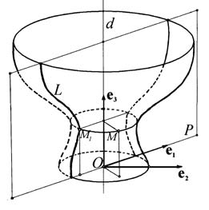

Рассмотрим точку $M(x,y,z)$. Через нее проходит окружность, которая имеет центр на оси $d$ и лежит в плоскости, перпендикулярной этой оси. Радиус окружности равен расстоянию от $M$ до оси, то есть $\sqrt{x^2+y^2}$. Точка $M$ лежит на поверхности вращения тогда и только тогда, когда на указанной окружности имеется точка $M_1$, принадлежащая вращаемой линии $L$.

Точка $M_1(x_1,y_1,z_1)$ лежит в плоскости $P$, и потому $y_1=0$. Кроме того, $z_1=z$ и $|x_1|=\sqrt{x^2+y^2}$, так как $M_1$ лежит на

---
**стр. 123**

---

той же окружности, что и $M$. Координаты точки $M_1$ удовлетворяют уравнению линии $L$: $f(x_1,z_1)=0$. Подставляя в это уравнение $x_1$ и $z_1$, мы получаем условие на координаты точки $M$, необходимое и достаточное для того, чтобы $M$ лежала на поверхности вращения $S$: равенство

$$f(\pm\sqrt{x^2+y^2},z)=0 \tag{1}$$

должно быть выполнено хотя бы при одном из двух знаков перед корнем. Это условие, которое можно записать также в виде

$$f(\sqrt{x^2+y^2},z)f(-\sqrt{x^2+y^2},z)=0, \tag{2}$$

и является уравнением поверхности вращения линии $L$ вокруг оси $d$.

**2. Эллипсоид.** Рассмотрим поверхности, которые получаются при вращении эллипса вокруг его осей симметрии. Направив вектор $\mathbf{e}_3$ сначала вдоль малой оси эллипса, а затем вдоль большой оси, мы получим уравнения эллипса в следующих видах:

$$\frac{x^2}{a^2}+\frac{z^2}{c^2}=1, \quad \frac{z^2}{a^2}+\frac{x^2}{c^2}=1.$$

(Здесь через $c$ обозначена малая полуось эллипса.) В силу формулы (1) уравнения соответствующих поверхностей вращения будут

$$\frac{x^2+y^2}{a^2}+\frac{z^2}{c^2}=1, \quad \frac{z^2}{a^2}+\frac{x^2+y^2}{c^2}=1 \quad (a>c). \tag{3}$$

Поверхности с такими уравнениями называются соответственно *сжатым* и *вытянутым эллипсоидами вращения* (рис. 43).

Каждую точку $M(x,y,z)$ на сжатом эллипсоиде вращения сдвинем к плоскости $y=0$ так, чтобы расстояние от точки до

---
**стр. 124**

---

этой плоскости уменьшилось в постоянном для всех точек отношении $\lambda$ таком, что $a>\lambda a\geqslant c$. После сдвига точка попадет в положение $M'(x',y',z')$, где $x'=x$, $y'=\lambda y$ и $z'=z$. Таким образом, точки эллипсоида вращения переходят в точки

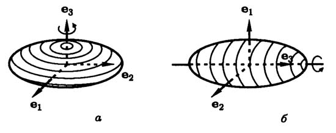

поверхности с уравнением

$$\frac{x'^2}{a^2}+\frac{y'^2}{b^2}+\frac{z'^2}{c^2}=1, \tag{4}$$

где $b=\lambda a$. Поверхность, которая в некоторой декартовой системе координат имеет уравнение (4) называется *эллипсоидом* (рис 44). Если случайно окажется, что $b=c$, мы получим снова эллипсоид вращения, но уже вытянутый.

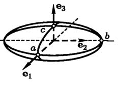

Эллипсоид так же, как и эллипсоид вращения, из которого он получен, представляет собой замкнутую ограниченную поверхность. Из уравнения (4) видно, что начало канонической системы координат — центр симметрии эллипсоида, а координатные плоскости — его плоскости симметрии.

Эллипсоид можно получить из сферы $x^2+y^2+z^2=a^2$ сжатиями к плоскостям $y=0$ и $z=0$ в отношениях $\lambda=b/a$ и $\mu=c/a$.

В этом параграфе нам часто придется прибегать к сжатию, и мы не будем его каждый раз описывать столь подробно.

**3. Конус второго порядка.** Рассмотрим на плоскости $P$ пару пересекающихся прямых, задаваемую в системе коорди-

---
**стр. 125**

---

нат $O$, $\mathbf{e}_1$, $\mathbf{e}_3$ уравнением $a^2x^2-c^2z^2=0$. Поверхность, получаемая вращением этой линии вокруг оси аппликат, имеет уравнение

$$a^2(x^2+y^2)-c^2z^2=0 \tag{5}$$

и носит название *прямого кругового конуса* (рис. 45). Сжатие к плоскости $y=0$ переводит прямой круговой конус в поверхность с уравнением

$$a^2x^2+b^2y^2-c^2z^2=0, \tag{6}$$

называемую *конусом второго порядка*.

Обратите внимание на то, что левая часть уравнения (6) — однородная функция, и поверхность является конусом в смысле определения, введенного в § 1 гл. II.

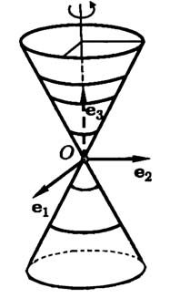

**4. Однополостный гиперболоид.** *Однополостный гиперболоид вращения* — это поверхность вращения гиперболы

$$\frac{x^2}{a^2}-\frac{z^2}{c^2}=1$$

вокруг той оси, которая ее не пересекает. По формуле (1) мы получаем уравнение этой поверхности (рис. 46)

$$\frac{x^2+y^2}{a^2}-\frac{z^2}{c^2}=1. \tag{7}$$

В результате сжатия однополостного гиперболоида вращения к плоскости $y=0$ мы получаем *однополостный гиперболоид* с уравнением

$$\frac{x^2}{a^2}+\frac{y^2}{b^2}-\frac{z^2}{c^2}=1. \tag{8}$$

Интересное свойство однополостного гиперболоида — наличие у него *прямолинейных образующих*. Так называются

---
**стр. 126**

---

прямые линии, всеми своими точками лежащие на поверхности. Через каждую точку однополостного гиперболоида проходят две прямолинейные образующие, уравнения которых можно получить следующим образом. Уравнение (8) можно переписать в виде

$$\left(\frac{x}{a}+\frac{z}{c}\right)\left(\frac{x}{a}-\frac{z}{c}\right)=\left(1+\frac{y}{b}\right)\left(1-\frac{y}{b}\right).$$

Рассмотрим прямую линию с уравнениями

$$\mu\left(\frac{x}{a}+\frac{z}{c}\right)=\lambda\left(1+\frac{y}{b}\right), \quad \lambda\left(\frac{x}{a}-\frac{z}{c}\right)=\mu\left(1-\frac{y}{b}\right), \tag{9}$$

где $\lambda$ и $\mu$ — некоторые числа $\lambda^2+\mu^2\neq0$. Координаты каждой точки прямой удовлетворяют обоим уравнениям, а следовательно, и уравнению (8), которое получается их почленным перемножением. Поэтому каковы бы ни были $\lambda$ и $\mu$, прямая с уравнениями (9) лежит на однополостном гиперболоиде. Таким образом, система (9) определяет семейство прямолинейных образующих. Второе семейство прямолинейных образующих определяется системой

$$\mu'\left(\frac{x}{a}+\frac{z}{c}\right)=\lambda'\left(1-\frac{y}{b}\right), \quad \lambda'\left(\frac{x}{a}-\frac{z}{c}\right)=\mu'\left(1+\frac{y}{b}\right). \tag{10}$$

Покажем на примере, как найти образующие, проходящие через данную точку поверхности. Рассмотрим поверхность $x^2+y^2-z^2=1$ и точку $M_0(1,1,1)$ на ней. Подставляя координаты $M_0$ в уравнения (9), мы получаем условия на $\lambda$ и $\mu$: $2\lambda=2\mu$ и $0\lambda=0\mu$. Первое из них определяет $\lambda$ и $\mu$ с точностью до общего множителя, но только с такой точностью они и нужны. Подставляя эти значения в (9), получаем уравнения прямолинейной образующей

$$x+y=1-z, \quad x-y=1-z.$$

---
**стр. 127**

---

Она проходит через $M_0$, так как $\lambda$ и $\mu$ так и выбирались, чтобы координаты $M_0$ удовлетворяли этой системе. Аналогично, подставляя координаты $M_0$ в (10), находим условия на $\lambda'$ и $\mu'$: $2\lambda'=0$ и $2\lambda'=0$. Коэффициент $\mu'$ можно взять любым ненулевым, и мы приходим к уравнению второй образующей: $x=y$, $z=1$.

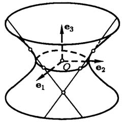
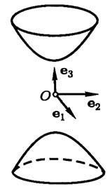

Если вместе с гиперболой мы будем вращать ее асимптоты, то они опишут прямой круговой конус, называемый *асимптотическим конусом* гиперболоида вращения. При сжатии гиперболоида вращения его асимптотический конус сжимается в асимптотический конус общего однополостного гиперболоида.

**5. Двуполостный гиперболоид.** *Двуполостный гиперболоид вращения* — это поверхность получаемая вращением гиперболы

$$\frac{z^2}{c^2}-\frac{x^2}{a^2}=1$$

вокруг той оси, которая ее пересекает. По формуле (1) мы получаем уравнение двуполостного гиперболоида вращения:

$$\frac{z^2}{c^2}-\frac{x^2+y^2}{a^2}=1. \tag{11}$$

---
**стр. 128**

---

В результате сжатия этой поверхности к плоскости $y=0$ получается поверхность с уравнением

$$\frac{z^2}{c^2}-\frac{x^2}{a^2}-\frac{y^2}{b^2}=1. \tag{12}$$

Поверхность, которая в некоторой декартовой прямоугольной системе координат имеет уравнение вида (12), называется *двуполостным гиперболоидом* (рис. 47). Двум ветвям гиперболы здесь соответствуют две не связанные между собой части («полости») поверхности, в то время как при построении однополостного гиперболоида вращения каждая ветвь гиперболы описывала всю поверхность.

Асимптотический конус двуполостного гиперболоида определяется так же, как и для однополостного.

**6. Эллиптический параболоид.** Вращая параболу $x^2=2pz$ вокруг ее оси симметрии, мы получаем поверхность с уравнением

$$x^2+y^2=2pz. \tag{13}$$

Она называется *параболоидом вращения*.

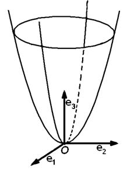

Сжатие к плоскости $y=0$ переводит параболоид вращения в поверхность, уравнение которой приводится к виду

$$\frac{x^2}{a^2}+\frac{y^2}{b^2}=2z. \tag{14}$$

Поверхность, которая имеет такое уравнение в некоторой декартовой прямоугольной системе координат, называется *эллиптическим параболоидом* (рис. 48).

**7. Гиперболический параболоид.** По аналогии с уравнением (14) мы можем написать уравнение

$$\frac{x^2}{a^2}-\frac{y^2}{b^2}=2z. \tag{15}$$

---
**стр. 129**

---

Поверхность, которая имеет уравнение вида (15) в некоторой декартовой прямоугольной системе координат, называется *гиперболическим параболоидом*.

Исследуем форму этой поверхности. Для этого рассмотрим ее сечение плоскостью $x=\alpha$ при произвольном $\alpha$. В этой плоскости выберем декартову прямоугольную систему координат $O'$, $\mathbf{e}_2$, $\mathbf{e}_3$ с началом в точке $O'(\alpha,0,0)$. Относительно этой системы координат линия пересечения имеет уравнение

$$-\frac{y^2}{b^2}=2\left(z-\frac{\alpha^2}{2a^2}\right). \tag{16}$$

Эта линия — парабола, в чем легко убедиться, перенеся начало координат в точку $O''$ с координатами $(0,\alpha^2/2a^2)$. (Координаты этой точки относительно исходной системы координат $O$, $\mathbf{e}_1$, $\mathbf{e}_2$, $\mathbf{e}_3$ в пространстве равны $(\alpha,0,\alpha^2/2a^2)$.)

Точка $O''$, очевидно, является вершиной параболы, ось параболы параллельна вектору $\mathbf{e}_3$, а знак минус в левой части равенства (16) означает, что ветви параболы направлены в сторону, противоположную направлению $\mathbf{e}_3$. Заметим, что после переноса начала координат в точку $O''$ величина $\alpha$ не входит в уравнение линии, и, следовательно, сечения гиперболического параболоида плоскостями $x=\alpha$ при всех $\alpha$ представляют собой равные параболы.

Будем теперь менять величину $\alpha$ и проследим за перемещением вершины параболы $O''$ в зависимости от $\alpha$. Из приведенных выше координат точки $O''$ следует, что эта точка перемещается по линии с уравнениями

$$z=\frac{x^2}{2a^2}, \quad y=0$$

в системе координат $O$, $\mathbf{e}_1$, $\mathbf{e}_2$, $\mathbf{e}_3$. Эта линия — парабола в плоскости $y=0$. Вершина параболы находится в начале координат, ось симметрии совпадает с осью аппликат, а ветви параболы направлены в ту же сторону, что и вектор $\mathbf{e}_3$.

Теперь мы можем построить гиперболический параболоид следующим образом: зададим две параболы и будем перемещать одну из них так, чтобы ее вершина скользила по другой,

---
**стр. 130**

---

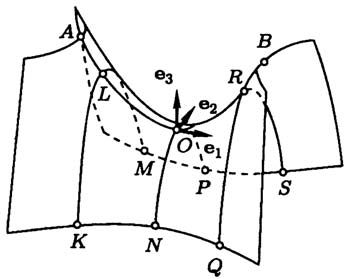

оси парабол были параллельны, параболы лежали во взаимно перпендикулярных плоскостях и ветви их были направлены в противоположные стороны. При таком перемещении подвижная парабола описывает гиперболический параболоид (рис. 49).

Предоставим читателю проверить, что сечения гиперболического параболоида плоскостями с уравнениями $z=\alpha$ при всевозможных $\alpha\neq0$ — гиперболы. Сечение плоскостью $z=0$ — пара пересекающихся прямых. Эти сечения нарисованы на рис. 50, а их проекции на плоскость $z=0$ — на рис. 51.

Гиперболический параболоид, как и однополостный гиперболоид, имеет два семейства прямолинейных образующих (рис. 52). Уравнения одного семейства

$$\lambda\left(\frac{x}{a}-\frac{y}{b}\right)=\mu, \quad \mu\left(\frac{x}{a}+\frac{y}{b}\right)=2\lambda z,$$

а другого

$$\lambda'\left(\frac{x}{a}-\frac{y}{b}\right)=\mu', \quad \mu'\left(\frac{x}{a}+\frac{y}{b}\right)=2\lambda'z.$$

Выводятся эти уравнения так же, как и уравнения прямолинейных образующих однополостного гиперболоида.

---
**стр. 131**

---

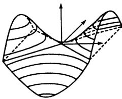
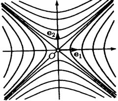

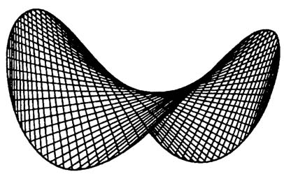

### Упражнения

1. Докажите, что линия пересечения поверхности второго порядка с плоскостью, которая целиком на ней не лежит, есть алгебраическая линия не выше второго порядка. Сколько общих точек могут иметь прямая и поверхность второго порядка?

2. Найдите уравнение и определите вид поверхности, получаемой вращением вокруг оси аппликат прямой линии:

а) $x=1+t$, $y=3+t$, $z=3+t$;

б) $x=1+t$, $y=1+t$, $z=3+t$.

3. Докажите, что прямолинейные образующие гиперболического параболоида, принадлежащие одному семейству, все параллельны какой-то одной плоскости.

---
**стр. 132**

---

4. На гиперболическом параболоиде с уравнением (15) лежат параболы: $y=0$, $x^2=2a^2z$ и $x=0$, $y^2=-2b^2z$. Пусть точки $A_1$ и $B_1$ на первой параболе и точки $A_2$ и $B_2$ на второй все находятся на одинаковом расстоянии от плоскости $z=0$. Докажите, что прямые $A_1B_2$, $A_1A_2$, $B_1A_2$ и $B_1B_2$ являются прямолинейными образующими.

5. Найдите проекцию линии пересечения двуполостного гиперболоида $-x^2+y^2-z^2=1$ и конуса $5x^2-3y^2+4z^2=0$ на плоскость $z=0$.

6. Докажите, что никакая плоскость не пересекает эллиптический параболоид по гиперболе.

Решения упражнений 1–6: [[../reshebnik_beklemishev/rbek_g03_s04|Решебник, Гл. III §4]].
