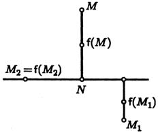

# Глава IV. Преобразования плоскости

## § 1. Отображения и преобразования

**1. Определение.** Под *отображением* плоскости $P$ в плоскость $R$ понимают закон или правило, по которому каждой точке плоскости $P$ сопоставлена некоторая определенная точка на плоскости $R$. Мы будем пользоваться обозначением $f:P\to R$. Если потребуется указать, что точке $A$ на плоскости $P$ соответствует точка $B$ на плоскости $R$, мы будем писать $B=f(A)$. В этом случае точка $B$ называется *образом* точки $A$, а точка $A$ — *прообразом* точки $B$.

Подчеркнем, что совсем не обязательно каждая точка плоскости $R$ является образом какой-либо точки. Вполне может оказаться, что множество всех образов не совпадает с $R$.

Если для некоторого отображения плоскости $P$ и $R$ совпадают, то такое отображение называется *преобразованием* плоскости. Этот вид отображений целесообразно выделить, так как преобразования обладают некоторыми свойствами, которыми не обладают отображения в общем случае.

Разумеется, можно говорить об отображениях произвольных множеств, а не обязательно плоскостей, но в этой главе, за исключением некоторых примеров, мы будем заниматься только отображениями плоскостей.

**2. Примеры.**

П р и м е р 1. Рассмотрим в пространстве две плоскости $P$ и $R$ и сопоставим каждой точке плоскости $P$ основание перпендикуляра, опущенного из этой точки на плоскость $R$. Так

---
**стр. 134**

---

будет определено отображение, называемое *ортогональным проектированием*. При ортогональном проектировании, вообще говоря, каждая точка плоскости $R$ имеет единственный прообраз. В одном случае ортогональное проектирование резко меняет свои свойства. Именно, если плоскости взаимно перпендикулярны, то не каждая точка в $R$ имеет прообраз, а только точки, лежащие на линии пересечения плоскостей. Зато у каждой из этих точек бесконечно много прообразов: они заполняют перпендикуляр к $R$, восставленный из нее.

П р и м е р 2. Преобразованиями являются известные читателю параллельный перенос, поворот, осевая симметрия и гомотетия.

П р и м е р 3. Рассмотрим прямую $p$ и зададим число $\lambda>0$. Из произвольной точки $M$ плоскости опустим перпендикуляр на прямую $p$ и обозначим его основание через $N$. Образ $f(M)$ точки $M$ определим соотношением $\overrightarrow{Nf(M)}=\lambda\overrightarrow{NM}$. Если точка $M$ принадлежит $p$, то положим $f(M)=M$ (рис. 53). Так построенное преобразование $f$ называется *сжатием к прямой* $p$ в отношении $\lambda$. (Если уточнено, что $\lambda>1$, преобразование можно называть *растяжением*.)

Мы уже пользовались сжатием к прямой в § 2 гл. III, когда изучали форму эллипса. Аналогичное преобразование пространства — сжатие к плоскости — применялось в § 4 гл. III для описания формы поверхностей второго порядка.

П р и м е р 4. Выберем на каждой из плоскостей $P$ и $R$ декартову прямоугольную систему координат и сопоставим точке с координатами $x$ и $y$ на плоскости $P$ точку с координатами $x^*=x^2-y^2$ и $y^*=2xy$ на плоскости $R$. Нетрудно убедиться, решая эти уравнения относительно $x$ и $y$, что каждая точка плоскости $R$ имеет ровно два прообраза, за исключением начала координат, которое имеет один прообраз.

---
**стр. 135**

---

П р и м е р 5. Зададим точку $O$ на плоскости $P$ и сопоставим каждой точке $M$, отличной от $O$, такую точку $f(M)$, что

$$\overrightarrow{Of(M)}=\frac{\operatorname{arctg}|\overrightarrow{OM}|}{|\overrightarrow{OM}|}\overrightarrow{OM}.$$

Положим $f(O)=O$. При этом каждой точке плоскости сопоставляется единственная точка внутри круга радиуса $\pi/2$ с центром в точке $O$. Каждая точка, лежащая внутри круга, имеет единственный прообраз, а точки, не лежащие внутри круга, не имеют прообразов.

П р и м е р 6. Можно сопоставить каждой точке плоскости основание перпендикуляра, опущенного из этой точки на прямую $p$, а каждой точке на $p$ — саму эту точку. При этом каждой точке любой прямой, перпендикулярной $p$, сопоставляется одна и та же точка.

П р и м е р 7. Пусть на плоскости $R$ выбрана точка $N$. Можно сопоставить каждой точке $M$ на плоскости $P$ эту точку $N$.

П р и м е р 8. *Тождественным преобразованием* плоскости $P$ называется преобразование, сопоставляющее каждой точке плоскости эту же точку: $f(M)=M$.

По определению при любом отображении $f:P\to R$ каждая точка плоскости $P$ имеет только один образ. Примеры 4 и 6 показывают, что точка плоскости $R$ может иметь много прообразов, а в примерах 5, 6 и 7 не каждая точка плоскости $R$ имеет прообраз, то есть служит образом какой-либо точки.

О п р е д е л е н и е. Отображение $f:P\to R$ называется *взаимно однозначным*, если каждая точка плоскости $R$ имеет прообраз и притом только один.

Разумеется, это определение распространяется на преобразования. Отображения, рассмотренные в примерах 2 и 3, взаимно однозначны, а в примерах 4–7 — нет.

**3. Произведение отображений.** Результат последовательного выполнения двух отображений называется их *произведением* или *композицией*. Точнее, вводится следующее

О п р е д е л е н и е. Пусть даны отображения $f:P\to R$ и $g:R\to S$. Отображение $h$, сопоставляющее точке $A$ на

---
**стр. 136**

---

плоскости $P$ точку $g(f(A))$ на плоскости $S$, называют *произведением* отображения $f$ на отображение $g$ и обозначают $gf$. Отображение, которое делается первым, пишется справа.

Подчеркнем, что для того, чтобы существовало произведение двух отображений, нужно, чтобы плоскость, в которую отображает первое из них, совпадала с плоскостью, которая отображается при втором. Для двух преобразований одной плоскости это условие выполнено.

Разумеется, произведение отображений зависит от порядка сомножителей, то есть $gf$ не совпадает с $fg$. Оба произведения определены только тогда, когда $f:P\to R$, а $g:R\to P$. При этом $gf$ — преобразование плоскости $P$, а $fg$ — преобразование плоскости $R$. Зависит от порядка сомножителей и произведение преобразований, хотя оба произведения являются преобразованиями той же плоскости.

Действительно, рассмотрим на плоскости декартову прямоугольную систему координат и обозначим через $f$ проектирование на ось абсцисс, а через $g$ поворот на $\pi/2$ против часовой стрелки вокруг начала координат. Тогда преобразование $gf$ переведет все точки плоскости в точки оси ординат, а преобразование $fg$ — в точки оси абсцисс.

Рассмотрим свойства умножения для преобразований плоскости. Эти свойства с соответствующими изменениями могут быть перенесены на отображения, но мы займемся только преобразованиями.

Умножение преобразований ассоциативно. Это значит, что для любых трех преобразований $f$, $g$ и $h$ выполняется равенство

$$(fg)h=f(gh).$$

Действительно, для любой точки $A$ преобразование $fg$ переводит точку $h(A)$ в точку $f(g(h(A)))$, а преобразование $f$ переводит точку $g(h(A))$ в ту же точку $f(g(h(A)))$.

Если мы обозначим через $e$ тождественное преобразование плоскости, то для любого преобразования $f$ выполнено

$$fe=ef=e.$$

---
**стр. 137**

---

Таким образом, тождественное преобразование играет ту же роль по отношению к умножению преобразований, как число $1$ по отношению к умножению чисел.

Пусть дано преобразование $f$ плоскости $P$. Каждой точке $A$ из $P$ оно сопоставляет ее образ $f(A)$. Теперь попробуем наоборот, точке $f(A)$ сопоставить точку $A$. Такое соответствие удовлетворяет определению преобразования в том и только том случае, когда каждая точка плоскости является образом некоторой точки, и притом только одной. Это равносильно взаимной однозначности $f$.

О п р е д е л е н и е. *Обратным преобразованием* для взаимно однозначного преобразования $f$ плоскости $P$ мы назовем такое преобразование $f^{-1}$, что $f^{-1}(f(A))=A$ для каждой точки $A$ плоскости $P$.

Очевидно, что определение обратного преобразования равносильно соотношению $f^{-1}f=e$, где $e$ — тождественное преобразование.

Совпадающие точки должны иметь совпадающие образы, поэтому $f(f^{-1}(f(A)))=f(A)$ или $f(f^{-1}(B))=B$ для любой точки $B$ на плоскости. Это может быть записано как $ff^{-1}=e$. Отсюда, в частности, следует, что преобразование $f^{-1}$ имеет обратное (и потому взаимно однозначно), и этим обратным является $f$.

П р е д л о ж е н и е 1. *Пусть преобразования $f$ и $g$ плоскости $P$ взаимно однозначны. Тогда их произведение $fg$ взаимно однозначно, и $(fg)^{-1}=g^{-1}f^{-1}$.*

Действительно, по условию существуют $f^{-1}$ и $g^{-1}$. Поэтому определено произведение $(fg)(g^{-1}f^{-1})$. В силу ассоциативности умножения преобразований его можно записать как $f(gg^{-1})f^{-1}$. По определению обратного преобразования это равно $fef^{-1}=ff^{-1}=e$. Этим доказано, что $fg$ имеет обратное преобразование нужного вида. Но существование обратного преобразования для преобразования $fg$ равносильно его взаимной однозначности. Предложение доказано.

**4. Координатная запись отображений.** Пусть нам задано некоторое отображение $f:P\to R$. По определению это означает, что задан закон, по которому каждой точке $A$ на плоскости $P$ сопоставлен ее образ $A^*=f(A)$ на плоскости $R$.

---
**стр. 138**

---

Если мы выберем на плоскости $P$ систему координат $O$, $\mathbf{e}_1$, $\mathbf{e}_2$, а на плоскости $R$ систему координат $Q$, $\mathbf{f}_1$, $\mathbf{f}_2$, то точка $A$ будет определена парой чисел $(x,y)$, а точка $A^*$ — парой чисел $(x^*,y^*)$. Следовательно, при выбранных системах координат на плоскостях $P$ и $R$ отображение сопоставляет паре чисел $(x,y)$ пару чисел $(x^*,y^*)$. Таким образом, задать отображение при выбранных системах координат все равно, что задать две функции, каждая из которых зависит от двух независимых переменных:

$$x^*=\varphi(x,y), \quad y^*=\psi(x,y). \tag{1}$$

Координатной записью мы пользовались в примере 4.

Обратно, рассмотрим две функции, зависящие от двух независимых переменных каждая. Если они определены для любых пар чисел, то по формулам (1) при выбранных системах координат на плоскостях $P$ и $R$ они определяют отображение $P$ в $R$.

Подчеркнем, что системы координат на плоскостях $P$ и $R$ никак не связаны между собой: точка $Q$ может не совпадать с образом точки $O$, а векторы $\mathbf{f}_1$, $\mathbf{f}_2$ — с образами векторов $\mathbf{e}_1$, $\mathbf{e}_2$.

При координатной записи преобразования достаточно выбрать одну систему координат, так как и точка и ее образ находятся на одной плоскости.

### Упражнения

1. Нарисуйте три крестика и четыре нолика. а) Как должны идти стрелки от крестиков к ноликам, чтобы получилось отображение множества крестиков в множество ноликов? б) Можно ли провести стрелки так, чтобы каждый образ имел единственный прообраз? в) Можно ли провести их так, чтобы каждый нолик имел прообраз? г) Ответьте на те же вопросы, если крестиков — четыре, а ноликов — три. д) При каком числе ноликов возможно взаимно однозначное отображение множества из трех крестиков?

2. Пусть преобразования $f,g$ и $h$ имеют обратные. Найдите преобразование, обратное к их произведению $fgh$.

3. Напишите формулы, задающие осевую симметрию относительно прямой, имеющей уравнение $x+y=5$ в декартовой прямоугольной системе координат.

Решения упражнений 1–3: [[../reshebnik_beklemishev/rbek_g04_s01|Решебник, Гл. IV §1]].
