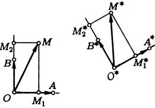

# Глава IV. Преобразования плоскости

## § 2. Линейные преобразования

---
**стр. 139**
---

**1. Ортогональные преобразования.** Так называются преобразования плоскости, которые не меняют расстояния между любыми двумя точками, то есть преобразование $f$ *ортогональное*, если для любых точек $A$ и $B$ выполнено $|AB|=|f(A)f(B)|$. Основными примерами ортогональных преобразований служат параллельный перенос, поворот и осевая симметрия.

Получим координатную запись ортогонального преобразования в декартовой прямоугольной системе координат $O$, $\mathbf{e}_1$, $\mathbf{e}_2$. Обозначим через $A$ и $B$ концы базисных векторов: $\mathbf{e}_1=\overrightarrow{OA}$, $\mathbf{e}_2=\overrightarrow{OB}$ (рис. 54). При ортогональном преобразовании равнобедренный прямоугольный треугольник $OAB$ перейдет в равный ему треугольник $O^*A^*B^*$. Рассмотрим произвольную точку $M(x,y)$. Она перейдет в точку $M^*$ с координатами $(x^*,y^*)$. Нам надо выразить $(x^*,y^*)$ через $(x,y)$.

По определению координат $\overrightarrow{OM}=x\overrightarrow{OA}+y\overrightarrow{OB}$. Отсюда следует, что $\overrightarrow{O^*M^*}=x\overrightarrow{O^*A^*}+y\overrightarrow{O^*B^*}$. Действительно, векторы $\overrightarrow{O^*A^*}$ и $\overrightarrow{O^*B^*}$ взаимно перпендикулярны и по длине равны $1$, а потому компоненты $\overrightarrow{O^*M^*}$ по этим векторам равны его скалярным проекциям на них. Эти проекции равны проекциям $\overrightarrow{OM}$ на $\mathbf{e}_1$ и $\mathbf{e}_2$, что видно из равенства соответствующих треугольников. Теперь мы можем написать

$$\overrightarrow{OM^*}=\overrightarrow{OO^*}+\overrightarrow{O^*M^*}=\overrightarrow{OO^*}+x\overrightarrow{O^*A^*}+y\overrightarrow{O^*B^*}. \tag{1}$$

Обозначим через $\varphi$ угол между $\overrightarrow{O^*A^*}$ и $\mathbf{e}_1$. Поскольку $|\overrightarrow{O^*A^*}|=1$, координаты этого вектора в базисе $\mathbf{e}_1$, $\mathbf{e}_2$ равны $(\cos\varphi,\sin\varphi)$. Тогда перпендикулярный вектор единичной длины $\overrightarrow{O^*B^*}$ имеет координаты $(\mp\sin\varphi,\pm\cos\varphi)$, причем верхние

---
**стр. 140**

---

знаки берутся в том случае, когда пара векторов $\overrightarrow{O^*A^*}$ и $\overrightarrow{O^*B^*}$ ориентирована так же, как $\overrightarrow{OA}$ и $\overrightarrow{OB}$. Координаты точки $O^*$ обозначим через $(c_1,c_2)$.

Теперь мы можем разложить все члены равенства (1) по базису $\mathbf{e}_1$, $\mathbf{e}_2$:

$$x^*=x\cos\varphi\mp y\sin\varphi+c_1, \quad y^*=x\sin\varphi\pm y\cos\varphi+c_2. \tag{2}$$

Итак, доказано

П р е д л о ж е н и е 1. *Произвольное ортогональное преобразование в декартовой прямоугольной системе координат записывается формулами (2), где $\varphi$ — угол, на который поворачивается первый базисный вектор, а $c_1$ и $c_2$ — координаты образа начала координат. При этом выбираются верхние знаки, если образы базисных векторов ориентированы так же, как и сами эти векторы, и нижние знаки в противоположном случае.*

П р и м е р 1. Параллельный перенос на вектор $\mathbf{c}$ сопоставляет точке $M$ с координатами $(x,y)$ в некоторой декартовой системе координат точку $M^*$ с координатами

$$x^*=x+c_1, \quad y^*=y+c_2,$$

где $c_1$ и $c_2$ — координаты $\mathbf{c}$.

П р и м е р 2. Напишем уравнения поворота плоскости на угол $\varphi$ вокруг некоторой точки, приняв эту точку за начало декартовой прямоугольной системы координат. В этом случае $O=O^*$ и, следовательно, $c_1=c_2=0$. Должны быть выбраны верхние знаки. Итак,

$$x^*=x\cos\varphi-y\sin\varphi, \quad y^*=x\sin\varphi+y\cos\varphi.$$

П р и м е р 3. Рассмотрим осевую симметрию относительно некоторой прямой. Примем ось симметрии за ось абсцисс декартовой прямоугольной системы координат. Тогда точка $M(x,y)$ переходит в точку $M^*$ с координатами

$$x^*=x, \quad y^*=-y.$$

Здесь $c_1=c_2=0$ и $\varphi=0$ при нижних знаках в формулах (2).

---
**стр. 141**

---

**2. Определение линейных преобразований.** Основным объектом для нас будет более широкий класс преобразований, включающий в себя ортогональные преобразования.

О п р е д е л е н и е. Преобразование $f$ плоскости $P$ называется *линейным*, если на $P$ существует такая декартова система координат, в которой $f$ может быть записано формулами

$$x^*=a_1x+b_1y+c_1, \quad y^*=a_2x+b_2y+c_2. \tag{3}$$

Взаимно однозначное линейное преобразование называется *аффинным* преобразованием.

Подчеркнем, что в определении линейного преобразования вовсе не требуется, чтобы коэффициенты в формулах (3) не обращались в нуль одновременно. Они могут быть любыми. Однако имеет место

П р е д л о ж е н и е 2. *Для того, чтобы преобразование, задаваемое формулами (3), было взаимно однозначным, необходимо и достаточно, чтобы*

$$\begin{vmatrix}a_1&b_1\\a_2&b_2\end{vmatrix}\neq0. \tag{4}$$

Таким образом, аффинное преобразование определяется формулами (3) при условии (4).

Д о к а з а т е л ь с т в о. Наше утверждение вытекает, по существу, из предложения 8 § 2 гл. II. Нам нужно узнать, при каком условии каждая точка плоскости имеет единственный прообраз. Формулы (3) связывают координаты $(x^*,y^*)$ точки $M^*$ и координаты $(x,y)$ ее прообраза. Их можно рассматривать как систему линейных уравнений для нахождения $x$ и $y$, и эта система имеет единственное решение при любых свободных членах $x^*-c_1$ и $y^*-c_2$ (а значит при любых $x^*$ и $y^*$) тогда и только тогда, когда выполнено условие (4).

Как видно из предложения 1, ортогональные преобразования являются линейными. Проверка условия (4) показывает, что они — аффинные. Рассмотрим другие примеры.

П р и м е р 4. Рассмотрим сжатие к прямой (пример 3 § 1) и примем эту прямую за ось абсцисс декартовой прямоугольной

---
**стр. 142**

---

системы координат. Легко видеть, что в такой системе координат сжатие с коэффициентом $\lambda$ записывается формулами

$$x^*=x, \quad y^*=\lambda y.$$

Сжатие к прямой — аффинное преобразование.

П р и м е р 5. Проектирование на прямую (пример 6 § 1) в такой декартовой прямоугольной системе координат, для которой эта прямая — ось абсцисс, записывается формулами

$$x^*=x, \quad y^*=0.$$

Это — линейное, но не аффинное преобразование.

П р и м е р 6. Для записи уравнений гомотетии не существенно, чтобы система координат была прямоугольной, но уравнения проще, если начало координат поместить в центр гомотетии. По определению гомотетии с коэффициентом $\lambda$ вектор $\overrightarrow{OM}$ переходит в вектор $\overrightarrow{OM^*}=\lambda\overrightarrow{OM}$. Если $O$ — начало координат, координаты точек $M$ и $M^*$ будут связаны равенствами

$$x^*=\lambda x, \quad y^*=\lambda y.$$

Гомотетия — аффинное преобразование.

П р и м е р 7. Преобразование, сопоставляющее каждой точке плоскости одну и ту же точку $C$, записывается формулами $x^*=c_1$, $y^*=c_2$, где $c_1$ и $c_2$ — координаты точки $C$. Оно линейное, но не аффинное.

Определение аффинного преобразования содержит упоминание о некоторой определенной системе координат, и заранее не известно, будет ли преобразование записываться формулами вида (3) в какой-либо другой системе координат. Устраним это сомнение.

П р е д л о ж е н и е 3. *В любой декартовой системе координат линейное преобразование задается формулами вида (3).*

Д о к а з а т е л ь с т в о. Пусть преобразование задано равенствами (3) в системе координат $O$, $\mathbf{e}_1$, $\mathbf{e}_2$. Перейдем к системе координат $O'$, $\mathbf{e}_1'$, $\mathbf{e}_2'$. Как мы знаем, старые координаты точ-

---
**стр. 143**

---

ки $M(x,y)$ выражаются через ее новые координаты $(x',y')$ по формулам (7) § 3 гл. I:

$$x=\alpha_1x'+\beta_1y'+\gamma_1, \quad y=\alpha_2x'+\beta_2y'+\gamma_2. \tag{5}$$

Для образа $M^*$ точки $M$ нам нужно будет, наоборот, выразить новые координаты $(x'^*,y'^*)$ через ее старые координаты $(x^*,y^*)$. Они выражаются такими же формулами, разумеется, с другими коэффициентами:

$$x'^*=\lambda_1x^*+\mu_1y^*+\nu_1, \quad y'^*=\lambda_2x^*+\mu_2y^*+\nu_2. \tag{6}$$

Нам требуется найти выражение новых координат $(x'^*,y'^*)$ точки $M^*$ через новые координаты $(x',y')$ точки $M$. С этой целью подставим в равенства (6) значения $x^*$ и $y^*$ из формул (3)

$$x'^*=\lambda_1(a_1x+b_1y+c_1)+\mu_1(a_2x+b_2y+c_2)+\nu_1,$$
$$y'^*=\lambda_2(a_1x+b_1y+c_1)+\mu_2(a_2x+b_2y+c_2)+\nu_2.$$

Для нас важно, что правые части этих равенств — многочлены степени не выше 1 относительно $x$ и $y$:

$$x'^*=A_1x+B_1y+C_1, \quad y'^*=A_2x+B_2y+C_2. \tag{7}$$

Подставив сюда выражения $x$ и $y$ по формулам (5), мы найдем искомую зависимость:

$$x'^*=A_1(\alpha_1x'+\beta_1y'+\gamma_1)+B_1(\alpha_2x'+\beta_2y'+\gamma_2)+C_1,$$
$$y'^*=A_2(\alpha_1x'+\beta_1y'+\gamma_1)+B_2(\alpha_2x'+\beta_2y'+\gamma_2)+C_2.$$

Мы видим, что правые части этих равенств — многочлены степени не выше 1 относительно $x'$ и $y'$. Это нам и требовалось доказать.

Заметим, что аффинные преобразования выделяются из линейных требованием взаимной однозначности, которое не зависит от системы координат. Поэтому без дополнительных проверок мы можем быть уверены, что формулы, задающие аффинное преобразование в новой системе координат, удовлетворяют условию (4).

**3. Произведение линейных преобразований.** Доказательство предложения 3 было основано на том, что результат

---
**стр. 144**

---

подстановки многочленов степени не выше 1 в многочлен степени не выше 1 оказывается таким же многочленом. Это же обстоятельство лежит в основе следующего предложения.

П р е д л о ж е н и е 4. *Произведение линейных преобразований является линейным преобразованием. Произведение аффинных преобразований — аффинное преобразование.*

Д о к а з а т е л ь с т в о. Пусть заданы линейные преобразования $f$ и $g$, и выбрана система координат. Тогда координаты точки $f(M)$ выражаются через координаты точки $M$ формулами

$$x^*=a_1x+b_1y+c_1, \quad y^*=a_2x+b_2y+c_2, \tag{8}$$

а координаты точки $g(f(M))$ через координаты точки $f(M)$ формулами

$$x^{**}=d_1x^*+e_1y^*+f_1, \quad y^{**}=d_2x^*+e_2y^*+f_2. \tag{9}$$

Подстановка равенств (8) в (9) выражает координаты $g(f(M))$ через координаты $M$. В результате подстановки мы получаем многочлены степени не выше 1, что и доказывает первую часть предложения.

Для доказательства второй части достаточно вспомнить, что по предложению 1 § 1 произведение двух взаимно однозначных преобразований взаимно однозначно.

П р е д л о ж е н и е 5. *Преобразование, обратное аффинному преобразованию, также является аффинным.*

Если преобразование $f$ записано уравнениями (3), то координатная запись его обратного преобразования получается решением уравнений (3) относительно $x$ и $y$. Для того, чтобы решить эти уравнения, умножим первое из них на $b_2$, второе — на $b_1$ и вычтем одно уравнение из другого. Мы получим $(a_1b_2-a_2b_1)x=b_2(x^*-c_1)-b_1(y^*-c_2)$. Из условия (4) следует, что $x$ — линейный многочлен от $x^*$ и $y^*$. Выражение для $y$ получается аналогично.

**4. Образ вектора при линейном преобразовании.** Рассмотрим вектор $\overrightarrow{M_1M_2}$. Если координаты точек $M_1$ и $M_2$ в системе координат $O$, $\mathbf{e}_1$, $\mathbf{e}_2$ обозначить соответственно $x_1$, $y_1$ и $x_2$, $y_2$, то компоненты вектора будут равны $x_2-x_1$ и $y_2-y_1$.

---
**стр. 145**

---

Пусть формулы (3) задают преобразование $f$ в выбранной системе координат. Тогда образы $M_2^*$ и $M_1^*$ точек $M_2$ и $M_1$ имеют абсциссы

$$x_2^*=a_1x_2+b_1y_2+c_1, \quad x_1^*=a_1x_1+b_1y_1+c_1.$$

Следовательно, первая компонента вектора $\overrightarrow{M_1^*M_2^*}$ равна

$$x_2^*-x_1^*=a_1(x_2-x_1)+b_1(y_2-y_1).$$

Аналогично находим вторую компоненту этого вектора

$$y_2^*-y_1^*=a_2(x_2-x_1)+b_2(y_2-y_1).$$

Обратим внимание на то, что компоненты $\overrightarrow{M_1^*M_2^*}$ выражаются только через компоненты $\overrightarrow{M_1M_2}$, а не через координаты точек $M_1$ и $M_2$ по отдельности. Два равных вектора имеют одинаковые компоненты и, следовательно, при линейном преобразовании перейдут в векторы, компоненты которых также одинаковы. Итак, мы получаем

П р е д л о ж е н и е 6. *При линейном преобразовании равные векторы переходят в равные векторы. Компоненты $\alpha_1^*,\alpha_2^*$ образа вектора выражаются через его компоненты $\alpha_1,\alpha_2$ формулами*

$$\alpha_1^*=a_1\alpha_1+b_1\alpha_2, \quad \alpha_2^*=a_2\alpha_1+b_2\alpha_2. \tag{10}$$

Если быть точным, говорить об образе вектора при преобразовании $f$ не правильно: преобразование отображает точки, а не векторы. Точнее было бы сказать, что $f$ порождает преобразование $\bar f$ множества векторов. Но ниже мы, тем не менее, будем придерживаться не совсем точной, но более удобной и общепринятой терминологии — говорить, что преобразование $f$ переводит вектор $\mathbf{a}$ в вектор $\mathbf{a}^*$ и обозначать последний через $f(\mathbf{a})$.

Из формул (10) вытекает, что для линейного преобразования $f$ при любых векторах $\mathbf{a}$ и $\mathbf{b}$ и любом числе $\lambda$

$$f(\mathbf{a}+\mathbf{b})=f(\mathbf{a})+f(\mathbf{b}), \quad f(\lambda\mathbf{a})=\lambda f(\mathbf{a}). \tag{11}$$

---
**стр. 146**

---

Докажем, например, первое из этих равенств. Пусть $\gamma_1^*$ и $\gamma_2^*$ — компоненты вектора $f(\mathbf{a}+\mathbf{b})$. Тогда

$$\gamma_1^*=a_1(\alpha_1+\beta_1)+b_1(\alpha_2+\beta_2), \quad \gamma_2^*=a_2(\alpha_1+\beta_1)+b_2(\alpha_2+\beta_2),$$

где $\alpha_1,\alpha_2$ и $\beta_1,\beta_2$ — компоненты векторов $\mathbf{a}$ и $\mathbf{b}$. Отсюда

$$\gamma_1^*=(a_1\alpha_1+b_1\alpha_2)+(a_1\beta_1+b_1\beta_2)=\alpha_1^*+\beta_1^*,$$
$$\gamma_2^*=(a_2\alpha_1+b_2\alpha_2)+(a_2\beta_1+b_2\beta_2)=\alpha_2^*+\beta_2^*.$$

Это — координатная запись доказываемого равенства. Второе из равенств (11) доказывается аналогично.

Из равенств (11) следует, что при линейном преобразовании $f$ линейно зависимые векторы переходят в линейно зависимые. Действительно, как легко видеть, $f(\mathbf{0})=\mathbf{0}$. Тогда любое соотношение вида $\lambda\mathbf{a}+\mu\mathbf{b}=\mathbf{0}$ влечет за собой $\lambda f(\mathbf{a})+\mu f(\mathbf{b})=\mathbf{0}$.

Если преобразование — аффинное, то линейно независимые векторы переходят в линейно независимые. В самом деле, в противном случае из равенства $\lambda f(\mathbf{a})+\mu f(\mathbf{b})=\mathbf{0}$, $\lambda^2+\mu^2\neq0$ при обратном преобразовании мы получили бы $\lambda\mathbf{a}+\mu\mathbf{b}=\mathbf{0}$.

Следующее предложение устанавливает геометрический смысл коэффициентов в формулах, задающих линейное преобразование.

П р е д л о ж е н и е 7. *Пусть преобразование $f$ записано в системе координат $O$, $\mathbf{e}_1$, $\mathbf{e}_2$ формулами (3). Тогда $c_1$ и $c_2$ — координаты точки $f(O)$, а $(a_1,a_2)$ и $(b_1,b_2)$ — компоненты векторов $f(\mathbf{e}_1)$ и $f(\mathbf{e}_2)$ в системе координат $O$, $\mathbf{e}_1$, $\mathbf{e}_2$.*

Для доказательства подставим в формулы (3) значения $x=0$ и $y=0$ координат $O$ и увидим, что координаты $f(O)$ равны $c_1$ и $c_2$.

Подставим в формулы (10) координаты вектора $\mathbf{e}_1$: $\alpha_1=1$, $\alpha_2=0$ и найдем $\alpha_1^*=a_1$, $\alpha_2^*=a_2$. Следовательно, $f(\mathbf{e}_1)$ имеет компоненты $a_1$ и $a_2$. Так же доказывается, что компоненты $f(\mathbf{e}_2)$ равны $b_1$ и $b_2$.

П р е д л о ж е н и е 8. *Каковы бы ни были три точки $L$, $M$, $N$, не лежащие на одной прямой, и три точки $L^*$, $M^*$ и $N^*$, существует единственное линейное преобразование $f$ такое, что $L^*=f(L)$, $M^*=f(M)$ и $N^*=f(N)$. Это*

---
**стр. 147**

---

*преобразование — аффинное тогда и только тогда, когда точки $L^*$, $M^*$ и $N^*$ также не лежат на одной прямой.*

Д о к а з а т е л ь с т в о. Векторы $\overrightarrow{LM}$ и $\overrightarrow{LN}$ не коллинеарны. Следовательно, $L$, $\overrightarrow{LM}$, $\overrightarrow{LN}$ — декартова система координат. Пусть $c_1$, $c_2$ — координаты $L^*$, а $a_1$, $a_2$ и $b_1$, $b_2$ — компоненты векторов $\overrightarrow{L^*M^*}$ и $\overrightarrow{L^*N^*}$ в этой системе координат. Формулы

$$x^*=a_1x+b_1y+c_1, \quad y^*=a_2x+b_2y+c_2$$

определяют линейное преобразование $f$, которое, как легко видеть, обладает требуемым свойством. При этом, согласно предложению 7, коэффициенты в формулах однозначно определены.

Условие (4), равносильное аффинности преобразования, необходимо и достаточно для того, чтобы векторы $\overrightarrow{L^*M^*}$ и $\overrightarrow{L^*N^*}$ были не коллинеарны, то есть $L^*$, $M^*$ и $N^*$ не лежали на одной прямой. Предложение доказано.

Заметим, что в том случае, когда преобразование $f$ — аффинное, точка $f(O)$ и векторы $f(\mathbf{e}_1)$ и $f(\mathbf{e}_2)$ могут быть использованы как система координат. Для этой системы координат имеет место

П р е д л о ж е н и е 9. *При аффинном преобразовании $f$ образ $M^*$ точки $M$ в системе координат $f(O)$, $f(\mathbf{e}_1)$, $f(\mathbf{e}_2)$ имеет те же координаты, что и точка $M$ в системе координат $O$, $\mathbf{e}_1$, $\mathbf{e}_2$.*

Д о к а з а т е л ь с т в о. Равенство $\overrightarrow{OM}=x\mathbf{e}_1+y\mathbf{e}_2$ означает, что $x$, $y$ — координаты $M$ в системе координат $O$, $\mathbf{e}_1$, $\mathbf{e}_2$. Подействовав преобразованием $f$ на обе части этого равенства, мы получаем $\overrightarrow{f(O)f(M)}=xf(\mathbf{e}_1)+yf(\mathbf{e}_2)$, которое означает, что $x$ и $y$ — координаты $M^*$ в системе координат $f(O)$, $f(\mathbf{e}_1)$, $f(\mathbf{e}_2)$.

### Упражнения

1. Являются ли аффинными преобразования, задаваемые формулами

а) $x^*=x+y-1$, $y^*=x-y+1$; б) $x^*=x-y-1$, $y^*=-x+y+1$?

---
**стр. 148**

---

2. Найдите образ прямой $x-y=2$ при преобразовании (а) из задачи 1.

3. Докажите, не прибегая к формулам (2), что ортогональное преобразование взаимно однозначно.

4. Точка $A$ называется *неподвижной точкой* преобразования $f$, если $f(A)=A$. Найдите неподвижные точки преобразования (а) из задачи 1.

5. Докажите, что линейное преобразование, не являющееся тождественным, либо имеет одну единственную неподвижную точку, либо имеет прямую, состоящую из неподвижных точек, либо не имеет их совсем.

6. Как изменятся формулы, задающие линейное преобразование, если начало координат перенести в неподвижную точку, не меняя базисных векторов?

7. Линейное преобразование в системе $O$, $\mathbf{e}_1$, $\mathbf{e}_2$ задано формулами (3). Какими формулами оно задается в системе координат а) $O$, $\mathbf{e}_2$, $\mathbf{e}_1$, б) $O$, $\mathbf{e}_1$, $2\mathbf{e}_2$?

8. Докажите, что линейное преобразование, задаваемое в декартовой прямоугольной системе координат формулами

$$x^*=x\cos\varphi+y\sin\varphi, \quad y^*=x\sin\varphi-y\cos\varphi$$

— осевая симметрия. Найдите уравнение оси симметрии.

9. Может ли случиться, что произведение двух линейных преобразований — аффинное, если одно из них — не аффинное?

10. Пусть аффинное преобразование в декартовой прямоугольной системе координат задано формулами

$$x^*=x+by+c_1, \quad y^*=ax+c_2.$$

Найдите векторы, ортогональные их образам.

11. Докажите, что преобразование из задачи 8 есть произведение осевой симметрии $f$ относительно оси абсцисс и поворота $g$ на угол $\varphi$ вокруг начала координат. Какое преобразование получится, если $f$ и $g$ перемножить в другом порядке?

12. Пусть аффинное преобразование имеет одну единственную неподвижную точку. Докажите, что в этом случае каждая инвариантная прямая (если такие прямые есть) проходит через эту точку.

Решения упражнений 1–12: [[../reshebnik_beklemishev/rbek_g04_s02|Решебник, Гл. IV §2]] (в решебнике те же задачи пронумерованы 1–10, 12–13 — под номером 11 там вставлена дополнительная задача про треугольник, которой нет среди упражнений этого параграфа учебника; решебник также ссылается на этот файл под неверным слагом/названием — см. отчёт агента).
