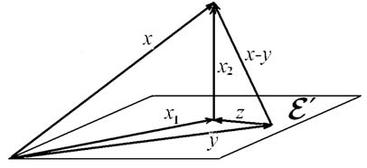

# Глава VII. Евклидовы и унитарные пространства

## § 1. Евклидовы пространства

**1. Скалярное произведение.** Линейное пространство, введенное в предыдущей главе, существенно отличается от множества векторов обычного геометрического пространства тем, что в линейном пространстве не определены понятия длины вектора и угла между векторами. В настоящей главе мы изучим такие пространства, в которых эти понятия определены.

В гл. I, используя длину вектора и угол, мы определили скалярное произведение. Здесь удобнее поступить наоборот. Мы аксиоматически определим операцию скалярного умножения, а длину и угол определим с ее помощью. Определение скалярного умножения для вещественных и для комплексных пространств формулируется различно. Этот параграф посвящен вещественным пространствам.

О п р е д е л е н и е. Вещественное линейное пространство $\mathcal{E}$ называется *евклидовым*, если в нем определена операция скалярного умножения: любым двум векторам $x$ и $y$ из $\mathcal{E}$ сопоставлено вещественное число (обозначаемое $(x,y)$), и это соответствие удовлетворяет следующим требованиям, каковы бы ни были векторы $x$, $y$ и $z$ и число $\alpha$:

1. $(x,y) = (y,x)$.
2. $(x+y,z) = (x,z)+(y,z)$.
3. $(\alpha x,y) = \alpha(x,y)$.
4. $(x,x) > 0$ для всех $x\neq o$.

Будем рассматривать $n$-мерное евклидово пространство $\mathcal{E}$. Любое подпространство $\mathcal{E}'$ в $\mathcal{E}$ также евклидово пространство, так как для его векторов определено то же самое скалярное умножение.

Очевидны простейшие следствия из перечисленных аксиом. Так как $(x,\alpha y) = (\alpha y,x) = \alpha(y,x)$, имеем

$$(x,\alpha y) = \alpha(x,y). \tag{1}$$

Аналогично доказывается

$$(x,y+z) = (x,y)+(x,z). \tag{2}$$

Можно дать второе определение евклидова пространства, эквивалентное первому.

О п р е д е л е н и е. Вещественное линейное пространство называется евклидовым, если в нем задана положительно определенная квадратичная форма.

Из первого определения следует второе. Действительно, если в вещественном линейном пространстве определена операция скалярного умножения, то это — функция от двух векторов. Аксиомы 2 и 3 и формулы (1) и (2) равносильны тому, что функция билинейная. Аксиома 1 означает, что билинейная функция симметрична, а аксиома 4 — что соответствующая квадратичная форма положительно определена. Поскольку симметричная билинейная функция однозначно определяется соответствующей квадратичной формой, обратное утверждение столь же очевидно.

Конечно, в вещественном линейном пространстве существует бесконечно много положительно определенных квадратичных форм. Во втором определении слово *задана* означает, что одна из них выделена и играет особую роль. Будем называть ее *основной квадратичной формой*.

П р и м е р 1. Для векторов геометрического пространства скалярное произведение двух векторов определено как произведение их длин на косинус угла между ними. Так определенная операция скалярного умножения обладает нужными свойствами, но зависит от выбора единицы измерения длин.

---
**стр. 310**

---

Поэтому, если такая единица выбрана, векторы геометрического пространства образуют трехмерное евклидово пространство в определенном здесь смысле.

П р и м е р 2. В $n$-мерном арифметическом пространстве мы можем ввести скалярное умножение, сопоставив столбцам $\mathbf{x}$ и $\mathbf{y}$ число

$$\mathbf{x}^T\mathbf{y} = \xi^1\eta^1+\cdots+\xi^n\eta^n, \tag{3}$$

где через $\xi^i$ и $\eta^i$ обозначены элементы столбцов. Используя свойства умножения матриц, читатель без труда может проверить, что все условия, входящие в определение, выполнены. Иначе можно было бы сказать, что в качестве основной квадратичной формы выбрана та, которая в стандартном базисе арифметического пространства (состоящем из столбцов единичной матрицы) имеет канонический вид. Такое скалярное произведение мы будем называть *стандартным скалярным произведением*.

П р и м е р 3. Скалярное произведение в вещественном линейном пространстве можно задать, выбрав какой-либо базис и объявив его ортонормированным. Тогда скалярное произведение векторов выражается через их компоненты в выбранном базисе формулой (3).

П р и м е р 4. В пространстве функций, непрерывных на отрезке $[0,1]$, можно ввести скалярное произведение по формуле

$$(f,g) = \int_0^1 f(t)g(t)\,dt.$$

Аксиомы 1–4 вытекают из известных свойств определенных интегралов.

**2. Длина и угол.** В соответствии с формулами § 4 гл. I, введем

О п р е д е л е н и е. Назовем *длиной* вектора $x$ и обозначим $|x|$ число $\sqrt{(x,x)}$. *Углом* между векторами $x$ и $y$ назовем каждое число $\varphi$, удовлетворяющее условию

$$\cos\varphi = \frac{(x,y)}{|x|\,|y|}. \tag{4}$$

---
**стр. 311**

---

В силу аксиомы 4 длина вектора — вещественное неотрицательное число, причем она равна нулю тогда и только тогда, когда вектор нулевой. С определением угла дело обстоит несколько сложнее. Нам предстоит доказать, что выражение в правой части равенства (4) по абсолютной величине не превосходит единицы. Это следует из неравенства

$$(x,y)^2 \leqslant (x,x)(y,y), \tag{5}$$

связываемого с именами Шварца, Коши и Буняковского. Ниже мы получим это неравенство как следствие из теоремы 1.

Еще одно важное неравенство, называемое *неравенством треугольника*

$$|x+y| \leqslant |x|+|y|, \tag{6}$$

следует из неравенства Коши–Буняковского:

$$(x+y,x+y) = |x|^2+2(x,y)+|y|^2 \leqslant |x|^2+2|x||y|+|y|^2 = (|x|+|y|)^2.$$

Знак равенства имеет место, если $(x,y) = |x|\,|y|$, то есть если угол между $x$ и $y$ равен нулю, и только в этом случае. Неравенство (6) для векторов — направленных отрезков — означает, что длина стороны треугольника меньше суммы длин остальных его сторон.

Векторы $x$ и $y$ называются *перпендикулярными* или *ортогональными*, если $(x,y)=0$. Это условие выполнено, если хоть один из векторов — нулевой. Если оба вектора — ненулевые, то по формуле (4) угол между ними равен $\pi/2$.

П р е д л о ж е н и е 1. *Только нулевой вектор ортогонален каждому вектору пространства.*

Действительно, если $(x,y)=0$ для всех $y$, то, положив $y=x$, получим $(x,x)=0$, что возможно только при $x=o$.

**3. Выражение скалярного произведения через координаты сомножителей.** Если в евклидовом пространстве выбран базис $\mathbf{e}$, то скалярное произведение векторов $x$ и $y$, как и значение любой билинейной функции, выражается по формуле (11) § 6 гл. VI через координатные столбцы $\mathbf{x}$ и $\mathbf{y}$ этих векторов:

$$(x,y) = \mathbf{x}^T\Gamma\mathbf{y}. \tag{7}$$

---
**стр. 312**

---

Согласно определению матрицы билинейной функции элементы $g_{ij}$ матрицы $\Gamma$ равны скалярным произведениям $(e_i,e_j)$, то есть

$$\Gamma = \begin{Vmatrix} (e_1,e_1) & \ldots & (e_1,e_n) \\ \vdots & & \vdots \\ (e_n,e_1) & \ldots & (e_n,e_n) \end{Vmatrix}.$$

Эта матрица называется *матрицей Грама* базиса $\mathbf{e}$.

Матрица Грама симметрична. По критерию Сильвестра все ее главные миноры положительны, в частности, справедливо

П р е д л о ж е н и е 2. *Детерминант матрицы Грама любого базиса положителен.*

Это предложение может быть обобщено следующим образом:

Т е о р е м а 1. *Пусть $x_1,\ldots,x_k$ — произвольная, не обязательно линейно независимая, система векторов. Тогда детерминант матрицы, составленной из их попарных скалярных произведений,*

$$\det\begin{Vmatrix} (x_1,x_1) & \ldots & (x_1,x_k) \\ \vdots & & \vdots \\ (x_k,x_1) & \ldots & (x_k,x_k) \end{Vmatrix}$$

*положителен, если векторы линейно независимы, и равен нулю, если они линейно зависимы.*

Первое утверждение следует из предложения 2, так как линейно независимые векторы составляют базис в своей линейной оболочке.

Докажем второе утверждение. Если векторы линейно зависимы, то выполнено равенство $\alpha_1x_1+\cdots+\alpha_kx_k=o$, в котором среди коэффициентов есть отличные от нуля. Умножая это равенство скалярно на каждый из векторов, мы придем к системе линейных уравнений

$$\begin{aligned}
\alpha_1(x_1,x_1)+\cdots+\alpha_k(x_1,x_k) &= 0, \\
\ldots\ldots\ldots\ldots\ldots\ldots\ldots& \\
\alpha_1(x_k,x_1)+\cdots+\alpha_k(x_k,x_k) &= 0,
\end{aligned}$$

которой удовлетворяют коэффициенты $\alpha_1,\ldots,\alpha_k$. Так как система имеет нетривиальное решение, детерминант ее матрицы равен нулю.

---
**стр. 313**

---

С л е д с т в и е. *Для любых двух векторов в евклидовом пространстве имеет место неравенство Коши–Буняковского (5), причем оно выполнено как равенство тогда и только тогда, когда векторы линейно зависимы.*

Пусть базис $\mathbf{e}'$ связан с базисом $\mathbf{e}$ матрицей перехода $S$. Тогда формула (12) § 6 гл. VI переписывается в виде

$$\Gamma' = S^T\Gamma S, \tag{8}$$

показывающем связь матриц Грама двух разных базисов.

**4. Ортогональные базисы.** Базис, в котором основная квадратичная форма имеет канонический вид, называется *ортонормированным базисом*. Так как она положительно определена, матрица Грама ортонормированного базиса — единичная: $(e_i,e_j)=0$ при $i\neq j$ и $(e_i,e_i)=1$ $(i,j=1,\ldots,n)$. Это значит, что векторы ортонормированного базиса попарно ортогональны, а по длине равны единице.

Для ортонормированного базиса формула (7) имеет вид

$$(x,y) = \mathbf{x}^T\mathbf{y} = \xi^1\eta^1+\cdots+\xi^n\eta^n. \tag{9}$$

В $n$-мерном арифметическом пространстве $\mathbb{R}^n$ стандартный базис является ортонормированным относительно стандартного скалярного произведения. Число $\sqrt{\mathbf{x}^T\mathbf{x}}=\sqrt{(x,x)}$ называется *евклидовой нормой* столбца $\mathbf{x}$.

П р е д л о ж е н и е 3. *$n$ попарно ортогональных ненулевых векторов $h_1,\ldots,h_n$ в $n$-мерном евклидовом пространстве составляют базис. Разложение вектора по этому базису задается формулой*

$$x = \sum_{i=1}^{n} \frac{(x,h_i)}{|h_i|^2}\,h_i. \tag{10}$$

Действительно, матрица из произведений $(h_i,h_j)$ диагональная с ненулевыми элементами на диагонали. Из теоремы 1 следует, что $h_1,\ldots,h_n$ составляют базис.

Пусть $x=\alpha_1h_1+\cdots+\alpha_nh_n$. Умножая это равенство скалярно на любой из $h_i$, находим, что $\alpha_i=(x,h_i)/|h_i|^2$, что равносильно (10).

---
**стр. 314**

---

Базис из ортогональных векторов называется *ортогональным базисом*.

Вычислим $(x,x)$ с помощью формулы (10). Поскольку $(h_i,h_j)=0$ при $i\neq j$, получаем *равенство Парсеваля*:

$$|x|^2 = \sum_{i=1}^{n} \frac{(x,h_i)^2}{|h_i|^2}. \tag{11}$$

**5. Ортогональные матрицы.** Пусть базисы $\mathbf{e}$ и $\mathbf{e}'=\mathbf{e}S$ ортонормированные. Тогда в формуле (8) $\Gamma=\Gamma'=E$, и формула принимает вид

$$S^TS = E. \tag{12}$$

Наоборот, если выполнено условие (12), и исходный базис ортонормированный, то мы получаем $\Gamma'=E$, и новый базис также ортонормированный.

О п р е д е л е н и е. Матрица, удовлетворяющая условию (12), называется *ортогональной матрицей*.

Как мы видели, ортогональные матрицы и только они могут служить матрицами перехода от одного ортонормированного базиса к другому. Равенство (12) равносильно равенству

$$S^T = S^{-1}. \tag{13}$$

Из свойств обратной матрицы теперь следует, что

$$SS^T = E. \tag{14}$$

Это означает, что матрица $S^T$ также является ортогональной.

Обозначив элементы матрицы $S$ через $\sigma^i_j$, мы можем написать равенства, равносильные (12) и (14):

$$\sum_{k=1}^n \sigma^i_k\sigma^j_k = \begin{cases}0, & i\neq j,\\1,& i=j.\end{cases}\qquad \sum_{k=1}^n \sigma^k_i\sigma^k_j = \begin{cases}0, & i\neq j,\\1,& i=j.\end{cases}\tag{15}$$

Впрочем, первое из равенств следует непосредственно из (9), так как столбцы матрицы перехода — координатные столбцы новых базисных векторов в старом базисе.

---
**стр. 315**

---

Произведение $SU$ двух ортогональных матриц $S$ и $U$ — ортогональная матрица. Действительно, $(SU)^T=U^TS^T=U^{-1}S^{-1}=(SU)^{-1}$.

Вычисляя детерминант обеих частей равенства (12), мы получим $(\det S)^2=1$. Значит, для ортогональной матрицы $\det S = 1$ или $-1$.

Рекомендуем читателю проверить, что любая ортогональная матрица порядка 2 имеет один из двух видов

$$\begin{Vmatrix}\cos\alpha & -\sin\alpha\\ \sin\alpha & \cos\alpha\end{Vmatrix}\quad\text{или}\quad\begin{Vmatrix}\cos\alpha & \sin\alpha\\ \sin\alpha & -\cos\alpha\end{Vmatrix}. \tag{16}$$

**6. Ортогональное дополнение подпространства.** Пусть $\mathcal{E}'$ — $k$-мерное подпространство в $n$-мерном евклидовом пространстве $\mathcal{E}$.

О п р е д е л е н и е. *Ортогональным дополнением* подпространства $\mathcal{E}'$ называется множество всех векторов, ортогональных каждому вектору из $\mathcal{E}'$. Это множество обозначается $\mathcal{E}'^\perp$.

П р е д л о ж е н и е 4. *Ортогональное дополнение $k$-мерного подпространства в $n$-мерном пространстве есть $(n-k)$-мерное подпространство.*

Д о к а з а т е л ь с т в о. Пусть $a_1,\ldots,a_k$ — базис в $\mathcal{E}'$. Вектор $x$ лежит в $\mathcal{E}'^\perp$ тогда и только тогда, когда

$$(x,a_1)=0,\ \ldots,\ (x,a_k)=0. \tag{17}$$

Действительно, если $x\in\mathcal{E}'^\perp$, то равенства (17), разумеется, выполнены. Обратно, при выполнении этих равенств $x$ ортогонален любому $a$ из $\mathcal{E}'$, поскольку

$$(x,a) = \left(x,\sum_{i=1}^{k}\lambda^ia_i\right) = \sum_{i=1}^{k}\lambda^i(x,a_i) = 0.$$

Выберем в $\mathcal{E}$ ортонормированный базис и обозначим через $\alpha^i_1,\ldots,\alpha^i_n$ компоненты вектора $a_i$ $(i=1,\ldots,k)$ в этом базисе, а через $\xi^1,\ldots,\xi^n$ — компоненты вектора $x$. Условия (17) запишутся тогда в виде однородной системы из $k$ линейных

---
**стр. 316**

---

уравнений с $n$ неизвестными:

$$\begin{aligned}
\alpha^1_1\xi^1+\cdots+\alpha^n_1\xi^n &= 0,\\
\ldots\ldots\ldots\ldots\ldots\ldots\ldots&\\
\alpha^1_k\xi^1+\cdots+\alpha^n_k\xi^n &= 0.
\end{aligned}$$

Ранг матрицы системы равен $k$, поскольку ее строки — строки из компонент векторов $a_1,\ldots,a_k$ — линейно независимы. Таким образом, множество $\mathcal{E}'^\perp$ определяется однородной системой линейных уравнений ранга $k$ и потому является $(n-k)$-мерным подпространством. Предложение доказано.

Рассмотрим $(\mathcal{E}'^\perp)^\perp$ — ортогональное дополнение ортогонального дополнения подпространства $\mathcal{E}'$. Каждый вектор из $\mathcal{E}'$ ортогонален каждому вектору из $\mathcal{E}'^\perp$. Поэтому $\mathcal{E}'\subseteq(\mathcal{E}'^\perp)^\perp$. Но $\dim(\mathcal{E}'^\perp)^\perp = n-(n-k) = k$. Итак, $(\mathcal{E}'^\perp)^\perp = \mathcal{E}'$.

Очевидно, что $\mathcal{E}'$ и $\mathcal{E}'^\perp$ не имеют общих ненулевых векторов, а сумма их размерностей равна $n$. Отсюда следует

П р е д л о ж е н и е 5. *Евклидово пространство — прямая сумма любого своего подпространства и его ортогонального дополнения.*

Два подпространства $\mathcal{E}'$ и $\mathcal{E}''$ называются *ортогональными*, если $\mathcal{E}'\subseteq\mathcal{E}''^\perp$. Тогда и $\mathcal{E}''\subseteq\mathcal{E}'^\perp$, так как $(x,y)=0$, если $x\in\mathcal{E}'$ и $y\in\mathcal{E}''$.

**7. Ортогональные проекции.** Так как $\mathcal{E}=\mathcal{E}'\oplus\mathcal{E}'^\perp$, каждый вектор $x\in\mathcal{E}$ однозначно раскладывается в сумму векторов $x_1\in\mathcal{E}'$ и $x_2\in\mathcal{E}'^\perp$. Вектор $x_1$ называется *ортогональной проекцией* $x$ на $\mathcal{E}'$. Легко видеть, что $x_2$ — ортогональная проекция $x$ на $\mathcal{E}'^\perp$.

Найдем ортогональную проекцию $x$ на $\mathcal{E}'$ в предположении, что в $\mathcal{E}'$ задан некоторый ортогональный базис $h_1,\ldots,h_k$. Дополним этот базис до ортогонального базиса в пространстве $\mathcal{E}$, присоединив к нему произвольный ортогональный базис $h_{k+1},\ldots,h_n$ из $\mathcal{E}'^\perp$. Так как сумма $\mathcal{E}'$ и $\mathcal{E}'^\perp$ прямая, искомое разложение вектора $x$ единственно, и мы, группируя слагаемые в формуле (10), получаем

$$x_1 = \sum_{i=1}^{k}\frac{(x,h_i)}{|h_i|^2}\,h_i. \tag{18}$$

---
**стр. 317**

---

Если $k=1$, проекция имеет вид $x_1=\left((x,h)/|h|^2\right)h$, и мы видим, что правая часть формулы (18) — сумма проекций на ортогональные одномерные подпространства, натянутые на $h_1,\ldots,h_k$. Так же истолковывается формула (10), а значит, равенство Парсеваля (11) является обобщением теоремы Пифагора.

Длина ортогональной проекции вектора $x$ не больше его длины. Действительно, из $(x_1,x_2)=0$ следует

$$|x|^2 = |x_1+x_2|^2 = |x_1|^2+|x_2|^2 \geqslant |x_1|^2.$$

Длина $|x_2|$ ортогональной проекции $x$ на $\mathcal{E}'^\perp$ обладает следующим свойством минимальности, обобщающим теорему о длине перпендикуляра и наклонной из элементарной геометрии.

П р е д л о ж е н и е 6. *Пусть $x_1$ — ортогональная проекция $x$ на $\mathcal{E}'$. Тогда для любого вектора $y\in\mathcal{E}'$, отличного от $x_1$, выполнено*

$$|x_2| = |x-x_1| < |x-y|.$$

Д о к а з а т е л ь с т в о. Обозначим $x_1-y$ через $z$ (рис. 55). Тогда

$$|x-y|^2 = |x_1+x_2-y|^2 = |z+x_2|^2 = (z+x_2,z+x_2) = |z|^2+2(x_2,z)+|x_2|^2.$$

Но $(z,x_2)=0$, так как $z\in\mathcal{E}'$, и следовательно $|x-y|^2=|x_2|^2+|z|^2$. Отсюда непосредственно вытекает доказываемое утверждение.

---
**стр. 318**

---

**8. Метод ортогонализации.** Формула (18) служит основой метода, позволяющего произвольный базис евклидова пространства преобразовать в ортогональный, а затем в ортонормированный. Этот метод называется *методом ортогонализации Грама–Шмидта*.

Пусть в $\mathcal{E}$ задан некоторый базис $f_1,\ldots,f_n$. Положим $h_1=f_1$. Затем из вектора $f_2$ вычтем его ортогональную проекцию на линейную оболочку $h_1$ и положим $h_2$ равным полученной разности:

$$h_2 = f_2 - \frac{(f_2,h_1)}{|h_1|^2}\,h_1.$$

Отметим, что $h_2$ раскладывается по $f_1=h_1$ и $f_2$, причем $h_2\neq o$, так как в противном случае $f_1$ и $f_2$ были бы пропорциональны.

Будем продолжать таким же образом. Допустим, что построены попарно ортогональные ненулевые векторы $h_1,\ldots,h_k$, причем для любого $i\leqslant k$ вектор $h_i$ раскладывается по $f_1,\ldots,f_i$. Положим

$$h_{k+1} = f_{k+1} - \sum_{i=1}^{k}\frac{(f_{k+1},h_i)}{|h_i|^2}\,h_i. \tag{19}$$

Вектор $h_{k+1}$ — проекция $f_{k+1}$ на ортогональное дополнение линейной оболочки $h_1,\ldots,h_k$ и потому ортогонален всем $h_i$ при $i<k+1$. Таким образом, векторы $h_1,\ldots,h_{k+1}$ попарно ортогональны.

Кроме того, $h_{k+1}$ раскладывается по $f_1,\ldots,f_{k+1}$, так как для любого $i\leqslant k$ вектор $h_i$ раскладывается по $f_1,\ldots,f_i$. Отсюда следует, что $h_{k+1}\neq o$, поскольку иначе векторы $f_1,\ldots,f_{k+1}$ оказались бы линейно зависимы.

После того как будет преобразован последний вектор $f_n$, мы получим ортогональную систему из $n$ ненулевых векторов.

Итак, нами построен ортогональный базис $h$. От него можно перейти к ортонормированному базису $e$ из векторов $e_i=h_i/|h_i|$ $(i=1,\ldots,n)$. Это называется *нормировкой* базиса $h$.

Посмотрим на матрицу перехода $S$ от базиса $h$ к базису $f$. Из равенства $f_1=h_1$ и формулы (19) видно, что $f_j$ при любом

---
**стр. 319**

---

$j$ раскладывается по $h_1,\ldots,h_j$, причем его координата по $h_j$ равна $1$. Поэтому элементы матрицы перехода $\sigma^i_j$ равны нулю, если они ниже главной диагонали (при $i>j$), и единице при $i=j$. Таким образом, эта матрица — верхняя треугольная (п. 3 § 1 гл. V) с единицами на главной диагонали.

Пусть базис $e$ получен нормировкой базиса $h$. Тогда $h=eD$, где $D$ — диагональная матрица с положительными элементами на диагонали. Если $f=hS$, то $f=eDS$, причем, как легко видеть, матрица $R=DS$ — треугольная, как и $S$, и ее диагональные элементы положительны, хотя возможно и не равны единице. Теперь мы можем сформулировать

П р е д л о ж е н и е 7. *Если ортогональный базис $h$ получен ортогонализацией базиса $f$, то матрица перехода $S$ от $h$ к $f$ — верхняя треугольная с единицами на диагонали. Если базис $e$ получен нормировкой базиса $h$, то матрица перехода $R$ от $e$ к $f$ — верхняя треугольная с положительными диагональными элементами.*

З а м е ч а н и е. По существу метод ортогонализации — метод приведения положительно определенной квадратичной формы к диагональному виду. Метод, примененный при доказательстве теоремы 1 § 6 гл. VI, в случае положительно определенной формы отличается только порядком выполнения элементарных операций.

**9. QR-разложение.** Так называется следующее разложение матрицы на множители, часто используемое в приложениях.

П р е д л о ж е н и е 8. *Если матрица $A$ невырождена, то она может быть представлена в виде произведения $A=QR$, где $Q$ — ортогональная, а $R$ — верхняя треугольная матрица, причем диагональные элементы $R$ положительны.*

Д о к а з а т е л ь с т в о. Столбцы $A$ — координатные столбцы векторов $a_1,\ldots,a_n$ арифметического пространства в стандартном базисе $e$. Эти векторы составляют базис $a$, поскольку $A$ невырождена. $A$ — матрица перехода от $e$ к $a$, то есть $a=eA$.

Если $g$ — базис, полученный из $a$ ортогонализацией и нормированием, то $a=gR$, где $R$, как мы видели выше, —

---
**стр. 320**

---

верхняя треугольная матрица с положительными диагональными элементами.

Матрица перехода $Q$ от стандартного базиса $e$ к ортонормированному базису $g$ — ортогональная: $g=eQ$. Поэтому $a=eQR$. Но, с другой стороны, $a=eA$. Отсюда $A=QR$, как это и требовалось.

**10. Объем параллелепипеда.** Рассмотрим $k$ линейно независимых векторов $f_1,\ldots,f_k$ в $n$-мерном евклидовом пространстве. Под $k$-мерным параллелепипедом $\{f_1,\ldots,f_k\}$, построенным на них, мы будем понимать множество всех их линейных комбинаций с коэффициентами $\alpha^i$, $0\leqslant\alpha^i\leqslant1$, $(i=1,\ldots,k)$. Векторы $f_1,\ldots,f_k$ назовем *ребрами* параллелепипеда. Если ребра упорядочены, параллелепипед называется *ориентированным*.

Параллелепипед $\{f_1,\ldots,f_{k-1}\}$ естественно назвать *основанием* параллелепипеда $\{f_1,\ldots,f_k\}$, а *высотой*, соответствующей этому основанию, назовем длину $|h_k|$ ортогональной проекции $h_k$ вектора $f_k$ на ортогональное дополнение линейной оболочки $f_1,\ldots,f_{k-1}$.

Объем одномерного параллелепипеда $\{f\}$ мы определим как длину его единственного ребра: $V\{f\}=|f|$, а объем $k$-мерного параллелепипеда $V\{f_1,\ldots,f_k\}$ определим по индукции как произведение объема основания на высоту. При таком определении объем параллелепипеда может оказаться зависящим от порядка, в котором записаны ребра, но из полученной ниже формулы (21) для объема мы увидим, что в действительности такой зависимости нет.

Если ребро $f_k$ ортогонально остальным ребрам, то $h_k=f_k$ и

$$V\{f_1,\ldots,f_k\} = V\{f_1,\ldots,f_{k-1}\}\,|f_k|. \tag{20}$$

Отсюда легко заметить, что объем прямоугольного параллелепипеда (у которого ребра попарно ортогональны) равняется произведению длин ребер.

Рассмотрим $n$-мерный параллелепипед $\{f_1,\ldots,f_n\}$. Применяя к $f_1,\ldots,f_n$ процесс ортогонализации (без нормировки), мы заменяем очередной вектор его проекцией на ортогональное дополнение линейной оболочки предыдущих векторов и в

---
**стр. 321**

---

результате строим $n$-мерный прямоугольный параллелепипед $\{h_1,\ldots,h_n\}$, имеющий тот же объем.

Матрица Грама $\Gamma_h$ системы векторов $h_1,\ldots,h_n$ — диагональная с элементами $|h_1|^2,\ldots,|h_n|^2$ на диагонали. Поэтому

$$V\{f_1,\ldots,f_n\} = V\{h_1,\ldots,h_n\} = |h_1|\ldots|h_n| = \sqrt{\det\Gamma_h}.$$

Пусть $S$ — матрица перехода от $h_1,\ldots,h_n$ к $f_1,\ldots,f_n$. Согласно предложению 7, $\det S=1$, и потому $\det\Gamma_f=\det(S^T\Gamma_hS)=\det\Gamma_h$. Итак,

$$V\{f_1,\ldots,f_n\} = \sqrt{\det\Gamma_f}. \tag{21}$$

Переставив векторы базиса $f$, мы получим базис $f'=fP$, где $P$ — матрица, полученная из единичной при помощи перестановки столбцов. $\det P=\pm1$, и из формулы (8) следует, что $\det\Gamma_{f'}=\det\Gamma_f$. Это доказывает, что объем параллелепипеда не зависит от порядка, в котором записаны ребра.

Пусть $e$ — произвольный базис, а $F$ — матрица из координатных столбцов векторов $f_1,\ldots,f_n$ в этом базисе. Эта матрица — матрица перехода от $e$ к $f$. Поэтому $\Gamma_f=F^T\Gamma_eF$. Отсюда в силу (21)

$$V\{f_1,\ldots,f_n\} = |\det F|\sqrt{\det\Gamma_e} = |\det F|\,V\{e_1,\ldots,e_n\}.$$

В частности, для ортонормированного базиса $e$

$$V\{f_1,\ldots,f_n\} = |\det F|. \tag{22}$$

Знаменитое *неравенство Адамара*

$$(\det A)^2 \leqslant \prod_{k=1}^{n}\sum_{i=1}^{n}a_{ik}^2$$

выражает тот факт, что объем параллелепипеда $\{a_1,\ldots,a_n\}$ не превышает объема прямоугольного параллелепипеда, ребра которого по длине равны его ребрам.

Если евклидово пространство ориентировано (п. 6 § 1 гл. VI), мы определим объем $n$-мерного ориентированного

---
**стр. 322**

---

параллелепипеда как его объем со знаком плюс, если его ребра составляют положительно ориентированный базис, и со знаком минус в противном случае. Тогда для положительно ориентированного ортонормированного базиса мы имеем $V_\pm\{f_1,\ldots,f_n\}=\det F$, а в общем случае

$$V_\pm\{f_1,\ldots,f_n\} = \det F\cdot V_\pm\{e_1,\ldots,e_n\}. \tag{23}$$

Формулы этого пункта были получены нами для $n=2,3$ в § 5 гл. I.

### Упражнения

1. Проверьте, что в пространстве многочленов степени $\leqslant2$ скалярное произведение можно определить формулой
$$(p,q)=\int_{-1}^{1}p(t)q(t)\,dt.$$
а) Составьте матрицу Грама базиса $1$, $t$, $t^2$. б) С помощью матрицы перехода найдите матрицу Грама базиса $1$, $(t-1)$, $(t-1)^2$. в) Найдите угол между многочленами $t^2+1$ и $t+1$.

2. Подпространство евклидова пространства задано в ортонормированном базисе уравнением $\xi^1+\xi^2+\xi^3+\xi^4=0$. Найдите ортонормированный базис в этом подпространстве.

3. Пусть $\dim\mathcal{E}=4$ и $\mathcal{E}'\subseteq\mathcal{E}$ задано в ортонормированном базисе системой
$$\xi_1+\xi_2+\xi_3=0,\quad \xi_2+\xi_3+\xi_4=0.$$
Найдите: а) базис в $\mathcal{E}'^\perp$, б) ортогональную проекцию на $\mathcal{E}'^\perp$ вектора $a$ с координатами $\mathbf{a}=\Vert1,\,2,\,3,\,4\Vert^T$.

4. Допустим, что все элементы ортогональной матрицы порядка $n$ равны между собой по абсолютной величине. а) Чему равна абсолютная величина элемента такой матрицы? б) Докажите, что такие матрицы существуют, если $n=2^k$, где $k$ — натуральное число.

5. Найдите $QR$-разложение матрицы

а) $A=\begin{Vmatrix}1&1\\2&3\end{Vmatrix}$, б) $B=\begin{Vmatrix}1&3&1\\2&4&-3\\1&1&-1\end{Vmatrix}$.

6. Докажите, что $QR$-разложение матрицы единственно.

---
**стр. 323**

---

7. В четырехмерном евклидовом пространстве трехмерный параллелепипед построен на векторах, имеющих в ортонормированном базисе координатные столбцы $\Vert1,\,1,\,-1,\,0\Vert^T$, $\Vert1,\,1,\,1,\,-1\Vert^T$ и $\Vert1,\,1,\,1,\,1\Vert^T$. Найдите объем параллелепипеда.

Решения упражнений 1–7: [[../reshebnik_beklemishev/rbek_g07_s01|Решебник, Гл. VII §1]].
