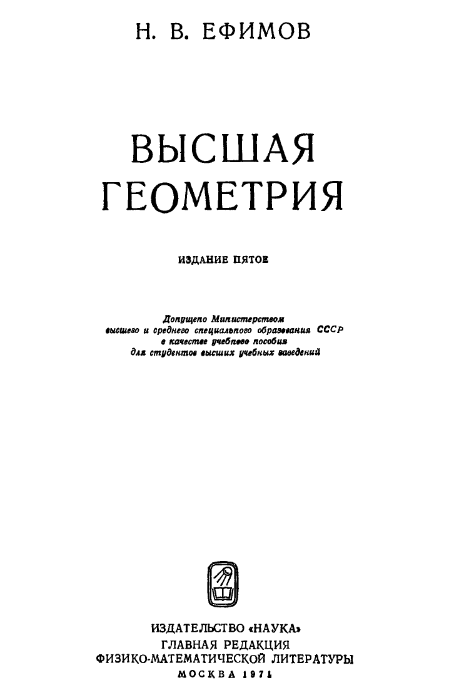

# ВСТУПИТЕЛЬНЫЕ МАТЕРИАЛЫ

## Вступительные материалы

---
**стр. 1**
---

Н. В. ЕФИМОВ

ВЫСШАЯ
ГЕОМЕТРИЯ

ИЗДАНИЕ ПЯТОЕ

*Допущено Министерством
высшего и среднего специального образования СССР
в качестве учебного пособия
для студентов высших учебных заведений*

ИЗДАТЕЛЬСТВО «НАУКА»
ГЛАВНАЯ РЕДАКЦИЯ
ФИЗИКО-МАТЕМАТИЧЕСКОЙ ЛИТЕРАТУРЫ
МОСКВА 1971

---
**стр. 2**
---

517.3/6
Е 91
УДК 513

Николай Владимирович Ефимов
Высшая геометрия
М., 1971 г., 576 стр. с илл.

Редактор А. Ф. Лапко
Техн. редактор К. Ф. Брудно Корректор Н. Б. Румянцева

Сдано в набор 30/VII 1970 г. Подписано к печати 24/IV 1971 г. Бумага 60×90 1/16.
Физ. печ. л. 36. Условн. печ. л. 36. Уч.-изд. л. 38,62. Тираж 50 000 экз.
Цена книги 1 р. 56 к. Заказ № 2193.

Издательство «Наука»
Главная редакция физико-математической литературы
Москва В-71, Ленинский проспект, 15

Отпечатано с матриц Ордена Трудового Красного Знамени
Первой Образцовой типографии имени А. А. Жданова
Главполиграфпрома Комитета по печати при Совете Министров СССР
во 2-й типографии изд-ва «Наука», Москва, Шубинский пер., 10

2-2-3

9-71

---
**стр. 3**
---

# ОГЛАВЛЕНИЕ

Предисловие к пятому изданию 6
Предисловие к четвертому изданию 6
Предисловие к третьему изданию 7

ЧАСТЬ I

ОСНОВАНИЯ ГЕОМЕТРИИ

Г л а в а I. Краткий обзор исследований по основаниям геометрии 9

1. Аксиомы Евклида (§§ 1—4) 9
2. Пятый постулат (§§ 5—8) 14
3. Н. И. Лобачевский и его геометрия (§ 9) 31
4. Формирование понятия геометрического пространства (§ 10) 34

Г л а в а II. Аксиомы элементарной геометрии 41

1. Геометрические элементы (§ 11) 41
2. Группа I. Аксиомы связи (§ 12) 41
3. Группа II. Аксиомы порядка (§ 13) 44
4. Следствия из аксиом связи и порядка (§§ 14—15) 45
5. Группа III. Аксиомы конгруэнтности (§ 16) 54
6. Следствия из аксиом I — III (§§ 17—19) 58
7. Группа IV. Аксиомы непрерывности (§§ 20—24) 72
8. Группа V. Аксиома параллельности. Абсолютная геометрия (§§ 25—27) 86

Г л а в а III. Неевклидова теория параллельных 90

1. Определение параллельных по Лобачевскому (§§ 28—30) 90
2. Особенности расположения параллельных и расходящихся прямых (§§ 31—32) 102
3. Функция Лобачевского $\Pi(x)$ (§ 33) 107
4. Прямые и плоскости в пространстве Лобачевского (§§ 34—35) 111
5. Эквидистанта и орицикл (§§ 36—40) 119
6. Эквидистантная поверхность и орисфера (§§ 41—44) 130
7. Элементарная геометрия на поверхностях пространства Лобачевского (§§ 45—47) 136
8. Площадь треугольника (§ 48) 147
9. Доказательство логической непротиворечивости геометрии Лобачевского (§§ 49—54) 156
10. Основные метрические соотношения в геометрии Лобачевского (§§ 55—62) 177
11. Краткие сведения о геометрии Римана (§§ 63—68) 191

---
**стр. 4**
---

Г л а в а IV. Исследование аксиом элементарной геометрии 201

1. Три основные задачи аксиоматики (§§ 69—70) 201
2. Непротиворечивость аксиом евклидовой геометрии (§ 71) 205
3. Доказательство независимости некоторых аксиом евклидовой геометрии (§§ 72—73) 221
4. Аксиома полноты (§ 74) 232
5. Полнота системы аксиом евклидовой геометрии (§ 75) 237
6. Аксиоматический метод в математике (§ 76) 240

Ч А С Т Ь II

ПРОЕКТИВНАЯ ГЕОМЕТРИЯ

Г л а в а V. Основы проективной геометрии 242

1. Предмет проективной геометрии (§§ 77—83) 242
2. Теорема Дезарга. Построение гармонических групп элементов (§§ 84—88) 248
3. Порядок точек на проективной прямой (§§ 89—91) 261
4. Разделенность гармонических пар; непрерывность гармонического соответствия (§§ 92—93) 271
5. Аксиома непрерывности. Проективная система координат на прямой (§§ 94—97) 277
6. Проективная система координат на плоскости и в пространстве (§§ 98—102) 291
7. Проективное соответствие между элементами одномерных многообразий (§§ 103—105) 304
8. Проективное соответствие между многообразиями двух и трех измерений (§§ 106—108) 315
9. Аналитические представления проективных отображений. Инволюция (§§ 109—113) 325
10. Формулы преобразования проективных координат. Сложное отношение четырех элементов (§§ 114—119) 345
11. Принцип двойственности (§§ 120—124) 353
12. Алгебраические кривые и пучки. Алгебраические поверхности и связки. Комплексная проективная плоскость и комплексное проективное пространство (§§ 125—130) 367
13. Образы второй степени. Теория поляр (§§ 131—136) 376
14. Конструктивные теоремы и задачи проективной геометрии (§§ 137—154) 393

Г л а в а VI. Теоретико-групповые принципы геометрии. Группы преобразований 421

1. Геометрия и теория групп (§§ 155—158) 421
2. Проективная группа и ее основные подгруппы (§§ 159—167) 426
3. Геометрии Лобачевского, Римана и Евклида в проективной схеме (§§ 168—174) 440

Г л а в а VII. Пространство Минковского 458

1. Многомерное аффинное пространство (§§ 175—188) 458
2. Евклидовы пространства и пространство Минковского (§§ 189—202) 475
3. Пространство событий специальной теории относительности (§§ 203—214) 491

---
**стр. 5**
---

ЧАСТЬ III

ГЕОМЕТРИЯ ПОСТОЯННОЙ КРИВИЗНЫ

Г л а в а VIII. Дифференциальные свойства неевклидовой метрики 509

1. Метрическая форма евклидовой плоскости (§ 215) 509
2. Вычисление расстояния между двумя точками на плоскости Лобачевского (§§ 216—219) 512
3. Метрическая форма плоскости Лобачевского (§§ 220—224) 523
4. Внутренняя геометрия поверхности и задача Бельтрами (§§ 225—226) 536
5. Геометрия на поверхности постоянной кривизны (§§ 227—228) 542
6. Вывод основных метрических соотношений в геометрии Лобачевского (§§ 229—233) 552

Г л а в а IX. Пространственные формы геометрии постоянной кривизны 557

1. Двумерные многообразия с дифференциально-геометрической метрикой (§§ 234—238) 557
2. Параболические пространственные формы (§§ 239—241) 564
3. Эллиптические пространственные формы (§§ 242—245) 569
4. Гиперболические пространственные формы (§§ 246—249) 572

---
**стр. 6**
---

# ПРЕДИСЛОВИЕ К ПЯТОМУ ИЗДАНИЮ

В настоящее (пятое) издание внесены небольшие изменения в отдельных местах книги, где, как нам представлялось, требовались поправки и некоторые улучшения прежнего текста.

Москва, 7 июля 1970 г. *Н. Ефимов*

# ПРЕДИСЛОВИЕ К ЧЕТВЕРТОМУ ИЗДАНИЮ

В настоящее издание включена новая глава VII, посвященная пространствам Минковского и основам специальной теории относительности. Эта глава в известной мере примыкает к главам V и VI, где излагаются проективная геометрия и теоретико-групповые вопросы, но по существу ее изложение построено независимо от остального материала книги (в ней используются лишь готовые результаты главы V для доказательства линейности преобразований Лоренца). Что касается других разделов, то они, в основном, остались без изменений, если не считать местных исправлений и улучшений (которых, однако, довольно много).

Автор выражает благодарность Нгуен Кан Тоану (Вьетнам), И. А. Вайнштейну и А. М. Заморзаеву за полезные замечания и рекомендации к четвертому изданию.

Москва, 25 февраля 1961 г. *Н. Ефимов*

---
**стр. 7**
---

# ПРЕДИСЛОВИЕ К ТРЕТЬЕМУ ИЗДАНИЮ

В третьем издании книги сделано множество отдельных исправлений и улучшений текста. Кроме того, написаны два новых раздела главы III: «Основные метрические соотношения в геометрии Лобачевского» и «Краткие сведения о геометрии Римана». Дифференциально-геометрический материал отнесен в конец книги.

Среди отдельных изменений текста следует отметить изменение формулировки аксиомы Кантора. В первом издании книги была принята несколько усиленная по сравнению с обычной формулировка этой аксиомы. Во втором издании при сохранении той же формулировки включен (в главе IV) пример неархимедовой геометрии, в которой имеет место предложение Кантора. Однако указанный пример основан на обычной формулировке канторовской аксиомы. На этот дефект обратил мое внимание А. Д. Александров. В настоящем издании аксиома Кантора дана в обычной формулировке. Ряд других дефектов изложения исправлен благодаря рецензии П. К. Рашевского, опубликованной в «Советской книге» от 10 октября 1949 года. Для подготовки третьего издания весьма существенным было обсуждение книги (повторное, после второго издания) на семинаре В. Ф. Кагана в МГУ.

Несколько слов по поводу использования книги в качестве учебного пособия по курсу оснований геометрии. В настоящем издании основной материал расположен в первых двух частях. В книге этот материал излагается систематически, почти без пропусков деталей рассуждений (за исключением доказательства некоторых теорем элементарной геометрии). Само собой разумеется, что в лекционном изложении такая детализация нецелесообразна (даже если бы на курс было отведено много часов). Наиболее трудоемкой является глава II первой части; мне кажется, что из этой главы на лекциях следует изложить формулировки аксиом и примеры строгого доказательства некоторых теорем; кроме того, следует достаточно подробно остановиться на наиболее принципиальных моментах, каковыми являются: измерение длин, эквивалентность аксиом Архимеда и Кантора аксиоме Дедекинда и значение этих аксиом для обоснования аналитической геометрии. Доказательства большинства начальных теорем элементарной геометрии целесообразно отнести к самостоятельной работе студентов с проверкой на консультациях, на семинарских занятиях или на математическом кружке.

Глава III (геометрия Лобачевского) легко поддается лекционному изложению, и материал этот студенты обычно слушают с

---
**стр. 8**
---

удовольствием. Но и здесь многие вспомогательные теоремы можно дать без доказательства. Напротив, логическую непротиворечивость геометрии Лобачевского, мне кажется, следует доказать со всей подробностью как один из наиболее принципиальных вопросов курса (именно здесь целесообразно использовать точные формулировки аксиом и точно сформулировать полученный результат). Что касается главы IV, то здесь можно ограничиться общим обзором; понятие неполной аксиоматики достаточно иллюстрировать примером первой группы аксиом с реализацией на тетраэдре. Если материал главы IV излагать более подробно, то я рекомендовал бы остановиться на неархимедовых системах (с предварительным кратким изложением сущности декартовой реализации всех аксиом). Проективные понятия в курсе оснований геометрии, естественно, должны играть подсобную роль. Соответственно этому, мне кажется, из главы V достаточно взять построение проективных координат на прямой и на плоскости (опустив доказательство непрерывности гармонического соответствия и доказательство плотности проективной шкалы), аналитическое представление проективных соответствий (исключая трехмерный случай) и теорию поляр. Главу VI я рекомендовал бы изложить полностью.

Материал третьей части может быть использован в работе математических кружков и семинаров.

15/IV 1953 г. *Н. Ефимов*
