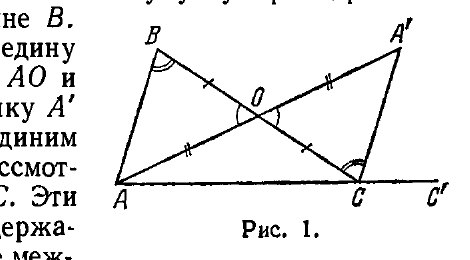
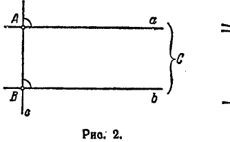
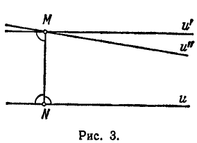
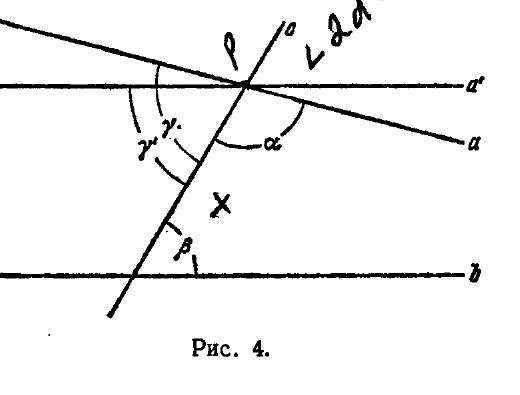
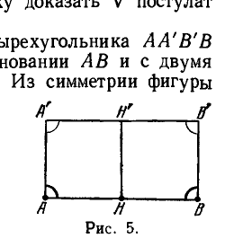
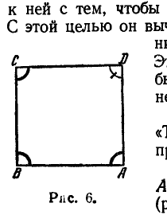
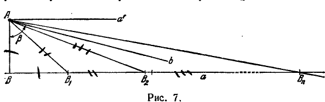
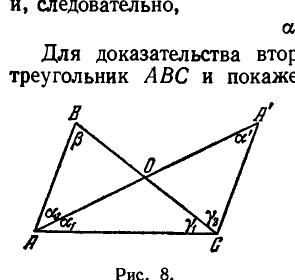

## 2. Пятый постулат

---
**стр. 14**
---

**§ 5.** Каждому изучавшему элементарную геометрию должна быть ясна фундаментальная роль V постулата: на нем основаны теория параллельных линий и все связанные с ней разделы: подобие фигур, тригонометрия и т. д.

Припомним последовательность начальных предложений планиметрии, чтобы заметить, где впервые используется V постулат.

В школьных учебниках прежде всего вводится сравнение геометрических образов: отрезки, углы, треугольники считаются равными, если они могут быть совмещены с помощью движения; отрезок (угол) больше другого отрезка (угла), если второй отрезок (угол) может быть наложен на часть первого. Самое понятие движения остается по существу не определенным.

Далее устанавливается ряд основных теорем, в том числе:

Теоремы о равенстве треугольников.

Теорема: в равнобедренном треугольнике углы при основании равны.

Теорема: внешний угол треугольника больше каждого из внутренних, с ним не смежных.

Теорема: в треугольнике против большей стороны лежит больший угол (и обратная теорема).

Теоремы о перпендикулярах и наклонных.

---
**стр. 15**
---

Теорема: каждая сторона треугольника меньше суммы двух других.

Особый интерес для нас представляет теорема о внутреннем и внешнем углах треугольника, на которую мы дальше неоднократно будем ссылаться. Приведем ее доказательство. Пусть дан треугольник $ABC$ (рис. 1); нужно показать, что каждый из внешних его углов больше любого внутреннего, с ним не смежного. Установим это по отношению к внешнему углу при вершине $C$ и внутреннему углу при вершине $B$.

Обозначив буквой $O$ середину стороны $BC$, построим отрезок $AO$ и на продолжении его возьмем точку $A'$ так, чтобы было $AO = OA'$. Соединим затем точку $A'$ с точкой $C$ и рассмотрим треугольники $AOB$ и $A'OC$. Эти треугольники равны, как содержащие равные углы, заключенные между соответственно равными сторонами. Из равенства рассматриваемых треугольников следует, что $\angle ABC = \angle BCA'$. Отсюда уже вытекает утверждение теоремы, так как $\angle BCA'$ составляет часть внешнего угла при вершине $C$.

Последний момент доказательства требует внимания. Именно, то, что $\angle BCA'$ является частью $\angle BCC'$ или что точка $A'$ находится внутри $\angle BCC'$ ($C'$ — любая точка на продолжении отрезка $AC$), устанавливается, по существу говоря, из наглядности чертежа. Как мы уже указывали ранее, аксиомы Евклида не дают возможности точно обосновать понятия «между», «внутри» и т. д.

Кроме того, выше использовано понятие равенства треугольников, которое тоже не обосновано, так как у Евклида не определено движение.

Таким образом, приведенное рассуждение существенно подкрепляется наглядностью чертежа.

Конечно, подобные же замечания мы могли бы сделать при выводе почти каждой геометрической теоремы. Но важно заметить, что как теорема о внутреннем и внешнем углах треугольника, так и другие перечисленные выше предложения не требуют для своего доказательства V постулата.

Вслед за установлением этих предложений формулируется определение параллельных: две прямые называются параллельными, если они не имеют общей точки\*).

Для того чтобы это определение имело силу, нужно доказать существование параллельных прямых. Доказательство легко

\*) Напомним читателю, что сейчас речь идет о планиметрии.

---
**стр. 16**
---

получается с помощью известной теоремы: две прямые, перпендикулярные к третьей, параллельны между собой, — справедливость этой теоремы непосредственно вытекает из предложения о внутреннем и внешнем углах треугольника.

В самом деле, пусть две прямые $a$ и $b$ составляют с прямой $c$ прямые углы при точках $A$ и $B$ (рис. 2). Допустим, что прямые $a$ и $b$ не параллельны; обозначим через $C$ их общую точку. Но тогда внешний угол треугольника $ABC$ при вершине $A$ должен быть больше внутреннего угла при вершине $B$, что противоречит сделанному относительно этих углов допущению. Тем самым утверждение доказано от противного.

Отсюда тотчас следует, что через каждую точку $M$ можно провести параллельную к любой прямой $u$, не проходящей через эту точку (рис. 3). Для этого достаточно из точки $M$ опустить на прямую $u$ перпендикуляр $MN$ и построить прямую $u'$, перпендикулярную к $MN$ в точке $M$. Прямая $u'$ на основании предыдущего будет параллельна прямой $u$.

После того как доказано существование параллельных и установлено, что через каждую точку можно провести прямую, параллельную данной, естественно, должен быть решен вопрос: проходит ли через каждую точку плоскости только одна прямая, параллельная данной, или таких прямых существует множество.

*В теории параллельных доказывается, что через каждую точку, лежащую вне данной прямой, проходит точно одна прямая, параллельная данной.* Приведем это доказательство (рис. 3).

Пусть $u$ — произвольная прямая, $M$ — какая-нибудь точка, не лежащая на этой прямой, и $MN$ — перпендикуляр к $u$. Обозначим через $u'$ прямую, перпендикулярную к $MN$ в точке $M$. Мы уже знаем, что $u'$ параллельна $u$. Проведем через точку $M$ произвольную прямую $u''$, не совпадающую с $u'$, и докажем, что $u''$ не может быть параллельна прямой $u$. Так как прямая $u''$ не совпадает с прямой $u'$, то она с какой-нибудь стороны составляет с отрезком $MN$ острый угол. Таким образом, прямые $u$ и $u''$ при пересе-

---
**стр. 17**
---

чении прямой $MN$ образуют внутренние односторонние углы, сумма которых меньше двух прямых углов; но отсюда, согласно V постулату, следует, что прямые $u$ и $u''$ пересекаются.

Мы видим, что в этом доказательстве единственности параллельной существенно используется V постулат. Легко усмотреть, что, обратно, V постулат может быть доказан, как теорема, если принять, что через каждую точку, лежащую вне данной прямой, проходит только одна прямая, параллельная данной.

В самом деле, пусть прямые $a$ и $b$ (рис. 4) при пересечении их третьей прямой $c$ образуют с некоторой стороны внутренние односторонние углы, сумма которых меньше $2d$. Нужно показать, что $a$ и $b$ на этой же стороне от прямой $c$ имеют общую точку.

Обозначим углы, которые образуют прямые $a$ и $b$ с прямой $c$, через $\alpha$ и $\beta$, и пусть в соответствии с условием

$$\alpha + \beta < 2d. \quad (*)$$

Пусть, кроме того, $\gamma$ — угол, смежный с углом $\alpha$. Проведем через точку пересечения прямых $a$ и $c$ прямую $a'$ так, чтобы она составила с прямой $c$ угол $\gamma' = \beta$.

Тогда прямые $a'$ и $b$ параллельны; в самом деле, если мы допустим, что $a'$ и $b$ встречаются, то придем к противоречию с теоремой о внутреннем и внешнем углах треугольника. Но, приняв в качестве постулата единственность параллельной, мы должны заключить, что прямая $a$ (как отличная от прямой $a'$) не параллельна прямой $b$. Остается доказать, что $a$ и $b$ встречаются с той стороны, с которой расположены углы $\alpha$ и $\beta$. С этой целью заметим, что $\gamma + \alpha = 2d$; отсюда и из неравенства $(*)$ следует, что $\gamma > \beta$. Таким образом, прямые $a$ и $b$ не могут встретиться с той стороны, где лежит угол $\gamma$, так как в этом случае $\gamma$ будет внутренним углом полученного треугольника, а $\beta$ — его внешним углом и, следовательно, неравенство $\gamma > \beta$ окажется невозможным.

Итак, V постулат эквивалентен утверждению, что существует только одна прямая, параллельная данной и проходящая через данную точку, а последнее утверждение определяет весь строй геометрии Евклида. Отсюда, в частности, следует, что две параллельные прямые при пересечении третьей прямой образуют равные соответственные углы, что сумма внутренних углов

---
**стр. 18**
---

треугольника равна двум прямым, и множество других теорем. Таким образом, V постулат, или, как его называют еще, постулат о параллельных, лежит в основе большинства важных предложений элементарной геометрии.

**§ 6.** Возможно, что уже сам Евклид пытался доказать постулат о параллельных. В пользу этого говорит то обстоятельство, что первые 28 предложений «Начал» не опираются на V постулат; Евклид как бы старался отодвинуть применение этого постулата до тех пор, пока использование его не станет настоятельно необходимым.

Со времен Евклида до конца XIX столетия проблема V постулата являлась одной из самых популярных проблем геометрии. За этот период было предложено множество различных доказательств V постулата. Однако все они были ошибочны. Обычно авторы этих доказательств использовали какое-нибудь геометрическое утверждение, которое оказывалось столь наглядно очевидным, что проскальзывало в рассуждениях незаметно для самого автора. Вместе с тем попытка логически доказать такое утверждение, в свою очередь не опираясь на V постулат, всегда оканчивалась неудачей.

Конечно, подобные исследования не достигали намеченной цели, так как смысл проблемы заключался в освобождении евклидовой теории параллельных от специального постулата, и, таким образом, дело здесь было не в том, чтобы заменить V постулат другим утверждением, хотя бы оно и было весьма очевидным, а в том, чтобы доказать этот постулат, исходя из остальных постулатов геометрии\*).

Нужно заметить, впрочем, что многочисленные попытки доказательства V постулата, несмотря на их тщетность, привели к известным положительным результатам.

Именно благодаря им выяснилась логическая зависимость между различными геометрическими положениями, в частности, был открыт ряд эквивалентов евклидова постулата о параллельных (т. е. таких предложений, которые, будучи приняты без доказательства, вместе с другими основными положениями евклидовой геометрии позволяют доказать V постулат).

Можно привести следующие примеры эквивалентов V постулата:

1. Через каждую точку вне прямой проходит только одна прямая, параллельная данной.

2. Две параллельные прямые при пересечении их третьей прямой образуют равные соответственные углы.

\*) В дальнейшем постановке этой задачи будет придана полная точность.

---
**стр. 19**
---

3. Сумма внутренних углов треугольника равна двум прямым.

4. Точки, расположенные по одну сторону от данной прямой на одном и том же расстоянии, образуют прямую.

5. Расстояния от точек одной из двух параллельных прямых до второй ограничены в своей совокупности.

6. Существуют треугольники с произвольно большой площадью.

7. Существуют подобные треугольники.

Любое из этих предложений можно положить в основу теории параллельных, т. е. признав какое-нибудь из них верным по очевидности, можно точным рассуждением доказать V постулат и после этого, следуя Евклиду, вывести все дальнейшие теоремы. Эквивалентность V постулату перечисленных и некоторых других предложений будет доказана в дальнейшем изложении.

**§ 7.** Из многочисленных сочинений, посвященных V постулату, следует выделить работы Саккери и Ламберта, которые оставили значительный след в деле обоснования теории параллельных.

Исследования Саккери были опубликованы в 1733 г. под названием «Евклид, очищенный от всяких пятен, или опыт, устанавливающий самые первые принципы универсальной геометрии». В этом сочинении Саккери делает попытку доказать V постулат от противного.

Саккери исходит из рассмотрения четырехугольника $AA'B'B$ (рис. 5) с двумя прямыми углами при основании $AB$ и с двумя равными боковыми сторонами $AA'$ и $BB'$. Из симметрии фигуры относительно перпендикуляра $HH'$ к середине основания $AB$ следует, что углы при вершинах $A'$ и $B'$ равны между собой. Если принять V постулат и, следовательно, евклидову теорию параллельных, то сейчас же можно установить, что углы $A'$ и $B'$ прямые и $AA'B'B$ — прямоугольник.

Обратно, как доказывает Саккери, если хотя бы в одном четырехугольнике указанного вида углы при верхнем основании окажутся прямыми, то будет иметь место евклидов постулат о параллельных. Желая доказать этот постулат, Саккери делает три возможных предположения: либо углы $A'$ и $B'$ прямые, либо тупые, либо острые. Эти три предположения названы им соответственно гипотезами прямого, тупого и острого угла. Так как гипотеза прямого угла эквивалентна V постулату, то для того, чтобы доказать этот постулат, следует отвергнуть две другие гипотезы. Совершенно точными рассуждениями Саккери прежде всего приводит к противоречию гипотезу тупого угла. Вслед за тем, приняв гипотезу острого угла, он выводит весьма далеко идущие ее

---
**стр. 20**
---

следствия с тем, чтобы и здесь получить два противоречащих друг другу утверждения. Развивая эти следствия, Саккери строит сложную геометрическую систему, отдельные предложения которой настолько противоречат нашим наглядным представлениям о расположении прямых на плоскости, что могли бы быть сочтены абсурдными. Например, в геометрической системе, соответствующей гипотезе острого угла, две параллельные прямые либо имеют только один общий перпендикуляр, по обе стороны от которого неограниченно друг от друга расходятся, либо не имеют ни одного и, сближаясь асимптотически в одном направлении, неограниченно расходятся в другом.

Саккери справедливо не усматривает в одном только противоречии с привычными пространственными представлениями логической недопустимости этих предложений. Но после ряда точных рассуждений Саккери утверждает ложность гипотезы острого угла на том основании, что асимптотически сближающиеся прямые в бесконечно удаленной точке должны иметь общий перпендикуляр, а это «противно природе прямой». Полагая, что таким образом гипотезы тупого и острого угла приведены к противоречию, Саккери заключает, что единственно истинной является гипотеза прямого угла и этим дано доказательство V постулата. Очевидно, Саккери при этом сам чувствует, что к логическому противоречию гипотеза острого угла им не приведена и он снова возвращается к ней с тем, чтобы доказать, что она «противоречит самой себе». С этой целью он вычисляет двумя способами длину некоторой линии и получает для нее два разных значения. Это обстоятельство действительно заключало бы в себе противоречие, но Саккери пришел к нему, сделав вычислительную ошибку.

Идеи Ламберта, развитые им в сочинении «Теория параллельных линий» (1766 г.), близко примыкают к соображениям Саккери.

Ламберт рассматривает четырехугольник $ABCD$ с тремя прямыми углами $A$, $B$ и $C$ (рис. 6); относительно четвертого угла также могут быть сделаны три допущения: что этот угол острый, прямой или тупой.

Здесь снова, таким образом, возникают три гипотезы. Установив эквивалентность гипотезы прямого угла V постулату и сведя к противоречию гипотезу тупого угла, Ламберт, подобно Саккери, вынужден более всего заниматься гипотезой острого угла. И опять-таки гипотеза острого угла приводит Ламберта к сложной геометрической системе. Однако, несмотря на то, что эта система была далеко развита Ламбертом, ему не удалось встретить в ней логического противоречия. Приведенные выше, в связи с изложением идей Саккери, парадоксальные на

---
**стр. 21**
---

взгляд особенности расположения прямых в системе, основанной на гипотезе острого угла, встречаются и у Ламберта. Он, как и Саккери, не сделал заключения о ложности гипотезы острого угла на том лишь основании, что эти особенности находятся в противоречии с нашими наглядными представлениями о свойствах прямых. Но в отличие от Саккери Ламберт не сделал ошибки, благодаря которой мог бы счесть гипотезу острого угла отвергнутой и V постулат, следовательно, доказанным. Ламберт нигде в своем сочинении не утверждает, что V постулат им доказан, и приходит к твердому заключению, что и все другие попытки в этом направлении не привели к цели.

«Доказательства евклидова постулата — пишет Ламберт — могут быть доведены столь далеко, что остается, по-видимому, ничтожная мелочь. Но при тщательном анализе оказывается, что в этой кажущейся мелочи и заключается вся суть вопроса; обыкновенно она содержит либо доказываемое предложение, либо равносильный ему постулат».

Более того, развивая систему следствий гипотезы острого угла, Ламберт обнаруживает аналогию этой системы со сферической геометрией и в этом усматривает возможность ее существования.

«Я склонен даже думать, что третья гипотеза справедлива на какой-нибудь мнимой сфере. Должна же быть причина, вследствие которой она на плоскости далеко не поддается опровержению, как это легко может быть сделано со второй гипотезой».

Мы увидим дальше, что Ламберт замечательно предчувствовал истинное решение вопроса о V постулате. Во всяком случае он далее, чем кто-либо другой до него, шел по правильному пути.

**§ 8.** Сейчас мы остановимся на исследованиях Лежандра (1752—1833), который хорошо известен своими работами в анализе и механике и оставил также значительный след в геометрии.

Лежандр в течение длительного времени пытался доказать V постулат и опубликовал несколько вариантов его «доказательства». Хотя ни один из вариантов не оказался правильным, все-таки рассуждения Лежандра представляют интерес, так как выясняют связь между V постулатом и предложением о сумме внутренних углов треугольника.

В геометрии Евклида хорошо известно основанное на использовании V постулата доказательство теоремы, согласно которой сумма внутренних углов треугольника равна двум прямым.

Лежандр прежде всего показывает, что, обратно, если принять без доказательства утверждение, что сумма углов треугольника равна двум прямым, то V постулат может быть доказан как теорема.

---
**стр. 22**
---

Далее, имея в виду получить доказательство V постулата без того, чтобы вводить новые постулаты, Лежандр рассматривает три взаимно исключающие друг друга допущения:

I. Сумма углов треугольника больше двух прямых.

II. Сумма углов треугольника равна двум прямым.

III. Сумма углов треугольника меньше двух прямых.

Первое из этих допущений Лежандр точным рассуждением приводит к противоречию. Если бы ему удалось, не используя V постулат, привести к противоречию также и третье допущение, то было бы доказано, что сумма углов треугольника равна двум прямым и вместе с тем был бы доказан и V постулат. Однако при сведении к противоречию третьего допущения Лежандр незаметно для себя использовал один из эквивалентов V постулата.

Положительный итог работы Лежандра содержится в следующих предложениях.

П р е д л о ж е н и е I. *Если сумма углов каждого треугольника равна двум прямым, то имеет место V постулат.*

Для доказательства рассмотрим произвольную прямую $a$ и некоторую точку $A$, лежащую вне этой прямой (рис. 7).

Пусть $AB$ — перпендикуляр, опущенный из точки $A$ на прямую $a$. Нам известно, что прямая $a'$, проходящая через точку $A$ перпендикулярно к отрезку $AB$, не встречает прямой $a$. Нужно показать, что всякая другая прямая, проходящая через точку $A$, пересекается с прямой $a$. Согласно условию при этом доказательстве мы можем воспользоваться тем, что сумма углов всякого треугольника равна двум прямым.

Пусть $b$ — некоторая прямая, проходящая через точку $A$, и $\beta$ — острый угол, который эта прямая составляет с отрезком $AB$. Докажем, что прямая $b$ пересекает прямую $a$ со стороны острого угла. Для этого на прямой $a$ со стороны острого угла построим точку $B_1$ так, чтобы отрезок $BB_1$ был равен отрезку $AB$. С той же стороны от точки $B_1$ построим точку $B_2$ так, чтобы отрезок $B_1B_2$ был равен отрезку $AB_1$, и т. д. Наконец, построим точку $B_n$ так, чтобы отрезок $B_{n-1}B_n$ был равен отрезку $AB_{n-1}$.

Рассмотрим треугольники $ABB_1$, $AB_1B_2$, $\dots$, $AB_{n-1}B_n$. Так как мы допускаем, что сумма углов каждого треугольника

---
**стр. 23**
---

равна двум прямым, то в равнобедренном треугольнике $ABB_1$ внутренние углы при вершинах $A$ и $B_1$ равны $\frac{\pi}{4}$.

Дальше, внутренний угол при вершине $B_1$ в треугольнике $ABB_1$ является внешним углом треугольника $AB_1B_2$, а так как последний треугольник также является равнобедренным, то его внутренние углы, не смежные с углом $B_1$, равны между собой. Но из сделанного нами допущения о сумме углов треугольника вытекает, что внешний угол треугольника равен сумме двух внутренних, с ним не смежных; поэтому каждый из внутренних углов треугольника $AB_1B_2$ при вершинах $A$ и $B_2$ равен $\frac{\pi}{8}$. Продолжая процесс, мы найдем, что внутренний угол при вершине $B_n$ треугольника $AB_{n-1}B_n$ равен

$$\frac{1}{2^n} \cdot \frac{\pi}{2}.$$

Отсюда следует, что

$$\angle BAB_n = \frac{\pi}{2} - \frac{1}{2^n} \cdot \frac{\pi}{2}.$$

Так как $\beta$ — острый угол, то мы можем положить

$$\beta = \frac{\pi}{2} - \varepsilon,$$

где $\varepsilon > 0$. Выберем число $n$ настолько большим, чтобы было

$$\frac{1}{2^n} \cdot \frac{\pi}{2} < \varepsilon.$$

Тогда будем иметь: $\beta < \angle BAB_n$.

В этом случае прямая $b$ проходит между сторонами $AB$ и $AB_n$ треугольника $BAB_n$ и, следовательно, должна иметь общую точку с прямой $a$, заключенную между точками $B$ и $B_n$ *). Этим наше утверждение доказано.

Перейдем теперь к рассмотрению вопроса о возможных значениях суммы внутренних углов треугольника. Для удобства мы будем обозначать через $S(\Delta)$ сумму внутренних углов треугольника $\Delta$ и через $D(\Delta)$ разность между двумя прямыми углами и суммою внутренних углов, так что

$$D(\Delta) = \pi - S(\Delta);$$

последнюю разность принято называть *дефектом треугольника*.

**Предложение II.** *В каждом треугольнике*

$$S(\Delta) \leqslant \pi.$$

\*) Строгое доказательство последнего утверждения может быть проведено с помощью аксиомы Паша (см. § 13).

---
**стр. 24**
---

Доказательство основывается на следующих двух леммах:

I. *В каждом треугольнике сумма двух внутренних углов меньше двух прямых.*

II. *Для всякого треугольника можно построить некоторый новый треугольник с такой же суммой углов, что и у данного, и у которого один угол будет по крайней мере в два раза меньше наперед указанного угла данного треугольника.*

Докажем эти леммы.

Первая из них непосредственно вытекает из предложения о внутреннем и внешнем углах треугольника. В самом деле, пусть $\alpha$ и $\beta$ — внутренние углы некоторого треугольника и $\alpha'$ — внешний угол этого треугольника, смежный с углом $\alpha$. Тогда

$$\alpha + \alpha' = \pi.$$

Но внешний угол треугольника больше внутреннего, с ним не смежного. (Это предложение, как помнит читатель, доказывается без использования V постулата.) Таким образом,

$$\alpha' > \beta$$

и, следовательно,

$$\alpha + \beta < \pi.$$

Для доказательства второй леммы рассмотрим какой-нибудь треугольник $ABC$ и покажем, что можно построить новый треугольник с той же суммой углов, что и данный, и у которого один угол будет по крайней мере в два раза меньше, например, угла при вершине $A$ данного треугольника (рис. 8).

Обозначив буквой $O$ середину стороны $BC$, соединим точку $A$ с точкой $O$ и продолжим отрезок $AO$ до точки $A'$ так, чтобы было $AO = OA'$. Тогда треугольник $AA'C$ будет обладать требуемым свойством. В самом деле, в соответствии с обозначениями, показанными на рис. 8, имеем:

$$S(ABC) = \alpha_1 + \alpha_2 + \beta + \gamma_1,$$

$$S(AA'C) = \alpha_1 + \alpha' + \gamma_1 + \gamma_2.$$

Из равенства треугольников $ABO$ и $COA'$, которое усматривается непосредственно, следует, что

$$\alpha' = \alpha_2, \quad \gamma_2 = \beta.$$

Отсюда прежде всего вытекает, что треугольники $ABC$ и $AA'C$ имеют одинаковые суммы углов.

Далее, внутренние углы второго треугольника при вершинах $A$ и $A'$ в сумме составляют угол при вершине $A$ первого треугольника. Поэтому один из них по крайней мере в два раза меньше

---
**стр. 25**
---

заранее отмеченного угла $A$ треугольника $ABC$, а это и нужно было доказать.

Перейдем теперь к доказательству основного предложения. Будем проводить доказательство от противного.

Предположим, что некоторый треугольник $\Delta$ имеет сумму углов, большую двух прямых, так что $S(\Delta) = \pi + \varepsilon$, где $\varepsilon > 0$. Обозначим один из внутренних углов треугольника $\Delta$ буквой $\alpha$. Согласно лемме II мы можем построить новый треугольник $\Delta_1$, у которого один из внутренних углов $\alpha_1$ будет по крайней мере в два раза меньше $\alpha$ и $S(\Delta_1) = S(\Delta)$. Построим далее треугольник $\Delta_2$, у которого один из внутренних углов $\alpha_2$ по крайней мере в два раза меньше $\alpha_1$ и $S(\Delta_2) = S(\Delta_1)$. Продолжая тот же процесс, построим треугольник $\Delta_n$, у которого один из внутренних углов $\alpha_n$ по крайней мере в два раза меньше, чем $\alpha_{n-1}$, и $S(\Delta_n) = S(\Delta_{n-1})$. Таким образом:

$$S(\Delta_n) = \pi + \varepsilon \quad \text{и} \quad \alpha_n \leqslant \frac{\alpha}{2^n}.$$

Выберем $n$ настолько большим, чтобы было $\frac{\alpha}{2^n} < \varepsilon$ и, следовательно, $\alpha_n < \varepsilon$. Но тогда сумма двух других внутренних углов треугольника $\Delta_n$ окажется большей $\pi$, что противоречит лемме I.

Предложение II тем самым доказано.

*Итак, не опираясь на V постулат, можно утверждать, что сумма внутренних углов треугольника не превышает двух прямых.*

Это обстоятельство оказывается чрезвычайно существенным для дальнейшего.

Следуя Лежандру, мы покажем теперь без использования V постулата, что если предположить хотя бы для одного треугольника сумму внутренних углов равной двум прямым, то отсюда будет вытекать, что и в каждом другом треугольнике сумма внутренних углов также равна двум прямым.

Предварительно установим несколько лемм.

Л е м м а I. *Если треугольник $ABC$ трансверсалью $BP$ разделен на два треугольника, то дефект треугольника $ABC$ равен сумме дефектов треугольников $ABP$ и $BPC$.*

Доказательство усматривается непосредственно. В самом деле, в соответствии с обозначениями рис. 9

$$D(ABP) = \pi - (\alpha + \beta_1 + \delta_1),$$

$$D(BPC) = \pi - (\beta_2 + \delta_2 + \gamma).$$

Отсюда

$$D(ABP) + D(BPC) = 2\pi - (\alpha + \beta_1 + \beta_2 + \delta_1 + \delta_2 + \gamma) =$$

$$= \pi - (\alpha + \beta_1 + \beta_2 + \gamma) = D(ABC).$$
