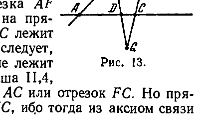
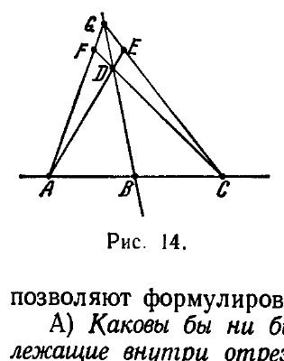
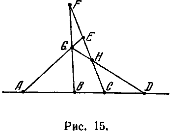
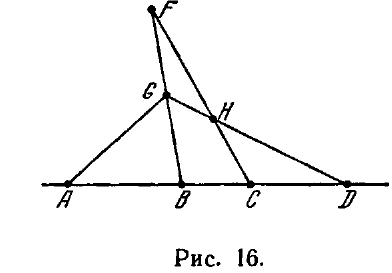

---
**стр. 45**
---

## 4. Следствия из аксиом связи и порядка

**§ 14.** С помощью аксиом связи и порядка могут быть доказаны уже многие важные факты геометрии.

Прежде всего мы приведём две теоремы, которые естественно дополняют утверждения аксиом II,1—II,3.

Т е о р е м а 4. *Каковы бы ни были точки $A$ и $C$, существует по крайней мере одна точка $D$ на прямой $AC$, лежащая между $A$ и $C$.*

Д о к а з а т е л ь с т в о. По аксиоме I,3 существует точка $E$ вне прямой $AC$, по аксиоме II,2 на прямой $AE$ существует точка $F$ такая, что $E$ является точкой отрезка $AF$ (рис. 13). По той же аксиоме II,2 на прямой $FC$ имеется точка $G$ такая, что $C$ лежит между $F$ и $G$. Из аксиомы II,3 тогда следует, что $E$ не лежит между $F$ и $C$, т. е. не лежит на отрезке $FC$. Согласно аксиоме Паша II,4, прямая $EG$ должна пересечь отрезок $AC$ или отрезок $FC$. Но прямая $EG$ не может пересечь отрезка $FC$, ибо тогда из аксиом связи I,1 и I,2 легко следовало бы, что все рассмотренные точки лежат на одной прямой, тогда как уже точки $A$, $C$ и $E$ не лежат на одной прямой. Следовательно, прямая $EG$ пересекает отрезок $AC$ в некоторой точке $D$. Тем самым доказано существование точки $D$ между точками $A$ и $C$.

---
**стр. 46**
---

Т е о р е м а 5. *Среди любых точек $A$, $B$, $C$ одной прямой всегда существует одна, лежащая между двумя другими.*

Д о к а з а т е л ь с т в о. Пусть $A$ не лежит между $B$ и $C$ и $C$ не лежит между $A$ и $B$. Как следует из аксиомы I,3, существует точка $D$, не лежащая на прямой $AC$. Соединим прямою эту точку с точкой $B$ (рис. 14); согласно аксиоме II,2 на прямой $BD$ существует такая точка $G$, что $D$ лежит между $B$ и $G$. Применяя аксиому II,4 (Паша) к треугольнику $BCG$ и прямой $AD$, находим, что прямая $AD$ и $CG$ пересекаются в некоторой точке $E$, лежащей между $C$ и $G$.

Таким же путём установим, что прямые $CD$ и $AG$ пересекаются в некоторой точке $F$ между $A$ и $G$. Снова применяя аксиому Паша II,4 к треугольнику $AEG$ и прямой $CF$, находим, что $D$ лежит между $A$ и $E$, и из той же аксиомы в применении к треугольнику $AEC$ и прямой $BG$ получаем, наконец, что $B$ лежит между $A$ и $C$ (поскольку $G$ не лежит между $E$ и $C$).

Аксиомы II,2 в соединении с теоремой 4 и аксиома II,3 в соединении с теоремой 5 позволяют формулировать следующие две теоремы:

А) *Каковы бы ни были две точки $A$ и $C$, существуют точки, лежащие внутри отрезка $AC$, и точки, лежащие на прямой $AC$ вне этого отрезка.*

Б) *Из трёх точек прямой всегда одна и только одна лежит между двумя другими.*

Теперь мы можем дать важное дополнение аксиомы Паша, которое сформулируем в виде следующей теоремы.

Т е о р е м а 5а. *Если точки $A$, $B$, $C$ не лежат на одной прямой и если некоторая прямая $a$ пересекает какие-либо два из трёх отрезков $AB$, $BC$, $AC$, то она не пересекает третий из этих отрезков*\*).

\*) Когда мы говорим, что прямая пересекает отрезок, то подразумеваем, что она содержит некоторую его внутреннюю точку.

Проведём доказательство методом «от противного». Предположим, что прямая $a$ пересекает каждый из отрезков $AB$, $BC$, $AC$ соответственно в точках $P$, $Q$, $R$, и сведём это предположение к противоречию. Прежде всего, ясно, что точка $B$ не лежит на прямой $PQ$ (иначе все точки $A$, $B$, $C$ лежали бы на прямой $PQ$). Далее заключаем, что точка $R$ находится вне отрезка $PQ$, так как в противном случае прямая $AC$, пересекая сторону $PQ$ треугольника $PQB$, должна была бы, по аксиоме Паша, пересечь его сторону $BQ$, т. е. точка $C$ должна была бы находиться между $B$ и $Q$ вопреки предположению (по предположению $Q$ лежит между $B$ и $C$, а так как из трёх точек только одна лежит между двумя другими, то это исключает возможность расположения $C$ между $B$ и $Q$). Совершенно так же докажем, что $P$ лежит вне отрезка $QR$ и $Q$ лежит вне отрезка $PR$. Получается противоречие с теоремой Б. Тем самым данная теорема доказана.

---
**стр. 47**
---

Для дальнейшего будут нужны две леммы.

**Лемма 1.** *Если $B$ лежит на отрезке $AC$ и $C$ — на отрезке $BD$, то $B$ и $C$ лежат на отрезке $AD$.*

Д о к а з а т е л ь с т в о. Основываясь на аксиомах I,3 и II,2, выберем точку $E$, не лежащую на прямой $AB$, а на прямой $EC$ — такую точку $F$, что $E$ лежит между $C$ и $F$ (рис. 15). Так как $B$ лежит на отрезке $AC$, то, применяя к треугольнику $AEC$ и прямой $FB$ аксиому II,4, заключаем, что прямая $FB$ должна пересечь либо отрезок $AE$, либо отрезок $EC$. Так как точка $E$ лежит между $F$ и $C$, то по аксиоме II,3 точка $F$ не может лежать между $E$ и $C$. Следовательно, прямая $FB$ должна пересечь отрезок $AE$. Применяя аксиому II,4 к треугольнику $FBC$ и прямой $AE$ и снова используя аксиому II,3, найдём, что точка пересечения отрезка $AE$ и прямой $FB$ лежит между точками $F$ и $B$. Обозначим эту точку пересечения буквой $G$. Аналогично доказывается (путём применения аксиомы II,4 к треугольнику $GBD$ и к прямой $CF$ с последующим использованием аксиомы II,3), что прямая $CF$ встречает отрезок $GD$ в некоторой точке $H$. Так как при этом $H$ лежит на отрезке $GD$, а $E$, по аксиоме II,3, не принадлежит отрезку $AG$, то согласно аксиоме II,4 прямая $EH$ имеет общую точку с отрезком $AD$, т. е. $C$ лежит на отрезке $AD$. Совершенно аналогично можно доказать, что и $B$ принадлежит этому отрезку.

**Лемма 2.** *Если $C$ лежит на отрезке $AD$ и $B$ — на отрезке $AC$, то $B$ лежит также на отрезке $AD$ и $C$ — на отрезке $BD$.*

Д о к а з а т е л ь с т в о. Выберем вне прямой $AB$ точку $G$ и потом выберем точку $F$ так, чтобы $G$ находилась на отрезке $BF$ (рис. 16). Вследствие аксиом I,2 и II,3 прямая $CF$ не имеет

---
**стр. 48**
---

общих точек ни с отрезком $AB$, ни с отрезком $BG$, а тогда, согласно аксиоме II,4 она не имеет общих точек также и с отрезком $AG$. Но так как $C$ лежит на отрезке $AD$, то согласно аксиоме II,4 применительно к треугольнику $AGD$ прямая $CF$ должна встретить отрезок $GD$ в некоторой точке $H$. Отсюда и снова из аксиомы II,4 применительно к треугольнику $BGD$ следует, что прямая $FH$ пересекает отрезок $BD$. Таким образом, $C$ лежит на отрезке $BD$.

Первое утверждение леммы 2 вытекает тогда из леммы 1.

Теперь легко доказать следующую важную теорему.

Т е о р е м а 6. *Между любыми двумя точками прямой существует бесконечное множество других её точек.*

Д о к а з а т е л ь с т в о. Пусть $A$, $B$ — две точки прямой $a$. Согласно теореме 4 между $A$ и $B$ существует точка $C$; по той же теореме, между $A$ и $C$ существует точка $D$. В силу леммы 2 точка $D$ лежит также между $A$ и $B$ и, следовательно, $A$, $B$, $C$, $D$ — различные точки прямой $a$. Аналогично можно утверждать, что между $A$ и $D$ лежит точка $E$ и что эта точка лежит также между $A$ и $C$ и между $A$ и $B$, следовательно, точки $A$, $B$, $C$, $D$, $E$ различны.

Повторяя то же рассуждение, установим, что между $A$ и $B$ находится бесконечное множество точек $C$, $D$, $E$, $\dots$, и тем самым докажем теорему.

Заметим, что из лемм 1 и 2 вытекает следующее предложение:

*Пусть каждая из точек $C$ и $D$ лежит между точками $A$ и $B$. Тогда если точка $M$ лежит между $C$ и $D$, то $M$ лежит между $A$ и $B$.*

В самом деле, согласно теореме Б (стр. 46) из трёх точек $A$, $C$, $D$ одна и только одна лежит между двумя другими. Но $A$ не может лежать между $C$ и $D$, так как это противоречило бы лемме 1. Допустим для определённости, что $C$ лежит между $A$ и $D$ (в противном случае переменим обозначения точек $C$ и $D$). Тогда расположение точек $D$, $M$, $C$, $A$ удовлетворяет тем же условиям, каким удовлетворяет расположение точек $A$, $B$, $C$, $D$ в формулировке леммы 2. Поэтому согласно этой лемме точка $M$ лежит между $A$ и $D$. Теперь мы можем утверждать, что и расположение точек $A$, $M$, $D$, $B$ удовлетворяет тем же условиям, каким удовлетворяет расположение точек $A$, $B$, $C$, $D$ в лемме 2. Вследствие этой леммы $M$ лежит между $A$ и $B$, что и нужно было установить.

Таким образом доказана следующая

Т е о р е м а 7. *Если точки $C$ и $D$ лежат между точками $A$ и $B$, то все точки отрезка $CD$ принадлежат отрезку $AB$.*

О п р е д е л е н и е 2. В этом случае говорят, что *отрезок $CD$ лежит внутри отрезка $AB$.*

---
**стр. 49**
---

Из леммы 2 непосредственно вытекает

Т е о р е м а 8. *Если точка $C$ лежит между точками $A$ и $B$, то все точки отрезка $AC$ принадлежат отрезку $AB$.*

Точно так же из леммы 2 (с учётом аксиомы II,3) легко выводится («от противного»)

Т е о р е м а 8а. *Если точка $C$ лежит между точками $A$ и $B$, то никакая точка отрезка $AC$ не может быть точкой отрезка $CB$.*

Несколько сложнее доказывается

Т е о р е м а 8б. *Если точка $C$ лежит между точками $A$ и $B$, то каждая точка отрезка $AB$, отличная от $C$, принадлежит либо отрезку $AC$, либо отрезку $CB$.*

Д о к а з а т е л ь с т в о. Пусть точка $M$ принадлежит отрезку $AB$ и не совпадает с $C$. Предположим, что точка $M$ не принадлежит ни отрезку $AC$, ни отрезку $CB$. Тогда либо $C$ лежит между $A$ и $M$, либо $A$ лежит между $C$ и $M$. Если $C$ лежит между $A$ и $M$, то, поскольку $M$ лежит между $A$ и $B$, на основании второго утверждения леммы 2 заключаем, что $M$ лежит между $C$ и $B$ вопреки предположению. Если $A$ лежит между $C$ и $M$, то, поскольку $C$ лежит между $A$ и $B$, на основании леммы 1 заключаем, что $A$ лежит между $M$ и $B$; следовательно, $M$ не может лежать между $A$ и $B$. Мы снова приходим к противоречию с предположением. Тем самым теорема доказана от противного.

На основании теорем 8, 8а и 8б можно утверждать, что множество внутренних точек отрезка $AB$, не считая точки $C$, представляет собой сумму множества внутренних точек отрезка $AC$ и множества внутренних точек отрезка $CB$, причём эти последние множества общих точек не имеют.

**Определение 3.** Пусть $O$ — некоторая точка прямой $a$, $A$ и $B$ — две другие различные точки этой прямой. Если точка $O$ не лежит между $A$ и $B$, то мы будем говорить, что точки $A$ и $B$ расположены на прямой $a$ с одной и той же стороны от точки $O$. Если точка $O$ лежит между $A$ и $B$, то будем говорить, что точки $A$ и $B$ расположены на прямой $a$ по разные стороны от точки $O$.

Т е о р е м а 9. *Точка $O$ прямой $a$ разделяет все остальные точки этой прямой на два не пустых класса так, что любые две точки прямой $a$, принадлежащие одному классу, лежат с одной стороны от точки $O$, а две точки, принадлежащие разным классам, лежат по разные стороны от точки $O$.*

Чтобы установить справедливость этого утверждения, следует взять на прямой $a$ произвольную точку $A$, отличную от $O$, и отнести в один класс все точки, которые с точкой $A$ лежат по одну сторону от точки $O$, а во второй класс — все точки, которые лежат с точкой $A$ по разные стороны от точки $O$. После этого нужно доказать что 1) каждый класс не пуст; 2) каждая точка прямой,
