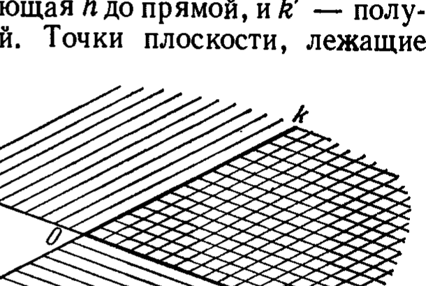
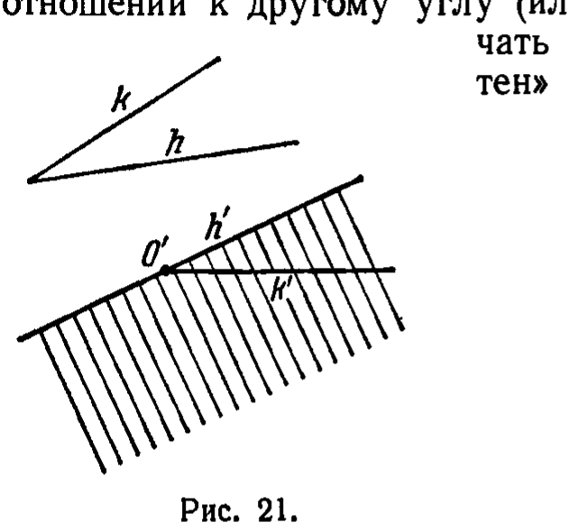
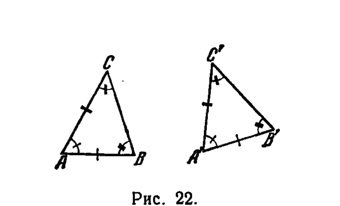

---
**стр. 54**
---

## 5. Группа III. Аксиомы конгруэнтности

**§ 16.** Мы будем говорить, что отрезок $AB$ конгруэнтен (или равен) отрезку $A'B'$, если отрезки $AB$ и $A'B'$ находятся в отношении, удовлетворяющем следующим аксиомам.

III,1. *Если $A$, $B$ — две точки на прямой $a$ и $A'$ — точка на той же прямой или на другой прямой $a'$, то всегда можно найти по данную от точки $A'$ сторону прямой $a'$ одну и только одну такую точку $B'$, что отрезок $AB$ конгруэнтен отрезку $A'B'$.*

Это отношение между отрезками $AB$ и $A'B'$ обозначается так:

$$AB \equiv A'B'.$$

Для каждого отрезка $AB$ требуется конгруэнтность

$$AB \equiv BA.$$

Первая часть этой аксиомы короче выражается так: *каждый отрезок может быть однозначно отложен на любой прямой по любую данную сторону от любой её данной точки* (рис. 18).

<!-- рисунок 18 на стр. 54 не вырезан в этом прогоне -->

III,2. *Если отрезки $A'B'$ и $A''B''$ конгруэнтны одному и тому же отрезку $AB$, то $A'B'$ конгруэнтен отрезку $A''B''$, т. е. если*

$$A'B' \equiv AB \quad \text{и} \quad A''B'' \equiv AB,$$

*то также*

$$A'B' \equiv A''B''.$$

Отсюда, в частности, вытекает, что если $AB \equiv A'B'$, то $AB \equiv B'A'$. В самом деле, имеем два соотношения

$$AB \equiv A'B', \quad B'A' \equiv A'B',$$

---
**стр. 55**
---

(второе обеспечено аксиомой III,1) на основании аксиомы III,2 заключаем, что $AB \equiv B'A'$.

Отсюда и из аксиомы III,1 выводим

*Следствие.* Каждый отрезок конгруэнтен самому себе, т. е.

$$AB \equiv AB, \quad AB \equiv BA.$$

Действительно, соотношение $AB \equiv BA$ потребовано аксиомой III,1, а на основании предыдущего из $AB \equiv BA$ следует $AB \equiv AB$.

Далее мы можем установить предложение: если $AB \equiv A'B'$, то $A'B' \equiv AB$, т. е. отношение конгруэнтности отрезков симметрично.

В самом деле, мы имеем: $A'B' \equiv A'B'$; если дано $AB \equiv A'B'$, то из этих двух соотношений и из аксиомы III,2 вытекает конгруэнтность $A'B' \equiv AB$.

Докажем, наконец, что если

$$AB \equiv A'B' \quad \text{и} \quad A'B' \equiv A''B'',$$

то также

$$AB \equiv A''B'',$$

т. е. отношение конгруэнтности отрезков обладает свойством транзитивности.

Для доказательства достаточно заметить, что на основании предыдущего из двух соотношений $AB \equiv A'B'$, $A'B' \equiv A''B''$ следуют соотношения

$$AB \equiv A'B', \quad A''B'' \equiv A'B',$$

после чего конгруэнтность $AB \equiv A''B''$ обеспечивается аксиомой III,2.

Итак, аксиомы III,1 и III,2 позволяют установить, что: 1) каждый отрезок конгруэнтен самому себе, 2) в отношениях конгруэнтности отрезков порядок определяющих их точек безразличен\*), 3) отношение конгруэнтности отрезков симметрично и транзитивно.

Для более содержательных выводов требуются новые аксиомы.

III,3. Пусть $AB$ и $BC$ — два отрезка на прямой $a$, не имеющие общих внутренних точек, и пусть, далее, $A'B'$ и $B'C'$ — два отрезка на той же или на другой прямой $a'$, тоже не имеющие общих точек. Если при этом

$$AB \equiv A'B' \quad \text{и} \quad BC \equiv B'C',$$

\*) Это означает, что из соотношения $AB \equiv A'B'$ следуют соотношения $AB \equiv B'A'$, $BA \equiv A'B'$ и $BA \equiv B'A'$. Первое из них доказано выше, два последних легко выводятся на основании симметричности и транзитивности отношения конгруэнтности отрезков.
---
**стр. 56**
---

то также

$$AC \equiv A'C'$$

<!-- рисунок 19 на стр. 56 не вырезан в этом прогоне -->

(рис. 19).

О п р е д е л е н и е 7. Пара полупрямых $h, k$, выходящих из одной и той же точки $O$ и не принадлежащих одной прямой, называется *углом*. Для обозначения этого угла употребляются знаки $\angle (h, k)$ и $\angle (k, h)$. Если $A$ и $B$ — точки полупрямых $h$ и $k$, то мы будем также употреблять следующее обозначение угла: $\angle AOB$. Полупрямые $h$ и $k$ называются *сторонами* угла, точка $O$ — *вершиной*.

Пусть $h'$ — полупрямая, дополняющая $h$ до прямой, и $k'$ — полупрямая, дополняющая $k$ до прямой. Точки плоскости, лежащие по ту же сторону от прямой $(h, h')$, что и точки полупрямой $k$, и по ту же сторону от прямой $(k, k')$, что и точки полупрямой $h$, называются *внутренними точками* $\angle (h, k)$, а совокупность всех таких точек — *внутренней областью* угла. Все остальные точки плоскости, содержащей угол, за исключением точки $O$ и точек полупрямых $h$ и $k$, называются *внешними точками* угла, а совокупность всех таких точек — *внешней областью* угла (на рис. 20 внутренняя область $\angle (h, k)$ показана двойной штриховкой).

Отметим следующую теорему.

Т е о р е м а 11а. *Если $A$ и $B$ — точки на разных сторонах угла, то всякая полупрямая, проходящая внутри угла через его вершину, пересекает отрезок $AB$ и, обратно, всякая полупрямая, соединяющая вершину с одной из точек отрезка $AB$, расположена внутри угла.*

Д о к а з а т е л ь с т в о первой части теоремы. Пусть $\angle (h, k)$ — данный угол (на стороне $h$ лежит точка $A$), $l$ — полупрямая, выходящая из вершины во внутреннюю область. Возьмем на полупрямой $h'$, дополняющей полупрямую $h$, произвольную точку $C$ и рассмотрим треугольник $ABC$. Обозначим через $l'$ дополнение полупрямой $l$, через $l^*$ — прямую, составленную из полу-

---
**стр. 57**
---

прямыми $l$ и $l'$. По аксиоме II,4 прямая $l^*$ должна пересечь либо $CB$, либо $AB$. Но прямая $l^*$ не имеет точек внутри $\angle (h', k)$, следовательно, она пересекает именно $AB$.

Далее, полупрямая $l'$ не имеет точек внутри $\angle (h, k)$, следовательно, отрезок $AB$ пересекает полупрямая $l$. Тем самым первая часть теоремы доказана.

Доказательство второй части проводится при помощи тривиальных рассуждений.

Теперь мы вводим последнее основное понятие: конгруэнтность углов. Мы полагаем, что угол может находиться в известном отношении к другому углу (или к самому себе), и будем обозначать это отношение словом «конгруэнтен» или словом «равен».

III,4. *Пусть даны $\angle (h, k)$ на плоскости $\alpha$, прямая $a'$ на этой же или какой-нибудь другой плоскости $\alpha'$ и задана определенная сторона плоскости $\alpha'$ относительно прямой $a'$.*

*Пусть $h'$ — луч прямой $a'$, исходящий из точки $O'$. Тогда на плоскости $\alpha'$ существует один и только один луч $k'$ такой, что $\angle (h, k)$ конгруэнтен $\angle (h', k')$ и при этом все внутренние точки $\angle (h', k')$ лежат по заданную сторону от $a'$. Для конгруэнтности углов употребляется обозначение*

$$\angle (h, k) \equiv \angle (h', k').$$

*Каждый угол конгруэнтен самому себе, т. е.*

$$\angle (h, k) \equiv \angle (h, k) \quad \text{и} \quad \angle (h, k) \equiv \angle (k, h).$$

Первая часть этой аксиомы короче выражается так: *каждый угол может быть однозначно отложен в данной плоскости по данную сторону при данном луче* (рис. 21).

III,5. *Пусть $A, B, C$ — три точки, не лежащие на одной прямой, и $A', B', C'$ — тоже три точки, не лежащие на одной прямой. Если при этом*

$$AB \equiv A'B', \quad AC \equiv A'C' \quad \text{и} \quad \angle BAC \equiv \angle B'A'C',$$

