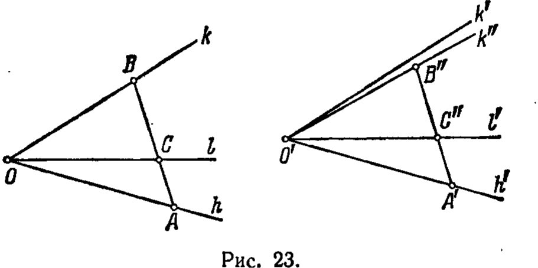

---
**стр. 58**
---

*то $\angle ABC \equiv \angle A'B'C'$ и $\angle ACB \equiv \angle A'C'B'$* (рис. 22).

Сопоставляя аксиомы группы III, отметим, что аксиомы III,1— III,3 касаются лишь отрезков, аксиома III,4 относится к конгруэнтности углов, а аксиома III,5 связывает конгруэнтность отрезков и конгруэнтность углов.

## 6. Следствия из аксиом I — III

**§ 17.** Мы видели, что конгруэнтность отрезков есть свойство взаимное: если отрезок $AB$ конгруэнтен отрезку $A'B'$, то и отрезок $A'B'$ конгруэнтен отрезку $AB$. Поэтому $AB$ и $A'B'$ называются *взаимно конгруэнтными*.

Пусть на прямой $a$ дана система точек $A, B, C, \dots, K, L$ и на прямой $a'$ — система точек $A', B', C', \dots, K', L'$; если отрезки $AB$ и $A'B'$, $AC$ и $A'C'$, $BC$ и $B'C'$, $\dots$, $KL$ и $K'L'$ взаимно конгруэнтны, то обе системы называются *взаимно конгруэнтными*.

Имеет место следующая

Т е о р е м а 12. *Если в двух конгруэнтных системах $A, B, C, \dots, K, L$ и $A', B', C', \dots, K', L'$ точки первой расположены так, что $B$ лежит между $A$ с одной стороны и $C, D, \dots, K, L$ с другой, $C$ между $A$ и $B$ с одной стороны и $D, \dots, K, L$ с другой и т. д., то и точки $A', B', C', \dots, K', L'$ расположены аналогично, т. е. $B'$ лежит между $A'$ с одной стороны и $C', D', \dots, K', L'$ с другой и т. д.*

*Короче можно сказать: при конгруэнтном перенесении системы точек с одной прямой на другую порядок расположения точек сохраняется.*

Не останавливаясь на доказательстве теоремы 12, перейдем к следующей теореме, которая будет существенно использоваться в дальнейшем.

Т е о р е м а 13. *Пусть даны три точки $A, B, C$ на прямой $a$ и три точки $A', B', C'$ на прямой $a'$. Пусть, далее, $AB \equiv A'B'$ и $AC \equiv A'C'$. Тогда, если $B$ лежит между $A$ и $C$, а $B'$ на прямой $a'$ лежит с той же стороны от точки $A'$, что и $C'$, то $B'$ лежит между $A'$ и $C'$.*

В отличие от теоремы 12 здесь заранее не предполагается конгруэнтность $BC \equiv B'C'$.

Д о к а з а т е л ь с т в о. Доказательство может быть непосредственно получено из аксиом III,1 и III,3. В самом деле, по аксиоме III,1 на прямой $a'$ существует такая точка $C^*$, что $B'$ лежит между $A'$ и $C^*$ и $B'C^* \equiv BC$. По аксиоме III,3 тогда должно быть $AC \equiv A'C^*$. Таким образом, $AC \equiv A'C'$ и $AC \equiv A'C^*$. Но так как точки $C'$ и $C^*$ лежат по одну сторону от точки $A'$, то вслед-

---
**стр. 59**
---

ствие аксиомы III,1 точки $C'$ и $C^*$ совпадают. Следовательно, $B'$ лежит между $A'$ и $C'$.

О п р е д е л е н и е 8. Треугольник $ABC$ называется *конгруэнтным* треугольнику $A'B'C'$, если

$$AB \equiv A'B', \quad AC \equiv A'C', \quad BC \equiv B'C'$$

и

$$\angle A \equiv \angle A', \quad \angle B \equiv \angle B', \quad \angle C \equiv \angle C'.$$

Обозначение: $\triangle ABC \equiv \triangle A'B'C'$.

Т е о р е м а 14 (первая теорема о конгруэнтности треугольников). *Если для треугольников $ABC$ и $A'B'C'$ имеют место конгруэнтности*

$$AB \equiv A'B', \quad AC \equiv A'C' \quad \text{и} \quad \angle A \equiv \angle A',$$

*то треугольник $ABC$ конгруэнтен треугольнику $A'B'C'$.*

Д о к а з а т е л ь с т в о. По аксиоме III,5 имеем: $\angle B \equiv \angle B'$, $\angle C \equiv \angle C'$; таким образом, нам нужно только доказать, что $BC \equiv B'C'$.

Допустим, что сторона $BC$ не конгруэнтна стороне $B'C'$. На основании аксиомы III,1 мы можем на луче $B'C'$ найти точку $D'$, для которой $BC \equiv B'D'$. При нашем допущении лучи $A'C'$ и $A'D'$ — разные. Применяя к треугольникам $ABC$ и $A'B'D'$ аксиому III,5, заключаем: $\angle BAC \equiv \angle B'A'D'$. Но по условию $\angle BAC \equiv \angle B'A'C'$. Последние два соотношения противоречат требованию единственности в аксиоме III,4. Следовательно, предположение $BC \not\equiv B'C'$ недопустимо.

Т е о р е м а 15 (вторая теорема о конгруэнтности треугольников). *Если для треугольников $ABC$ и $A'B'C'$ имеют место конгруэнтности*

$$AB \equiv A'B', \quad \angle A \equiv \angle A' \quad \text{и} \quad \angle B \equiv \angle B',$$

*то треугольник $ABC$ конгруэнтен треугольнику $A'B'C'$.*

Д о к а з а т е л ь с т в о. Доказательство проводится аналогично предыдущему с использованием аксиом III,1, III,5 и III,4.

Следующая теорема утверждает для углов в основном то же, что аксиома III,3 для отрезков.

Т е о р е м а 16. *Пусть в некоторой плоскости даны лучи $h, k, l$, исходящие из точки $O$, и лучи $h', k', l'$, исходящие из точки $O'$. Пусть луч $l$ лежит внутри угла $(h, k)$, а луч $l'$ — внутри угла $(h', k')$. Тогда из $\angle (h, l) \equiv \angle (h', l')$ и $\angle (l, k) \equiv \angle (l', k')$*

---
**стр. 60**
---

*следует $\angle (h, k) \equiv \angle (h', k')$.*

Д о к а з а т е л ь с т в о. Доказательство проведем сначала для случая, когда луч $l$ проходит внутри угла $(h, k)$ (рис. 23). Допустим, что $\angle (h, k)$ не конгруэнтен $\angle (h', k')$. На основании аксиомы III,4 построим $\angle (h', k'')$ так, чтобы было $\angle (h, k) \equiv \angle (h', k'')$ и чтобы $\angle (h', k'')$ имел общие внутренние точки с $\angle (h', k')$. Возьмем на лучах $h$ и $k$ соответственно точки $A$ и $B$ и построим на лучах $h'$ и $k''$ точки $A'$ и $B''$ при условиях: $OA \equiv O'A'$ и $OB \equiv O'B''$. Тогда по теореме 14 $AB \equiv A'B''$. Так как луч $l$ проходит внутри $\angle (h, k)$,

то вследствие теоремы 11а луч $l$ пересекает отрезок $AB$ в некоторой точке $C$. Построим на луче $A'B''$ точку $C''$ так, чтобы имела место конгруэнтность $AC \equiv A'C''$. Вследствие конгруэнтностей $AC \equiv A'C''$ и $AB \equiv A'B''$ и на основании теоремы 13 точка $C''$ лежит между $A'$ и $B''$; кроме того, имеет место конгруэнтность $BC \equiv B''C''$ (что можно доказать рассуждением «от противного», используя аксиому III,3). Далее, вследствие конгруэнтностей $OA \equiv O'A'$, $OB \equiv O'B''$, $\angle (h, k) \equiv \angle (h', k'')$ и аксиомы III,5 имеем: $\angle OAC \equiv \angle O'A'C''$ и $\angle OBC \equiv \angle O'B''C''$. На основании той же аксиомы и конгруэнтностей $OA \equiv O'A'$, $AC \equiv A'C''$ и $\angle OAC \equiv \angle O'A'C''$ заключаем, что $\angle AOC \equiv \angle A'O'C''$; аналогично, принимая во внимание конгруэнтности $OB \equiv O'B''$, $BC \equiv B''C''$, $\angle OBC \equiv \angle O'B''C''$, приходим к заключению, что $\angle COB \equiv \angle C''O'B''$.

Вследствие первого из этих двух заключений и аксиомы III,4 точка $C''$ должна лежать на луче $l'$. В таком случае конгруэнтность $\angle COB \equiv \angle C''O'B''$ равносильна конгруэнтности $\angle (l, k) \equiv \angle (l', k'')$. Но по условию теоремы мы имеем: $\angle (l, k) \equiv \angle (l', k')$. Так как по нашему предположению лучи $k'$ и $k''$ различны, то последние два соотношения противоречат аксиоме III,4. Полученное противоречие завершает доказательство.

---
**стр. 61**
---

Пусть теперь луч $k$ лежит внутри $\angle (h, l)$ и луч $k'$ — внутри $\angle (h', l')$. Возьмем на лучах $h$ и $l$ соответственно точки $A$ и $C$ и построим на лучах $h'$ и $l'$ точки $A'$ и $C'$ при условиях: $OA \equiv O'A'$, $OC \equiv O'C'$. Обозначим через $B$ точку пересечения луча $k$ с отрезком $AC$ и через $B'$ — точку пересечения $k'$ и $A'C'$ (существование этих точек теперь обеспечено расположением данных лучей). Из условий теоремы с учетом аксиомы III,5 и теоремы 15 находим, что $CB \equiv C'B'$; отсюда, принимая во внимание конгруэнтность $CA \equiv C'A'$, получаем $BA \equiv B'A'$. Таким образом, $OA \equiv O'A'$, $BA \equiv B'A'$; кроме того, $\angle OAB \equiv \angle O'A'B'$ (по аксиоме III,5). Следовательно, $\angle AOB \equiv \angle A'O'B'$, что и требовалось доказать.

Следующая теорема играет по отношению к углам такую же роль, как теорема 13 по отношению к отрезкам.

Т е о р е м а 16а. *Пусть в некоторой плоскости даны лучи $h, k, l$ и $h', k', l'$, исходящие соответственно из точек $O$ и $O'$. Пусть лучи $k$ и $l$ лежат по одну сторону от прямой, содержащей луч $h$, а лучи $k'$ и $l'$ аналогично расположены относительно $h'$. Тогда, если $\angle (h, k) \equiv \angle (h', k')$, $\angle (h, l) \equiv \angle (h', l')$ и если луч $k$ лежит внутри угла $\angle (h, l)$, то луч $k'$ лежит внутри угла $\angle (h', l')$.*

Д о к а з а т е л ь с т в о. Возьмем на лучах $h$ и $l$ соответственно точки $A$ и $C$ и построим на лучах $h'$ и $l'$ точки $A'$ и $C'$ с соблюдением условий: $OA \equiv O'A'$, $OC \equiv O'C'$. Так как луч $k$ проходит внутри угла $\angle (h, l)$, он пересечет отрезок $AC$ в некоторой точке $B$. С помощью теоремы 14, аксиомы III,1 и теоремы 13 легко показать, что на отрезке $A'C'$ найдется точка $B'$, для которой $AB \equiv A'B'$. Далее из аксиомы III,5 заключаем, что $\angle AOB \equiv \angle A'O'B'$. Отсюда и из аксиомы III,4 вытекает, что луч $k'$ проходит через точку $B'$. Таким образом, луч $k'$ лежит внутри $\angle (h', l')$.

Т е о р е м а 17. *Если в треугольнике $ABC$ имеем $AC \equiv CB$, то $\angle CAB \equiv \angle CBA$ и $\angle CBA \equiv \angle CAB$.*

Д о к а з а т е л ь с т в о. Теорема следует из аксиомы III,5 в применении к треугольникам $CAB$ и $CBA$.

Т е о р е м а 18 (третья теорема о конгруэнтности треугольников). *Если для треугольников $ABC$ и $A'B'C'$ имеют место конгруэнтности*

$$AB \equiv A'B', \quad AC \equiv A'C', \quad BC \equiv B'C',$$

*то треугольник $ABC$ конгруэнтен треугольнику $A'B'C'$.*

Д о к а з а т е л ь с т в о. Вследствие теоремы 14 нам достаточно доказать, что $\angle CAB \equiv \angle C'A'B'$. Допустим противное. Вследствие аксиомы III,4 существует луч $A'P_1$, расположенный с той же стороны от прямой $A'C'$, с какой находится точка $B'$,

