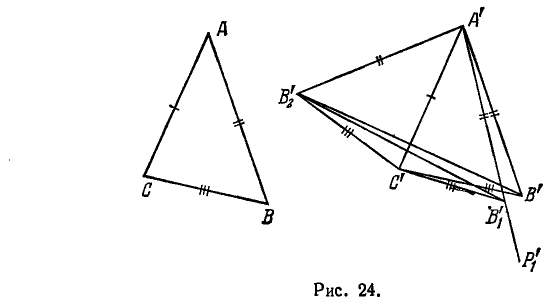
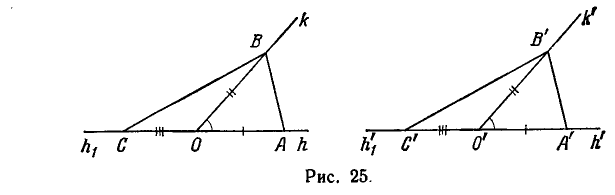
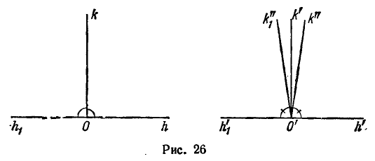
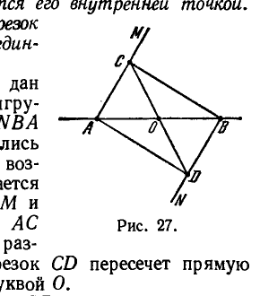

---
**стр. 58**
---

*то $\angle ABC \equiv \angle A'B'C'$ и $\angle ACB \equiv \angle A'C'B'$* (рис. 22).

Сопоставляя аксиомы группы III, отметим, что аксиомы III,1— III,3 касаются лишь отрезков, аксиома III,4 относится к конгруэнтности углов, а аксиома III,5 связывает конгруэнтность отрезков и конгруэнтность углов.

## 6. Следствия из аксиом I — III

**§ 17.** Мы видели, что конгруэнтность отрезков есть свойство взаимное: если отрезок $AB$ конгруэнтен отрезку $A'B'$, то и отрезок $A'B'$ конгруэнтен отрезку $AB$. Поэтому $AB$ и $A'B'$ называются *взаимно конгруэнтными*.

Пусть на прямой $a$ дана система точек $A, B, C, \dots, K, L$ и на прямой $a'$ — система точек $A', B', C', \dots, K', L'$; если отрезки $AB$ и $A'B'$, $AC$ и $A'C'$, $BC$ и $B'C'$, $\dots$, $KL$ и $K'L'$ взаимно конгруэнтны, то обе системы называются *взаимно конгруэнтными*.

Имеет место следующая

Т е о р е м а 12. *Если в двух конгруэнтных системах $A, B, C, \dots, K, L$ и $A', B', C', \dots, K', L'$ точки первой расположены так, что $B$ лежит между $A$ с одной стороны и $C, D, \dots, K, L$ с другой, $C$ между $A$ и $B$ с одной стороны и $D, \dots, K, L$ с другой и т. д., то и точки $A', B', C', \dots, K', L'$ расположены аналогично, т. е. $B'$ лежит между $A'$ с одной стороны и $C', D', \dots, K', L'$ с другой и т. д.*

*Короче можно сказать: при конгруэнтном перенесении системы точек с одной прямой на другую порядок расположения точек сохраняется.*

Не останавливаясь на доказательстве теоремы 12, перейдем к следующей теореме, которая будет существенно использоваться в дальнейшем.

Т е о р е м а 13. *Пусть даны три точки $A, B, C$ на прямой $a$ и три точки $A', B', C'$ на прямой $a'$. Пусть, далее, $AB \equiv A'B'$ и $AC \equiv A'C'$. Тогда, если $B$ лежит между $A$ и $C$, а $B'$ на прямой $a'$ лежит с той же стороны от точки $A'$, что и $C'$, то $B'$ лежит между $A'$ и $C'$.*

В отличие от теоремы 12 здесь заранее не предполагается конгруэнтность $BC \equiv B'C'$.

Д о к а з а т е л ь с т в о. Доказательство может быть непосредственно получено из аксиом III,1 и III,3. В самом деле, по аксиоме III,1 на прямой $a'$ существует такая точка $C^*$, что $B'$ лежит между $A'$ и $C^*$ и $B'C^* \equiv BC$. По аксиоме III,3 тогда должно быть $AC \equiv A'C^*$. Таким образом, $AC \equiv A'C'$ и $AC \equiv A'C^*$. Но так как точки $C'$ и $C^*$ лежат по одну сторону от точки $A'$, то вслед-

---
**стр. 59**
---

ствие аксиомы III,1 точки $C'$ и $C^*$ совпадают. Следовательно, $B'$ лежит между $A'$ и $C'$.

О п р е д е л е н и е 8. Треугольник $ABC$ называется *конгруэнтным* треугольнику $A'B'C'$, если

$$AB \equiv A'B', \quad AC \equiv A'C', \quad BC \equiv B'C'$$

и

$$\angle A \equiv \angle A', \quad \angle B \equiv \angle B', \quad \angle C \equiv \angle C'.$$

Обозначение: $\triangle ABC \equiv \triangle A'B'C'$.

Т е о р е м а 14 (первая теорема о конгруэнтности треугольников). *Если для треугольников $ABC$ и $A'B'C'$ имеют место конгруэнтности*

$$AB \equiv A'B', \quad AC \equiv A'C' \quad \text{и} \quad \angle A \equiv \angle A',$$

*то треугольник $ABC$ конгруэнтен треугольнику $A'B'C'$.*

Д о к а з а т е л ь с т в о. По аксиоме III,5 имеем: $\angle B \equiv \angle B'$, $\angle C \equiv \angle C'$; таким образом, нам нужно только доказать, что $BC \equiv B'C'$.

Допустим, что сторона $BC$ не конгруэнтна стороне $B'C'$. На основании аксиомы III,1 мы можем на луче $B'C'$ найти точку $D'$, для которой $BC \equiv B'D'$. При нашем допущении лучи $A'C'$ и $A'D'$ — разные. Применяя к треугольникам $ABC$ и $A'B'D'$ аксиому III,5, заключаем: $\angle BAC \equiv \angle B'A'D'$. Но по условию $\angle BAC \equiv \angle B'A'C'$. Последние два соотношения противоречат требованию единственности в аксиоме III,4. Следовательно, предположение $BC \not\equiv B'C'$ недопустимо.

Т е о р е м а 15 (вторая теорема о конгруэнтности треугольников). *Если для треугольников $ABC$ и $A'B'C'$ имеют место конгруэнтности*

$$AB \equiv A'B', \quad \angle A \equiv \angle A' \quad \text{и} \quad \angle B \equiv \angle B',$$

*то треугольник $ABC$ конгруэнтен треугольнику $A'B'C'$.*

Д о к а з а т е л ь с т в о. Доказательство проводится аналогично предыдущему с использованием аксиом III,1, III,5 и III,4.

Следующая теорема утверждает для углов в основном то же, что аксиома III,3 для отрезков.

Т е о р е м а 16. *Пусть в некоторой плоскости даны лучи $h, k, l$, исходящие из точки $O$, и лучи $h', k', l'$, исходящие из точки $O'$. Пусть луч $l$ лежит внутри угла $(h, k)$, а луч $l'$ — внутри угла $(h', k')$. Тогда из $\angle (h, l) \equiv \angle (h', l')$ и $\angle (l, k) \equiv \angle (l', k')$*

---
**стр. 60**
---

*следует $\angle (h, k) \equiv \angle (h', k')$.*

Д о к а з а т е л ь с т в о. Доказательство проведем сначала для случая, когда луч $l$ проходит внутри угла $(h, k)$ (рис. 23). Допустим, что $\angle (h, k)$ не конгруэнтен $\angle (h', k')$. На основании аксиомы III,4 построим $\angle (h', k'')$ так, чтобы было $\angle (h, k) \equiv \angle (h', k'')$ и чтобы $\angle (h', k'')$ имел общие внутренние точки с $\angle (h', k')$. Возьмем на лучах $h$ и $k$ соответственно точки $A$ и $B$ и построим на лучах $h'$ и $k''$ точки $A'$ и $B''$ при условиях: $OA \equiv O'A'$ и $OB \equiv O'B''$. Тогда по теореме 14 $AB \equiv A'B''$. Так как луч $l$ проходит внутри $\angle (h, k)$,

то вследствие теоремы 11а луч $l$ пересекает отрезок $AB$ в некоторой точке $C$. Построим на луче $A'B''$ точку $C''$ так, чтобы имела место конгруэнтность $AC \equiv A'C''$. Вследствие конгруэнтностей $AC \equiv A'C''$ и $AB \equiv A'B''$ и на основании теоремы 13 точка $C''$ лежит между $A'$ и $B''$; кроме того, имеет место конгруэнтность $BC \equiv B''C''$ (что можно доказать рассуждением «от противного», используя аксиому III,3). Далее, вследствие конгруэнтностей $OA \equiv O'A'$, $OB \equiv O'B''$, $\angle (h, k) \equiv \angle (h', k'')$ и аксиомы III,5 имеем: $\angle OAC \equiv \angle O'A'C''$ и $\angle OBC \equiv \angle O'B''C''$. На основании той же аксиомы и конгруэнтностей $OA \equiv O'A'$, $AC \equiv A'C''$ и $\angle OAC \equiv \angle O'A'C''$ заключаем, что $\angle AOC \equiv \angle A'O'C''$; аналогично, принимая во внимание конгруэнтности $OB \equiv O'B''$, $BC \equiv B''C''$, $\angle OBC \equiv \angle O'B''C''$, приходим к заключению, что $\angle COB \equiv \angle C''O'B''$.

Вследствие первого из этих двух заключений и аксиомы III,4 точка $C''$ должна лежать на луче $l'$. В таком случае конгруэнтность $\angle COB \equiv \angle C''O'B''$ равносильна конгруэнтности $\angle (l, k) \equiv \angle (l', k'')$. Но по условию теоремы мы имеем: $\angle (l, k) \equiv \angle (l', k')$. Так как по нашему предположению лучи $k'$ и $k''$ различны, то последние два соотношения противоречат аксиоме III,4. Полученное противоречие завершает доказательство.

---
**стр. 61**
---

Пусть теперь луч $k$ лежит внутри $\angle (h, l)$ и луч $k'$ — внутри $\angle (h', l')$. Возьмем на лучах $h$ и $l$ соответственно точки $A$ и $C$ и построим на лучах $h'$ и $l'$ точки $A'$ и $C'$ при условиях: $OA \equiv O'A'$, $OC \equiv O'C'$. Обозначим через $B$ точку пересечения луча $k$ с отрезком $AC$ и через $B'$ — точку пересечения $k'$ и $A'C'$ (существование этих точек теперь обеспечено расположением данных лучей). Из условий теоремы с учетом аксиомы III,5 и теоремы 15 находим, что $CB \equiv C'B'$; отсюда, принимая во внимание конгруэнтность $CA \equiv C'A'$, получаем $BA \equiv B'A'$. Таким образом, $OA \equiv O'A'$, $BA \equiv B'A'$; кроме того, $\angle OAB \equiv \angle O'A'B'$ (по аксиоме III,5). Следовательно, $\angle AOB \equiv \angle A'O'B'$, что и требовалось доказать.

Следующая теорема играет по отношению к углам такую же роль, как теорема 13 по отношению к отрезкам.

Т е о р е м а 16а. *Пусть в некоторой плоскости даны лучи $h, k, l$ и $h', k', l'$, исходящие соответственно из точек $O$ и $O'$. Пусть лучи $k$ и $l$ лежат по одну сторону от прямой, содержащей луч $h$, а лучи $k'$ и $l'$ аналогично расположены относительно $h'$. Тогда, если $\angle (h, k) \equiv \angle (h', k')$, $\angle (h, l) \equiv \angle (h', l')$ и если луч $k$ лежит внутри угла $\angle (h, l)$, то луч $k'$ лежит внутри угла $\angle (h', l')$.*

Д о к а з а т е л ь с т в о. Возьмем на лучах $h$ и $l$ соответственно точки $A$ и $C$ и построим на лучах $h'$ и $l'$ точки $A'$ и $C'$ с соблюдением условий: $OA \equiv O'A'$, $OC \equiv O'C'$. Так как луч $k$ проходит внутри угла $\angle (h, l)$, он пересечет отрезок $AC$ в некоторой точке $B$. С помощью теоремы 14, аксиомы III,1 и теоремы 13 легко показать, что на отрезке $A'C'$ найдется точка $B'$, для которой $AB \equiv A'B'$. Далее из аксиомы III,5 заключаем, что $\angle AOB \equiv \angle A'O'B'$. Отсюда и из аксиомы III,4 вытекает, что луч $k'$ проходит через точку $B'$. Таким образом, луч $k'$ лежит внутри $\angle (h', l')$.

Т е о р е м а 17. *Если в треугольнике $ABC$ имеем $AC \equiv CB$, то $\angle CAB \equiv \angle CBA$ и $\angle CBA \equiv \angle CAB$.*

Д о к а з а т е л ь с т в о. Теорема следует из аксиомы III,5 в применении к треугольникам $CAB$ и $CBA$.

Т е о р е м а 18 (третья теорема о конгруэнтности треугольников). *Если для треугольников $ABC$ и $A'B'C'$ имеют место конгруэнтности*

$$AB \equiv A'B', \quad AC \equiv A'C', \quad BC \equiv B'C',$$

*то треугольник $ABC$ конгруэнтен треугольнику $A'B'C'$.*

Д о к а з а т е л ь с т в о. Вследствие теоремы 14 нам достаточно доказать, что $\angle CAB \equiv \angle C'A'B'$. Допустим противное. Вследствие аксиомы III,4 существует луч $A'P_1$, расположенный с той же стороны от прямой $A'C'$, с какой находится точка $B'$,

---
**стр. 62**
---

и удовлетворяющий условию: $\angle CAB \equiv \angle C'A'P'_1$. По предположению луч $A'P'_1$ не совпадает с лучом $A'B'$ (рис. 24). На основании аксиомы III,1 на луче $A'P'_1$ имеется точка $B'_1$, для которой $AB \equiv A'B'_1$; так как $AB \equiv A'B'_1$, $AC \equiv A'C'$ и $\angle CAB \equiv \angle C'A'B'_1$, то по теореме 14 имеем: $\triangle ABC \equiv \triangle A'B'_1C'$. Отсюда следует конгруэнтность $BC \equiv B'_1C'$. Ввиду симметричности и транзитивности конгруэнтности отрезков заключаем на основании предыдущего, что стороны треугольника $A'B'_1C'$ конгруэнтны соответствующим сторонам треугольника $A'B'C'$. Подобно предыдущему, построим треугольник $A'B'_2C'$, лежащий

по другую сторону от прямой $A'C'$ и обладающий таким же свойством. Рассмотрим треугольники $A'B'_2B'$ и $C'B'_2B'$. Вследствие конгруэнтности $A'B'_2 \equiv A'B'$ по теореме 17 имеем: $\angle A'B'_2B' \equiv \angle A'B'B'_2$; аналогично, $\angle B'B'_2C' \equiv \angle B'_2B'C'$. Из последних двух соотношений и на основании теоремы 16 заключаем, что $\angle A'B'_2C' \equiv \angle A'B'C'$; отсюда и из теоремы 14 следует, что $\triangle A'B'_2C' \equiv \triangle A'B'C'$ и, таким образом, $\angle C'A'B'_2 \equiv \angle C'A'B'$. Совершенно так же можно доказать, что $\angle C'A'B'_2 \equiv \angle C'A'B'_1$. Последние два соотношения противоречат аксиоме III,4; полученное противоречие доказывает теорему.

Теперь легко может быть доказана

Т е о р е м а 19. *Если $\angle (h, k) \equiv \angle (h', k')$ и $\angle (h, k) \equiv \angle (h'', k'')$, то $\angle (h', k') \equiv \angle (h'', k'')$.*

Д о к а з а т е л ь с т в о. Обозначим вершины $\angle (h, k)$, $\angle (h', k')$ и $\angle (h'', k'')$ соответственно буквами $O, O'$ и $O''$. Возьмем на лучах $h, k$ какие-нибудь точки $A, B$ ($A$ — на луче $h$, $B$ — на луче $k$) и построим на лучах $h', k', h'', k''$ точки $A', B', A'', B''$ при условиях $OA \equiv O'A'$, $OB \equiv O'B'$, $OA \equiv O''A''$, $OB \equiv O''B''$. По теореме 14 имеем: $AB \equiv A'B'$, $AB \equiv A''B''$. Так как свойство

---
**стр. 63**
---

конгруэнтности отрезков симметрично и транзитивно, то предыдущие соотношения дают конгруэнтности: $O'A' \equiv O''A''$, $O'B' \equiv O''B''$, $A'B' \equiv A''B''$. По теореме 18 отсюда следует, что $\triangle O'A'B' \equiv \triangle O''A''B''$ и, таким образом, $\angle A'O'B' \equiv \angle A''O''B''$. Теорема доказана.

Предположим теперь, что некоторый $\angle (h, k)$ конгруэнтен $\angle (h', k')$. Так как по аксиоме III,4 $\angle (h, k)$ конгруэнтен самому себе: $\angle (h, k) \equiv \angle (h, k)$, то из теоремы 19 следует, что $\angle (h', k')$ конгруэнтен $\angle (h, k)$. Таким образом, из

$$\angle (h, k) \equiv \angle (h', k')$$

следует

$$\angle (h', k') \equiv \angle (h, k).$$

Тем самым доказано, что отношение конгруэнтности углов является симметричным (взаимным). Вследствие теоремы 19 оно также и транзитивно. Вместе с тем оказывается симметричным и транзитивным отношение конгруэнтности для треугольников.

Дальнейшие основные предложения геометрии могут быть развернуты, например, в следующем порядке.

О п р е д е л е н и е 9. Два угла, у которых имеются общая вершина и одна общая сторона, а другие стороны которых составляют прямую линию, называются *смежными углами*. Два угла с общей вершиной, стороны которых попарно составляют прямые линии, называются *вертикальными углами*.

Т е о р е м а 20. *Если два угла взаимно конгруэнтны, то смежные с ними углы также взаимно конгруэнтны.*

Д о к а з а т е л ь с т в о. Пусть $\angle (h, k) \equiv \angle (h', k')$ (рис. 25); обозначим через $h_1$ — луч, дополняющий $h$ до прямой, через $h'_1$ — луч, дополняющий $h'$; вершины $\angle (h, k)$ и $\angle (h', k')$ обозначим через $O$ и $O'$. Возьмем на лучах $h, k$ и $h_1$ соответственно точки $A, B$ и $C$. По аксиоме III,1 на лучах $h', k'$ и $h'_1$ найдутся точки $A', B'$ и $C'$ такие, что $OA \equiv O'A'$, $OB \equiv O'B'$ и $OC \equiv O'C'$. Отсюда по аксиоме III,3 $AC \equiv A'C'$; по аксиоме III,5 $\angle OAB \equiv \angle O'A'B'$ (или $\angle CAB \equiv \angle C'A'B'$), по теореме 14 $AB \equiv A'B'$. Так как $AB \equiv A'B'$, $AC \equiv A'C'$ и $\angle CAB \equiv \angle C'A'B'$, то, снова

---
**стр. 64**
---

используя теорему 14, находим, что $BC \equiv B'C'$. Так как $OB \equiv O'B'$, $OC \equiv O'C'$ и $BC \equiv B'C'$, то по теореме 18 $\angle BOC \equiv \angle B'O'C'$, т. е. $\angle (k, h_1) \equiv \angle (k', h'_1)$, что и требовалось.

Т е о р е м а 21. *Вертикальные углы конгруэнтны между собой.*

Д о к а з а т е л ь с т в о легко получается из теоремы 20, поскольку вертикальные углы имеют общий смежный угол.

Угол, конгруэнтный своему смежному, называется *прямым*.

Чтобы доказать существование прямых углов, возьмем произвольный $\angle (h, k)$ и построим $\angle (h', k)$, конгруэнтный $\angle (h, k)$, но расположенный по другую сторону от $k$ (возможность построения обеспечивается аксиомой III,4). Отложим от общей вершины на $h$ и $h'$ конгруэнтные отрезки и соединим концы их прямой. Если эта прямая пройдет через вершину угла $\angle (h, k)$, то сам угол $\angle (h, k)$ — прямой. В противном случае она пересечет либо луч $k$, либо его дополнение. Но тогда из аксиомы III,5 или соответственно из теоремы 20 и аксиомы III,5 следует, что эта прямая составляет прямые углы либо с лучом $k$, либо с его дополнением.

Т е о р е м а 22. *Все прямые углы конгруэнтны между собой.*

Д о к а з а т е л ь с т в о. Пусть $\angle (h, k)$ и $\angle (h', k')$ — прямые (рис. 26), $\angle (k, h_1)$ и $\angle (k', h'_1)$ — смежные им углы, $O$ и $O'$ —

вершины этих углов. Допустим, что $\angle (h, k) \not\equiv \angle (h', k')$. По аксиоме III,4 найдется луч $k''$, исходящий из точки $O'$ в ту сторону от прямой $(h'_1, h')$, где лежит $k'$, и такой, что $\angle (h, k) \equiv \angle (h', k'')$. При нашем допущении луч $k''$ не может совпасть с лучом $k'$. Тогда он должен пройти либо внутри $\angle (h', k')$, либо внутри $\angle (h'_1, k')$. (Это следует из теоремы 11а и из аксиомы Паша II,4.) Пусть, например, $k''$ проходит внутри $\angle (h', k')$. По аксиоме III,4 найдется луч $k''_1$, исходящий из точки $O'$ в ту сторону от прямой $(h'_1, h')$, где лежит $k'$, и такой, что $\angle (h', k'') \equiv \angle (h'_1, k''_1)$. Так как $\angle (h', k') \equiv \angle (h'_1, k')$, то по теореме 16а

---
**стр. 65**
---

луч $k''_1$ будет лежать внутри $\angle (h'_1, k')$; поэтому луч $k''_1$ не может совпадать с лучом $k''$. Отсюда и из III,4 имеем: $\angle (h'_1, k'') \not\equiv \angle (h'_1, k''_1)$. Но, с другой стороны, $\angle (h'_1, k'') \equiv \angle (h_1, k)$ (по теореме 20) $\equiv \angle (h, k) \equiv \angle (h', k'') \equiv \angle (h'_1, k''_1)$, что противоречит предыдущему. Аналогично получается противоречие в случае, когда $k''$ проходит внутри $\angle (h'_1, k')$. Тем самым теорема доказана от противного.

О п р е д е л е н и е. Пусть $A$ и $B$ — различные точки; точку $O$ будем называть серединой отрезка $AB$, если она лежит на прямой $AB$ и удовлетворяет условию $AO \equiv OB$.

Т е о р е м а 23. *Для каждого отрезка существует единственная середина; середина отрезка является его внутренней точкой.*

Другими словами: *каждый отрезок можно разделить пополам, и притом единственным образом.*

Д о к а з а т е л ь с т в о. Пусть дан отрезок $AB$ (рис. 27). Построим конгруэнтные между собой $\angle MAB$ и $\angle NBA$ так, чтобы лучи $AM$ и $BN$ расположились по разные стороны от прямой $AB$; возможность этого построения обеспечивается аксиомой III,4. Отложим на лучах $AM$ и $BN$ конгруэнтные друг другу отрезки $AC$ и $BD$. Так как точки $C$ и $D$ лежат по разные стороны от прямой $AB$, то отрезок $CD$ пересечет прямую $AB$ в некоторой точке; обозначим ее буквой $O$.

Выбор конгруэнтных отрезков $AC$ и $BD$ мы произведем с соблюдением следующей предосторожности: в случае, если бы оказалось, что прямые $AM$ и $BN$ пересекаются, возьмем точку $C$ где-нибудь между $A$ и точкой пересечения $AM$ и $BN$; затем построим $BD \equiv AC$ (в действительности предположенный случай невозможен, но доказывать это мы сейчас не будем). Теперь ясно, что точка $O$ не может совпасть ни с точкой $A$, ни с точкой $B$. Легко доказать также, что $O$ не может лежать вне отрезка $AB$. Именно, допустив, например, что $A$ лежит между $O$ и $B$, получим противоречие с аксиомой Паша по отношению к треугольнику $OBD$ (так как прямая $AM$ пересекает отрезок $OB$ в точке $A$, но не может пересечь ни $OD$, ни $BD$). Итак, $O$ лежит между $A$ и $B$. Докажем, что $O$ есть середина отрезка $AB$. В самом деле, по теореме 14, треугольники $ABC$ и $ABD$ конгруэнтны, следовательно, $CB \equiv AD$. Отсюда и из теоремы 18 вытекает конгруэнтность треугольников $ACD$ и $BCD$, на основании чего имеем конгруэнтность $\angle ACD$ и $\angle CDB$. Из последнего обстоятельства с помощью теоремы 15 заключаем, что конгруэнтны треугольники $ACO$ и $BDO$; следовательно, $AO \equiv OB$.

---
**стр. 66**
---

Теперь докажем, что отрезок имеет только одну середину. Предположим обратное: пусть отрезок $AB$ имеет две середины. В силу аксиомы III,1 одна из них лежит между другой и точкой $A$ *); поэтому они могут быть обозначены буквами $O_1$ и $O_2$ так, что $O_1$ лежит между $A$ и $O_2$. Тогда на основании леммы 2 точка $O_2$ лежит между $O_1$ и $B$. Но при наличии соотношений $AO_1 \equiv BO_1$, $AO_2 \equiv BO_2$ и при условии, что $O_1$ лежит между $A$ и $O_2$, из теоремы 13 следует, что точка $O_1$ лежит между $B$ и $O_2$. Таким образом, с одной стороны, $O_2$ лежит между $B$ и $O_1$, а с другой стороны, $O_1$ лежит между $B$ и $O_2$. Получается противоречие с аксиомой II,3.

Отметим еще следующие теоремы:

Т е о р е м а 17 bis. *В равнобедренном треугольнике медиана основания есть в то же время высота и биссектриса угла при вершине.*

Т е о р е м а 24. *Каждый угол можно разделить пополам и притом единственным образом.*

Т е о р е м а 25. *Из любой точки можно опустить на данную прямую один и только один перпендикуляр.*

Т е о р е м а 26. *Из каждой точки на прямой можно восстановить к этой прямой единственный перпендикуляр.*

**§ 18.** С помощью аксиом I—III могут быть определены соотношения «больше» и «меньше» для отрезков и углов.

О п р е д е л е н и е 10. Если даны два отрезка $AB$ и $A'B'$ и внутри $AB$ существует такая точка $C$, что

$$AC \equiv A'B',$$

то говорят, что *отрезок $AB$ больше отрезка $A'B'$ или отрезок $A'B'$ меньше отрезка $AB$; пишут $AB > A'B'$ или $A'B' < AB$.*

О п р е д е л е н и е 11. Если даны $\angle (h, k)$ и $\angle (h', k')$ и среди полупрямых, проходящих через вершину внутри $\angle (h, k)$, существует полупрямая $l$ такая, что

$$\angle (h, l) \equiv \angle (h', k'),$$

то говорят, что $\angle (h, k)$ больше $\angle (h', k')$ или $\angle (h', k')$ меньше $\angle (h, k)$.

Т е о р е м а 27. *Для произвольных двух отрезков $AB$ и $CD$ всегда выполняется одно из трех соотношений*

$$AB \equiv CD, \quad AB > CD, \quad AB < CD,$$

*причем каждое из них исключает два других.*

*) В силу аксиомы III,1 середина отрезка лежит внутри отрезка, отсюда следует, что если отрезок $AB$ имеет две середины, то одна из них лежит между другой и точкой $A$.

---
**стр. 67**
---

В самом деле, по аксиоме III,1, на прямой $AB$ существует точка $M$, расположенная с той же стороны от точки $A$, что и точка $B$, и удовлетворяющая условию $AM \equiv CD$. Если точка $M$ лежит между $A$ и $B$, то $AB > CD$, если $M$ совпадает с $B$, то $AB \equiv CD$, если $B$ лежит между $A$ и $M$, то $AB < CD$. Таким образом, существование одного из трех указанных соотношений установлено.

Покажем теперь, что любое из них исключает остальные. Пусть, например, $AB > CD$. В этом случае на отрезке $AB$ существует точка $M$, для которой $AM \equiv CD$. Если бы отрезки $AB$ и $CD$, кроме соотношения $AB > CD$, удовлетворяли еще соотношению $AB \equiv CD$, то, по аксиоме III,2, имелась бы конгруэнтность $AM \equiv AB$, что противоречит аксиоме III,1. Точно так же при $AB > CD$ не может иметь место соотношение $AB < CD$. Действительно, если $AB > CD$ и $AB < CD$, то между $A$ и $B$ существует точка $M$, для которой $AM \equiv CD$, а между $C$ и $D$ существует точка $N$ такая, что $CN \equiv AB$. Мы приходим к противоречию с теоремой 13.

Т е о р е м а 28. *Если $AB < A'B'$ и $A'B' < A''B''$, то $AB < A''B''$.*

Доказательство может быть получено очевидными рассуждениями при помощи теоремы 13 и теоремы 8 (или леммы 2).

Как следствие теоремы 28 отметим следующую теорему.

Т е о р е м а 29. *Если отрезок $CD$ есть часть отрезка $AB$, то $CD < AB$.*

Читатель легко сформулирует теоремы, играющие в сравнении углов такую же роль, какую играют теоремы 27, 28 и 29 в сравнении отрезков.

После того как введены для отрезков и углов понятия «больше» и «меньше», можно сформулировать и доказать следующие теоремы.

Т е о р е м а 30. *Внешний угол треугольника больше каждого внутреннего, не смежного с ним.*

Хотя теорема 30 является очень важной в нашем изложении, мы не будем ее здесь доказывать, так как доказательство, которое обычно приводится в учебниках, точно обосновывается аксиомами I—III. В историческом обзоре эта теорема упоминалась в § 5, где дано также ее доказательство.

Т е о р е м а 31. *Во всяком треугольнике по крайней мере два угла острые.*

Т е о р е м а 32. *В треугольнике бо́льшая сторона лежит против бо́льшего угла, и обратно, бо́льший угол лежит против бо́льшей стороны.*

Т е о р е м а 33. *Перпендикуляр короче наклонной.*
