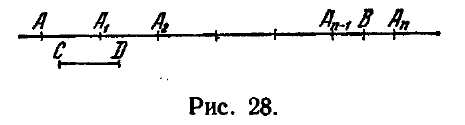
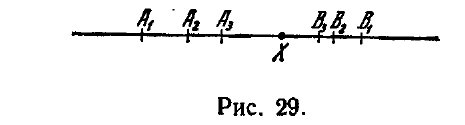

## 7. Группа IV. Аксиомы непрерывности

---
**стр. 72**
---

## 7. Группа IV. Аксиомы непрерывности

**§ 20.** С помощью аксиом I—III мы установили сравнение отрезков так, что из любых двух отрезков один либо больше другого, либо меньше его, либо равен ему (теорема 27 § 18).

Аксиом I—III, однако, недостаточно для того, чтобы можно было установить процесс измерения, в результате которого отношение любого отрезка к линейной единице выражается определенным числом.

Обоснование измерения отрезков дается нижеприводимой аксиомой IV,1, которую обычно называют аксиомой Архимеда. Аксиома Архимеда позволяет (при выборе линейной единицы) для каждого отрезка единственным образом определить некоторое положительное число, называемое длиной отрезка. Чтобы иметь возможность и обратно установить существование отрезка, длина которого равна любому наперед данному положительному числу, необходимо ввести еще одну аксиому.

Уклоняясь от изложения Гильберта, мы даем в качестве такой аксиомы аксиому IV,2, представляющую собой не что иное, как известный принцип Кантора о стягивающихся интервалах. В системе Гильберта предложению IV,2 соответствует аксиома полноты, которую мы в главе IV сопоставим с аксиомой Кантора.

IV,1 (аксиома Архимеда). *Пусть $AB$ и $CD$ — произвольные отрезки. Тогда на прямой $AB$ существует конечное число точек $A_1, A_2, \dots, A_n$, расположенных так, что точка $A_1$ лежит между $A$ и $A_2$, точка $A_2$ лежит между $A_1$ и $A_3$ и т. д., причем отрезки $AA_1, A_1A_2, \dots, A_{n-1}A_n$ конгруэнтны отрезку $CD$ и $B$ лежит между $A$ и $A_n$ (рис. 28).*

IV,2 (аксиома Кантора). *Пусть на какой угодно прямой $a$ дана бесконечная последовательность отрезков $A_1B_1, A_2B_2, \dots$, из которых каждый последующий лежит внутри предыдущего; пусть далее, каким бы ни был заранее данный отрезок, найдется номер $n$, для которого $A_nB_n$ меньше этого отрезка. Тогда существует на прямой $a$ точка $X$, лежащая внутри всех отрезков $A_1B_1, A_2B_2$ и т. д. (рис. 29).*

Из условия аксиомы сразу следует, что существует только одна точка $X$, лежащая внутри всех отрезков $A_1B_1, A_2B_2$ и т. д.

---
**стр. 73**
---

В самом деле, если на прямой $a$ имеется еще другая точка $Y$, лежащая внутри всех отрезков $A_1B_1, A_2B_2, \dots$, то при любом $n$ отрезок $A_nB_n$ больше отрезка $XY$, что исключено условием.

О п р е д е л е н и е 12. Пусть каждому отрезку соответствует определенное положительное число, причем:

1) равным отрезкам соответствуют равные числа;

2) если $B$ — точка отрезка $AC$ и отрезкам $AB$ и $BC$ соответствуют числа $a$ и $b$, то отрезку $AC$ соответствует число $a + b$;

3) некоторому отрезку $OO'$ соответствует число, равное 1.

Тогда число, указанным образом соответствующее каждому отрезку, называется *длиной* этого отрезка; отрезок $OO'$ называется *линейной единицей* или *единицей измерения длин*.

Докажем, что условия 1, 2 и 3 единственным образом определяют длину каждого отрезка. Сначала мы будем исходить из предположения, что с каждым отрезком сопоставлено положительное число так, что требования 1, 2 и 3 удовлетворены, и установим, что иного сопоставления чисел отрезкам с соблюдением условий 1, 2 и 3 нет. После этого убедимся в возможности подобного сопоставления. (Иначе говоря, сначала мы приведем доказательство единственности, затем — доказательство существования длины.)

Прежде всего заметим, что если отрезок $AB$ больше отрезка $A'B'$, то длина $a$ отрезка $AB$ должна быть больше длины $a'$ отрезка $A'B'$. В самом деле, по определению понятия «больше» (см. § 18) отрезок $AB$ содержит точку $P$, которая вместе с точкой $A$ определяет отрезок $AP$, равный $A'B'$. Пусть длины отрезков $AP$ и $PB$ будут $x$ и $y$ ($x > 0, y > 0$). Согласно условию 2 имеем: $a = x + y$, а по условию 1 $x = a'$, откуда $a = a' + y$ и, следовательно, $a > a'$.

Далее, согласно теореме 23, линейную единицу $OO'$ можно разделить пополам. Обозначим через $O_1$ середину отрезка $OO'$. Так как длины конгруэнтных отрезков $OO_1$ и $O_1O'$ равны и в сумме составляют единицу, то каждый из них имеет длину, равную $1/2$. Разделив отрезок $OO_1$ пополам точкой $O_2$, найдем, что длина отрезка $OO_2$ равна $\frac{1}{2^2}$, и т. д. Отрезки $OO_1, OO_2, \dots$ будем называть половиной линейной единицы, четвертью линейной единицы и т. д.

Рассмотрим теперь произвольный отрезок $AB$, длина которого равна числу $a$. Отложим на прямой $AB$ от точки $A$ по направлению к точке $B$ отрезки $AA_1, A_1A_2$ и т. д., конгруэнтные $OO'$. Если одна из точек $A_n$ совпадает с $B$, то согласно условию 2 необходимо $a = n$. Если же ни одна из точек $A_1, A_2, \dots$ не совпадает с $B$, то, по аксиоме Архимеда, существуют такие две точки $A_n$ и $A_{n+1}$, что $B$ находится между ними. В этом случае число $a$ должно

---
**стр. 74**
---

удовлетворять неравенствам:

$$n < a < n + 1,$$

так как отрезок $AB$ больше отрезка $AA_n$ и меньше отрезка $AA_{n+1}$, а длины этих двух отрезков соответственно равны $n$ и $n + 1$. Таким образом, число $a$ определено с точностью до единицы. Сейчас мы покажем, что $a$ определяется с любой точностью. Излагаемый ниже процесс, с помощью которого находится значение числа $a$, называют измерением.

Разделим отрезок $A_n A_{n+1}$ точкой $P_1$ пополам. Тогда точка $B$ либо лежит между $A_n$ и $P_1$, либо лежит между $P_1$ и $A_{n+1}$, либо совпадает с $P_1$. Иначе говоря, отрезок $A_n B$ либо меньше половины линейной единицы, либо больше, либо равен ей. Соответственно имеем: либо

$$n < a < n + \frac{1}{2},$$

либо

$$n + \frac{1}{2} < a < n + 1,$$

либо

$$a = n + \frac{1}{2}.$$

В последнем случае $a$ определяется точно, и процесс измерения заканчивается; в первых двух случаях $a$ определено с точностью до $1/2$, и измерение следует продолжить. Разделяя тот из двух отрезков $A_n P_1$ и $P_1 A_{n+1}$, который содержит точку $B$, пополам точкой $P_2$, мы можем, в зависимости от расположения точки $B$, либо определить точное значение числа $a$, если $B$ совпадает с $P_2$, и этим процесс измерения закончить, либо, если $B$ не совпадает с $P_2$, найти значение $a$ с точностью до $1/4$ и после этого продолжать измерение аналогичным способом.

Вместо того чтобы заключать $a$ все в более и более тесные границы, удобнее представить $a$ в виде двоичной дроби

$$a = n, n_1 n_2 \dots;$$

здесь $n$ — целая часть — показывает, сколько линейных единиц содержится в отрезке $AB$; $n_1$ — первый знак после запятой — будет 1 или 0, в зависимости от того, содержит ли отрезок $AB$, кроме $n$ линейных единиц, еще половину линейной единицы или нет; $n_2$ также есть 1 или 0, соответственно тому, содержит ли отрезок $AB$, кроме $n$ линейных единиц и $n_1$ половин линейной единицы, еще четверть линейной единицы или нет, и т. д. Двоичная дробь, выражающая $a$, может быть конечной, если $B$ совпадает с одной из точек $P_1, P_2, \dots, P_n, \dots$, которые мы строим в процессе измерения отрезка $AB$, или бесконечной, если $B$ не совпадает ни с одной из этих точек. Например, если путем измерения обнаружено, что

---
**стр. 75**
---

$AB$ содержит точно одну линейную единицу, одну четверть и одну восьмую линейной единицы, то $a = 1,011$. В этом случае $B$ совпадает с $P_3$. Само собой разумеется, что конечную двоичную дробь формально можно рассматривать как бесконечную, например $a = 1,011000\dots$. В дальнейшем, если мы будем подчеркивать, что двоичная дробь является бесконечной, то будем иметь в виду, что она существенно бесконечна, т. е. что она не имеет такого разряда, начиная с которого подряд идут одни нули. Предположив, что каждому отрезку отнесена длина так, что удовлетворены условия 1, 2 и 3, мы сумели, опираясь на аксиому Архимеда, найти для любого данного отрезка каждую цифру двоичного представления его длины. Следовательно, условиями 1, 2 и 3 длины отрезков однозначно определены.

Теперь мы должны доказать, что с каждым отрезком можно сопоставить положительное число так, что при этом будут удовлетворяться требования 1, 2 и 3. Для этого сопоставим с каждым отрезком в качестве длины число, полученное в результате его измерения описанным выше способом. Нужно показать, что при этом условия 1, 2 и 3 выполняются.

Прежде всего, ясно, что процесс измерения, примененный к линейной единице, дает число, равное единице. Следовательно, требование 3 удовлетворено.

Далее, для двух конгруэнтных отрезков процесс измерения дает равные значения длин. Это является прямым следствием теоремы 13 § 17, согласно которой системы точек на двух прямых, получаемые в процессе измерения отрезков, имеют одинаковый порядок расположения своих точек, и, значит, при измерении двух конгруэнтных отрезков в получаемых двоичных разложениях последовательно возникают на одинаковых местах одинаковые цифры. Таким образом, требование 1 также удовлетворено.

Остается доказать, что удовлетворяется требование 2.
Предварительно докажем два вспомогательных предложения.
1. *Пусть дан произвольный отрезок $PQ$. Всегда возможно выбрать столь большое целое число $n$, что, разделив линейную единицу на $2^n$ равных частей, мы получим отрезки, каждый из которых меньше $PQ$*).

Для доказательства предположим сначала, что линейная единица $OO'$ разделена точкой $A$ на две равные части $OA$, $AO'$ и что каждая из них больше отрезка $PQ$. Тогда внутри отрезка $OA$ найдется точка $O_1$ такая, что $OO_1 \equiv PQ$, и внутри отрезка $AO'$ найдется точка $A_1$ такая, что $AA_1 \equiv PQ$. Отложим от точки $O_1$ по направлению к точке $A$ отрезок $O_1O_2 \equiv PQ$. Заметим теперь,

*) Каждый отрезок можно разделить на $2^n$ равных частей, поскольку каждый отрезок можно разделить пополам (см. теорему 23 § 17).

---
**стр. 76**
---

что 1) $A$ лежит между $O_1$ и $A_1$, 2) имеют место конгруэнтности: $O_1O_2 \equiv A_1A$, $O_1A \equiv A_1O_1$; отсюда и из теоремы 13 следует, что $O_2$ лежит между $O_1$ и $A_1$. Применяя лемму 2 § 14, найдем, что $O_2$ лежит между $O_1$ и $O'$. Таким образом, если каждая половина линейной единицы $OO'$ больше $PQ$, то, откладывая отрезки $OO_1$ и $O_1O_2$, конгруэнтные отрезку $PQ$, мы не переступим через точку $O'$. Отсюда следует, что если при любом $n$, разделяя линейную единицу на $2^n$ равных частей, мы будем получать отрезки $\geqslant PQ$, то, повторяя отрезок $PQ$ слагаемым произвольно много раз, мы не сможем превзойти линейной единицы. Получается противоречие с аксиомой Архимеда, и тем самым предложение доказано.

Из этого предложения вытекает важное следствие: процесс измерения отрезка не может привести к бесконечной двоичной дроби, у которой, начиная с некоторого разряда, все цифры суть единицы.

В самом деле, пусть измеряется отрезок $AB$. Будем пользоваться обозначениями, которые употреблялись выше при описании процесса измерения. Если в результате измерения получается бесконечная двоичная дробь с целой частью $n$, то $B$ лежит между $A_n$ и $A_{n+1}$. Предположим сначала, что в полученной дроби единицы идут подряд сразу после запятой. Тогда точка $B$ лежит внутри каждого из отрезков $P_1A_{n+1}, P_2A_{n+1}, \dots$; следовательно, отрезок $BA_{n+1}$ меньше каждой из $2^n$ равных частей линейной единицы при любом $n$, что противоречит предложению 1. Предположим теперь, что полученная дробь имеет в $k$-м разряде нуль, а в следующих разрядах — единицы. Тогда точка $B$ лежит внутри каждого из отрезков $P_{k+1}P_k, P_{k+2}P_k, \dots$ и мы снова приходим к противоречию с предложением 1.

Только что установленный факт облегчает сравнение двоичных дробей, которые получаются в результате измерения отрезков. Именно, пусть $a$ и $b$ — двоичные дроби, полученные измерением двух отрезков; если до некоторого разряда эти дроби совпадают, а в следующем разряде дробь $a$ имеет нуль, дробь $b$ — единицу, то можно с определенностью утверждать, что число, представленное дробью $a$, меньше, чем число, представленное дробью $b$ (по отношению к произвольным двоичным дробям такое утверждение может быть неверным, поскольку, например, дроби $1,11000\dots$ и $1,10111\dots$ выражают одно и то же число).

2. *Если отрезок $A^*B^*$ меньше отрезка $AB$, а числа $b^*$ и $b$ получены путем измерения этих отрезков, то $b^* < b$.*

Так как $A^*B^* < AB$, то на отрезке $AB$ существует точка $B'$ такая, что $AB' \equiv A^*B^*$. Нужно показать, что измерение отрезка $AB'$ дает число, меньшее полученного измерением отрезка $AB$. Построим, начиная от точки $A$ по направлению к точке $B$, отрезки $AA_1, A_1A_2, \dots$, равные линейной единице. Условимся

---
**стр. 77**
---

по отношению к произвольному отрезку прямой $AB$ говорить, что точка принадлежит отрезку, если она лежит внутри него, или совпадает с левым концом (считая «слева направо» от $A$ к $B$). Например, точку $A_1$ будем относить к отрезку $A_1A_2$, точку $A_2$ — к следующему отрезку $A_2A_3$. При этом условии, если $B'$ и $B$ принадлежат разным отрезкам системы $AA_1, A_1A_2, \dots$, то целая часть числа $b^*$ меньше целой части числа $b$, следовательно, $b^* < b$. Если же обе точки $B'$ и $B$ принадлежат одному отрезку $A_iA_{i+1}$, то $b^*$ и $b$ имеют одинаковые целые части. Разделим тогда отрезок $A_iA_{i+1}$ пополам. Если точки $B'$ и $B$ окажутся в разных половинах, то первая цифра после запятой в разложении числа $b^*$ есть нуль, а в разложении $b$ — единица, и, следовательно, $b^* < b$. Если же обе точки $B'$ и $B$ принадлежат одной половине отрезка $A_iA_{i+1}$, то $b^*$ и $b$ имеют одинаковые целые части и первые цифры после запятой. Тогда мы разделим пополам ту из двух половин отрезка $A_iA_{i+1}$, которая содержит обе точки $B'$ и $B$, и т. д.

Продолжая этот процесс, мы в конце концов установим неравенство $b^* < b$, если только точки $B'$ и $B$ не будут всегда располагаться в одной и той же из двух половин, получаемых делением отрезка, который определен предыдущим шагом построения. Однако это предположение мы должны отбросить, так как оно означает, что отрезок $B'B$ меньше каждой из $2^n$ равных частей линейной единицы при любом $n$, что противоречит доказанному ранее вспомогательному предложению 1.

Теперь мы можем перейти непосредственно к доказательству выполнения требования 2.

Пусть будет $AC$ — произвольный отрезок, $B$ — какая-нибудь точка внутри него, $a, b, c$ — числа, полученные измерением отрезков $AB, BC$ и $AC$. Мы должны установить равенство

$$a + b = c.$$

Зафиксируем целое положительное число $n$ и построим, начиная от точки $B$ по направлению к точке $A$, отрезки $BA_1, A_1A_2, \dots$, конгруэнтные отрезкам, получаемым при делении линейной единицы на $2^n$ равных частей. Из аксиомы Архимеда следует, что среди точек $A_1, A_2, \dots$ найдутся две точки $A_k$ и $A_{k+1}$ такие, что $A_k$ принадлежит отрезку $BA$ или совпадает с точкой $A$, а $A_{k+1}$ вместе с точкой $B$ определяет отрезок $BA_{k+1}$, содержащий точку $A$. Аналогично определим точки $C_l$ и $C_{l+1}$, откладывая в сторону точки $C$ отрезки $BC_1, C_1C_2, \dots$, конгруэнтные отрезкам $A_iA_{i+1}$. Очевидно, имеют место следующие неравенства между отрезками:

$$BA_k \leqslant AB < BA_{k+1}, \quad BC_l \leqslant BC < BC_{l+1},$$

$$A_k C_l \leqslant AC < A_{k+1} C_{l+1}.$$

---
**стр. 78**
---

Отсюда и принимая во внимание вспомогательное предложение 2, получим неравенства для соответствующих чисел:

$$\frac{k}{2^n} \leqslant a < \frac{k+1}{2^n}, \quad \frac{l}{2^n} \leqslant b < \frac{l+1}{2^n}, \quad \frac{k+l}{2^n} \leqslant c < \frac{k+l+2}{2^n}.$$

Из этих неравенств будем иметь:

$$\frac{k+l}{2^n} \leqslant a+b \leqslant \frac{k+l+2}{2^n}, \quad \frac{k+l}{2^n} \leqslant c < \frac{k+l+2}{2^n}.$$

Следовательно,

$$|a+b-c| < \frac{1}{2^{n-1}}.$$

Но так как $n$ — любое целое положительное число, то

$$a+b-c=0$$

и, таким образом, $a+b=c$, а это мы и желали установить.

Итак, аксиомы I—III и IV,1 дают возможность обосновать измерение отрезков и сопоставить с каждым отрезком положительное число, называемое его длиной. Длина однозначно определяется условиями 1, 2 и 3.

Согласно условию 1 равные отрезки имеют равные длины. Из теоремы 27 § 18 и из вспомогательного предложения 2 следует, что и обратно — отрезки, имеющие одинаковые длины, равны между собой. Таким образом, сравнение отрезков можно заменить сравнением их длин.

Вполне аналогично длине отрезка определяется величина угла.

О п р е д е л е н и е 13. Пусть каждому углу соответствует некоторое положительное число так, что при этом соблюдены следующие условия:

1) равным углам соответствуют равные числа;

2) если луч $l$ проходит внутри $\angle (h, k)$ через его вершину и $\angle (h, l)$ и $\angle (l, k)$ соответствуют числа $\alpha$ и $\beta$, что $\angle (h, k)$ соответствует число $\alpha + \beta$;

3) некоторому $\angle (o, o')$ соответствует число, равное единице.

Тогда число, указанным образом соответствующее каждому углу, называется *величиной этого угла*; $\angle (o, o')$ называется *угловой единицей*.

Однозначная определенность и существование величин углов доказываются так же, как однозначная определенность и существование длин отрезков. Вводить при этом новую аксиому для углов, соответствующую аксиоме Архимеда для отрезков, не требуется: подобное предложение может быть доказано.

**§ 21.** Согласно предыдущему вместе с множеством всех отрезков вполне определенным является числовое множество их длин; при этом мы, конечно, предполагаем, что линейная единица вы-

---
**стр. 79**
---

брана. Однако из аксиом I—III и IV,1 *не следует, что длины отрезков исчерпывают все вещественные числа.* Опираясь на эти аксиомы, нельзя даже установить, что множество длин несчетно.

Только расширяя систему аксиом присоединением, например, формулированной выше аксиомы Кантора IV,2, мы получаем возможность доказать следующую теорему.

Т е о р е м а 35. *Каково бы ни было вещественное число $a > 0$, существует отрезок, длина которого равна $a$.*

Для доказательства представим $a$ в виде двоичной дроби $n, n_1 n_2 \dots$ Предположим сначала, что число $a$ не может быть представлено конечной двоичной дробью. При этом предположении дробь $n, n_1 n_2 \dots$ не может иметь, начиная с некоторого разряда, одни единицы (так как бесконечная дробь $n, n_1 n_2 \dots n_k 0111 \dots$ представляет то же число, что и конечная дробь $n, n_1 n_2 \dots n_k 1$).

Рассмотрим какую-нибудь полупрямую с началом в точке $A$ и построим на этой полупрямой отрезки $AA_1, A_1A_2, \dots, A_nA_{n+1}$, конгруэнтные линейной единице. Последний из них, т. е. $A_nA_{n+1}$, точкой $P_1$ разделим пополам. Условимся ту половину отрезка $A_nA_{n+1}$, которая расположена со стороны точки $A$, называть «левой», другую — «правой». Подобное же условие отнесем ко всякому другому отрезку полупрямой, если мы будем этот отрезок делить пополам. Обозначим буквой $l_1$ отрезок, совпадающий с левой половиной отрезка $A_nA_{n+1}$, если $n_1 = 0$, и с правой, если $n_1 = 1$. Разделим, далее, отрезок $l_1$ пополам точкой $P_2$ и обозначим через $l_2$ его левую или правую половину, в зависимости от того, будет ли $n_2 = 0$ или $n_2 = 1$. Этот процесс продолжим бесконечно.

Так будет построена последовательность отрезков $l_1, l_2, \dots$

По построению внутренние точки каждого из этих отрезков лежат внутри предыдущего и один конец совпадает с концом предыдущего. Однако не может случиться, чтобы, начиная с некоторого номера, все отрезки $l_n$ имели общий конец (так как дробь $n, n_1 n_2 \dots$ не может иметь, начиная с некоторого разряда, одни нули или одни единицы). Следовательно, среди отрезков $l_1, l_2, \dots$ найдется отрезок $l_{k_1}$, который лежит строго внутри $l_1$, найдется отрезок $l_{k_2}$, который лежит строго внутри $l_{k_1}$, и т. д. Кроме того, из вспомогательного предложения 1, которым мы пользовались при доказательстве существования длины, следует, что никакой отрезок не может быть меньше всех отрезков $l_1, l_{k_1}, l_{k_2}, \dots$ Поэтому мы можем к последовательности $l_1, l_{k_1}, l_{k_2}, \dots$ применить аксиому Кантора IV,2 и утверждать согласно этой аксиоме, что существует единственная точка $B$, лежащая внутри всех отрезков $l_1, l_{k_1}, l_{k_2}, \dots$ Ясно, что эта точка $B$ будет также лежать внутри всех отрезков $l_1, l_2, l_3, \dots$ Очевидно, отрезок $AB$ имеет назначенную длину $a$. В самом деле, измерение отрезка $AB$ дает именно число $a$.
