# ГЛАВА III

# НЕЕВКЛИДОВА ТЕОРИЯ ПАРАЛЛЕЛЬНЫХ

## 1. Определение параллельных по Лобачевскому

---
**стр. 90**
---

§ 28. Теперь мы приступим к изложению основных фактов неевклидовой теории параллельных. В основание ее мы положим аксиомы абсолютной геометрии I — IV и следующую аксиому Лобачевского.

*Существуют такая прямая $a$ и точка $A$, не лежащая на ней, что через точку $A$ проходит не менее двух прямых, не пересекающих прямую $a$ и лежащих с ней в одной плоскости.*

Докажем, что в той же плоскости через точку $A$ проходит бесчисленное множество прямых, не пересекающих прямую $a$.

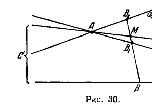

Пусть $a_1$ и $a_2$ — две прямые, проходящие через $A$ и не пересекающие $a$ (рис. 30); существование их обеспечивается аксиомой Лобачевского. Возьмем на прямой $a_2$ точку $B_2$ таким образом, чтобы она оказалась расположенной с той стороны от прямой $a_1$, с какой н е л е ж и т прямая $a$. Соединим $B_2$ с какой-нибудь точкой $B$ на прямой $a$. Отрезок $B_2B$ пересечет прямую $a_1$ в некоторой точке $B_1$. Обозначим через $M$ произвольную точку отрезка $B_1B_2$. Легко убедиться, что прямая $AM$ не пересекает прямую $a$. В самом деле, если прямая $AM$ имеет с прямой $a$ точку пересечения $C$, лежащую в направлении от $A$ к $M$, то образуется треугольник $MBC$, сторону которого $MB$ пересекает прямая $a_1$. По аксиоме Паша II,4, прямая $a_1$ тогда должна пересечь прямую $a$, что исключено. Если же $AM$ имеет с прямой $a$ точку пересечения $C'$, лежащую в направлении от $M$ к $A$, то образуется треугольник $MBC'$, сторону которого $MC'$ пересекает прямая $a_2$. Тогда по аксиоме Паша прямая $a_2$ должна пересечь прямую $a$, но это также исключено.

---
**стр. 91**
---

Таким образом, мы можем заключить, что если $a_1$ и $a_2$ проходят через $A$ и не пересекают $a$, то все прямые, которые проходят через $A$ в одной определенной паре вертикальных углов, составленных прямыми $a_1$ и $a_2$, не пересекают прямую $a$.

Аксиомой Лобачевского отрицается свойственная евклидовой геометрии единственность параллельной, по крайней мере, для некоторой определенной точки и определенной прямой. Однако легко убедиться, что если отношение, утверждаемое постулатом Лобачевского, свойственно каким-нибудь определенным точке и прямой, то оно свойственно всяким точке и прямой.

Докажем это от противного.

Пусть, вопреки нашему утверждению, через некоторую точку $B$, не лежащую на прямой $b$, проходит только одна прямая $b'$, не встречающая прямой $b$ и лежащая с ней в одной плоскости (рис. 31).

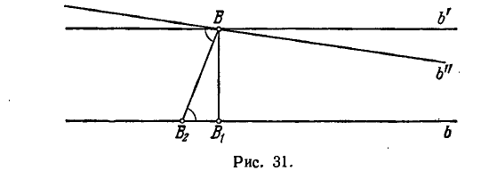

Опустим из точки $B$ перпендикуляр $BB_1$ на прямую $b$ и возьмем на $b$ еще какую-нибудь точку $B_2$, отличную от $B_1$.

Легко видеть, что прямая $BB_2$ образует с прямыми $b$ и $b'$ равные внутренние накрестлежащие углы. В самом деле, если бы это было не так, то можно было бы провести через $B$ прямую $b''$, отличную от $b'$ и такую, что прямая $BB_2$ составила бы с прямыми $b$ и $b''$ равные накрестлежащие углы. Но тогда прямая $b''$, с одной стороны, не могла бы иметь общей точки с $b$, как это следует из теоремы 44 главы II, а с другой стороны, не могла бы не встречать прямой $b$, так как единственной прямой, проходящей через $B$ и не встречающей прямую $b$, является, по нашему предположению, прямая $b'$. Аналогично и прямая $BB_1$ образует с прямыми $b$, $b'$ равные накрестлежащие углы; значит, $BB_1$ является перпендикуляром не только к прямой $b$, но и к прямой $b'$. Из этих обстоятельств тотчас следует, что треугольник $BB_1B_2$ имеет сумму внутренних углов, равную двум прямым. Тогда в силу теоремы 51 главы II сумма углов всякого треугольника равна двум прямым. Отсюда, в силу теоремы 53, вытекает V постулат Евклида и, следовательно, единственность прямой,

---
**стр. 92**
---

проходящей через произвольно данную точку и не встречающей произвольно данную прямую.
Получается противоречие с аксиомой Лобачевского, отрицающей эту единственность по отношению к прямой $a$ и точке $A$.
Таким образом, приняв аксиому Лобачевского, мы должны утверждать следующее предложение.

**Теорема I.** *Какие бы прямая и точка вне ее ни были заданы, через эту точку проходит бесчисленное множество прямых, не пересекающих данную.*

Здесь имеются в виду, конечно, прямые, лежащие в одной плоскости с данной прямой. Мы не будем больше делать подобной оговорки, полагая, что наше рассмотрение (до § 33) имеет планиметрический характер, т. е. что рассматриваются точки и прямые одной определенной плоскости.

Согласно предыдущему, как следствие аксиомы Лобачевского, мы должны:

1) для каждого четырехугольника Саккери принять гипотезу острого угла;

2) сумму углов каждого треугольника полагать меньшей двух прямых.

**§ 29.** В отличие от определения Евклида, по Лобачевскому, параллельными к данной прямой называются только некоторые особые прямые из тех, которые не имеют общих точек с данной. Мы изложим сейчас определение прямых, параллельных по Лобачевскому. Оно не так просто, как у Евклида, и требует некоторых предварительных рассмотрений.

Пусть $a$ — какая-нибудь прямая и $A$ — точка вне ее (рис. 32). Опустим из $A$ перпендикуляр $AP$ на прямую $a$. Прямая $AP$ разделяет плоскость на две части, одну из которых мы будем условно называть «правой» полуплоскостью, другую — «левой». Точно так же прямая $a$ разделяет плоскость на две части. Ту из них, в которой находится точка $A$, мы будем называть «верхней».

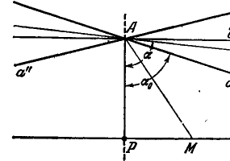

Обозначим через $\tilde{a}$ прямую, перпендикулярную к $AP$ в точке $A$. Из абсолютной геометрии известно, что прямые $a$ и $\tilde{a}$ не имеют общей точки. Вследствие постулата Лобачевского существует бесчисленное множество прямых, отличных от $\tilde{a}$ и также не пересекающих прямую $a$. Пусть будет $\alpha$ угол, который составляет правая полупрямая какой-нибудь из этих прямых с по-

---
**стр. 93**
---

лупрямой $AP$, и $\alpha_0$ — нижняя грань множества таких углов $\alpha$*).

Очевидно, имеют место неравенства

$$0 < \alpha_0 < \frac{\pi}{2}.$$

В самом деле, $\alpha_0$ больше угла $PAM$, где $M$ — любая точка прямой $a$, расположенная правее $P$; следовательно, $\alpha_0 > 0$. Так как $\tilde{a}$ — не единственная прямая, не имеющая общей точки с $a$, то $\alpha_0 < \frac{\pi}{2}$.

Проведем через $A$ прямую $a'$ так, чтобы ее правая полупрямая составила с $AP$ угол, равный $\alpha_0$.

Легко видеть, что $a'$ не пересекает прямую $a$. Действительно, если прямые $a$ и $a'$ могут пересекаться, то только в правой полуплоскости. Предположим, что $a$ и $a'$ имеют общую точку $R$.

Возьмем на прямой $a$ точку $R'$, лежащую правее $R$, и положим $\alpha' = \angle PAR'$. Но тогда $\alpha_0 < \alpha'$, и нижняя грань величин $\alpha$ будет больше $\alpha_0$, что противоречит определению числа $\alpha_0$.

Обозначим через $a''$ прямую, проходящую через точку $A$ и расположенную симметрично к $a'$ относительно $AP$.

Прямые $a'$ и $a''$ образуют две пары вертикальных углов. Всякая прямая, проходящая через $A$ в той паре вертикальных углов, в которой находится точка $P$, пересекает прямую $a$, а всякая прямая, проходящая через $A$ в другой паре вертикальных углов, прямую $a$ не встречает. Сами прямые $a'$ и $a''$, как было сейчас доказано, принадлежат к числу прямых, не встречающих прямую $a$, и являются в совокупности этих прямых граничными прямыми. Из них прямую $a'$ мы будем называть *правой граничной прямой*, $a''$ — *левой*.

Имеет место следующая важная

**Т е о р е м а II.** *Пусть даны прямые $a$ и $a'$. Если $a'$ является правой граничной прямой в совокупности прямых, проходящих через некоторую ее точку и не встречающих прямую $a$, то $a'$ является правой граничной прямой в аналогичной совокупности прямых, проходящих через всякую другую ее точку.*

**Д о к а з а т е л ь с т в о.** Обозначим буквой $A$ точку на прямой $a'$, относительно которой выполнено условие теоремы, и опустим из $A$ перпендикуляр $AP$ на прямую $a$.

Докажем сначала справедливость утверждения теоремы для точек, лежащих правее $A$. Пусть будет $\bar{A}$ — какая-нибудь из таких

---
**стр. 94**
---

точек и $\bar{A}\bar{P}$ — перпендикуляр на прямую $a$ (рис. 33а). Нам достаточно установить, что любой луч из $\bar{A}$, расположенный в правой полуплоскости относительно $\bar{A}\bar{P}$ «ниже» прямой $a'$, встречает прямую $a$. Пусть будет $\bar{a}'$ такой луч. Возьмем на $\bar{a}'$ произвольную точку $Q$ и построим луч $AQ$. Так как для точки $A$ выполнено условие теоремы и луч $AQ$ лежит в правой полуплоскости относительно $AP$ «ниже» прямой $a'$, то этот луч должен встретить прямую $a$ в некоторой точке. Обозначим ее буквой $M$. Поскольку луч $\bar{a}'$ пересекает одну из сторон треугольника $APM$, именно сторону $AM$, то согласно аксиоме

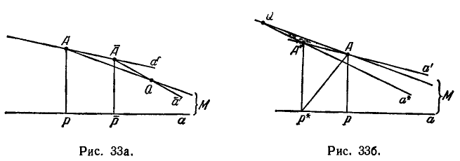

Паша II,4 он должен пересечь также одну из двух других сторон этого треугольника *). Но со стороной $AP$ луч $\bar{a}'$ не может иметь общей точки, так как $AP$ лежит в левой полуплоскости относительно $\bar{A}\bar{P}$. Следовательно, луч $\bar{a}'$ имеет общую точку со стороной $PM$ (очевидно, правее точки $P$), что и нужно было доказать.

Рассмотрим теперь произвольную точку $A^*$, лежащую на прямой $a'$ левее точки $A$ (рис. 33б). Пусть будет $A^*P^*$ перпендикуляр к прямой $a$ и $a^*$ — какой-нибудь луч из $A^*$, расположенный в правой полуплоскости относительно $A^*P^*$ ниже прямой $a'$. Нам нужно доказать, что $a^*$ имеет с прямой $a$ общую точку. Возьмем на дополнении луча $a^*$ произвольную точку $Q$ и соединим ее прямой с точкой $A$. По нашему предположению,

---
**стр. 95**
---

в совокупности прямых, проходящих через $A$ и не встречающих $a$, прямая $a'$ является граничной. Поэтому прямая $QA$ встретит прямую $a$ в некоторой точке $M$, лежащей правее $P$. Заметим теперь, что луч $a^*$ проходит внутри угла $AA^*P^*$ через его вершину, следовательно, этот луч пересекает отрезок $AP^*$ (согласно теореме 11а главы II). Но тогда, по аксиоме Паша II,4, луч $a^*$ должен пересечь либо сторону $AM$, либо сторону $P^*M$ треугольника $AP^*M$. Так как прямая $a^*$ имеет с прямой $AM$ общую точку $Q$, лежащую вне отрезка $AM$, то должно иметь место пересечение луча $a^*$ именно со стороной $P^*M$. Таким образом, луч $a^*$ и прямая $a$ пересекаются, и тем самым теорема доказана.

Аналогичное доказательство можно привести по отношению к тому случаю, когда прямая $a'$ является левой граничной прямой.

Теперь мы определим понятие параллельности в геометрии Лобачевского.

*По Лобачевскому, прямая $a'$ называется параллельной к прямой $a$, если в совокупности прямых, проходящих через некоторую точку прямой $a'$ и не встречающих прямой $a$, прямая $a'$ является граничной.*

Из теоремы II следует, что если некоторая точка прямой $a'$ обладает свойством, указанным в данном сейчас определении, то этим свойством обладает всякая точка прямой $a'$.

Отметим одно из двух направлений прямой $a$ (на рис. 34 направление указывается стрелкой) и из некоторой точки $A$ прямой $a'$ опустим на прямую $a$ перпендикуляр $AP$. Отрезок $AP$ составляет с прямой $a'$ два смежных угла, из которых один будет острым, другой — тупым. Если острый угол окажется с той стороны прямой $AP$, в которую направлена нами прямая $a$, то мы будем говорить, что $a'$ параллельна прямой $a$ в отмеченном направлении (на чертежах направление параллельности мы будем отмечать стрелками на обеих прямых).

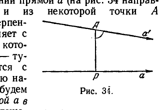

Употребляя введенное нами условное обозначение сторон плоскости относительно прямой $AP$ («правая» и «левая»), можно описать направление параллельности иным способом: в совокупности прямых, проходящих через $A$ и не пересекающих прямую $a$, прямая $a'$ может быть правой или левой граничной прямой; в первом случае мы говорим, что прямая $a'$ параллельна прямой $a$ вправо, во втором случае, что $a'$ параллельна $a$ влево.

Таким образом, через каждую точку плоскости проходят две прямые, параллельные данной прямой. Они параллельны ей в двух различных направлениях (см. рис. 35; прямые, параллельные

---
**стр. 96**
---

прямой $a$ вправо, обозначены буквами $a'_1, a'_2, \dots$). В частности, имеет место следующая

**Т е о р е м а III.** *Через каждую точку плоскости проходит в точности одна прямая, параллельная данной прямой в определенном направлении.*

**§ 30.** На основании высказанного выше определения параллельности мы не можем еще говорить о двух параллельных друг другу прямых. Впоследствии мы установим взаимность отношения параллельности, т. е. что если одна из двух данных прямых параллельна другой, то вторая параллельна первой. Сначала нам придется доказать некоторые вспомогательные предложения.

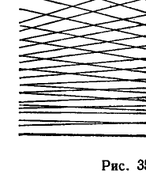

**Л е м м а I.** *Пусть $a$ и $b$ — две произвольные прямые, $O$ — точка на прямой $b$, $OA$ — перпендикуляр, опущенный из $O$ на прямую $a$; пусть, кроме того, $OA$ составляет с прямой $b$ неравные смежные углы. Тогда, если $x$ обозначает расстояние от точки $O$ до точки, взятой на прямой $b$ со стороны тупого угла, а $y = f(x)$ — длину перпендикуляра, опущенного из этой точки на прямую $a$, то $f(x)$ является непрерывной монотонной и безгранично возрастающей функцией.*

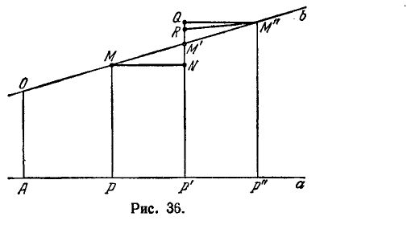

**Д о к а з а т е л ь с т в о.** Возьмем на прямой $b$ две точки $M$ и $M'$ так, чтобы точка $M$ находилась между $O$ и $M'$ (рис. 36). Опустим перпендикуляры $OA, MP$ и $M'P'$ на прямую $a$ и положим:

$$OM = x,\ OM' = x',$$

$$MP = y,\ M'P' = y';$$

при этом $x' > x$.

---
**стр. 97**
---

Заметим, что в силу аксиомы Лобачевского сумма внутренних углов четырехугольника $OMPA$ меньше четырех прямых; отсюда и из того, что внутренние углы при вершинах $A$ и $P$ прямые, следует, что $\angle PMM'$ больше $\angle AOM$. Следовательно, $\angle PMM'$ — тупой.

Отложим на прямой $P'M'$ от точки $P'$ отрезок $P'N = PM$. Соединив точки $M$ и $N$, мы получим четырехугольник Саккери $PMNP'$; $\angle PMN$ как угол при верхнем основании этого четырехугольника — острый. Так как $\angle PMM'$ тупой, а $\angle PMN$ острый, то точка $N$ находится между точками $P'$ и $M'$, т. е. $P'M' > PM$. Таким образом, при $x' > x$ также $y' > y$. Монотонное возрастание функции $f(x)$ этим доказано.

Положим теперь $\Delta x = x' - x$ и $\Delta y = y' - y$ ($\Delta x > 0, \Delta y > 0$). Очевидно, $\Delta x = MM'$, $\Delta y = NM'$. Из неравенства

$$NM' < NM + MM'$$

и приняв во внимание, что $NM$ короче $MM'$, так как в треугольнике $NMM'$ сторона $NM$ лежит против острого угла, а сторона $MM'$ — против тупого, найдем:

$$NM' < 2MM'$$

или $\Delta y < 2\Delta x$.

Рассмотрев аналогичным образом случай, когда точка $M'$ лежит между $O$ и $M$, установим неравенство

$$|\Delta y| < 2 |\Delta x|,$$

справедливое при всех возможных положениях точек $M$ и $M'$. Отсюда следует, что $\Delta y \to 0$, когда $\Delta x \to 0$, т. е. $f(x)$ действительно является непрерывной функцией.

Остается доказать, что при безграничном возрастании $x$ функция $f(x)$ также возрастает безгранично. Для этого возьмем на прямой $b$ точку $M''$ так, чтобы было $MM' = M'M''$, и опустим на прямую $a$ перпендикуляр $M''P''$. Пусть точке $M''$ соответствует $x'' = OM''$ и $y'' = f(x'') = M''P''$. Введем обозначения: $h_1 = y' - y$ и $h_2 = y'' - y'$; тогда $MP = y, M'P' = y + h_1, M''P'' = y + h_1 + h_2$. Отложим на прямой $P'M'$ от точки $P'$ в сторону $M'$ отрезки $P'N = PM, P'Q = P''M''$ и от точки $M'$ отрезок $M'R = M'N$. Очевидно, $NM' = h_1, M'R = h_1$, и $M'Q = h_2$. Теперь заметим, что треугольники $M'NM$ и $M'RM''$ равны друг другу, так как имеют равные углы, заключенные между равными сторонами. В силу этого $\angle M'RM'' = \angle M'NM$. Но $\angle M'NM$ является смежным к острому $\angle MNP'$ в четырехугольнике Саккери. Таким образом, этот угол, а следовательно, и равный ему $\angle M'RM''$ — тупой. Угол $M'QM''$ как угол при верхнем основании четырехугольника Саккери $P'QM''P''$ — острый. Из сравнения $\angle M'QM''$ и $\angle M'RM''$

*) То есть $\alpha_0$ не больше каждого из углов указанного множества ($\alpha_0 \le \alpha$), но если $\alpha_0$ увеличить на сколь угодно малое положительное $\varepsilon$, то $\alpha_0 + \varepsilon$ превзойдет некоторый угол из этого множества.

*) Аксиома Паша II,4 относится к треугольнику и прямой. По отношению к полупрямой (лучу) аксиома Паша применима, если начало полупрямой находится вне треугольника, и неприменима, если начало находится внутри треугольника.

Применяя аксиому Паша к треугольнику и полупрямой, мы должны были бы предварительно оговорить, что начало полупрямой расположено вне треугольника. Мы не будем, однако, каждый раз делать такой оговорки, пропуская, таким образом, в этом случае и в ряде других случаев детали рассуждений, если они достаточно очевидны. Слишком скрупулезное изложение затруднило бы чтение книги мелочами, не являющимися интересными или важными по существу.

---
**стр. 98**
---

следует, что точка $R$ лежит между точками $M'$ и $Q$, т. е. $M'Q > M'R$, или $h_2 > h_1$.

Отсюда имеем: $MP = y$, $M'P' = y + h_1$, $M''P'' > y + 2h_1$. Таким образом, если мы положим $MM' = M'M'' = s$ и возьмем последовательность $x_1 = x$, $x_2 = x + s$, $x_3 = x + 2s, \dots$, то получим соответственно $f(x_1) = y$, $f(x_2) = y + h_1$, $f(x_3) > y + 2h_1$, $f(x_4) > y + 3h_1$ и т. д. Из этих соотношений непосредственно усматриваем, что при неограниченном возрастании $x$ функция $f(x)$ возрастает безгранично. Лемма доказана.

Заметим, что лемма I принадлежит абсолютной геометрии, хотя рассуждения, которые мы проводили, существенно опирались на свойства четырехугольника Саккери в системе Лобачевского. В евклидовой теории параллельных доказательство этой леммы проводится без малейшего труда. При этом соотношения, полученные нами в конце доказательства, заменяются соответственно равенствами $MP = y$, $M'P' = y + h_1$, $M''P'' = y + 2h_1, \dots$, выражающими линейный характер функции $y = f(x)$.

Важным частным случаем леммы I является следующее предложение.

Л е м м а II. *Если $x$ обозначает расстояние от вершины угла до точки, лежащей на стороне этого угла, а $y = f(x)$ — длину перпендикуляра, опущенного из этой точки на другую сторону, то $f(x)$ является непрерывной, монотонной и безгранично возрастающей функцией.*

Леммы I и II найдут себе применение несколько раз. В первую очередь мы используем лемму II, чтобы доказать взаимность отношения параллельности.

Т е о р е м а IV. *Если одна из двух прямых параллельна другой в некотором направлении, то вторая параллельна первой в том же направлении.*

*Д о к а з а т е л ь с т в о.* Пусть прямая $a$ параллельна прямой $b$ в некотором направлении. Нам нужно доказать, что прямая $b$ параллельна прямой $a$ в том же направлении.

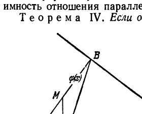

Прежде всего установим, что существует точка, равноудаленная от прямых $a$ и $b$. Это обстоятельство, наглядно совершенно очевидное, непосредственно вытекает из леммы I. В самом деле, обозначим через $P$ какую-нибудь точку прямой $a$ и через $PB$ — перпендикуляр, опущенный из $P$ на прямую $b$ (рис. 37). Возьмем на отрезке $PB$ произволь-

---
**стр. 99**
---

ную точку $M$ и опустим из нее перпендикуляр $MA$ на прямую $a$. Положим $PB = s$, $PM = x$; тогда $MA = f(x)$ есть расстояние от точки $M$ до прямой $a$, а расстояние от $M$ до прямой $b$ равно $MB = PB - PM = s - x$. Обозначим $\varphi(x) = s - x$. Как мы знаем из леммы I, функция $f(x)$ есть непрерывная монотонно возрастающая функция; очевидно также, что $\varphi(x)$ есть непрерывная монотонно убывающая функция. Поскольку $f(0) < \varphi(0)$ и $f(s) > \varphi(s)$, существует единственное значение $x$ ($0 < x < s$), для которого $f(x) = \varphi(x)$. Этому значению $x$ соответствует точка $M$, для которой $MA = MB$.

Так как отрезок $AB$ наклонен к прямым $a$ и $b$ под равными углами, то его будем называть *секущей равного наклона* прямых $a$ и $b$.

После того как мы доказали существование секущей равного наклона, нам было бы нетрудно установить взаимность отношения параллельности. Однако приведем его строгое доказательство.

Пусть прямая $a$ параллельна прямой $b$. Нам нужно доказать, что $b$ параллельна $a$. Согласно определению, нам достаточно доказать, что $b$ есть граничная среди прямых, проходящих через $B$ и не пересекающих $a$. Обозначим через $\bar{b}$ луч прямой $b$, идущий от $B$ в направлении параллельности (рис. 38). Рассмотрим луч $\bar{b}'$, начинающийся в $B$ и отклоненный от $\bar{b}$ в сторону $a$ на произвольно малый угол $\alpha$. Нам нужно доказать, что $\bar{b}'$ пересекает $a$. Проведем через $A$ луч $\bar{a}'$, отклоненный от $a$ в сторону $b$ на тот же угол $\alpha$. Так как $a$ параллельна $b$, луч $\bar{a}'$ пересекает $b$ в некоторой точке $B_1$. На $a$ отложим отрезок $AA_1 = BB_1$. Поскольку $AB$ — секущая равного наклона, имеем $\triangle BB_1A = \triangle AA_1B$. Следовательно, луч, начинающийся в $B$ и проходящий через $A_1$, образует с $b$ угол $\alpha$ и, значит, совпадает с $\bar{b}'$. Так как $A_1$ лежит на $a$, то $\bar{b}'$ пересекает $a$. Этот луч, по построению, пересекает прямую $a$. Итак,

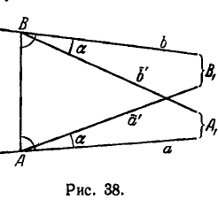

---
**стр. 100**
---

луч, проходящий через $B$ и отклоненный от луча $\bar{b}$ в сторону прямой $a$ на произвольно малый угол, встречает эту прямую. Следовательно, прямая $b$ параллельна прямой $a$. Тем самым теорема доказана.

Пусть прямые $a$ и $c$ параллельны между собой. Обозначим через $\Pi_{ac}$ полуплоскость, содержащую прямую $c$, а через $\Pi_{ca}$ — полуплоскость, содержащую прямую $a$. Общая часть полуплоскостей $\Pi_{ac}$ и $\Pi_{ca}$ будет называться *внутренней зоной* плоскости относительно прямых $a$ и $c$. Пусть $b$ — третья прямая, параллельная им в том же направлении. Ясно, что $b$ не может пересекать $a$ (и тем самым $c$), ибо в противном случае она пересекла бы и $c$ (теорема III).

Л е м м а III. *Если при указанных выше условиях прямая $b$ расположена во внутренней зоне плоскости относительно прямых $a$ и $c$, то она пересекает каждый отрезок, соединяющий какую-нибудь точку прямой $a$ с какой-нибудь точкой прямой $c$.*

*Д о к а з а т е л ь с т в о.* Будем предполагать, что $b$ параллельна $c$. Возьмем на прямой $a$ произвольную точку $A$, на прямой $c$ — произвольную точку $C$ и соединим их отрезком $AC$ (рис. 39). Обозначим через $\bar{c}$ луч прямой $c$, идущий от $C$ в направлении параллельности, а через $\bar{c}'$ — луч, лежащий внутри угла, образованного лучами $CA$ и $\bar{c}$. Этот луч, как легко усматривается, пересекает прямую $a$ в некоторой точке $P$. Так как $b$ расположена во внутренней зоне относительно $a$ и $c$, то луч $\bar{c}'$ пересекает и прямую $b$. Отсюда и по

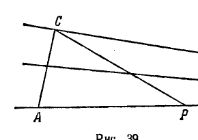

---
**стр. 101**
---

аксиоме Паша заключаем, что прямая $b$ пересечет или отрезок $AC$, или продолжение отрезка $AP$ за точку $P$. Но в последнем случае $b$ пересекает и $AC$. Таким образом, $b$ пересекает $AC$. Лемма доказана.

Следующая теорема устанавливает транзитивность отношения параллельности.

Т е о р е м а V. *Две прямые, параллельные третьей в одном и том же направлении, параллельны между собой в том же самом направлении.*

*Д о к а з а т е л ь с т в о.* Пусть прямые $a$ и $b$ параллельны прямой $c$ в одном и том же направлении. Так как $a$ и $b$ не могут пересекаться, нам остается доказать, что они параллельны между собой. Рассмотрим два случая взаимного расположения прямых $a$ и $b$ относительно $c$:

1. Прямые $a$ и $b$ находятся с одной стороны от прямой $c$.
2. Прямые $a$ и $b$ находятся по разные стороны от прямой $c$.

Рассмотрим первый случай (рис. 40). Возьмем на прямой $a$ произвольную точку $A$ и обозначим через $\bar{a}$ луч прямой $a$, идущий от $A$ в направлении параллельности. Допустим, что $\bar{a}$ не является единственным граничным лучом в совокупности лучей, проходящих через $A$ и не пересекающих $b$, т. е. существует другой граничный луч $\bar{a}'$. Проведем через произвольную точку $A$ прямой $a$ луч $\bar{a}'$

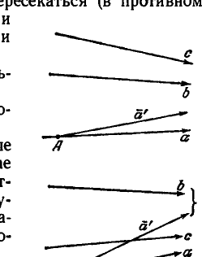
