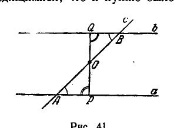
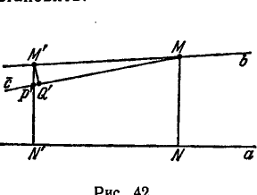
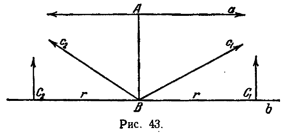
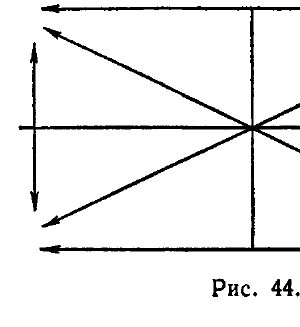
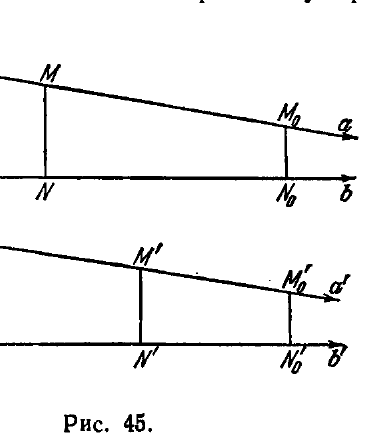

## 2. Особенности расположения параллельных и расходящихся прямых

---
**стр. 102**
---

так, чтобы он был к прямым $b$ и $c$ ближе прямой $a$ и проходил в сторону параллельности от перпендикуляров из точки $A$ к прямым $b$ и $c$. Так как прямые $a$ и $c$ параллельны, то луч $\bar{a}'$ пересечет прямую $c$, а вследствие параллельности прямых $c$ и $b$ этот луч пересечет и прямую $b$. Таким образом, в совокупности лучей, проходящих через $A$ и не пересекающих прямую $b$, луч $\bar{a}$ является граничным; следовательно, прямые $a$ и $b$ параллельны между собой (в том же направлении, в каком они параллельны прямой $c$). Теорема доказана.

Установленные в этом параграфе предложения показывают, что хотя определение параллельности в геометрии Лобачевского довольно сложно, но совокупность прямых, параллельных данной прямой в определенном направлении, обладает теми же основными свойствами, что и совокупность параллельных прямых в евклидовой геометрии.

**2. Особенности расположения параллельных и расходящихся прямых**

**§ 31.** Если две прямые не пересекаются и не параллельны друг другу, они называются *расходящимися* *). Через каждую точку плоскости проходят две прямые, параллельные какой-нибудь данной прямой, и бесконечно много расходящихся с нею (теорема I).

Мы рассмотрим некоторые свойства взаимного расположения параллельных и расходящихся прямых. Результаты, которые мы при этом получим, позволят нам вполне наглядно представить себе различие между параллельными и расходящимися прямыми.

Отметим прежде всего следующие две теоремы.

*Теорема VI. Две прямые, перпендикулярные к третьей, являются расходящимися.*

Доказательство усматривается непосредственно. В самом деле, то, что две прямые $a$ и $b$, перпендикулярные в точках $A$ и $B$ к третьей прямой $c$, не имеют общей точки, известно нам как предложение абсолютной геометрии. Но эти прямые и не параллельны, так как через точку $A$ проходит бесконечно много прямых, не пересекающих прямой $b$, и среди них прямая $a$ не является граничной, а следовательно, не параллельна прямой $b$. Теорема VI в неявной форме уже была установлена в § 29.

*Теорема VII. Две прямые, которые при пересечении с третьей образуют равные накрестлежащие или соответственные углы, являются расходящимися.*

*) Термин «расходящиеся прямые» оправдан особенностями взаимного расположения этих прямых: см. ниже теорему VIII.

---
**стр. 103**
---

*Д о к а з а т е л ь с т в о.* Эта теорема является обобщением предыдущей и вместе с тем легко к ней приводится. Обозначим буквами $a$ и $b$ две данные прямые и буквой $c$ третью прямую, их секущую (рис. 41). Пусть $A$ и $B$ будут точки, в которых прямая $c$ пересекает прямые $a$ и $b$, $O$ — середина отрезка $AB$. Опустим из точки $O$ перпендикуляры $OP$ и $OQ$ на прямые $a$ и $b$.

В прямоугольных треугольниках $OAP$ и $OBQ$ имеем: $OA = OB$ вследствие выбора точки $O$, $\angle OAP = \angle OBQ$ по условию теоремы. Отсюда следует, что треугольник $OAP$ равен треугольнику $OBQ$. В частности, $\angle BOQ = \angle AOP$ и, следовательно, отрезки $OP$ и $OQ$ лежат на одной прямой $PQ$, к которой прямые $a$ и $b$ перпендикулярны. По теореме VI эти прямые являются расходящимися, что и нужно было установить.

Теперь мы докажем, что любые две расходящиеся прямые имеют точно один общий перпендикуляр. Следовательно, *наличие общего, и притом только одного, перпендикуляра является характеристической особенностью расходящихся прямых*.

Прежде всего ясно, что в геометрии Лобачевского две прямые не могут иметь двух общих перпендикуляров <!-- вероятная опечатка оригинала: после «перпендикуляров» пропущена точка --> В самом деле, если $AB$ и $CD$ перпендикулярны к прямым $AC$ и $BD$, то четырехугольник $ABCD$ имеет сумму углов, равную четырем прямым, что невозможно, так как каждый из треугольников $ABC$ и $BCD$ имеет сумму углов, меньшую двух прямых. Таким образом, единственность общего перпендикуляра к двум прямым устанавливается сразу.

Доказательство существования общего перпендикуляра к двум расходящимся прямым не так просто.

Рассмотрим какие-нибудь две расходящиеся прямые $a$ и $b$ (рис. 42). Пусть будет $MN$ перпендикуляр, опущенный из произвольной точки $M$ прямой $b$ на прямую $a$. <!-- вероятная опечатка оригинала: после «на прямую $a$» пропущена точка --> Если $MN$ перпендикулярен и к $b$, то нечего доказывать. Предположим, что $MN$ не перпендикулярен к $b$, и отметим на прямой $b$ положительное направление так, чтобы оно составляло с перпендикуляром $MN$ тупой угол. Тогда, согласно лемме I, длина $MN$ при перемещении

---
**стр. 104**
---

точки $M$ в положительном направлении монотонно и неограниченно возрастает.

Мы докажем, что, начиная с некоторого момента, длина $MN$ неограниченно возрастает также и при перемещении точки $M$ в отрицательном направлении.

Прямая $MN$ разбивает плоскость на две полуплоскости; ту из них, в которую направлена положительная полупрямая прямой $b$, условимся называть положительной, другую — отрицательной.

Проведем через точку $M$ в отрицательной полуплоскости луч $c$, параллельный прямой $a$.

Так как $a$ и $b$ являются расходящимися прямыми, то луч $c$ расположен ближе к прямой $a$, чем отрицательная полупрямая прямой $b$. Поэтому, если мы возьмем на прямой $b$ в отрицательной полуплоскости какую-нибудь точку $M'$ и опустим перпендикуляр $M'N'$ на прямую $a$, то этот перпендикуляр встретит луч $c$ в точке $P'$, лежащей на отрезке $M'N'$. Таким образом, $M'N' > M'P'$. Опустим теперь перпендикуляр $M'Q'$ на луч $c$; очевидно, $M'P' > M'Q'$ и, следовательно, $M'N' > M'Q'$. Но согласно лемме II расстояние от переменной точки на одной стороне угла до другой стороны неограниченно возрастает при удалении этой точки от вершины; в силу этого при удалении точки $M'$ в отрицательном направлении $M'Q'$ монотонно и неограниченно возрастает. Так как $M'N' > M'Q'$, то $M'N'$ также будет в конце концов неограниченно возрастать.

Введем на прямой $b$ линейную координатную систему, выбрав произвольно начало координат и предполагая, что возрастание координаты происходит, например, в положительном направлении. Обозначим через $x$ координату переменной точки $M$ и через $y = f(x)$ длину перпендикуляра $MN$ к прямой $a$. По предыдущему, $f(x)$ является всюду положительной непрерывной функцией, значение которой неограниченно возрастает, когда $x$ стремится к положительной или отрицательной бесконечности. Отсюда следует, во-первых, что $f(x)$ имеет положительный минимум $f(x_0)$ и, во-вторых, что каждое значение, большее $f(x_0)$, функция $f(x)$ принимает, по крайней мере, при двух различных значениях аргумента. Пусть будут $x_1$ и $x_2$ ($x_1 \neq x_2$) такие два значения $x$, что $f(x_1) = f(x_2)$. Обозначим через $M_1$ и $M_2$ точки с координатами $x_1$ и $x_2$ и через $M_1N_1$ и $M_2N_2$ — опущенные из них на прямую $a$ перпендикуляры. В силу выбора точек $M_1$ и $M_2$ четырехугольник $N_1M_1M_2N_2$ является четырехугольником Саккери и, значит, симметричен относительно перпендикуляра к середине нижнего основания. Отсюда следует, что перпендикуляр $M_0N_0$, опущенный из середины

---
**стр. 105**
---

отрезка $M_1M_2$ на прямую $a$, есть общий перпендикуляр прямых $a$ и $b$. Тем самым существование общего перпендикуляра доказано.

Если мы возьмем теперь на прямой $b$ произвольную точку $\overline{M}$ и опустим из нее перпендикуляр $\overline{M}\overline{N}$ на прямую $a$, то в четырехугольнике $N_0M_0\overline{M}\overline{N}$ углы при вершинах $N_0$, $M_0$ и $\overline{N}$ будут прямыми, а следовательно, внешний угол при вершине $\overline{M}$ — тупой. Отсюда в силу леммы I следует, что в ту сторону от точки $\overline{M}$, с которой не находится точка $M_0$, значения функции $f(x)$ возрастают. Таким образом, $M_0$ — единственная точка, в которой $f(x)$ достигает своего минимума.

Все изложенное позволяет сформулировать следующую теорему.

*Теорема VIII.* *Всякие две расходящиеся прямые имеют точно один общий перпендикуляр, по обе стороны от которого они неограниченно удаляются друг от друга.*

Заметим, между прочим, что проекции всех точек одной из двух расходящихся прямых на другую заполняют на второй прямой лишь конечный отрезок. В самом деле, пусть будут $a$ и $b$ две расходящиеся прямые и $AB$ — их общий перпендикуляр (рис. 43). Проведем из точки $B$ прямые $c_1$ и $c_2$, параллельные прямой $a$, и представим себе, что во всех точках прямой $b$ восстановлены к ней перпендикуляры. Если бы все эти перпендикуляры встречали прямые $c_1$ и $c_2$, то необходимо было бы принять V постулат Евклида (см. предложение IV § 8 или теорему 54 § 27).

Таким образом, из постулата Лобачевского следует, что перпендикуляры, восстановленные в точках прямой $b$, достаточно удаленных от точки $B$, не встречают прямых $c_1$ и $c_2$. Пусть будет $r$ нижняя грань расстояний от этих перпендикуляров до точки $B$. Построим на прямой $b$ две точки $C_1$ и $C_2$ так, чтобы $C_1B = BC_2 = r$; тогда, очевидно, проекции всех точек прямой $a$ заполнят внутреннюю часть отрезка $C_1C_2$.

Перпендикуляры в точках $C_1$ и $C_2$ параллельны как прямой $a$, так и прямым $c_1$ и $c_2$ (на доказательстве мы здесь не останавлива-

---
**стр. 106**
---

емся; оно по существу проведено ниже, в § 33). Если построить прямую, симметричную прямой $a$ относительно $b$, то получится фигура, схематически изображенная на рис. 44.

Эта фигура представляет собой своеобразный «четырехугольник», стороны и диагонали которого параллельны между собой в направлениях, указанных стрелками. Естественно, что такая фигура аналога себе в евклидовой геометрии не имеет.

**§ 32.** Изучим теперь взаимное расположение параллельных прямых. Пусть две прямые $a$ и $b$, изображенные на рис. 45, параллельны между собою в некотором направлении. Обозначим буквой $M$ переменную точку на прямой $a$ и построим перпендикуляр $MN$ к прямой $b$. Со стороны параллельности этот перпендикуляр образует с прямой $a$ острый угол. В силу леммы I отсюда следует, что длина $MN$ монотонно и неограниченно возрастает при перемещении точки $M$ в направлении, противоположном направлению параллельности, и монотонно убывает в направлении параллельности.

Мы покажем сейчас, что в последнем случае длина $MN$ стремится к нулю. Выбрав на прямой $a$ какую-нибудь точку $A$, опустим перпендикуляр $AB$ на прямую $b$. Пусть дано положительное число $\varepsilon$; нужно показать, что для некоторого положения точки $M$ будет $MN < \varepsilon$. Если $AB > \varepsilon$, мы возьмем в плоскости какую-нибудь прямую $b'$ и в произвольной ее точке $N'_0$ восстановим перпендикуляр $N'_0M'_0$, длину которого возьмем меньшей $\varepsilon$. Через точку $M'_0$ проведем прямую $a'$ параллельно $b'$. Представим себе теперь, что переменная точка $M'$ перемещается по прямой $a'$ в направлении, противоположном направлению параллельности. При этом длина перпендикуляра $M'N'$ к прямой $b'$, непрерывно изменяясь, будет неограниченно возрастать. По-
