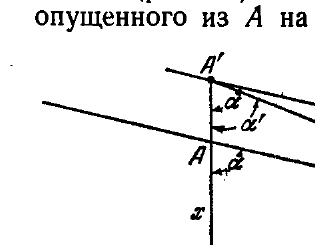
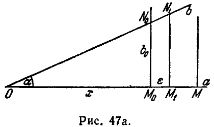
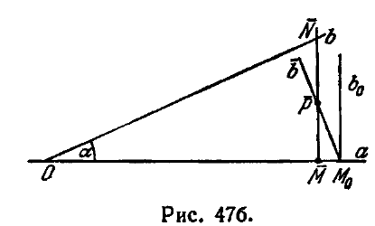

## 3. Функция Лобачевского П(х)

---
**стр. 107**
---

этому найдется такое положение точки $M'$, что длина $M'N'$ окажется равной $AB$. Обозначим точки $M'$ и $N'$ в этот момент буквами $A'$ и $B'$. Перемещая фигуру, составленную прямыми $a'$ и $b'$, расположим ее так, чтобы прямая $b'$ совместилась с $b$, точка $B'$ с точкой $B$ и направление параллельности прямых $a'$ и $b'$ совпало с направлением параллельности прямых $a$ и $b$ *).

Так как $A'B' = AB$, то точка $A'$ при этом совместится с точкой $A$, а так как через взятую точку проходит только одна прямая, параллельная данной прямой в определенном направлении, то прямая $a'$ совместится с прямой $a$. Пусть точка $M'_0$ прямой $a'$ займет на прямой $a$ положение $M_0$; соответствующее положение точки $N'_0$ обозначим буквой $N_0$. Длина перпендикуляра $M_0N_0$ оказывается, таким образом, меньше наперед данного положительного числа $\varepsilon$, т. е. прямые $a$ и $b$ в направлении параллельности неограниченно сближаются.

Сопоставляя все изложенное, можем сформулировать следующую теорему.

*Теорема IX.* *Расстояние от переменной точки одной из двух параллельных прямых до другой прямой стремится к нулю, когда точка перемещается в сторону параллельности, и неограниченно возрастает при перемещении точки в противоположном направлении.*

Резюмируем кратко результаты исследования: две расходящиеся прямые всегда имеют точно один общий перпендикуляр, по обе стороны от которого они друг от друга неограниченно удаляются («расходятся»); параллельные прямые, неограниченно удаляясь друг от друга в одном направлении, асимптотически сближаются в другом.

**3. Функция Лобачевского $\Pi(x)$**

**§ 33.** Рассмотрим какую-нибудь прямую $a$ и точку $A$, лежащую вне этой прямой. Через точку $A$ проходят две прямые, параллельные прямой $a$ в двух различных направлениях. Обозначим их через $u_1$ и $u_2$. Прямые $u_1$ и $u_2$ образуют равные углы с перпендикуляром $AP$, опущенным из точки $A$ на прямую $a$. Острый угол, который составляет любая из прямых $u_1$ или $u_2$ с перпендикуляром $AP$, называется *углом параллельности при точке $A$ по отношению к прямой $a$*.

*) Когда мы говорим о перемещении фигуры, то имеем в виду построение фигуры, конгруэнтной данной. В этом смысле понятие движения является вполне определенным (см. § 19).

---
**стр. 108**
---

*Мы докажем сейчас, что угол параллельности вполне определяется расстоянием от точки $A$ до прямой $a$.*

Пусть $A$ и $A'$ — две точки, находящиеся на одинаковых расстояниях соответственно от прямых $a$ и $a'$. Проведем через точку $A$ прямую $u$, параллельную $a$, и через $A'$ — прямую $u'$, параллельную $a'$. Обозначим, далее, через $AP$ и $A'P'$ перпендикуляры, опущенные на прямые $a$ и $a'$, а через $\alpha$ и $\alpha'$ — углы параллельности при точках $A$ и $A'$ по отношению к прямым $a$ и $a'$. Нам нужно установить равенство $\alpha = \alpha'$. Допустим, что, напротив, один из этих углов меньше другого, например $\alpha < \alpha'$. Проведем через точку $A'$ прямую, которая с отрезком $A'P'$ со стороны параллельности прямых $u'$ и $a'$ составляет угол $\alpha$. Вследствие параллельности прямых $u'$ и $a'$ проведенная прямая должна пересечь прямую $a'$ в некоторой точке $Q'$ (расположенной в направлении параллельности от точки $P'$). Отложим на прямой $a$ от точки $P$ в сторону параллельности отрезок $PQ$, равный отрезку $P'Q'$. Треугольник $PAQ$, очевидно, равен треугольнику $P'A'Q'$ (стороны $AP$ и $A'P'$ равны по условию, стороны $PQ$ и $P'Q'$ — по построению, а углы, заключенные между этими сторонами, — прямые), поэтому $\angle PAQ$ равен $\alpha$. Следовательно, прямая $u$ совпадает с прямой $AQ$. Но в этом случае прямая $u$ должна пересечь прямую $a$ в точке $Q$, что невозможно, так как эти прямые параллельны. Полученное противоречие доказывает наше утверждение.

Пусть будет $A$ какая-нибудь точка, находящаяся вне прямой $a_0$, и $\alpha$ — угол параллельности при точке $A$ по отношению к прямой $a_0$ (рис. 46). Обозначим через $x$ длину перпендикуляра $AA_0$, опущенного из $A$ на прямую $a_0$. По предыдущему, угол $\alpha$ полностью определяется величиной $x$; вводя обозначение Лобачевского, положим

$$\alpha = \Pi(x).$$

Функция $\Pi(x)$ в неевклидовой геометрии играет фундаментальную роль. Мы изучим сейчас простейшие ее свойства.

Прежде всего покажем, что $\Pi(x)$ *является монотонно убывающей функцией.* Для этого возьмем на прямой $AA_0$ какую-нибудь точку $A'$ и обозначим длину $A'A_0$ через $x'$. Предположим, что $x' > x$; нужно доказать, что $\Pi(x') < \Pi(x)$. Проведем через $A$ прямую $a$, параллельную $a_0$, и через $A'$ прямую $\bar{a}$ так, чтобы она со стороны параллельности прямых $a$ и $a_0$ составила с

---
**стр. 109**
---

отрезком $A'A_0$ угол $\alpha = \Pi(x)$. Две прямые $\bar{a}$ и $a$ при пересечении с прямой $AA'$ образуют равные соответственные углы и потому в силу теоремы VII являются расходящимися. Отсюда следует, что прямая $a'$, проходящая через $A'$ и параллельная прямой $a$ в том же направлении, в каком $a$ параллельна прямой $a_0$, со стороны параллельности расположена ближе к $a$, чем $\bar{a}$.

Таким образом, если $\alpha' = \Pi(x')$, то $\alpha' < \alpha$, т. е. при $x' > x$ будет $\Pi(x') < \Pi(x)$.

*Заметим дальше, что $\Pi(x)$ принимает все значения, заключенные между $0$ и $\frac{\pi}{2}$.* Чтобы установить это, возьмем произвольный острый угол $\alpha$ и докажем, что он является углом параллельности для некоторого отрезка $x$. Обозначим через $O$ вершину угла, через $a$ и $b$ — его стороны. Из постулата Лобачевского следует, что перпендикуляры с прямой $a$, достаточно удаленные от точки $O$, не встречают прямую $b$ (см. теорему 54 главы II или предложение IV § 8).

Пусть будет $M$ произвольная точка, которая служит основанием перпендикуляра к прямой $a$, не встречающего наклонную $b$. Обозначим через $M_0$ такую точку прямой $a$, что $OM_0 = x$

является нижней гранью расстояний $OM$; обозначим также через $b_0$ перпендикуляр к $a$ в точке $M_0$. Мы покажем, что $b_0$ и $b$ параллельны. Для этого нужно прежде всего установить, что $b_0$ и $b$ не встречаются.

Допустим противное, пусть $b_0$ и $b$ имеют общую точку $N_0$ (рис. 47а); тогда возьмем на прямой $b$ точку $N_1$ так, чтобы $N_0$ находилась между $O$ и $N_1$, и опустим перпендикуляр $N_1M_1$ на прямую $a$; положим $M_0M_1 = \varepsilon$. Тогда, если $M$ — основание какого-нибудь перпендикуляра к прямой $a$, не встречающего прямую $b$, то $OM > x + \varepsilon$, что, однако, противоречит определению $x$ как нижней грани длин $OM$.

Теперь докажем, что $b_0$ является граничной прямой в совокупности прямых, проходящих через $M_0$ и не встречающих прямую $b$.

---
**стр. 110**
---

Пусть будет $\bar{b}$ произвольный луч, проходящий через точку $M_0$ с той стороны от прямой $b_0$, с какой лежит точка $O$, и с той стороны от прямой $a$, с какой расположен острый угол $\alpha$ (рис. 47б). Возьмем на $\bar{b}$ какую-нибудь точку $\bar{P}$ так, чтобы она находилась внутри угла $\alpha$, и опустим перпендикуляр $\overline{PM}$ на прямую $a$. Очевидно, точка $\bar{M}$ расположится между точками $O$ и $M_0$ и, следовательно, перпендикуляр $\overline{PM}$ будет иметь с прямой $b$ общую точку $\bar{N}$. Так как луч $\bar{b}$ пересекает одну из сторон треугольника $O\bar{M}\bar{N}$, именно сторону $\bar{M}\bar{N}$, то, по аксиоме Паша, он должен пересечь одну из двух других сторон этого треугольника; но со стороной $O\bar{M}$ луч $\bar{b}$ не может иметь общей точки. Следовательно, $\bar{b}$ имеет общую точку с прямой $b$. Тем самым параллельность прямых $b$ и $b_0$ доказана. Вместе с тем доказано и наше утверждение. В самом деле, для наперед указанного острого угла $\alpha$ оказалось возможным построить такой отрезок $x = OM_0$, что $\alpha = \Pi(x)$, т. е. действительно $\Pi(x)$ принимает все значения, лежащие между $0$ и $\frac{\pi}{2}$.

Отсюда уже вытекает непрерывность $\Pi(x)$, так как монотонная функция, которая вместе с любыми двумя значениями принимает все промежуточные, является непрерывной во всей области своего определения.

Сопоставив все изложенное, имеем теорему.

**Т е о р е м а X.** *Функция $\Pi(x)$ определена для каждого положительного $x$, монотонно убывает и непрерывна; $\Pi(x) \to \frac{\pi}{2}$ при $x \to 0$ и $\Pi(x) \to 0$ при $x \to \infty$.*

Из того, что $\Pi(x) \to \frac{\pi}{2}$ при $x \to 0$, следует, что в малых частях пространства геометрия Лобачевского соответственно мало отличается от геометрии Евклида (так как при малом $x$ угол параллельности близок к прямому).

Зависимость между угловыми и линейными величинами, устанавливаемая функцией $\alpha = \Pi(x)$, обусловливает совершенно своеобразный характер геометрии Лобачевского. Так, в геометрии Лобачевского нет подобия фигур. Это обстоятельство легко предвидеть; так как угловые и линейные величины связаны друг с другом уравнениями, то задание углов треугольника должно определять его стороны, и треугольники с соответственно равными углами оказываются равными между собой. Позднее (в главе VIII, § 231) мы это установим вполне точно и выведем формулы, выражающие стороны треугольника через его углы (см. также § 61).
