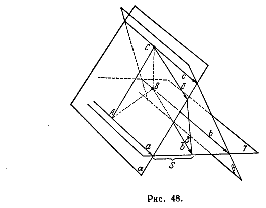
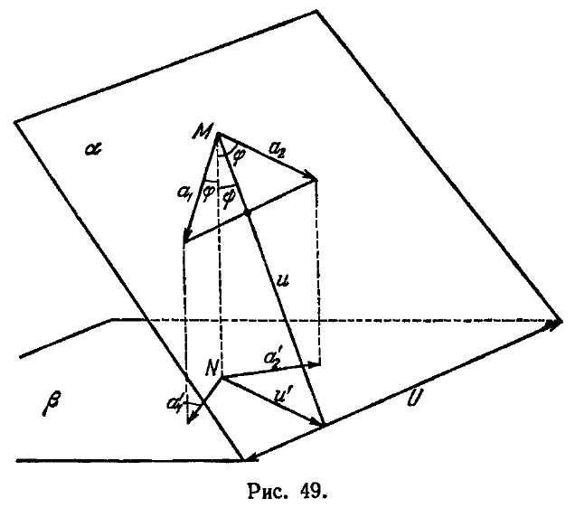
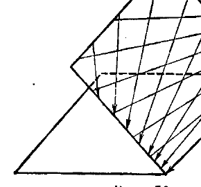
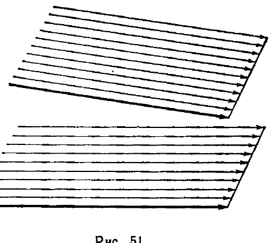
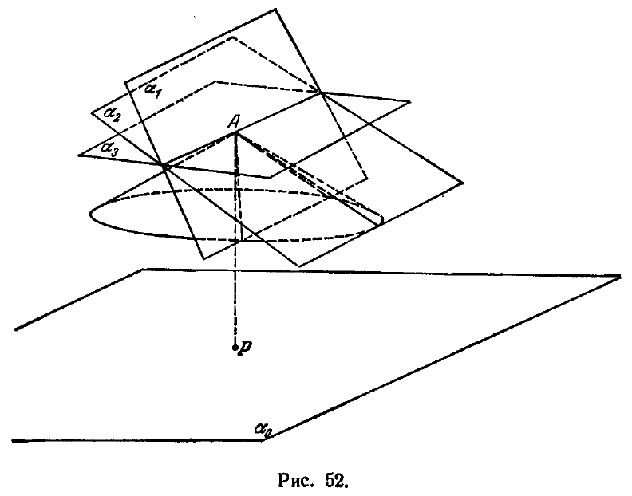

## 4. Прямые и плоскости в пространстве Лобачевского

---
**стр. 111**
---

Еще одна важная особенность неевклидовой геометрии связана с выбором единицы измерения длин. В геометрии Евклида существуют абсолютные константы угловых величин, т. е. углы, построение которых может быть описано абстрактной формулировкой (независимо от конкретного истолкования геометрических объектов); если это построение и содержит элементы произвола, то не влияющие на величину получаемых углов, т. е. получаемые углы оказываются равными между собой. Для примера достаточно указать прямой угол. Если прямой угол принять за единицу измерения углов, то при выполнении измерений не будет необходимости фиксировать «эталон» прямого угла, с которым сравниваются остальные углы путем наложения, так как прямой угол всегда можно найти точным построением.

Наоборот, линейных абсолютных констант в евклидовой геометрии не существует. Для того чтобы выразить длины всех отрезков числами, необходимо условиться в выборе единицы длины, в качестве которой может быть взят произвольный отрезок. Если бы кто-нибудь сделал этот выбор, то он не мог бы описать его и для сравнения с другими отрезками должен был бы показать свой эталон. Так, практически при измерении длины пользуются копиями с эталонного метра, выбор же эталона с геометрической точки зрения является ничем не обусловленным.

В противоположность этому, в геометрии Лобачевского наряду с абсолютными константами угловых величин существуют также и линейные абсолютные константы. Так, например, отрезок $x$, удовлетворяющий уравнению $\Pi(x) = \frac{\pi}{4}$, является определенным постольку, поскольку определена функция $\Pi(x)$. Эта функция, как мы видели, вполне определяется на всей положительной числовой оси геометрическими свойствами плоскости Лобачевского, т. е. свойствами многообразия геометрических образов, подчиненных аксиомам планиметрии Лобачевского. В § 190 мы получим выражение для $\Pi(x)$ с помощью элементарных функций, хорошо известных в математическом анализе (см. также § 59).

**4. Прямые и плоскости в пространстве Лобачевского**

**§ 34.** Теперь мы дадим краткое описание особенностей взаимного расположения прямых и плоскостей в пространстве Лобачевского.

Перечислим сначала основные предложения абсолютной стереометрии, которые нам придется использовать в дальнейшем.

Не останавливаясь на простейших следствиях аксиом I, 1—8 и II, 1—4, часть которых в свое время была указана в гл. II, отметим следующие теоремы.

---
**стр. 112**
---

1. *Пусть даны произвольная плоскость $\alpha$ и две прямые $a$ и $b$, расположенные в плоскости $\alpha$ и проходящие через некоторую ее точку $O$. Если прямая $c$ перпендикулярна в точке $O$ к прямым $a$ и $b$, то она перпендикулярна ко всякой прямой, проходящей в плоскости $\alpha$ через точку $O$.*

В этом случае прямая $c$ называется *перпендикуляром* к плоскости $\alpha$.

2. *Через каждую точку пространства можно провести точно одну прямую, перпендикулярную к данной плоскости.*

3. *Через каждую точку пространства можно провести точно одну плоскость, перпендикулярную к данной прямой.*

Две полуплоскости, имеющие общую граничную прямую и не лежащие на одной плоскости, составляют *двугранный угол*. Полуплоскости, составляющие двугранный угол, называются его *гранями*, их общая граничная прямая — *ребром*.

Всякая плоскость, перпендикулярная к ребру двугранного угла, пересекает грани по двум полупрямым, которые составляют *линейный угол* данного двугранного угла.

Имеет место теорема:

4. *Все линейные углы данного двугранного угла равны между собой.*

Двугранные углы называются *равными*, если их линейные углы равны.

Двугранный угол называется *прямым*, если его линейные углы прямые.

Две пересекающиеся плоскости $\alpha$ и $\beta$ определяют две пары вертикальных двугранных углов. Если эти углы прямые, плоскости $\alpha$ и $\beta$ называются *перпендикулярными друг к другу*.

Имеют место теоремы:

5. *Если плоскость $\alpha$ проходит через перпендикуляр к плоскости $\beta$, то плоскость $\alpha$ перпендикулярна к плоскости $\beta$.* (Эта теорема, очевидно, является частным случаем теоремы 4.)

6. *Если плоскость $\alpha$ перпендикулярна к некоторой прямой, лежащей в плоскости $\beta$, то плоскость $\alpha$ перпендикулярна к плоскости $\beta$.*

7. *Через каждую прямую $a$ можно провести плоскость $\alpha$, перпендикулярную к данной плоскости $\beta$, и при этом только одну, если $a$ не перпендикулярна к $\beta$.* (Теорема 7 вытекает из теорем 2 и 5.)

Прямая $a'$, по которой пересекаются плоскости $\alpha$ и $\beta$, называется *проекцией* прямой $a$ на плоскость $\beta$ (если $a$ не перпендикулярна к $\beta$). Согласно теореме 7 каждую прямую можно однозначно спроектировать на любую плоскость, не перпендикулярную к этой прямой.

---
**стр. 113**
---

Перечисленные предложения принадлежат абсолютной геометрии; предложения, приводимые ниже, будут уже существенно относиться к геометрии Лобачевского.

**§ 35.** Две непересекающиеся прямые в пространстве Лобачевского, лежащие в одной плоскости, мы будем называть *параллельными* или *расходящимися*, если в плоскости, на которой эти прямые расположены, они являются соответственно параллельными или расходящимися согласно ранее данному определению этих понятий в планиметрии.

Для дальнейшего существенно установить транзитивность отношения параллельности, т. е. что две прямые, параллельные третьей в одном и том же направлении, параллельны между собой в том же самом направлении. Сейчас, естественно, представляет интерес только тот случай, когда все три прямые не лежат в одной плоскости, так как в планиметрии это предложение нами доказано (теорема V). Транзитивность отношения параллельности непосредственно вытекает из следующей леммы.

**Л е м м а IV.** *Прямая пересечения двух плоскостей, проходящих через две прямые, параллельные в некотором направлении, параллельна этим прямым в том же направлении.*

**Д о к а з а т е л ь с т в о.** Рассмотрим прямые $a$ и $b$, лежащие в одной плоскости $\gamma$ и параллельные друг другу в некотором направлении. Пусть будут $\alpha$ и $\beta$ две плоскости, проходящие соответственно через эти прямые, и $c$ — прямая пересечения плоскостей $\alpha$ и $\beta$ (рис. 48; мы предполагаем, что плоскости $\alpha$ и $\beta$ не совпадают с

---
**стр. 114**
---

плоскостью $\gamma$). Нужно доказать, что прямая $c$ параллельна каждой из прямых $a$ и $b$ в том же направлении, в каком они параллельны между собой.

Докажем, например, параллельность прямых $a$ и $c$. Прежде всего ясно, что прямые $a$ и $c$ — не пересекающиеся. В самом деле, если бы эти прямые встречались в некоторой точке $O$, то точка $O$ была бы общей точкой всех трех плоскостей $\alpha, \beta, \gamma$. Но тогда и прямые $a, b$ имели бы общую точку $O$, что противоречит допущению.

Возьмем теперь на прямой $c$ произвольную точку $C$ и опустим из нее перпендикуляр $CA$ на прямую $a$. Отрезок $CA$ составляет с прямой $c$ два смежных угла; отметим из них тот, который расположен со стороны параллельности прямой $a$ к прямой $b$. Внутри этого угла через точку $C$ проведем произвольный луч $\bar{c}$. Чтобы убедиться в параллельности прямых $c$ и $a$, нужно показать, что луч $\bar{c}$ встречает прямую $a$.

Выбрав на прямой $b$ произвольную точку $B$, рассмотрим полуплоскость $\delta$, определяемую прямой $CB$ и лучом $\bar{c}$. Эта полуплоскость пересечет плоскость $\gamma$ по некоторому лучу $\bar{b}$, который будет лежать внутри угла, составленного отрезком $BA$ с направлением параллельности прямой $b$ к прямой $a$. Так как прямые $a$ и $b$ по условию параллельны, то луч $\bar{b}$ пересечет прямую $a$ в некоторой точке $S$. Точка $S$ будет общей точкой трех плоскостей $\alpha, \gamma$ и $\delta$. Поэтому луч $\bar{c}$ должен встретить прямую $a$, и лемма доказана.

**Т е о р е м а XI.** *Две прямые, параллельные третьей в одном и том же направлении, параллельны между собой в том же самом направлении.*

**Д о к а з а т е л ь с т в о.** Для того случая, когда все три прямые лежат в одной плоскости, эта теорема доказана нами в § 30. Рассмотрим теперь прямые $a$, $b$ и $c$, не лежащие в одной плоскости. Пусть $b$ и $c$ параллельны прямой $a$ в некотором направлении. Нужно доказать параллельность прямых $b$ и $c$ между собой в том же направлении, в каком они параллельны прямой $a$.

Для доказательства возьмем на прямой $c$ какую-нибудь точку $M$ и проведем через эту точку и прямую $b$ плоскость $\beta$. Обозначим через $\alpha$ плоскость, в которой лежат прямые $a$ и $c$. Так как прямая $b$ не лежит в плоскости $\alpha$, то $\alpha$ и $\beta$ различны. По предыдущей лемме прямая $c'$, по которой пересекаются плоскости $\alpha$ и $\beta$, параллельна прямым $a$ и $b$ в том направлении, в каком они параллельны между собой. Прямая $c$, по условию, параллельна прямой $a$ в этом же направлении. Но через точку $M$, как мы знаем, может проходить лишь одна прямая, параллельная прямой $a$ в определенном направлении. Следовательно, прямые $c$ и $c'$ совпадают, т. е. $c$ есть

---
**стр. 115**
---

прямая пересечения плоскостей $\alpha$ и $\beta$ и, по предыдущему, параллельна прямой $b$.

Таким образом, транзитивность отношения параллельности для пространственной геометрии доказана. При этом обязательно следует иметь в виду, что направления параллельных рассматриваемых прямых должны совпадать: две прямые, параллельные третьей в разных направлениях, никогда не будут параллельными друг другу. Это легко доказать, если принять во внимание, что параллельные прямые неограниченно сближаются в направлении параллельности и неограниченно расходятся в противоположном направлении.

Переходя к рассмотрению взаимного расположения прямых и плоскостей, мы укажем лишь на три возможных здесь случая.

1. Прямая и плоскость имеют общую точку.

2. Прямая параллельна своей проекции на плоскость; в этом случае прямая называется параллельной плоскости.

3. Прямая расходится со своей проекцией на плоскость; в этом случае прямая называется расходящейся с плоскостью.

Отметим одну теорему, доказательство которой сразу получается из леммы IV.

**Т е о р е м а XII.** *Прямая параллельна плоскости, если она параллельна какой-нибудь прямой, лежащей в этой плоскости.*

Качественные различия в расположении параллельных к плоскости и расходящихся с плоскостью прямых читатель легко представит сам, приняв во внимание изложенное в § 32.

Рассмотрим теперь возможные случаи взаимного расположения плоскостей. Таких случаев мы будем различать три.

**1-й с л у ч а й.** Две плоскости имеют общую прямую.

Пусть плоскости $\alpha$ и $\beta$ имеют общую прямую $a$. Тогда, например, в плоскости $\alpha$ через произвольную ее точку можно провести две прямые, параллельные в разных направлениях прямой $a$. Согласно теореме XII эти прямые будут параллельны плоскости $\beta$. Таким образом, на каждой из двух пересекающихся плоскостей через каждую точку, не лежащую на линии пересечения, проходят две прямые, параллельные другой плоскости.

Нетрудно установить, что это свойство характеризует пересекающиеся плоскости. В самом деле, пусть даны две плоскости $\alpha$ и $\beta$ и пусть в плоскости $\alpha$ через некоторую точку $M$ проходят две прямые $a_1$ и $a_2$, параллельные плоскости $\beta$ (рис. 49). Докажем, что плоскости $\alpha$ и $\beta$ пересекаются. Очевидно, прямые $a_1$ и $a_2$ образуют с перпендикуляром $MN$, опущенным из $M$ на плоскость $\beta$, равные острые углы; общая величина этих углов $\varphi = \Pi(x)$, где $x$ — длина перпендикуляра $MN$. Проведем теперь в плоскости $\alpha$ через точку $M$ некоторую прямую $u$ так, чтобы она прошла внутри угла, который составляют прямые $a_1$ и $a_2$, если их рассматривать

---
**стр. 116**
---

направленными в сторону параллельности. В качестве прямой $u$ можно взять, в частности, биссектрису этого угла. Пусть острый угол, который прямая $u$ составляет с отрезком $MN$, равен $\psi$. Из простейших соображений следует, что $\psi < \phi$,

т. е. меньше угла параллельности $\Pi (x)$. Следовательно, прямая $u$ должна пересечь свою проекцию на плоскость $\beta$ в некоторой точке, которая и будет общей точкой плоскости $\alpha$ и $\beta$. Отсюда непосредственно заключаем, что плоскости $\alpha$ и $\beta$ имеют общую прямую.

Таким образом, получаем следующую теорему.

**Т е о р е м а XIII.** *Для того чтобы две плоскости пересекались, необходимо и достаточно, чтобы в одной из этих плоскостей через произвольную точку проходили две прямые, параллельные другой (рис. 50).*

**2-й случай.** Две плоскости расположены так, что в одной из них через некоторую точку проходит точно одна прямая, параллельная другой плоскости; в этом случае плоскости называются *параллельными*.

Прежде всего ясно, что при высказанном условии плоскости не могут иметь общих точек, т. е. не могут быть пересекающимися,

---
**стр. 117**
---

так как в противном случае в любой из них через каждую точку проходили бы две прямые, параллельные другой.

Далее, если даны две плоскости $\alpha$ и $\beta$ и если в плоскости $\alpha$ через точку $M$ проходит точно одна прямая $a$, параллельная плоскости $\beta$, иначе говоря, параллельная своей проекции $a'$ на плоскость $\beta$, то в плоскости $\alpha$ через каждую точку проходит точно одна прямая, параллельная плоскости $\beta$. Действительно, в плоскости $\alpha$ через каждую точку можно провести прямую, параллельную прямой $a$, в том же направлении, в каком она параллельна прямой $a'$. По теореме XI, проведенная прямая параллельна прямой $a'$, а по теореме XII — она в этом случае параллельна плоскости $\beta$.

Другой прямой, проходящей в плоскости $\alpha$ через ту же точку и параллельной плоскости $\beta$, нет, иначе параллельная ей прямая, проходящая через $M$, по тем же основаниям была бы параллельна плоскости $\beta$ и вместе с тем отличалась бы от прямой $a$, что, по предположению, невозможно.

Таким образом, плоскость $\alpha$ покрыта семейством прямых, параллельных плоскости $\beta$. Не составило бы труда показать, что плоскость $\beta$ в свою очередь покрыта семейством прямых, параллельных плоскости $\alpha$ (рис. 51).

Очевидно, обе плоскости неограниченно сближаются в направлении параллельности прямых указанных семейств.

**3-й случай.** Две плоскости расположены так, что ни одна из них не содержит прямых, параллельных другой; в этом случае плоскости называются *расходящимися*.

Две расходящиеся плоскости всегда имеют один общий перпендикуляр, и обратно, плоскости, перпендикулярные к одной

---
**стр. 118**
---

прямой, являются расходящимися. Расходящиеся плоскости по всем направлениям от общего перпендикуляра неограниченно удаляются друг от друга (отсюда название — расходящиеся). Останавливаться на доказательстве последних утверждений мы не будем, — их легко проведет в виде упражнений сам читатель.

Три случая взаимного расположения плоскостей можно хорошо уяснить себе при помощи следующего рассмотрения.

Пусть $\alpha_0$ — некоторая плоскость, $A$ — не лежащая на ней точка. Опустим из точки $A$ на плоскость $\alpha_0$ перпендикуляр $AP$ и проведем, кроме того, через точку $A$ всевозможные прямые, параллельные плоскости $\alpha_0$. Все они наклонены к $AP$ под одним углом, равным $\Pi (AP)$, и поэтому образуют круговой конус $K$ с осью $AP$ (рис. 52).

Плоскость, проходящая через $A$ и пересекающая конус $K$ по двум образующим, содержит две прямые, проходящие через $A$ и параллельные плоскости $\alpha_0$ (именно эти образующие). Такая плоскость пересекается с плоскостью $\alpha_0$ (на рис. 52 плоскость $\alpha_1$). Прямая ее пересечения с плоскостью $\alpha_0$ видна из точки $A$ под углом, который составляют упомянутые две образующие конуса $K$.

Плоскость, проходящая через точку $A$ и касающаяся конуса $K$ вдоль некоторой образующей, содержит только одну прямую, проходящую через $A$ и параллельную плоскости $\alpha_0$ (образующую
