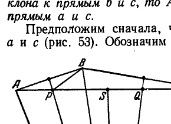
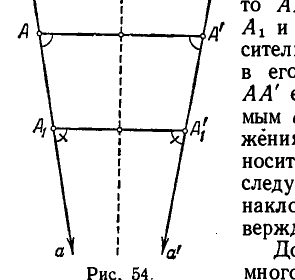
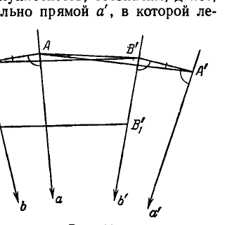
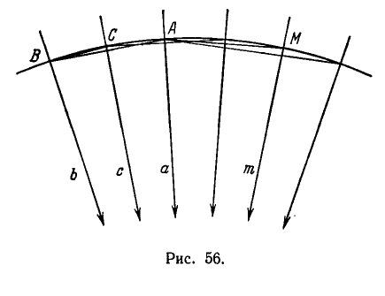
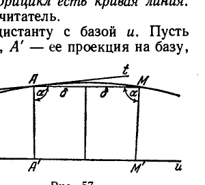
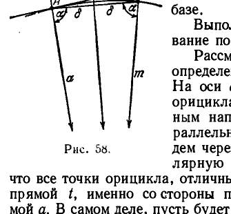

## 5. Эквидистанта и орицикл

---
**стр. 119**
---

прикосновения). Эта плоскость параллельна $\alpha_0$ (на рис. 52 плоскость $\alpha_2$).

Наконец, плоскость, проходящая через точку $A$ и не содержащая ни одной образующей конуса $K$, не имеет прямых, параллельных плоскости $\alpha_0$. Эта плоскость с плоскостью $\alpha_0$ расходится (на рис. 52 плоскость $\alpha_3$).

Отметим одну теорему, которая нам понадобится в дальнейшем.

**Т е о р е м а XIV.** *Если даны плоскость и параллельная ей прямая, то существует точно одна плоскость, проходящая через эту прямую и не пересекающая данной плоскости.*

**Д о к а з а т е л ь с т в о.** Обозначим данные прямую и плоскость соответственно буквами $a$ и $\alpha$. Возьмем на прямой $a$ произвольную точку $A$ и проведем через нее всевозможные прямые, параллельные плоскости $\alpha$. Они составят круговой конус $K$ с вершиной в точке $A$.

Если плоскость, проходящая через прямую $a$, не пересекает плоскости $\alpha$, то она не может содержать двух образующих конуса и, следовательно, должна касаться его вдоль образующей $a$. Но через всякую образующую кругового конуса проходит точно одна касательная плоскость, откуда и вытекает справедливость теоремы.

На этом мы закончим проведенный, начиная с § 28, обзор начальных положений теории параллельных Лобачевского.

Несмотря на своеобразие этой теории, в том, что было изложено, можно найти много сходного с теорией параллельных у Евклида.

В следующем разделе мы изучим ряд важных образов геометрии Лобачевского, которым в геометрии Евклида аналогов нет совсем.

**5. Эквидистанта и орицикл**

**§ 36.** В настоящем разделе речь будет идти о некоторых кривых, характерных для неевклидовой геометрии. Мы подойдем к их определению, рассматривая основные виды движений плоскости Лобачевского по самой себе.

В конце § 19 мы доказали, что каждое движение фигуры можно составить из сдвига по прямой и вращения вокруг точки. При этом движение было определено как построение по данной фигуре другой фигуры, ей конгруэнтной. Различия между собственно конгруэнтными и взаимно зеркальными фигурами не делалось. Если рассматривать лишь перемещения в прямом смысле этого слова, т. е. если исключить зеркальные отражения фигур, то можно высказать теорему, гораздо более сильную, чем та, которую мы сейчас упоминали.

---
**стр. 120**
---

Так, в евклидовой планиметрии имеет место следующая теорема (в кинематике она хорошо известна под названием теоремы Даламбера).

Каждое движение фигуры (или всей плоскости) представляет собой либо вращение вокруг точки, либо сдвиг по прямой.

Иначе говоря, вращение и сдвиг не только позволяют путем их сочетания получить любое движение, но являются даже единственно возможными видами евклидовых движений.

Будем рассматривать сейчас вращения евклидовой плоскости вокруг некоторой точки $O$. Обозначим буквой $k$ произвольную окружность с центром $O$. При вращении плоскости вокруг $O$ все точки окружности $k$ перемещаются, но остаются на этой же окружности. Таким образом, окружность в целом не меняет своего положения на плоскости, а как бы скользит по самой себе.

Линию, которая при некотором движении плоскости сохраняет свое положение, мы будем называть *инвариантной* относительно этого движения.

Очевидно, концентрические окружности с общим центром $O$ инвариантны относительно всех вращений вокруг $O$.

Если совершаются сдвиги евклидовой плоскости по какой-нибудь прямой $u$, то инвариантными линиями будут прямые, параллельные $u$. В планиметрии Лобачевского существует три основных вида движений:

1. **Вращение вокруг точки:** кривыми, инвариантными относительно всех вращений вокруг одной точки $O$, в планиметрии Лобачевского, как и в планиметрии Евклида, являются окружности с центром $O$.

2. **Сдвиг по прямой:** линии, инвариантные относительно всех сдвигов по одной прямой $u$, в планиметрии Лобачевского не являются прямыми, как в случае Евклида, а представляют собой особые кривые, называемые *эквидистантами*.

Эквидистанта есть геометрическое место точек, расположенных по одну сторону от прямой $u$ и на одинаковых расстояниях от нее. Прямая $u$ называется *базой* эквидистанты, величина расстояния $h$ — *высотой*. Каждую прямую, очевидно, можно рассматривать как эквидистанту с высотой $h = 0$.

То, что эквидистанты инвариантны относительно сдвигов, усматривается непосредственно. В самом деле, при сдвиге плоскости по прямой $u$ каждая точка эквидистанты с базой $u$ перемещается так, что ее расстояние от $u$ остается неизменным. Следовательно, эта точка все время остается на эквидистанте и, значит, эквидистанта в целом не меняет своего положения.

Легко убедиться также, что эквидистанты суть кривые линии. Более того, верна следующая теорема.

---
**стр. 121**
---

*Каждая прямая имеет с эквидистантой не более двух общих точек.*

Доказательство проводится в двух словах. Допустим, что некоторая прямая имеет с эквидистантой три общие точки $A, B, C$, которые обозначены так, что $B$ лежит между $A$ и $C$. Если $A', B', C'$ — проекции точек $A, B, C$ на базу, то согласно определению эквидистанты четырехугольники $ABB'A'$ и $BCC'B'$ суть четырехугольники Саккери (ибо отрезки $AA', BB'$ и $CC'$ равны между собой). Так как в геометрии Лобачевского осуществляется гипотеза острого угла Саккери, то сумма углов $ABB'$ и $B'BC$ меньше двух прямых. Но поскольку точки $A, B, C$ находятся в прямолинейном расположении, сумма этих же углов должна быть равной двум прямым. Полученное противоречие доказывает теорему.

3. Третий из основных видов движения плоскости Лобачевского по самой себе может быть назван вращением вокруг бесконечно удаленной точки.

Чтобы достаточно ясно описать этот вид движения, нам потребуются две теоремы о «секущих равного наклона».

**§ 37.** Отрезок $AB$, концы которого находятся на прямых $a$ и $b$, называется секущей равного наклона к прямым $a, b$, если он составляет с ними равные внутренние односторонние углы *).

**Т е о р е м а XV.** *Каковы бы ни были две параллельные прямые, через каждую точку любой из них можно провести к ним точно одну секущую равного наклона.*

**Д о к а з а т е л ь с т в о.** Пусть $a$ и $b$ — произвольные прямые; обозначим через $S$ какую-нибудь точку, одинаково удаленную от прямых $a$ и $b$ (существование такой точки установлено нами в § 30 в процессе доказательства теоремы IV), и опустим из $S$ на эти прямые перпендикуляры $SP$ и $SQ$. Проведем, далее, биссектрису угла $PSQ$, которую обозначим буквой $g$. Прямые $a$ и $b$ симметричны относительно $g$. Поэтому если $A$ есть произвольно заданная точка прямой $a$, то симметричная ей относительно $g$ точка $B$ будет лежать на прямой $b$. Прямая $AB$ и является секущей равного наклона к прямым $a$ и $b$. Легко видеть, что другой секущей равного наклона, проходящей через $A$, не существует. В самом деле, если мы повернем прямую $AB$ вокруг точки $A$, то один из двух углов, которые она составляет с прямыми $a, b$, уменьшится, другой увеличится, и, таким образом, повернутая прямая уже не может быть секущей равного наклона.

**Т е о р е м а XVI.** *Пусть даны на плоскости три прямые $a, b, c$, параллельные между собой в каком-нибудь направлении и прохо-*

*) Секущая равного наклона уже встречалась в § 30. Сейчас нам удобнее назвать так не прямую, а отрезок.

---
**стр. 122**
---

дящие соответственно через точки $A$, $B$, $C$. Тогда, если $AB$ есть секущая равного наклона к прямым $a$ и $b$, $BC$ — секущая равного наклона к прямым $b$ и $c$, то $AC$ является секущей равного наклона к прямым $a$ и $c$.

Предположим сначала, что прямая $b$ лежит между прямыми $a$ и $c$ (рис. 53). Обозначим через $p$ и $q$ перпендикуляры к серединам сторон $AB$ и $BC$ треугольника $ABC$ и через $P$ и $Q$ — точки их пересечения со стороной $AC$.

Так как точка $P$ лежит вне полосы плоскости, ограниченной прямыми $b$ и $c$, то $\angle PBC$ больше $\angle PCB$. Отсюда следует, что отрезок $PB$ меньше отрезка $PC$; но $PB = AP$, следовательно, $AP$ меньше $PC$. Аналогично рассуждая, найдем, что $CQ$ меньше $QA$. Ввиду этого середина $S$ стороны $AC$ лежит между точками $P$ и $Q$.

Заметим теперь, что прямая $p$ п а р а л л е л ь н а прямым $a$ и $b$ в том же направлении, в каком они параллельны между собой. В самом деле, прямая $p$ не может пересечь какую-нибудь из прямых $a$ и $b$: если бы она пересекла, например, прямую $a$, то ввиду симметрии прямых $a$ и $b$ относительно $p$ через точку пересечения должна была бы пройти и прямая $b$. Таким образом, прямые $a$ и $b$ имели бы общую точку, что исключено условием их параллельности. С другой стороны, прямая $p$ не может быть расходящейся с какой-нибудь из прямых $a$, $b$, так как эти прямые, будучи параллельными, неограниченно сближаются в направлении параллельности, а прямая $p$ расположена между ними и поэтому должна сближаться с каждой из них (чтобы точно доказать это обстоятельство, достаточно использовать лемму III § 30). Точно так же прямая $q$ параллельна прямым $b$ и $c$. Таким образом, все прямые $a$, $b$, $c$, $p$, $q$ параллельны друг другу (в одном направлении).

Восставим теперь в точке $S$ перпендикуляр $r$ к стороне $AC$. Прямая $r$ не может пересечь какую-нибудь из прямых $p$, $q$. В самом деле, если бы $r$ пересекла, например, $p$ в какой-нибудь точке $O$, то эта точка была бы центром описанного круга треугольника $ABC$ и через точку $O$ в этом случае должна была бы пройти прямая $q$; прямые $p$ и $q$, следовательно, имели бы общую точку $O$, что исключено, так как они параллельны. Выше мы показали, что точка $S$ лежит между $P$ и $Q$. Отсюда и из только что сделанного замечания следует, что $r$ находится между $p$ и $q$. А так как $p$ и $q$ па-

---
**стр. 123**
---

раллельны, то прямая $r$ параллельна им в том же направлении, в каком они параллельны между собой. Итак, все шесть прямых $a$, $b$, $c$, $p$, $q$, $r$ параллельны друг другу в одном направлении. Для нас существенно, что прямая $r$, перпендикулярная к отрезку $AC$ в его середине, параллельна прямым $a$ и $c$: установив это, мы фактически завершили доказательство теоремы. Действительно, отсюда следует, что каждый из острых углов, которые составляют с отрезком $AC$ прямые $a$ и $c$, равен $\Pi\left(\frac{AC}{2}\right)$ и, следовательно, эти углы равны между собой.

Иначе говоря, $AC$ есть секущая равного наклона к прямым $a$ и $c$.

Теперь нужно рассмотреть случай, когда прямая $b$ не находится между $a$ и $c$. Пусть $AB$ и $BC$ — секущие равного наклона к соответствующим прямым. Допустим, что $AC$ не будет секущей равного наклона к прямым $a$ и $c$. Какая-нибудь из трех прямых $a$, $b$, $c$ расположена между двумя другими; если это будет, например, прямая $a$, то мы проведем через точку $A$ секущую равного наклона $AC'$ к прямым $a$ и $c$. Согласно предыдущему $BC'$ является секущей равного наклона к прямым $b$ и $c$, а, по условию, $BC$ есть секущая равного наклона к этим же прямым. Получается противоречие с теоремой XV.

**§ 38.** Теперь мы определим, что понимается под вращением вокруг бесконечно удаленной точки.

Пусть дана система всевозможных прямых, параллельных друг другу в одном направлении. Будем воображать эти прямые сходящимися в направлении их параллельности в бесконечно удаленной точке $O_\infty$ (говоря о бесконечно удаленной точке, мы только вводим удобный для нас термин, который по существу не означает чего-либо другого, кроме заданной системы прямых).

Вращением вокруг бесконечно удаленной точки $O_\infty$ мы называем такое движение плоскости по самой себе, при котором какая-нибудь прямая $a$ заданной системы совмещается с какой-нибудь другой прямой $a'$ этой системы (так что $a'$ параллельна $a$) и некоторая точка $A$ прямой $a$ перемещается в точку $A'$ прямой $a'$ так, что отрезок $AA'$ является секущей равного наклона к прямым $a$ и $a'$ (вследствие теоремы XV положение точки $A'$ на прямой $a'$ вполне определяется положением точки $A$ на прямой $a$); кроме того, мы будем предполагать, что та полуплоскость относительно прямой $a$, в которой нет прямой $a'$, налагается на ту полуплоскость относительно прямой $a'$, где лежит прямая $a$. При этом

а) каждая другая точка прямой $a$ вместе с той, в какую она перемещается, определяет секущую равного наклона к прямым $a$ и $a'$;

б) каждая прямая $b$ данной системы, перемещаясь, совпадает с прямой $b'$ этой же системы (так что $b'$ параллельна $b$), и соответ-

---
**стр. 124**
---

ственные при наложении точки прямых $b$ и $b'$ являются концами секущих равного наклона к этим прямым.

Доказательство утверждения а) очевидно В самом деле, если $A_1$ — произвольная точка прямой $a$, $A_1'$ — точка на прямой $a'$, в которую перемещается точка $A_1$, то $AA_1 \equiv A'A_1'$ (рис. 54). Поэтому точки $A_1$ и $A_1'$ расположены симметрично относительно перпендикуляра к отрезку $AA'$ в его середине (напомним читателю, что $AA'$ есть секущая равного наклона к прямым $a$ и $a'$). Из симметричности расположения прямых $a$, $a'$ и точек $A_1$ и $A_1'$ относительно указанного перпендикуляра следует, что $A_1A_1'$ есть секущая равного наклона к прямым $a$ и $a'$. Тем самым утверждение а) доказано.

Доказательство утверждения б) немного сложнее. Введем прежде всего некоторые обозначения. Именно, обозначим через I ту полуплоскость относительно прямой $a$, в которой нет прямой $a'$, и через II — другую полуплоскость; обозначим, далее, через I' ту полуплоскость относительно прямой $a'$, в которой лежит прямая $a$, дополнительную к ней полуплоскость обозначим через II'. При рассматриваемом движении плоскости по самой себе прямая $a$ налагается на прямую $a'$, полуплоскость I — на полуплоскость I', и полуплоскость II — на полуплоскость II'. Возьмем теперь в данной системе прямых какую-нибудь прямую $b$, например, в полуплоскости I. Проведем из точки $A$ секущую равного наклона к прямым $a$ и $b$; пусть $B$ — конец этой секущей (рис. 55). Построим точку, в которую должна переместиться точка $B$. С этой целью из точки $A'$ в полуплоскости I' проведем отрезок, равный $AB$ и составляющий с прямой $a'$ такой же угол, какой составляет с прямой $a$ отрезок $AB$ (углы берем со стороны параллельности прямых данной системы); конец проведенного отрезка обозначим через $B'$. Очевидно, $B'$ и есть та точка, в которую перемещается точка $B$. Проведем, наконец, через точку

---
**стр. 125**
---

$B'$ прямую $b'$ так, чтобы она составляла с отрезком $A'B'$ такой же угол, какой прямая $b$ составляет с отрезком $AB$. Очевидно, $b'$ есть прямая, на которую налагается прямая $b$. Далее, ясно, что $A'B'$ — секущая равного наклона к прямым $a'$, $b'$, так как $AB$ — секущая равного наклона к прямым $a$, $b$.

Ясно также, что прямая $b'$ параллельна прямой $a'$ (в заданном направлении), так как $b$ параллельна $a$. Следовательно, $b'$ принадлежит данной системе прямых. Докажем теперь, что $BB'$ есть секущая равного наклона к прямым $b$, $b'$; это следует из теоремы XVI. В самом деле, так как $AA'$ — секущая равного наклона к прямым $a$, $a'$ и $A'B'$ — секущая равного наклона к прямым $a'$, $b'$, то, по теореме XVI, $AB'$ есть секущая равного наклона к прямым $a$, $b'$.

Но $AB$ — секущая равного наклона к прямым $a$, $b$; следовательно, по той же теореме XVI, $BB'$ является секущей равного наклона к прямым $b$, $b'$. Пусть теперь $B_1$ — любая точка прямой $b$, $B_1'$ — соответствующая ей при наложении точка на прямой $b'$. Тогда $BB_1 \equiv B'B_1'$; отсюда следует, что $B_1B_1'$ также является секущей равного наклона к прямым $b$ и $b'$ (см. доказательство предложения а)).

Тем самым утверждение б) доказано.

Теперь легко понять, почему рассматриваемый вид движения плоскости по самой себе мы называем вращением вокруг бесконечно удаленной точки. Дело в том, что если $B$ — произвольная точка, $B'$ — точка, в которую она перемещается при этом движении, то бесконечный «треугольник» $BB'O_\infty$ (т. е. фигура, составленная из отрезка $BB'$ и лучей, которые исходят из точек $B$, $B'$ в направлении параллельности данной системы прямых) сходен с обыкновенным равнобедренным треугольником. В самом деле, сторона $BB'$ составляет равные углы с «сторонами» $BO_\infty$ и $B'O_\infty$.

Таким образом, бесконечно удаленная точка $O_\infty$ аналогична центру обыкновенного вращения.

*Линии, инвариантные относительно вращений вокруг бесконечно удаленной точки, Лобачевский называл орициклами, или предельными кругами.*

Мы укажем сейчас способ построения этих линий и тем самым установим их существование.

Пусть дана система всевозможных прямых, параллельных друг другу в одном направлении. Выберем в этой системе какую-нибудь прямую $a$ и какую-нибудь точку $A$ на ней (рис. 56). Проведем из $A$ секущую равного наклона к прямой $a$ и к какой-нибудь другой прямой $m$ данной системы; конец этой секущей на прямой $m$ обозначим через $M$. Согласно теореме XV, точка $M$ вполне определяется выбором прямой $m$.

Будем теперь перемещать прямую $m$, не выводя ее, однако, из рассматриваемой системы прямых, т. е. сохраняя ее параллельность прямой $a$.

---
**стр. 126**
---

При этом точка $M$ опишет вполне определенную линию, которая и является орициклом.

Иначе говоря, *орицикл есть геометрическое место концов секущих равного наклона, проведенных из некоторой точки $A$ прямой $a$ к прямым, параллельным ей в определенном направлении.* Сама точка $A$ также считается точкой орицикла.

Поскольку прямая $a$, будучи заданной, определяет систему прямых, параллельных ей в определенном направлении, то, очевидно, заданием точки $A$ и направленной прямой $a$, которую мы будем называть *осью*, орицикл вполне определен.

Мы должны показать, что орицикл, построение которого сейчас было описано, действительно обладает свойством инвариантности относительно вращений вокруг бесконечно удаленной точки $O_\infty$, в которую направлена его ось $a$.

Пусть $B$ и $C$ — произвольные точки орицикла, $b$ и $c$ — прямые, проходящие через эти точки и направленные в $O_\infty$ (т. е. параллельные прямой $a$ в заданном направлении). По построению орицикла $AB$ есть секущая равного наклона к прямым $a$ и $b$, $AC$ — секущая равного наклона к прямым $a$ и $c$; согласно теореме XVI отсюда следует, что $BC$ есть секущая равного наклона к прямым $b$ и $c$. Поэтому если совершается *вращение плоскости вокруг $O_\infty$*, переводящее прямую $b$ в прямую $c$, то точка $B$, перемещаясь, занимает положение точки $C$. Таким образом, при указанных вращениях каждая точка, лежащая на орицикле, остается на нем; орицикл при этом *как бы скользит по самому себе*.

Отсюда, в частности, следует, что все точки орицикла равноправны и что построение его, которое мы производили, исходя из точки $A$, можно производить, исходя из любой другой точки орицикла.

---
**стр. 127**
---

Иначе говоря:

*Каждая прямая, параллельная оси $a$ орицикла в отмеченном на ней направлении, пересекает орицикл в одной точке и является также осью этого орицикла.*

По отношению к орициклам справедлива теорема, аналогичная доказанной по отношению к эквидистантам.

*Любая прямая может иметь с орициклом не более двух общих точек.*

Отсюда, в частности, следует, что орицикл есть кривая линия. Доказательство легко проведет сам читатель.

**§ 39.** Возьмем какую-нибудь эквидистанту с базой $u$. Пусть $A$ — произвольная точка эквидистанты, $A'$ — ее проекция на базу, так что $AA'$ — высота эквидистанты (рис. 57). Проведем, далее, через $A$ прямую $t$, перпендикулярную к высоте $AA'$. Нетрудно установить, что все точки эквидистанты, отличные от $A$, лежат с одной стороны от прямой $t$, именно с той, с какой расположена база $u$. В самом деле, если $M$ — некоторая точка эквидистанты и $M'$ — ее проекция на $u$, то $AMM'A'$ — четырехугольник Саккери и $\angle A'AM$, как угол при верхнем основании этого четырехугольника, — острый. Следовательно, точка $M$ лежит с той же стороны от прямой $t$, что и точка $A'$. Таким образом, мы можем сказать, что прямая $t$ есть опорная прямая данной эквидистанты *). Мы сейчас покажем, что $t$ является также и касательной. Рассмотрим секущую $AM$ и обозначим $\angle A'AM$ через $\alpha$, через $2\delta$ — длину отрезка $AM$. Очевидно, перпендикуляр в середине отрезка $AM$ и высота $AA'$ являются взаимно расходящимися прямыми, так как обе они перпендикулярны к базе. Поэтому угол $\alpha$ больше угла параллельности для отрезка $\delta$, т. е.

$$\alpha > \Pi(\delta).$$

С другой стороны, $\alpha$ — острый угол, следовательно, имеют место неравенства

$$\Pi(\delta) < \alpha < \frac{\pi}{2}.$$

Если точка $M$, перемещаясь по эквидистанте, стремится к $A$, то

*) Прямая называется опорной к данной линии, если она содержит хотя бы одну точку линии и по одну какую-то сторону от этой прямой нет точек линии.

---
**стр. 128**
---

$\delta \to 0$, а согласно теореме X, $\lim_{\delta \to 0} \Pi(\delta) = \frac{\pi}{2}$. Вследствие этого

$$\lim_{M \to A} \alpha = \frac{\pi}{2}.$$

Тем самым мы показали, что если $M \to A$, то секущая $AM$ имеет предельное положение, и этим предельным положением служит прямая $t$.

Полученный результат можно выразить в следующей форме: *каждая высота эквидистанты есть ее нормаль*. Из предыдущего также следует, что эквидистанта в каждой своей точке обращена вогнутостью к базе.

Выполним теперь аналогичное исследование по отношению к орициклу.

Рассмотрим какой-нибудь орицикл, определенный точкой $A$ и осью $a$ (рис. 58). На оси $a$, а также на всякой другой оси орицикла условимся считать положительным направление, в котором эта ось параллельна другим осям орицикла. Проведем через точку $A$ прямую $t$, перпендикулярную к оси $a$. Нетрудно установить, что все точки орицикла, отличные от $A$, лежат с одной стороны от прямой $t$, именно со стороны положительного направления прямой $a$. В самом деле, пусть будет $M$ — произвольная точка орицикла, $m$ — ось, проходящая через $M$. Обозначим через $\alpha$ угол, который составляет отрезок $AM$ с положительным направлением оси $a$, через $2\delta$ — длину отрезка $AM$. Так как, по определению орицикла, $AM$ есть секущая равного наклона к параллельным прямым $a$ и $m$, то перпендикуляр к отрезку $AM$, восставленный в его середине, параллелен каждой из прямых $a$ и $m$. Поэтому угол $\alpha$ есть угол параллельности для отрезка $\delta$:

$$\alpha = \Pi(\delta).$$

Отсюда прежде всего мы можем заключить, что $\alpha$ — острый угол. Следовательно, любая точка $M$ орицикла в самом деле лежит с той стороны от прямой $t$, в какую обращено положительное направление оси $a$. Иначе мы скажем, что прямая $t$ есть опорная прямая орицикла. Но легко убедиться, что прямая $t$ является также и касательной. Для этого следует лишь принять во внимание известное нам равенство

$$\lim_{\delta \to 0} \Pi(\delta) = \frac{\pi}{2},$$

---
**стр. 129**
---

из которого следует, что при $M \to A$ секущая $AM$ имеет своим предельным положением прямую $t$.

Последний результат можно формулировать еще следующим образом: *каждая ось орицикла есть его нормаль*.

Из предыдущего также видно, что в каждой точке орицикла вогнутость его обращена в положительную сторону оси.

Отметим два свойства, общих для окружности, орицикла и эквидистанты:

1. Каждая из этих кривых симметрична относительно любой своей нормали.

Поэтому нормали окружности и эквидистанты, как и нормали орицикла, мы будем иногда называть осями.

2. Хорды этих кривых являются секущими равного наклона к нормалям, проходящим через их концы. Сопоставляя окружность, орицикл и эквидистанту, можно описать семейства их нормалей следующим образом: все нормали окружности сходятся в одной точке; все нормали орицикла параллельны друг другу в некотором направлении (как говорят, сходятся в бесконечности); все нормали эквидистанты перпендикулярны к одной прямой и, значит, расходятся.

В евклидовой геометрии совокупность прямых, проходящих через одну точку, или совокупность параллельных прямых называют *пучком*. Перенося это понятие в геометрию Лобачевского, условимся называть пучком совокупность прямых, проходящих через одну точку, или совокупность прямых, параллельных друг другу в некотором направлении, или совокупность прямых, перпендикулярных к какой-нибудь прямой. В первом случае пучок будем называть *эллиптическим*, во втором — *параболическим*, в третьем — *гиперболическим*. На основании предыдущего мы можем тогда сказать, что *окружности, орициклы и эквидистанты являются ортогональными траекториями соответственно эллиптических, параболических и гиперболических пучков.*

**§ 40.** Существенно отметить, что в то время, как окружности отличаются друг от друга величиной радиуса, а эквидистанты — величиной высоты, *все орициклы конгруэнтны друг другу.*

Действительно, выше мы видели, что орицикл вполне определен, коль скоро заданы одна его точка и проходящая через эту точку ось. Поэтому, если передвинуть плоскость так, чтобы точка и проходящая через нее ось одного орицикла совместились соответственно с точкой и осью какого-нибудь другого орицикла, то оба орициклы совместятся (свойства движений, которыми мы в этом рассуждении должны пользоваться, обеспечены теоремой B § 19).

Докажем еще следующую теорему.
