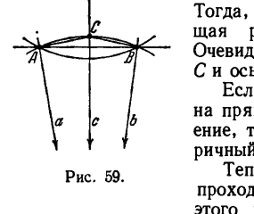
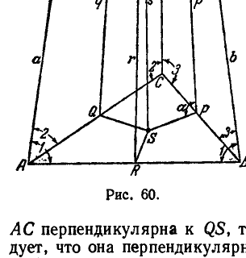

## 6. Эквидистантная поверхность и орисфера

---
**стр. 130**
---

**Т е о р е м а XVII.** *Каковы бы ни были две точки плоскости $A$ и $B$, через них проходят точно два орицикла; эти орициклы симметричны относительно прямой $AB$.*

**Д о к а з а т е л ь с т в о.** Проведем через середину отрезка $AB$ перпендикулярную к нему прямую $c$ (рис. 59) и зададим на этой прямой одно из двух ее направлений. Проведем, кроме того, через точки $A$ и $B$ прямые $a$ и $b$, параллельные в заданном направлении прямой $c$. Пусть будет $AC$ секущая равного наклона к прямым $a$ и $c$. Тогда, по теореме XVI, $BC$ будет секущая равного наклона к прямым $b$ и $c$. Очевидно, орицикл, определенный точкой $C$ и осью $c$, пройдет через точки $A$ и $B$.

Если взять противоположное направление на прямой $c$ и повторить изложенное построение, то получится другой орицикл, симметричный с первым относительно $AB$.

Теперь докажем, что других орициклов, проходящих через точки $A$ и $B$, нет. Для этого предположим, что имеется какой-нибудь орицикл $L$ с хордой $AB$, и обозначим через $a$ и $b$ его оси, проходящие через концы этой хорды. Прямые $a$ и $b$ должны быть взаимно параллельны и одинаково наклонены к отрезку $AB$. Поэтому перпендикуляр $c$ в середине $AB$ параллелен каждой из прямых $a$ и $b$. Но в таком случае прямые $a$ и $b$ вполне определяются направлением параллельности к прямой $c$, и, следовательно, для расположения прямых $a$ и $b$ могут представиться только две возможности, рассмотренные выше. Таким образом, орицикл $L$ необходимо совпадает с одним из двух орициклов, построение которых было описано в первой части доказательства.

Доказанной теореме можно придать еще такую формулировку:

**Т е о р е м а XVIII.** *Дуги орициклов, стягиваемые конгруэнтными хордами, конгруэнтны между собой.*

**6. Эквидистантная поверхность и орисфера**

**§ 41.** Пространственным аналогом окружности является сфера. Существуют также поверхности, представляющие собой естественные аналоги эквидистанты и орицикла. Они называются соответственно эквидистантной поверхностью и орисферой. *Эквидистантная поверхность есть геометрическое место точек, расположенных по одну сторону от какой-нибудь плоскости $\sigma$ и отстоящих от нее на одном и том же расстоянии.* Плоскость $\sigma$ мы будем называть базой эквидистантной поверхности, перпендикуляр, опущенный из произвольной точки поверхности на базу, — *высотой*. Высказан-

---
**стр. 131**
---

ное определение вполне сходно с определением эквидистанты. Подобно этому, по прямой аналогии с определением орицикла, определяется орисфера.

Чтобы сформулировать это определение, рассмотрим в пространстве произвольную прямую $a$, проходящую через некоторую точку $A$. На прямой $a$ отметим одно из двух направлений и будем называть его положительным. Пусть будет $m$ какая угодно другая прямая пространства, параллельная прямой $a$ в положительном направлении. По теореме XV, через точку $A$ можно провести точно одну секущую равного наклона к прямым $a$ и $m$. Обозначим буквой $M$ конец этой секущей, расположенный на прямой $m$. Если мы будем передвигать прямую $m$, не нарушая ее параллельности прямой $a$ в положительном направлении, то соответствующие точки $M$ заполнят поверхность, которая и называется орисферой.

Иначе говоря, орисфера есть геометрическое место концов секущих равного наклона, проведенных из некоторой точки $A$ прямой ко всем прямым пространства, параллельным этой прямой в определенном направлении. Сама точка $A$ также считается точкой орисферы.

Поскольку прямая $a$, будучи заданной, определяет систему прямых пространства, параллельных ей в определенном направлении, то, очевидно, заданием точки $A$ и направленной прямой $a$, которую мы будем называть *осью*, орисфера вполне определена.

Существенно установить, что точка $A$ ничем не выделяется среди точек орисферы, т. е. что построение орисферы, выраженное в ее определении, можно проводить, исходя из любой ее точки. Для этого нужно показать, что каковы бы ни были две прямые, параллельные оси орисферы в отмеченном на ней направлении, отрезок, соединяющий точки встречи этих прямых с орисферой, является для них секущей равного наклона.

Все сводится, очевидно, к следующей теореме.

**Т е о р е м а XIX.** *Пусть даны в пространстве три попарно параллельные прямые $a, b, c$, проходящие соответственно через точки $A, B, C$. Тогда если $AB$ есть секущая равного наклона к прямым $a$ и $b$, $BC$ — секущая равного наклона к прямым $b$ и $c$, то $AC$ будет секущей равного наклона к прямым $a$ и $c$.*

**Д о к а з а т е л ь с т в о.** Мы можем предполагать, что прямые $a, b, c$ не лежат в одной плоскости, так как этот случай уже рассмотрен нами ранее, в теореме XVI. Обозначим через $P, Q, R$ середины сторон треугольника $ABC$, противоположных соответственно вершинам $A, B, C$, и проведем через точки $P, Q, R$ прямые $p, q, r$, параллельные прямым $a, b, c$ (рис. 60), а следовательно, параллельные между собой. Легко усмотреть, что проекции прямых $p, q, r$ на плоскость $ABC$ сходятся в одной точке. В самом деле, так как $p$ и $r$ параллельны,

---
**стр. 132**
---

то по крайней мере одна из них, например $p$, не будет перпендикулярна к плоскости $ABC$. Острый угол, который эта прямая составляет с плоскостью $ABC$, обозначим через $\alpha$ и отложим на стороне этого угла, лежащей в плоскости $ABC$, отрезок $PS$ так, чтобы имело место равенство

$$\Pi (PS) = \alpha.$$

Пусть будет $s$ перпендикуляр к плоскости $ABC$ в точке $S$. По построению прямая $s$ параллельна $p$, но так как прямые $p, q$, параллельны между собою, то $s$ параллельна также прямым $q$ и $r$. Отсюда следует, что $QS$ и $RS$

являются проекциями прямых $q$ и $r$, т. е. действительно все три проекции сходятся в точке $S$.

Заметим дальше, что прямая $r$ перпендикулярна к $AB$, так как $AB$ есть секущая равного наклона к прямым $a$ и $b$; по той же причине $p$ перпендикулярна к $BC$. Но тогда отрезки $PS$ и $RS$ перпендикулярны соответственно к $BC$ и $AB$, а следовательно, $S$ есть центр описанного круга треугольника $ABC$. В силу этого прямая $AC$ перпендикулярна к $QS$, т. е. к проекции линии $q$; отсюда следует, что она перпендикулярна и к самой линии $q$.

Итак, $q$ является перпендикуляром к середине $AC$. Из параллельности прямой $q$ к $a$ и $c$ тотчас вытекает, что $AC$ есть секущая равного наклона к $a$ и $c$, что и нужно было доказать.

Вместе с тем, очевидно, установлено, что указанное выше построение орисферы можно производить, исходя из любой ее точки.

Полученный результат можно сформулировать еще следующим образом.

*Каждая прямая, параллельная оси орисферы в положительном направлении, пересекает эту орисферу в одной точке и является также осью орисферы.*

**§ 42. Отметим некоторые общие свойства сферы, орисферы и эквидистантной поверхности.** Сначала рассмотрим сферу. Свойства ее, которые будут отмечены, ни в какой мере не зависят от того, ведем ли мы рассмотрение в пространстве Лобачевского или в пространстве Евклида. Они, конечно, хорошо известны читателю, и мы приводим их только в целях сопоставления с аналогичными свойствами эквидистантной поверхности и орисферы.

---
**стр. 133**
---

Возьмем на сфере произвольную точку $A$ и обозначим буквой $a$ диаметр, оканчивающийся в этой точке. Каждая плоскость, проходящая через диаметр $a$, рассекает сферу по большому кругу. Очевидно, все большие круги, полученные такими сечениями, имеют в общей точке $A$ касательные, перпендикулярные к одной и той же прямой $a$. Следовательно, эти касательные расположены в одной плоскости; плоскость эта называется *касательной плоскостью* сферы в точке $A$. Диаметр $a$ перпендикулярен к касательной плоскости и является поэтому нормалью. Мы можем, таким образом, утверждать, что все нормали сферы сходятся в одной точке (в центре сферы).

Рассмотрим теперь эквидистантную поверхность. Пусть будет $A$ — произвольная ее точка, $a$ — проходящая через $A$ высота. Очевидно, каждая плоскость $\alpha$, проходящая через высоту $a$, пересекает рассматриваемую поверхность по эквидистанте. База этой эквидистанты представляет собою прямую сечения плоскости $\alpha$ с базой эквидистантной поверхности, а высота равна высоте эквидистантной поверхности. Из рассмотрений, проведенных в § 39, следует, что все эквидистанты, полученные такими сечениями, имеют в общей точке $A$ касательные, перпендикулярные к одной прямой $a$. Следовательно, эти касательные расположены в одной плоскости; плоскость эту мы будем называть касательной плоскостью к эквидистантной поверхности в точке $A$. Высота $a$ перпендикулярна к касательной плоскости и является поэтому нормалью. А так как высоты перпендикулярны к базе $\sigma$, то мы можем утверждать, что *все нормали эквидистантной поверхности перпендикулярны к одной плоскости.*

Обратимся, наконец, к рассмотрению орисферы. Пусть будет: $A$ — произвольная точка орисферы, $a$ — ось орисферы, проходящая через точку $A$. Очевидно, каждая плоскость $\alpha$, проведенная через ось $a$, пересекает орисферу по орициклу; ось орисферы $a$ является также осью этого орицикла. Из рассмотрений, проведенных в § 39, следует, что все орициклы, полученные такими сечениями, имеют в общей точке $A$ касательные, перпендикулярные к одной прямой $a$. Следовательно, эти касательные расположены в одной плоскости; плоскость эту мы будем называть касательной плоскостью орисферы в точке $A$. Ось $a$ перпендикулярна к касательной плоскости и является поэтому нормалью. А так как оси орисферы согласно ее определению параллельны между собой в одном направлении, то мы можем утверждать, что *все нормали орисферы образуют систему взаимно параллельных прямых*.

**§ 43.** Пусть дана в пространстве некоторая система прямых. Условимся называть эту систему *связкой*, если каждые две ее прямые лежат в одной плоскости. Прямые, составляющие связку, будем называть ее *лучами*.

---
**стр. 134**
---

Обозначим буквами $a$ и $b$ какие-нибудь два луча. Так как, по определению связки, $a$ и $b$ лежат в одной плоскости, то могут иметь место только следующие три случая взаимного расположения этих прямых:
1) $a$ и $b$ пересекаются в некоторой точке;
2) $a$ и $b$ — параллельны в каком-то направлении;
3) $a$ и $b$ являются расходящимися.
Рассмотрим каждый из этих случаев.

1. Предположим, что лучи $a$ и $b$ пересекаются в некоторой точке $O$. Пусть будет $c$ произвольный третий луч, не лежащий в плоскости $a, b$. Обозначим плоскость, содержащую лучи $a$ и $c$, через $\alpha$, и плоскость, содержащую лучи $b$ и $c$, — через $\beta$. Обе плоскости проходят через точку $O$, а так как прямая $c$ определяется пересечением этих плоскостей, то и она должна пройти через точку $O$. Возьмем теперь произвольный луч $d$ в плоскости $a, b$. Так как $a$ и $c$ проходят через точку $O$, а $d$ не лежит в плоскости $a, c$, то аналогично предыдущему придем к выводу, что луч $d$ также проходит через точку $O$. Следовательно, все лучи проходят через одну точку. Такая связка называется *эллиптической*. Точка, в которой сходятся все ее лучи, носит название *центра связки*.

2. Предположим, что лучи $a$ и $b$ параллельны друг другу в некотором направлении. Пусть будет $c$ произвольный третий луч, не лежащий в плоскости $a, b$. Обозначим плоскость, содержащую лучи $a$ и $c$, через $\alpha$, и плоскость, содержащую лучи $b$ и $c$, — через $\beta$. Так как плоскости $\alpha$ и $\beta$ проходят через две параллельные прямые $a$ и $b$, то, по лемме IV § 35, прямая $c$, определяемая их пересечением, параллельна прямым $a$ и $b$ в том же направлении, в каком они параллельны друг другу. Возьмем теперь произвольный луч $d$ в плоскости $a, b$. Так как $a$ и $c$ параллельны, а луч $d$ не лежит в плоскости $a, c$, то аналогично предыдущему придем к выводу, что $d$ параллелен $a$ и $c$. Следовательно, все лучи связки параллельны друг другу в одном определенном направлении. Такая связка называется *параболической*.

3. Предположим, наконец, что лучи $a$ и $b$ являются расходящимися. Тогда существует плоскость $\sigma$, перпендикулярная к этим лучам. Пусть будет $c$ произвольный третий луч связки, не лежащий в плоскости $a, b$. Обозначим плоскость, содержащую лучи $a$ и $b$, через $\alpha$, и плоскость, содержащую лучи $b$ и $c$, — через $\beta$. Обе плоскости $\alpha$ и $\beta$ перпендикулярны к плоскости $\sigma$, так как первая из них содержит перпендикулярную к $\sigma$ прямую $a$, а вторая — перпендикулярную к $\sigma$ прямую $b$. Но тогда прямая $c$, по которой пересекаются плоскости $\alpha$ и $\beta$, будет также перпендикулярна к плоскости $\sigma$.

---
**стр. 135**
---

Возьмем теперь произвольный луч $d$ в плоскости $a, b$. Так как $a$ и $c$ перпендикулярны к плоскости $\sigma$, а $d$ не лежит в плоскости $a, c$, то аналогично предыдущему придем к выводу, что и луч $d$ перпендикулярен к плоскости $\sigma$.

Таким образом, в этом случае все лучи связки перпендикулярны к одной плоскости. Такая связка называется *гиперболической*; плоскость, перпендикулярная к ее лучам, носит название *базы связки*.

Сопоставляя все изложенное, мы приходим к следующему предложению.

Сферы, орисферы и эквидистантные поверхности обладают тем общим свойством, что нормали каждой из этих поверхностей образуют связку. При этом нормали сферы образуют связку эллиптическую, нормали орисферы — параболическую и нормали эквидистантной поверхности — гиперболическую.

**§ 44.** Еще одно общее свойство сфер, орисфер и эквидистантных поверхностей, которое для дальнейшего изложения существенно отметить, заключается в следующем: каждая из этих поверхностей есть поверхность вращения вокруг любой своей нормали.

Доказательство этого предложения, с наглядной точки зрения вполне очевидно, мы проведем только по отношению к орисфере.

Пусть $\Sigma$ — какая-нибудь орисфера, $A$ — ее точка, $a$ — нормаль, проходящая через $A$. Будем рассматривать всевозможные вращения пространства вокруг прямой $a$ (см. § 19). Нам нужно показать, что все точки орисферы $\Sigma$ при указанных вращениях, перемещаясь, остаются на поверхности $\Sigma$, или, если употреблять терминологию, введенную в § 36, что орисфера $\Sigma$ инвариантна относительно вращений вокруг прямой $a$. Для этого возьмем на $\Sigma$ произвольную точку $M$ и обозначим через $M'$ точку, в которую попадает $M$ при некотором вращении пространства вокруг $a$. Обозначим, далее, буквой $m$ нормаль орисферы, проходящую через $M$. Пусть будет $m'$ — прямая, с которой совпадет $m$ при рассматриваемом вращении; очевидно, $m'$ проходит через $M'$. В силу известных нам свойств орисферы прямая $m$ параллельна прямой $a$ и отрезок $AM$ является секущей равного наклона к этим двум прямым. Но фигура, составленная прямыми $a$ и $m'$ и отрезком $AM'$, конгруэнтна фигуре, составленной прямыми $a$ и $m$ и отрезком $AM$. Поэтому прямая $m'$ параллельна прямой $a$ и $AM'$ есть секущая равного наклона к прямым $a$ и $m'$. Отсюда следует, что точка $M'$ принадлежит орисфере $\Sigma$, и тем самым наше предложение доказано.

Для сферы и эквидистантной поверхности это предложение доказывается столь же просто.
