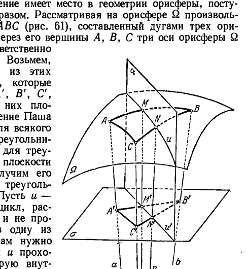

## 7. Элементарная геометрия на поверхностях пространства Лобачевского

---
**стр. 136**
---

**7. Элементарная геометрия на поверхностях пространства Лобачевского**

**§ 45.** С давних пор хорошо известны две геометрические системы на двумерных многообразиях евклидова пространства: геометрия на плоскости (планиметрия) и геометрия на сфере. В построении этих геометрических систем фундаментальную роль играет следующее обстоятельство: как плоскость, так и сфера могут перемещаться по самим себе, не испытывая при этом деформации.

Точный смысл этого утверждения в соответствии с определениями, данными в § 19, можно выразить так: поверхность допускает движения по себе самой, если для множества ее точек возможны такие конгруэнтные перенесения, при которых все эти точки остаются на поверхности.

Если мы вообразим себе, например, сферу в виде гладкой деревянной модели, плотно покрытой тонким, но твердым футляром, то движения футляра по неподвижной модели будут наглядно представлять рассматриваемое явление.

Плоскость и сфера — не единственные поверхности евклидова пространства, которые могут перемещаться по себе; но они отличаются от других таких поверхностей большей степенью свободы допускаемых движений.

Всякая поверхность вращения тоже допускает движения по себе самой, однако это ее свойство по характеру свободы выбора движений, очевидно, отлично от соответствующего свойства сферы или плоскости. Чтобы уяснить это различие, сравним, например сферу, круглый цилиндр и эллипсоид вращения.

Единственными движениями эллипсоида по себе самому являются вращения его вокруг оси. Каждая точка эллипсоида при этом перемещается по определенной траектории так, что для двух произвольно указанных точек, вообще говоря, не существует движения, которое приводило бы их к совмещению друг с другом.

Круглый цилиндр, кроме вращения, допускает еще движения в направлении оси; сочетая движения этих двух видов, можно, очевидно, совместить любую точку цилиндра с любой другой его точкой.

Мы скажем, что совокупность движений, которые допускает некоторая поверхность, *транзитивна*, если любые две точки поверхности могут быть совмещены друг с другом с помощью некоторого движения.

Таким образом, круглый цилиндр допускает транзитивную совокупность движений; наоборот, совокупность движений эллипсоида вращения нетранзитивна.

Легко видеть, что совокупность движений сферы транзитивна, как и в случае круглого цилиндра. Однако и здесь существует важное различие. Чтобы уяснить его, будем рассматривать ли-

---
**стр. 137**
---

нейные элементы поверхности. Линейным элементом называют точку вместе с некоторым направлением, которое следует представлять себе определенным стрелкой, исходящей из данной точки в касательной плоскости. Линейные элементы считаются тождественными, если их точки совмещены, а стрелки направлены в одну и ту же сторону.

Возьмем на круглом цилиндре два линейных элемента, точки которых могут занимать произвольное положение, а направления их выберем так, чтобы у одного из них оно было перпендикулярным к оси цилиндра, у другого — параллельным. Путем движения мы можем совместить точки этих линейных элементов, однако линейные элементы нам совместить не удастся.

Напротив, для двух произвольных линейных элементов сферы всегда существует движение, которое совмещает их друг с другом. Так, вращая сферу вокруг некоторой оси, можно совместить сначала точки линейных элементов; после этого вращением вокруг оси, на которой находятся совмещенные точки, можно совместить также и направления.

Мы будем называть совокупность движений, которые допускает поверхность, *транзитивной относительно линейных элементов*, если любую пару линейных элементов этой поверхности можно привести к совмещению.

Мы можем, таким образом, сказать, что, например, эллипсоид вращения обладает нетранзитивной совокупностью движений, а совокупность движений круглого цилиндра и сферы — транзитивна, причем в последнем случае даже транзитивна относительно линейных элементов. Также транзитивна относительно линейных элементов и совокупность движений плоскости.

В основных предложениях планиметрии, относящихся к сравнению геометрических величин, существенно используется возможность достаточного свободного движения плоских фигур. Определяя, например, длину прямолинейного отрезка $AB$, откладывают на этом отрезке от точки $A$ отрезок, длина которого заранее принята равной единице, столько раз, сколько это возможно сделать, не переступая за точку $B$. Так определяется длина $AB$ с точностью до целых единиц. Определяя подобным же образом, сколько раз на отрезке $AB$ укладывается половина единицы измерения, находят длину $AB$ с точностью до одной второй, и так далее с любой степенью точности (см. § 20). Таким образом, измерение основано на возможности такого перемещения отрезка, при котором начало его помещается в наперед назначенную точку, а сам отрезок располагается на произвольно указанной прямой, проходящей через эту точку. Иначе говоря, при этом используется транзитивность совокупности движений плоскости относительно ее линейных элементов.

---
**стр. 138**
---

В сферической геометрии ту же роль, что и прямые в планиметрии, играют большие круги сферы. Источником этого являются следующие три обстоятельства:
1. Среди всех линий, соединяющих на сфере какие-нибудь две точки, кратчайшей является дуга большого круга.
2. Через всякие две точки сферы, не являющиеся ее диаметрально противоположными точками, проходит один и только один большой круг.
3. Большой круг определяется любым своим линейным элементом.
(Линейным элементом линии мы называем линейный элемент, точка которого принадлежит этой линии, а стрелка направлена по касательной к линии.)

Развивая сферическую геометрию, мы могли бы производить измерения геометрических величин на сфере, рассматривая эти величины как объекты пространственной геометрии. Например, длину дуги большого круга можно определять, полагая ее равной точной верхней грани длин вписанных ломаных, вершины которых последовательно расположены на дуге, а звеньями являются прямолинейные отрезки. Так поступают при определении длины дуги произвольной линии пространства.

Но можно развивать сферическую геометрию, не оперируя геометрическими объектами, не расположенными на сфере (как прямолинейные звенья вписанных ломаных). Это можно выполнить, идя по пути аналогии с планиметрией. Например, чтобы перенести в сферическую геометрию описанный выше процесс измерения прямолинейного отрезка, нужно начать с выбора единицы длины. Пусть длина некоторой дуги большого круга принята равной единице (для наглядности рекомендуем читателю представлять себе эту дугу малой сравнительно с размерами сферы). Если требуется измерить какую-нибудь дугу большого круга $AB$, следует, перемещая единицу измерения по сфере, отложить ее от точки $A$ на дуге $AB$ столько раз, сколько это возможно сделать, не переступая за точку $B$. Так определится длина $AB$ с точностью до целой единицы. Определяя подобным же образом, сколько раз на дуге укладывается половина единицы измерения, можно найти длину дуги $AB$ с точностью до одной второй, и так далее с любой степенью точности. Очевидно, при этом существенно используется транзитивность совокупности движений сферы относительно ее линейных элементов.

Измерение других геометрических величин (углов, площадей) производится аналогично с помощью наложения на данный сферический образ заранее выбранной единицы или ее долей. Использовать при этом объекты пространства, не принадлежащие сфере, нет надобности.

---
**стр. 139**
---

Можно рассматривать также геометрию на любой поверхности. Роль прямых в этом общем случае играют геодезические линии. Геодезическую линию можно определить как такую линию, каждая достаточно малая дуга $AB$ которой короче всякой другой дуги на поверхности с теми же концами $AB$. На сфере радиуса $R$, например, окружности больших кругов являются геодезическими линиями, так как дуга большого круга с длиною, меньшей $\pi R$, короче всякой другой дуги на сфере с теми же концами.

При некоторых ограничениях аналитического характера, наложенных на поверхность, можно доказать, что геодезическая линия определяется каждым своим линейным элементом, т. е. точкой и направлением, как и прямая на плоскости.

Представим себе теперь, что на поверхности каким-либо образом найдена совокупность всех геодезических линий. Тогда, если речь идет о построении геометрии данной поверхности, естественно возникает вопрос: можно ли делать сравнение длин отрезков геодезических таким же путем, как в планиметрии или в сферической геометрии? Для этого, очевидно, нужно иметь возможность путем движения поверхности по себе перемещать дугу геодезической, выбранную за единицу измерения, так, чтобы ее начало располагалось в любой точке и чтобы она принимала любое назначенное направление. В тех случаях, когда сравнение длин геодезических можно производить путем наложения единицы измерения, будем говорить, что поверхность допускает *элементарную геометрию*. Для того чтобы поверхность допускала элементарную геометрию, очевидно, необходимо, чтобы совокупность ее движений по себе была транзитивной относительно линейных элементов.

Можно доказать, что единственными поверхностями евклидова пространства с транзитивной относительно линейных элементов совокупностью движений являются плоскость и сфера. Отсюда следует, что в евклидовом пространстве двумерная элементарная геометрия может быть лишь на плоскости (планиметрия) и на сфере (сферическая геометрия).

В пространстве Лобачевского, кроме плоскости и сферы, существуют еще две поверхности, допускающие элементарную геометрию. Таковыми являются уже знакомые нам эквидистантная поверхность и орисфера.

То, что эти поверхности действительно допускают движения по себе, совокупность которых транзитивна относительно линейных элементов, по существу установлено в § 44, где мы показали, что каждая из этих поверхностей есть поверхность вращения вокруг любой своей нормали. В самом деле, если на эквидистантной поверхности или орисфере даны два произвольных линейных элемента, то, вращая поверхность вокруг некоторой нормали, можно совместить точки этих линейных элементов, после чего

---
**стр. 140**
---

вращением вокруг нормали, проходящей через совмещенные точки, можно привести к совмещению также и сами линейные элементы.

*Таким образом, мы можем утверждать, что в пространстве Лобачевского элементарная геометрия, кроме плоскости, осуществляется еще на сфере, на эквидистантной поверхности и на орисфере.*

Геометрия на сфере в пространстве Лобачевского не отличается от геометрии на сфере в евклидовом пространстве. Эту геометрию (сферическую) мы рассматривать здесь не будем. Напротив, мы постараемся в немногих словах описать геометрию на эквидистантной поверхности и со всей обстоятельностью исследуем геометрию на орисфере.

**§ 46.** Возьмем какую-нибудь эквидистантную поверхность $\Sigma$, база которой есть плоскость $\sigma$. В соответствии с общими идеями, изложенными в § 45, мы должны в качестве прямых геометрии поверхности $\Sigma$ рассматривать ее геодезические линии. Геодезическими поверхности $\Sigma$ являются эквидистанты, получаемые пересечением этой поверхности с плоскостями, перпендикулярными плоскости $\sigma$ (то, что это действительно так, пока оставим без доказательства).

Поэтому роль прямых на $\Sigma$ мы припишем указанным эквидистантам.

Наша цель — обнаружить систему предложений, из которой можно логическим путем вывести все свойства взаимных отношений между точками и эквидистантами поверхности $\Sigma$, т. е. дать аксиоматическое обоснование геометрии эквидистантной поверхности.

Как мы сейчас покажем, эта геометрия может быть обоснована аксиомами первых четырех групп Гильберта и аксиомой параллельных Лобачевского. (Следует только иметь в виду, что, поскольку сейчас речь идет о двумерной геометрии, из аксиом Гильберта должны быть исключены аксиомы I,4—I,8, так как они имеют пространственный характер; поэтому нам придется иметь дело лишь с аксиомами I,1—I,3, II, III, IV и с аксиомой параллельных.)

Чтобы получить желаемый результат возможно проще, спроектируем точки и эквидистанты поверхности $\Sigma$ на плоскость $\sigma$. Их проекциями будут соответственно точки и прямые. Условимся называть образы $\Phi$ и $\Phi'$, из которых $\Phi$ находится на $\Sigma$, а $\Phi'$ — на $\sigma$, соответствующими друг другу, если $\Phi'$ получается проектированием $\Phi$. Очевидно, что точки и эквидистанты на поверхности $\Sigma$ находятся в таких же отношениях взаимной принадлежности и порядка, в каких находятся соответствующие им точки и прямые плоскости $\sigma$. Поэтому в геометрии поверхности $\Sigma$ выполняются требования аксиом I, 1—I, 3 и II, так как эти аксиомы имеют место

---
**стр. 141**
---

Далее, два образа поверхности $\Sigma$ будем называть конгруэнтными, если они могут быть совмещены друг с другом при помощи некоторого движения поверхности $\Sigma$ по самой себе, а также, если они симметричны относительно какой-нибудь плоскости. Согласуем теперь возможные перемещения поверхности $\Sigma$ и плоскости $\sigma$ друг с другом так, как если бы $\Sigma$ и $\sigma$ составляли в пространстве твердое тело. Тогда каждое движение плоскости $\sigma$, совмещающее какие-нибудь ее образы $\Phi'$ и $\Psi'$, повлечет за собой движение поверхности $\Sigma$, совмещающее на ней образы $\Phi$ и $\Psi$, соответствующие образам $\Phi'$ и $\Psi'$. Иначе говоря, образы поверхности $\Sigma$ находятся в таких же отношениях взаимной конгруэнтности, в каких находятся соответствующие образы плоскости $\sigma$. Отсюда мы можем заключить, что в геометрии поверхности $\Sigma$ удовлетворяются требования аксиом конгруэнтности III, так как эти аксиомы имеют место в геометрии плоскости.

Таким же путем можно убедиться, что в геометрии поверхности $\Sigma$ справедливы аксиомы непрерывности IV.

Рассмотрим теперь на поверхности $\Sigma$ произвольную эквидистанту $a$ и точку $A$, лежащую вне этой эквидистанты. Проектируя эквидистанту $a$ и точку $A$ на плоскость $\sigma$, мы получим в качестве их проекций прямую $a'$ и точку $A'$. Предположим, что через точку $A'$ в плоскости $\sigma$ проведена какая-нибудь прямая $b'$; прямая $b'$ является проекцией некоторой эквидистанты $b$ на поверхности $\Sigma$, проходящей через точку $A$, и если $b'$ не встречает прямую $a'$, то и эквидистанта $b$ не будет иметь общей точки с эквидистантой $a$. Но в плоскости $\sigma$ имеет место геометрия Лобачевского, и, следовательно, через точку $A'$ проходит бесконечно много прямых, не пересекающих $a'$. Поэтому на поверхности $\Sigma$ через точку $A$ проходит бесконечно много эквидистант, не имеющих общих точек с эквидистантой $a$. А это означает, что в геометрии поверхности $\Sigma$ осуществляется постулат параллельных Лобачевского.

Итак, на поверхности $\Sigma$ верны все аксиомы абсолютной геометрии и аксиома Лобачевского. Следовательно, по отношению к точкам и эквидистантам поверхности $\Sigma$ верны все теоремы, какие существуют в неевклидовой планиметрии.

Мы можем, таким образом, заключить: *элементарная геометрия эквидистантной поверхности есть геометрия Лобачевского*.

В заключение — еще одно замечание. Придавая эквидистантам, получающимся нормальными сечениями эквидистантной поверхности $\Sigma$, роль прямых в геометрии этой поверхности, мы вначале не доказали, что они являются ее геодезическими линиями. Теперь это легко установить. В самом деле, так как на эквидистантной поверхности имеются все теоремы абсолютной геометрии, то можно обычными рассуждениями показать, что отрезок

---
**стр. 142**
---

эквидистанты короче всякой другой линии, которая на поверхности $\Sigma$ соединяет его концы.

**§ 47.** Теперь мы обратимся к рассмотрению элементарной геометрии на орисфере. Роль прямых в этой геометрии мы припишем орициклам, которые получаются сечением орисферы любою плоскостью, проходящей через какую-нибудь ось этой орисферы. (Опять мы оставляем открытым вопрос, являются ли такие орициклы геодезическими линиями орисферы или нет; на этот вопрос можно будет ответить утвердительно после того, как завершится исследование геометрии орисферы.) Наша ближайшая цель — показать, что взаимные отношения точек и орициклов на орисфере могут быть выражены аксиомами абсолютной геометрии. Затем мы выясним, какая теория параллельных соответствует орисфере: Евклида или Лобачевского.

Проверка аксиом первой группы I,1—I,3 проводится в двух словах. Пусть $A$ и $B$ — две произвольные точки орисферы, $a$ и $b$ — проходящие через эти точки оси. Так как любые две оси орисферы лежат в одной плоскости, то прямые $a$ и $b$ определяют точно одну плоскость $\alpha$, которая их содержит. Пересечением плоскости $\alpha$ и рассматриваемой орисферы (ее мы в дальнейшем будем обозначать через $\Omega$) определится точно один орицикл $u$, проходящий через точки $A$ и $B$. Итак, каковы бы ни были две точки $A$ и $B$ орисферы $\Omega$, они определяют один и только один проходящий через них орицикл.

Тем самым установлено, что в геометрии орисферы выполняются требования аксиом I,1—I,2. То, что любой орицикл имеет не менее двух точек и орисфера — не менее трех точек, не лежащих на одном орицикле (на самом деле и в том и в другом случаях имеется даже бесконечно много точек), т. е. что в геометрии орисферы выполнены требования аксиомы I,3, непосредственно следует из определения орицикла и орисферы и из простейших теорем стереометрии Лобачевского (в наших описаниях орицикл и орисферы мы не останавливались на доказательствах столь очевидных их свойств, чтобы не отвлекать внимания читателя излишними деталями).

Далее нужно проверить, выполняются ли на орисфере аксиомы порядка II,1—II,4. Сначала следует высказать условия, при которых мы считаем точку орицикла расположенной между двумя другими его точками. Пусть дан некоторый орицикл $u$, содержащийся в плоскости $\alpha$, и на нем три точки $A, B, C$. Мы скажем, что точка $B$ на этом орицикле лежит между точками $A$ и $C$, если ось его $b$, проходящая через $B$, лежит в плоскости $\alpha$ между осями $a$ и $c$, проходящими, соответственно, через $A$ и $C$ (т. е. если в плоскости $\alpha$ точки прямых $a$ и $c$ лежат по разные стороны от прямой $b$). Без труда можно усмотреть, что требования линейных аксиом порядка

---
**стр. 143**
---

II,1—II,3 при этом оказываются удовлетворенными. Несколько сложнее проверить предложение Паша II,4. Чтобы убедиться, что и это предложение имеет место в геометрии орисферы, поступим следующим образом. Рассматривая на орисфере $\Omega$ произвольный треугольник $ABC$ (рис. 61), составленный дугами трех орициклов, проведем через его вершины $A, B, C$ три оси орисферы $\Omega$ и пометим их соответственно буквами $a, b, c$.

Возьмем, далее, на каждой из этих прямых по точке, которые обозначим через $A', B', C'$, и проведем через них плоскость $\sigma$. Предложение Паша II,4 справедливо для всякого прямолинейного треугольника, в том числе и для треугольника $A'B'C'$ в плоскости $\sigma$. Отсюда мы получим его справедливость для треугольника $ABC$ на $\Omega$. Пусть $u$ — какой-нибудь орицикл, расположенный на $\Omega$ и не проходящий ни через одну из точек $A, B, C$. Нам нужно показать, что если $u$ проходит через некоторую внутреннюю точку $M$ отрезка орицикла $AB$, то $u$ проходит либо через одну из внутренних точек отрезка орицикла $BC$, либо через одну из внутренних точек отрезка орицикла $AC$. Заметим, что плоскость $\alpha$, в которой лежит орицикл $u$, и плоскость $ABB'A'$ пересекаются по проходящей через точку $M$ оси $m$ орисферы $\Omega$. Эта ось $m$ в плоскости $ABB'A'$ расположена между осями $a$ и $b$, так как точка $M$ лежит между точками $A$ и $B$. Поэтому $m$ должна встретить прямолинейный отрезок $A'B'$ в некоторой его внутренней точке $M'$. Тогда в силу аксиомы Паша II,4 прямая $u'$, по которой пересекаются плоскости $\alpha$ и $\sigma$, проходит через внутреннюю точку одного из отрезков $B'C'$ или $A'C'$. Допустим для определенности, что прямая $u'$ содержит внутреннюю точку $N'$ отрезка $B'C'$. Тогда плоскости $\alpha$ и $BCC'B'$, имея общую точку $N'$, должны пересекаться по некоторой прямой $n$. Но плоскости $\alpha$ и $BCC'B'$ проходят через две параллельные прямые $m$ и $b$; в силу леммы III § 35, прямая $n$, по которой эти плоскости пересекаются, параллельна каждой из прямых $m$ и $b$, а значит,

---
**стр. 144**
---

параллельна также прямой $c$. Так как точка $N'$ лежит между точками $B'$ и $C'$, то прямая $n$, параллельная прямым $b$ и $c$, расположена между ними. С другой стороны, как всякая прямая, параллельная осям орицикла $BC$ и лежащая в его плоскости, она является также осью этого орицикла и поэтому пересекает его в некоторой точке $N$ (см. § 38). Так как $n$ находится между прямыми $b$ и $c$, то и точка $N$ на орицикле $BC$ лежит между точками $B$ и $C$.

Поскольку прямая $n$ лежит в плоскости $\alpha$, эта плоскость содержит точку $N$. Таким образом, в числе точек пересечения плоскости $\alpha$ и орисферы $\Omega$, т. е. в числе точек орицикла $u$, содержится некоторая внутренняя точка отрезка орицикла $BC$. Тем самым предложение Паша в геометрии орисферы доказано.

Перейдем к аксиомам конгруэнтности III,1 — III,5.

Аксиома III,1 требует, чтобы на любом орицикле орисферы $\Omega$ от любой его точки и в любую сторону можно было однозначно отложить отрезок, конгруэнтный любому данному отрезку другого орицикла; аксиома III,4 требует, чтобы на орисфере $\Omega$ с любой стороны от данного орицикла можно было приложить к этому орицикл угол, конгруэнтный произвольно данному углу; положение вершины при этом может быть назначено произвольно и, если она указана, построение должно быть однозначным.

Обе эти аксиомы выполняются в геометрии орисферы вследствие того, что орисфера допускает перемещения по самой себе, совокупность которых транзитивна относительно линейных элементов. Однозначность требуемых построений вытекает из теоремы Б § 19.

Далее, аксиома III,2 выполняется вследствие группового свойства движений (см. § 19).

Чтобы доказать в геометрии орисферы $\Omega$ предложение III,3, рассмотрим на этой поверхности два орицикла $u$ и $u'$. Возьмем на орицикле $u$ три точки $A, B, C$, расположенные так, что $B$ лежит между $A$ и $C$; пусть $A', B', C'$ — три точки орицикла $u'$, находящиеся в аналогичном расположении. Если $AB \equiv A'B'$, то существует движение орисферы по самой себе, приводящее точку $A'$ к совмещению с точкой $A$ и точку $B'$ к совмещению с точкой $B$. Если еще $BC \equiv B'C'$, то из теоремы Б § 19 следует, что точка $C'$ при этом движении совместится с точкой $C$. Таким образом, при рассматриваемом движении отрезок $A'C'$ наложится на отрезок $AC$, т. е. из $AB \equiv A'B'$ и $BC \equiv B'C'$ следует $AC \equiv A'C'$.

Столь же простыми рассуждениями может быть доказано и предложение III,5.

Остается проверить выполнение аксиом непрерывности IV,1 и IV,2. При изучении геометрии орисферы, вместо того чтобы проверять отдельно выполнение аксиомы Архимеда IV,1 и аксиомы Кантора IV,2, выгоднее установить, что выполняется принцип Дедекинда. Если мы это установим, то при наличии предложений

---
**стр. 145**
---

I—III, в силу теоремы 41 § 23, предложения IV,1 и IV,2 на орисфере также будут верны.

Рассмотрим на орисфере произвольный орицикл $u$ и обозначим его плоскость буквой $\alpha$. Пусть в множестве точек этого орицикла произведено некоторое дедекиндово сечение. Возьмем в первом классе сечения произвольную точку $A$, во втором — точку $B$; через эти точки проведем соответственно оси орицикла $a$ и $b$. Выбрав на первой из этих прямых какую-нибудь точку $A'$, на второй — точку $B'$, построим прямую $u'$, определяемую точками $A'$ и $B'$. Заметим теперь, что через каждую точку $M'$ прямой $u'$, как и вообще через каждую точку плоскости $\alpha$, проходит точно одна ось орицикла $u$, пересекающая его в одной определенной точке $M$. Таким образом, каждой точке $M'$ прямой $u'$ с помощью нашей конструкции ставится в соответствие определенная точка $M$ орицикла $u$. Мы распределим все точки прямой $u'$ на два класса по правилу: точку $M'$ этой прямой отнесем в первый класс, если соответствующая ей точка $M$ на орицикле $u$ принадлежит первому классу дедекиндова сечения, заданного на этом орицикле, и во второй класс, если соответствующая точка на орицикле принадлежит второму классу. Очевидно, это распределение точек прямой $u'$ является дедекиндовым сечением. Так как на прямых пространства Лобачевского имеет место принцип Дедекинда, то мы можем утверждать, что в одном из классов дедекиндова сечения, которое получилось на прямой $u'$, имеется замыкающий элемент.

Пусть этим элементом является точка $X'$. Предположим для определенности, что $X'$ есть первая точка второго класса. Поскольку $A'$ и $B'$ входят в разные классы, $X'$ должна лежать между ними или, в крайнем случае, совпадать с точкой $B'$. Соответствующая точке $X'$ на орицикле точка $X$ входит во второй класс дедекиндова сечения на этом орицикле и лежит между $A$ и $B$, в крайнем случае совпадая с $B$. Если $X$ не замыкает второй класс на орицикле, то между $A$ и $X$ существует точка $Y$, также принадлежащая второму классу. Ось $y$ орицикла $u$, проходящая через точку $Y$, расположена между осями $AA'$ и $XX'$; поэтому она должна пересечь отрезок $A'X'$ в некоторой его точке $Y'$. Точка $Y'$ на прямой $u'$ входит во второй класс, так как точка $Y$ принадлежит второму классу на орицикле $u$. Но вместе с тем $Y'$, по ее построению, расположена на прямой $u'$ ближе к точкам первого класса, чем точка $X'$. А это невозможно, так как $X'$ есть первая точка второго класса. Полученное противоречие показывает, что $X$ необходимо замыкает второй класс. Если бы мы предположили, что $X'$ на $u'$ замыкает первый класс, то аналогичным путем убедились бы, что соответствующая ей точка $X$ замыкает первый класс сечения на орицикле.

Итак, какого бы ни было дедекиндово сечение на орицикле, один из классов этого сечения необходимо имеет замыкающий

---
**стр. 146**
---

элемент. Тем самым мы показали, что в геометрии орисферы имеет место принцип Дедекинда. Из теоремы 41 § 23 тогда следует, что на орисфере справедливы утверждения аксиом непрерывности IV,1 и IV,2.

Проведенное нами исследование позволяет заключить, что на орисфере верны все предложения абсолютной геометрии. Действительно, все они могут быть получены логическим путем из аксиом I—IV, справедливость которых установлена.

Теперь нам надлежит выяснить вопрос: какая же теория параллельных осуществляется в геометрической системе орисферы — Евклида или Лобачевского?

Ответ на этот вопрос труда не представит.

Возьмем на орисфере $\Omega$ какой-нибудь орицикл $a$, плоскость которого обозначим буквой $\alpha$. Пусть будет $P$ — произвольная точка орисферы $\Omega$, не лежащая на орицикле $a$. Проведем через точку $P$ ось $p$ орисферы. Из теоремы XII § 35 следует, что прямая $p$ параллельна плоскости $\alpha$.

Представим себе теперь, что через точку $P$ проведен произвольный орицикл $b$. Его плоскость $\beta$ пройдет через прямую $p$. Орицикл $b$ не будет иметь общей точки с орициклом $a$ только в том случае, когда плоскость $\beta$ не пересекает плоскости $\alpha$. Но так как прямая $p$ параллельна плоскости $\alpha$, то, по теореме XIV § 35, через нее проходит точно одна плоскость $\beta$, не пересекающая плоскости $\alpha$.

Следовательно, через точку $P$ на орисфере $\Omega$ проходит точно один орицикл, не встречающий орицикла $a$. Таким образом, на орисфере имеет место евклидов постулат о параллельных.

Мы можем высказать теперь следующее утверждение: *элементарная геометрия орисферы есть геометрия Евклида*.

Это замечательное обстоятельство играет важную роль в развертывании геометрии Лобачевского. Но и независимо от его использования оно само по себе представляет исключительный интерес. Оказывается, что отвергая V постулат Евклида в двумерной геометрии каждой плоскости, мы все-таки находим его в двумерной геометрии некоторой другой поверхности.

Интересно сопоставить геометрии на эквидистантной поверхности, на орисфере и на обыкновенной сфере, рассматривая в этих геометриях предложение о сумме углов треугольника.

Так как на эквидистантной поверхности имеет место геометрия Лобачевского, то всякий треугольник, составленный дугами геодезических линий (т. е. дугами эквидистант), имеет сумму внутренних углов, меньшую двух прямых.

На орисфере, поскольку на ней осуществляется геометрия Евклида, геодезический треугольник (составленный дугами орициклов) имеет сумму углов, равную двум прямым.
