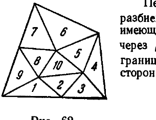
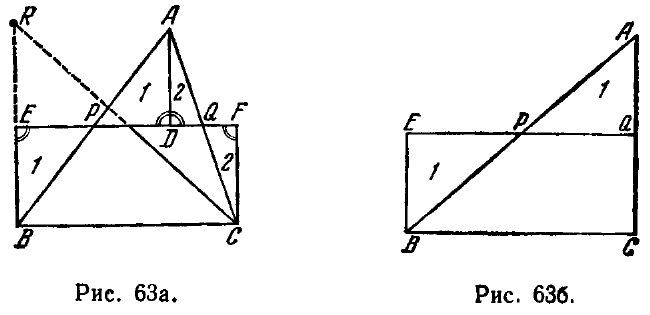
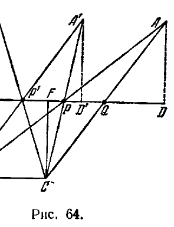
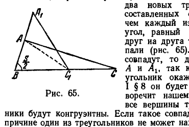

## 8. Площадь треугольника

---
**стр. 147**
---

Сферический треугольник, стороны которого являются дугами больших кругов (т. е. геодезических линий сферы), имеет сумму углов, большую двух прямых. На сфере существует даже геодезический треугольник с тремя прямыми углами.

Таким образом, в сферической геометрии справедливо как раз то предложение, ложность которого в абсолютной геометрии устанавливали многие геометры (Лежандр, Саккери, Ламберт; последние — под видом гипотезы тупого угла).

Конечно, это объясняется тем, что геометрия сферы еще менее сходна с геометрией евклидовой плоскости, чем геометрия плоскости Лобачевского.

Действительно, в геометрии сферы неверна не только евклидова аксиома параллельных, но неверно и большинство аксиом абсолютной геометрии (например, две геодезические линии сферы всегда пересекаются в двух точках; к точкам геодезической линии неприменимо понятие «между» и т. д.).

В заключение заметим, что пространство Лобачевского в одном отношении богаче, чем пространство Евклида; именно, в то время как в евклидовом пространстве существуют только две элементарные геометрии двумерных многообразий — сферическая и евклидова, в пространстве Лобачевского на различных поверхностях осуществляются все три известные нам геометрические системы.

**8. Площадь треугольника**

**§ 48.** В предыдущем разделе мы рассматривали только угловые и линейные величины. Теперь мы займемся задачей определения площади фигур на плоскости Лобачевского.

Определяя площадь, мы используем понятие равносоставленности фигур: две фигуры называются равносоставленными, если их можно разложить на одинаковое число попарно конгруэнтных треугольников. Некоторое время мы будем ограничиваться рассмотрением только треугольников.

Имеет место следующее предложение: *необходимым и достаточным условием равносоставленности двух треугольников является равенство их дефектов*.

Напомним, что дефектом треугольника $\Delta$ называют разность

$$D(\Delta) = \pi - S(\Delta),$$

где $S(\Delta)$ — сумма внутренних углов треугольника; по теореме Лежандра (предложение III § 8) в неевклидовой геометрии $S(\Delta) < \pi$ и $D(\Delta) > 0$.

Доказательство необходимости высказанного признака опирается на следующие две леммы.

**Л е м м а I.** *Пусть дано разбиение некоторой односвязной области, ограниченной замкнутой ломаной линией, на треугольники так, что при этом выполняются следующие условия: каждые два треугольника разбиения либо совсем не имеют общих точек, либо имеют одну общую вершину, либо общую сторону. Тогда, если $\alpha^2$ обозначает число всех треугольников разбиения, $\alpha_i^0$ — число вершин этих треугольников, лежащих внутри области, и $\alpha_e^0$ — число вершин на границе, то имеет место равенство*

$$\alpha^2 - 2\alpha_i^0 - \alpha_e^0 = -2. \qquad \text{(A)}$$

---
**стр. 148**
---

(На рис. 62 $\alpha^2 = 10$, $\alpha_i^0 = 3$, $\alpha_e^0 = 6$.)

При доказательстве мы будем предполагать известной формулу Эйлера

$$\alpha^2 - \alpha^1 + \alpha^0 = 1,$$

где $\alpha^1$ — число всех сторон треугольников разбиения, $\alpha^0$ — число всех вершин *).

Перенумеруем как-нибудь вершины треугольников разбиения и обозначим через $p_{ik}^2$ число треугольников, имеющих общую внутреннюю вершину с номером $k$, через $p_{er}^2$ — число треугольников с общей вершиной на границе, помеченной номером $r$. Пусть $p_{ik}^1$ и $p_{er}^1$ — число сторон, исходящих из тех же вершин. Тогда, очевидно,

$$\left.\begin{aligned} p_{ik}^2 &= p_{ik}^1, \\ p_{er}^2 &= p_{er}^1 - 1. \end{aligned}\right\} \qquad \text{(Б)}$$

С другой стороны, суммируя по всем внутренним и внешним вершинам, найдем:

$$\sum_k p_{ik}^2 + \sum_r p_{er}^2 = 3\alpha^2,$$

$$\sum_k p_{ik}^1 + \sum_r p_{er}^1 = 2\alpha^1.$$

Вычтем из нижнего равенства верхнее; на основании (Б) будем иметь:

$$\alpha_e^0 = 2\alpha^1 - 3\alpha^2.$$

Исключая отсюда и из тождества Эйлера

$$\alpha^2 - \alpha^1 + \alpha^0 = 1$$

величину $\alpha^1$, мы получим:

$$\alpha^2 - 2\alpha^0 + \alpha_e^0 = -2.$$

Но $\alpha^0 = \alpha_i^0 + \alpha_e^0$; внося это выражение вместо $\alpha^0$ в предыдущее равенство, найдем желаемый результат:

$$\alpha^2 - 2\alpha_i^0 - \alpha_e^0 = -2.$$

Разбиения областей на треугольники, подчиненные условиям, высказанным в формулировке леммы I, в топологии называются *триангуляциями*.

**Л е м м а II.** *Если треугольник $\Delta$ составлен из треугольников $\Delta_1, \Delta_2, \dots, \Delta_n$, то*

$$D(\Delta) = D(\Delta_1) + \dots + D(\Delta_n).$$

Эта лемма, очевидно, является обобщением леммы I § 8, согласно которой при разбиении треугольника $ABC$ трансверсалью $BD$ на два треугольника $ABD$ и $BDC$ имеет место равенство

$$D(ABC) = D(ABD) + D(BDC).$$

Вместе с тем из леммы I § 8 следует, что при доказательстве леммы II можно свести дело к рассмотрению случая, когда разбиение треугольника $\Delta$ является триангуляцией.

*) См., например, П. С. Александров и В. А. Ефремович, Очерк основных понятий топологии, ОНТИ, 1936.

---
**стр. 149**
---

В самом деле, примыкание треугольников $\Delta_1, \Delta_2, \dots, \Delta_n$ друг к другу не удовлетворяет условиям триангуляции, если вершины некоторых треугольников $\Delta_i$ совпадают с внутренними точками сторон некоторых других треугольников $\Delta_j$. Но тогда, соединяя поочередно вершины треугольников $\Delta_i$, лежащие на сторонах соседних треугольников, с противоположными этим сторонам вершинами последних, мы получим новую систему треугольников $\Delta'_1, \dots, \Delta'_m$. Разбиение треугольника $\Delta$ на треугольники $\Delta'_1, \dots, \Delta'_m$ будет уже триангуляцией. Но при этом сумма дефектов треугольников $\Delta'_1, \dots, \Delta'_m$ равна сумме дефектов треугольников $\Delta_1, \dots, \Delta_n$, так как каждый раз при разделении треугольника $\Delta_i$ трансверсалью получаются два новых треугольника, сумма дефектов которых по лемме I § 8 равна дефекту треугольника $\Delta_i$.

Таким образом, для доказательства нашей леммы достаточно установить равенство

$$D(\Delta'_1) + \dots + D(\Delta'_m) = D(\Delta).$$

Обозначим через $l$ число вершин треугольников $\Delta'_1, \dots, \Delta'_m$, лежащих внутри $\Delta$, и через $p$ — число вершин, расположенных на сторонах треугольника $\Delta$ (три вершины треугольника $\Delta$ не учитываются). Тогда имеет место соотношение

$$m - 2l - p = 1. \qquad \text{(B)}$$

Это соотношение получается незначительной переделкой из равенства (A) предыдущей леммы. Действительно, применяя лемму I к разбиению треугольника $\Delta$ на треугольники $\Delta'_1, \dots, \Delta'_m$, мы должны получить:

$$\alpha^2 = m, \quad \alpha_i^0 = l, \quad \alpha_e^0 = p + 3.$$

Внося эти выражения в равенство (A), получим (B).

Рассмотрим теперь сумму $D(\Delta'_1) + \dots + D(\Delta_m)$. Очевидно,

$$D(\Delta'_1) + \dots + D(\Delta'_m) = m\pi - [S(\Delta'_1) + \dots + S(\Delta'_m)].$$

Сумма углов треугольников $\Delta'_1, \dots, \Delta'_m$, примыкающих к каждой их общей вершине, лежащей внутри $\Delta$, равна $2\pi$; углы, примыкающие к каждой вершине, расположенной на стороне треугольника $\Delta$, в сумме составляют $\pi$; наконец, сумма углов треугольников $\Delta'_1, \dots, \Delta'_m$ при тех вершинах, которые совпадают с вершинами треугольника $\Delta$, равна $S(\Delta)$. Поэтому

$$S(\Delta'_1) + \dots + S(\Delta'_m) = 2l\pi + p\pi + S(\Delta).$$

Отсюда

$$D(\Delta'_1) + \dots + D(\Delta'_m) = (m - 2l - p)\pi - S(\Delta)$$

и согласно (B)

$$D(\Delta'_1) + \dots + D(\Delta'_m) = \pi - S(\Delta) = D(\Delta).$$

Но так как

$$D(\Delta'_1) + \dots + D(\Delta'_m) = D(\Delta_1) + \dots + D(\Delta_n),$$

то

$$D(\Delta_1) + \dots + D(\Delta_n) = D(\Delta).$$

Лемма II доказана.

Следующая теорема выражает необходимость указанного выше признака равносоставленности треугольников.

---
**стр. 150**
---

**Т е о р е м а I.** *Равносоставленные треугольники имеют равные дефекты.*

Пусть треугольники $\Delta$ и $\Delta'$ разложены на одинаковое число попарно конгруэнтных треугольников $\Delta_1, \Delta_2, \dots, \Delta_n$ и $\Delta'_1, \Delta'_2, \dots, \Delta'_n$. Нумерацию треугольников мы предположим установленной так, что треугольники $\Delta_i$ и $\Delta'_i$ с одинаковыми номерами конгруэнтны. По лемме II,

$$D(\Delta) = D(\Delta_1) + \dots + D(\Delta_n)$$

и

$$D(\Delta') = D(\Delta'_1) + \dots + D(\Delta'_n).$$

Но так как конгруэнтные треугольники, очевидно, имеют равные дефекты, то

$$D(\Delta_i) = D(\Delta'_i).$$

Отсюда и из предыдущих равенств

$$D(\Delta) = D(\Delta').$$

Достаточность признака равносоставленности треугольников выражает

**Т е о р е м а II.** *Если треугольники имеют равные дефекты, то они равносоставлены.*

Доказательство этой теоремы мы сведем к установлению ряда лемм *).

**Л е м м а $\alpha$.** *Две фигуры, равносоставленные с некоторой третьей, равносоставлены друг с другом.*

Пусть фигуры $A$ и $B$ равносоставлены с фигурой $C$. Представим себе, что на каждой из фигур $A$, $B$ нанесены те прямые, которые разбивают ее на части, конгруэнтные частям фигуры $C$. Начертим на фигуре $C$ прямые, разбивающие ее на части, соответственно конгруэнтные частям фигуры $A$, и потом — прямые, разбивающие ее на части, соответственно конгруэнтные частям фигуры $B$. Тогда, очевидно, и те и другие прямые вместе разобьют фигуру $C$ на части, из которых можно составить как фигуру $A$, так и фигуру $B$.

**Л е м м а $\beta$.** *Если $E$ и $F$ — основания перпендикуляров, опущенных из вершин $B$ и $C$ треугольника $ABC$ на прямую, соединяющую середины $P$ и $Q$ его сторон $AB$ и $AC$, то $BCFE$ есть четырехугольник Саккери и треугольник $ABC$ равносоставлен с четырехугольником $BCFE$.*

Прежде всего докажем, что $BCFE$ есть четырехугольник Саккери. Опустим из точки $A$ перпендикуляр $AD$ на прямую $PQ$: очевидно, имеют место равенства треугольников: $\Delta BEP = \Delta ADP$ и $\Delta CFQ = \Delta ADQ$, откуда $BE = AD$ и $CF = AD$. Следовательно, $BE = CF$, и таким образом, $BCFE$ действительно является четырехугольником Саккери. Чтобы установить равносоставленность треугольника $ABC$ с четырехугольником $BCFE$, приходится рассматривать два случая.

1) Отрезок $PQ$ является частью отрезка $EF$ (рис. 63а и б).

В этом случае равносоставленность фигур $ABC$ и $BCFE$ усматривается непосредственно из рис. 63а и б, где равные треугольники помечены одинаковыми цифрами (фигура, изображенная на рис. 63б, соответствует тому случаю, когда $F$ и $Q$ совпадают).

2) Отрезок $PQ$ лежит, по крайней мере частично, вне $EF$ (рис. 64). В этом случае заметим прежде всего, что

$$PQ = \frac{1}{2} EF.$$

В самом деле, из очевидных равенств треугольников $\Delta BEP = \Delta ADP$ и $\Delta CFQ = \Delta ADQ$

*) Нижеприводимые леммы частично заимствованы из книги: Б а л ь д у с, «Неевклидова геометрия», М.— Л., 1933.

---
**стр. 151**
---

следует $EP = PD$ и $FQ = QD$, откуда $EP - FQ = PD - QD$ или $EF - PQ = PQ$, т. е. $2PQ = EF$ и $PQ = \frac{1}{2} EF$.

Далее, соединим точку $C$ с точкой $P$ и отложим на соединяющей прямой отрезок $PA' = PC$. Вслед за тем соединим точку $A'$ с точкой $B$. Пусть $P'$ — точка, в которой прямая $EF$ пересекает сторону $BA'$ треугольника $A'BC$.

Нетрудно установить, что $P'$ есть середина стороны $A'B$. Действительно, если $A'D'$ — перпендикуляр, опущенный из $A'$ на $EF$, то $A'D' = CF = BE$, поэтому $\Delta P'A'D' = \Delta P'BE$, откуда $BP' = P'A'$. Кроме того, треугольник $A'BC$ равносоставлен с треугольником $ABC$, так как эти треугольники имеют в качестве общей части треугольник $BPC$, а треугольники $BPA'$ и $CPA$ равны, поскольку они содержат равные углы между соответственно равными сторонами. Итак, исходя из треугольника $ABC$, мы можем построить так, как сейчас было указано, треугольник $A'BC$; аналогично, исходя из треугольника $A'BC$, — новый треугольник $A''BC$, и т. д. (рис. 64).

Все треугольники $ABC$, $A'BC$, $A''BC, \dots$ имеют общую среднюю линию и по предыдущему, а также вследствие леммы $\alpha$, равносоставлены друг с другом. При этом имеют место равенства отрезков:

$$QP = PP' = P'P'' = \dots = \frac{1}{2} EF.$$

Вследствие аксиомы Архимеда некоторой из этих треугольников расположен так, как предусмотрено в первом случае доказательства этой леммы, следовательно, он равносоставлен с четырехугольником Саккери $BCFE$; тем самым устанавливается равносоставленность с четырехугольником $BCFE$ исходного треугольника $ABC$. Лемма доказана.

**Л е м м а $\gamma$.** *Если два треугольника имеют равные дефекты и некоторая сторона одного из этих треугольников равна какой-нибудь стороне другого, то четырехугольники Саккери, соответствующие этим сторонам, конгруэнтны.*

---
ASSETS---
assets/Efimov_Vysshaya_geometria_5-e_izd_1971/p148-fig1.png
assets/Efimov_Vysshaya_geometria_5-e_izd_1971/p151-fig1.png
assets/Efimov_Vysshaya_geometria_5-e_izd_1971/p151-fig2.png

---
**стр. 152**
---

В самом деле, $\angle B$ и $\angle C$ четырехугольника $BCFE$ равны между собой, и, как легко усмотреть из рис. 63 или из рис. 64, величина каждого из них равна $S/2$, где $S$ — сумма углов треугольника $ABC$. Но четырехугольник Саккери вполне определяется верхним основанием и углом при этом основании, откуда следует справедливость леммы.

Из лемм $\alpha$, $\beta$ и $\gamma$ тотчас вытекает

**Л е м м а $\delta$.** *Если два треугольника имеют равные дефекты и некоторая сторона одного из них равна какой-нибудь стороне другого, то эти треугольники равносоставлены.*

Если на рис. 63 продолжим отрезок $BE$ до точки $R$ так, чтобы $BE=ER$, то середина стороны $RC$ треугольника $BRC$ будет лежать на прямой $EF$, что усматривается непосредственно. По лемме $\beta$ оба треугольника $BRC$ и $BAC$ равносоставлены с четырехугольником $BCEF$. Следовательно, по лемме $\alpha$ они равносоставлены друг с другом. Угол $EBC = \frac{S}{2}$. Мы доказали, таким образом, еще следующую лемму.

**Л е м м а $\epsilon$.** *Если сумма углов треугольника $ABC$ равна $S$, то можно построить равносоставленный с ним треугольник, один из углов которого будет иметь величину $S/2$.*

Рассмотрим теперь два треугольника, имеющих равные дефекты, а следовательно, и равные суммы углов $S$. Согласно лемме $\epsilon$ мы можем построить два новых треугольника, соответственно равносоставленных с данными треугольниками, причем каждый из новых треугольников имеет один угол, равный $S/2$. Наложим эти треугольники друг на друга так, чтобы их равные углы совпали (рис. 65). Если при этом вершины $C$ и $C_1$ совпадут, то должны будут совпасть и вершины $A$ и $A_1$, так как в противном случае один треугольник окажется частью другого и по лемме I § 8 он будет иметь меньший дефект, что противоречит нашему предположению. В этом случае все вершины треугольников совпадут и треугольники будут конгруэнтны. Если такое совпадение не имеет места, то по той же причине один из треугольников не может находиться полностью внутри другого; и треугольники расположатся так, как показано на рис. 65.

Проведя линию $AC_1$, убедимся на основании леммы I § 8, что треугольники $AC_1A_1$ и $AC_1C$ имеют равные дефекты и, следовательно, по лемме $\delta$, равносоставлены. Поэтому и треугольники $ABC$ и $A_1BC_1$ равносоставлены.

Тем самым теорема II полностью доказана.

Рассмотрим теперь произвольный треугольник $ABC$. Возьмем на его стороне $BC$ точку $D$ и положим $BC = a$, $BD = x$. Дефект треугольника $BAD$, очевидно, является некоторой функцией от $x$:

$$D(ABD) = D(x).$$

Если мы условимся считать $D(0) = 0$, то функция $D(x)$ будет определена при всех значениях $x$, $0 \leqslant x \leqslant a$.

Мы докажем, что $D(x)$ непрерывна при всех $x$, $0 \leqslant x \leqslant a$.

Обозначим величину $\angle BAD$ через $\alpha(x)$, величину $\angle BDA$ — через $\beta(x)$. Нам достаточно будет доказать непрерывность функций $\alpha(x)$ и $\beta(x)$. Так как обе эти функции монотонны, то непрерывность их будет доказана, коль скоро мы установим, что вместе с каждыми двумя своими значениями они принимают также все промежуточные.

Для функции $\alpha(x)$ это очевидно, так как прямую $AD$ можно провести под любым углом наклона к прямой $AB$. Легко усмотреть также, что

---
**стр. 153**
---

и угол наклона прямой $AD$ к прямой $BC$ принимает все возможные значения (между $0$ и $\pi$, если не ограничивать положение точки $D$ на прямой $BC$). В самом деле, возьмем $\angle MON$ с произвольной величиной $\beta_0$ и из переменной точки $M^*$ на стороне $OM$ этого угла опустим перпендикуляр $M^*N^*$ на сторону $ON$. Положим $OM^* = x^*$, $M^*N^* = y^*$. В силу леммы II § 30

$$y^* = f(x^*)$$

— непрерывная безгранично возрастающая монотонная функция. Отсюда следует, что существует ее значение $y^*_0$, равное длине высоты треугольника $ABC$, опущенной на сторону $BC$. Обозначим соответствующие положения точек $M^*$ и $N^*$ через $M^*_0$ и $N^*_0$. Расположим теперь треугольник $OM^*_0N^*_0$ так, чтобы точка $M^*_0$ совпала с точкой $A$, а сторона $M^*_0N^*_0$ расположилась на высоте, опущенной из вершины $A$ на сторону $BC$ треугольника $ABC$. Очевидно, при этом точки $O$ и $N^*_0$ окажутся на прямой $BC$. Обозначим точку, с которой совместится точка $O$, буквой $D_0$ и длину $BD_0$ — буквой $x_0$. По построению, $\beta(x_0)$ имеет наперед назначенную величину $\beta_0$; тем самым наше утверждение доказано: функция $D(x)$ непрерывна при $0 \leqslant x \leqslant a$.

После того как доказана непрерывность дефекта $D(x)$, можно высказать следующую теорему.

**Т е о р е м а III.** *Каково бы ни было число $\alpha$, удовлетворяющее неравенствам $0 < \alpha \leqslant \frac{1}{n}D(ABC)$, на стороне $BC$ треугольника $ABC$ существует система точек $D_1, D_2, \dots, D_n$ такая, что каждый из треугольников $BAD_1, D_1AD_2, \dots, D_{n-1}AD_n$ имеет дефект, равный $\alpha$.*

Доказательство вытекает из только что установленной непрерывности дефекта.

После всего изложенного оказывается возможным определить понятие площади треугольника.

В евклидовой геометрии площадь треугольника определяется так, что при этом выполняются следующие два условия:

1) конгруэнтные треугольники имеют равные площади;

2) если треугольник $\Delta$ составлен из треугольников $\Delta_1, \Delta_2, \dots, \Delta_n$, то площадь треугольника $\Delta$ равна сумме площадей треугольников $\Delta_1, \Delta_2, \dots, \Delta_n$.

Эти два условия мы положим в основу определения площади треугольника в неевклидовой геометрии. Именно, представим себе, что каждому треугольнику $\Delta$ плоскости Лобачевского поставлено в соответствие некоторое положительное число $f(\Delta)$; иначе можно сказать, что задана некоторая функция $f(\Delta)$, областью определения которой является множество всех треугольников и все значения которой положительны. При этом пусть будут выполнены следующие два условия:

1) если треугольник $\Delta_1$ равен треугольнику $\Delta_2$, то $f(\Delta_1) = f(\Delta_2)$;

2) если треугольник $\Delta$ составлен из треугольников $\Delta_1, \Delta_2, \dots, \Delta_n$, то

$$f(\Delta) = f(\Delta_1) + f(\Delta_2) + \dots + f(\Delta_n).$$

Тогда число $f(\Delta)$ мы назовем площадью треугольника $\Delta$.

Для того чтобы этому определению придать смысл, нужно доказать, что существует функция $f(\Delta)$, обладающая свойствами 1 и 2. Мы докажем, что такая функция $f(\Delta)$ существует, и притом «единственная», в том смысле, что она вполне определяется заданием ее значения для какого-нибудь треугольника; иначе говоря, если одному треугольнику приписана определенная площадь, то площадь каждого треугольника вполне определена.

---
**стр. 154**
---

Что касается вопроса существования, то он разрешен всем предыдущим изложением: дефект треугольника $D(\Delta)$ обладает свойствами 1 и 2. Вопрос о единственности значения площади решает следующая теорема:

**Т е о р е м а IV.** *Всякая функция $f(\Delta)$, удовлетворяющая условиям 1 и 2, имеет вид*

$$f(\Delta) = kD(\Delta), \quad (*)$$

*где $k$ — положительная постоянная, т. е. положительное число, не зависящее от $\Delta$.*

В самом деле, если эта теорема справедлива, то, фиксируя значение функции $f(\Delta)$ для какого-нибудь треугольника $\Delta_0$, мы тем самым вполне определяем эту функцию, так как равенством

$$f(\Delta_0) = kD(\Delta_0)$$

значение постоянной $k$ вполне определено.

Можно сказать, что выбор одной из функций $f(\Delta)$ в качестве площади треугольника, или, что то же самое, выбор константы $k$ в равенстве $(*)$, соответствует назначению определенной меры площадей. Нужно только иметь в виду, что если выбрать функцию $f(\Delta)$ в качестве площади произвольно, то может не оказаться треугольника с площадью, равной единице.

Так, если взять $k < \frac{1}{\pi}$, то для всех треугольников будет $f(\Delta) < 1$, так как дефект каждого треугольника меньше $\pi$.

Перейдем к доказательству теоремы IV.

Достаточно доказать, что для любых двух треугольников $\Delta$ и $\bar{\Delta}$ будет

$$\frac{f(\Delta)}{f(\bar{\Delta})} = \frac{D(\Delta)}{D(\bar{\Delta})}.$$

Действительно, тогда, фиксируя треугольник $\bar{\Delta}$ и полагая $\frac{f(\bar{\Delta})}{D(\bar{\Delta})} = k$, получим уравнение $(*)$.

Зададим целое положительное число $n$ и трансверсалями, выходящими из какой-нибудь вершины треугольника $\bar{\Delta}$, разобьем его на треугольники $\bar{\Delta}_1, \bar{\Delta}_2, \dots, \bar{\Delta}_n$ так, чтобы дефекты всех этих треугольников были равны между собой; тогда

$$D(\bar{\Delta}_i) = \frac{D(\bar{\Delta})}{n} \quad (i = 1, 2, \dots, n).$$

Обозначим теперь вершины треугольника $\Delta$ буквами $A, B, C$ и построим на стороне $AC$ систему точек $A_1, A_2, \dots, A_m$, подчиняя ее выбор следующему условию: если $\Delta_1$ — треугольник $ABA_1$, $\Delta_2$ — треугольник $A_1BA_2$ и т. д., то

1) дефекты всех треугольников $\Delta_1, \Delta_2, \dots, \Delta_m$ должны быть равны $\frac{D(\bar{\Delta})}{n}$;

2) либо точка $A_m$ совпадает с точкой $C$, либо

$$D(A_mBC) < \frac{D(\bar{\Delta})}{n}.$$

Возможность такого построения обеспечивается теоремой III. В самом деле, пусть $m$ — наибольшее натуральное число, удовлетворяющее неравенству

$$mD(\bar{\Delta}) \leqslant nD(\Delta).$$

---
**стр. 155**
---

Тогда, если мы положим

$$\alpha = \frac{D(\bar{\Delta})}{n},$$

то

$$\alpha < \frac{D(\Delta)}{m}.$$

По теореме III, на стороне $AC$ треугольника $ABC$ определяются точки $A_1, A_2, \dots, A_m$, которым будут соответствовать треугольники $\Delta_1, \Delta_2, \dots, \Delta_m$ с дефектами, равными $\alpha$. При этом точка $A_m$ совпадает с $C$, если $\alpha = \frac{D(\Delta)}{m}$, и будет предшествовать $C$, если $\alpha < \frac{D(\Delta)}{m}$; очевидно, в последнем случае дефект треугольника $A_mBC$ будет меньше $\alpha$, ибо иначе мы имели бы $(m+1) D(\bar{\Delta}) \leqslant nD(\Delta)$, вопреки условию.

Очевидно, имеют место соотношения

$$\frac{m}{n} D(\bar{\Delta}) \leqslant D(\Delta) < \frac{m+1}{n} D(\bar{\Delta})$$

или

$$\frac{m}{n} \leqslant \frac{D(\Delta)}{D(\bar{\Delta})} < \frac{m+1}{n},$$

откуда

$$\lim_{n \to \infty} \frac{m}{n} = \frac{D(\Delta)}{D(\bar{\Delta})}. \qquad \text{(A)}$$

Заметим далее, что так как треугольники $\bar{\Delta}_1, \bar{\Delta}_2, \dots, \bar{\Delta}_n, \Delta_1, \Delta_2, \dots, \Delta_m$ имеют равные дефекты, то согласно теореме II они все равносоставлены с каким-нибудь одним из них. Отсюда и из условий 1 и 2 следуют равенства

$$f(\bar{\Delta}_1) = \dots = f(\bar{\Delta}_n) = f(\Delta_1) = \dots = f(\Delta_m)$$

или

$$f(\bar{\Delta}_i) = \frac{f(\bar{\Delta})}{n} \quad (i = 1, 2, \dots, n),$$

$$f(\Delta_j) = \frac{f(\bar{\Delta})}{n} \quad (j = 1, 2, \dots, m). \qquad \text{(**)}$$

Далее, на основании условия 2

$$mf(\Delta_j) \leqslant f(\Delta) < (m+1) f(\Delta_j).$$

Отсюда и из равенств (**) имеем соотношения

$$\frac{m}{n} f(\bar{\Delta}) \leqslant f(\Delta) < \frac{m+1}{n} f(\bar{\Delta})$$

или

$$\frac{m}{n} \leqslant \frac{f(\Delta)}{f(\bar{\Delta})} < \frac{m+1}{n},$$

откуда

$$\lim_{n \to \infty} \frac{m}{n} = \frac{f(\Delta)}{f(\bar{\Delta})}. \qquad \text{(Б)}$$
