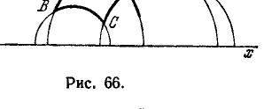
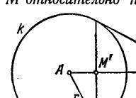
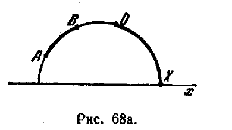
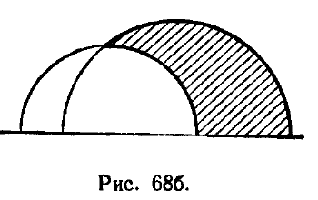
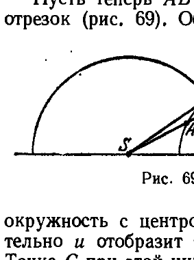
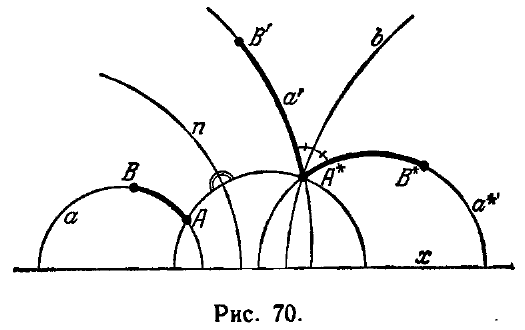
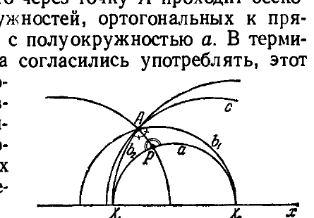
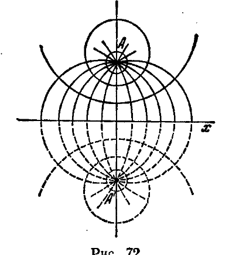
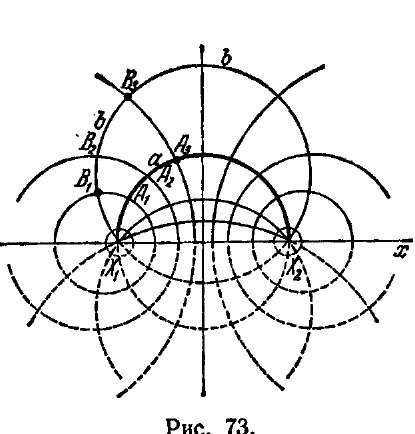
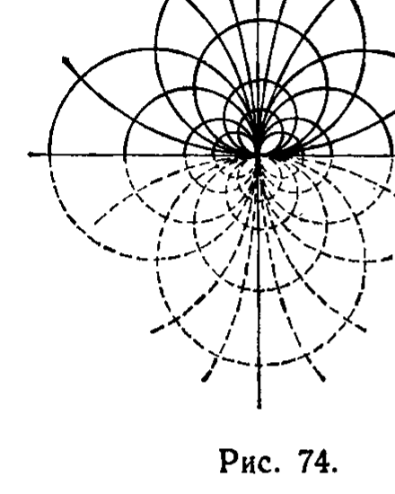

## 9. Доказательство логической непротиворечивости геометрии Лобачевского

---
**стр. 156**
---

Сравнивая (A) и (Б), получаем:

$$\frac{f(\Delta)}{f(\bar{\Delta})} = \frac{D(\Delta)}{D(\bar{\Delta})}.$$

Теорема IV доказана.

Итак, мы показали, что условия 1 и 2 определяют площадь $f(\Delta)$ с точностью до постоянного множителя:

$$f(\Delta) = kD(\Delta). \qquad (1)$$

Позднее (в § 182) мы установим зависимость между выбором меры площади и выбором меры длины (в евклидовой геометрии такая зависимость устанавливается тем, что за единицу площади берется площадь квадрата, сторона которого равна единице длины). Тем самым постоянная $k$ будет фиксирована вместе с выбором линейного масштаба.

После того как определена площадь треугольника, определение площади произвольного многоугольника подсказывается совершенно естественными соображениями: полагая произвольный многоугольник $P$ разделенным на треугольники $\Delta_1, \Delta_2, \dots, \Delta_n$, мы будем называть площадью $P$ число $\sigma$, равное сумме площадей треугольников $\Delta_1, \Delta_2, \dots, \Delta_n$.

Читатель сам легко докажет, что число $\sigma$ не зависит от способа разбиения многоугольника на составляющие треугольники.

По поводу изложенного существенно сделать некоторые замечания.

Так как дефект треугольника, по самому смыслу его определения, меньше $\pi$, то площадь каждого треугольника меньше $k\pi$. Таким образом, можно высказать теорему: в абсолютной геометрии допущение существования треугольника сколь угодно большой площади эквивалентно V постулату Евклида. В самом деле, как видно из предыдущего, такое допущение не может выполняться в системе Лобачевского.

С другой стороны, так как существуют многоугольники, покрывающие произвольно большое число одинаковых треугольников, то площади многоугольников могут быть как угодно велики. Кроме того, из непрерывности дефекта следует, что существует многоугольник, площадь которого равна любому наперед указанному положительному числу. В частности, существует многоугольник с площадью, равной единице.

В заключение сравним измерение площадей в геометрии Лобачевского с измерением площадей на сфере. Известно, что площадь сферического треугольника выражается формулой

$$\sigma(\Delta) = R^2(\alpha + \beta + \gamma - \pi), \qquad \text{(II)}$$

где $R$ — радиус сферы, а $\alpha, \beta, \gamma$ — углы треугольника. Но формулу (1) можно записать в виде

$$\sigma(\Delta) = k(\pi - \alpha - \beta - \gamma). \qquad \text{(I')}$$

Мы видим, что формула (I') получается из (II) если радиус сферы $R$ заменить мнимой величиной $i\sqrt{k}$. Это обстоятельство было замечено еще Ламбертом.

**9. Доказательство логической непротиворечивости геометрии Лобачевского**

§ 49. Мы познакомились с основными фактами теории параллельных геометрии Лобачевского. Хотя многие из этих фактов решительно противоречат нашим привычным представлениям о свойствах прямых, но при самом внимательном анализе мы не смогли

---
**стр. 157**
---

бы обнаружить в том, что было до сих пор изложено, каких-либо л о г и ч е с к и х ошибок. Наоборот, неевклидова геометрия, по крайней мере в той части, которая нам знакома, имеет вид теории, весьма стройной в логическом отношении.

Однако, какова гарантия, что неевклидова геометрия не приведет к логическим противоречиям при неограниченном ее развитии? Сам Лобачевский отлично понимал, что для доказательства независимости V постулата Евклида от других геометрических постулатов недостаточно только продемонстрировать группу теорем, полученных в предположении, что постулат Евклида неверен, и сослаться на отсутствие логических противоречий в *этой* группе. Ему было ясно, что здесь требуется какое-то рассуждение, показывающее, что принятые им посылки никогда не приведут к противоречию, т. е. что доказательство евклидова постулата методом от противного невозможно.

Получив основные уравнения своей геометрии, Лобачевский дал ей аналитическое истолкование и тем самым *в принципе* доказал ее непротиворечивость. Впоследствии (к концу XIX столетия), когда сложились достаточно широкие взгляды на геометрические объекты и геометрические аксиомы, непротиворечивость геометрии Лобачевского была доказана педантически точно и весьма просто. Одно из таких доказательств, принадлежащее А. Пуанкаре, мы воспроизведем на ближайших страницах.

Чтобы не затемнять изложение трудностями технического характера, мы будем рассматривать только двумерную геометрию.

Тогда поставленную задачу можно сформулировать следующим образом: доказать, что требования аксиом I,1—I,3, II, III, IV и неевклидовой аксиомы о параллельных логически совместимы, т. е. что из этих аксиом нельзя вывести двух утверждений, из которых одно отрицает другое.

Общая идея решения этой задачи подсказывается современным пониманием геометрических аксиом. Вернемся к § 11, где вводятся в рассмотрение геометрические объекты. Там нет ни малейшего намека на описание геометрических элементов: точек, прямых и плоскостей; предполагается лишь *существование* некоторых объектов, которые называются такими словами. Далее говорится, что между элементами существуют известные отношения, выражаемые словами: «лежит на...», «между», «конгруэнтны». Описание этих отношений также не дается; предполагается только, что они обладают некоторыми, весьма немногочисленными свойствами, которые перечислены в аксиомах.

Поэтому, изучая, например, планиметрию Евклида, мы можем словами «точка» и «прямая» назвать какие угодно конкретные объекты и словами «лежит на...», «между», «конгруэнтны» обозначать какие угодно их взаимные отношения при одном лишь

---
**стр. 158**
---

условии, что они согласованы с требованиями аксиом I, 1—I, 3, II, III, IV, V. Каждое предложение, логически вытекающее из аксиом I, 1—I, 3, II—V, выражает тогда известный факт, относящийся к выбранным объектам. Понятно, что конкретный смысл каждого абстрактного геометрического предложения зависит от того, какая система объектов при этом выбирается. Выбирая определенные объекты, отношения которых удовлетворяют требованиям данной системы аксиом, мы получаем м о д е л ь той абстрактной схемы, которая этими аксиомами определяется.

Примеры различных моделей одной и той же абстрактной схемы планиметрии Лобачевского мы имели в предыдущем разделе, где рассматривали элементарную геометрию на эквидистантных поверхностях. Действительно, как нам известно, отношения между точками и эквидистантами на любой эквидистантной поверхности и отношения между точками и прямыми на каждой плоскости пространства Лобачевского в одинаковой мере соответствуют аксиомам неевклидовой планиметрии. Правда, пока еще мы не знаем, существуют ли объекты, о которых идет речь, так как вопрос о существовании пространства Лобачевского как раз и является предметом нашего обсуждения.

*В построении конкретной модели логической схемы Лобачевского и заключается доказательство ее логической непротиворечивости.*

Принцип такого рода доказательства удобно пояснить, рассматривая задачу, противоположную той, какая перед нами стоит. Вообразим себе, что каким-то способом мы убедились в непротиворечивости геометрии Лобачевского, но ставим вопрос о непротиворечивости планиметрии Евклида. Этот вопрос мы легко могли бы решить. Достаточно было бы рассмотреть орисферу. Действительно, на орисфере точки и орициклы находятся именно в таких взаимных отношениях, какие требуются аксиомами евклидовой планиметрии (см. § 47). Поэтому, если бы аксиомы планиметрии Евклида могли привести к двум взаимно исключающим следствиям, то тем самым получилось бы противоречие и в элементарной геометрии орисферы, т. е. в геометрии Лобачевского, так как орисфера есть объект этой геометрии.

Таким образом, поскольку в пространстве Лобачевского может быть построена модель планиметрии Евклида, из непротиворечивости геометрии Лобачевского вытекает непротиворечивость планиметрии Евклида.

Наша цель — доказать непротиворечивость геометрии Лобачевского. Условимся, решая эту задачу, предполагать евклидову геометрию непротиворечивой (вопрос о непротиворечивости евклидовой геометрии будет рассмотрен в следующей главе). Хотя в евклидовом пространстве нет поверхностей, элементарная гео-

---
**стр. 159**
---

метрия которых совпадает с планиметрией Лобачевского, но все-таки мы сумеем из объектов евклидова пространства построить модель неевклидовой планиметрии. Мы только будем вынуждены, говоря о точках и прямых, еще более отвлекаться от тех наглядных представлений, которые у нас вызывают эти слова, чем в том случае, когда мы рассматриваем элементарную геометрию некоторой поверхности.

Более того, построение модели неевклидовой планиметрии можно провести на евклидовой плоскости и, таким образом, из непротиворечивости евклидовой планиметрии вывести непротиворечивость планиметрии Лобачевского.

Точно результат, к которому мы придем, формулируется так: если непротиворечива система аксиом евклидовой планиметрии I, 1—I, 3, II, III, IV, V, то система, составленная аксиомами I, 1—I, 3, II, III, IV и аксиомой о параллельных Лобачевского, также не может привести к логическим противоречиям.

Вместе с тем будет доказано, что евклидова аксиома о параллельных не является необходимым следствием аксиом I, 1—I, 3, II, III, IV.

Ниже излагается построение модели или, как еще говорят, интерпретации неевклидовой планиметрии на плоскости Евклида, принадлежащее А. Пуанкаре.

**§ 50.** Рассмотрим в евклидовой плоскости некоторую прямую $x$, которую для удобства вообразим себе горизонтальной. Прямая $x$ определяет две полуплоскости; одну из них мы условно назовем «верхней». Будем называть *неевклидовыми точками* точки верхней полуплоскости (не причисляя к ним точки прямой $x$) и *неевклидовыми прямыми* — евклидовы полуокружности, лежащие в верхней полуплоскости и ортогональные к прямой $x$ (т. е. имеющие центры на прямой $x$), а также евклидовы полупрямые верхней полуплоскости, опирающиеся на прямую $x$ и составляющие с ней прямой угол. Чтобы упростить необходимые в дальнейшем формулировки, условимся эти полупрямые называть полуокружностями бесконечно большого радиуса.

Между неевклидовыми точками и прямыми мы установим определенные отношения, согласуя их с требованиями аксиом I, 1—I, 3, II, III, IV, т. е. с требованиями аксиом абсолютной геометрии. А после этого мы убедимся, что в системе объектов, которую мы таким образом построим, осуществляется аксиома параллельных Лобачевского.

Отношения между объектами будут устанавливаться одно за другим, по мере того как они потребуются при последовательном рассмотрении аксиом.

Обращаемся к аксиомам группы I. Группе аксиом I предшествует допущение, согласно которому геометрические объекты

---
**стр. 160**
---

находятся в известных сопоставлениях друг с другом, выражаемых словами: «точка лежит на прямой», «прямая проходит через точку» и т. д.

Нам надлежит установить, как мы будем понимать эти выражения для неевклидовых точек и прямых.

Пусть $A$ — неевклидова точка и $a$ — неевклидова прямая, представляемая некоторой полуокружностью (обозначим последнюю также буквой $a$). Мы будем полагать, что точка $A$ находится на (неевклидовой) прямой $a$, если эта точка расположена на евклидовой полуокружности $a$, в смысле тех отношений, какие имеют место в евклидовой геометрии.

То, что для неевклидовых точек и прямых справедливы аксиомы I, 1—I, 3, легко проверяется средствами евклидовой геометрии.

В самом деле, аксиома I, 1 соблюдена, так как через две точки $A$ и $B$ — верхней полуплоскости всегда можно провести полуокружность, ортогональную к прямой $x$.

Аксиома I, 2 соблюдена, так как две полуокружности, изображающие неевклидовы прямые, могут иметь не более одной общей точки.

Аксиома I, 3 соблюдена, так как на полуокружности существует бесконечно много точек и в верхней полуплоскости имеется бесконечно много точек, не лежащих на одной полуокружности.

Перейдем к рассмотрению аксиом порядка группы II. Сначала мы должны точно условиться, какой смысл придается словам «лежит между...» по отношению к неевклидовым точкам на неевклидовой прямой.

Пусть $A, B, C$ — три точки неевклидовой прямой, изображаемой полуокружностью $a$. Мы будем говорить, что точка $B$ (в неевклидовом смысле) лежит между $A$ и $C$, если на полуокружности $a$ точка $B$ расположена между $A$ и $C$ в том смысле, как это понимается в евклидовой геометрии. Иначе говоря, порядок точек на неевклидовой прямой совпадает с порядком точек на евклидовой полуокружности, изображающей эту прямую в верхней полуплоскости.

Более подробно определение порядка точек неевклидовой прямой в случае, когда изображающая ее полуокружность не вырождается в евклидову полупрямую, можно высказать следующим образом. Пусть некоторая неевклидова прямая изображается полуокружностью $a$, центр которой обозначен буквой $O$ (точка $O$ не является объектом нашей системы). Рассмотрим какую-нибудь евклидову прямую $u$, параллельную прямой $x$. Каждая евклидова прямая, проходящая через $O$, за исключением прямой $x$, пересекает полуокружность $a$ в одной точке $M$ и прямую $u$ в одной точке $M'$, которую мы будем называть соответствующей точке $M$.

Тогда, если $A, B, C$ — три точки неевклидовой прямой, представляемой полуокружностью $a$, то $B$, как объект неевклидовой

---
**стр. 161**
---

геометрии, расположена между $A$ и $C$ в том случае, когда в системе точек $A', B', C'$, которые на евклидовой прямой и соответствуют точкам $A, B, C$, точка $B'$ лежит между $A'$ и $C'$.

Отсюда тотчас следует, что для неевклидовой прямой справедливы аксиомы II, 1—II, 3, поскольку эти аксиомы справедливы для каждой евклидовой прямой.

Отметим попутно одно важное обстоятельство, именно: *в упорядоченном множестве точек неевклидовой прямой осуществляется принцип Дедекинда*.

В самом деле, принцип Дедекинда имеет место в евклидовой геометрии. Но, как мы видели, между точками евклидовой прямой и точками неевклидовой прямой можно установить такое взаимно однозначное соответствие, что соответствующие точки находятся в одинаковых отношениях порядка. А этим, собственно, и доказывается высказанное утверждение.

Кроме аксиом II, 1—II, 3, справедливость которых уже установлена нами, группа II содержит еще аксиому Паша II, 4. Чтобы убедиться, что предложение Паша имеет место в нашей схеме, нужно доказать следующую евклидову теорему: пусть $ABC$ — криволинейный треугольник (рис. 66), составленный из дуг полуокружностей, и $a$ — полуокружность, не проходящая ни через одну из точек $A, B, C$; тогда, если $a$ проходит через какую-нибудь точку внутри дуги $AC$, то она проходит либо через точку дуги $AB$, либо через точку дуги $BC$. Доказательство этой теоремы, с наглядной точки зрения вполне очевидной, не представляет никакого интереса, и мы приводить его не будем.

Проверка аксиом первых двух групп сводилась к установлению ряда тривиальных предложений геометрии Евклида. Сложнее обстоит дело с аксиомами конгруэнтности III, 1—III, 5, к исследованию которых мы скоро приступим. В надлежащем определении конгруэнтных образов как раз и состоит смысл употребляемого приема.

**§ 51.** Основным инструментом в наших дальнейших построениях будет являться одно специальное отображение евклидовой плоскости на самое себя, хорошо известное в элементарной геометрии, в теории аналитических функций и в математической физике под названием *инверсии*.

Пусть дана некоторая окружность $k$ с центром в точке $A$ (рис. 67), имеющая радиус $r$. Обозначим через $M$ произвольную точку плоскости. По заданной точке $M$, если она не совпадает с $A$, всегда и однозначно можно построить новую точку $M'$, определяемую

---
**стр. 162**
---

на луче $AM$ условием

$$AM' \cdot AM = r^2. \qquad (*)$$

(построение показано на рис. 67). Точка $M'$ называется *образом точки $M$ по инверсии относительно окружности $k$*, или просто *инверсией точки $M$*.

Кроме того, мы условимся называть точку $M'$ *инверсией точки $M$ относительно прямой $u$*, если точка $M'$ симметрична точке $M$ по отношению к прямой $u$. В последующих формулировках мы, как правило, не будем различать инверсию относительно окружности и инверсию относительно прямой, считая прямую окружностью бесконечно большого радиуса. Доказательства теорем, относящихся к инверсиям, мы будем вести часто в предположении, что окружность инверсии — обыкновенная. Тот особый случай, когда окружность инверсии имеет бесконечно большой радиус (т. е. является прямой), требует иногда дополнительных, но совершенно тривиальных рассуждений. Их легко воспроизведет сам читатель.

Вполне очевидны следующие свойства инверсий:

1. *Если $M'$ есть инверсия точки $M$, то $M$ есть инверсия точки $M'$.* Таким образом, инверсия совпадает с обратным себе отображением.

2. *При инверсии внешняя по отношению к окружности $k$ область плоскости отображается на внутреннюю, а внутренняя область — на внешнюю* $^{*)}$.

3. *Каждая точка окружности $k$ совпадает со своей инверсией.*

Некоторые другие свойства инверсий мы установим при помощи небольших вычислений. Введем на плоскости декартову ортогональную систему координат и сопоставим с каждой точкой $M$ комплексное число $z = x + iy$, где $x$ и $y$ — координаты точки $M$. Как обычно, чертой сверху будем обозначать число, комплексно сопряженное к данному: $\bar{z} = x - iy$. Очевидно, задание любого из двух чисел $z$ или $\bar{z}$ определяет точку $M$.

Поместим центр окружности, относительно которой определена инверсия, в начало координат. Тогда, если две точки, опреде-

$^{*)}$ При этом, если окружность $k$ имеет бесконечно большой радиус, т. е. является прямой, то любую из двух полуплоскостей, определяемых этой прямой, можно рассматривать как внутреннюю область, и тогда другую — как внешнюю.

---
**стр. 163**
---

ляемые числами $z$ и $z'$ являются инверсиями друг друга, то вследствие условия (*) между $z$ и $z'$ имеет место соотношение

$$\bar{z}z' = r^2.$$

Отсюда получаем аналитическое представление инверсии:

$$z' = \frac{r^2}{\bar{z}},$$

или в координатах:

$$x' = r^2 \frac{x}{x^2 + y^2},$$

$$y' = r^2 \frac{y}{x^2 + y^2}.$$

Пользуясь этими формулами, легко доказать так называемое круговое свойство инверсии: если точка $z$ описывает окружность или прямую, то ее инверсия $z'$ описывает либо окружность, либо прямую.

Считая прямую окружностью бесконечно большого радиуса, предыдущее свойство можно выразить более коротко:

4. *Инверсия окружности есть окружность.*

Для доказательства рассмотрим произвольную окружность; пусть она имеет уравнение

$$A(x^2 + y^2) + Bx + Cy + D = 0.$$

Заменяя в этом уравнении текущие координаты $x, y$ выражениями

$$x = r^2 \frac{x'}{x'^2 + y'^2},$$

$$y = r^2 \frac{y'}{x'^2 + y'^2},$$

получим:

$$Ar^4 + Br^2 x' + Cr^2 y' + D(x'^2 + y'^2) = 0.$$

Таким образом, координаты точек, являющихся инверсиями точек окружности, также удовлетворяют уравнению окружности (или прямой, если $D = 0$). Тем самым утверждение доказано.

Особую роль у нас будут играть отображения, представляющие собой произведение некоторого числа последовательно проведенных инверсий.

Пусть дано одно из таких отображений, переводящее произвольную точку $z$ в точку $z'$. Нетрудно показать, что если это отображение есть произведение четного числа инверсий, то $z'$ выражается через $z$ формулой

$$z' = \frac{\alpha z + \beta}{\gamma z + \delta}, \qquad \text{(I)}$$

---
**стр. 164**
---

где $\alpha$, $\beta$, $\gamma$, $\delta$ — комплексные постоянные. Если же данное отображение составлено из нечетного числа инверсий, то зависимость $z'$ от $z$ имеет вид

$$z' = \frac{\alpha \bar{z} + \beta}{\gamma \bar{z} + \delta} \qquad \text{(II)}$$

Сначала покажем, что инверсия относительно окружности с произвольным центром $a$ и радиусом $r$ аналитически представляется зависимостью вида (II). Для этого введем вспомогательную систему координат с началом в точке $a$, оси которой параллельны осям первоначальной системы. Пусть $M$ и $M'$ — две точки, соответствующие друг другу по инверсии относительно данной окружности. Если $Z$ и $Z'$ — определяющие их комплексные числа во вспомогательной системе координат, то

$$Z' = \frac{r^2}{\bar{Z}}.$$

Обозначим через $z$ и $z'$ комплексные числа, определяющие эти же точки в старой системе. Очевидно, что $z = Z + a$ и $z' = Z' + a$. Заменяя в предыдущем соотношении $Z$ и $Z'$ их выражениями через $z$ и $z'$, получим:

$$z' - a = \frac{r^2}{\bar{z} - \bar{a}},$$

откуда

$$z' = \frac{\bar{a}\bar{z} + (r^2 - a\bar{a})}{\bar{z} - \bar{a}},$$

или если положить $a = \alpha$, $r^2 - a\bar{a} = \beta$, $1 = \gamma$, $-\bar{a} = \delta$:

$$z' = \frac{\alpha \bar{z} + \beta}{\gamma \bar{z} + \delta}.$$

Мы вели сейчас выкладки в предположении, что окружность инверсии — обыкновенная. Нетрудно получить зависимость между $z$ и $z'$ для инверсии относительно прямой. В самом деле, инверсия относительно вещественной оси характеризуется уравнением $z' = \bar{z}$, следовательно, инверсия относительно прямой, проходящей через нулевую точку, аналитически определяется равенством $e^{i\varphi} z' = \overline{e^{i\varphi} z}$ или $z' = e^{-2i\varphi}\bar{z}$; отсюда, при помощи сдвига, найдем зависимость между $z$ и $z'$ в том случае, когда прямая, относительно которой совершается инверсия, имеет любое положение; именно:

$$z' = e^{-2i\varphi}\bar{z} + \text{const}.$$

Эта зависимость получается из (II) при $\gamma = 0$.

---
**стр. 165**
---

Таким образом, соотношением $z' = \frac{\alpha \bar{z} + \beta}{\gamma \bar{z} + \delta}$, при подходящем выборе постоянных $\alpha$, $\beta$, $\gamma$, $\delta$, может быть определена любая инверсия как относительно обыкновенной окружности, так и относительно окружности бесконечно большого радиуса.

Пусть теперь последовательно совершаются две инверсии относительно произвольных окружностей. Если первая из них отображает $z$ в $z'$, а вторая отображает $z'$ в $z''$, то согласно предыдущему

$$z' = \frac{\alpha_1 \bar{z} + \beta_1}{\gamma_1 \bar{z} + \delta_1}$$

и

$$z'' = \frac{\alpha_2 \bar{z}' + \beta_2}{\gamma_2 \bar{z}' + \delta_2}.$$

Из первого равенства имеем:

$$\bar{z}' = \frac{\bar{\alpha}_1 z + \bar{\beta}_1}{\bar{\gamma}_1 z + \bar{\delta}_1}.$$

Если подставить это выражение во второе равенство, то после небольших преобразований и введения надлежащих обозначений получим:

$$z'' = \frac{\alpha z + \beta}{\gamma z + \delta},$$

т. е. зависимость вида (I). Очевидно, если мы еще раз произведем инверсию, переводящую $z''$ в $z'''$, то зависимость $z'''$ от $z$ будет иметь вид (II); при следующей инверсии для $z''''$ опять получим (I) и т. д.

Докажем теперь нужные для дальнейшего свойства произведений инверсий.

5. *Если отображение, представляющее собой произведение четного числа инверсий, оставляет неподвижными три точки плоскости, то все точки плоскости при этом отображении остаются на своих местах, и отображение, следовательно, является тождественным.*

Как нам известно, отображение указанного вида, переводящее $z$ в $z'$, характеризуется равенством

$$z' = \frac{\alpha z + \beta}{\gamma z + \delta}.$$

Все неподвижные точки этого отображения определяются уравнением $z' = z$, т. е.

$$z = \frac{\alpha z + \beta}{\gamma z + \delta},$$

---
**стр. 166**
---

или

$$\gamma z^2 + (\delta - \alpha)z - \beta = 0.$$

Согласно условию полученное уравнение должно иметь три решения, что возможно только в том случае, когда оно обращается в тождество, т. е. когда

$$\gamma = 0, \quad \delta - \alpha = 0, \quad \beta = 0.$$

Следовательно,

$$z' = \frac{\alpha}{\delta} z.$$

Ясно, что $\alpha \neq 0$ (если $\alpha = 0$, то любая точка $z$ отображается в одну и ту же точку $z' = 0$, а это для произведения инверсий невозможно, так как каждая инверсия разные точки переводит в разные точки). Вследствие равенства $\delta - \alpha = 0$ при $\alpha \neq 0$ находим $z' = z$. Этим наше утверждение доказано.

6. *Если отображение, представляющее собой произведение нечетного числа инверсий, оставляет неподвижными три точки плоскости, то оно является инверсией относительно окружности, проходящей через эти точки.*

Пусть $z' = f(z)$ — данное отображение. Если $z'' = \varphi(z')$ — инверсия относительно указанной окружности, то $z'' = \varphi(f(z))$ есть отображение, составленное уже четным числом инверсий, причем оно оставляет неподвижными те же самые три точки, что и данное отображение $z' = f(z)$. Согласно предыдущему $z'' = \varphi(f(z))$ тогда должно быть тождественным отображением, т. е. $z'' = z$. Таким образом, $\varphi(z') = z$, и, следовательно, $z$ и $z'$ соответствуют друг другу по инверсии относительно той окружности, которая проходит через три рассматриваемые точки. Это и нужно было показать.

Наконец, мы сформулируем без доказательства еще одно предложение по поводу инверсий.

7. *Если две окружности пересекаются, то при любой инверсии угол, который они составляют в общей точке, равен углу, который составляют окружности, полученные в результате их отображения.*

Инвариантность угла относительно инверсий доказывается в элементарной теории конформных отображений *).

Теперь мы можем вернуться к построению модели неевклидовой геометрии.

§ 52. Согласно определению, которое мы дали в § 50 понятию «между», порядок точек на неевклидовой прямой совпадает с порядком точек на евклидовой полуокружности, изображающей эту прямую в верхней полуплоскости. Поэтому неевклидов отрезок $AB$

---
**стр. 167**
---

изображается дугой полуокружности с концами $A$, $B$; неевклидова полупрямая, исходящая из точки $O$, изображается дугой $OX$, конец которой $X$ находится на прямой $x$ (рис. 68а). Конечно, точка $X$ при этом не должна причисляться к точкам неевклидовой полупрямой.

*Неевклидовым углом*, естественно, мы будем называть совокупность двух неевклидовых полупрямых, исходящих из одной точки (рис. 68б).

Дадим теперь определение конгруэнтности отрезков и углов в нашей модели неевклидовой геометрии.

Здесь нам существенно придется пользоваться инверсиями. Условимся рассматривать только такие инверсии, которые производятся относительно окружностей, ортогональных к прямой $x$. Очевидно, при всякой такой инверсии точки, расположенные в верхней полуплоскости, отображаются в точки этой же полуплоскости. Таким образом, производя инверсии фигур верхней полуплоскости, мы не будем выходить за ее пределы.

Назовем неевклидов отрезок $AB$ *конгруэнтным* неевклидову отрезку $A'B'$, если существует такая последовательность инверсий, что их произведение отображает евклидову круговую дугу $AB$ на круговую дугу $A'B'$.

Аналогично назовем неевклидов $\angle(h, k)$ *конгруэнтным* неевклидову $\angle(h', k')$, если существует такая последовательность инверсий, что их произведение отображает стороны первого угла на стороны второго*).

В силу предложения 7 § 51 углы, конгруэнтные в смысле этого определения, равны между собою также и в том смысле, как это понимается в евклидовой геометрии по отношению к криволинейным углам. Напротив, круговые дуги, изображающие конгруэнтные неевклидовы отрезки, вовсе не будут конгруэнтными с евклидовой точки зрения, так как инверсии, сохраняя величины углов, искажают линейные размеры фигур.

---
*) Установление отношения конгруэнтности отрезков и углов обладает свойством взаимности. Это следует из того, что отображение, обратное к инверсии, есть также инверсия.

---
**стр. 168**
---

В нашей модели неевклидовой геометрии инверсии относительно окружностей, ортогональных к прямой $x$, представляют собой некоторые конгруэнтные перемещения. Познакомимся поближе с их особенностями.

Рассмотрим какую-нибудь полуокружность верхней полуплоскости, ортогональную к прямой $x$. При инверсии рассматриваемая полуокружность согласно предложению 4 § 51 преобразуется в круговую дугу (также расположенную в верхней полуплоскости). Сама прямая $x$ при этой инверсии отобразится на себя. Так как инверсия сохраняет величины углов, то круговая дуга, полученная инверсией рассматриваемой полуокружности, должна быть ортогональна к прямой $x$ и, следовательно, также должна быть полуокружностью. Таким образом, инверсия допускаемого нами вида всегда преобразует полуокружности верхней полуплоскости, ортогональные к прямой $x$, в такие же полуокружности. Это — очень важное обстоятельство, так как полуокружности верхней полуплоскости, ортогональные к прямой $x$, изображают прямые в нашей модели неевклидовой геометрии.

Пусть теперь $AB$ — круговая дуга, изображающая неевклидов отрезок (рис. 69). Обозначим через $S$ точку пересечения евклидовой прямой $AB$ с прямой $x$ (предполагая, что эти прямые пересекаются) и проведем из $S$ касательную $SC$ к дуге $AB$. По известной теореме евклидовой геометрии имеет место равенство

$$SA \cdot SB = SC^2.$$

Поэтому если мы обозначим через $u$ полуокружность с центром $S$ и радиусом $SC$, то инверсия относительно $u$ отобразит точку $A$ в точку $B$, а точку $B$ в точку $A$. Точка $C$ при этой инверсии останется на месте. Отсюда следует, что дуга $AB$ отображается на себя, причем часть ее $AC$ отображается на $BC$, а $BC$ — на $AC$. Дуги $AC$ и $CB$, поскольку каждая из них есть инверсия другой, изображают конгруэнтные неевклидовы отрезки; точка $C$, следовательно, является неевклидовой серединой дуги $AB$. Заметим еще, что дуга $AB$ ортогональна к полуокружности $u$. Таким образом, полуокружность $u$ изображает перпендикуляр к середине неевклидова отрезка $AB$. Иначе говоря, точки $A$ и $B$ в неевклидовом смысле симметричны относительно неевклидовой прямой, изображаемой полуокружностью $u$.

Мы можем отсюда заключить, что *инверсия, если ее рассматривать с неевклидовой точки зрения, есть не что иное, как симмет-*

---
**стр. 169**
---

Все это построение проводилось в предположении, что точка $S$ существует. Если же евклидова прямая $AB$ не пересекает прямую $x$, то тогда точку $S$ следует воображать находящейся в бесконечности, касательную к дуге $AB$ вести параллельно прямой $x$, а полуокружность $u$ и заменить полупрямой. В этом случае инверсия превращается в обычную симметрию относительно евклидова перпендикуляра к прямой $x$, проведенного из евклидовой середины $C$ дуги $AB$.

После этого становится понятно, что означает высказанное выше определение конгруэнтности образов в нашей схеме: образ $A$ конгруэнтен образу $A'$, если $A'$ может быть получен из $A$ при помощи некоторого числа зеркальных отражений, понимаемых в описанном сейчас условном (неевклидовом) смысле.

Наша ближайшая цель — показать, что введенное нами отношение конгруэнтности удовлетворяет требованиям всех аксиом III,1—III,5.

Будем рассматривать эти аксиомы одну за другой. Аксиома III,1 требует, что на каждой прямой от каждой ее точки по любую сторону можно было отложить отрезок, которому конгруэнтен произвольно данный отрезок какой-нибудь прямой.

Это требование в нашей схеме удовлетворяется. В самом деле, рассмотрим две неевклидовы прямые $a$ и $a^*$; на первой из них возьмем отрезок $AB$, на второй — точку $A^*$ (рис. 70). Кроме того, отметим одну из двух полупрямых, определяемых на прямой $a^*$ точкой $A^*$. Построим, как было показано выше, (неевклидов) перпендикуляр $n$ к середине отрезка $AA^*$. При помощи (неевклидова) зеркального отражения относительно этого перпендикуляра мы можем прямую $a$ отобразить на некоторую прямую $a'$; при этом точка $A$ отобразится в точку $A^*$, а отрезок $AB$ прямой $a$ будет иметь своим образом отрезок $A^*B'$ прямой $a'$. Проведем теперь (неевклидову) биссектрису $b$ угла, составленного двумя

---
**стр. 170**
---

(неевклидовыми) полупрямыми, из которых одна идет из точки $A^*$ к точке $B'$, а другая есть отмеченная нами полупрямая прямой $a^*$. Зеркальное отражение относительно $b$ (понимаемое в неевклидовом смысле) переводит (неевклидову) прямую $a'$ в (неевклидову) прямую $a^*$, а отрезок $A^*B'$ прямой $a'$ — в некоторый отрезок $A^*B^*$. Таким образом, на (неевклидовой) прямой $a^*$ по данную сторону от ее точки $A^*$ существует такая точка $B^*$, что отрезок $A^*B^*$ получается при помощи двух (неевклидовых) зеркальных отражений из отрезка $AB$ и, следовательно, $AB \equiv A^*B^*$ в принятом выше смысле. А это и нужно было показать.

Аксиома III,1 требует еще, чтобы среди точек прямой $a^*$, лежащих по данную сторону от $A^*$, только одна определяла вместе с $A^*$ отрезок, которому конгруэнтен отрезок $AB$. Докажем, что это требование при нашем определении конгруэнтности удовлетворено.

Пусть на (неевклидовой) прямой $a^*$ по данную сторону от точки $A^*$ имеются две различные точки $B_1^*$ и $B_2^*$, такие, что соблюдаются условия $AB \equiv A^*B_1^*$ и $AB \equiv A^*B_2^*$. Это означает, что существует некоторая последовательность инверсий, произведение которых отображает круговую дугу $AB$ на круговую дугу $A^*B_1^*$, и некоторая другая последовательность инверсий, произведение которых отображает дугу $AB$ на дугу $A^*B_2^*$. Обозначим через $X_2$ точку, в которой продолжение дуги $AB$ в направлении от $A$ к $B$ встречает прямую $x$, через $X_1$ — точку встречи с прямой $x$ дуги $AB$, продолженной в противоположном направлении. Через $X_2^*$ и $X_1^*$ обозначим аналогично определяемые концы полуокружности, изображающей неевклидову прямую $a^*$. Очевидно, произведения каждой из двух упомянутых выше последовательностей инверсий отображают $X_1$ на $X_1^*$ и $X_2$ на $X_2^*$. Представим себе, что инверсии первой последовательности осуществляются в обратном порядке, а вслед за тем реализуются инверсии второй последовательности. В результате получается некоторое отображение, которое мы обозначим буквой $f$. Очевидно, в процессе отображения $f$ точка $X_1^*$ сначала совмещается с $X_1$, а потом снова возвращается в положение $X_1^*$. Таким образом, $X_1^*$ есть неподвижная точка отображения $f$. Точно так же неподвижны при отображении $f$ точки $A^*$ и $X_2^*$. Что же касается точки $B_1^*$, то она при помощи $f$ переводится в точку $B_2^*$. Итак, $f$ имеет три неподвижные точки $X_1^*, A^*$ и $X_2^*$. В силу предложений 5 и 6 § 51 отсюда следует, что $f$ есть либо тождественное отображение, либо инверсия относительно окружности, проходящей через точки $X_1^*, A^*, X_2^*, B_1^*$ и $B_2^*$. И в том, и в другом случае все точки этой окружности должны быть неподвижными точками отображения $f$. Следовательно, $B_1^*$ и $B_2^*$ не могут быть различны. Тем самым единственность операции конгруэнтного отложения отрезка доказана.

---
**стр. 171**
---

Наконец, аксиома III,1 требует, чтобы отрезок $AB$ был конгруэнтен отрезку $BA$. Чтобы проверить выполнение этого требования в рассматриваемой нами модели неевклидовой геометрии, достаточно совершить неевклидово зеркальное отражение относительно середины отрезка $AB$.

Итак, все требования аксиомы III,1 удовлетворяются.

Обращаемся к аксиоме III,2, согласно которой, если отрезки $A'B'$ и $A''B''$ конгруэнтны отрезку $AB$, то отрезок $A'B'$ должен быть конгруэнтен отрезку $A''B''$.

Это требование в нашей модели неевклидовой геометрии с очевидностью выполняется. В самом деле, соотношения $A'B' \equiv AB$ и $A''B'' \equiv AB$ означают, что существует серия неевклидовых зеркальных отражений, в результате которых $A'B'$ налагается на $AB$, и существует другая серия неевклидовых зеркальных отражений, в результате которых также и $A''B''$ налагается на $AB$. Произведем зеркальные отражения первой серии и вслед за тем — зеркальные отражения второй серии в обратном порядке. В результате $A'B'$ отобразится на $A''B''$, из чего и будет следовать конгруэнтность этих отрезков.

Рассмотрим теперь аксиому III,3.

Пусть $AB$ и $A'B'$ — неевклидовы отрезки, $C$ — точка внутри отрезка $AB$ и $C'$ — точка внутри отрезка $A'B'$. Мы должны показать, что при нашем определении конгруэнтности из $AC \equiv A'C'$ и $CB \equiv C'B'$ следует $AB \equiv A'B'$.

Так как $AC \equiv A'C'$, то должна существовать серия неевклидовых зеркальных отражений, произведение которых отображает $AC$ на $A'C'$. Одновременно точка $B$ отобразится в точку $B^*$ на прямой $A'B'C'$, причем $B^*$ расположится с той стороны от $C'$, с какой лежит $B'$. Отрезки $C'B'$ и $C'B^*$ лежат по одну сторону от точки $C'$ и, будучи конгруэнтными отрезку $CB$ ($C'B'$ — по условию, $C'B^*$ — по построению), должны быть конгруэнтны между собой (по аксиоме III,2, которая уже проверена). Но тогда, по аксиоме III,1, точки $B^*$ и $B'$ не могут быть различными. Следовательно, произведение упомянутых неевклидовых зеркальных отражений отображает $AB$ на $A'B'$, откуда $AB \equiv A'B'$.

Не представляет труда также проверка аксиомы III,4. Эта аксиома требует, чтобы к каждой полупрямой с любой стороны можно было приложить угол, которому конгруэнтен произвольно данный угол, и чтобы это построение выполнялось однозначно.

Возможность и однозначность такого построения устанавливаются при помощи рассуждений, аналогичных тем, какие мы проводили, проверяя аксиому III,1. Именно, пусть $\angle (h, k)$ — неевклидов угол с вершиной $O$ и $h'$ — неевклидова полупрямая с началом $O'$. Прежде всего, при помощи неевклидова зеркального отражения относительно перпендикуляра к середине отрезка $OO'$,

---
**стр. 172**
---

мы отобразим $\angle (h, k)$ на $\angle (h'', k'')$, вершина которого совмещена с $O'$. После этого неевклидово зеркальное отражение относительно биссектрисы $\angle (h', h'')$ превращает $\angle (h'', k'')$ в $\angle (h', k')$; этот угол по построению конгруэнтен $\angle (h, k)$ и приложен с некоторой стороны к полупрямой $h'$. Теперь нужно доказать однозначность операции приложения угла к данной полупрямой с данной стороны. Пусть $\angle (h', k_1')$ получен при помощи серии неевклидовых зеркальных отражений $\angle (h, k)$ и $\angle (h', k_2')$ получен при помощи другой серии неевклидовых зеркальных отражений $\angle (h, k)$. Пусть $f$ — произведение зеркальных отражений первой серии, проводимых в обратном порядке, и зеркальных отражений второй серии. Очевидно, $f$ отображает $\angle (h', k_1')$ на $\angle (h', k_2')$. Но, принимая во внимание, что неевклидовы зеркальные отражения суть инверсии, и используя предложения 5 и 6 § 51 в точности так, как это было сделано нами при проверке аксиомы III,1, можно доказать, что $f$ есть либо тождественное отображение, либо неевклидово зеркальное отражение относительно полупрямой $h'$. Следовательно, $\angle (h', k_1')$ и $\angle (h', k_2')$ либо совпадают, либо взаимно зеркальны (в неевклидовом смысле) относительно $h'$. А это и нужно было установить.

Аксиома III,4 требует еще, чтобы всякий $\angle (h, k)$ был конгруэнтен сам себе, т. е. чтобы $\angle (h, k) \equiv \angle (h, k)$ и $\angle (h, k) \equiv \angle (k, h)$. Но первое соотношение очевидно*), а в том, что второе соотношение выполняется, можно убедиться, совершая неевклидово зеркальное отражение угла относительно его биссектрисы.

Наконец, требования аксиомы III,5 в нашей модели удовлетворяются, в чем легко убедиться, если провести рассуждения, которыми в школьных учебниках элементарной геометрии доказывается первая теорема о равенстве треугольников, понимая при этом движение как результат некоторой серии неевклидовых зеркальных отражений.

Мы видим, что в построенной системе объектов отношение конгруэнтности удовлетворяет условиям всех аксиом третьей группы.

После этого сразу можно заключить, что в этой системе объектов выполнены требования аксиом непрерывности IV,1 и IV,2. В самом деле, как было замечено в § 50, на неевклидовых прямых осуществляется принцип Дедекинда. А согласно теореме 41 § 23, из аксиом I—III при наличии принципа Дедекинда вытекают оба предложения: IV,1 и IV,2.

Таким образом, наша система объектов удовлетворяет требованиям всех аксиом абсолютной планиметрии I,1—3, II, III, IV.

*) Так как тождественное отображение можно рассматривать как двукратное повторение инверсии.

---
**стр. 173**
---

Но тогда в ней должна осуществляться либо теория параллельных Евклида, либо теория параллельных Лобачевского. Как мы сейчас покажем, имеет место именно второй случай.

Возьмем какую-нибудь полуокружность $a$ в плоскости, ортогональную к прямой $x$. Пусть $A$ — точка верхней полуплоскости, не принадлежащая этой полуокружности (рис. 71). Легко проверить, что через точку $A$ проходит бесконечно много различных полуокружностей, ортогональных к прямой $x$ и не имеющих общих точек с полуокружностью $a$. В тех терминах, которые мы с самого начала согласились употреблять, этот факт можно выразить такими словами: через произвольную неевклидову точку, лежащую вне данной неевклидовой прямой, проходит бесконечно много различных неевклидовых прямых, не встречающих данную.

А это и означает, что в рассмотренной системе объектов имеет место постулат Лобачевского; эта система, следовательно, представляет собой модель геометрии Лобачевского, построение которой мы имели своей целью. Используя эту модель, можно каждому предложению планиметрии Лобачевского дать вполне определенную интерпретацию на евклидовой плоскости. Для этого следует слова «точка», «прямая», «конгруэнтны» и т. д., встречающиеся в формулировке предложения, понимать в том смысле, как мы условились это делать, т. е. под словом «точка» подразумевать евклидову точку верхней полуплоскости, под словом «прямая» — евклидову полуокружность или полупрямую, ортогональную к границе полуплоскости; конгруэнтными называть такие образы, которые могут быть отображены друг на друга в результате последовательного проведения инверсий, и т. д. Таким образом, каждой теореме Лобачевского соответствует вполне определенная евклидова теорема. Следовательно, противоречия, если бы они были в геометрии Лобачевского, непремеино имелись бы и в евклидовой геометрии.

*Мы видим, что непротиворечивость геометрии Лобачевского вытекает из непротиворечивости геометрии Евклида.*

*Вместе с тем, мы показали, что постулат о параллельных Евклида не может быть выведен из посылок абсолютной геометрии.*

Действительно, в модели А. Пуанкаре осуществляются все аксиомы абсолютной геометрии, но вместо постулата о параллельных Евклида имеет место постулат Лобачевского. Значит, постулат Евклида не является логическим следствием этих аксиом.

---
**стр. 174**
---

§ 53. Интересно представить себе, как те или иные конкретные факты геометрии Лобачевского интерпретируются на полуплоскости Евклида.

Обратимся к рис. 71. На этом чертеже изображены неевклидова прямая в виде полуокружности $a$, ортогональной к прямой $x$, и точка $A$. Неевклидовы прямые, которые проходят через точку $A$ и не пересекают данную прямую, изображаются полуокружностями, проходящими через точку $A$, ортогональными к $x$ и не пересекающими полуокружность $a$. Среди этих неевклидовых прямых, как известно, должны существовать две граничные, которые и называются параллельными данной прямой в двух ее направлениях. Параллельные прямые изображены на рис. 71 в виде полуокружностей $b_1$ и $b_2$, касающихся полуокружности $a$ в ее концах $X_1$ и $X_2$, лежащих на прямой $x$. Так как евклидовы точки прямой $x$ не являются неевклидовыми объектами, то неевклидовы прямые, изображаемые полуокружностями $b_1$ и $b_2$, следует рассматривать как не встречающиеся с прямой $a$. То, что они — граничные, усматривается непосредственно.

Проведем через точку $A$ полуокружность, ортогональную к прямой $x$ и пересекающую полуокружность $a$ в точке $P$ также под прямым углом.

Дуга $AP$, очевидно, изображает неевклидов перпендикуляр к неевклидовой прямой $a$; угол, который он составляет с дугой $b_1$, есть не что иное, как угол параллельности для отрезка $AP$.

Совершенно тривиальным фактом геометрии Лобачевского является то, что перпендикуляр $AP$ представляет собой биссектрису угла между неевклидовыми прямыми $b_1$ и $b_2$. В евклидовой геометрии равенство углов, которые составляет дуга $AP$ с дугами $b_1$ и $b_2$, отнюдь не очевидно. Но доказывать такую евклидову теорему нет необходимости. Действительно, поскольку в системе объектов модели Пуанкаре осуществляются все аксиомы Лобачевского, должны осуществляться и все их следствия, в том числе и высказанное утверждение. Отсюда, в частности, вытекает своеобразный метод доказательства некоторых евклидовых теорем при помощи неевклидовой геометрии.

Укажем для примера следующую евклидову теорему, справедливость которой мы можем утверждать без специального доказательства: если треугольник составлен круговыми дугами, продолжения которых пересекают некоторую прямую под прямым углом, то сумма внутренних углов этого треугольника меньше двух прямых. Очевидно, эта теорема получается из соответствующей теоремы геометрии Лобачевского при помощи интерпретации Пуанкаре.

Посмотрим еще, как выглядят на модели Пуанкаре неевклидовы окружности, эквидистанты и орициклы. Эти линии суть

---
**стр. 175**
---

ортогональные траектории эллиптических, гиперболических и параболических пучков, составленных неевклидовыми прямыми (см. конец § 39).

На рис. 72 изображен пучок евклидовых окружностей с двумя узловыми точками $A$ и $A'$, из которых точка $A$ находится в верхней полуплоскости, а точка $A'$ расположена симметрично ей в нижней. Ортогональными траекториями этого пучка являются также окружности, которые составляют пучок без узловых точек, но с предельными точками $A$ и $A'$ (доказательство не приводим).

Очевидно, верхние половины окружностей первого пучка изображают неевклидовы прямые, проходящие через точку $A$ и составляющие, следовательно, эллиптический пучок, а ортогональные к ним окружности второго пучка, лежащие в верхней полуплоскости, изображают неевклидовы окружности с общим центром $A$.

На рис. 73 изображены ортогональная к прямой $x$ полуокружность $a$ и пучок ортогональных к ней окружностей с предельными точками $X_1$ и $X_2$. Верхние половины этих окружностей изображают неевклидовы прямые с общим перпендикуляром $a$; совокупность таких прямых есть гиперболический пучок с базой $a$. Всякая окружность, проходящая через точки $X_1$ и $X_2$, представляет собой ортогональную траекторию этого пучка и, следовательно, верхняя дуга такой окружности изображает эквидистанту, для которой неевклидова прямая $a$ служит базой. Круговые дуги $A_1 B_1, A_2 B_2, A_3 B_3, \dots$ и т. д. изображают конгруэнтные в неевклидовом смысле высоты эквидистанты $b$.

На рис. 74 показан пучок окружностей со слившимися узловыми точками; верхние половины этих окружностей изображают неевклидовы прямые, параллельные друг другу в одном направлении и составляющие, следовательно, неевклидов

---
**стр. 176**
---

прямолинейный параболический пучок. Ортогональные траектории его, рассматриваемые с неевклидовой точки зрения, суть орициклы, а как объекты евклидовой плоскости — это окружности, касающиеся друг друга и прямой $x$ в узловой точке.

Таким образом, круговая дуга, лежащая в верхней полуплоскости, изображает неевклидову прямую, если она опирается на прямую $x$ и составляет с нею прямой угол; эквидистанту, если она, опираясь на прямую $x$, составляет с нею угол, отличный от прямого; орицикл, если имеет соединенные концы и в точке их соединения касается прямой $x$; наконец, неевклидову окружность, если она представляет собою полную евклидову окружность верхней полуплоскости.

§ 54. Рассмотренная нами интерпретация неевклидовой геометрии — отнюдь не единственно возможная. Кроме этой интерпретации существует бесконечное множество других.

Мы можем неевклидову геометрию интерпретировать на плоскости Евклида, например, еще следующим образом.

Возьмем в евклидовой плоскости какую-нибудь окружность $K$. Назовем неевклидовыми точками точки евклидовой плоскости, лежащие внутри $K$, неевклидовыми прямыми — лежащие внутри $K$ части ортогональных к ней евклидовых окружностей (включая и диаметры). Понятиям взаимной принадлежности геометрических элементов и порядка мы оставим их евклидовый смысл.

Неевклидовы образы будем называть взаимно зеркальными в неевклидовом смысле, если их евклидовы изображения внутри $K$ могут быть отображены друг на друга при помощи инверсии относительно какой-нибудь окружности, ортогональной к окружности $K$. Конгруэнтными будем называть неевклидовы образы в том случае, когда они могут быть отображены друг на друга при помощи некоторой серии неевклидовых зеркальных отражений.

Проводя рассуждения, аналогичные тем, какие мы провели в §§ 50—52, можно показать, что при таком определении геометрических элементов и отношений между ними удовлетворены все требования аксиом абсолютной геометрии. После этого не представит труда решение вопроса о том, какая теория параллельных осуществляется в системе неевклидовых прямых внутри кру-
