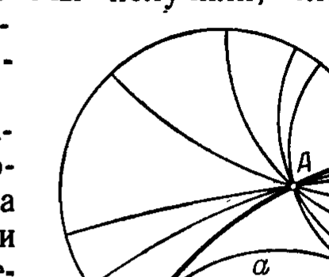
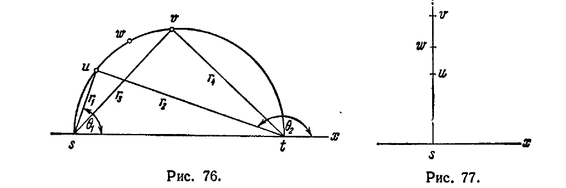
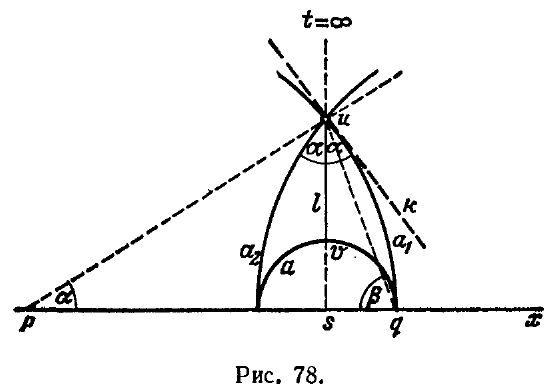
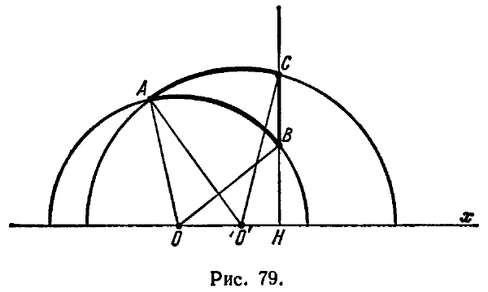

## 10. Основные метрические соотношения в геометрии Лобачевского

---
**стр. 177**
---

га $K$. Пусть $a$ — круговая дуга, ортогональная к окружности $K$, $A$ — точка внутри $K$, не лежащая на этой дуге (рис. 75). Средствами евклидовой элементарной геометрии легко показать, что через точку $A$ проходит бесконечно много круговых дуг, ортогональных к окружности $K$ и не пересекающих дуги $a$. А это означает, что в смысле тех отношений, которые установлены для неевклидовых образов внутри $K$, в системе этих образов осуществляется постулат о параллельных Лобачевского. Мы получили, следовательно, новую интерпретацию планиметрии Лобачевского на плоскости Евклида.

Каждое предложение геометрии Лобачевского, высказанное в абстрактной форме, может быть интерпретировано на евклидовой полуплоскости или внутри евклидова круга; при этом получится некоторая теорема евклидовой геометрии, конкретный смысл которой будет зависеть от избираемого способа интерпретации. Возможность получения таким путем евклидовых теорем из абстрактно логической схемы Лобачевского находит себе применение в геометрической теории функций комплексного переменного, в которой также устанавливается тесная близость двух описанных выше интерпретаций геометрии Лобачевского и указываются общие принципы построения бесконечного множества других интерпретаций *).

10. Основные метрические соотношения в геометрии Лобачевского

§ 55. Своеобразие геометрии Лобачевского особенно ярко проявляется при знакомстве с ее метрическими соотношениями, т. е. соотношениями между различными геометрическими величинами. Одно из таких соотношений, именно, выражение площади треугольника через сумму его внутренних углов, дано нами в § 48. В этом разделе мы установим основную формулу Лобачевского, которая выражает угол параллельности через соответствующий ему отрезок, и формулы тригонометрии Лобачевского (которые устанавливают зависимости между сторонами и углами треугольника). При выводе этих формул мы будем предполагать, что плоскость Лобачевского реализована в виде модели Пуанкаре, т. е. слова «точка», «прямая», «лежит на», «между», «конгруэнтны» будем понимать определенным образом так, как условлено в

*) См., например, А. И. Маркушевич, Элементы теории аналитических функций.

---
**стр. 178**
---

§§ 50—52. Такой вывод основных формул Лобачевского достаточно прост и нагляден, кроме того, он хорошо выявляет связи геометрии Лобачевского с теорией функций комплексной переменной; но, конечно, такой вывод не дает права утверждать, что полученные с его помощью формулы справедливы в геометрии Лобачевского вообще, т. е. имеют место при истолковании ее на любой модели.

В главе VII мы дадим вывод тех же формул, исходя из аксиом и не считая их реализованными на какой бы то ни было модели. Тем самым будет доказано, что эти формулы справедливы для любой модели геометрии Лобачевского. Вывод основных формул геометрии Лобачевского, содержащийся в главе VII, тоже очень прост, но основан на некоторых предложениях проективной геометрии. Эти предложения сформулированы в главе VII; поэтому читатель, который согласится принять их на веру, может при желании пропустить главы, посвященные проективной геометрии, и сразу ознакомиться с абстрактным выводом формул Лобачевского (см. §§ 216—221, 229—232).

§ 56. Сначала нам придется сообщить некоторые предложения об инвариантах дробно-линейных преобразований комплексной переменной. Как обычно, мы будем число $z = x + iy$ изображать точкой с декартовыми прямоугольными координатами $x, y$; слова «число $z$» и «точка $z$» будем употреблять на равных правах.

Рассмотрим преобразование

$$z' = \frac{\alpha z + \beta}{\gamma z + \delta}, \qquad (1)$$

где $z$ — комплексная переменная, $\alpha, \beta, \gamma, \delta$ — постоянные (вообще говоря, комплексные). Преобразование переменной $z$ в переменную $z'$, определяемое формулой вида (1), называется дробно-линейным (мы уже встречались с дробно-линейными преобразованиями в § 51). Само собой разумеется, что в формуле (1) хотя бы одно из чисел $\gamma, \delta$ следует предполагать отличным от нуля.

Число $\Delta = \alpha\delta - \beta\gamma$ называется *определителем* дробно-линейного преобразования. Легко убедиться, что если $\Delta = 0$, то всем точкам $z$ (выбираемым, конечно, при условии $\gamma z + \delta \neq 0$) по формуле (1) соответствует одна и та же точка $z'$. В самом деле, если $\Delta = 0$, то числа $\alpha, \beta$ пропорциональны числам $\gamma, \delta$, т. е. $\alpha = k\gamma$, $\beta = k\delta$ и, следовательно,

$$z' = \frac{\alpha z + \beta}{\gamma z + \delta} = \frac{k(\gamma z + \delta)}{\gamma z + \delta} = k.$$

Напротив, если $\Delta \neq 0$, то разным точкам $z_1, z_2$ по формуле (1) соответствуют также разные точки $z'_1, z'_2$. В самом деле, мы имеем:

$$z'_1 - z'_2 = \frac{\alpha z_1 + \beta}{\gamma z_1 + \delta} - \frac{\alpha z_2 + \beta}{\gamma z_2 + \delta} = \frac{\alpha\delta - \beta\gamma}{(\gamma z_1 + \delta)(\gamma z_2 + \delta)} (z_1 - z_2),$$

---
**стр. 179**
---

т. е.

$$z'_1 - z'_2 = \frac{\Delta}{(\gamma z_1 + \delta)(\gamma z_2 + \delta)} (z_1 - z_2). \qquad (2)$$

Таким образом, при $\Delta \neq 0$, если $z_1 \neq z_2$, то и $z'_1 \neq z'_2$.

В случае $\Delta = 0$ дробно-линейное преобразование называется *вырожденным*, в случае $\Delta \neq 0$ — *невырожденным*. Согласно предыдущему вырожденное преобразование отображает все точки плоскости в одну; невырожденное преобразование разные точки отображает в разные. И в том и в другом случае точка $z$, для которой $\gamma z + \delta = 0$, должна быть исключена из рассмотрения: для нее соответствующей точки нет совсем.

В дальнейшем мы будем рассматривать только невырожденные дробно-линейные преобразования. Для нас существенно, что каждое невырожденное дробно-линейное преобразование вида (1) имеет обратное преобразование

$$z = \frac{\delta z' - \beta}{-\gamma z' + \alpha}, \qquad (3)$$

которое, очевидно, также является дробно-линейным и невырожденным (преобразование (3) невырождено, так как его определитель $\Delta' = \alpha\delta - \beta\gamma = \Delta \neq 0$).

Наличие исключительной точки $z = -\delta/\gamma$, для которой формула (1) теряет смысл, осложняет формулировку предложений о дробно-линейных преобразованиях. Для удобства таких формулировок дополним плоскость комплексной переменной новым объектом, который будем называть *бесконечно удаленной точкой* и обозначать символом $\infty$; условимся считать, что в невырожденном преобразовании вида (1) точка $z = -\delta/\gamma$ имеет своим образом бесконечно удаленную точку. Бесконечно удаленная точка сопоставляется в качестве образа с исключительной точкой каждого невырожденного дробно-линейного преобразования. В частности, относительно преобразования (3) бесконечно удаленная точка является образом точки $z' = \alpha/\gamma$. Так как преобразования (1) и (3) взаимно обратны, то по отношению к преобразованию (1) бесконечно удаленную точку следует считать п р о о б р а з о м точки $z' = \alpha/\gamma$. Итак, согласно нашему условию невырожденное преобразование (1) переводит точку $z = -\delta/\gamma$ в точку $z' = \infty$ и точку $z = \infty$ в точку $z' = \alpha/\gamma$.

Заметим, наконец, что если $\gamma = 0$, то исключительной точки нет, каждая точка плоскости имеет (обыкновенный) образ. По отношению к таким преобразованиям условимся считать, что образом бесконечно удаленной точки является она сама.

Пусть $u, v, s, t$ — четыре различные точки. Предположим, что

---
**стр. 180**
---

все эти точки — обыкновенные (т. е. среди них нет бесконечно удаленной). Тогда число, обозначаемое символом $(uvst)$ и определяемое равенством

$$(uvst) = \frac{u-s}{u-t} : \frac{v-s}{v-t}, \qquad (3')$$

называется *сложным отношением* точек $u, v, s, t$, заданных в порядке их записи. Сложное отношение тех же точек, но заданных в другом порядке, может иметь уже другое значение; например, если $(uvst) = \lambda$, то

$$(vust) = \frac{1}{\lambda}, \qquad (uvts) = \frac{1}{\lambda}. \qquad (4)$$

Если среди заданных точек имеется бесконечно удаленная, сложное отношение определяется одной из следующих формул:

$$(uvs\infty) = \frac{u-s}{v-s}, \qquad (uv\infty t) = \frac{v-t}{u-t},$$

$$(u\infty st) = \frac{u-s}{u-t}, \qquad (\infty vst) = \frac{v-t}{v-s}. \qquad (5)$$

Заметим, что первая из этих формул получается предельным переходом в формуле (3') при $t \to \infty$, вторая — при $s \to \infty$ и т. д.

Сложное отношение четырех точек является инвариантом невырожденных дробно-линейных преобразований; это значит, что если при некотором невырожденном дробно-линейном преобразовании четыре точки $u, v, s, t$ переходят в точки $u', v', s', t'$, то $(u'v's't') = (uvst)$.

Проведем доказательство сначала для случая, когда среди данных точек и среди их образов нет бесконечно удаленной точки. Пусть преобразование, переводящее $u, v, s, t$ в $u', v', s', t'$, задано формулой (1); согласно формуле (2) имеем:

$$u' - s' = \frac{\Delta}{(\gamma u + \delta)(\gamma s + \delta)} (u - s), \qquad u' - t' = \frac{\Delta}{(\gamma u + \delta)(\gamma t + \delta)} (u - t),$$

откуда

$$\frac{u' - s'}{u' - t'} = \frac{u - s}{u - t} \cdot \frac{\gamma t + \delta}{\gamma s + \delta}.$$

Аналогично

$$\frac{v' - s'}{v' - t'} = \frac{v - s}{v - t} \cdot \frac{\gamma t + \delta}{\gamma s + \delta}.$$

Следовательно,

$$\frac{u' - s'}{u' - t'} : \frac{v' - s'}{v' - t'} = \frac{u - s}{u - t} : \frac{v - s}{v - t},$$

т. е. $(u'v's't') = (uvst)$.

---
**стр. 181**
---

Предположим теперь, что все точки $u, v, s, t$ — обыкновенные, а одна из точек $u', v', s', t'$ является бесконечно удаленной, например $t' = \infty$. Это значит, что $\gamma t + \delta = 0$. Тогда

$$(u'v's't') = (u'v's'\infty) = \frac{u' - s'}{v' - s'} = \frac{u - s}{v - s} \cdot \frac{\gamma v + \delta}{\gamma u + \delta} =$$

$$= \frac{u - s}{v - s} \cdot \frac{v + (\delta/\gamma)}{u + (\delta/\gamma)} = \frac{u - s}{v - s} \cdot \frac{v - t}{u - t} = \frac{u - s}{u - t} : \frac{v - s}{v - t} = (uvst).$$

Случай, когда одна из точек $u, v, s, t$ бесконечно удаленная, а все точки $u', v', s', t'$ — обыкновенные, сводится к предыдущему. В самом деле, рассматривая преобразование, обратное данному, на основании предыдущего найдем $(uvst) = (u'v's't')$.

Остается рассмотреть случай, когда одна из точек $u, v, s, t$ является бесконечно удаленной и имеет бесконечно удаленный образ; если преобразование задано формулой (1), то этот случай имеет место при $\gamma = 0$.

Пусть, например, $t = \infty$ и $t' = \infty$. Тогда

$$(u'v's't') = (u'v's'\infty) = \frac{u' - s'}{v' - s'} = \frac{u - s}{v - s} \cdot \frac{\gamma v + \delta}{\gamma u + \delta} = \frac{u - s}{v - s} \cdot \frac{\delta}{\delta} = \frac{u - s}{v - s} =$$

$$= (uvs\infty) = (uvst).$$

Итак, во всех случаях $(u'v's't') = (uvst)$; утверждение доказано.

§ 57. Нам придется иметь дело еще с преобразованием переменной $z$ в переменную $z'$, которое определяется формулой

$$z' = \frac{\alpha\bar{z} + \beta}{\gamma\bar{z} + \delta}, \qquad (6)$$

и называется дробно-линейным преобразованием второго рода (напомним читателю, что $\bar{z}$ обозначает число, сопряженное числу $z$). Такие преобразования уже встречались нам в § 51.

Преобразование вида (6) называется *вырожденным*, если $\Delta = \alpha\delta - \beta\gamma = 0$, *невырожденным*, если $\Delta \neq 0$; вырожденное преобразование все точки отображает в одну, невырожденное — разные точки отображает в разные (доказывается так же, как аналогичное утверждение для преобразований первого рода). В дальнейшем среди преобразований вида (6) мы будем рассматривать только невырожденные.

Пусть $u, v, s, t$ — какие угодно различные точки, $u', v', s', t'$ — их образы относительно невырожденного преобразования вида (6); тогда сложное отношение точек $u', v', s', t'$ есть число, сопряженное сложному отношению точек $u, v, s, t$. Символически это утверждение выражается равенством

$$(u'v's't') = \overline{(uvst)}.$$

---
**стр. 182**
---

Для доказательства представим преобразование (6) в виде произведения двух преобразований:

$$z' = \frac{\alpha z'' + \beta}{\gamma z'' + \delta} \tag{7}$$

и

$$z'' = \bar{z}. \tag{8}$$

По отношению к преобразованию (8) будем считать, что образом бесконечно удаленной точки является она сама. Заметим теперь, что если все числа, составляющие сложное отношение, мы заменим сопряженными числами, то и само сложное отношение заменится сопряженным ему числом. Поэтому, обозначая через $u''$, $v''$, $s''$, $t''$ образы точек $u$, $v$, $s$, $t$ относительно преобразования (8), найдем:

$$(u'' v'' s'' t'') = \overline{(uvst)}.$$

Далее, так как преобразование (7) является дробно-линейным преобразованием 1-го рода, то

$$(u' v' s' t') = (u'' v'' s'' t'').$$

Из этих двух равенств получаем

$$(u' v' s' t') = \overline{(uvst)},$$

что и требовалось.

**§ 58.** Теперь мы приступаем к изложению основной темы этого раздела. Прежде всего мы установим формулу, которая выражает неевклидово расстояние между двумя точками модели Пуанкаре (см. §§ 50—52).

Пусть $u$, $v$ — две точки верхней полуплоскости. Неевклидова прямая, проходящая через точки $u$, $v$, изображается евклидовой полуокружностью, которая проходит через эти точки и ортогональна к оси $x$. Обозначим через $s$ и $t$ точки, в которых эта полуокружность опирается на ось $x$ (рис. 76; напомним читателю, что точки оси $x$, в том числе $s$ и $t$, не входят в состав модели Пуанкаре). Если ортогональная к оси $x$ полуокружность, проходящая через точки $u$, $v$, вырождается в (евклидову) прямую, то буквой $s$ мы обозначим точку, в которой эта прямая опирается на ось $x$, буквой $t$ — бесконечно удаленную точку (рис. 77). Рассмотрим сложное отношение $(uvst)$. Легко показать, что $(uvst)$ есть число вещественное и положительное. Проведем сначала доказательство для случая, который соответствует рис. 76 (точку $s$ предполагаем левее $t$). Обозначим через $r_1$ и $r_2$ модули чисел $u - s$ и $u - t$, через $\theta_1$ и $\theta_2$ — их аргументы. Так как $\angle (sut)$ прямой, то

$$\theta_2 - \theta_1 = \pi/2;$$

---
**стр. 183**
---

следовательно,

$$\frac{u - s}{u - t} = \frac{r_1}{r_2} e^{i(\theta_1 - \theta_2)} = \frac{r_1}{r_2} e^{-i\frac{\pi}{2}}.$$

Аналогично

$$\frac{v - s}{v - t} = \frac{r_3}{r_4} e^{-i\frac{\pi}{2}},$$

где $r_3 = |v - s|$, $r_4 = |v - t|$. Отсюда

$$(uvst) = \frac{r_1}{r_2} : \frac{r_3}{r_4} > 0. \tag{9}$$

В случае, соответствующем рис. 77, числа $u - s$ и $v - s$ вещественны и имеют одинаковые знаки; следовательно, в этом случае

$$(uvst) = (uvs\infty) = \frac{u - s}{v - s} = \frac{r_1}{r_3} > 0. \tag{10}$$

Итак, $(uvst) > 0$. Ввиду этого обстоятельства мы можем брать логарифм числа $(uvst)$, понимая логарифм в смысле элементарной алгебры.

Мы докажем, что неевклидово расстояние между произвольными точками $u$ и $v$ модели Пуанкаре выражается формулой

$$\rho(u, v) = R |\ln (uvst)|, \tag{11}$$

где $R$ — некоторая положительная постоянная (выбор постоянной $R$ равносилен выбору масштаба).

Для доказательства мы должны установить, что $\rho(u, v)$ удовлетворяет трем условиям определения длины отрезка (см. определение 12 § 20). Убедимся в этом.

1. Пусть $u'$, $v'$ — пара точек верхней полуплоскости, определяющая неевклидов отрезок, конгруэнтный неевклидову отрезку, который определяет пара точек $u$, $v$. Пусть $s'$, $t'$ — точки, которые находятся по точкам $u'$, $v'$ таким же построением, каким точки $s$, $t$ находятся по точкам $u$, $v$. Согласно определению конгруэнтности неевклидовых отрезков модели Пуанкаре (см. § 52),

---
**стр. 184**
---

если неевклидов отрезок $uv$ конгруэнтен неевклидову отрезку $u'v'$, то существует последовательность инверсий, произведение которых переводит точки $u$, $v$, $s$, $t$ в точки $u'$, $v'$, $s'$, $t'$. Как показано в § 51, произведение любого числа инверсий представляет собой дробно-линейное преобразование либо первого, либо второго рода; и в том и в другом случае преобразование не вырожденно, так как каждая инверсия разные точки отображает в разные точки. В первом случае мы имеем $(u' v' s' t') = (uvst)$ (см. § 55), во втором — $(u' v' s' t') = \overline{(uvst)}$ (см. § 56). Но выше в этом параграфе мы показали, что $(uvst)$ есть число вещественное; следовательно, $\overline{(uvst)} = (uvst)$. Таким образом, и в том и в другом случае $(u' v' s' t') = (uvst)$. Отсюда и по формуле (11) получаем $\rho(u'v') = \rho(uv)$. Заметим, наконец, что $(uvst) \neq 1$ (это сразу вытекает из формул (9) и (10)), следовательно $\ln (uvst) \neq 0$ и $\rho(uv) > 0$. Итак, по формуле (11), с каждым неевклидовым отрезком сопоставлено положительное число, причем конгруэнтным отрезкам соответствуют равные числа. Тем самым первое требование определения 12 § 20 удовлетворено.

2. Пусть $w$ — произвольная точка, лежащая внутри неевклидова отрезка $uv$ (рис. 76, 77). Несложным вычислением легко убедиться, что

$$(uvst) = (uwst)(wvst)$$

и что числа $(uwst)$ и $(wvst)$ либо оба больше единицы, либо оба меньше единицы (для этой цели проще всего воспользоваться формулами (9) и (10)). Отсюда следует, что

$$\ln (uvst) = \ln (uwst) + \ln (wvst),$$

причем в правой части либо оба логарифма положительны, либо оба логарифма отрицательны. Таким образом,

$$|\ln (uvst)| = |\ln (uwst)| + |\ln (wvst)|$$

и по формуле (11) имеем:

$$\rho(uv) = \rho(uw) + \rho(wv).$$

Тем самым, второе требование определения 12 § 20 удовлетворено.

3. Если точка $v$ по неевклидовой прямой стремится к точке $u$, то $(uvst) \to 1$; если точка $v$ стремится к точке $t$, то $(uvst) \to 0$ (см. рис. 76 и формулу (9), где $r_1$, $r_2$, $r_3$, $r_4$ означают евклидовы расстояния между точками $u$ и $s$, $u$ и $t$, $v$ и $s$, $v$ и $t$). В первом случае $\ln (uvst) \to 0$, во втором $\ln (uvst) \to -\infty$; соответственно в первом случае $\rho(uv) \to 0$, во втором $\rho(uv) \to +\infty$.

Из формулы (11) видно, что $\rho(uv)$ непрерывно зависит от точки $v$. Отсюда и из предыдущего рассуждения следует, что $\rho(uv)$ принимает все значения между 0 и $+\infty$; в частности, найдется пара

---
**стр. 185**
---

точек $u$, $v$, для которой $\rho(uv) = 1$. Значит, и третье требование определения 12 § 20 удовлетворено.

Тем самым мы доказали, что число $\rho(uv)$, сопоставленное по формуле (11) с произвольной парой точек $u$, $v$, есть длина неевклидова отрезка $uv$ (в некотором масштабе), или, иначе говоря, неевклидово расстояние между точками $u$ и $v$.

Если масштабный отрезок $u_1 v_1$ назначен заранее, то постоянная $R$ в формуле (11) должна быть определена соответственно равенству $\rho(u_1 v_1) = 1$.

**§ 59.** Здесь мы получим знаменитую формулу Лобачевского, выражающую функцию $\Pi(x)$ через элементарные функции аргумента $x$. Напомним читателю, что $\alpha = \Pi(x)$ означает угол параллельности, соответствующий отрезку длины $x$ (см. § 33 и рис. 46). Так как в этом разделе буквой $x$ мы обозначали абсциссы точек модели Пуанкаре, то во избежание недоразумений будем сейчас аргумент функции Лобачевского обозначать буквой $l$.

Угол параллельности, соответствующий некоторому отрезку, определяется длиной этого отрезка и не зависит от его расположения; поэтому мы можем при выводе искомой формулы взять

неевклидов отрезок на модели Пуанкаре так, чтобы последующие выкладки оказались наиболее простыми. Имея в виду это обстоятельство, мы будем рассматривать неевклидов отрезок, который на модели Пуанкаре изображается отрезком евклидовой прямой, перпендикулярной к оси $x$. Пусть $u$ и $v$ — концы рассматриваемого отрезка, $s$ — точка пересечения прямой $uv$ с осью $x$ (рис. 78); будем считать, что точка $u$ на модели лежит выше $v$, кроме того, мы можем предполагать, что евклидово расстояние точки $v$ от оси $x$ равно единице. Остальные нужные нам объекты поясняются рис. 78. Здесь буквой $a$ помечена полуокружность, которая изображает неевклидову прямую, перпендикулярную к

---
**стр. 186**
---

отрезку $uv$ в его конце $v$, буквами $a_1$ и $a_2$ — полуокружности, изображающие неевклидовы прямые, проходящие через точку $u$; буквой $a$ — полуокружность, изображающая данную неевклидову прямую, перпендикулярную к отрезку $uv$; $p$ — центр полуокружности $a_1$; $q$ — общий конец полуокружностей $a$ и $a_1$ на оси $x$. На модели Пуанкаре неевклидов угол совпадает с евклидовым; поэтому $\alpha$ есть угол параллельности, соответствующий отрезку $uv$, неевклидова длина которого обозначается через $l$.

Обозначим через $h$ евклидово расстояние между точками $u$ и $s$; в силу принятого нами предположения $u - s = h$, $v - s = 1$. Тогда по формуле (11)

$$l = R |\ln (uvs\infty)| = R \left|\ln \frac{u - s}{v - s}\right| = R |\ln h|.$$

Так как $h > 1$, то $\ln h > 0$; следовательно,

$$l = R \ln h. \tag{12}$$

Угол $\angle upq$ равен $\alpha$. Проведем касательную $uk$ к полуокружности $a_1$ в точке $u$; тогда $us \perp pq$ и $uk \perp up$. Из доказанного в § 38 следует, что треугольник $upq$ равнобедренный, откуда $\angle uqp = \beta = \frac{\pi - \alpha}{2}$. Рассматривая прямоугольный треугольник $usq$, получаем

$$h = \operatorname{tg} \beta = \operatorname{ctg} \frac{\alpha}{2}. \tag{13}$$

Из (12) и (13) следует:

$$l = R \ln \operatorname{ctg} \frac{\alpha}{2},$$

$$\alpha = 2 \operatorname{arctg} e^{-l/R}.$$

Так как $\alpha = \Pi(l)$, то

$$\Pi(l) = 2 \operatorname{arctg} e^{-l/R}. \tag{14}$$

Таким образом, мы получили формулу Лобачевского (14), которая служит основой для всех дальнейших выкладок.

**§ 60.** Будем рассматривать отрезки плоскости Лобачевского, длины которых не превосходят некоторое положительное число $L$. Положим

$$\alpha_0 = 2 \operatorname{arctg} e^{-L/R},$$

тогда при $l \leqslant L$ имеем:

$$\alpha_0 \leqslant \Pi(l) < \pi/2.$$

---
**стр. 187**
---

Из приведенного неравенства видно, что величина $\alpha_0$ может быть сколь угодно близка к $\pi/2$, если величина $R$ достаточно велика по сравнению с $L$; следовательно, и угол параллельности $\Pi(l)$ при $l \leqslant L$ может быть сколь угодно близок к прямому углу. Иначе говоря, чем больше $R$, тем менее заметна неевклидовость плоскости на отрезках, длина которых не превосходит $L$. Таким образом, $R$ можно рассматривать как меру неевклидовости плоскости. На модели Пуанкаре в качестве радиуса кривизны удобно взять такой отрезок $uv$, для которого $\ln (uvst) = 1$. Более общее описание радиуса кривизны, не связывающееся с какой-либо конкретной моделью, дано в § 216.

**§ 61.** В этом параграфе мы установим основные соотношения тригонометрии Лобачевского, предполагая, как и раньше, что плоскость Лобачевского изображена в виде модели Пуанкаре.

Пусть $ABC$ — треугольник, величины углов $A$, $B$, $C$ которого мы обозначим через $\alpha$, $\beta$, $\gamma$, а длины неевклидовых сторон $BC$, $CA$, $AB$ — соответственно через $a$, $b$, $c$. С помощью конгруэнтного перемещения треугольник $ABC$ можно поместить относительно декартовых осей $Ox$ и $Oy$ так, как это сделано на рис. 79: пусть неевклидова прямая $BC$ изображается евклидовой полупрямой, перпендикулярной к оси $Ox$; пусть $H$ — точка, в которой эта полупрямая встречает ось $Ox$. Неевклидовы прямые $AB$ и $AC$ будут изображаться некоторыми евклидовыми

---
**стр. 188**
---

полуокружностями с центрами на оси $Ox$; обозначим их центры буквами $O$ и $O'$. Не ограничивая общности, мы можем считать, что $B$ лежит между $H$ и $C$. Тогда

$$a = R \ln \frac{HC}{HB}, \quad (1)$$

где $HC$ и $HB$ — евклидовы длины отрезков (формула (1) доказывается так же, как формула (12) § 60). Дальнейшие выводы основаны на формуле (1).

Прежде всего получим выражения сторон треугольника через его углы*). Из формулы (1) имеем

$$\text{ch} \frac{a}{R} = \frac{1}{2} \left( \frac{HC}{HB} + \frac{HB}{HC} \right) = \frac{HB^2 + HC^2}{2 HB \cdot HC}. \quad (2)$$

Напишем очевидные евклидовы соотношения:

$$HB^2 = OB^2 - OH^2 = OA^2 - OH^2,$$

$$HC^2 = O'C^2 - O'H^2 = O'A^2 - O'H^2.$$

Отсюда

$$
\begin{aligned}
HB^2 + HC^2 &= (OA^2 + O'A^2) - (OH^2 + O'H^2) = \\
&= (OO'^2 + 2 OA \cdot O'A \cos (\angle OAO')) - [(OH - O'H)^2 + 2 OH \cdot O'H] = \\
&= 2 OB \cdot O'C \cos (\angle OAO') - 2 OH \cdot O'H; \quad (3)
\end{aligned}
$$

для простоты выкладки проводятся применительно к рис. 79, где $O'$ лежит между $O$ и $H$. Из равенств (2) и (3) получаем

$$\text{ch} \frac{a}{R} = \frac{OB}{HB} \cdot \frac{O'C}{HC} \cos (\angle OAO') - \frac{OH}{HB} \cdot \frac{O'H}{HC}. \quad (4)$$

Заметим теперь, что

$$\frac{OB}{HB} = \frac{1}{\sin (\angle BON)} = \frac{1}{\sin \beta}, \quad \frac{O'C}{HC} = \frac{1}{\sin (\angle CO'H)} = \frac{1}{\sin \gamma},$$

$$\angle OAO' = \alpha, \quad \frac{OH}{HB} = \text{ctg} (\angle BOH) = \text{ctg} \beta,$$

$$\frac{O'H}{HC} = \text{ctg} (\angle CO'H) = \text{ctg} (\pi - \gamma) = -\text{ctg} \gamma.$$

Из равенства (4) и из последних выражений найдем, наконец:

$$\text{ch} \frac{a}{R} = \frac{\cos \alpha + \cos \beta \cos \gamma}{\sin \beta \sin \gamma}. \quad \text{(I)}$$

*) Приводимый далее вывод формул тригонометрии Лобачевского сообщил автору для четвертого издания книги вьетнамский математик Нгуен Кан Тоан.

---
**стр. 189**
---

Две другие формулы, выражающие неевклидовы длины сторон $b$ и $c$, получим из (I) круговой перестановкой символов $\alpha, \beta, \gamma$.

Формула (I) выражает сторону треугольника через его углы. Наличие такой формулы означает, что в геометрии Лобачевского треугольник определяется своими углами; вместе с тем, отсюда следует, что в геометрии Лобачевского нет подобия фигур. Естественно поэтому, что в евклидовой геометрии нет формулы, аналогичной формуле (I).

Из формулы (I) легко вывести *соотношения между сторонами и углами неевклидова треугольника, которые соответствуют евклидовой теореме синусов.* В самом деле,

$$\frac{\text{sh} \frac{a}{R}}{\sin \alpha} = \frac{\sqrt{\text{ch}^2 \frac{a}{R} - 1}}{\sin \alpha} = \frac{\sqrt{(\cos \alpha + \cos \beta \cos \gamma)^2 - \sin^2 \beta \sin^2 \gamma}}{\sin \alpha \sin \beta \sin \gamma}. \quad (5)$$

Полагая

$$Q = (\cos \alpha + \cos \beta \cos \gamma)^2 - \sin^2 \beta \sin^2 \gamma =$$

$$= \cos^2 \alpha + \cos^2 \beta + \cos^2 \gamma + 2 \cos \alpha \cos \beta \cos \gamma - 1,$$

видим, что это выражение симметрично относительно $\alpha, \beta, \gamma$. Следовательно, и правая часть (5) обладает такой симметрией; таким образом, получаем

$$\frac{\text{sh} \frac{a}{R}}{\sin \alpha} = \frac{\text{sh} \frac{b}{R}}{\sin \beta} = \frac{\text{sh} \frac{c}{R}}{\sin \gamma} = \frac{\sqrt{Q}}{\sin \alpha \sin \beta \sin \gamma}. \quad \text{(II)}$$

Из формулы (I) можно получить также *выражения углов треугольника через стороны.* С этой целью напишем равенства:

$$\text{ch} \frac{b}{R} \text{ch} \frac{c}{R} = \frac{(\cos \beta + \cos \gamma \cos \alpha)(\cos \gamma + \cos \alpha \cos \beta)}{\sin^2 \alpha \sin \beta \sin \gamma},$$

$$\text{sh} \frac{b}{R} \text{sh} \frac{c}{R} \cos \alpha = \frac{Q \cos \alpha}{\sin^2 \alpha \sin \beta \sin \gamma}.$$

Отсюда

$$\text{ch} \frac{b}{R} \text{ch} \frac{c}{R} - \text{sh} \frac{b}{R} \text{sh} \frac{c}{R} \cos \alpha =$$

$$= \frac{(1 - \cos^2 \alpha) \cos \alpha + (1 - \cos^2 \alpha) \cos \beta \cos \gamma}{\sin^2 \alpha \sin \beta \sin \gamma} = \frac{\cos \alpha + \cos \beta \cos \gamma}{\sin \beta \sin \gamma} = \text{ch} \frac{a}{R}.$$

Таким образом, имеет место формула

$$\cos \alpha = \left( \text{ch} \frac{b}{R} \text{ch} \frac{c}{R} - \text{ch} \frac{a}{R} \right) \cdot \left( \text{sh} \frac{b}{R} \text{sh} \frac{c}{R} \right)^{-1}. \quad \text{(III)}$$

---
**стр. 190**
---

Сравнивая (I) и (III), можно обнаружить, что в геометрии Лобачевского между сторонами и углами треугольника существует определенная взаимность.

Найдем теперь соотношения между сторонами и углами прямоугольного треугольника. Для этого достаточно в формулах вида (I), (II), (III) положить, например, $\gamma = \pi/2$. Так получим

1) зависимость между катетом, гипотенузой и одним из острых углов:

$$\text{sh} \frac{a}{R} = \text{sh} \frac{c}{R} \sin \alpha, \quad \text{th} \frac{a}{R} = \text{th} \frac{c}{R} \cos \beta;$$

2) зависимость между двумя катетами и одним острым углом:

$$\text{th} \frac{a}{R} = \text{sh} \frac{b}{R} \text{tg} \alpha;$$

3) зависимость между гипотенузой и катетами (аналог теоремы Пифагора):

$$\text{ch} \frac{c}{R} = \text{ch} \frac{a}{R} \text{ch} \frac{b}{R}.$$

Отметим еще два соотношения:

$$\text{ch} \frac{c}{R} = \text{ctg} \alpha \text{ctg} \beta, \quad \text{ch} \frac{a}{R} = \frac{\cos \alpha}{\sin \beta}.$$

Они выражают стороны прямоугольного треугольника через углы и поэтому не имеют аналога в евклидовой геометрии.

§ 62. Изменяя запись формулы (III), получим

$$\text{ch} \frac{a}{R} = \text{ch} \frac{b}{R} \text{ch} \frac{c}{R} - \text{sh} \frac{b}{R} \text{sh} \frac{c}{R} \cos \alpha; \qquad \text{(A)}$$

в таком виде эта формула выражает сторону произвольного неевклидова треугольника через две другие стороны и косинус противолежащего угла.

Сравним последнее соотношение с известной формулой сферической тригонометрии:

$$\cos \frac{a}{R} = \cos \frac{b}{R} \cos \frac{c}{R} + \sin \frac{b}{R} \sin \frac{c}{R} \cos \alpha, \qquad \text{(Б)}$$

где $R$ — радиус сферы. Из этой формулы вместе с двумя другими, получаемыми циклической перестановкой сторон углов<!-- вероятная опечатка оригинала: «сторон и углов»? -->, выводятся остальные формулы сферической тригонометрии.

Формула (Б) переходит в формулу (A) путем замены $R$ на $Ri$ ($i = \sqrt{-1}$).
