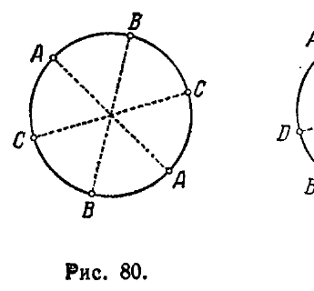
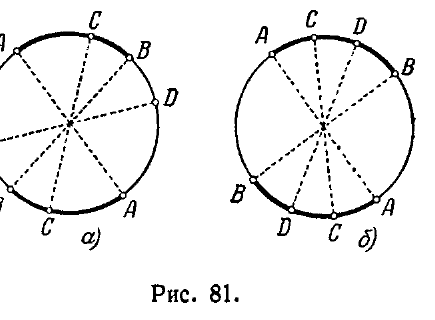
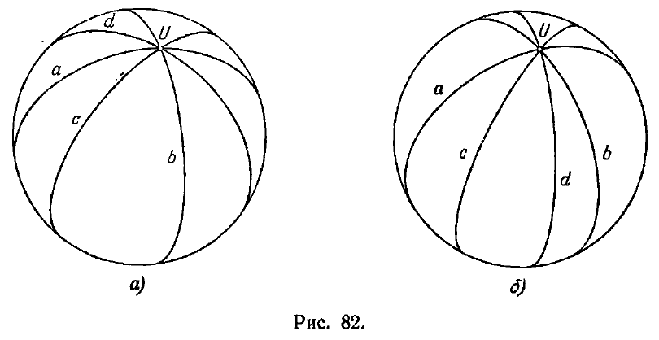
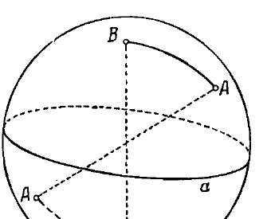
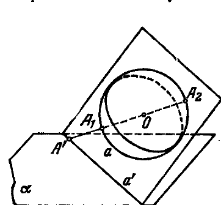
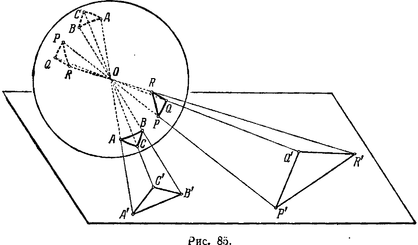

## 11. Краткие сведения о геометрии Римана

---
**стр. 191**
---

Имея в виду это обстоятельство, говорят, что *тригонометрию Лобачевского можно рассматривать как тригонометрию на сфере мнимого радиуса*.

Глубокие источники связи геометрии Лобачевского с геометрией на сфере (а также с геометрией Римана, которая излагается в следующем разделе) будут со всей подробностью выяснены в главе VIII.

**11. Краткие сведения о геометрии Римана**

§ 63. В предыдущих разделах мы неоднократно упоминали сферическую геометрию наряду с геометриями Евклида и Лобачевского. Сопоставление этих геометрий, естественно, напрашивалось, когда мы обнаруживали у них элементы сходства (как в §§ 48, 62), или рассматривали их с некоторой общей точки зрения (как в §§ 45—47). Но сейчас нам нужно обратить внимание читателя на одну весьма существенную черту различия между сферической геометрией, с одной стороны, и геометриями Лобачевского и Евклида — с другой. Именно, на плоскости Евклида, как и на плоскости Лобачевского, две прямые могут иметь не более одной общей точки; напротив, в геометрии на сфере, где роль прямых играют большие круги сферы (см. § 45), две «прямые» (т. е. два больших круга) всегда пересекаются в двух диаметрально противоположных точках сферы. Таким образом, в сферической геометрии не имеет места одно из самых основных положений геометрий Евклида и Лобачевского о том, что через две разные точки проходит только одна прямая.

Существует геометрическая система, которая во множестве отношений сходна со сферической геометрией, но в которой только что указанное основное положение элементарной геометрии имеет место. Эта геометрическая система называется *геометрией Римана* (она уже упоминалась в § 10). Геометрия Римана является необходимым дополнением к геометриям Евклида и Лобачевского.

Совместное исследование этих трех геометрий позволило дать полное решение наиболее принципиальных геометрических проблем XIX столетия (см. гл. VI—IX). Сущность геометрии Римана излагается в ближайших параграфах.

§ 64. Рассмотрим в евклидовом пространстве произвольную сферу $k$. Условимся «отождествлять» диаметрально противоположные точки этой сферы, т. е. каждую пару диаметрально противоположных точек сферы $k$ рассматривать как единый объект; будем этот объект называть «точкой» некоторой особой геометрии, о которой сейчас пойдет речь. Каждый большой круг сферы $k$ условимся называть «прямой».

Будем говорить, что «точка» $A$ лежит на «прямой» $a$ (или, что «прямая» $a$ проходит через «точку» $A$), если обыкновенные точки

---
**стр. 192**
---

сферы $k$, составляющие «точку» $A$, лежат на большом круге, который изображает «прямую» $a$. Очевидно, что

1) через каждые две «точки» проходит «прямая»,

2) через каждые две «точки» проходит только одна «прямая»,

3) на каждой «прямой» лежат по меньшей мере две «точки» (даже бесконечно много «точек»); можно указать три «точки», не лежащие на одной «прямой».

Таким образом, для рассматриваемого множества «точек» и «прямых» соблюдены все аксиомы связи элементарной планиметрии (см. § 12 аксиомы I,1, I,2, I,3). Напротив, аксиомы порядка в том виде, как они сформулированы для элементарной геометрии, здесь неприменимы. Дело в том, что в этих

аксиомах характеризуется понятие о расположении обыкновенной точки между двумя другими обыкновенными точками на обыкновенной прямой. Но для наших условных «точек» на условной «прямой» понятие «между» не имеет смысла. Действительно, рассматривая три произвольные «точки» $A, B, C$ на «прямой» (т. е. три пары диаметрально противоположных точек окружности; рис. 80), мы не сможем в их взаимном расположении отличить какую-нибудь одну сравнительно с другими.

Чтобы изучать порядок наших условных «точек» на «прямой», нужно исходить из рассмотрения четырех «точек». Пусть $A, B, C, D$ — четыре «точки» некоторой «прямой»; будем считать их занумерованными в порядке записи (независимо от того, как они лежат на «прямой»). Возможны два существенно различных случая расположения «точек» $A, B, C, D$ с учетом их нумерации:

1) первые две «точки» $A$ и $B$ разделяют две последние «точки» $C$ и $D$ (тогда $C$ и $D$ разделяют $A$ и $B$; рис. 81, $а$);

2) первые две «точки» $A$ и $B$ не разделяют две последние «точки» $C$ и $D$ (тогда $C$ и $D$ не разделяют $A$ и $B$; рис. 81, $б$).

Аналогично, если $a, b, c, d$ — четыре «прямые», проходящие через одну «точку» и занумерованные в порядке записи, то возможны два случая их расположе-

---
**стр. 193**
---

ния: 1) «прямые» $a, b$ разделяют «прямые» $c, d$ (тогда $c, d$ разделяют $a, b$; рис. 82, $а$); 2) «прямые» $a, b$ не разделяют прямые $c, d$ (тогда $c, d$ не разделяют $a, b$; рис. 82, $б$). Понятие о разделенности «точек» и «прямых» мы примем в качестве основного, остальные понятия, относящиеся к порядку расположения «точек» на «прямой» и «прямых», проходящих через «точку», будем сводить к этому основному понятию.

Пусть $A$ и $B$ — две произвольные «точки» какой-нибудь «прямой» $u$; тогда все «точки» на «прямой» $u$, исключая $A$ и $B$, могут быть единственным образом разбиты на два класса так, что любые две «точки» из одного класса не разделяют $A$ и $B$, любые две «точки» из разных классов разделяют $A$ и $B$. Соответственно этому условимся говорить, что «точки» $A, B$ определяют на «прямой» $u$ два «отрезка»; внутренними точками одного «отрезка» будем считать «точки» одного из двух только что указанных классов, внутренними точками другого «отрезка» будем считать «точки» другого класса (на рис. 81, $а$), 81, $б$) один из двух отрезков, определяемых «точками» $A, B$, представлен двумя дугами, которые изображены в виде жирных линий; на рис. 81, $а$) точка $C$ является внутренней точкой этого «отрезка», точка $D$ — внутренней «точкой» другого «отрезка»; на рис. 82, $б$) обе «точки» $C$ и $D$ являются внутренними «точками» одного «отрезка»).

Аналогичные понятия можно высказать по отношению к «прямым», проходящим через одну «точку». Именно, если $a$ и $b$ — две «прямые», проходящие через некоторую «точку» $U$, то все «прямые», проходящие через $U$, исключая $a$ и $b$, можно единственным образом разбить на два класса так, что каждые две «прямые» из одного класса не разделяют $a$ и $b$, каждые две «прямые» из разных классов разделяют $a$ и $b$. Соответственно этому условимся

---
**стр. 194**
---

говорить, что «прямые» $a$ и $b$ определяют два «угла» с вершиной $U$, внутренними «прямыми» одного «угла» будем считать «прямые» одного из двух только что указанных классов, внутренними «прямыми» другого «угла» будем считать «прямые» другого класса.

После всего сказанного естественным образом определяется треугольник, внутренние углы треугольника, внутренняя область треугольника, многоугольник, простой многоугольник (без самопересечений), внутренние углы простого многоугольника и ряд других понятий, принятых в элементарной геометрии.

Условимся, наконец, называть два «отрезка» конгруэнтными, если существует движение сферы $k$ по самой себе, или зеркальное отражение этой сферы относительно какой-нибудь ее диаметральной плоскости, в результате которого один из этих «отрезков» налагается на другой (т. е. крайние и внутренние точки одного отрезка налагаются соответственно на крайние и внутренние точки другого). Аналогично определим конгруэнтность «углов» и конгруэнтность произвольных фигур (фигура $M$ как множество «точек» и «прямых» считается конгруэнтной фигуре $M'$, если между «точками» этих фигур, а также между их «прямыми» можно установить взаимно однозначное соответствие так, что в результате некоторого движения сферы $k$ по самой себе или в результате ее зеркального отражения относительно диаметральной плоскости все «точки» и «прямые» фигуры $M$ наложатся на соответствующие им «точки» и «прямые» фигуры $M'$).

Итак, мы рассматриваем: 1) отношения связи «точек» и «прямых», 2) отношения порядка «точек» на произвольной «прямой» и «прямых», проходящих через произвольную «точку», 3) отношения конгруэнтности «отрезков», «углов» и других фигур. Система теорем об этих отношениях называется *геометрией Римана*; множество «точек» и «прямых», понимаемых в установленном выше смысле и находящихся в указанных отношениях, называется *плоскостью Римана*. Все теоремы геометрии Римана представляют собой надлежащим образом истолкованные теоремы евклидовой геометрии, поскольку «точки» и «прямые» плоскости Римана суть евклидовы объекты.

**§ 65. Отметим некоторые предложения геометрии Римана.** Прежде всего, как уже указывалось выше, в этой геометрии осуществляются все три аксиомы связи евклидовой планиметрии; в частности, любые две точки определяют одну и только одну проходящую через них прямую. С другой стороны, в геометрии Римана имеет место предложение, которого нет ни в геометрии Евклида, ни в геометрии Лобачевского, именно: каждые две прямые имеют (одну) общую точку (это ясно, так как каждые два больших круга сферы имеют пару диаметрально противоположных

---
**стр. 195**
---

точек пересечения). Иначе говоря, на римановой плоскости нет параллельных прямых. Таким образом, в то время как в евклидовой геометрии имеет место постулат о единственности прямой, проходящей через данную точку и не пересекающей данную прямую, а в геометрии Лобачевского принимается одно из отрицаний этого постулата: допускается, что таких прямых существует бесконечно много, — в геометрии Римана осуществляется другое отрицание: в этой геометрии всякая прямая пересекает другую.

Расположение прямых на плоскости Римана еще в одном отношении принципиально отличается от расположения прямых на плоскости Евклида, или на плоскости Лобачевского, именно: прямая не разделяет плоскость Римана на две части. Это значит, что, каковы бы ни были прямая $a$ и две точки $A$ и $B$, не лежащие на этой прямой, всегда можно соединить точки $A$ и $B$ отрезком так, что этот отрезок не пересечет прямой $a$ (рис. 83).

В геометрии Римана естественным образом определяется сравнение отрезков (между собой) и углов (между собой), а также измерение отрезков и углов (см. §§ 18, 20, 21, где эти понятия устанавливались для евклидовой геометрии). Вместе с тем появляется возможность сформулировать и доказать теоремы о соотношениях между геометрическими величинами, в той или иной мере аналогичные известным теоремам Евклида и Лобачевского.

Интересно сравнить в геометриях Евклида, Лобачевского и Римана предложения о сумме внутренних углов треугольника: в геометрии Евклида сумма внутренних углов треугольника равна двум прямым, в геометрии Лобачевского она меньше двух прямых, в геометрии Римана — больше двух прямых. Чтобы убедиться в последнем, т. е. что на плоскости Римана сумма внутренних углов треугольника больше двух прямых, достаточно заметить, что прямые римановой плоскости суть большие круги некоторой сферы, а так как сферический треугольник имеет сумму внутренних углов, большую двух прямых, то этим же свойством обладает и треугольник на плоскости Римана.

Укажем, наконец, что метрические соотношения в геометрии Римана выражаются надлежащим образом истолкованными формулами сферической геометрии (это понятно, ведь каждая фигура $M$ плоскости Римана представляет собой пару фигур $M_1$ и $M_2$ некоторой сферы, симметрично расположенных относительно центра этой сферы, причем каждая пара диаметрально противопо-

---
**стр. 196**
---

ложных точек фигур $M_1$ и $M_2$ рассматривается как одна точка фигуры $M$; тем самым каждое метрическое соотношение между элементами фигуры $M$ совпадает с метрическим соотношением между соответствующими элементами фигуры $M_1$, или фигуры $M_2$). Так, например, на римановой плоскости сторона треугольника $a$ выражается через две другие его стороны $b$, $c$ и противолежащий угол $\alpha$ формулой

$$\cos \frac{a}{R} = \cos \frac{b}{R} \cos \frac{c}{R} + \sin \frac{b}{R} \sin \frac{c}{R} \cos \alpha,$$

поскольку такая формула выражает сторону треугольника на сфере радиуса $R$ (см. § 62). При этом имеется в виду, что риманова плоскость получена путем отождествления диаметрально противоположных точек **этой же сферы** (радиуса $R$). Легко понять, что число $R$ должно участвовать и в других метрических формулах, относящихся к такой римановой плоскости. Очевидно, что это число (при заданном масштабе) характеризует риманову плоскость, как и ту сферу, с помощью которой эта риманова плоскость определена. Очевидно также, что чем больше $R$ по сравнению с размерами какой-нибудь части римановой плоскости, тем меньше отличаются по своим свойствам лежащие в этой части фигуры от евклидовых фигур. Поэтому число $R$ можно рассматривать в качестве «меры неевклидовости» римановой плоскости. Отрезок длины $R$, лежащий в этой римановой плоскости (т. е. отрезок, понимаемый в смысле римановой геометрии), называется ее *радиусом кривизны*.

**§ 66.** Как мы уже отмечали выше, все теоремы геометрии Римана представляют собой надлежащим образом истолкованные теоремы евклидовой геометрии. Соответственно этому теоремы геометрии Римана выводятся из аксиом геометрии Евклида. Конечно, не все теоремы евклидовой геометрии допускают истолкование в виде теорем римановой геометрии; большинство евклидовых теорем вообще не имеет никакого отношения к тем объектам, которые мы называли точками и прямыми римановой плоскости.

Таким образом, чтобы получить теоремы римановой геометрии из аксиом евклидовой геометрии, нужно делать некоторые особые выводы из этих аксиом.

Возможно, однако, в основу геометрии Римана положить специальную систему аксиом, т. е. ряд предложений (относящихся к понятиям связи, порядка и конгруэнтности предметов римановой плоскости), из которых все остальные предложения геометрии Римана могут быть выведены логическим путем, причем каждый вывод будет приводить к некоторой теореме этой геометрии.

---
**стр. 197**
---

В таком случае при доказательстве теорем геометрии Римана становятся безразличными все свойства ее объектов, кроме свойств, обусловленных аксиомами. Тем самым аксиоматическое обоснование геометрии Римана превращает ее в абстрактную геометрическую систему. Называя словами «точка» и «прямая» какие угодно объекты, словами «лежат на», «разделяют», «конгруэнтны» какие угодно их взаимные отношения, удовлетворяющие требованиям аксиом, мы будем получать разнообразные конкретные м о д е л и абстрактной геометрии Римана. Каждая система объектов, отношения которых удовлетворяют требованиям аксиом геометрии Римана, может быть названа *римановой плоскостью*. Таким образом, сфера с отождествленными диаметрально противоположными точками является лишь одной из множества разнообразных римановых плоскостей.

**§ 67. Аксиомы геометрии Римана мы приводить не будем \*).** Однако возможность разнообразных истолкований геометрии Римана мы легко можем пояснить читателю построением новой модели этой геометрии. Объекты новой модели будут находиться в определенных сопоставлениях с объектами уже известной нам модели на сфере, благодаря чему без обращения к аксиомам будет видно, что эти две модели реализуют одну и ту же геометрию.

Новую модель мы построим, также пользуясь евклидовым пространством.

Прежде всего пополним множество элементов евклидова пространства новыми элементами, которые будем называть *бесконечно удаленными точками*. Природа этих новых элементов для нас безразлична, но, вводя новые элементы, мы будем предполагать их находящимися в известных сопоставлениях с первоначально данными элементами; именно, мы полагаем, что:

1) с каждой прямой $a$ сопоставлен *один* новый элемент, называемый бесконечно удаленной точкой прямой $a$;

2) параллельные прямые имеют общую бесконечно удаленную точку;

3) бесконечно удаленные точки непараллельных прямых различны.

Множество всех бесконечно удаленных точек произвольной плоскости (т. е. множество бесконечно удаленных точек всех прямых этой плоскости) будем рассматривать как лежащую на ней новую *бесконечно удаленную прямую*. Множество всех бесконечно удаленных точек пространства будем рассматривать как новую *бесконечно удаленную плоскость*. С соблюдением указанных условий бесконечно удаленные элементы вводятся в проективной

*) Одну из возможных систем аксиом читатель найдет в книге С. А. Богомолова «Введение в неевклидову геометрию Римана»,

---
**стр. 198**
---

геометрии; поэтому пространство, дополненное при указанных условиях бесконечно удаленными элементами, называется проективным пространством, плоскость, дополненная бесконечно удаленными элементами при тех же условиях, называется проективной плоскостью (см. §§ 80—82).

Будем рассматривать в качестве элементов новой модели точки и прямые какой-нибудь плоскости $\alpha$ (в том числе — ее бесконечно удаленные точки и бесконечно удаленную прямую). Слова «точка лежит на прямой» будем понимать в обычном смысле. При этом:

1) соблюдены все три аксиомы связи элементарной планиметрии;

2) любые две прямые пересекаются (может быть в бесконечно удаленной точке).

Следовательно, для точек и прямых новой модели отношения связи удовлетворяют тем же основным условиям, какие осуществляются для ранее рассмотренной модели на сфере. Теперь мы определим в новой модели отношения порядка и конгруэнтности. С этой целью возьмем какую-нибудь сферу; обозначим эту сферу буквой $k$, центр ее — буквой $O$ (рис. 84). Предположим, что точка $O$ не лежит на плоскости $\alpha$. Проведем через $O$ произвольную прямую; она пересечет плоскость $\alpha$ в некоторой, может быть, бесконечно удаленной точке $A'$, а сферу $k$ — в паре диаметрально противоположных точек $A_1$, $A_2$. Рассматривая пару $A_1$, $A_2$ как одну точку модели римановой геометрии на сфере $k$, обозначим эту пару одной буквой $A$. Условимся говорить, что $A'$ есть проекция $A$ (или что $A$ есть проекция $A'$). Пусть $a$ — какой-нибудь большой круг сферы $k$; очевидно, что все пары его диаметрально противоположных точек имеют в качестве своих проекций на плоскости $\alpha$ точки одной определенной прямой $a'$ (прямая $a'$ может оказаться бесконечно удаленной). Условимся говорить, что $a'$ есть проекция $a$ (или что $a$ есть проекция $a'$). Сопоставим с каждой парой диаметрально противоположных точек сферы $k$, т. е. с каждой точкой модели римановой геометрии на этой сфере, ее проекцию на плоскости $\alpha$. Сопоставим с каждым большим кругом сферы $k$ его проекцию на плоскости $\alpha$; иначе говоря, с каждой прямой модели римановой геометрии на сфере $k$ мы сопоставляем определенную прямую плоскости $\alpha$. Легко убедиться, что каждое из этих соответствий является взаимно однозначным. Ясно также, что если точка $A$ модели римановой геометрии на сфере $k$ лежит на

---
**стр. 199**
---

прямой $a$ той же модели, то в плоскости $\alpha$ точка $A'$, соответствующая $A$, лежит на прямой $a'$, соответствующей $a$.

Пусть теперь $A'$, $B'$, $C'$, $D'$ — четыре точки плоскости $\alpha$, лежащие на одной прямой $u'$ этой плоскости, $A$, $B$, $C$, $D$ — соответствующие им точки модели римановой геометрии на сфере $k$, лежащие на одной прямой $u$ этой модели ($u$ и $u'$ соответствуют друг другу). Условимся говорить, что 1) точки $A'$, $B'$ разделяют точки $C'$, $D'$ на прямой $u'$ плоскости $\alpha$, если $A$, $B$ разделяют $C$, $D$ на прямой $u$; 2) точки $A'$, $B'$ не разделяют точки $C'$, $D'$ на прямой $u'$ плоскости $\alpha$, если $A$, $B$ не разделяют $C$, $D$ на прямой $u$. Аналогично, если $a'$, $b'$, $c'$, $d'$ — четыре прямые плоскости $\alpha$, проходящие через одну точку $U'$, $a$, $b$, $c$, $d$ — соответствующие им прямые модели на сфере $k$, проходящие через точку $U$ этой модели, то мы будем говорить, что: 1) прямые $a'$, $b'$ разделяют прямые $c'$, $d'$ на плоскости $\alpha$, если $a$, $b$ разделяют $c$, $d$; 2) прямые $a'$, $b'$ не разделяют прямые $c'$, $d'$ на плоскости $\alpha$, если $a$, $b$ не разделяют $c$, $d$. Тем самым мы определим отношение порядка точек на произвольной прямой плоскости $\alpha$ и отношение порядка прямых плоскости $\alpha$, проходящих через некоторую точку этой плоскости.

Наконец, условимся говорить, что две фигуры плоскости $\alpha$ конгруэнтны, если конгруэнтны проекции этих фигур на сфере $k$.

Итак, для объектов новой модели мы определили отношения связи, порядка и конгруэнтности; при этом объекты новой модели находятся в таких же взаимных отношениях, в каких находятся соответствующие им объекты модели римановой геометрии на сфере $k$. Отсюда следует, что каждое предложение о связи, порядке и конгруэнтности объектов модели римановой геометрии на сфере $k$ будет справедливо для объектов новой модели на проективной плоскости; обратно, каждое предложение о связи, порядке и конгруэнтности объектов новой модели будет справедливо для модели римановой геометрии на сфере $k$. Таким образом, обе модели по-разному реализуют одну и ту же риманову геометрию.

С наглядной точки зрения модель римановой геометрии на проективной плоскости имеет преимущество перед моделью в виде сферы с отождествленными диаметрально противоположными точками во всех случаях, когда речь идет о связи и порядке объектов, поскольку на проективной плоскости точки и прямые изображаются привычным для нас способом. Зато модель на проективной плоскости проигрывает во всех случаях, когда речь идет о конгруэнтности фигур, поскольку фигуры модели на проективной плоскости, конгруэнтные в смысле римановой геометрии, не являются конгруэнтными в обычном смысле (см. рис. 85, где изображены конгруэнтные треугольники $ABC$ и $PQR$ модели

---
**стр. 200**
---

римановой геометрии в виде сферы с отождествленными диаметрально противоположными точками и соответствующие им, также конгруэнтные, треугольники $A'B'C'$ и $P'Q'R'$ модели римановой геометрии на проективной плоскости).

**§ 68.** Все предыдущее изложение относилось к двумерной геометрии Римана. Модель трехмерной геометрии Римана можно получить путем отождествления диаметрально противоположных точек трехмерной сферы в четырехмерном пространстве Евклида*).

Не обращаясь к четырехмерному пространству, модель трехмерной геометрии Римана можно построить при помощи проективной геометрии (см. гл. VI, где изложено построение проективных моделей двумерной геометрии Лобачевского и двумерной геометрии Римана. Эти построения непосредственно обобщаются на трехмерный случай).

*) Понятие многомерного евклидова пространства изложено в гл. VII; см. также первое издание этой книги. Изложение геометрии Римана координатным методом читатель найдет в книге Ф. Клейна «Неевклидова геометрия».
