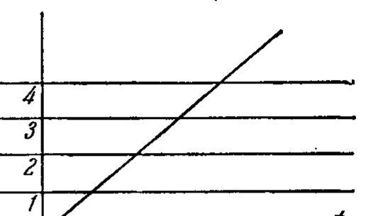

## 3. Доказательство независимости некоторых аксиом евклидовой геометрии

---
**стр. 221**
---

вость гильбертовой аксиоматики (вернее, свести вопрос к непротиворечивости арифметики).

Кроме того, как увидит читатель в ближайших параграфах, некоторые видоизменения арифметической реализации позволят решить ряд вопросов о взаимной независимости аксиом I — V.

§ 72. В § 69 мы отметили проблему минимальности как одну из существенных проблем аксиоматики. Чтобы решить эту проблему полностью, нужно доказать, что каждое требование принятых аксиом является независимым от остальных, т. е. что число требований не может быть уменьшено. Такое исследование требует большой затраты времени и было бы в нашей книге неуместно. Мы ограничимся доказательством независимости некоторых из аксиом I — V от остальных аксиом этой системы.

Прежде всего мы можем утверждать, что аксиома V о параллельных не является следствием аксиом I — IV. Вопрос о независимости V аксиомы уже решен нами, и к нему мы возвращаться больше не будем.

Сейчас мы займемся доказательством независимости аксиом непрерывности группы IV.

В первую очередь докажем, что аксиома Кантора IV,2 не вытекает из остальных аксиом (включая и аксиому Архимеда IV,1). Согласно общему принципу подобных доказательств (§ 69), мы должны построить некоторое множество объектов и определить взаимные отношения между ними так, чтобы эти отношения удовлетворяли требованиям всех аксиом, кроме аксиомы Кантора.

Следуя Гильберту, мы используем для этой цели бесконечное множество $\Omega$ чисел, которые можно получить, исходя из рациональных, многократным повторным применением операций сложения, вычитания, умножения, деления и, кроме того, пятой операции $\sqrt{1 + \omega^2}$, где $\omega$ — число, полученное уже с помощью этих операций. Очевидно, имеет место следующее свойство множества $\Omega$: если $\omega_1$ и $\omega_2$ — любые два числа из $\Omega$, то $\omega_1 + \omega_2$, $\omega_1 - \omega_2$, $\omega_1 \omega_2$, $\frac{\omega_1}{\omega_2}$ (при $\omega_2 \neq 0$) и $\sqrt{\omega_1^2 + \omega_2^2} = \pm \omega_1 \sqrt{1 + \left(\frac{\omega_2}{\omega_1}\right)^2}$ суть также числа из множества $\Omega$.

Теперь мы определим геометрические объекты: точкой назовем любую пару чисел $(x, y)$, п р и н а д л е ж а щ и х  м н о ж е с т в у $\Omega$, прямой — отношение $(u : v : w)$ трех чисел этого же множества, предполагая хотя бы одно из двух чисел $u$ и $v$ не равным нулю.

---
**стр. 222**
---

Все взаимные отношения объектов (принадлежность точек прямым, конгруэнтность и т. д.) мы определим в точности так же, как это делали в § 71 при построении декартовой реализации аксиом I — V, причем, однако, коэффициенты формул ортогонального преобразования будем брать теперь только из множества $\Omega$. Проверяя требования аксиом I, II, III, V, мы употребляли там только сравнение чисел по величине, арифметические операции (сложения, вычитания, умножения, деления) и операцию извлечения квадратного корня из суммы квадратов двух чисел (последняя операция употреблялась при нормировании параметров полупрямой). Как было замечено выше, эти операции в применении к числам множества $\Omega$ дают снова числа множества $\Omega$. Поэтому все те заключения, которые мы делали при проверке требований аксиом I, II, III, V в декартовой реализации, остаются в силе и сейчас, когда мы ограничиваем выбор употребляемых чисел множеством $\Omega$. Следовательно, можно утверждать, что в нашей новой реализации требования аксиом I, II, III, V удовлетворены.

Иначе дело обстоит с аксиомами группы IV. Проверим отдельно требования аксиомы Архимеда IV,1 и аксиомы Кантора IV,2. Прежде всего заметим, что с помощью конгруэнтного перенесения (в нашей реализации — с помощью ортогонального преобразования) каждую полупрямую можно наложить на любую данную полупрямую. Поэтому достаточно проверить условие Архимеда на какой-нибудь одной прямой. Проще всего для этого выбрать ось $x$, т. е. прямую, содержащую точки вида $(x, 0)$. Очевидно, что точки $A_0(0, 0)$, $A_1(a, 0)$, $A_2(2a, 0)$, $\dots$, $A_n(na, 0)$, $\dots$, где $a > 0$, определяют серию конгруэнтных друг другу отрезков $A_0A_1 \equiv A_1A_2 \equiv \dots \equiv A_nA_{n+1} \equiv \dots$. В самом деле, существует ортогональное преобразование, а именно:

$$x' = x + a,$$
$$y' = y,$$

отображающее каждый из этих отрезков на соседний справа. Пусть $B(b, 0)$ — какая угодно точка, удовлетворяющая лишь условию $b > a$. Для того чтобы в нашей реализации осуществлялась аксиома Архимеда, должно существовать такое целое положительное число $n$, что $B$ лежит между $A_0$ и $A_n$. Точки $A_0, B, A_n$ будут расположены в указанном порядке, если $na > b$. Но в арифметике предложение Архимеда справедливо: каковы бы ни были числа $a > 0, b > 0, b > a$, существует такое целое $n$, что $na > b$. Следовательно, предложение Архимеда имеет место и в рассматриваемой нами реализации.

Напротив, требования аксиомы Кантора в этой реализации не удовлетворены. В самом деле, если в системе точек и прямых, наряду с аксиомами I, II, III, IV,1, V, реализуется также акси-

---
**стр. 223**
---

ома Кантора IV,2, то можно доказать, что в этой системе всегда можно найти отрезок, длина которого равна любому заранее назначенному числу (см. главу II, § 21, теорема 35). В нашей реализации, однако, длины всех отрезков выражаются только числами из множества $\Omega$.

Мы приходим, таким образом, к заключению: *существует система объектов, взаимные отношения которых удовлетворяют требованиям аксиом I — III, IV,1, V, но не удовлетворяют требованиям аксиомы Кантора IV,2. Иначе говоря, аксиома Кантора не является следствием остальных аксиом элементарной геометрии.*

Если принять во внимание, что множество $\Omega$ счетно, то полученный результат можно высказать еще в иной форме: *несчетность множества элементов геометрии не может быть установлена с помощью одних лишь аксиом I—III, IV,1, V без аксиомы Кантора.*

§ 73. Теперь мы докажем, что и первая аксиома четвертой группы, т. е. аксиома Архимеда, не зависит от аксиом остальных групп I, II, III, V.

Для этого нам придется найти реализацию аксиом I, II, III, V, в которой предложение Архимеда не имеет места. Такая реализация существует и будет указана ниже. Как и только что рассмотренная, она базируется на арифметике, только на арифметике в некотором обобщенном смысле, относящейся к так называемой неархимедовой системе чисел.

Чтобы дальнейшее стало вполне отчетливым, перечислим основные предложения о свойствах вещественных чисел (будем называть их аксиомами арифметики).

1. Существует операция «сложения», посредством которой из числа $a$ и числа $b$ получается определенное число $c$; в символической записи:

$$a + b = c.$$

2. Существует другая операция — «умножения», посредством которой из числа $a$ и числа $b$ получается определенное число $d$; в символической записи:

$$ab = d.$$

3. Если $a, b, c$ — произвольные числа, то имеют место соотношения:

$$a + (b + c) = (a + b) + c,$$
$$a + b = b + a,$$
$$a(bc) = (ab)c,$$
$$a(b + c) = ab + ac,$$
$$ab = ba.$$

---
**стр. 224**
---

4. (Определение разности). Если $a$ и $b$ — данные числа, то существует одно и только одно число $x$ такое, что $a + x = b$.

Из аксиом 3 и 4 следует, что существует одно и только одно число,— оно называется нулем и обозначается через 0,— такое, что для каждого числа $a$ имеет место соотношение

$$a + 0 = a.$$

5. (Определение частного.) Если $a$ и $b$ — данные числа и $a \neq 0$, то существует одно и только одно число $x$ такое, что $ax = b$.

Из аксиом 3 и 5 следует, что существует одно и только одно число,— оно называется единицей и обозначается через 1,— такое, что

$$a \cdot 1 = a.$$

6. (Свойство упорядоченности.) Если $a$ и $b$ — два различных числа, то всегда одно из них больше ($>$) другого, тогда второе меньше ($<$) первого. В символической записи:

либо

$$a > b \text{ и } b < a,$$

либо

$$b > a \text{ и } a < b.$$

При этом если $a > b$ и $b > c$, то $a > c$. Если $a > b$, то $a + c > b + c$. Если $a > b$ и $c > 0$, то $ac > bc$. Ни для одного $a$ не имеет место соотношение $a > a$.

7. (Предложение Архимеда.) Если $a$ и $b$ — два произвольных положительных числа ($a > 0$ и $b > 0$), то всегда можно взять число $a$ слагаемым столько раз, что полученная сумма будет больше числа $b$:

$$a + a + \dots + a > b.$$

8. Предложение Кантора (или любое другое эквивалентное ему предложение).

Все эти предложения применимы к множеству вещественных чисел и арифметическим действиям над ними. Составляют ли перечисленные предложения 1—8 полную систему аксиом арифметики, т. е. можно ли, исходя из них, доказать любую арифметическую теорему,— для нас несущественно. Но в результате внимательного анализа тех рассуждений и вычислений, которые мы проводили, проверяя требования геометрических аксиом в декартовой реализации, можно было бы убедиться, что при этом мы использовали только свойства чисел, выраженные предложениями 1—8. Ввиду этого представляется возможным исходить из аксиоматической точки зрения на понятие числа и тем самым су-

---
**стр. 225**
---

щественно расширить класс объектов арифметической реализации. В нашем исследовании такая возможность сыграет важную роль.

Пусть $A$ — множество элементов произвольной природы. Мы будем говорить, что над элементами множества $A$ определено сложение, если с каждой парой элементов $a, b$ множества $A$ ($b$ может совпадать с $a$) сопоставлен элемент $c$ этого же множества. Этот элемент $c$ мы будем называть суммой элементов $a$ и $b$ и обозначать через $c = a + b$. Аналогично мы будем говорить, что над элементами множества $A$ определено умножение, если с каждой парой элементов $a, b$ множества $A$ ($b$ может совпадать с $a$) сопоставлен иным способом элемент $d$ этого множества. Этот элемент $d$ мы будем называть произведением элементов $a$ и $b$ и обозначать через $d = ab$.

Кроме того, предположим, что элементы множества $A$ рассматриваются расположенными в известном порядке, т. е. для любых двух элементов $a$ и $b$ мы можем сказать, что одно из них предшествует другому, или, как мы будем говорить, меньше другого.

Элементы множества $A$, над которыми определены сложение, умножение и порядок, удовлетворяющие условиям, сформулированным в предложениях 1—8, мы будем называть обобщенными числами.

Если геометрические объекты и взаимные отношения между ними определяются с помощью обобщенных чисел вместо обыкновенных, то мы получим реализацию геометрических аксиом I — V, которая по существу мало чем отличается от декартовой реализации, так как при определении взаимных отношений между геометрическими объектами мы будем следовать правилам обычной арифметики.

Однако мы можем пойти дальше и рассмотреть так называемую неархимедову систему чисел. Множество $A$ мы будем называть неархимедовой системой чисел, если для элементов этого множества выполняются предложения 1—6, но предложение 7 Архимеда будет неверным. С помощью такой системы мы и докажем независимость аксиомы Архимеда от аксиом I, II, III, V.

Сейчас мы дадим описание одной из неархимедовых систем.

---
**стр. 226**
---

Рассмотрим множество всевозможных рациональных функций вида

$$\omega(t) = \frac{a_0 t^n + a_1 t^{n-1} + \dots + a_n}{b_0 t^m + b_1 t^{m-1} + \dots + b_m}$$

с вещественными коэффициентами $a_k, b_k$. К этому множеству мы присоединим еще все функции, получающиеся, исходя из рациональных, многократным повторным применением операций сложения, вычитания, умножения, деления и пятой операции $\sqrt{1+\omega^2(t)}$, где $\omega(t)$ — функция, полученная уже с помощью этих операций. Построенное таким путем множество функций обозначим через $\Omega(t)$. Очевидно, $\Omega(t)$ содержит все рациональные функции и, в частности, функции вида $\omega(t) = \text{const.}$, т. е. функции, которые при изменении $t$ остаются постоянно равными некоторому числу.

Мы желаем элементы множества $\Omega(t)$ рассматривать как обобщенные числа. Для этого нам придется прежде всего определить смысл операций сложения и умножения. Возьмем какие-нибудь две функции $a(t)$ и $b(t)$ из $\Omega(t)$; условившись считать их обобщенными числами, мы изменим вид записи и вместо $a(t)$, $b(t)$ будем писать просто $a$ и $b$. Ясно, что $a(t) + b(t) = c(t)$ есть функция из множества $\Omega(t)$ и аналогично $a(t)b(t) = d(t)$. Поэтому $c(t)$ и $d(t)$ тоже являются обобщенными числами $c$ и $d$; первое из них мы будем называть суммой чисел $a$ и $b$, второе — произведением этих чисел. Так как при каждом значении $t$ действия $a(t) + b(t)$ и $a(t)b(t)$ производятся по обычным правилам арифметики, то определенные сейчас нами действия сложения и умножения обобщенных чисел удовлетворяют требованиям предложений 1—5. При этом нулем в рассматриваемой системе обобщенных чисел является функция, тождественно равная обыкновенному нулю, обобщенной единицей является функция, тождественно равная обыкновенной единице.

Поскольку в данной системе обобщенных чисел соблюдаются предложения 1—5, все четыре арифметических действия оказываются определенными. Заметим, что в нашей системе определена еще операция $\sqrt{a^2+b^2}$; действительно, если $a(t)$ и $b(t)$ — две функции из $\Omega(t)$, то

$$\sqrt{a^2(t) + b^2(t)} = \pm a(t) \sqrt{1 + \left(\frac{b(t)}{a(t)}\right)^2}$$

также есть функция из $\Omega(t)$. Эту функцию можно рассматривать как обобщенное число $\sqrt{a^2 + b^2}$, которое определяется по двум данным числам $a$ и $b$.

Теперь условимся относительно порядка в множестве $\Omega(t)$. Пусть $\omega(t)$ — произвольная функция из $\Omega(t)$, представляющая

---
**стр. 227**
---

в нашей системе число $\omega$. Если $\omega \neq 0$, т. е. если $\omega(t)$ не равняется тождественно нулю, то при достаточно большом $t^*$ для любого $t > t^*$ функция $\omega(t)$ сохраняет определенный знак $^*$). В том случае, когда для $t > t^*$ будет $\omega(t) > 0$, условимся считать обобщенное число $\omega$ положительным: $\omega > 0$; если же для $t > t^*$ имеет место неравенство $\omega(t) < 0$, то будем считать $\omega < 0$. Разбив, таким образом, все обобщенные числа (кроме нуля) на положительные и отрицательные, мы введем сравнение чисел по величине с помощью обычного условия: считаем $a > b$, если $a - b > 0$.

Легко проверить, что все требования предложения 6 будут при этом удовлетворены. Вместе с тем в нашей системе обобщенных чисел предложение 7 не имеет места; система, следовательно, является неархимедовой.

Чтобы убедиться в этом, лучше всего формулированный выше признак неравенства $a > b$ представить в следующей геометрической форме: $a > b$, если при $t \to +\infty$ график функции $a(t)$ поднимается выше графика функции $b(t)$. Как мы уже отмечали, среди элементов множества $\Omega(t)$ имеются функции, которые при изменении $t$ сохраняют постоянное значение: $\omega(t) \equiv c$. Графиками таких функций являются прямые, параллельные оси $t$. Каждая функция $\omega(t) \equiv c$ представляет собой с нашей точки зрения обобщенное число; мы будем обозначать его просто через $c$, так что, если мы пишем 10 или 20, то имеем в виду функцию $\omega(t)$, тождественно равную 10 или 20. Возьмем две функции $a(t) \equiv 1$ и $b(t) \equiv t$, которые содержатся в множестве $\Omega(t)$ и, следовательно, могут быть рассматриваемы как обобщенные числа: $a$ и $b$. Если число $a$ сложить с самим собою $n$ раз, то полученная сумма представляется в множестве $\Omega(t)$ функцией, график которой есть прямая, параллельная оси $t$ и расположенная в положительной полуплоскости на расстоянии $n$ от этой оси. Графиком функции $b(t) \equiv t$ является биссектриса первого координатного угла. Но при $t \to +\infty$ график функции $b(t) \equiv t$ поднимается выше всякой прямой, параллельной оси $t$ (рис. 86). Отсюда следует, что, сколько бы раз мы ни складывали число $a$ с самим собою, для полученной суммы всегда сохраняется неравенство

$$a + a + \dots + a < b.$$

---
**стр. 228**
---

Таким образом, в нашей системе обобщенных чисел предложение Архимеда не имеет места.

Теперь для нас не составит труда построить систему геометрических объектов, в которой осуществляются аксиомы I, II, III, V, но в которой неверна аксиома Архимеда.

Назовем точкой пару чисел $(x, y)$ из н е а р х и м е д о в о й с и с т е м ы $\Omega(t)$, прямой — отношение $(u : v : w)$ трех чисел $u, v, w$ из системы $\Omega(t)$, удовлетворяющих единственному условию, чтобы хоть одно из двух чисел $u, v$ было отличным от нуля. Все взаимные отношения между геометрическими объектами определим в точности так, как мы делали в декартовой реализации гильбертовых аксиом. В системе $\Omega(t)$ определены действия сложения и умножения элементов, а также соотношения «больше» и «меньше» в соответствии с требованиями аксиом арифметики 1—6. Кроме того, для любых элементов $a$ и $b$ определена операция $\sqrt{a^2 + b^2}$. Поэтому все рассуждения и вычисления, которые мы проводили, проверяя выполнение требований аксиом I, II, III, V в декартовой реализации, можно полностью повторить сейчас, когда мы вместо обыкновенных чисел употребляем обобщенные числа из системы $\Omega(t)$. Таким образом, в реализации, которую мы сейчас построили, требования аксиом I, II, III, V удовлетворены. Вместе с тем предложение Архимеда IV,1 в этой реализации не имеет места, так как система чисел $\Omega(t)$ неархимедова. Отсюда следует, что аксиома Архимеда не зависит от аксиом I, II, III, V.

Резюмируя изложенное, мы можем высказать следующее предложение:

*Опираясь на аксиомы I, II, III, V, нельзя доказать аксиому Архимеда IV,1.*

*Опираясь на аксиомы, I, II, III, IV,1, V, нельзя доказать аксиому Кантора IV,2.*

Естественно поставить вопрос, не вытекает ли аксиома Архимеда из остальных аксиом, включая и аксиому Кантора? И на этот вопрос нужно ответить отрицательно.

Чтобы убедиться в этом, следует построить такую неархимедову систему чисел, в которой предложение Кантора осуществляется.

Изложим пример такой системы *).

Условимся называть числом всякий степенной ряд

$$a_0 t^n + a_1 t^{n+1} + a_2 t^{n+2} + \dots,$$

где $a_0, a_1, a_2, \dots$ — любые обыкновенные вещественные числа, $n$ — любое обыкновенное целое число (положительное, отрица-

---
**стр. 229**
---

тельное или нуль). Обыкновенные вещественные числа мы включим в рассматриваемую систему в качестве рядов вида

$$a + 0 \cdot t + 0 \cdot t^2 + \dots$$

Нулем назовем ряд

$$0 + 0 \cdot t + 0 \cdot t^2 + \dots$$

Если число

$$a_0 t^n + a_1 t^{n+1} + \dots$$

— не нуль, то мы будем полагать, что обыкновенное число $a_0$ не равно нулю.

Действия сложения и умножения пусть совпадают с формальными операциями сложения и умножения степенных рядов (т. е. суммою двух чисел нашей системы, представленных какими-либо степенными рядами, назовем степенной ряд, получаемый путем сложения подобных членов рядов, представляющих слагаемые; произведением двух чисел нашей системы, представленных некоторыми степенными рядами, назовем степенной ряд, который получается путем почленного перемножения рядов, представляющих сомножители, с последующим приведением подобных членов и расположением приведенных членов в порядке возрастания степени их аргумента $t$).

Нетрудно убедиться, что при этом аксиомы арифметики 1—5 будут удовлетворены. Кроме того, в нашей системе будет определена операция $\sqrt{1 + \omega^2}$, где $\omega$ — любое число системы (разыскание частного $x = \frac{b}{a}$ при условии $a \neq 0$ приводится к последовательному установлению заранее неизвестных коэффициентов ряда $x$ путем сравнения членов левой и правой частей уравнения

$$ax = b;$$

разыскание числа

$$x = \sqrt{1 + \omega^2}$$

проводится аналогично при помощи уравнения

$$x^2 = 1 + \omega^2).$$

Теперь введем в множество наших чисел порядок. Условимся число

$$a_0 t^n + a_1 t^{n+1} + \dots,$$

$a_0 \neq 0$, называть положительным (бо́льшим нуля), если $a_0 > 0$, отрицательным (меньше нуля), если $a_0 < 0$. Если $a$ и $b$ — два числа нашей системы, условимся считать $a > b$ в случае $a - b > 0$ и $a < b$ в случае $a - b < 0$. Установленный порядок удовлетворяет требованиям аксиомы арифметики 6.

*) Это следует из алгебраичности функции $\omega(t)$ (всякая алгебраическая функция имеет конечное число перемен знака).

---
**стр. 230**
---

Убедимся, что в нашей системе имеет место предложение Кантора. Пусть дана монотонно возрастающая последовательность чисел нашей системы

$$a^{(m)} = a_0^{(m)}t^{p_m} + \dots, \quad m = 1, 2, \dots,$$

и монотонно убывающая последовательность

$$b^{(m)} = b_0^{(m)}t^{q_m} + \dots, \quad m = 1, 2, \dots,$$

причем: 1) любое число последовательности $a^{(m)}$ меньше любого числа последовательности $b^{(m)}$; 2) каким бы ни было положительное число $\varepsilon$ (из нашей системы), найдем номер $m$, для которого

$$b^{(m)} - a^{(m)} < \varepsilon.$$

Докажем, что существует (единственное) число нашей системы, лежащее внутри всех отрезков $(a^{(m)}, b^{(m)})$.

Прежде всего заметим, что обыкновенные числовые последовательности $p_m$ и $q_m$ ($m = 1, 2, \dots$) ограничены снизу. В самом деле, если среди обыкновенных чисел $p_m$ имеются числа, расположенные сколь угодно далеко слева от нуля, то из последовательности степеней $p_m$ можно выбрать подпоследовательность, монотонно стремящуюся к отрицательной бесконечности; соответствующие начальные коэффициенты должны быть положительными, иначе нарушится условие монотонного роста последовательности чисел нашей системы $a^{(m)}$. Но в таком случае одно из чисел $a^{(m)}$ превысит некоторое из чисел $b^{(m)}$, что невозможно.

Аналогично доказывается ограниченность снизу чисел $q_m$. Мы можем, следовательно, формально считать, что все ряды, представляющие $a^{(m)}$ и $b^{(m)}$, начинаются с членов одной и той же степени (допуская на время этого доказательства нулевые значения для начальных коэффициентов).

Запишем теперь эти ряды так:

$$a^{(m)} = a_0^{(m)}t^n + a_1^{(m)}t^{n+1} + \dots,$$
$$b^{(m)} = b_0^{(m)}t^n + b_1^{(m)}t^{n+1} + \dots$$

Легко понять, что, начиная с некоторого $m = m_1$, неотрицательная разность $b_0^{(m)} - a_0^{(m)}$ должна сделаться равной нулю. В самом деле, так как последовательность $a^{(m)}$ является возрастающей, то последовательность (обыкновенных) чисел $a_0^{(m)}$ должна быть неубывающей. Аналогично, вследствие убывания последовательности $b^{(m)}$, последовательность (обыкновенных) чисел $b_0^{(m)}$ должна быть невозрастающей. Таким образом, разность (обыкновенных) чисел $b_0^{(m)} - a_0^{(m)}$ не может возрастать. Значит, либо разность $b_0^{(m)} - a_0^{(m)}$ все время положительна, либо она для некоторого но-

---
**стр. 231**
---

мера равна нулю и тогда уже остается равной нулю для всех последующих номеров. Допустим, что все время

$$b_0^{(m)} - a_0^{(m)} > 0;$$

возьмем в нашей системе положительное число

$$\varepsilon = t^{n+1} + \dots$$

Тогда для любого номера будет

$$b^{(m)} - a^{(m)} > \varepsilon$$

вопреки условию. Таким образом, разность $b^{(m)} - a^{(m)}$ оставаться положительной не может.

Итак, начиная с некоторого $m = m_1$,

$$b_0^{(m)} - a_0^{(m)} = 0.$$

Так как последовательность обыкновенных чисел $a_0^{(m)}$ — монотонно неубывающая, а последовательность обыкновенных чисел $b_0^{(m)}$ — монотонно невозрастающая, то, начиная с $m = m_1$, числа $a_0^{(m)}$ и $b_0^{(m)}$ становятся неизменными и одинаковыми; положим $a_0^{(m_1)} = b_0^{(m_1)} = d_0$. Мы имеем:

$$a_0^{(m)} \leqslant d_0 \leqslant b_0^{(m)}.$$

При $m \geqslant m_1$ аналогичные рассуждения применимы к последовательностям обыкновенных чисел $a_1^{(m)}, b_1^{(m)}$; точно так же мы установим, что существует число $d_1$, которое при $m \geqslant m_1$ удовлетворяет неравенствам

$$a_1^{(m)} \leqslant d_1 \leqslant b_1^{(m)},$$

причем, начиная с некоторого $m = m_2$ ($m_2 \geqslant m_1$), исчезает разность $b_1^{(m)} - a_1^{(m)}$ и т. д.

Число $d = d_0 t^n + d_1 t^{n+1} + \dots$ лежит внутри всех отрезков $(a^{(m)}, b^{(m)})$. Тем самым утверждение аксиомы Кантора для нашей системы чисел доказано (единственность числа $d$ вытекает сразу из второго условия в формулировке аксиомы Кантора).

В рассмотренной системе чисел не имеет места предложение Архимеда.

В самом деле, возьмем два положительных числа

$$a = t + 0 \cdot t^2 + \dots,$$
$$b = t^2 + 0 \cdot t^3 + \dots;$$

при любом натуральном $n$ имеем:

$$nb < a,$$

т. е. требование аксиомы Архимеда нарушено.
