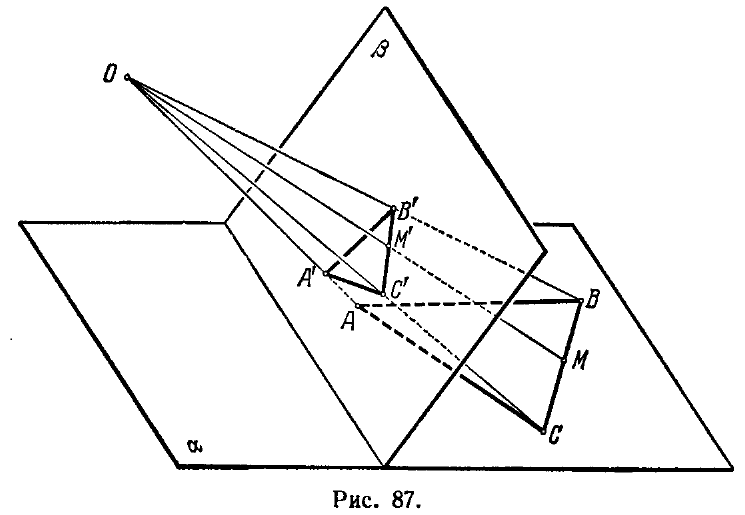
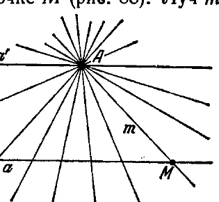
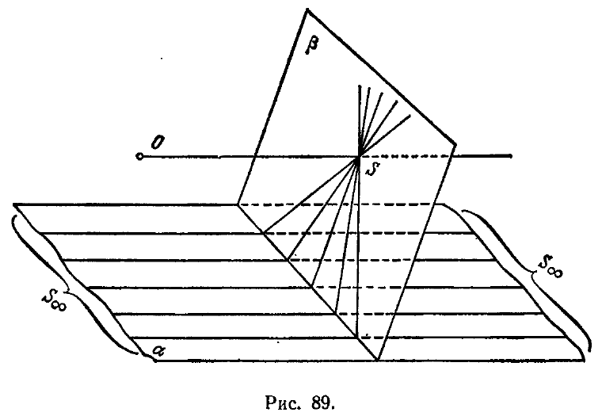

# ЧАСТЬ II

# ПРОЕКТИВНАЯ ГЕОМЕТРИЯ

# ГЛАВА V

# ОСНОВЫ ПРОЕКТИВНОЙ ГЕОМЕТРИИ

## 1. Предмет проективной геометрии

---
**стр. 242**
---

**§ 77.** В первые десятилетия XIX века, одновременно с успешным развертыванием исследований по основаниям геометрии, возникла особая ветвь геометрических знаний — проективная геометрия. Источником ее явились потребности графики и архитектуры. Вначале проективная геометрия имела довольно ограниченный диапазон приложений. Но по мере роста она все более и более проникала в различные геометрические области, а в конце XIX столетия исследования по проективной геометрии и по основаниям элементарной геометрии теснейшим образом объединились. Замечательным результатом этого объединения было построение в рамках проективной геометрии глубокой теории, которая включила в единую схему геометрии Евклида, Лобачевского и Римана.

**§ 78.** Известный французский геометр Понселе (1788—1867) выделил как объект исследования некоторые особые свойства геометрических фигур, названные им *проективными*.

Что это за свойства фигур, — мы сейчас объясним.

Пусть $A$ — произвольная фигура, расположенная в некоторой плоскости $\alpha$, $\beta$ — какая-нибудь другая плоскость и $O$ — произвольная точка пространства, не содержащаяся ни в одной из двух плоскостей $\alpha$ и $\beta$ (рис. 87). Точка $O$ вместе с каждой точкой $M$ фигуры $A$ определяет прямую $OM$; прямая $OM$ пересекает плоскость $\beta$ в некоторой точке, которую мы обозначим через $M'$ и будем называть *проекцией* точки $M$ (на плоскость $\beta$ из центра $O$). Проекции всех точек фигуры $A$ на плоскость $\beta$ составят некоторую фигуру $A'$, которая называется *проекцией* фигуры $A$. Операция, с помощью которой получается фигура $A'$, носит название *центрального проектирования* из точки $O$. Варьируя выбор точки $O$ и плоскости $\beta$, мы можем получить при помощи центрального проектирования фигуры $A$ бесконечное множество фигур, отчасти похожих на фигуру $A$, но во многих отношениях также и сущест-

---
**стр. 243**
---

венно от нее отличающихся. Например, проектируя окружность, можно получить эллипс или параболу и даже гиперболу; проектируя правильный треугольник, можно получить треугольник произвольной формы, и т. д. Таким образом, многие свойства фигуры не переносятся на ее проекцию. Так, свойства правильного треугольника могут не сохраниться при проектировании, в результате которого, вообще говоря, не будет получаться снова правильный треугольник; основное свойство окружности, выражаемое обычным ее определением, также может быть нарушено

при проектировании, так как, проектируя окружность, можно получить, например, эллипс, и т. д. Точно так же многие величины, связанные с фигурой, будут при проектировании, вообще говоря, меняться. Так, проектируя отрезок данной длины $a$, можно получить отрезок, длина которого как угодно велика или как угодно мала; проектируя треугольник данной площади $\Delta$, можно получить треугольник, площадь которого будет больше или меньше величины $\Delta$.

С другой стороны, фигуры обладают свойствами, которые сохраняются при любом проектировании, и с фигурами могут быть сопоставлены величины, также сохраняющиеся при любом проектировании. Такие свойства и величины называются *инвариантами проектирования*.

Именно эти свойства фигур, инвариантные по отношению к любому проектированию, Понселе назвал *проективными свойствами*, рассматривая их как объекты исследования в проективной геометрии. Кроме того, объектами проективной геометрии

---
**стр. 244**
---

являются инвариантные относительно проектирований величины.

П р и м е р ы. Если точки $P_1, P_2, \dots, P_n$ фигуры $A$ лежат на прямой, то проекции этих точек $P'_1, P'_2, \dots, P'_n$ также лежат на некоторой прямой. Следовательно, свойство точек фигуры, заключающееся в прямолинейном их расположении, является проективным. Иначе еще можно сказать, что прямая есть объект проективной геометрии.

Если точки $Q_1, Q_2, \dots, Q_n$ фигуры $A$ лежат на каком-нибудь коническом сечении $k$, то проекции этих точек $Q'_1, Q'_2, \dots, Q'_n$ также лежат на некотором коническом сечении $k'$. Иначе говоря, коническое сечение есть объект проективной геометрии. При этом только нужно иметь в виду, что свойства, присущие исключительно окружности, или исключительно эллипсу, или исключительно параболе, или исключительно гиперболе, не являются проективными свойствами, поэтому в проективной геометрии не делается различия между коническими сечениями, как в элементарной геометрии. Иными словами, хотя конические сечения суть объекты проективной геометрии, но отдельные виды их — окружности, эллипсы, параболы, гиперболы, в проективной геометрии не различаются и порознь не исследуются.

**§ 79.** Задача изучения проективных свойств фигур привлекла к себе внимание многих геометров, среди которых после Понселе мы отметим Шаля (1793—1880) и Штейнера (1769—1863). Им принадлежит разработка ряда общих вопросов проективной геометрии, в которых Штейнер, Шаля и сопутствующие им геометры видели возрождение синтетического направления в геометрии. Развивая синтетические методы в противовес аналитическим, эти геометры достигли известных успехов в усовершенствовании аппарата проективной геометрии и в применении его к различным геометрическим задачам.

Однако принципиальное значение проективной геометрии в развитии геометрических идей определяется отнюдь не количеством отдельных случаев, где ее методы оказываются удобнее методов аналитической геометрии. Сейчас мы видим это значение в той общности проективной геометрии, которая позволяет соединить воедино разные геометрические системы, в частности включить в проективную схему и элементарную геометрию.

Между тем у Штейнера и Шаля проективная геометрия выглядела как часть элементарной. Превращение проективной геометрии во вполне самостоятельную дисциплину явилось уже делом второй половины XIX столетия.

Важной предпосылкой для этого превращения было употребление в проективной геометрии бесконечно удаленных

---
**стр. 245**
---

геометрических элементов. На этом вопросе мы сейчас специально остановимся.

**§ 80.** Пусть $A$ — произвольная точка пространства и $a$ — прямая, не проходящая через точку $A$ (рис. 88). Проведем через $A$ и $a$ плоскость $\alpha$ и будем рассматривать всевозможные прямые плоскости $\alpha$, проходящие через точку $A$. Эти прямые составляют плоский пучок с центром $A$; мы будем называть его: *пучок $A$*.

Между лучами этого пучка и точками прямой $a$ мы установим соответствие, сопоставляя с каждой точкой $M$ прямой $a$ тот луч $m$ пучка $A$, который пересекает прямую $a$ в точке $M$ (рис. 88).

Луч $m$ называют лучом, проектирующим точку $M$.

Очевидно, что как бы ни была расположена точка $M$ на прямой $a$, ей всегда соответствует определенный луч $m$. Но нельзя утверждать, что любому лучу пучка $A$ соответствует точка прямой $a$. Именно, луч $a'$ пучка $A$, параллельный прямой $a$, не пересекает ее и поэтому не имеет соответствующей себе точки. Таким образом, соответствие между лучами пучка $A$ и точками прямой $a$ не является взаимно однозначным. Это обстоятельство при исследовании проектирований служит источником многочисленных неудобств. Чтобы избежать их, условливаются рассматривать параллельные прямые как пересекающиеся на бесконечности. Тогда луч $a'$ в пучке $A$, параллельный прямой $a$, как и всякий другой луч пучка, будет иметь на прямой $a$ соответствующую себе точку, но только не обыкновенную точку, а некоторый новый объект, называемый *бесконечно удаленной точкой* прямой $a$.

Бесконечно удаленная точка прямой считается принадлежащей также каждой плоскости, которая проходит через эту прямую. Далее, полагают, что параллельные прямые имеют одну общую бесконечно удаленную точку; соответственно этому систему параллельных прямых, расположенных в одной плоскости, называют *пучком с бесконечно удаленным центром*.

Заметим, что пучок с бесконечно удаленным центром при проектировании может перейти в обыкновенный пучок. Так, на рис. 89 пучок в плоскости $\alpha$ с бесконечно удаленным центром $S_\infty$ проецируется из центра $O$ на плоскость $\beta$ в обыкновенный пучок с центром $S$.

Бесконечно удаленные точки непараллельных прямых считаются различными. Таким образом, каждая плоскость содержит бесконечно много различных бесконечно удаленных точек.

---
**стр. 246**
---

Совокупность всех бесконечно удаленных точек плоскости называют ее *бесконечно удаленной прямой*.

Совокупность всех бесконечно удаленных точек пространства называют *бесконечно удаленной плоскостью*. Такая терминология оправдывается следующими двумя обстоятельствами:

1. Две параллельные плоскости имеют общие бесконечно удаленные точки, вследствие чего совокупность бесконечно удаленных точек плоскости можно рассматривать как образ, получаемый при пересечении двух плоскостей; поэтому совокупность бесконечно удаленных точек плоскости естественно назвать прямой.

2. Множество всех бесконечно удаленных точек пространства при пересечении с любой обыкновенной плоскостью определяет бесконечно удаленную прямую. Поэтому указанное множество естественно назвать плоскостью.

**§ 81.** Все изложенное можно резюмировать следующим образом.

Множество объектов евклидова пространства дополняется новыми элементами, которым дается название «бесконечно удаленная точка», «бесконечно удаленная прямая», «бесконечно удаленная плоскость». Присоединение новых элементов производится с соблюдением определенных условий, именно:

1. К множеству точек каждой прямой прибавляется одна бесконечно удаленная точка; к множеству прямых каждой плоскости прибавляется одна бесконечно удаленная прямая; к множеству плоскостей пространства прибавляется одна бесконечно удаленная плоскость.

---
**стр. 247**
---

2. Свойства взаимной принадлежности расширенного множества геометрических элементов должны удовлетворять требованиям всех аксиом сочетания (т. е. первой группы аксиом Гильберта).

3. Свойства взаимной принадлежности расширенного множества геометрических элементов должны быть таковы, что каждые две плоскости имеют общую прямую, каждые прямая и плоскость имеют общую точку, а также имеют общую точку каждые две прямые, расположенные в одной плоскости.

Прямая, дополненная бесконечно удаленной точкой, называется *проективной прямой*. Проективную прямую следует представлять себе в виде замкнутой линии. Плоскость, дополненная бесконечно удаленной прямой, называется *проективной плоскостью*. Пространство, дополненное бесконечно удаленной плоскостью, называется *проективным пространством*.

**§ 82.** Бесконечно удаленные элементы нередко вводятся в рассмотрение и в элементарной геометрии. Но в элементарной геометрии использование их по существу ограничивается лишь особой манерой словесного выражения геометрических фактов (вместо того чтобы говорить, что прямые параллельны, их называют сходящимися в бесконечности, цилиндр рассматривают как конус с бесконечно удаленной вершиной и т. д.). В проективной геометрии, напротив, бесконечно удаленные элементы играют такую же роль, как и обыкновенные геометрические образы, и являются органической частью проективного пространства.

Причина такого различия станет вполне ясной, если сравнить объекты исследования элементарной геометрии и проективной геометрии. Элементарная геометрия в значительной степени посвящена изучению так называемых метрических свойств фигур, т. е. таких свойств, которые связаны с измерением геометрических величин (длин, углов и площадей). Измерение любого отрезка $AB$ с обыкновенными концами всегда возможно и приводит в результате к определенному числу, выражающему длину отрезка $AB$. Но в том случае, когда один конец отрезка является бесконечно удаленной точкой, процесс измерения теряет смысл, так как на таком отрезке линейная единица откладывается бесконечно много раз. Точно так же процесс измерения углов неприменим в том случае, когда одна сторона угла есть бесконечно удаленная прямая, и «наивные» способы измерения площадей неприменимы к фигурам, содержащим бесконечно удаленные элементы.

Таким образом, в элементарной геометрии бесконечно удаленные элементы по необходимости играют особую роль и по свойству своих отношений к обыкновенным геометрическим элементам существенно от них отличаются. В противоположность этому, в проективной геометрии, поскольку метрические свойства фигур
