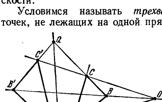
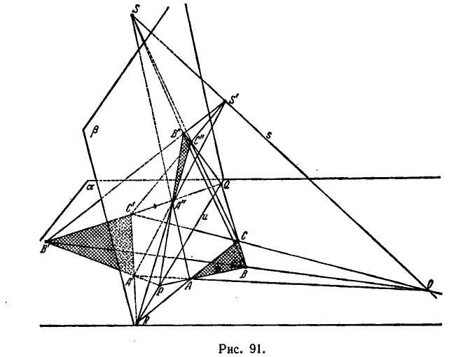

## 2. Теорема Дезарга. Построение гармонических групп элементов

---
**стр. 248**
---

не являются ее объектами, указанные выше обстоятельства, отличающие бесконечно удаленные элементы от остальных, теряют силу. Более того, так как при проектированиях бесконечно удаленные элементы могут переходить в обыкновенные, то, следовательно, они не обладают никакими *проективными свойствами*, которые отличали бы их от обыкновенных элементов. Поэтому в проективной геометрии различия между обыкновенными и бесконечно удаленными элементами нет.

**§ 83.** Идея бесконечно удаленных элементов возникла довольно давно. Но равноправие бесконечно удаленных и обыкновенных элементов, естественное с точки зрения проективной геометрии, оставалось иллюзорным, пока проективные свойства фигур исследовались методами элементарной геометрии, так как эти методы опираются на измерение, а метрика элементарной геометрии обязательно приводит к различию между конечными и бесконечно удаленными образами. Чтобы придать понятию проективного пространства точный смысл, оказалось необходимым полностью изгнать из проективной геометрии все, что связано с измерением.

Задача освобождения проективной геометрии от использования измерений в принципе была решена Штаудтом (1798—1867).

Проективная геометрия, освобожденная от метрики, превратилась в дисциплину, изучающую только свойства взаимного расположения геометрических образов. Вместе с тем проективная геометрия сделалась самостоятельной геометрической дисциплиной со своей собственной аксиоматикой и собственной совокупностью объектов (каковыми являются проективная прямая, проективная плоскость и проективное пространство).

## 2. Теорема Дезарга. Построение гармонических групп элементов

**§ 84.** Проективную геометрию мы будем строить на основе некоторой системы аксиом, относящихся к взаимным отношениям основных объектов. Основными объектами являются точки, прямые и плоскости; их взаимные отношения, о которых идет речь в аксиомах, суть отношения *связи* и *порядка*. Аксиомы проективной геометрии, как и получаемые из них теоремы, выражают известные свойства евклидова пространства, дополненного бесконечно удаленными элементами. Но, конечно, под точками, прямыми и плоскостями в проективной геометрии можно подразумевать любые предметы и взаимные отношения между ними можно истолковать любым образом, лишь бы было соблюдено то, что говорится в аксиомах. Тогда выводы, полученные из аксиом, будут выражать определенные факты, относящиеся к выбранным объектам. Соответственно этому проективным пространством является любое множество предметов, называемых точками, прямыми и пло-

---
**стр. 249**
---

скостями, для которых определены взаимные отношения с соблюдением требований нижеприводимых аксиом.

Аксиомы проективной геометрии можно распределить на три группы, из которых

группа I содержит девять аксиом связи,

группа II содержит шесть аксиом порядка,

группа III содержит одну аксиому непрерывности.

В настоящем разделе рассматриваются аксиомы I группы и их важнейшие следствия.

**Группа I. — Проективные аксиомы связи.**

Мы полагаем, что прямые и плоскости могут находиться в известных сопоставлениях с точками, которые обозначаем словами: «прямая проходит через точку» или «точка лежит на прямой»; «плоскость проходит через точку» или «точка лежит на плоскости». Условия этих сопоставлений выражают аксиомы I,1—I,9.

**I,1.** *Каковы бы ни были две точки $A$ и $B$, существует прямая $a$, проходящая через точки $A, B$.*

**I,2.** *Каковы бы ни были две различные точки $A$ и $B$, существует не более одной прямой, проходящей через точки $A, B$.*

**I,3.** *На каждой прямой имеется не менее трех точек. Существуют по крайней мере три точки, не лежащие на одной прямой.*

**I,4.** *Через каждые три точки $A, B, C$, не лежащие на одной прямой, проходит некоторая плоскость $\alpha$. На каждой плоскости имеется не менее одной точки.*

**I,5.** *Через каждые три точки $A, B, C$, не лежащие на одной прямой, проходит не более одной плоскости.*

**I,6.** *Если две точки $A, B$ прямой $a$ лежат на плоскости $\alpha$, то каждая точка прямой $a$ лежит на плоскости $\alpha$.*

**I,7.** *Если две плоскости $\alpha, \beta$ имеют общую точку $A$, то они имеют еще по крайней мере одну общую точку $B$.*

**I,8.** *Имеется не менее четырех точек, не лежащих на одной плоскости.*

**I,9.** *Каждые две прямые, расположенные в одной плоскости, имеют общую точку.*

Если сопоставить только что сформулированные аксиомы I,1—I,9 с аксиомами первой группы Гильберта (см. гл. II, § 12), то можно прежде всего заметить, что все требования аксиом первой группы Гильберта содержатся также и в проективных аксиомах I,1—I,9. Поэтому все теоремы элементарной геометрии, основанные лишь на аксиомах связи, справедливы также и в проективной геометрии. Проективные аксиомы связи отличаются от аксиом связи элементарной геометрии только в двух пунктах:

1) В аксиоме I,3 проективной системы требуется, чтобы на каждой прямой существовало не менее трех точек, тогда как

---
**стр. 250**
---

в соответствующей аксиоме I,3 системы Гильберта ставится требование, чтобы прямая содержала хотя бы две точки.

2) Проективные аксиомы связи включают требование I,9, которое не ставится и не выполняется в элементарной геометрии. Благодаря аксиоме I,9 в проективной геометрии нет параллельности, так как всякие две прямые одной плоскости пересекаются.

Таким образом, проективные аксиомы связи содержат больше требований, чем аксиомы связи элементарной геометрии, благодаря чему из проективных аксиом связи могут быть выведены теоремы, не вытекающие из аксиом связи Гильберта.

В частности, из аксиом I,1—I,9 следует, что

1) прямая и плоскость всегда имеют общую точку;

2) две плоскости всегда имеют общую прямую;

3) три плоскости всегда имеют общую точку.

**§ 85.** Не останавливаясь на тривиальных следствиях аксиом I,1—I,9, мы обратимся сейчас к доказательству теоремы Дезарга, которая является основой проективной геометрии на плоскости.

Условимся называть *трехвершинником* совокупность трех точек, не лежащих на одной прямой, и трех прямых, попарно соединяющих эти точки. Три точки, о которых идет речь, будем называть *вершинами*, соединяющие их прямые — *сторонами* трехвершинника (мы избегаем подобную фигуру называть треугольником, сохраняя этот термин для обозначения образа несколько иного вида, о котором будет речь дальше, после того, как мы познакомимся с проективными аксиомами порядка).

Рассмотрим два трехвершинника, вершины которых обозначим буквами $A, B, C$ и $A', B', C'$. Мы будем называть вершины, обозначенные одинаковыми буквами, соответственными ($A$ и $A'$, $B$ и $B'$, $C$ и $C'$); также будем называть соответственными стороны, проходящие через соответственные вершины.

**Теорема 1** (первая теорема Дезарга — прямая). *Если соответственные стороны трехвершинников $ABC$ и $A'B'C'$ пересекаются в точках $P$, $Q$, $R$, лежащих на одной прямой,*

---
**стр. 251**
---

то прямые, соединяющие соответственные вершины, сходятся в одной точке (рис. 90).

**Теорема 2** (вторая теорема Дезарга — обратная). *Если прямые, соединяющие соответственные вершины трехвершинников $ABC$ и $A'B'C'$, сходятся в одной точке, то соответственные стороны этих трехвершинников пересекаются в точках, лежащих на одной прямой* *).

Условимся называть прямую, на которой расположены точки пересечения соответственных сторон трехвершинников, *осью перспективы*; точку, в которой сходятся прямые, соединяющие соответственные вершины, — *центром перспективы*. Тогда обе теоремы Дезарга можно коротко выразить следующим образом:

*Если два трехвершинника имеют ось перспективы, то они имеют и центр перспективы, и обратно.*

Докажем первую теорему Дезарга.

Пусть $ABC$ и $A'B'C'$ — трехвершинники, лежащие в одной и той же плоскости $\alpha$, обладающие осью перспективы $u$ (рис. 91).

*) Для нас существен лишь тот случай, когда трехвершинники $ABC$ и $A'B'C'$ лежат в одной плоскости.

---
**стр. 252**
---

Таким образом, прямая $u$ содержит точки $P$, $Q$, $R$, в которых пересекаются пары соответственных сторон $AB$ и $A'B'$, $BC$ и $B'C'$, $AC$ и $A'C'$. Нужно показать, что прямые $AA'$, $BB'$ и $CC'$ сходятся в одной точке, т. е. что данные трехвершинники имеют центр перспективы *).

Для доказательства возьмем какую-нибудь точку, не лежащую на плоскости $\alpha$; обозначим ее через $B''$ (существование точки $B''$ обеспечено аксиомой I,8). Точки $P$, $Q$ и $B''$ не лежат на одной прямой; поэтому существует единственная плоскость $\beta$, проходящая через эти точки. В согласии с аксиомой I,3 мы можем на прямой $B''Q$ выбрать некоторую точку $C''$, отличную от $B''$ и $Q$. По аксиоме I,6 эта точка лежит в плоскости $\beta$, так же как и точка $R$. Поэтому прямая $RC''$ расположена в плоскости $\beta$. Так как прямые $RC''$ и $PB''$ лежат в одной плоскости, то по аксиоме I,9 они имеют общую точку; обозначим ее через $A''$. Мы получили в плоскости $\beta$ трехвершинник $A''B''C''$, находящийся в некотором специальном расположении по отношению к трехвершинникам $ABC$ и $A'B'C'$; именно, трехвершинники $ABC$, $A'B'C'$ и $A''B''C''$ имеют общую ось перспективы $u$, причем соответственные стороны $AB$, $A'B'$ и $A''B''$ этих трехвершинников сходятся в одной точке $P$, и точно так же стороны $BC$, $B'C'$ и $B''C''$ сходятся в одной точке $Q$ и стороны $AC$, $A'C'$ и $A''C''$ сходятся в одной точке $R$.

При таком расположении трехвершинники $ABC$ и $A''B''C''$, а также трехвершинники $A'B'C'$ и $A''B''C''$ имеют центр перспективы. Это нетрудно доказать. Хотя здесь нам приходится устанавливать по отношению к трехвершинникам $ABC$ и $A''B''C''$ (или $A'B'C'$ и $A''B''C''$) тот же факт, какой утверждается теоремой Дезарга по отношению к трехвершинникам $ABC$ и $A'B'C'$, но доказательство чрезвычайно упрощается тем, что трехвершинники $ABC$ и $A''B''C''$ (или $A'B'C'$ и $A''B''C''$) лежат в разных плоскостях.

Рассмотрим плоскости $PAA''$, $QBB''$ и $RCC''$; как было отмечено в конце § 84, каждые три плоскости имеют общую точку. Пусть $S$ — общая точка указанных плоскостей. Заметим, что прямая $AA''$ есть общая прямая плоскостей $PAA''$ и $RCC''$; далее, весьма существенно установить, что плоскости $PAA''$ и $RCC''$ различны. В самом деле, плоскость $PAA''$ содержит прямую $BB''$. Но в силу выбора точки $B''$ прямые $BB''$ и $u$ не имеют общей точки. Отсюда следует, что точка $R$ не может находиться в плоскости $PAA''$ и, таким образом, плоскости $PAA''$ и $RCC''$ действительно различны. Поэтому общая прямая $AA''$

*) Будем считать, что прямая $u$ не содержит вершин данных трехвершинников (в противном случае теорема тоже верна и усматривается с очевидностью).

---
**стр. 253**
---

этих плоскостей содержит все их общие точки, в том числе и точку $S$. Иначе говоря, прямая $AA''$ проходит через $S$. Из таких же соображений следует, что через точку $S$ проходят прямые $BB''$ и $CC''$. Тем самым устанавливается наличие центра перспективы трехвершинников $ABC$ и $A''B''C''$. Аналогично можно установить, что трехвершинники $A'B'C'$ и $A''B''C''$ имеют центр перспективы $S'$.

Проведем теперь через точки $S$ и $S'$ прямую $s$; эта прямая встретит плоскость $\alpha$ в некоторой точке $O$. Легко убедиться, что точка $O$ как раз и является центром перспективы трехвершинников $ABC$ и $A'B'C'$. В самом деле, будем проектировать пространственную фигуру, составленную трехвершинниками $A'B'C'$, $A''B''C''$ и точкой $S'$, из центра $S$ на плоскость $\alpha$. Очевидно, проекцией трехвершинника $A'B'C'$ окажется этот же трехвершинник. Проекцией трехвершинника $A''B''C''$ будет трехвершинник $ABC$. Прямые $A'A''$, $B'B''$, $C'C''$ спроектируются соответственно в прямые $AA'$, $BB'$, $CC'$. А так как прямые $A'A''$, $B'B''$, $C'C''$ сходятся в точке $S'$, то их проекции, т. е. прямые $AA'$, $BB'$, $CC'$, будут сходиться в проекции точки $S'$, т. е. в точке $O$. Таким образом, мы доказали, что прямые, соединяющие соответственные вершины трехвершинников $ABC$ и $A'B'C'$, сходятся в одной точке, что и нужно было доказать.

Обратимся теперь к доказательству обратной теоремы.

Пусть даны трехвершинники $ABC$ и $A'B'C'$, расположенные в одной плоскости, относительно которых известно, что они имеют центр перспективы, т. е. что прямые $AA'$, $BB'$, $CC'$ сходятся в одной точке $O$. Нужно доказать, что они имеют ось перспективы, т. е. что точки $P$, $Q$, $R$, в которых пересекаются соответственные стороны $AB$ и $A'B'$, $BC$ и $B'C'$, $AC$ и $A'C'$, лежат на одной прямой.

Для дальнейшего удобно заранее исключить из рассмотрения тот неинтересный случай, когда трехвершинники имеют одну общую сторону, например, когда прямые $BC$ и $B'C'$ совпадают. Тогда точка $Q$ становится неопределенной и можно считать, что она расположена на одной прямой с точками $P$ и $R$. В этом случае теорема, следовательно, верна. Далее предполагается, что соответственные стороны трехвершинников $ABC$ и $A'B'C'$ различны.

Доказательство мы проведем методом «от противного». Предположим, что $AB$ и $A'B'$, $BC$ и $B'C'$, $AC$ и $A'C'$ пересекаются в трех точках $P$, $Q$, $R$, не лежащих на одной прямой. При этом условии точки $P$ и $Q$ обязательно различны и определяют некоторую прямую $u$, пересекающуюся с прямыми $AC$ и $A'C'$ в разных точках $R_1$ и $R_2$, так что $R_1$, $A'$ и $C'$ не лежат на одной прямой (рис. 92). Поэтому прямая $R_1 A'$ встречает прямую $B'C'$
