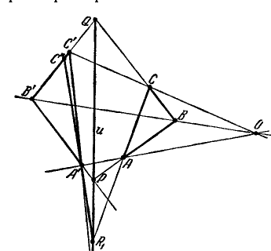
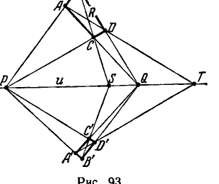
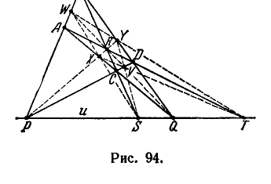
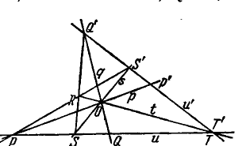
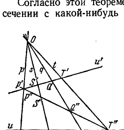
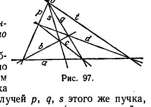
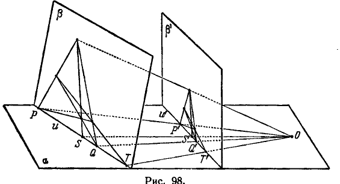
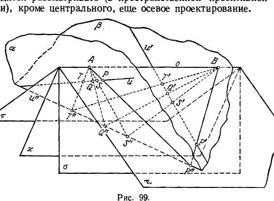

## 2. Теорема Дезарга. Построение гармонических групп элементов

---
**стр. 248**
---

не являются ее объектами, указанные выше обстоятельства, отличающие бесконечно удаленные элементы от остальных, теряют силу. Более того, так как при проектированиях бесконечно удаленные элементы могут переходить в обыкновенные, то, следовательно, они не обладают никакими *проективными свойствами*, которые отличали бы их от обыкновенных элементов. Поэтому в проективной геометрии различия между обыкновенными и бесконечно удаленными элементами нет.

**§ 83.** Идея бесконечно удаленных элементов возникла довольно давно. Но равноправие бесконечно удаленных и обыкновенных элементов, естественное с точки зрения проективной геометрии, оставалось иллюзорным, пока проективные свойства фигур исследовались методами элементарной геометрии, так как эти методы опираются на измерение, а метрика элементарной геометрии обязательно приводит к различию между конечными и бесконечно удаленными образами. Чтобы придать понятию проективного пространства точный смысл, оказалось необходимым полностью изгнать из проективной геометрии все, что связано с измерением.

Задача освобождения проективной геометрии от использования измерений в принципе была решена Штаудтом (1798—1867).

Проективная геометрия, освобожденная от метрики, превратилась в дисциплину, изучающую только свойства взаимного расположения геометрических образов. Вместе с тем проективная геометрия сделалась самостоятельной геометрической дисциплиной со своей собственной аксиоматикой и собственной совокупностью объектов (каковыми являются проективная прямая, проективная плоскость и проективное пространство).

## 2. Теорема Дезарга. Построение гармонических групп элементов

**§ 84.** Проективную геометрию мы будем строить на основе некоторой системы аксиом, относящихся к взаимным отношениям основных объектов. Основными объектами являются точки, прямые и плоскости; их взаимные отношения, о которых идет речь в аксиомах, суть отношения *связи* и *порядка*. Аксиомы проективной геометрии, как и получаемые из них теоремы, выражают известные свойства евклидова пространства, дополненного бесконечно удаленными элементами. Но, конечно, под точками, прямыми и плоскостями в проективной геометрии можно подразумевать любые предметы и взаимные отношения между ними можно истолковать любым образом, лишь бы было соблюдено то, что говорится в аксиомах. Тогда выводы, полученные из аксиом, будут выражать определенные факты, относящиеся к выбранным объектам. Соответственно этому проективным пространством является любое множество предметов, называемых точками, прямыми и пло-

---
**стр. 249**
---

скостями, для которых определены взаимные отношения с соблюдением требований нижеприводимых аксиом.

Аксиомы проективной геометрии можно распределить на три группы, из которых

группа I содержит девять аксиом связи,

группа II содержит шесть аксиом порядка,

группа III содержит одну аксиому непрерывности.

В настоящем разделе рассматриваются аксиомы I группы и их важнейшие следствия.

**Группа I. — Проективные аксиомы связи.**

Мы полагаем, что прямые и плоскости могут находиться в известных сопоставлениях с точками, которые обозначаем словами: «прямая проходит через точку» или «точка лежит на прямой»; «плоскость проходит через точку» или «точка лежит на плоскости». Условия этих сопоставлений выражают аксиомы I,1—I,9.

**I,1.** *Каковы бы ни были две точки $A$ и $B$, существует прямая $a$, проходящая через точки $A, B$.*

**I,2.** *Каковы бы ни были две различные точки $A$ и $B$, существует не более одной прямой, проходящей через точки $A, B$.*

**I,3.** *На каждой прямой имеется не менее трех точек. Существуют по крайней мере три точки, не лежащие на одной прямой.*

**I,4.** *Через каждые три точки $A, B, C$, не лежащие на одной прямой, проходит некоторая плоскость $\alpha$. На каждой плоскости имеется не менее одной точки.*

**I,5.** *Через каждые три точки $A, B, C$, не лежащие на одной прямой, проходит не более одной плоскости.*

**I,6.** *Если две точки $A, B$ прямой $a$ лежат на плоскости $\alpha$, то каждая точка прямой $a$ лежит на плоскости $\alpha$.*

**I,7.** *Если две плоскости $\alpha, \beta$ имеют общую точку $A$, то они имеют еще по крайней мере одну общую точку $B$.*

**I,8.** *Имеется не менее четырех точек, не лежащих на одной плоскости.*

**I,9.** *Каждые две прямые, расположенные в одной плоскости, имеют общую точку.*

Если сопоставить только что сформулированные аксиомы I,1—I,9 с аксиомами первой группы Гильберта (см. гл. II, § 12), то можно прежде всего заметить, что все требования аксиом первой группы Гильберта содержатся также и в проективных аксиомах I,1—I,9. Поэтому все теоремы элементарной геометрии, основанные лишь на аксиомах связи, справедливы также и в проективной геометрии. Проективные аксиомы связи отличаются от аксиом связи элементарной геометрии только в двух пунктах:

1) В аксиоме I,3 проективной системы требуется, чтобы на каждой прямой существовало не менее трех точек, тогда как

---
**стр. 250**
---

в соответствующей аксиоме I,3 системы Гильберта ставится требование, чтобы прямая содержала хотя бы две точки.

2) Проективные аксиомы связи включают требование I,9, которое не ставится и не выполняется в элементарной геометрии. Благодаря аксиоме I,9 в проективной геометрии нет параллельности, так как всякие две прямые одной плоскости пересекаются.

Таким образом, проективные аксиомы связи содержат больше требований, чем аксиомы связи элементарной геометрии, благодаря чему из проективных аксиом связи могут быть выведены теоремы, не вытекающие из аксиом связи Гильберта.

В частности, из аксиом I,1—I,9 следует, что

1) прямая и плоскость всегда имеют общую точку;

2) две плоскости всегда имеют общую прямую;

3) три плоскости всегда имеют общую точку.

**§ 85.** Не останавливаясь на тривиальных следствиях аксиом I,1—I,9, мы обратимся сейчас к доказательству теоремы Дезарга, которая является основой проективной геометрии на плоскости.

Условимся называть *трехвершинником* совокупность трех точек, не лежащих на одной прямой, и трех прямых, попарно соединяющих эти точки. Три точки, о которых идет речь, будем называть *вершинами*, соединяющие их прямые — *сторонами* трехвершинника (мы избегаем подобную фигуру называть треугольником, сохраняя этот термин для обозначения образа несколько иного вида, о котором будет речь дальше, после того, как мы познакомимся с проективными аксиомами порядка).

Рассмотрим два трехвершинника, вершины которых обозначим буквами $A, B, C$ и $A', B', C'$. Мы будем называть вершины, обозначенные одинаковыми буквами, соответственными ($A$ и $A'$, $B$ и $B'$, $C$ и $C'$); также будем называть соответственными стороны, проходящие через соответственные вершины.

**Теорема 1** (первая теорема Дезарга — прямая). *Если соответственные стороны трехвершинников $ABC$ и $A'B'C'$ пересекаются в точках $P$, $Q$, $R$, лежащих на одной прямой,*

---
**стр. 251**
---

то прямые, соединяющие соответственные вершины, сходятся в одной точке (рис. 90).

**Теорема 2** (вторая теорема Дезарга — обратная). *Если прямые, соединяющие соответственные вершины трехвершинников $ABC$ и $A'B'C'$, сходятся в одной точке, то соответственные стороны этих трехвершинников пересекаются в точках, лежащих на одной прямой* *).

Условимся называть прямую, на которой расположены точки пересечения соответственных сторон трехвершинников, *осью перспективы*; точку, в которой сходятся прямые, соединяющие соответственные вершины, — *центром перспективы*. Тогда обе теоремы Дезарга можно коротко выразить следующим образом:

*Если два трехвершинника имеют ось перспективы, то они имеют и центр перспективы, и обратно.*

Докажем первую теорему Дезарга.

Пусть $ABC$ и $A'B'C'$ — трехвершинники, лежащие в одной и той же плоскости $\alpha$, обладающие осью перспективы $u$ (рис. 91).

*) Для нас существен лишь тот случай, когда трехвершинники $ABC$ и $A'B'C'$ лежат в одной плоскости.

---
**стр. 252**
---

Таким образом, прямая $u$ содержит точки $P$, $Q$, $R$, в которых пересекаются пары соответственных сторон $AB$ и $A'B'$, $BC$ и $B'C'$, $AC$ и $A'C'$. Нужно показать, что прямые $AA'$, $BB'$ и $CC'$ сходятся в одной точке, т. е. что данные трехвершинники имеют центр перспективы *).

Для доказательства возьмем какую-нибудь точку, не лежащую на плоскости $\alpha$; обозначим ее через $B''$ (существование точки $B''$ обеспечено аксиомой I,8). Точки $P$, $Q$ и $B''$ не лежат на одной прямой; поэтому существует единственная плоскость $\beta$, проходящая через эти точки. В согласии с аксиомой I,3 мы можем на прямой $B''Q$ выбрать некоторую точку $C''$, отличную от $B''$ и $Q$. По аксиоме I,6 эта точка лежит в плоскости $\beta$, так же как и точка $R$. Поэтому прямая $RC''$ расположена в плоскости $\beta$. Так как прямые $RC''$ и $PB''$ лежат в одной плоскости, то по аксиоме I,9 они имеют общую точку; обозначим ее через $A''$. Мы получили в плоскости $\beta$ трехвершинник $A''B''C''$, находящийся в некотором специальном расположении по отношению к трехвершинникам $ABC$ и $A'B'C'$; именно, трехвершинники $ABC$, $A'B'C'$ и $A''B''C''$ имеют общую ось перспективы $u$, причем соответственные стороны $AB$, $A'B'$ и $A''B''$ этих трехвершинников сходятся в одной точке $P$, и точно так же стороны $BC$, $B'C'$ и $B''C''$ сходятся в одной точке $Q$ и стороны $AC$, $A'C'$ и $A''C''$ сходятся в одной точке $R$.

При таком расположении трехвершинники $ABC$ и $A''B''C''$, а также трехвершинники $A'B'C'$ и $A''B''C''$ имеют центр перспективы. Это нетрудно доказать. Хотя здесь нам приходится устанавливать по отношению к трехвершинникам $ABC$ и $A''B''C''$ (или $A'B'C'$ и $A''B''C''$) тот же факт, какой утверждается теоремой Дезарга по отношению к трехвершинникам $ABC$ и $A'B'C'$, но доказательство чрезвычайно упрощается тем, что трехвершинники $ABC$ и $A''B''C''$ (или $A'B'C'$ и $A''B''C''$) лежат в разных плоскостях.

Рассмотрим плоскости $PAA''$, $QBB''$ и $RCC''$; как было отмечено в конце § 84, каждые три плоскости имеют общую точку. Пусть $S$ — общая точка указанных плоскостей. Заметим, что прямая $AA''$ есть общая прямая плоскостей $PAA''$ и $RCC''$; далее, весьма существенно установить, что плоскости $PAA''$ и $RCC''$ различны. В самом деле, плоскость $PAA''$ содержит прямую $BB''$. Но в силу выбора точки $B''$ прямые $BB''$ и $u$ не имеют общей точки. Отсюда следует, что точка $R$ не может находиться в плоскости $PAA''$ и, таким образом, плоскости $PAA''$ и $RCC''$ действительно различны. Поэтому общая прямая $AA''$

*) Будем считать, что прямая $u$ не содержит вершин данных трехвершинников (в противном случае теорема тоже верна и усматривается с очевидностью).

---
**стр. 253**
---

этих плоскостей содержит все их общие точки, в том числе и точку $S$. Иначе говоря, прямая $AA''$ проходит через $S$. Из таких же соображений следует, что через точку $S$ проходят прямые $BB''$ и $CC''$. Тем самым устанавливается наличие центра перспективы трехвершинников $ABC$ и $A''B''C''$. Аналогично можно установить, что трехвершинники $A'B'C'$ и $A''B''C''$ имеют центр перспективы $S'$.

Проведем теперь через точки $S$ и $S'$ прямую $s$; эта прямая встретит плоскость $\alpha$ в некоторой точке $O$. Легко убедиться, что точка $O$ как раз и является центром перспективы трехвершинников $ABC$ и $A'B'C'$. В самом деле, будем проектировать пространственную фигуру, составленную трехвершинниками $A'B'C'$, $A''B''C''$ и точкой $S'$, из центра $S$ на плоскость $\alpha$. Очевидно, проекцией трехвершинника $A'B'C'$ окажется этот же трехвершинник. Проекцией трехвершинника $A''B''C''$ будет трехвершинник $ABC$. Прямые $A'A''$, $B'B''$, $C'C''$ спроектируются соответственно в прямые $AA'$, $BB'$, $CC'$. А так как прямые $A'A''$, $B'B''$, $C'C''$ сходятся в точке $S'$, то их проекции, т. е. прямые $AA'$, $BB'$, $CC'$, будут сходиться в проекции точки $S'$, т. е. в точке $O$. Таким образом, мы доказали, что прямые, соединяющие соответственные вершины трехвершинников $ABC$ и $A'B'C'$, сходятся в одной точке, что и нужно было доказать.

Обратимся теперь к доказательству обратной теоремы.

Пусть даны трехвершинники $ABC$ и $A'B'C'$, расположенные в одной плоскости, относительно которых известно, что они имеют центр перспективы, т. е. что прямые $AA'$, $BB'$, $CC'$ сходятся в одной точке $O$. Нужно доказать, что они имеют ось перспективы, т. е. что точки $P$, $Q$, $R$, в которых пересекаются соответственные стороны $AB$ и $A'B'$, $BC$ и $B'C'$, $AC$ и $A'C'$, лежат на одной прямой.

Для дальнейшего удобно заранее исключить из рассмотрения тот неинтересный случай, когда трехвершинники имеют одну общую сторону, например, когда прямые $BC$ и $B'C'$ совпадают. Тогда точка $Q$ становится неопределенной и можно считать, что она расположена на одной прямой с точками $P$ и $R$. В этом случае теорема, следовательно, верна. Далее предполагается, что соответственные стороны трехвершинников $ABC$ и $A'B'C'$ различны.

Доказательство мы проведем методом «от противного». Предположим, что $AB$ и $A'B'$, $BC$ и $B'C'$, $AC$ и $A'C'$ пересекаются в трех точках $P$, $Q$, $R$, не лежащих на одной прямой. При этом условии точки $P$ и $Q$ обязательно различны и определяют некоторую прямую $u$, пересекающуюся с прямыми $AC$ и $A'C'$ в разных точках $R_1$ и $R_2$, так что $R_1$, $A'$ и $C'$ не лежат на одной прямой (рис. 92). Поэтому прямая $R_1 A'$ встречает прямую $B'C'$

---
**стр. 254**
---

в некоторой точке $C''$, отличной от точки $C'$. Точка $C''$ не лежит на прямой $C'CO$. Действительно, если бы точка $C''$ лежала на прямой $C'CO$, то на этой же прямой находилась бы точка $B'$, а следовательно, и точка $B$. Но тогда соответственные стороны $BC$ и $B'C'$ должны были бы совпадать, а этот случай нами исключен. Таким образом, прямая $C''C$ не проходит через точку $O$. Рассмотрим трехвершинники $ABC$ и $A'B'C''$.

По только что доказанному, у них нет центра перспективы; однако они имеют ось перспективы, именно прямую $u$, на которой расположены точки $P$, $Q$ и $R_1$. Получилось противоречие с прямой теоремой Дезарга, и тем самым доказана обратная теорема.

Теперь мы перейдем к важнейшему в проективной геометрии определению и построению гармонических элементов. Наши дальнейшие рассуждения будут основаны на теореме Дезарга.

**§ 86.** Плоская фигура, составленная четырьмя точками, из которых никакие три не лежат на одной прямой, и шестью прямыми, соединяющими попарно эти точки, называется *полным четырехвершинником*.

Указанные точки называются *вершинами*, прямые, которые попарно их соединяют, — *сторонами* четырехвершинника. На рис. 93 изображен четырехвершинник с вершинами $ABCD$. Стороны, не имеющие общей вершины, называются *противоположными*. Так, четырехвершинник $ABCD$ обладает парами противоположных сторон $AB$ и $CD$, $AC$ и $BD$, $BC$ и $AD$. Точки пересечения противоположных сторон носят название *диагональных точек* четырехвершинника. На рис. 93 диагональные точки суть $P$, $Q$, $R$.

При помощи полного четырехвершинника определяется понятие гармонической группы элементов.

Пару точек $S$, $T$ произвольной прямой мы будем называть *гармонически сопряженной с парой точек* $P$, $Q$ этой же прямой, если $P$ и $Q$ суть диагональные точки некоторого четырехвершинника, а точки $S$ и $T$ определяются пересечением прямой с парой его противоположных сторон, проходящих через третью диагональную точку (рис. 93).

---
**стр. 255**
---

По смыслу этого определения точки $P$ и $Q$, составляющие первую пару, равноправны между собой так же, как равноправны точки $S$ и $T$ второй пары (но пока еще мы не имеем оснований утверждать равноправие пар $P$, $Q$ и $S$, $T$).

Условимся называть точку $T$ четвертой гармонической к трем точкам $P$, $Q$, $S$, если пара $S$, $T$ гармонически сопряжена с парой $P$, $Q$ (в порядке записи точек здесь существенно то, что на первых двух местах записываются точки, составляющие первую пару гармонической группы).

Очевидно, если $T$ есть четвертая гармоническая к трем точкам $P$, $Q$, $S$, то $S$ является четвертой гармонической к трем точкам $P$, $Q$, $T$.

Высказанное нами определение гармонических пар заключает в себе также и способ построения четвертой гармонической к трем данным точкам. Чтобы построить четвертую гармоническую к трем произвольно заданным точкам $P$, $Q$, $S$ прямой $u$, нужно выбрать на плоскости вне прямой $u$ какую-нибудь точку $B$ и на прямой $PB$ — некоторую точку $A$, отличную от $P$ и $B$ (существование точки $A$ обеспечивается аксиомой (I, 3)). Тогда пересечением прямых $BS$ и $AQ$ определится точка $C$, после чего пересечением прямых $PC$ и $BQ$ определится точка $D$; проведя прямую $AD$, мы найдем точку $T$, которая и будет искомой.

В высшей степени важно установить, что по заданным точкам $P$, $Q$, $S$ положение четвертой гармонической $T$ определяется однозначно, т. е. не зависит от выбора точек $B$ и $A$.

Это непосредственно вытекает из следующей теоремы.

**Теорема 3.** *Пусть $ABCD$ и $A'B'C'D'$ — два четырехвершинника с общими диагональными точками $P$ и $Q$ (рис. 93). Если стороны $BC$ и $B'C'$ этих четырехвершинников пересекаются в точке $S$ прямой $PQ$, то стороны их $AD$ и $A'D'$ пересекаются в точке $T$ на этой же прямой.*

Доказательство этой теоремы основано на предложении Дезарга.

Рассмотрим трехвершинники $ABC$ и $A'B'C'$. Соответственные стороны их пересекаются в трех точках $P$, $S$, $Q$, лежащих на одной прямой. По первой теореме Дезарга отсюда следует, что прямые $AA'$, $BB'$ и $CC'$ сходятся в одной точке $O$. Соответственные стороны трехвершинников $BCD$ и $B'C'D'$ также

---
**стр. 256**
---

пересекаются в трех точках одной прямой — в тех же точках $P$, $Q$, $S$. Снова применяя первую теорему Дезарга, находим, что прямые $BB'$, $CC'$ и $DD'$ имеют общую точку $O'$. Очевидно, точки $O$ и $O'$ совпадают, так как каждая из них определяется пересечением прямых $BB'$ и $CC'$. Таким образом, все прямые $AA'$, $BB'$, $CC'$ и $DD'$ пересекаются в точке $O$. Тем самым мы установили, в частности, что прямые $AA'$, $BB'$ и $DD'$ сходятся в одной точке. По второй теореме Дезарга тогда соответственные стороны трехвершинников $ABD$ и $A'B'D'$ пересекаются в трех точках одной прямой. Значит, точка $T$ пересечения прямых $AD$ и $A'D'$ расположена на прямой $PQ$, и теорема доказана.

Из определения гармонических групп точек и из только что доказанной теоремы непосредственно вытекает следующее предложение, выражающее однозначность определения четвертой гармонической точки.

**Теорема 4.** *Если пара $S$, $T$ гармонически сопряжена с парой $P$, $Q$ и $ABCD$ — какой-нибудь четырехвершинник с диагональными точками $P$, $Q$, сторона $BC$ которого проходит через точку $S$, то сторона $AD$ его проходит через точку $T$.*

Докажем теперь следующую важную теорему.

**Теорема 5.** *Если пара точек $S$, $T$ прямой $u$ гармонически сопряжена с парой $P$, $Q$, то пара $P$, $Q$ гармонически сопряжена с парой $S$, $T$.*

Для доказательства возьмем какой-нибудь четырехвершинник $ABCD$, имеющий диагональные точки $P$, $Q$ и пару противоположных сторон $BC$ и $AD$, пересекающих прямую $u$ в точках $S$ и $T$ (рис. 94). Обозначим через $R$ третью диагональную точку четырехвершинника $ABCD$ и проведем прямые $PR$ и $QR$. Эти прямые в пересечении со сторонами рассматриваемого четырехвершинника определят четыре точки, которые мы пометим буквами $X$, $Y$, $V$, $W$, как показано на рис. 94.

Рассмотрим теперь четырехвершинник $AXRW$. Этот четырехвершинник имеет диагональные точки $P$, $Q$ и его сторона $AR$ проходит через точку $T$; так как точка $S$ является четвертой гармонической к трем точкам $P$, $Q$, $T$, то по теореме 4 сторона $XW$ четырехвершинника $AXRW$ должна пройти через $S$. Таким образом, точки $W$, $X$, $S$ лежат на одной прямой. Из рассмотрения четырехвершинников $RWBY$, $YDVR$, $RVCX$, аналогично предыдущему, будет следовать, что точки каждой из сле-

---
**стр. 257**
---

дующих троек: $W$, $Y$, $T$; $Y$, $V$, $S$ и $X$, $V$, $T$ лежат на одной прямой. Отсюда следует, что $XVYW$ является четырехвершинником с диагональными точками $S$, $T$ и со сторонами $XY$, $VW$, проходящими через точки $P$, $Q$. А это и означает, что пара $P$, $Q$ гармонически сопряжена с парой $S$, $T$.

Теорема, которую мы сейчас установили, обнаруживает взаимность гармонической сопряженности пар. Поэтому в дальнейшем, рассматривая на прямой две пары точек, из которых одна пара гармонически сопряжена с другой, мы не будем отмечать, какая именно является сопряженной с другой парой, и будем называть их взаимно гармоническими.

Одно из важнейших свойств гармонических групп точек выражает следующая

**Теорема 6.** *Пусть $p$, $q$ и $s$, $t$ — две пары лучей некоторого пучка с центром $O$, которые в пересечении с прямой $u$ определяют соответственно пары точек $P$, $Q$ и $S$, $T$, а в пересечении с прямой $u'$ — пары точек $P'$, $Q'$ и $S'$, $T'$. Тогда если $P$, $Q$ и $S$, $T$ являются взаимно гармоническими парами, то $P'$, $Q'$ и $S'$, $T'$ будут также взаимно гармоническими парами.*

**Доказательство.** Сначала мы докажем утверждение в том частном случае, когда какие-нибудь две из соответствующих точек $P$, $Q$, $S$, $T$ и $P'$, $Q'$, $S'$, $T'$, например, точки $T$ и $T'$, совпадают (рис. 95).

Проведем прямую $SQ'$ и обозначим буквой $R$ точку ее пересечения с прямой $OT$. Так как пары точек $P$, $Q$ и $S$, $T$ взаимно гармоничны, то по теореме 4 прямая $RS'$ должна пройти через точку $P$ (чтобы убедиться в этом, нужно рассмотреть четырехвершинник $ROS'Q'$, имеющий диагональные точки $S$, $T$). Получается четырехвершинник $RPSO$ с диагональными точками $S'$, $T'$ и со сторонами $OP$ и $RS$, проходящими через точки $P'$ и $Q'$. Отсюда следует, что пары $P'$, $Q'$ и $S'$, $T'$ взаимно гармоничны, и, таким образом, в данном частном случае теорема доказана.

Обратимся теперь к общему случаю расположения прямых $u$ и $u'$. Построим прямую $P'T$ (рис. 96). Лучи $p$, $q$, $s$, $t$ определяют на прямой $P'T$ точки $P''$, $Q''$, $S''$, $T''$. Так как точки $T$ и $T''$ совпадают, то из гармонической сопряженности пар $P$, $Q$ и $S$, $T$ следует по предыдущему гармоническая сопряженность пар $P''$, $Q''$ и $S''$, $T''$; а так как точки $P''$ и $P'$ совпадают, то из гармонической сопряженности пар $P''$, $Q''$ и $S''$, $T''$ вытекает гармоническая

---
**стр. 258**
---

сопряженность пар $P'$, $Q'$ и $S'$, $T'$. Тем самым теорема доказана полностью.

Согласно этой теореме, если две пары лучей пучка при пересечении с какой-нибудь прямой определяют две пары точек, являющиеся гармонически сопряженными, то этим же свойством обладают пары точек, определяемые пересечением рассматриваемых пар лучей со всякой другой прямой. Таким образом, свойство двух пар лучей пучка определять на прямой гармонически сопряженные пары точек не зависит от выбора прямой, являясь свойством самих пар лучей. Пары лучей пучка, обладающие этим свойством, называются *гармонически сопряженными*.

Будем говорить, что лучи $p$, $q$, $s$, $\dots$, идущие из точки $O$ в точки $P$, $Q$, $S$, $\dots$, проектируют эти точки из точки $O$. Построение проектирующих лучей $p$, $q$, $s$, $\dots$ по данным точкам $P$, $Q$, $S$, $\dots$ мы будем называть *операцией проектирования*; построение точек $P$, $Q$, $S$, $\dots$ по данным лучам $p$, $q$, $s$, $\dots$ — *операцией сечения*.

Пользуясь введенной терминологией, мы можем теперь высказать следующее утверждение (как следствие теоремы 6).

*В результате операций проектирования или сечения гармонически сопряженных пар элементов (точек прямой или лучей пучка) всегда получаются снова гармонически сопряженные пары элементов.*

Или иначе:

*Свойство гармонической сопряженности инвариантно относительно проектирований и сечений.*

Употребляя терминологию, подобную той, какую мы употребляем по отношению к гармоническим группам точек прямой, назовем луч $t$ пучка четвертым гармоническим к тройке лучей $p$, $q$, $s$ этого же пучка, если пары $p$, $q$ и $s$, $t$ гармонически сопряжены (в записи тройки $p$, $q$, $s$ на первых двух местах пишется пара $p$, $q$).

Построение четвертого гармонического луча $t$ по трем данным лучам $p$, $q$, $s$ читатель легко уяснит себе из рассмотрения рис. 97 (при восстановлении фигуры, изображенной на рис. 97, сначала следует произвольно провести через некоторую точку луча $p$ прямые $a$ и $b$, затем прямую $c$ и, наконец, прямую $d$; после этого положение луча $t$ однозначно определяется).

---
**стр. 259**
---

**§ 87.** Все теоремы, которые мы доказывали в этом разделе, относятся к проективной геометрии плоскости. Источником этих теорем является теорема Дезарга, которая по своему смыслу также есть теорема плоской геометрии. Однако доказательство ее проводилось нами при помощи рассуждений, относящихся к геометрии пространства. Естественно поставить вопрос, возможно ли доказать теорему Дезарга так, чтобы в доказательстве не использовались никакие пространственные конфигурации.

Подобные доказательства известны, но все они носят метрический характер и поэтому неприемлемы в проективной геометрии. Анализ этого вопроса, проведенный Гильбертом, обнаружил, что доказать теорему Дезарга средствами проективной геометрии без пространственных построений нельзя.

Точнее: если из списка аксиом $I,1—I,9$ исключить все утверждения, относящиеся к пространству, то из оставшихся утверждений, каковыми будут только аксиомы $I,1—I,3$, теорема Дезарга не следует. Независимость теоремы Дезарга от аксиом $I,1—I,3$ (и даже от аксиом более обширного списка, содержащего, помимо аксиом $I,1—I,3$, еще проективные аксиомы порядка и непрерывности, которые мы приведем позднее) может быть доказана в принципе тем же приемом, какой подробно описан и многократно применен в гл. IV. (Доказательство Гильберта изложено в его «Основаниях геометрии».)

Ввиду указанных обстоятельств предложение Дезарга можно рассматривать как аксиому плоской проективной геометрии.

**§ 88.** В заключение этого раздела сделаем два замечания.

Первое замечание будет относиться к доказательству предложения об инвариантности гармонических групп элементов относительно проектирований. Это предложение было доказано нами средствами плоской геометрии. Если не отказываться от использования пространственных конфигураций, то можно дать ему другое, более наглядное доказательство.

Пусть $u$ и $u'$ — две прямые плоскости $\alpha$ (рис. 98); $P$, $Q$, $S$, $T$ — точки прямой $u$; $P'$, $Q'$, $S'$, $T'$ — их проекции на прямую $u'$ из центра $O$ (также расположенного в плоскости $\alpha$). Предположим, что пары $P$, $Q$ и $S$, $T$ гармонически сопряжены. Проведем через $u$ и $u'$ соответственно плоскости $\beta$ и $\beta'$, отличные от плоскости $\alpha$. Так как пары точек $P$, $Q$ и $S$, $T$ гармонически сопряжены, то в плоскости $\beta$ может быть построен четырехвершинник $\Omega$, имеющий диагональные точки $P$, $Q$ и пару противоположных сторон, проходящих через $S$ и $T$. Проектируя четырехвершинник $\Omega$ из центра $O$ на плоскость $\beta'$ как на экран, мы получим в плоскости $\beta'$ четырехвершинник $\Omega'$, расположенный по отношению к парам $P'$, $Q'$ и $S'$, $T'$ так же, как четырехвершинник $\Omega$ по отношению

---
**стр. 260**
---

к парам $P$, $Q$ и $S$, $T$. Отсюда непосредственно следует, что пары $P'$, $Q'$ и $S'$, $T'$ гармонически сопряжены.

Второе замечание мы сделаем по поводу возможности обобщения теоремы об инвариантности гармонических групп элементов относительно проектирований.

До сих пор мы рассматривали проектирование из центра. Иногда приходится рассматривать (в пространственной проективной геометрии), кроме центрального, еще осевое проектирование.

Пусть $o$ — некоторая прямая, $P, Q, S, \dots$ — система точек на другой прямой $u$, не лежащей в одной плоскости с прямой $o$ (рис. 99). Система плоскостей $\pi, \varkappa, \sigma, \dots$, проходящих через пря-
