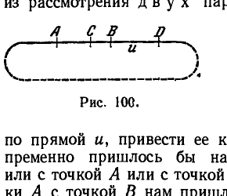
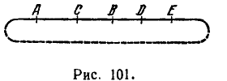
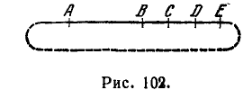
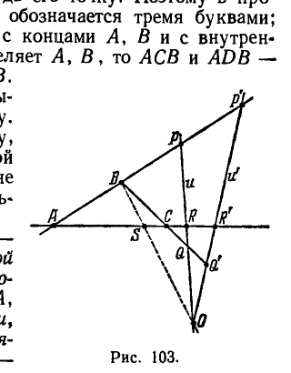
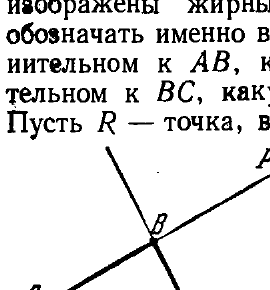
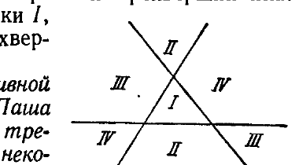
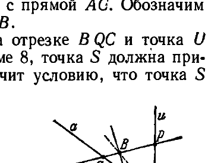

## 3. Порядок точек на проективной прямой

---
**стр. 261**
---

мую $o$ и через точки $P, Q, S, \dots$, называется пучком плоскостей с осью $o$, проектирующим точки $P, Q, S, \dots$. Если $u'$ — какая-нибудь новая прямая, пересекающая плоскости $\pi, \varkappa, \sigma, \dots$ в точках $P', Q', S', \dots$, то мы будем говорить, что точки $P', Q', S', \dots$ получены при помощи осевого проектирования точек $P, Q, S, \dots$.

Оказывается, что *инвариантность гармонической сопряженности пар точек имеет место также при осевом проектировании.*

Пусть $P, Q, S, T$ — гармоническая четверка точек прямой $u$, которая при осевом проектировании отображается в четверку точек $P', Q', S', T'$ некоторой прямой $u'$ (прямые $u$ и $u'$ в общем случае не лежат в одной плоскости). Мы покажем, что четверка точек $P', Q', S', T'$ также является гармонической.

Для этого проведем прямую $u''$, пересекающую обе прямые $u$ и $u'$ (рис. 99). Прямые $u$ и $u''$ лежат в одной плоскости $\alpha$, прямые $u'$ и $u''$ также лежат в одной плоскости $\beta$. Пусть $A$ и $B$ — точки, в которых пересекаются плоскости $\alpha$ и $\beta$ с осью проектирующего пучка плоскостей, а $P'', Q'', S'', T''$ — точки, в которых пересекают прямую $u''$ плоскости этого пучка. Очевидно, группу точек $P'', Q'', S'', T''$ можно рассматривать как полученную центральным проектированием точек $P, Q, S, T$ из центра $A$ внутри плоскости $\alpha$. Поэтому из гармоничности группы точек $P, Q, S, T$ следует гармоничность группы $P'', Q'', S'', T''$. Далее, рассматривая группу $P', Q', S', T'$ как центральную проекцию группы $P'', Q'', S'', T''$ из центра $B$, мы можем на основании гармоничности четверки точек $P'', Q'', S'', T''$ заключить, что четверка точек $P', Q', S', T'$ также является гармонической.

Таким образом, если две пары плоскостей $\pi, \varkappa$ и $\sigma, \tau$ некоторого пучка в пересечении с какой-нибудь прямой определяют две пары гармонически сопряженных точек, то они определяют две пары гармонически сопряженных точек и в пересечении со всякой другой прямой. Пары плоскостей $\pi, \varkappa$ и $\sigma, \tau$ в этом случае называются гармонически сопряженными.

Нетрудно убедиться, что, пересекая гармонически сопряженные пары плоскостей пучка какой угодно плоскостью, не проходящей через ось этого пучка, мы получим на секущей плоскости две гармонически сопряженные пары лучей линейного пучка. Доказательство усматривается непосредственно, и мы останавливаться на нем не будем.

**§ 89.** Как мы знаем, в элементарной геометрии в основу определения порядка точек прямой кладется понятие о расположении точки между двумя другими точками (см. гл. II, § 13). В проективной геометрии, где прямая мыслится в виде замкнутой

---
**стр. 262**
---

линии, не имеет смысла вводить это понятие. Действительно, рассматривая три произвольные точки проективной прямой (или три точки окружности), мы не можем в их взаимном расположении отличать какую-нибудь одну сравнительно с другими.

Для определения порядка точек проективной прямой исходят из рассмотрения д в у х пар точек. Позволим себе сначала пользоваться наглядностью — чертежами.

Пусть $A, B, C, D$ — четыре точки проективной прямой $u$, расположенные так, как это изображено на рис. 100 (где проективная прямая имеет вид замкнутой линии). Если бы мы пожелали, перемещая точку $C$ по прямой $u$, привести ее к совмещению с точкой $D$, то нам непременно пришлось бы на один момент совместить точку $C$ или с точкой $A$ или с точкой $B$. Точно так же для совмещения точки $A$ с точкой $B$ нам пришлось бы провести точку $A$ через положение $C$ или $D$. В таком случае говорят, что пара $A, B$ разделяет пару $C, D$.

В той же группе точек $A, B, C, D$ пары $A, D$ и $B, C$ таковы, что для совмещения точек $B$ и $C$ нет необходимости какую-нибудь из них приводить в положение точки $A$ или $D$ и точно так же для совмещения точек $A$ и $D$ не нужно какую-нибудь из них проводить через положение $B$ или $C$. О парах $A, D$ и $B, C$ говорят, что они не разделяют друг друга. Точно так же не разделяют друг друга пары $A, C$ и $B, D$. Таким образом, наше наглядное представление о проективной прямой (или окружности) позволяет различать разделяющие и не разделяющие друг друга пары точек.

При логическом развертывании проективной геометрии разделенность пар точек на прямой принимается в качестве основного отношения порядка. Необходимые свойства этого отношения обусловлены в аксиомах второй группы.

**Г р у п п а II. П р о е к т и в н ы е а к с и о м ы п о р я д к а.**

Мы полагаем, что две точки на прямой могут находиться в известном отношении к двум другим точкам этой прямой и обозначаем это отношение словом «разделяют». При этом должны быть соблюдены требования следующих аксиом, которые и являются аксиомами порядка.

**II,1.** *Каковы бы ни были три различные точки $A, B, C$ произвольной прямой $u$, существует на этой прямой такая точка $D$, что пара $A, B$ разделяет пару $C, D$.*

Если пара $A, B$ разделяет пару $C, D$, то все четыре точки $A, B, C, D$ различны.

---
**стр. 263**
---

**II,2.** *Если пара $A, B$ разделяет пару $C, D$, то пара $B, A$ разделяет пару $C, D$ и пара $C, D$ разделяет пару $A, B$ (т. е. свойство разделенности является взаимным и не зависит от того, в каком порядке рассматриваются точки пары).*

**II,3.** *Каковы бы ни были четыре различные точки $A, B, C, D$ прямой $u$, из них могут быть всегда и единственным образом составлены две разделенные пары.*

**II,4.** *Пусть даны на прямой $u$ точки $A, B, C, D, E$; если пары $C, D$ и $C, E$ разделяют пару $A, B$, то пара $D, E$ не разделяет пару $A, B$ (рис. 101).*

**II,5.** *Пусть даны на прямой $u$ точки $A, B, C, D, E$; если пары $C, D$ и $C, E$ не разделяют пару $A, B$, то пара $D, E$ также не разделяет пару $A, B$ (рис. 102).*

**II,6.** *Пусть $A, B$ и $C, D$ — две пары точек прямой $u$; $A', B'$ и $C', D'$ — их проекции, из какого угодно центра на произвольную прямую $u'$. Если пары $A, B$ и $C, D$ разделяют друг друга, то пары $A', B'$ и $C', D'$ также разделяют друг друга. Короче: разделенность двух пар точек есть свойство, инвариантное относительно проектирования.*

На основании аксиомы II,6 можно дать определение понятию о разделенных парах прямых плоского пучка.

Именно, если $a, b$ и $c, d$ — две пары прямых, проходящих через некоторую точку, и $s$ — какая-нибудь прямая, пересекающая $a, b$ и $c, d$ соответственно в точках $A, B$ и $C, D$, то, как следует из аксиомы II,6, пары точек $A, B$ и $C, D$ при любом выборе прямой $s$ либо будут всегда разделенными, либо будут всегда неразделенными. В первом случае мы будем говорить, что пары прямых $a, b$ и $c, d$ разделяют друг друга, во втором, — что не разделяют. Таким образом, понятие разделенности пар прямых сводится к понятию разделенности пар точек; последнее же является у нас основным понятием, не сводимым к каким-либо более примитивным.

Излагая проективную геометрию, мы не ставим своей целью построение ее на базе минимальных требований. Поэтому мы не будем выяснять, являются ли все сформулированные нами аксиомы действительно необходимыми или некоторые из них могут быть доказаны. Существенно, что этих аксиом достаточно для

---
**стр. 264**
---

доказательства теорем, составляющих материал проективной геометрии *).

**Теорема 7.** *Пусть на произвольной прямой $u$ даны две точки $A$ и $B$. Тогда все точки прямой $u$, отличные от $A$ и $B$, могут быть распределены на два класса так, что любые две точки одного класса образуют пару, не разделяющую $A, B$, а каждая пара точек из разных классов разделяет пару $A, B$.*

**Доказательство.** Согласно аксиоме I,3 на прямой $u$ существует некоторая точка $C$, отличная от точек $A$ и $B$. Отнесем в один класс точку $C$ и всякую другую точку прямой $u$, если эта точка вместе с $C$ образует пару, не разделяющую пару $A, B$. В другой класс отнесем каждую точку прямой $u$, если эта точка вместе с $C$ разделяет пару $A, B$. Тогда все точки прямой $u$ (кроме $A$ и $B$) распределятся на два класса. Мы должны показать, что это распределение удовлетворяет требованиям, поставленным в формулировке теоремы.

Пусть $C_1$ и $C_2$ — две точки первого класса. Согласно условиям построения первого класса пары $C_1, C$ и $C_2, C$ не разделяют пару $A, B$. По аксиоме II,5 отсюда следует, что пара $C_1, C_2$ не разделяет пару $A, B$. Далее, пусть $D_1$ и $D_2$ — две точки второго класса. Согласно определению второго класса пары $C, D_1$ и $C, D_2$ разделяют пару $A, B$. По аксиоме II,4 отсюда заключаем, что пара $D_1, D_2$, как и в первом случае, не разделяет пару $A, B$. Таким образом, если две точки принадлежат одному классу, то они не разделяют пару $A, B$.

Рассмотрим теперь две точки $M$ и $N$ из разных классов. Пусть, например, $M$ берется из первого класса, а $N$ — из второго. Тогда пара $C, M$ не разделяет пару $A, B$, а пара $C, N$ разделяет пару $A, B$. Если бы пара $M, N$ не разделяла пару $A, B$, то, так как наряду с этим пара $M, C$ не разделяет пару $A, B$, по аксиоме II,5 пара $C, N$ не должна была бы разделять пару $A, B$, что противоречит сделанному допущению. Следовательно, пара $M, N$ разделяет пару $A, B$. Теорема доказана.

Заметим, что если описанное построение двух классов производить исходя не из точки $C$, а из какой-нибудь другой точки первого класса, то получатся те же самые два класса, какие мы получаем в первом случае. Если же выбрать за исходную некоторую точку второго класса и снова произвести распределение точек, то опять получатся первоначальные классы, только в другом порядке.

Применяя обычную в наглядной геометрии терминологию, назовем каждый из двух классов, о которых шла речь, *отрезком*.

*) Вместе с аксиомой непрерывности, приведенной в § 94, эти аксиомы составляют полную систему.

---
**стр. 265**
---

Тогда содержание предыдущей теоремы можно будет выразить следующими словами.

Две точки $A, B$ прямой разделяют ее на два отрезка; если $M$ и $N$ суть точки одного отрезка, то пара $M, N$ не разделяет пару $A, B$, если же $M$ и $N$ — точки разных отрезков, то пары $M, N$ и $A, B$ разделяют друг друга.

Чтобы отличить один из двух рассматриваемых отрезков от другого, нужно указать какую-нибудь его точку. Поэтому в проективной геометрии отрезок иногда обозначается тремя буквами; например, $ACB$ обозначает отрезок с концами $A, B$ и с внутренней точкой $C$. Если пара $C, D$ разделяет $A, B$, то $ACB$ и $ADB$ — различные отрезки с концами $A, B$. Отрезки $ACB$ и $ADB$ мы будем называть *дополнительными друг к другу*.

Теперь мы докажем одну теорему, которая позволит нам в проективной геометрии определить образ, вполне аналогичный евклидову треугольнику.

**Теорема 8.** *Пусть $A, B, C$ — три точки, не лежащие на одной прямой, и $u$ и $u'$ — две прямые, не проходящие ни через одну из точек $A, B, C$; пусть, далее, $P, Q, R$ — точки, в которых прямая $u$ пересекает прямые $AB, BC$ и $AC$; $P', Q', R'$ — точки, в которых эти же прямые пересекает прямая $u'$. Тогда, если пара $P, P'$ не разделяет пару $A, B$ и пара $Q, Q'$ не разделяет пару $B, C$, то пара $R, R'$ не разделяет пару $A, C$ (рис. 103).*

**Доказательство.** Обозначим буквой $O$ точку пересечения прямых $u$ и $u'$. Проектируя пары $A, B$ и $P, P'$ из точки $O$, как из центра, на прямую $AC$, мы получим в качестве их проекций пары $A, S$ и $R, R'$. По условию теоремы пары $A, B$ и $P, P'$ не разделяют друг друга. Тогда по аксиоме II,6 пары $A, S$ и $R, R'$ должны быть также неразделенными. Проектируя снова из центра $O$ на прямую $AC$ пары $B, C$ и $Q, Q'$, мы получим пары $S, C$ и $R, R'$. Так как $B, C$ не разделяет $Q, Q'$, то по той же аксиоме II,6 пары $S, C$ и $R, R'$ не разделяют одна другую. Итак, пары $S, A$ и $S, C$ не разделяют пару $R, R'$. Из аксиомы II,4 на основании этого находим, что $A, C$ не разделяет $R, R'$. Теорема доказана.

Рассматривая три точки $A, B, C$, не лежащие на одной прямой, выберем один из двух отрезков с концами $A, B$ и один из двух отрезков с концами $B, C$ (на рис. 104 выбранные отрезки

---
**стр. 266**
---

изображены жирными линиями). Условимся через $AB$ и $BC$ обозначать именно выбранные отрезки. Возьмем на отрезке, дополнительном к $AB$, какую-нибудь точку $P$, на отрезке, дополнительном к $BC$, какую-нибудь точку $Q$ и проведем прямую $PQ$. Пусть $R$ — точка, в которой прямая $PQ$ пересекает прямую $AC$. Будем теперь произвольно изменять точки $P$ и $Q$, сохраняя, однако, первую из них на отрезке, дополнительном к $AB$, вторую — на отрезке, дополнительном к $BC$. Тогда, как непосредственно вытекает из предыдущей теоремы, точка $R$, перемещаясь по прямой $AC$, будет все время оставаться внутри одного определенного отрезка из тех двух, которые определяются точками $A$ и $C$. Отрезок с концами $A, C$, д о п о л н и т е л ь н ы й к тому, в котором содержится точка $R$, условимся обозначать через $AC$. Мы видим, что *отрезок $AC$ однозначно определяется заданием отрезков $AB$ и $BC$*. Фигуру, составленную точками $A, B, C$ и отрезками $AB, BC$ и $AC$, будем называть *треугольником*; отрезки $AB, BC$ и $AC$ назовем его *сторонами*.

Нетрудно установить, что каждый трехвершинник $ABC$ определяет четыре треугольника с общими вершинами $A, B, C$. Стороны этих треугольников являются взаимно дополнительными отрезками на прямых, которые служат сторонами трехвершинника. На рис. 105 изображены треугольники $I, II, III, IV$, определяемые одним трехвершинником $ABC$.

Мы покажем сейчас, что в проективной геометрии справедливо *предложение Паша* (см. гл. II, § 13), т. е. если даны треугольник $ABC$ и в плоскости его — некоторая прямая $a$, не проходящая ни через одну из точек $A, B, C$, и если эта прямая проходит через какую-нибудь точку стороны $AB$, то она проходит либо через некоторую точку стороны $BC$, либо через некоторую точку стороны $AC$.

Для доказательства прежде всего заметим, что согласно определению треугольника существует прямая $u$, которая пересекает прямые $AB, BC$ и $AC$ соответственно в трех точках $P, Q, R$ так, что $P$ лежит на отрезке, дополнительном к $AB$, $Q$ — на отрезке, дополнительном к $BC$, и $R$ — на отрезке, дополнительном к $AC$ (рис. 106). Далее, так как наше рассмотрение ведется на проективной плоскости, то по аксиоме I, 9 данная прямая $a$ имеет общую

---
**стр. 267**
---

точку с прямой $PQ$ (рис. 106). Обозначим эту точку через $S$. Рассуждения о том, через какой из отрезков прямой $PQ$ проходит точка $S$, могут не повторяться, так как они проводились выше при рассмотрении перемещения точки $R$ по прямой $AC$; таким образом, $S$ принадлежит отрезку, дополнительному к $PQ$. Пусть прямая $a$ пересекает сторону $AB$ в точке $S$. Тогда прямая $a$ имеет еще общую точку $T$ с прямой $BC$ и общую точку $U$ с прямой $AC$ (рис. 106). Обозначим их соответственно через $T$ и $U$.

Допустим, что $S$ принадлежит отрезку $AB$, $T$ — отрезку $BQC$ и точка $U$ принадлежит прямой $AC$, но не отрезку $ARC$. Тогда в силу теоремы 8, точка $S$ должна принадлежать отрезку $APB$, что противоречит условию, что точка $S$ принадлежит отрезку $AB$. Тем самым предложение Паша доказано.

**§ 90.** В дальнейшем мы будем часто пользоваться разрезом проективного пространства вдоль той или иной плоскости, т. е. таким приемом, при котором все «бесконечно удаленные» точки и прямые исключаются из рассмотрения. В силу того, что все «конечные» прямые одной и той же плоскости в проективном пространстве имеют по одной и той же «бесконечно удаленной» точке, всякий «бесконечно удаленный» элемент пространства состоит из точки и прямых, лежащих в одной и той же «бесконечно удаленной» плоскости. Эту плоскость мы обозначим через $\alpha_\infty$.

Точки, прямые и плоскости, принадлежащие $\alpha_\infty$, будем называть «бесконечно удаленными», а все остальные точки, прямые и плоскости — «конечными». Каждая «конечная» прямая $a$ содержит одну и только одну «бесконечно удаленную» точку, которую обозначим через $O_\infty$.

Мы введем отношение «между» для трех «конечных» точек $A, B, C$ одной и той же «конечной» прямой $a$. Будем говорить, что точка $B$ лежит между точками $A$ и $C$, если пара точек $(B, O_\infty)$ разделяет пару точек $(A, C)$.

При таком определении для «конечных» точек прямой $a$ выполняются аксиомы порядка Гильберта $II, 1$ — $II, 3$. Иными словами, мы докажем сейчас, что наше определение удовлетворяет этим аксиомам.

Для доказательства обратимся к проективным аксиомам порядка. По аксиоме $II, 2$, если пара $(B, O_\infty)$ разделяет пару $(A, C)$, то и пара $(B, O_\infty)$ разделяет пару $(C, A)$. Следовательно, аксиома $II, 1$ Гильберта

---
**стр. 268**
---

выполнена. Допустим теперь, что для «конечных» точек прямой $a$ существует точка $D$ такая, что точка $C$ лежит между точками $A$ и $D$. Тогда пара $(C, O_\infty)$ разделяет пару $(A, D)$, и, следовательно, аксиома $II, 2$ Гильберта выполнена.

В силу проективной аксиомы $II, 3$ из четырех точек $A, B, C, O_\infty$ существует лишь один способ разбить их на две разделяющиеся пары. Поэтому для трех точек $A, B, C$ не более одной из них лежит между двумя другими, т. е. аксиома $II, 3$ Гильберта выполнена.

Таким образом, введенное нами для «конечных» точек прямой $a$ отношение «между» удовлетворяет аксиомам порядка Гильберта $II, 1$ — $II, 3$.

Отрезком на прямой $a$ мы будем называть множество точек, лежащих между двумя данными точками. В смысле только что введенного понятия отрезок есть один из двух взаимно дополнительных отрезков, определяемых на проективной прямой двумя точками $A, B$, а именно тот, который не содержит точки $O_\infty$.

Понятие треугольника в системе «конечных» элементов совпадает с определением треугольника, данным в проективной геометрии. Поэтому аксиома Паша выполняется и для системы «конечных» элементов, так как она доказана для проективного пространства в целом.

Таким образом, понятие «между» введено нами так, что выполняются все аксиомы порядка Гильберта.

Пусть теперь вместе с «бесконечно удаленной» плоскостью $\alpha_\infty$ исключены из рассмотрения все точки и прямые, принадлежащие ей. Иными словами, проективное пространство разрезано вдоль плоскости $\alpha_\infty$. Тогда оставшиеся элементы удовлетворяют аксиомам связи Гильберта, и, следовательно, в этом пространстве справедливы все теоремы элементарной геометрии, основанные на первых двух группах аксиом Гильберта.

В проективном пространстве бесконечно много точек, прямых и плоскостей.

Процесс, который мы сейчас описали, является обратным по отношению к тому, который был рассмотрен в предыдущем разделе. Там показывалось, как, дополняя евклидово пространство «бесконечно удаленными» элементами, получается проективное пространство; здесь же мы показали обратный переход.

---
**стр. 269**
---

дим, что проективное пространство, определенное при помощи специальных аксиом, становится в известных отношениях аналогичным евклидову, если удалить из него какую-нибудь плоскость.

В дальнейшем мы будем иногда пользоваться разрезом пространства вдоль той или иной плоскости, как приемом, позволяющим проводить доказательства некоторых проективных теорем, основываясь на следствиях первых двух групп аксиом *элементарной геометрии*, которые нам известны из главы II.

В частности, сейчас мы воспользуемся этим приемом, чтобы охарактеризовать свойственный проективной прямой порядок расположения ее точек.

Пусть $A$ и $B$ — две точки проективной прямой $u$; они разделяют прямую $u$ на два взаимно дополнительных отрезка. Рассмотрим один из них и условимся именно его обозначать через $AB$. Множество внутренних точек отрезка $AB$ мы упорядочим, полагая, что точка $M$ предшествует точке $N$, если пара $A, N$ разделяет пару $M, B$. Нужно показать, что при этом выполнено условие транзитивности, т. е. что если $M$ предшествует $N$, а $N$ предшествует $P$, то $M$ предшествует $P$. Проще всего для этой цели ввести на прямой $u$ бесконечно удаленную точку. В качестве таковой удобно взять точку $B$. Тогда условие «$N$ предшествует $P$» можно выразить таким способом: «в множестве конечных точек прямой $u$ точка $N$ лежит между $A$ и $P$» или «$N$ лежит внутри отрезка $AP$». Для доказательства транзитивности введенного нами отношения порядка достаточно в таком случае установить для множества конечных точек прямой $u$ такое предложение: «если $M$ лежит внутри отрезка $AN$, а $N$ — внутри отрезка $AP$, то $M$ лежит также внутри отрезка $AP$». Но это предложение мы вывели в свое время из первых двух групп аксиом Гильберта (см. гл. II, § 14).

Мы будем говорить, что установленный на отрезке $AB$ порядок соответствует направлению отрезка от $A$ к $B$. На дополнительном к $AB$ отрезке мы введем порядок, соответствующий направлению от $B$ к $A$. После этого мы можем внутри произвольного отрезка $ST$ прямой $u$ установить вполне определенный порядок, требуя, чтобы в общих частях отрезка $ST$ с отрезком $AB$ и с отрезком, дополнительным к $AB$, следование точек отрезка $ST$ совпадало со следованием точек в этих отрезках. Просматривая все возможные случаи расположения отрезка $ST$, именно: 1) когда отрезок $ST$ содержится внутри отрезка $AB$, 2) когда отрезок $ST$ содержится внутри отрезка, дополнительного к $AB$, 3) когда отрезок $ST$ покрывает отрезок $AB$, 4) когда отрезок $ST$ покрывает отрезок, дополнительный к $AB$, 5) когда отрезок $ST$ покрывает часть отрезка $AB$ и часть дополнительного отрезка,— читатель сам легко убедится, что во всех случаях множество внутренних точек отрезка

---
**стр. 270**
---

$ST$ всегда возможно и при этом одним только способом упорядочить с соблюдением поставленного требования.

Свойство взаимного расположения точек проективной прямой, благодаря которому на каждом ее отрезке индуцируется указанным выше образом определенное следование внутренних точек, мы будем называть *циклическим порядком*. В зависимости от того, как упорядочено множество точек первоначально выбранного отрезка $AB$, — по направлению от $A$ к $B$ или от $B$ к $A$, — на проективной прямой устанавливаются два различных циклических порядка. Они являются обратными друг другу в том смысле, что если соответственно первому из них из двух точек $M$, $N$, лежащих внутри некоторого отрезка $ST$, точка $M$ предшествует точке $N$, то соответственно второму циклическому порядку точка $M$ будет внутри отрезка $ST$ следовать за точкой $N$.

Аксиомы $II, 1$ — $II, 6$ мы называем проективными аксиомами порядка, так как ими обосновывается введение циклического порядка на проективной прямой.

**§ 91.** В заключение настоящего раздела мы введем на проективной прямой топологию, т. е. придадим смысл понятию близости ее точек. Эта цель будет достигнута построением системы окрестностей для каждой точки проективной прямой.

Пусть дана какая-нибудь проективная прямая $u$. Условимся называть окрестностью произвольной ее точки $M$ любой открытый отрезок (т. е. отрезок с исключенными концами), содержащий внутри себя точку $M$.

При этом будут иметь место следующие предложения (на которых основаны топологические теоремы элементарного анализа):

1. Каждая окрестность точки $M$ содержит эту точку.

2. Общая часть двух окрестностей точки $M$ включает окрестность точки $M$.

3. Окрестность точки $M$ является окрестностью и всякой другой своей точки.

4. Для двух различных точек $M$ и $N$ существуют окрестности без общих точек.

Из этих утверждений первое и третье являются прямым следствием нашего определения окрестностей; второе и четвертое, хотя и очевидны с наглядной точки зрения, тем не менее требуют доказательства.

Чтобы сделать его наиболее простым, можно осуществить разрез проективной прямой и, таким образом, свести все дело к рассмотрению отрезков в евклидовом смысле. Приводить необходимые здесь рассуждения мы не будем.

Построив на проективной прямой системы окрестностей, мы открыли себе возможность говорить о предельных точках множеств,
