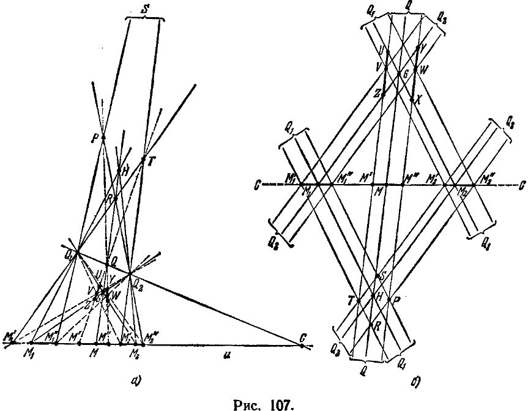
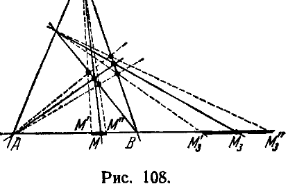
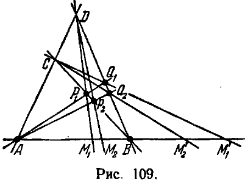

## 4. Разделённость гармонических пар; непрерывность гармонического соответствия

---
**стр. 271**
---

о пределах точечных последовательностей, о непрерывности заданных на проективной прямой функций и т. д., в общем о всей совокупности фактов, называемых топологическими.

В ближайших же разделах эта возможность будет использована.

**§ 92.** Для дальнейшего существенно доказать, что *диагональные точки полного четырехвершинника не лежат на одной прямой.*

Пусть $ABCD$ — полный четырехвершинник с диагональными точками $P, Q, R$ (обозначения соответствуют рис. 93). Нужно показать, что прямая $PQ$ не проходит через $R$. Произведем разрез плоскости по прямой $PQ$ (т. е. исключим прямую $PQ$); в множестве оставшихся элементов установим отношения порядка так, как это делалось в § 90. При этом будут соблюдены аксиомы элементарной геометрии I, II.

В смысле установленных отношений порядка точка $D$ лежит с той же стороны от прямой $AB$, с какой лежит точка $C$, и с той же стороны от прямой $AC$, с какой лежит точка $B$.

Следовательно, точка $D$ лежит внутри $\angle BAC$. Отсюда и по теореме 11а § 16 главы II заключаем, что прямая $AD$ пересекает прямую $BC$, т. е. существует общая точка этих прямых. Значит, точка $R$ при разрезе не исключена, тем самым утверждение доказано.

Отсюда имеем следствие:

*Если $P, Q, S$ — три различные точки одной прямой и $T$ — четвертая гармоническая к ним, то все четыре точки $P, Q, S, T$ различны.*

Из рис. 94, где изображено построение взаимно гармонических пар $P, Q$ и $S, T$, легко усмотреть следующую, с наглядной точки зрения вполне очевидную, теорему.

**Теорема 9.** *Взаимно гармонические пары разделяют друг друга.*

Эта теорема в дальнейшем будет играть весьма важную роль. Мы изложим сейчас ее строгое доказательство.

Пусть на прямой $u$ даны две пары взаимно гармонических точек $P, Q$ и $S, T$. Рассмотрим какой-нибудь четырехвершинник $ABCD$, для которого $P, Q$ суть диагональные точки, а $S, T$ лежат на противоположных сторонах $BC$ и $AD$, проходящих через третью диагональную точку $R$ (рис. 94).

Спроектируем точки $P, Q, S, T$ из центра $B$ на прямую $AD$, проекциями их будут соответственно точки $A, D, R, T$. Полученные точки мы вновь спроектируем на прямую $u$, но на этот раз в качестве центра проекций выберем точку $C$. Проекциями точек $A, D, R, T$ будут соответственно точки $Q, P, S, T$.

---
**стр. 272**
---

Таким образом, после двух проектирований группа $PQST$ отображается на себя, но отдельные ее точки переставляются местами так, как показывает схема $\begin{pmatrix} PQST \\ QPST \end{pmatrix}$, где под каждой точкой записана та, в которую она переходит при отображении.

Заметим теперь, что четыре точки $P, Q, S, T$ можно распределить в две пары лишь тремя способами: 1) $(PQ), (ST)$, 2) $(PS), (QT)$ и 3) $(PT), (QS)$. Легко видеть, что пары $(PS)$ и $(QT)$ не могут разделять друг друга. В самом деле, если это — разделенные пары, то по аксиоме II,6 должны быть разделенными пары $(QS)$ и $(PT)$, так как они получаются из пар $(PS)$ и $(QT)$ в результате двух проектирований. Следовательно, в этом случае и второй и третий из трех возможных способов распределения точек $PQST$ на пары дают пары, разделяющие друг друга. Но это противоречит аксиоме II,3, согласно которой из четырех точек можно составить разделенные пары лишь одним способом.

Точно так же, если бы мы предположили, что разделенными являются пары $(PT)$ и $(QS)$, то должны были бы прийти к заключению, что и пары $(PS)$ и $(QT)$ друг друга разделяют, и, таким образом, снова имели бы противоречие. Так как по аксиоме II,3 один из трех способов составления пар из четырех точек обязательно приводит к разделенным парам, то, следовательно, разделенными будут именно пары $(PQ)$ и $(ST)$. Теорема доказана.

Эту теорему полезно формулировать еще следующим образом: если пара $M, M'$ гармонически сопряжена с парой $A, B$, то точки $M$ и $M'$ находятся в разных взаимно дополнительных отрезках, определяемых точками $A, B$. Если точки $A, B$ фиксированы, то $M'$ зависит только от $M$; это обстоятельство мы выразим символической записью $M' = f(M)$. Так как $MM'AB$ и $M'MAB$ в равной мере являются гармонически расположенными группами точек, то наряду с соотношением $M' = f(M)$ имеет место соотношение $M = f(M')$. Соответствие $M' = f(M)$ называют гармоническим. Очевидно, при гармоническом соответствии взаимно дополнительные отрезки с общими концами $A, B$ взаимно однозначно отображаются друг на друга. Дальше мы изучим это отображение более подробно.

**§ 93.** Рассмотрим на произвольной проективной прямой $u$ какие-нибудь три точки $M_1, M_2, M_3$. Пусть $M$ — четвертая гармоническая к рассматриваемым точкам, именно такая точка, что пара $M, M_3$ гармонически сопряжена с парой $M_1, M_2$. Условимся употреблять символическую запись $M = f(M_1, M_2, M_3)$, считая $M$ функцией трех точек $M_1, M_2, M_3$. Очевидно, $f(M_1, M_2, M_3) = f(M_2, M_1, M_3)$, и если $M = f(M_1, M_2, M_3)$, то $M_3 = f(M_1, M_2, M)$.

Если мы зафиксируем точки $M_1$ и $M_2$, полагая $M_1 = A$, $M_2 = B$, а вместо $M_3$ будем писать $M$, то функция $f(A, B, M)$ совпадает

---
**стр. 273**
---

с функцией $f(M)$, рассмотренной в конце предыдущего параграфа.

Имеет место следующая важная теорема.

**Теорема 10.** *Функция $M = f(M_1, M_2, M_3)$ непрерывна при всех положениях точек $M_1, M_2, M_3$.*

В соответствии с тем, как мы определили в § 91 окрестности точек проективной прямой, эту теорему можно формулировать еще следующим образом: каковы бы ни были точки $M_1, M_2, M_3$ и каким бы ни был открытый отрезок $\Delta$, содержащий точку $M$, всегда могут быть указаны такие открытые отрезки $\Delta_1, \Delta_2, \Delta_3$, содержащие соответственно точки $M_1, M_2, M_3$, что если эти точки, изменяясь, остаются внутри отрезков $\Delta_1, \Delta_2, \Delta_3$, то точка $M$, изменяя свое положение, не выходит из пределов отрезка $\Delta$.

Таким образом, доказательство теоремы 10 должно носить чисто конструктивный характер, поскольку оно сводится к построению отрезков $\Delta_1, \Delta_2, \Delta_3$ по данному отрезку $\Delta$. Мы продемонстрируем доказательство лишь в двух частных случаях, которые только и понадобятся нам в дальнейшем, именно: 1) когда третий аргумент функции $f(M_1, M_2, M_3)$ является фиксированной точкой $M_3 = C$; 2) когда первые два аргумента функции $f(M_1, M_2, M_3)$ являются фиксированными точками $M_1 = A$, $M_2 = B$.

В первом случае мы имеем функцию двух аргументов $M = f(M_1, M_2, C)$. Пусть даны определенные положения точек $M_1$ и $M_2$. Построение соответствующей им точки $M$ изображено на рис. 107, а), где $Q_1, Q_2, G, H$ — четырехвершинник с диагональными точками $M_1, M_2, Q$, одна сторона которого $Q_1 Q_2$ проходит через $C$, другая $HG$ — через $M$.

Предположим, что проективная плоскость разрезана вдоль прямой $Q_1 Q_2$. Тогда, рассматривая какой-нибудь отрезок, концы которого нам известны, мы не будем иметь необходимости указывать, какой именно из двух взаимно дополнительных отрезков с данными концами мы имеем в виду, так как на разрезанной проективной плоскости каждые две точки определяют отрезок однозначно.

На рис. 107, б) изображено то же построение и с теми же обозначениями, но прямая $Q_1 Q_2$ наглядно отброшена в бесконечность; на этом чертеже прямые, идущие в точку $Q_1$ (или в точку $Q_2$, или в точку $Q$), параллельны, точка $M$ — середина отрезка $M_1 M_2$. За дальнейшими рассуждениями легче следить по рис. 107, б).

Представим себе, что точки $M_1$ и $M_2$ изменяют свое положение на прямой $u$. Так как точка $C$ при этом остается неизменной, то мы можем для построения точки $M$ всегда употреблять четырехвершинники с постоянными вершинами $Q_1$ и $Q_2$; тогда диагональная точка $Q$ также будет оставаться постоянной, так как она является четвертой гармонической к трем неизменяющимся точкам $Q_1, Q_2, C$, в чем легко убедиться.

---
**стр. 274**
---

Если точка $M_1$, перемещаясь, остается внутри некоторого отрезка $M'_1 M''_1$, а $M_2$, перемещаясь независимо от $M_1$, остается внутри отрезка $M'_2 M''_2$, то переменная вершина $H$ четырехвершинника, с помощью которого мы по данным $M_1, M_2, C$ строим точку $M$, перемещаясь, остается внутри четырехугольника $PSTR$. Проекция точки $H$ из точки $Q$ на прямую $u$ как раз и есть точка $M$. Когда точки $M_1$ и $M_2$ занимают крайние положения $M'_1$ и $M'_2$,

точка $H$ совмещается с точкой $T$, а $M$ попадает в некоторую точку $M'$; когда $M_1$ и $M_2$ занимают крайние положения $M''_1$ и $M''_2$, точка $H$ совмещается с точкой $P$, а $M$ попадает в точку $M''$. При всех остальных положениях точек $M_1$ и $M_2$ точка $M$ остается между $M'$ и $M''$.

Теперь легко сообразить, как по наперед назначенной окрестности $\Delta = M' M''$ точки $M$ построить такие окрестности $\Delta_1$ и $\Delta_2$ точек $M_1$ и $M_2$, что при изменении этих точек принадлежность их соответственно окрестностям $\Delta_1$ и $\Delta_2$ обеспечивает принадлежность точки $M$ окрестности $\Delta$. Для этого нужно поступить таким образом: спроектировать точки $M'$ и $M''$ из точки $Q$; на проектирующих лучах отметить отрезки $ZU$ и $XY$, вырезаемые прямыми $Q_1 M_2$ и $Q_2 M_1$; внутри отрезка $ZU$ взять произвольную точку $V$,

---
**стр. 275**
---

внутри отрезка $XY$ — произвольную точку $W$. Проекциями точек $V, W$ из $Q_2$ на прямую $u$ будут точки $M'_1, M''_1$, ограничивающие отрезок $\Delta_1 = M'_1 M''_1$; проекциями этих же точек $V, W$ из $Q_1$ будут точки $M'_2, M''_2$, ограничивающие отрезок $\Delta_2 = M'_2 M''_2$.

Построенные отрезки $\Delta_1$ и $\Delta_2$ являются искомыми окрестностями точек $M_1$ и $M_2$, т. е. если $M_1$ и $M_2$ меняют свое положение, но остаются соответственно внутри $\Delta_1$ и $\Delta_2$, то $M = f(M_1, M_2, C)$ меняет свое положение, но остается внутри $\Delta$. Так как окрестности $\Delta_1$ и $\Delta_2$, обладающие этим свойством, могут быть построены при любом задании точек $M_1, M_2$ и окрестности $\Delta$, то, следовательно, функция $M = f(M_1, M_2, C)$ непрерывна при любых положениях точек $M_1$ и $M_2$ на проективной прямой $u$.

Обращаясь к другому частному случаю, который мы хотели рассмотреть, именно, когда в соотношении $M = f(M_1, M_2, M_3)$ зафиксированы $M_1 = A$ и $M_2 = B$, мы ограничимся ссылкой на рис. 108; из этого чертежа без всяких объяснений видно, как по данной окрестности $\Delta = M' M''$ точки $M$ построить окрестность $\Delta_3 = M'_3 M''_3$ точки $M_3$ такую, что при изменении $M_3$, пока она остается внутри $\Delta_3$, точка $M$ остается внутри $\Delta$. Возможность этого построения означает непрерывность функции $M = f(A, B, M_3)$.

Останавливаться на доказательстве непрерывности функции $M = f(M_1, M_2, M_3)$ по всей совокупности ее аргументов мы не будем, так как теорема 10 в ее общей формулировке нам не понадобится.

Напротив, функцию одного аргумента $M' = f(A, B, M)$ мы изучим еще с другой точки зрения.

Пусть на прямой $u$ введен некоторый циклический порядок так, что множество точек одного из отрезков с концами $A, B$ упорядочено по направлению от $A$ к $B$, а множество точек дополнительного к нему отрезка упорядочено по направлению от $B$ к $A$. Условимся обозначать через $AB$ первый из этих двух отрезков.

Если точка $M$ находится внутри отрезка $AB$, то согласно теореме 9 точка $M' = f(A, B, M)$ должна находиться на отрезке, дополнительном к $AB$. Обозначим через $M_1$ и $M_2$ два произвольных положения переменной точки $M$ внутри $AB$, через $M'_1$ и $M'_2$ — соответствующие положения точки $M'$. Мы покажем сейчас, что всякий раз, когда точка $M_1$ на отрезке $AB$ предшествует точке $M_2$, точка

---
**стр. 276**
---

$M'_1$ на отрезке, дополнительном к $AB$, следует за точкой $M'_2$ (рис. 109).

Для доказательства построим полные четырехвершинники $CDP_1Q_1$ и $CDP_2Q_2$ с общими диагональными точками $A, B$ так, чтобы противоположные стороны $DP_1$ и $CQ_1$ первого из них проходили через $M_1$ и $M'_1$, противоположные стороны $DP_2$ и $CQ_2$ второго — через $M_2$ и $M'_2$. Спроектируем группу точек $ABM_1M_2$ из центра $D$ на прямую $CB$. Мы получим в качестве проекций группу точек $CBP_1P_2$. Эту группу будем проектировать из центра $A$ на прямую $DB$. Группа точек $CBP_1P_2$ при этом отобразится в $DBQ_1Q_2$. Проектируя, наконец, группу точек $DBQ_1Q_2$ из центра $C$ на прямую $u$, найдем в проекции группу $ABM'_1M'_2$. Таким образом, после ряда проектирований точки $ABM_1M_2$ переходят соответственно в $ABM'_1M'_2$.

Если в установленном на отрезке $AB$ порядке следования его точек $M_1$ предшествует $M_2$, то, по определению этого порядка, пара $A, M_2$ разделяет пару $M_1, B$. В силу инвариантности свойства разделенности двух пар при проектированиях (см. аксиому II,6), пара $B, M'_1$ должна разделять пару $A, M'_2$. А это и означает, что если множество точек отрезка, дополнительного к $AB$, упорядочить по направлению от $B$ к $A$, то в этом порядке $M'_1$ следует за $M'_2$.

Полученный результат наглядно можно описать такими словами: в том случае, когда переменная точка $M$ пробегает отрезок $AB$ в направлении от $A$ к $B$, гармонически соответствующая ей точка $M'$ пробегает дополнительный к $AB$ отрезок в противоположном направлении, т. е. также от $A$ к $B$.

Если на отрезке $AB$ дана группа точек $M_1, M_2, \dots, M_n$, расположенных так, что каждая точка с меньшим номером предшествует каждой точке с бо́льшим номером, то на отрезке, дополнительном к $AB$, точкам этой группы будут соответствовать точки $M'_1, M'_2, \dots, M'_n$, расположенные так, что каждая точка с меньшим номером следует за каждой точкой с бо́льшим номером.

Такое отображение одного направленного отрезка на другой (тоже направленный), при котором порядок точек любой упорядоченной группы либо всегда сохраняется, либо всегда переходит в противоположный, называется *упорядоченным* (*соответственно — прямым или обратным*).

Употребляя эту терминологию и принимая во внимание все изложенное до сих пор, мы можем сформулировать следующую теорему.
