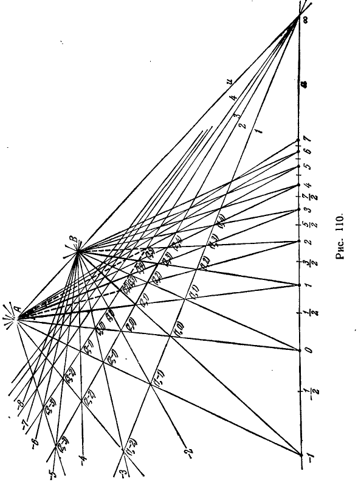

## 5. Аксиома непрерывности. Проективная система координат на прямой

---
**стр. 277**
---

**Теорема 11.** *Гармоническое отображение $M' = f(A, B, M)$ отрезка $AB$ на дополнительный к нему отрезок является непрерывным и обратно упорядоченным.*

**Замечание.** До сих пор мы предполагали точки гармонической группы различными и определение четвертой гармонической точки к трем данным было дано нами лишь для того случая, когда данные точки различны. Поэтому в теореме 10 случай совпадения аргументов $M_1, M_2, M_3$ функции $M = f(M_1, M_2, M_3)$, строго говоря, должен быть выделен для специального рассмотрения, как особый.

Не задерживаясь на этом вопросе для функции $M = f(M_1, M_2, M_3)$, мы рассмотрим функцию $M' = f(A, B, M)$ при $M = A$ и $M = B$.

Пусть $AB$ обозначает один из двух отрезков, определяемых на проективной прямой точками $A$ и $B$. Из теоремы 11 следует, что если $M$, оставаясь внутри $AB$, монотонно приближается к точке $A$, то $M'$, приближаясь к точке $A$ навстречу $M$, остается внутри отрезка, дополнительного к $AB$. Поэтому, если мы желаем определить функцию $M' = f(A, B, M)$ при $M = A$ так, чтобы она при этом положении $M$ оказалась непрерывной, то должны положить при $M = A$ также и $M' = A$, т. е. должны считать $f(A, B, A) = A$. Аналогично $f(A, B, B) = B$.

В отображении проективной прямой на себя, при котором точке $M$ соответствует точка $M' = f(A, B, M)$, точки $A$ и $B$ соответствуют сами себе. Они называются *двойными* (или *фиксированными*, или *неподвижными*) точками гармонического отображения.

**5. Аксиома непрерывности. Проективная система координат на прямой**

**§ 94.** Мы подходим к весьма ответственному пункту изложения проективной геометрии — установлению принципа определения точек проективного пространства при помощи координат.

В евклидовой геометрии координаты точек определяются весьма просто при помощи измерений. В проективной геометрии, где нет аксиом конгруэнтности, конструирование системы координат требует некоторых ухищрений. Мы изложим этот вопрос, следуя методу Ф. Клейна.

Нам понадобится, кроме рассмотренных выше двух групп проективных аксиом — связи и порядка, еще аксиома непрерывности (Дедекинда), являющаяся единственной аксиомой третьей группы. Чтобы удобнее было ее формулировать, мы введем надлежащую терминологию.

Представим себе, что проективное пространство разрезано вдоль некоторой плоскости, которая условно считается бесконечно

---
**стр. 278**
---

удалённой. Тогда в множестве точек каждой конечной прямой (т. е. прямой, не лежащей в бесконечно удалённой плоскости) может быть введено соотношение, выражаемое словом «между» (см. § 90). Именно, если $O_\infty$ — бесконечно удалённая точка некоторой конечной прямой $a$, $A$, $B$, $C$ — три другие её точки, то точка $C$ считается расположенной на прямой $a$ между точками $A$ и $B$, если пара $C$, $O_\infty$ разделяет пару $A$, $B$. Тогда, как нам известно, по отношению к конечным элементам пространства будут удовлетворены все требования первых двух групп аксиом Гильберта. Опираясь на указанные аксиомы, мы можем множество конечных точек прямой упорядочить так, что всякий раз, когда точка $C$ следует за некоторой точкой $A$ и предшествует точке $B$, она оказывается расположенной между $A$ и $B$ в том смысле, как это сейчас было определено. С соблюдением этого требования множество конечных точек прямой может быть упорядочено лишь двумя различными способами, причём вводимые при этом порядки являются обратными друг другу (см. § 14). Условимся каждый из них называть линейным порядком на проективной прямой, разрезанной в бесконечно удалённой точке.

Теперь мы можем сформулировать аксиому непрерывности, единственную в третьей группе и последнюю в проективной аксиоматике вообще.

**Г р у п п а III. А к с и о м а н е п р е р ы в н о с т и (Д е д е к и н д а).**

**III.** *Пусть $a$ — произвольная проективная прямая, разрезанная в некоторой точке $O_\infty$. Если множество остальных точек этой прямой разбито на два класса так, что: 1) каждая точка попадает в один и только в один класс, 2) каждый класс содержит точки; 3) каждая точка первого класса в одном из двух линейных порядков на прямой $a$ предшествует каждой точке второго класса, — то либо в первом классе существует точка, следующая за всеми точками этого класса, либо во втором классе существует точка, предшествующая всем остальным его точкам.*

Более коротко эту аксиому мы выразим такими словами:

*В каждом дедекиндовом сечении упорядоченного множества точек разрезанной проективной прямой точно один из двух классов имеет замыкающий элемент.*

**§ 95.** На ближайших страницах показывается, как можно ввести координатную систему на проективной прямой.

Пусть даны произвольная проективная прямая $a$ и на ней три точки, из которых две помечены числами 0 и 1, а третья — знаком $\infty$ (рис. 110). Будем называть точку $\infty$ бесконечно удалённой, остальные точки прямой $a$ — конечными. Условимся представлять себе прямую $a$ разрезанной в точке $\infty$ и введём на этой прямой линейный порядок таким образом, чтобы точка 0 предшествовала

---
**стр. 279**
---

---
**стр. 280**
---

точке 1. Далее пометим числом 2 точку, которая вместе с точкой 0 составляет пару, гармонически сопряжённую с парой 1, $\infty$. По теореме 9, пара 0, 2 разделяет пару 1, $\infty$. Поэтому в линейном порядке на разрезанной прямой $a$ точка 1 лежит между 0 и 2; иначе говоря, точка 2 следует за точками 0 и 1. Затем, пометим числом 3 точку, которая вместе с точкой 1 составляет пару, гармонически сопряжённую с парой 2, $\infty$; числом 4 — точку, которая вместе с точкой 2 составляет пару, гармонически сопряжённую с парой 3, $\infty$, и т. д. Так у нас появится бесконечная последовательность точек, помеченных числами 0, 1, 2, 3, 4, ... Очевидно, в этой последовательности точка $p$ при любом $p \ge 1$ следует за каждой из точек 0, 1, 2, ..., $p-1$.

После этого пометим числом $-1$ точку, которая вместе с точкой 1 составляет пару, гармонически сопряжённую с парой 0, $\infty$; числом $-2$ точку, которая вместе с точкой 0 составляет пару, гармонически сопряжённую с парой $-1$, $\infty$, и т. д. В общем итоге мы получим точки ..., $-m$, $-m+1$, ..., $-3$, $-2$, $-1$, 0, 1, 2, 3, 4, ..., $n$, ..., которые в имеющемся на разрезанной прямой $a$ линейном порядке следуют друг за другом. Эти точки мы будем называть целочисленными точками проективной шкалы.

Чтобы удобнее выполнить фактическое их построение, мы поступим следующим образом.

Проведём через точку $\infty$ прямой $a$ две произвольные прямые, одну из которых пометим числом 1, другую — буквой $u$; на прямой $u$ выберем какую-нибудь точку $A$ (рис. 110). Проведём также прямые $A0$ и $A1$, соединяющие точку $A$ с точками 0 и 1. Эти прямые в пересечении с прямой 1 определят две точки, которые мы обозначим соответственно через $(1, 0)$ и $(1, 1)$. Далее, проводя через точки 0 и $(1, 1)$ прямую, мы найдём точку $B$, в которой эта прямая пересекает прямую $u$. После этого, проводя через точки $B$ и 1 прямую, определим на прямой 1 точку $(1, 2)$, а проектируя её из точки $A$ на прямую $a$, получим точку, которую мы условились выше помечать числом 2, так как именно эта точка вместе с точкой 0 составляет пару, гармонически сопряжённую с парой 1, $\infty$. Чтобы убедиться в этом, достаточно рассмотреть полный четырехвершинник с вершинами $A$, $B$, $(1, 1)$ и $(1, 2)$: точки 1 и $\infty$ являются диагональными точками этого четырехвершинника, а точки 0 и 2 лежат на двух его противоположных сторонах; но это и означает гармоническую сопряжённость пар 0, 2 и 1, $\infty$. После того как точка 2 уже построена, проектируя её из точки $B$ на прямую 1, мы получим точку $(1, 3)$, а проектируя последнюю из точки $A$ на прямую $a$, получим точку 3; после того как точка 3 построена, проектируя её из точки $B$ на прямую 1, мы получим точку $(1, 4)$, а проектируя эту точку из точки $A$ на прямую $a$, получим точку 4 и т. д.

---
**стр. 281**
---

Так же могут быть получены целочисленные точки, помеченные отрицательными числами. Например, проектируя точку $(1, 0)$ из точки $B$, мы получим на прямой $a$ точку $-1$; проектируя эту точку из $A$ на прямую 1, получим точку $(1, -1)$, а проектируя последнюю из точки $B$, получим на прямой $a$ точку $-2$ и т. д.

По построению, две прямые, из которых одна соединяет точку $B$ с некоторой целочисленной точкой $n$, а другая соединяет $A$ с целочисленной точкой $n+1$, при любом $n$ пересекаются на прямой 1.

Наряду с этим можно доказать, что две прямые, из которых одна соединяет точку $B$ с некоторой целочисленной точкой $n$, а другая соединяет $A$ с целочисленной точкой $n+2$, при любом $n$ также пересекаются на одной определённой прямой. Эта прямая у нас на рис. 110 помечена числом 2, а расположенные на ней точки попарного пересечения указанных прямых обозначены через ..., $(2, -3)$, $(2, -2)$, $(2, -1)$, $(2, 0)$, $(2, 1)$, $(2, 2)$, ...

Точно так же две прямые, из которых одна соединяет точку $B$ с точкой $n$, а другая — точку $A$ с точкой $n+3$, при любом $n$ пересекаются на определённой прямой 3; на этой прямой, таким образом, появляется система точек ..., $(3, -3)$, $(3, -2)$, $(3, -1)$, $(3, 0)$, $(3, 1)$, $(3, 2)$, ...

Две прямые, из которых одна соединяет точку $B$ с точкой $n$, а другая — точку $A$ с точкой $n+4$, при любом $n$ пересекаются на определённой прямой 4 и т. д.

Доказательство этих утверждений достаточно будет провести для системы точек ..., $(2, -3)$, $(2, -2)$, $(2, -1)$, $(2, 0)$, $(2, 1)$, ... После этого распространение его на дальнейшие системы точек усматривается непосредственно.

Итак, мы докажем, что точки ..., $(2, -3)$, $(2, -2)$, $(2, -1)$, $(2, 0)$, $(2, 1)$, $(2, 2)$, ... лежат на одной прямой.

С этой целью мы прежде всего заметим, что при любом $n$ пара точек $A$, $(1, n)$ гармонически сопряжена с парой точек $(2, n)$, $n$.

Действительно, эти пары получаются проектированием из точки $B$ двух взаимно гармонических (по построению) пар $\infty$, $n-1$ и $n-2$, $n$ прямой $a$ и, следовательно, по теореме 6 § 86, сами гармонически сопряжены друг с другом.

Пометим числом 2 прямую, которая идёт из точки $\infty$ в точку $(2, 0)$. Как мы видим, две пары лучей $u$, 1 и 2, $a$, исходящих из точки $\infty$, проектируют две гармонически сопряжённые пары точек $A$, $(1, 0)$ и $(2, 0)$, 0. Поэтому указанные лучи в пересечении с любой прямой определяют на ней две гармонически сопряжённые пары точек (см. § 86, теорема 6).

В частности, прямая, соединяющая точки $A$ и $n$, пересекает лучи $u$, 1 и $a$ в трёх точках $A$, $(1, n)$ и $n$, а луч 2 — в точке,

---
**стр. 282**
---

которая должна быть четвёртой гармонической к трём указанным. Но таковой, как мы видели, является точка $(2, n)$. А так как четвёртая гармоническая к трём данным точкам определяется единственным образом, то, следовательно, точка $(2, n)$ при любом $n$ лежит на прямой 2.

После того, как доказано, что точки ..., $(2, -3)$, $(2, -2)$, $(2, -1)$, $(2, 0)$, $(2, 1)$, $(2, 2)$, ... лежат на одной прямой, легко показать, что точки ..., $(3, -3)$, $(3, -2)$, $(3, -1)$, $(3, 0)$, $(3, 1)$, $(3, 2)$, ... также лежат на одной прямой. Для этого следует прежде всего заметить, что пара $A$, $(2, n)$ при любом $n$ гармонически сопряжена с парой $(3, n)$, $(1, n)$. После этого, пользуясь прямолинейным расположением каждой из двух систем точек ..., $(1, -2)$, $(1, -1)$, $(1, 0)$, $(1, 1)$, $(1, 2)$, ... и ..., $(2, -2)$, $(2, -1)$, $(2, 0)$, $(2, 1)$, $(2, 2)$, ..., можно доказать прямолинейность расположения системы точек ..., $(3, -2)$, $(3, -1)$, $(3, 0)$, $(3, 1)$, $(3, 2)$, ... по точной аналогии с предыдущим рассуждением. Точно так же может быть доказано, что точки ..., $(4, -2)$, $(4, -1)$, $(4, 0)$, $(4, 1)$, $(4, 2)$, ... лежат на одной прямой, и т. д. Теперь у нас есть возможность доказать следующую вспомогательную теорему, весьма важную в дальнейшем изложении:

**Теорема А.** *Если $x$ и $y$ — целые числа и $z = \frac{x+y}{2}$ — тоже целое число, то целочисленная точка $z$ вместе с точкой $\infty$ составляет пару, гармонически разделяющую пару целочисленных точек $x$ и $y$.*

Точку, которая вместе с точкой $\infty$ составляет пару, гармонически разделяющую на прямой $a$ пару данных точек $P$ и $Q$, условимся называть *проективным центром* отрезка $PQ$ (проективный центр, конечно, зависит от выбора точки $\infty$). Тогда только что сформулированную теорему можно будет высказать такими словами:

*Если $x$, $y$ и $z = \frac{x+y}{2}$ — целые числа, то целочисленная точка $z$ является проективным центром отрезка, определяемого целочисленными точками $x$ и $y$.*

Доказывая эту теорему, мы предположим для определённости, что $y > x$. Из условия следует, что разность $y - x$ есть чётное число. В случае $y - x = 2$ утверждение теоремы, очевидно, правильно, так как то обстоятельство, что при $y - x = 2$ точка $\frac{x+y}{2}$ является проективным центром отрезка $xy$, положено нами в основу определения проективной шкалы. Именно на этом свойстве основана конструкция, представленная рис. 110, где можно видеть, что прямая, соединяющая точку $A$ с точкой $y$, и прямая, соединяющая точку $B$ с точкой $x$, в пересечении с прямой 1 определяют две точки, которые вместе с точками $A$ и $B$ являются вер-

---
**стр. 283**
---

шинами четырехвершинника, обладающего диагональными точками $\frac{x+y}{2}$ и $\infty$ и парой противоположных сторон, проходящих через точки $x$ и $y$. А это и означает, что точка $\frac{x+y}{2}$ есть проективный центр отрезка $xy$. Подобным же способом можно проверить теорему в случае $y - x = 4$, $y - x = 6$ и т. д.

Пусть, например, $y - x = 4$. Рассмотрим прямую, соединяющую точку $A$ с точкой $y$, прямую, соединяющую точку $B$ с точкой $x$, и точки пересечения рассматриваемых прямых с прямой 2. Эти точки вместе с точками $A$ и $B$ являются вершинами четырехвершинника, обладающего диагональными точками $\frac{x+y}{2}$ и $\infty$ и парой противоположных сторон, проходящих через точки $x$ и $y$. А это и означает, что точка $\frac{x+y}{2}$ есть проективный центр отрезка $xy$. На рис. 110 жирной линией показан четырехвершинник, при рассмотрении которого можно увидеть, что точка $1 = \frac{3 + (-1)}{2}$ является проективным центром отрезка с концами $3$ и $-1$; в этом случае как раз $y - x = 3 - (-1) = 4$.

Если $y - x = 6$, то проверка утверждения теоремы производится таким же способом, только на помощь приходится привлекать прямую 3, при $y - x = 8$ — прямую 4 и т. д.

На рис. 110 жирным пунктиром показан четырехвершинник, из рассмотрения которого можно видеть, что точка $2 = \frac{5 + (-1)}{2}$ есть проективный центр отрезка с концами $5$ и $-1$; в этом случае $y - x = 5 - (-1) = 6$.

До сих пор мы имели дело только с целочисленными точками. Сейчас мы будем «сгущать» проективную шкалу, дополняя её новыми точками, обладающими дробными пометками.

Построим прежде всего проективный центр отрезка $(0, 1)$ и пометим его числом $\frac{1}{2}$. После этого, отправляясь от трёх точек $0$, $\frac{1}{2}$ и $\infty$, построим проективную шкалу точно так же, как мы строили проективную шкалу, отправляясь от точек $0$, $1$, $\infty$. Мы получим систему точек, играющих в новой шкале роль целочисленных; мы пометим их числами: ..., $-\frac{4}{2}$, $-\frac{3}{2}$, $-\frac{2}{2}$, $-\frac{1}{2}$, $0$, $\frac{1}{2}$, $\frac{2}{2}$, $\frac{3}{2}$, $\frac{4}{2}$, ... Нетрудно сообразить, что все точки вида ..., $-\frac{4}{2}$, $-\frac{2}{2}$, $0$, $\frac{2}{2}$, $\frac{4}{2}$, ... новой шкалы совпадают соответственно с точками ..., $-2$, $-1$, $0$, $1$, $2$, ... старой. В самом деле,
