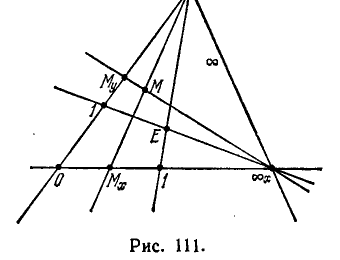
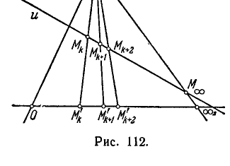
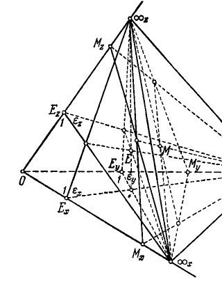
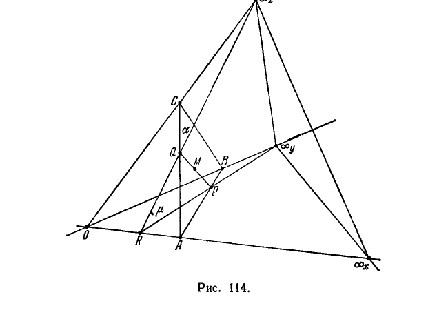

## 6. Проективная система координат на плоскости и в пространстве

---
**стр. 291**
---

**§ 98.** Пусть на произвольной проективной плоскости дана некоторая прямая. Обозначим ее символом $\infty$, условимся называть бесконечно удаленной и будем представлять себе, что проективная плоскость разрезана вдоль этой прямой.

Мы укажем сейчас определенный способ, по которому с точками разрезанной проективной плоскости можно взаимно однозначно сопоставить пары вещественных чисел. Эти числа мы будем называть проективными координатами соответствующих точек.

Проективная система координат определяется заданием следующих геометрических элементов: какой-либо точки $O$, которую мы назовем началом координатной системы, двух прямых, проходящих через $O$, одну из которых мы назовем осью $x$, другую — осью $y$, и еще точки $E$, не принадлежащей ни одной из осей.

Пусть $\infty_x$ и $\infty_y$ — бесконечно удаленные точки осей $x$ и $y$, т. е. точки их пересечения с прямой $\infty$ (рис. 111). Спроектируем точку $E$ из $\infty_y$ на ось $x$ и из $\infty_x$ на ось $y$. Каждую из полученных проекций заметим числом $1$. После этого введем на оси $x$ линейную систему проективных координат, определяемую тремя точками $O, 1, \infty_x$ так, как это мы делали в предыдущем разделе, аналогично введем координатную систему на оси $y$, определяя ее точками $O, 1, \infty_y$.

Рассмотрим теперь точку $M$, произвольно расположенную на разрезанной проективной плоскости. Обозначим через $M_x$ проекцию точки $M$ из $\infty_y$ на ось $x$ и через $M_y$ — проекцию этой же точки $M$ из $\infty_x$ на ось $y$. Точка $M_x$ в линейной системе координат на оси $x$ имеет некоторую координату $x$, и точно так же точка $M_y$ на оси $y$ имеет координату $y$. Числа $x$ и $y$ мы будем называть проективными координатами точки $M$ на плоскости.

Очевидно, каждая точка оси $x$ имеет координаты вида $(x, 0)$, каждая точка оси $y$ имеет координаты вида $(0, y)$; координаты точки $O$ суть $(0, 0)$. Точка $E$ имеет обе координаты, равные $1$; поэтому ее иногда называют «точкой единиц».

---
**стр. 292**
---

Мы приступим сейчас к доказательству основного свойства проективных координат, формулируемого следующей теоремой.

**Теорема 12.** *В проективных координатах каждая прямая определяется алгебраическим уравнением первой степени.*

**Доказательство.** Пусть дана некоторая прямая $u$; возьмем на ней две произвольные точки $M_0$ и $M_1$ и обозначим через $M_\infty$ бесконечно удаленную точку прямой $u$ (т. е. точку пересечения прямой $u$ с прямой $\infty$). По трем точкам $M_0, M_1$ и $M_\infty$ мы построим на прямой $u$ проективную шкалу (в точности так, как мы строили ее в предыдущем разделе, отправляясь от точек $0, 1, \infty$) с целочисленными точками $\dots, M_{-2}, M_{-1}, M_0, M_1, M_2, M_3, \dots$ Рассмотрим три соседние точки $M_k, M_{k+1}, M_{k+2}$ и точку $M_\infty$ (рис. 112). По основному свойству проективной шкалы точка $M_{k+1}$ должна быть проективным центром отрезка $M_k M_{k+2}$, т. е. пара $M_k, M_{k+2}$ должна гармонически разделяться парой $M_{k+1}, M_\infty$. Проектируя указанные четыре точки из $\infty_y$ на ось $x$, мы получим в качестве проекций точки $M'_k, M'_{k+1}, M'_{k+2}, \infty_x$. Так как свойство гармонической сопряженности инвариантно относительно проектирований, то пара $M'_k, M'_{k+2}$ гармонически разделяется парой $M'_{k+1}, \infty_x$. Иначе говоря, точка $M'_{k+1}$ есть проективный центр отрезка $M'_k M'_{k+2}$. Поэтому между координатами точек $M_k, M_{k+1}, M_{k+2}$ имеет место соотношение

$$\frac{x_k + x_{k+2}}{2} = x_{k+1}. \quad (*)$$

Аналогично

$$\frac{y_k + y_{k+2}}{2} = y_{k+1}. \quad (**)$$

Пусть теперь $M$ — произвольная точка плоскости с координатами $x, y$ и $L(M) = Ax + By$ — линейная функция этой точки. Подберем числа $A, B, C$ так, чтобы выполнялись равенства:

$$\left. \begin{aligned} L(M_0) + C = Ax_0 + By_0 + C = 0, \\ L(M_1) + C = Ax_1 + By_1 + C = 0. \end{aligned} \right\} \quad (***)$$

Из соотношений (*) и (**) находим:

$$L(M_k) + L(M_{k+2}) - 2L(M_{k+1}) = 0.$$

---
**стр. 293**
---

Следовательно, если $L(M_k) + C = 0$ и $L(M_{k+1}) + C = 0$, то $L(M_{k+2}) + C = 0$. На основании этого и вследствие равенств (***) мы получаем для любой целочисленной точки $M_n$:

$$L(M_n) + C = Ax_n + By_n + C = 0.$$

Таким образом, координаты всех целочисленных точек прямой $u$ удовлетворяют уравнению первой степени

$$Ax + By + C = 0.$$

Нетрудно сообразить, что этому уравнению удовлетворяют координаты не только целочисленных, но и всех двоично-рациональных точек. В самом деле, двоично-рациональные точки мы вводили в свое время при помощи последовательного «сгущения» проективной шкалы; условимся называть «первым сгущением» шкалы совокупность всех целочисленных точек вместе с проективными центрами определяемых ими отрезков, «вторым сгущением» — совокупность всех точек «первого сгущения» вместе с проективными центрами определяемых ими отрезков и т. д.

Если точка $M_{k+\frac{1}{2}}$ есть проективный центр отрезка $M_k M_{k+1}$, то для ее координат имеют место равенства

$$x_{k+\frac{1}{2}} = \frac{x_k + x_{k+1}}{2}, \quad y_{k+\frac{1}{2}} = \frac{y_k + y_{k+1}}{2},$$

вследствие чего

$$L(M_k) + L(M_{k+1}) - 2L\left(M_{k+\frac{1}{2}}\right) = 0.$$

Поэтому в случае $L(M_k) + C = 0$ и $L(M_{k+1}) + C = 0$ должно быть $L\left(M_{k+\frac{1}{2}}\right) + C = 0$. Таким образом, уравнению $Ax + By + C = 0$ удовлетворяют координаты всех точек первого сгущения; аналогично рассуждая, убедимся, что ему же удовлетворяют координаты всех точек второго сгущения, и т. д. Так как функция $Ax + By + C$ непрерывна и равна нулю в точках множества, всюду плотного на прямой $u$, то эта функция равна нулю вообще во всех точках прямой $u$. Иначе говоря, координаты каждой точки прямой $u$ удовлетворяют уравнению $Ax + By + C = 0$; вместе с тем, очевидно, координатами точек прямой $u$ исчерпываются все пары $(x, y)$ решений этого уравнения. Следовательно, это уравнение есть не иное, как уравнение прямой $u$. Мы видим, что оно представляет собой алгебраическое уравнение первой степени. Наше утверждение доказано.

Наряду с уравнением

$$Ax + By + C = 0,$$

---
**стр. 294**
---

которое мы будем называть *общим уравнением прямой*, мы будем употреблять также следующие специальные его формы:

1) Уравнение, разрешенное относительно одной из координат, например $y$:

$$y = kx + l;$$

оно по внешнему виду тождественно уравнению с угловым коэффициентом, часто употребляемому в аналитической геометрии евклидовой плоскости. Но, конечно, сейчас называть параметр $k$ угловым коэффициентом прямой не следует, так как в проективной геометрии все метрические понятия, в том числе и величина угла, отсутствуют.

2) Уравнение, содержащее координаты $x_0, y_0$ одной из точек прямой:

$$y - y_0 = k (x - x_0).$$

3) Уравнение

$$\frac{x}{a} + \frac{y}{b} = 1;$$

оно по форме записи тождественно с так называемым уравнением «в отрезках», хорошо известным из элементарной аналитической геометрии. Но сейчас мы должны понимать $a$ и $b$ не как длины отрезков, отсекаемых прямой на осях, а как проективные координаты точек пересечения прямой с осями.

**§ 99.** Перейдем к рассмотрению проективных координат в пространстве.

Пусть в проективном пространстве дана некоторая плоскость. Обозначим ее символом $\infty$, условимся называть бесконечно удаленной и будем представлять себе, что пространство разрезано по этой плоскости.

В разрезанном проективном пространстве мы введем координатную систему, задавая какую-нибудь точку $O$, которую будем называть началом системы, три прямые, проходящие через $O$, которые назовем соответственно осью $x$, осью $y$ и осью $z$, и еще точку $E$, не принадлежащую ни одной из трех плоскостей, определяемых попарно взятыми осями (рис. 113).

---
**стр. 295**
---

Пусть $\infty_x, \infty_y, \infty_z$ — бесконечно удаленные точки осей, т. е. точки пересечения этих осей с плоскостью $\infty$. Обозначим через $\varepsilon_x$ плоскость, определяемую точками $E, \infty_y, \infty_z$, через $\varepsilon_y$ — плоскость, определяемую точками $E, \infty_x, \infty_z$ и через $\varepsilon_z$ — плоскость, определяемую точками $E, \infty_x, \infty_y$. Плоскость $\varepsilon_x$ пересечет ось $x$ в некоторой точке $E_x$, плоскость $\varepsilon_y$ пересечет ось $y$ в некоторой точке $E_y$ и плоскость $\varepsilon_z$ пересечет ось $z$ в некоторой точке $E_z$; пометим каждую из полученных точек числом $1$.

После этого введем на оси $x$ линейную систему проективных координат, определяемую тремя точками $O, 1, \infty_x$; аналогично введем координатные системы на оси $y$ и на оси $z$, определяя их соответственно точками $O, 1, \infty_y$ и $O, 1, \infty_z$.

Рассмотрим теперь точку $M$, произвольно расположенную в разрезанном проективном пространстве.

Обозначим через $M_x$ точку пересечения плоскости $M\infty_y\infty_z$ с осью $x$, через $M_y$ — точку пересечения плоскости $M\infty_x\infty_z$ с осью $y$ и через $M_z$ — точку пересечения плоскости $M\infty_x\infty_y$ с осью $z$. Точка $M_x$ в линейной системе координат на оси $x$ имеет некоторую координату $x$, и также точки $M_y$ на оси $y$ и $M_z$ на оси $z$ имеют соответственно координаты $y$ и $z$.

Числа $x, y, z$ мы будем называть *проективными координатами* точки $M$ в пространстве. Теперь мы докажем основное свойство проективных координат, формулируемое следующей теоремой.

**Теорема 13.** *В проективных координатах каждая плоскость определяется алгебраическим уравнением первой степени.*

**Доказательство.** Чтобы облегчить изложение доказательства этой теоремы, мы ограничимся выводом уравнения лишь таких плоскостей, которые не проходят через начало координат или через какую-нибудь из точек $\infty_x, \infty_y, \infty_z$.

Пусть дана некоторая плоскость $\alpha$, пересекающая оси координат в точках $A, B, C$. Если точки $A, B, C$ на координатных осях имеют соответственно координаты $a, b, c$, то при указанном выше ограничении должно быть: $a \neq 0, b \neq 0, c \neq 0$. Мы покажем, что плоскость $\alpha$ имеет уравнение

$$\frac{x}{a} + \frac{y}{b} + \frac{z}{c} = 1. \quad (*)$$

Рассмотрим на плоскости $\alpha$ произвольную точку $M$; пусть $\bar{x}, \bar{y}, \bar{z}$ — ее координаты. Обозначим через $\mu$ плоскость, определяемую точками $M, \infty_y, \infty_z$, через $R$ — точку пересечения плоскости $\mu$ с осью $x$, через $P$ и $Q$ — точки, в которых прямая пересечения плоскостей $\alpha$ и $\mu$ встречает плоскости $Oxy$ и $Oxz$ (рис. 114). Очевидно, прямая $PQ$ содержит точку $M$.

---
**стр. 296**
---

В проективной системе координат на плоскости $R\infty_y\infty_z$ прямая $PQ$ имеет уравнение вида

$$\frac{y}{p} + \frac{z}{q} = 1.$$

Этому уравнению должны удовлетворять координаты $y = \bar{y}$, $z = \bar{z}$, так как точка $M$ принадлежит прямой $PQ$; следовательно, имеем:

$$\frac{\bar{y}}{p} + \frac{\bar{z}}{q} = 1. \quad (**)$$

Определим теперь параметры $p$, $q$. Для этого заметим, что урав-

нение прямой $AB$ в проективных координатах на плоскости $Oxy$ есть

$$\frac{x}{a} + \frac{y}{b} = 1.$$

Но проективными координатами точки $P$ на плоскости $Oxy$ являются числа $\bar{x}$, $p$ (а в пространстве — числа $\bar{x}$, $p$, 0). Поэтому существует соотношение

$$\frac{\bar{x}}{a} + \frac{p}{b} = 1,$$

откуда

$$p = b\left(1 - \frac{\bar{x}}{a}\right).$$

---
**стр. 297**
---

Аналогично из уравнения

$$\frac{x}{a} + \frac{z}{c} = 1,$$

определяющего прямую $AC$ на плоскости $Oxz$, при $\bar{x} = x$, $z = q$ находим:

$$q = c\left(1 - \frac{\bar{x}}{a}\right).$$

При этих значениях $p$ и $q$ равенство (**) дает:

$$\frac{\bar{y}}{b\left(1 - \frac{\bar{x}}{a}\right)} + \frac{\bar{z}}{c\left(1 - \frac{\bar{x}}{a}\right)} = 1$$

или

$$\frac{\bar{x}}{a} + \frac{\bar{y}}{b} + \frac{\bar{z}}{c} = 1.$$

Таким образом, координаты любой точки плоскости $\alpha$ удовлетворяют уравнению (*), и тем самым требуемое доказано *).

*) Мы должны были бы еще доказать, что координаты любой точки, не лежащей на плоскости $\alpha$, не удовлетворяют уравнению (*); но это сразу следует из однозначной разрешимости уравнения (*) относительно каждой координаты.

Специальные виды уравнения плоскости, когда она содержит начало координат или бесконечно удаленные точки осей, мы предоставляем вывести читателю. Все они охватываются общей формой

$$Ax + By + Cz + D = 0.$$

Поскольку плоскость определяется уравнением первой степени, прямая в пространстве может быть задана двумя уравнениями

$$\left. \begin{aligned} A_1x + B_1y + C_1z + D_1 = 0, \\ A_2x + B_2y + C_2z + D_2 = 0. \end{aligned} \right\}$$

Эти уравнения путем алгебраических преобразований можно привести к «каноническому» виду

$$\frac{x - x_0}{m} = \frac{y - y_0}{n} = \frac{z - z_0}{p},$$

где $x_0, y_0, z_0$ — координаты какой-нибудь точки прямой.

**§ 100.** До сих пор мы устраивали координатную систему на разрезанной проективной прямой, на разрезанной проективной плоскости и в разрезанном проективном пространстве. Иначе говоря, когда мы рассматривали проективную прямую, то с точками ее сопоставляли координаты так, что одна точка (которая

---
**стр. 298**
---

обозначалась символом $\infty$) никакой координаты не получала. Когда мы рассматривали проективную плоскость и проективное пространство, то с точками их сопоставляли соответственно пары и тройки координат так, что точки некоторой прямой, а в пространстве — некоторой плоскости (обозначенных символом $\infty$), не получали никаких координат.

Чтобы можно было проективную прямую, проективную плоскость и проективное пространство арифметизировать в целом, приходится употреблять **о д н о р о д н ы е к о о р д и н а т ы**. В первую очередь мы опишем систему однородных координат на проективной прямой.

Пусть дана некоторая проективная прямая $a$. Возьмем на ней произвольно три точки; две из них пометим числами 0 и 1, а третью — символом $\infty$. Вслед за тем введем на прямой $a$ проективную систему координат, определяемую точками 0, 1, $\infty$. В этой системе любая точка прямой имеет определенную координату, за исключением точки $\infty$. Пусть $M$ — какая угодно точка прямой $a$ с координатой $x$; два числа $x_1$ и $x_2$, не равные одновременно нулю, мы будем называть однородными координатами точки $M$, если отношение $x_1 : x_2$ равно $x$. С точкой $\infty$ мы сопоставим однородные координаты $x_1, x_2$ при условии $x_2 = 0$. Построенная таким образом система однородных координат обладает следующими свойствами:

1. Каждая точка проективной прямой имеет однородные координаты.
2. Если $x_1, x_2$ — однородные координаты точки $M$, то $\rho x_1, \rho x_2$, где $\rho$ — любое число, отличное от нуля, также суть однородные координаты точки $M$.
3. Разным точкам соответствуют всегда разные отношения их однородных координат.
4. Если $x_1 \to x_1^0, x_2 \to x_2^0$, то переменная точка $M$ с однородными координатами $x_1, x_2$ имеет пределом точку $M^0$ с однородными координатами $x_1^0, x_2^0$.

Оперируя с однородными координатами, особенно важно хорошо представлять себе смысл второго свойства. Именно, каждая точка проективной прямой имеет бесконечно много пар однородных координат, которые, таким образом, сами по себе не определяются соответствующей им точкой: определяется лишь их отношение; подходящим выбором множителя $\rho$ можно одну из координат $\rho x_1, \rho x_2$ сделать равной любому числу (например, единице). Так, однородными координатами точек 0 и $\infty$, которые мы теперь условимся обозначать через $A_1$ и $A_2$, являются пары чисел $(0, 1)$ и $(1, 0)$. В качестве однородных координат точки 1, которую мы теперь будем обозначать через $E$, можно указать пару чисел $(1, 1)$. Очевидно, однородные координаты на проективной прямой определяются заданием точек $A_1(0, 1)$, $A_2(1, 0)$ и $E(1, 1)$.

---
**стр. 299**
---

**§ 101.** Чтобы арифметизировать в целом проективную плоскость, сначала введем на ней систему проективных неоднородных координат с началом в точке $O$, осями $Ox$ и $Oy$, с точкой единиц $E$ и с бесконечно удаленной прямой $\infty$ (бесконечно удаленные точки осей обозначим через $\infty_x$ и $\infty_y$). Тогда все точки проективной плоскости, кроме точек прямой $\infty$, будут иметь проективные координаты.

Если точка $M$ не принадлежит прямой $\infty$, то ее однородными координатами называются любые три числа $x_1, x_2, x_3$, не равные одновременно нулю, такие, что $x_1 : x_3 = x$, $x_2 : x_3 = y$, где $x, y$ — неоднородные координаты точки $M$.

Если точка $M_\infty$ принадлежит прямой $\infty$, то ее однородные координаты $x_1, x_2, x_3$ определяются следующими условиями:

1) $x_3 = 0$;

2) из двух чисел $x_1, x_2$ хотя бы одно отлично от нуля;

3) отношение $x_1 : x_2$ равно отношению $B : -A$, где $A$ и $B$ — коэффициенты в уравнении

$$Ax + By + C = 0$$

любой прямой, проходящей через точку $M_\infty$. Иначе говоря,

$$Ax_1 + Bx_2 = 0.$$

Докажем допустимость третьего условия, именно, докажем, что отношение $B : -A$ не зависит от выбора прямой, проходящей через точку $M_\infty$.

Пусть

$$\left. \begin{aligned} A_1x + B_1y + C_1 = 0, \\ A_2x + B_2y + C_2 = 0 \end{aligned} \right\} \quad (*)$$

— уравнения двух прямых, проходящих через точку $M_\infty$ прямой $\infty$. Так как обе прямые проходят через одну точку, то неоднородная система (*) должна быть несовместной, а потому

$$\begin{vmatrix} A_1 & B_1 \\ A_2 & B_2 \end{vmatrix} = 0,$$

откуда $B_1 : -A_1 = B_2 : -A_2$, т. е. отношение $B : -A$ действительно не зависит от выбора прямой, проходящей через точку $M_\infty$.

Из определения однородных координат следует, что, какова бы ни была точка $M$, лежащая на прямой $Ax + By + C = 0$, ее

---
**стр. 300**
---

однородные координаты $x_1, x_2, x_3$ удовлетворяют соотношению $Ax_1 + Bx_2 + Cx_3 = 0$ (оно не содержит свободного члена, т. е. является однородным; это обстоятельство характерно для однородных координат). Обозначая через $u_1, u_2, u_3$ коэффициенты $A, B, C$, можно записать уравнение прямой в виде

$$u_1x_1 + u_2x_2 + u_3x_3 = 0.$$

Основные свойства однородных координат на проективной плоскости аналогичны тем, какими обладают однородные координаты на прямой, именно:

1. Каждая точка проективной плоскости имеет однородные координаты.
2. Если $x_1, x_2, x_3$ — однородные координаты точки $M$, то $\rho x_1, \rho x_2, \rho x_3$ ($\rho$ — любое число, отличное от нуля) также суть однородные координаты точки $M$.
3. Разным точкам соответствуют всегда разные отношения $x_1 : x_2 : x_3$ их однородных координат.
4. Если $x_1 \to x_1^0, x_2 \to x_2^0, x_3 \to x_3^0$, то переменная точка $M$ с однородными координатами $x_1, x_2, x_3$ имеет пределом точку $M^0$ с однородными координатами $x_1^0, x_2^0, x_3^0$.

При этом, разумеется, нельзя, чтобы все три координаты $x_1, x_2, x_3$ одновременно обращались в нуль. Подходящим выбором множителя $\rho$ можно одну из координат $\rho x_1, \rho x_2, \rho x_3$ сделать равной любому числу (например, единице). Точка начала координат $O$ имеет координаты $(0, 0, 1)$, точка $\infty_x$ — координаты $(1, 0, 0)$, точка $\infty_y$ — координаты $(0, 1, 0)$, точка единиц $E$ — координаты $(1, 1, 1)$. Точки $\infty_x, \infty_y$ и $O$ мы переименуем соответственно в $A_1, A_2$ и $A_3$; точку $E$ оставим без изменения. Таким образом, однородные координаты на проективной плоскости определяются заданием четырех точек $A_1(1, 0, 0)$, $A_2(0, 1, 0)$, $A_3(0, 0, 1)$ и $E(1, 1, 1)$, причем никакие три из этих четырех точек не должны лежать на одной прямой.

Прямая $A_1A_2$ (которую мы прежде обозначали символом $\infty$) состоит из точек, у которых третья координата равна нулю; уравнение этой прямой — $x_3 = 0$. Прямая $A_2A_3$ имеет уравнение $x_1 = 0$, а прямая $A_1A_3$ — уравнение $x_2 = 0$.

**§ 102.** Построение однородных координат в проективном пространстве производится вполне аналогично только что описанному построению на плоскости: сначала вводится система проективных неоднородных

---
**стр. 301**
---

координат. В этой системе имеют координаты все точки пространства, за исключением точек плоскости $\infty$. Если точка $M$ не принадлежит плоскости $\infty$, то ее однородными координатами называются любые **ч е т ы р е** числа $x_1, x_2, x_3, x_4$, не равные одновременно нулю, такие, что $x_1 : x_4 = x$, $x_2 : x_4 = y$, $x_3 : x_4 = z$, где $x, y, z$ — неоднородные координаты точки $M$.

Если точка $M_\infty$ принадлежит плоскости $\infty$, то ее однородные координаты $x_1, x_2, x_3, x_4$ определяются следующими условиями:

1) $x_4 = 0$;

2) из трех чисел $x_1, x_2, x_3$ хотя бы одно отлично от нуля;

3) отношение *) $x_1 : x_2 : x_3$ равно отношению $m : n : p$, где $m, n, p$ — параметры в уравнениях

$$\frac{x - x_0}{m} = \frac{y - y_0}{n} = \frac{z - z_0}{p}$$

любой прямой, проходящей через точку $M_\infty$.

Докажем допустимость третьего условия, именно, докажем, что отношение $m : n : p$ не зависит от выбора прямой, проходящей через точку $M_\infty$.

Пусть

$$\frac{x - x_0}{m} = \frac{y - y_0}{n} = \frac{z - z_0}{p} \quad (*)$$

$$\frac{x' - x'_0}{m'} = \frac{y' - y'_0}{n'} = \frac{z' - z'_0}{p'} \quad (**)$$

— уравнения двух прямых, проходящих через точку $M_\infty$ плоскости $\infty$. Так как обе прямые проходят через одну точку, то должна существовать плоскость

$$Ax + By + Cz + D = 0, \quad (\alpha)$$

содержащая обе прямые. Это обстоятельство накладывает известное аналитическое ограничение на параметры уравнений $(*)$ и $(**)$. Чтобы получить это ограничение, мы обозначим каждое из равных отношений $(*)$ через $t$ и каждое из равных отношений $(**)$ — через $t'$. Тогда вместо $(*)$ и $(**)$ можно будет записать следующие две системы параметрических уравнений:

$$\left. \begin{aligned} x &= x_0 + mt, & x' &= x'_0 + m't', \\ y &= y_0 + nt, & \text{и} \quad y' &= y'_0 + n't', \\ z &= z_0 + pt & z' &= z'_0 + p't'. \end{aligned} \right\} \quad (\beta)$$

*) См. сноску в начале § 71 (стр. 205).

---
**стр. 302**
---

Если первая прямая лежит в плоскости $(\alpha)$, то координаты каждой ее точки должны удовлетворять уравнению этой плоскости, поэтому равенство

$$Ax + By + Cz + D = (Am + Bn + Cp)t + (Ax_0 + By_0 + Cz_0 + D) = 0$$

должно иметь место при любом $t$. Следовательно,

$$Am + Bn + Cp = 0, \quad Ax_0 + By_0 + Cz_0 + D = 0.$$

Так как и вторая прямая лежит в плоскости $(\alpha)$, то аналогично

$$Am' + Bn' + Cp' = 0, \quad Ax'_0 + By'_0 + Cz'_0 + D = 0.$$

Отсюда имеем систему соотношений

$$\left. \begin{aligned} A(x_0 - x'_0) + B(y_0 - y'_0) + C(z_0 - z'_0) &= 0, \\ Am + Bn + Cp &= 0, \\ Am' + Bn' + Cp' &= 0, \end{aligned} \right\} \quad (\gamma)$$

которую можно рассматривать как систему однородных уравнений с неизвестными $A, B, C$. Эта система имеет нетривиальные решения, так как в уравнении плоскости $(\alpha)$ все три коэффициента $A, B, C$ не могут быть равны нулю. Таким образом, система $(\gamma)$ нетривиально совместна, вследствие чего

$$\begin{vmatrix} x_0 - x'_0 & y_0 - y'_0 & z_0 - z'_0 \\ m & n & p \\ m' & n' & p' \end{vmatrix} = 0. \quad (\delta)$$

Это и есть условие, при выполнении которого две прямые лежат в одной плоскости.

Теперь легко показать, что если две рассматриваемые прямые имеют общую точку на плоскости $\infty$, то $m, n, p$ и $m', n', p'$ пропорциональны. В самом деле, поскольку общая точка этих прямых лежит на плоскости $\infty$, она не обладает неоднородными координатами. Поэтому ни при каких значениях $t$ и $t'$ соотношения $(\beta)$ не могут привести к равенствам $x = x'$, $y = y'$, $z = z'$. Если же мы предположим такие равенства, то придем к системе уравнений:

$$\left. \begin{aligned} mt - m't' + (x_0 - x'_0) &= 0, \\ nt - n't' + (y_0 - y'_0) &= 0, \\ pt - p't' + (z_0 - z'_0) &= 0 \end{aligned} \right\} \quad (\varepsilon)$$

относительно чисел $t$, $-t'$ и $1$. Так как определитель $(\delta)$ этой системы равен нулю, то одно из уравнений является линейным следствием двух других. Если наряду с этим хотя бы один из трех определителей

$$\begin{vmatrix} m & m' \\ n & n' \end{vmatrix}, \quad \begin{vmatrix} n & n' \\ p & p' \end{vmatrix}, \quad \begin{vmatrix} p & p' \\ m & m' \end{vmatrix}$$

отличен от нуля, то систе-

---
**стр. 303**
---

ма $(\varepsilon)$ допускает решения, что, как было замечено выше, невозможно. Таким образом,

$$\begin{vmatrix} m & m' \\ n & n' \end{vmatrix} = 0, \quad \begin{vmatrix} n & n' \\ p & p' \end{vmatrix} = 0, \quad \begin{vmatrix} p & p' \\ m & m' \end{vmatrix} = 0,$$

откуда

$$m : n : p = m' : n' : p'.$$

Тем самым требуемое доказано.

Итак, мы определили однородные координаты для всех точек проективного пространства без исключения. Основные свойства этих координат вполне аналогичны тем, какие мы перечислили выше для однородных координат на прямой и на плоскости.

Весьма важным свойством введенных нами однородных координат является то, что какой бы ни была точка $M$, принадлежащая плоскости, определяемой в неоднородных координатах уравнением

$$Ax + By + Cz + D = 0, \quad (1)$$

однородные координаты $x_1, x_2, x_3, x_4$ точки $M$ всегда удовлетворяют соотношению

$$Ax_1 + Bx_2 + Cx_3 + Dx_4 = 0. \quad (2)$$

Действительно, если точка $M$ не лежит в плоскости $\infty$, то $x = \frac{x_1}{x_4}$, $y = \frac{x_2}{x_4}$, $z = \frac{x_3}{x_4}$ ($x_4 \neq 0$), и из (1) тотчас вытекает (2); если же точка $M$ есть точка плоскости $\infty$, то $x_4 = 0$, а $x_1 : x_2 : x_3 = m : n : p$, где $m, n, p$ — параметры уравнений любой прямой, проходящей через точку $M$. Но, как мы видели выше, между $A, B, C$ и $m, n, p$ осуществляется зависимость

$$Am + Bn + Cp = 0,$$

которая вследствие соотношений $x_1 : x_2 : x_3 = m : n : p$ дает

$$Ax_1 + Bx_2 + Cx_3 = 0.$$

А это соотношение при $x_4 = 0$ совпадает с равенством (2).

Зависимость (2) между однородными координатами точек плоскости мы будем называть уравнением этой плоскости в однородных координатах. Изменяя обозначения коэффициентов уравнения плоскости, мы будем в дальнейшем писать его в виде

$$u_1x_1 + u_2x_2 + u_3x_3 + u_4x_4 = 0.$$

По определению однородных координат $x_1, x_2, x_3, x_4$ произвольной точки $M$, хотя бы одна из них отлична от нуля; изменяя все четыре координаты в одно и то же число раз, ту из них, которая
