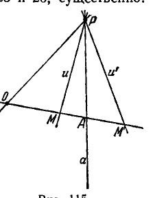

## 8. Проективное соответствие между многообразиями двух и трёх измерений

---
**стр. 315**
---

**§ 106.** Теперь мы определим проективное отображение двумерных и трехмерных образов. Сначала рассмотрим двумерный случай.

Пусть между точками двух плоскостей $\alpha$ и $\alpha'$ установлено взаимно однозначное соответствие, по которому произвольной точке $M$ плоскости $\alpha$ отвечает точка $M' = f(M)$ плоскости $\alpha'$. Это соответствие называется *проективным*, если точкам любой прямой плоскости $\alpha$ соответствуют в плоскости $\alpha'$ точки, также лежащие на некоторой прямой.

Задание на плоскости $\alpha'$ точек $M' = f(M)$, проективно соответствующих точкам $M$ плоскости $\alpha$, называют еще *проективным отображением плоскости $\alpha$ на плоскость $\alpha'$*. В том случае, когда $\alpha$ и $\alpha'$ совпадают, говорят, что дано проективное отображение плоскости $\alpha$ на самое себя.

По определению проективного отображения плоскости $\alpha$ на плоскость $\alpha'$, точки каждой прямой $a$ плоскости $\alpha$ имеют своими образами точки, которые на плоскости $\alpha'$ располагаются на некоторой прямой $a'$. Эту прямую $a'$ мы будем называть соответствующей по отображению прямой $a$.

Определение проективного соответствия требует, чтобы прямолинейно расположенные точки переходили в точки, также прямолинейно расположенные. Но в определении ничего не говорится по поводу точек, не лежащих на одной прямой, и заранее не исключается возможность, что такие точки отобразятся на одну прямую. Однако мы дальше докажем, что этот случай исключен, т. е. если образы лежат на одной прямой, то их прообразы также лежат на одной прямой. Иначе говоря, мы докажем, что отображение, обратное проективному, также является проективным (теорема 23а). Вместе с тем будет доказано, что при проективном отображении соответствие прямых, как и соответствие точек, является взаимно однозначным.

Важным частным случаем проективного отображения плоскости на плоскость является отображение, определяемое центральным проектированием.

При проектировании точек какой-либо плоскости $\alpha$ из произвольного центра на другую плоскость $\alpha'$ (как на экран), каждая точка $M$ плоскости $\alpha$ отображается в некоторую точку $M' = f(M)$ плоскости $\alpha'$. Отображение $M' = f(M)$ — проективное, так как любая прямая плоскости $\alpha$ проектируется в прямую же плоскости $\alpha'$.

Докажем следующую теорему.

**Т е о р е м а 21.** *Если плоскость $\alpha$ проективно отображена на плоскость $\alpha'$, то гармоническим группам элементов плоскости $\alpha$*

---
**стр. 316**
---

соответствуют по отображению на плоскости $\alpha'$ также гармонические группы элементов.

**Д о к а з а т е л ь с т в о.** 1) Пусть $a$ — произвольная прямая плоскости $\alpha$, $a'$ — соответствующая ей прямая плоскости $\alpha'$, $A, B$ и $C, D$ — произвольно выбранные гармонически сопряженные пары точек прямой $a$. Нужно показать, что пары точек $A', B'$ и $C', D'$ прямой $a'$, соответствующих по отображению точкам $A, B, C, D$, также являются гармонически сопряженными. Заметим, прежде всего, что на плоскости $\alpha$ должна существовать точка, которая не лежит на прямой $a$ и образ которой не лежит на прямой $a'$. В самом деле, если бы все точки плоскости $\alpha$, не лежащие на прямой $a$, отобразились на прямую $a'$, то некоторое множество точек прямой $a$ должно было бы отобразиться на множество точек плоскости $\alpha'$, не лежащих на прямой $a'$ (поскольку проективное отображение плоскости $\alpha$ на плоскость $\alpha'$ предполагается взаимно однозначным); но это исключено определением проективного отображения (согласно которому прямолинейный характер расположения точек сохраняется). Обозначим через $R$ какую-нибудь точку плоскости $\alpha$, которая не лежит на прямой $a$ и образ которой $R'$ в плоскости $\alpha'$ не лежит на прямой $a'$. Вследствие гармонической сопряженности пар $A, B$ и $C, D$ можно построить в плоскости $\alpha$ четырехвершинник $T$ с диагональными точками $A, B$ и с парой противоположных сторон, проходящих через $C, D$; кроме того, в качестве одной из вершин четырехвершинника $T$ можно выбрать точку $R$ (см. § 86). Так как образ $R'$ точки $R$ не лежит на прямой $a'$, то среди образов всех вершин четырехвершинника $T$ никакие три не лежат на одной прямой. Поэтому образом четырехвершинника $T$ является некоторый четырехвершинник $T'$.

Очевидно, точки $A', B'$ представляют собой диагональные точки четырехвершинника $T'$, а через точки $C', D'$ проходят две его противоположные стороны. Отсюда следует, что пары точек $A', B'$ и $C', D'$ гармонически сопряжены.

2) Пусть $P$ — произвольная точка плоскости $\alpha$, $P'$ — ее образ на плоскости $\alpha'$, $a, b$ и $c, d$ — произвольно выбранные гармонически сопряженные пары лучей пучка на плоскости $\alpha$ с центром $P$. Нужно показать, что в пучке с центром $P'$ пары лучей $a', b'$ и $c', d'$, соответствующих по отображению лучам $a, b, c, d$, также являются гармонически сопряженными. Это непосредственно вытекает из предыдущего. Заметим, прежде всего, что на плоскости $\alpha$ должна существовать прямая, которая не проходит через $P$ и образ которой не проходит через $P'$. В самом деле, возьмем на плоскости $\alpha$ какую-нибудь точку $Q$, отличную от $P$, и обозначим ее образ на $\alpha'$ через $Q'$. Как было показано чуть выше, существует на плоскости $\alpha$ точка $R$, которая не лежит на прямой $PQ$ и образ которой не лежит на $P'Q'$. Очевидно, прямая $QR$ как раз и будет такой прямой, которая не

---
**стр. 317**
---

проходит через $P$ и образ которой не проходит через $P'$. Обозначим прямую $QR$ буквой $t$, образ ее — буквой $t'$. Пусть $A, B, C, D$ — точки, в которых лучи $a, b, c, d$ пересекают прямую $t$, $A', B', C', D'$ — точки, в которых лучи $a', b', c', d'$ пересекают прямую $t'$. Ясно, что $A', B', C', D'$ суть образы точек $A, B, C, D$. Так как пары лучей $a, b$ и $c, d$ гармонически сопряжены, то согласно предложению, сформулированному в конце § 86, пары точек $A, B$ и $C, D$ будут гармонически сопряженными. Отсюда, в силу первой части доказательства, следует, что пары точек $A', B'$ и $C', D'$ являющиеся образами точек $A, B$ и $C, D$, также гармонически сопряжены; но так как лучи $a', b', c', d'$ проходят соответственно через точки $A', B', C', D'$, то в согласии с упомянутым выше предложением из § 86 пары лучей $a', b'$ и $c', d'$ находятся в отношении гармонической сопряженности. Тем самым теорема доказана полностью.

Из теорем 20 и 21 вытекает следующая

**Т е о р е м а 22.** *Если плоскость $\alpha$ проективно отображена на плоскость $\alpha'$, то при этом*
*1) множество точек каждой прямой $a$ плоскости $\alpha$ взаимно однозначно отображается на множество точек соответствующей прямой $a'$ плоскости $\alpha'$ и*
*2) множество лучей произвольного пучка на плоскости $\alpha$ с центром $P$ взаимно однозначно отображается на множество лучей пучка, центр которого $P'$ есть точка плоскости $\alpha'$, соответствующая по отображению точке $P$.*

Отсюда без труда может быть выведена

**Т е о р е м а 23а.** *Если $M' = f(M)$ — проективное отображение плоскости $\alpha$ на плоскость $\alpha'$, то обратное отображение $M = \phi(M')$ плоскости $\alpha'$ на плоскость $\alpha$ также является проективным.*

**Д о к а з а т е л ь с т в о.** Пусть $a'$ — произвольная прямая плоскости $\alpha'$. Возьмем на ней две какие-нибудь точки $A'$ и $B'$; им соответствуют на плоскости $\alpha$ точки $A = \phi(A')$ и $B = \phi(B')$. Обозначим через $a$ прямую, определяемую точками $A, B$. Так как отображение $M' = f(M)$ — проективное, то при его осуществлении все точки прямой $a$ отображаются на прямую $a'$. По теореме 22 получаемое таким путем отображение прямой $a$ на прямую $a'$ оказывается взаимно однозначным, т. е. образы точек прямой $a$ «заполняют» прямую $a'$. Иначе говоря, каждая точка прямой $a'$ представляет собой образ какой-то точки прямой $a$. А это означает, что в том случае, когда точка $M'$ лежит на $a'$, точка $M = \phi(M')$ лежит на $a$. Итак, при отображении $M = \phi(M')$ точки плоскости $\alpha'$, лежащие на произвольной прямой, переводятся в точки, которые на плоскости $\alpha$ также лежат на одной прямой, что является характерным свойством проективного отображения. Теорема доказана.

Интересно, что имеет место следующая на первый взгляд удивительная теорема.

---
**стр. 318**
---

*Пусть множество всех точек плоскости $\alpha$ взаимно однозначно отображено на некоторое множество $G'$ точек плоскости $\alpha'$. Если всякие точки плоскости $\alpha$, лежащие на одной прямой, отображаются в точки плоскости $\alpha'$, также лежащие на одной прямой, то возможны лишь два случая: 1) либо множество $G'$ целиком расположено на какой-нибудь одной прямой плоскости $\alpha'$, 2) либо множество $G'$ совпадает со всей плоскостью $\alpha'$ (тогда данное отображение есть проективное отображение плоскости $\alpha$ на всю плоскость $\alpha'$).*

**Д о к а з а т е л ь с т в о.** Первый случай можно осуществить, если заранее взять на какой-нибудь прямой плоскости $\alpha'$ какое угодно точечное множество $G'$ мощности континуума и любым способом взаимно однозначно отобразить плоскость $\alpha$ на $G'$.

Предположим теперь, что множество $G'$ содержит точки плоскости $\alpha'$, не лежащие на одной прямой. В таком случае гармоническим группам элементов плоскости $\alpha$ соответствуют по отображению также гармонические группы элементов плоскости $\alpha'$ (доказывается аналогично теореме 21).

Отсюда и из теорем 20, 21 следует, что 1) множество точек каждой прямой $a$ плоскости $\alpha$ взаимно однозначно отображается на множество точек соответствующей прямой $a'$ плоскости $\alpha'$; 2) множество лучей произвольного пучка на плоскости $\alpha$ с центром $P$ взаимно однозначно отображается на множество лучей пучка, центр которого $P'$ есть точка плоскости $\alpha'$, соответствующая по отображению точке $P$.

Возьмем на плоскости $\alpha$ какую-нибудь точку $P$ и обозначим ее образ на $\alpha'$ через $P'$. Пусть $M'$ — совершенно произвольная точка плоскости $\alpha'$; пусть $a'$ — прямая, соединяющая $M'$ с $P'$. Согласно сказанному выше прямая $a'$, как луч пучка с центром $P'$ в плоскости $\alpha'$, должна соответствовать некоторой прямой $a$, принадлежащей пучку с центром $P$ на плоскости $\alpha$; кроме того, соответствие между точками прямых $a$ и $a'$ должно быть взаимно однозначным. Поэтому точка $M'$, лежащая на прямой $a'$, должна соответствовать некоторой точке $M$ прямой $a$, т. е. некоторой точке плоскости $\alpha$. Итак, образы точек плоскости $\alpha$ необходимо должны заполнить всю плоскость $\alpha'$. Тем самым теорема доказана.

Далее мы отметим следующую очевидную теорему.

**Т е о р е м а 23б.** *Если $M' = f_1(M)$ — проективное отображение плоскости $\alpha$ на плоскость $\alpha'$, $M'' = f_2(M')$ — проективное отображение плоскости $\alpha'$ на плоскость $\alpha''$ (причем все три плоскости могут, в частности, совпадать друг с другом), то отображение $M'' = f_2(f_1(M))$ плоскости $\alpha$ на плоскость $\alpha''$ также является проективным.*

*Иначе говоря: отображение, получаемое в результате последовательного выполнения двух проективных отображений, является проективным.*

---
**стр. 319**
---

Высказанное утверждение очевидно. В самом деле, так как каждое из отображений $f_1$ и $f_2$ сохраняет прямолинейное расположение точек, то отображение, получаемое в результате их последовательного выполнения, обладает тем же свойством, следовательно, является проективным.

Свойство совокупности проективных отображений, выражаемое теоремой 23б, называют групповым.

Условимся говорить, что фигура $\Sigma$, лежащая в некоторой плоскости $\alpha$, *проективно эквивалентна* фигуре $\Sigma'$, лежащей в той же самой или в другой плоскости $\alpha'$, если существует проективное отображение плоскости $\alpha$ на плоскость $\alpha'$, при котором $\Sigma$ отображается на $\Sigma'$.

В частности, фигура $\Sigma$ проективно эквивалентна фигуре $\Sigma'$, если в результате серии центральных проектирований плоскости $\alpha$ на плоскость $\alpha_1$, плоскости $\alpha_1$ на плоскость $\alpha_2, \dots$, плоскости $\alpha_{n-1}$ на плоскость $\alpha'$ — фигура $\Sigma$ проективно отображается на фигуру $\Sigma'$.

Из теорем 23а и 23б следует, что:

1) если одна фигура проективно эквивалентна другой, то вторая проективно эквивалентна первой;

2) если две фигуры проективно эквивалентны третьей, то они проективно эквивалентны друг другу.

Благодаря указанному сопоставлению фигур проективные отображения приобретают в проективной геометрии роль, аналогичную той, какую имеют конгруэнтные перемещения фигур (т. е. движения) в элементарной геометрии.

Некоторое время проективные отображения плоскостей будут самостоятельными объектами нашего исследования.

**Т е о р е м а 24.** *Если плоскость $\alpha$ проективно отображена на плоскость $\alpha'$, то при этом*
*1) каждая прямая $a$ плоскости $\alpha$ отображается на соответствующую прямую $a'$ плоскости $\alpha'$ проективно;*
*2) каждый пучок лучей плоскости $\alpha$ отображается на соответствующий пучок лучей плоскости $\alpha'$ также проективно.*

Чтобы убедиться в справедливости этой теоремы, достаточно сопоставить теоремы 21 и 22 с определением проективного отображения одномерных многообразий.

Теперь мы получаем возможность доказать следующую важную теорему, которую можно рассматривать как обобщение на случай двумерных многообразий теоремы 15.

**Т е о р е м а 25.** *Проективное отображение плоскости $\alpha$ на плоскость $\alpha'$ однозначно определяется заданием четырех пар соответствующих по отображению точек при условии, что из четырех точек, задаваемых на плоскости $\alpha$, никакие три не лежат на одной прямой.*

---
**стр. 320**
---

*Д о к а з а т е л ь с т в о.* Пусть дано проективное отображение $M' = f(M)$ плоскости $\alpha$ на плоскость $\alpha'$. Пусть, далее, $A$, $B$, $C$, $D$ — четыре точки плоскости $\alpha$, из которых никакие три не лежат на одной прямой, $A'$, $B'$, $C'$, $D'$ — соответствующие им точки плоскости $\alpha'$ (из определения проективного отображения и из теоремы 23а следует, что никакие три из точек $A'$, $B'$, $C'$, $D'$ также не лежат на одной прямой). Нужно показать, что не существует проективного отображения плоскости $\alpha$ на плоскость $\alpha'$, отличного от данного отображения $M' = f(M)$, но, вместе с тем, как и данное отображение, переводящего точки $A$, $B$, $C$, $D$ в точки $A'$, $B'$, $C'$, $D'$.

Возьмем на плоскости $\alpha$ произвольную точку $M$ и обозначим через $m$ прямую $AM$. Эта прямая входит в состав лучей пучка с центром $A$. Каким бы ни было проективное отображение $\alpha$ на $\alpha'$, переводящее точки $A$, $B$, $C$, $D$ в точки $A'$, $B'$, $C'$, $D'$, определяемое им отображение пучка с центром $A$ на пучок с центром $A'$ является проективным (см. теорему 24). Далее, сколько бы ни существовало различных проективных отображений $\alpha$ на $\alpha'$, переводящих $A$, $B$, $C$, $D$ в $A'$, $B'$, $C'$, $D'$, все они определяют одно общее проективное отображение пучка с центром $A$ на пучок с центром $A'$. В самом деле, каждое из них переводит лучи $AB$, $AC$ и $AD$ первого пучка в лучи $A'B'$, $A'C'$ и $A'D'$ второго; далее, по условию выбора точек $A$, $B$, $C$, $D$ лучи $AB$, $AC$ и $AD$ (а также $A'B'$, $A'C'$ и $A'D'$) различны; но по теореме 18 проективное отображение одномерных многообразий (в частности, пучков) однозначно определяется заданием трех пар соответствующих элементов. Поэтому при всех возможных проективных отображениях плоскости $\alpha$ на плоскость $\alpha'$, переводящих $A$, $B$, $C$, $D$ в $A'$, $B'$, $C'$, $D'$, прямая $m$ плоскости $\alpha$ отображается на вполне определенную прямую $m'$, которая в проективном соответствии между рассматриваемыми пучками отвечает прямой $m$. Следовательно, при всех проективных отображениях плоскости $\alpha$ на плоскость $\alpha'$, переводящих $A$, $B$, $C$, $D$ в $A'$, $B'$, $C'$, $D'$, точка $M$ отображается на вполне определенную прямую, проходящую через $A'$. Аналогично, рассматривая в плоскости $\alpha$ пучок лучей с центром $B$ и его отображение на плоскость $\alpha'$, можно установить, что сколько бы ни было проективных отображений плоскости $\alpha$ на плоскость $\alpha'$, переводящих $A$, $B$, $C$, $D$ в $A'$, $B'$, $C'$, $D'$, при всех этих отображениях точка $M$ отображается на вполне определенную прямую, проходящую в плоскости $\alpha'$ через точку $B'$. Пересечением указанных прямых образ точки $M$ на плоскости $\alpha'$ определяется одинаково при всех проективных отображениях $\alpha$ на $\alpha'$, переводящих $A$, $B$, $C$, $D$ в $A'$, $B'$, $C'$, $D'$. А так как точка $M$ является произвольной, то из приведенных рассуждений вытекает, что, помимо данного проективного отображения $M' = f(M)$, другого проективного отображения $\alpha$ на $\alpha'$, которое, как и данное, переводило бы $A$, $B$, $C$, $D$ в $A'$, $B'$, $C'$, $D'$, не существует. Теорема доказана.

---
**стр. 321**
---

Из теоремы 25 вытекает.

**Т е о р е м а 26.** *При нетождественном проективном отображении плоскости на себя не может быть четырех неподвижных точек, из которых никакие три не лежат на одной прямой.*

В самом деле, пусть $M' = f(M)$ — нетождественное проективное отображение плоскости $\alpha$ на самое себя. Предположим, что имеются четыре точки $A$, $B$, $C$, $D$, из которых никакие три не лежат на одной прямой и которые являются неподвижными при отображении $M' = f(M)$. Рассмотрим наряду с отображением $M' = f(M)$ тождественное отображение $M' \equiv M$. Очевидно, оно является проективным. Далее, при отображении $M' \equiv M$ точки $A$, $B$, $C$, $D$ (как и все точки плоскости) остаются неподвижными. Таким образом, как отображение $M' = f(M)$, так и тождественное отображение $M' \equiv M$ переводят точки $A$, $B$, $C$, $D$ в эти же точки $A$, $B$, $C$, $D$. Эти отображения имеют, следовательно, общие четыре пары соответствующих точек, расположенных так, как предусмотрено в теореме 25, и согласно теореме 25 не могут отличаться друг от друга. Иными словами, $M' = f(M)$ при нашем предположении должно быть тождественным отображением, что противоречит условию теоремы. Тем самым требуемое доказано.

**З а м е ч а н и е.** Ограничение, накладываемое на расположение точек, о которых идет речь в теоремах 25 и 26, существенно. Чтобы убедиться в этом, рассмотрим так называемое гармоническое отображение.

Пусть $O$ — произвольно выбранная точка плоскости $\alpha$, $a$ — какая-нибудь прямая этой плоскости, не проходящая через точку $O$. Обозначим через $M$ произвольную точку плоскости $\alpha$ и через $A$ — точку, в которой прямая $OM$ пересекает прямую $a$ (рис. 115). Точку $M'$, которая вместе с точкой $M$ гармонически разделяет пару $O$, $A$, мы будем считать соответствующей точке $M$ в гармоническом отображении плоскости $\alpha$ на самое себя, точку $O$ будем называть центром отображения, прямую $a$ — его осью. Для обозначения точки $M'$ мы будем употреблять также символическую запись $M' = H(M)$.

Нетрудно установить, что гармоническое отображение $M' = H(M)$ является проективным. В самом деле, пусть $u$ — какая угодно прямая плоскости $\alpha$, $P$ — точка ее пересечения с осью $a$, $u'$ — проходящая через $P$ прямая, которая вместе с прямой $u$ гармонически разделяет пару прямых $a$ и $PO$. Очевидно, если точка $M$ перемещается по прямой $u$, то соответствующая ей точка $M' = H(M)$ перемещается по прямой $u'$. Таким образом, при отображении

---
**стр. 322**
---

$M' = H(M)$ каждая прямая отображается в прямую же. А это и служит характерным признаком проективного отображения.

Далее, согласно замечанию, сделанному в конце § 93, если точка $M$ совмещается с какой-либо точкой оси $a$, то соответствующая точка $M' = H(M)$ совместится с этой же точкой оси. Точно так же, если $M$ совпадает с центром $O$, то совпадает с центром и точка $M' = H(M)$. Следовательно, центр $O$ и все точки оси $a$ представляют собой неподвижные точки отображения $M' = H(M)$. Мы видим, что проективное отображение $M' = H(M)$ плоскости $\alpha$ на себя обладает бесконечным множеством неподвижных точек (однако все они, кроме точки $O$, расположены на одной прямой). Таким образом, если некоторое проективное отображение плоскости на себя оставляет четыре точки неподвижными, то можно сделать заключение, что это отображение является тождественным, лишь в том случае, когда известно, что расположение неподвижных точек подчиняется указанному в теореме 26 ограничению.

**§ 107.** В дальнейшем мы будем иногда употреблять выражение *двумерное проективное многообразие*; при этом мы будем подразумевать либо проективную плоскость, либо так называемую связку. *Связка* есть совокупность прямых и плоскостей проективного пространства, проходящих через какую-либо его точку (*центр связки*).

Можно определить проективное отображение для любых двумерных многообразий. Чтобы удобнее было это определение высказать, условимся называть *элементом первого рода* двумерного многообразия $\Pi$ каждую принадлежащую ему точку, если $\Pi$ — плоскость, и каждую принадлежащую ему прямую, если $\Pi$ — связка; *элементом второго рода* двумерного многообразия $\Pi$ будем называть принадлежащую ему прямую, если $\Pi$ — плоскость, и принадлежащую ему плоскость, если $\Pi$ — связка.

Пусть между элементами первого рода двух многообразий $\Pi$ и $\Pi'$ установлено взаимно однозначное соответствие так, что произвольному элементу $x$ многообразия $\Pi$ отвечает элемент $x' = f(x)$ многообразия $\Pi'$. Соответствие (или отображение) $x' = f(x)$ называется *проективным*, если любой группе элементов первого рода многообразия $\Pi$, принадлежащих одному элементу второго рода этого многообразия, соответствует в многообразии $\Pi'$ группа элементов первого рода, также принадлежащих одному элементу второго рода.

Все теоремы, доказанные в предыдущем параграфе, естественно, обобщаются на случай произвольных двумерных многообразий. Чтобы получить формулировки обобщенных теорем, нужно в формулировках теорем, приведенных в § 106, всюду слова «точка» и «прямая» заменить выражениями «элемент первого рода» и «элемент второго рода». Чтобы убедиться в их справедливости, достаточно

---
**стр. 323**
---

заметить, что элементы первого и второго рода связки при пересечении их плоскостью дают соответственно элементы первого и второго рода этой плоскости. Таким образом, исследование проективных отображений двумерных многообразий можно свести к исследованию проективных отображений плоскостей, которое и было проведено выше.

**§ 108.** Теперь мы рассмотрим проективные отображения трехмерных проективных многообразий; *трехмерными проективными многообразиями мы называем проективные пространства*.

Пусть даны два проективных пространства $\Pi$ и $\Pi'$ (каждый из символов $\Pi$ и $\Pi'$ обозначает некоторое множество предметов, называемых точками, прямыми и плоскостями, для которых определены отношения взаимной принадлежности и порядка с соблюдением требований проективных аксиом). Пусть, далее, между точками $\Pi$ и $\Pi'$ установлено взаимно однозначное соответствие, по которому произвольной точке $M$ пространства $\Pi$ отвечает точка $M' = f(M)$ пространства $\Pi'$. Взаимно однозначное соответствие $M' = f(M)$ между точками пространств $\Pi$ и $\Pi'$ называется *проективным*, если точкам любой плоскости пространства $\Pi$ соответствуют в пространстве $\Pi'$ точки, также лежащие на некоторой плоскости.

Задание в пространстве $\Pi'$ точек $M' = f(M)$, проективно соответствующих точкам $M$ пространства $\Pi$, называют еще *проективным отображением пространства $\Pi$ на пространство $\Pi'$*. В том случае, когда пространство $\Pi$ и пространство $\Pi'$ совпадают, говорят, что дано проективное отображение пространства на самого себя.

Основные свойства проективных отображений трехмерных многообразий представляют собой естественные обобщения соответствующих свойств проективных отображений двумерных многообразий и устанавливаются при помощи рассуждений, вполне аналогичных тем, какие проводились в § 107. Поэтому мы ограничимся лишь формулировками главнейших теорем о проективных отображениях в трехмерном случае, не задерживаясь на их доказательствах.

**Т е о р е м а 27.** *Если пространство $\Pi$ проективно отображено на пространство $\Pi'$, то каждая гармоническая группа элементов пространства $\Pi$ имеет своим образом в пространстве $\Pi'$ также гармоническую группу элементов.*

**Т е о р е м а 28.** *При проективном отображении пространства $\Pi$ на пространство $\Pi'$:*

1) *Каждое одномерное многообразие пространства $\Pi$ взаимно однозначно и проективно отображается на соответствующее одномерное многообразие пространства $\Pi'$. В частности, каждая прямая пространства $\Pi$ взаимно однозначно и проективно отображается на соответствующую прямую пространства $\Pi'$.*

2) *Каждое двумерное многообразие пространства $\Pi$ взаимно однозначно и проективно отображается на соответствующее*

---
**стр. 324**
---

двумерное многообразие пространства $\Pi'$. В частности, каждая плоскость пространства $\Pi$ взаимно однозначно и проективно отображается на соответствующую плоскость пространства $\Pi'$.

**Т е о р е м а 29а.** *Если $M' = f(M)$ — проективное отображение пространства $\Pi$ на пространство $\Pi'$, то обратное отображение $M = \phi(M')$ пространства $\Pi'$ на пространство $\Pi$ также является проективным.*

**Т е о р е м а 29б.** *Если $M' = f_1(M)$ — проективное отображение пространства $\Pi$ на пространство $\Pi'$, и $M'' = f_2(M')$ — проективное отображение пространства $\Pi'$ на пространство $\Pi''$, то отображение $M'' = f_2(f_1(M))$ пространства $\Pi$ на пространство $\Pi''$ также является проективным, т. е. совокупность проективных отображений пространств обладает групповым свойством.*

**Т е о р е м а 30.** *Проективное отображение пространства $\Pi$ на пространство $\Pi'$ однозначно определяется заданием пяти пар соответствующих по отображению точек, при условии, что из пяти точек, задаваемых в пространстве $\Pi$, никакие четыре не лежат в одной плоскости.*

Из теоремы 30 непосредственно вытекает следующая

**Т е о р е м а 31.** *При нетождественном проективном отображении пространства на себя не может быть пяти неподвижных точек, из которых никакие четыре не лежат на одной плоскости.*

Ограничение, наложенное в этой теореме на расположение точек, является существенным. В этом можно убедиться, обобщив на случай пространства понятие гармонического отображения, определение которого для плоскости дано нами в конце § 106.

Кроме приведенных выше основных теорем, отметим дополнительно еще следующую теорему.

Пусть множество всех точек проективного пространства $\Pi$ взаимно однозначно отображено на некоторое множество $G'$ точек проективного пространства $\Pi'$. Если всякие точки пространства $\Pi$, лежащие на одной плоскости, отображаются в точки пространства $\Pi'$, также лежащие на одной плоскости, то возможны лишь два случая: 1) либо множество $G'$ целиком расположено на какой-нибудь одной плоскости пространства $\Pi'$, 2) либо множество $G'$ совпадает со всем пространством $\Pi'$ (тогда данное отображение есть проективное отображение пространства $\Pi$ на все пространство $\Pi'$).

Эта теорема, естественно, обобщает теорему об отображении плоскостей, которая в § 106 сформулирована и доказана после теоремы 23а.

По отношению к пространственным телам вводится понятие проективной эквивалентности так же, как оно было введено для фигур одного и двух измерений. Тело $T$ пространства $\Pi$ называется проективно эквивалентным телу $T'$ того же самого или другого
