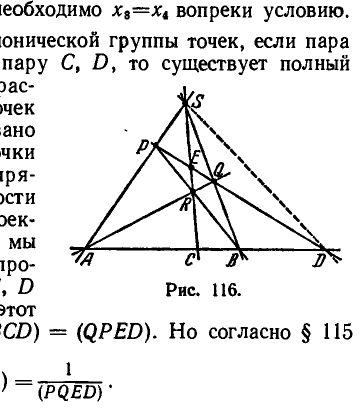

## 10. Формулы преобразования проективных координат. Сложное отношение четырёх элементов

---
**стр. 343**
---

Отношения $\alpha : \beta : \gamma$ будут неопределенными лишь в том случае, когда все определители, записанные в правой части предыдущего равенства, обращаются в нуль. Но тогда $x_1 + x'_1 = x_2 + x'_2$ и $x_1 x'_1 = x_2 x'_2$, следовательно, либо $x_1 = x_2$, $x'_1 = x'_2$, либо $x_1 = x'_2$, $x_2 = x'_1$. Однако обе эти возможности исключены условием теоремы.

Таким образом, каковы бы ни были две различные пары точек $M_1, M'_1$ и $M_2, M'_2$, всегда существует, и притом единственная, инволюция, переводящая $M_1$ в $M'_1$ и $M_2$ в $M'_2$. Теорема доказана.

Заметим, что по теореме 15 произвольное проективное отображение определяется заданием трех пар соответствующих точек; инволюция же, как мы видим, требует для своего определения задания двух пар. Очевидно, источником этого обстоятельства является то, что число параметров общего проективного отображения на единицу выше числа параметров инволюции.

В заключение сделаем еще следующее замечание.

Доказанные сейчас теоремы формулированы по отношению к инволюции на прямой. Если в формулировках этих теорем всюду заменить слова «точка прямой» словами «элемент одномерного многообразия», то получатся теоремы об инволюциях любых одномерных многообразий.

**10. Формулы преобразования проективных координат.**

**Сложное отношение четырех элементов**

**§ 114.** Пусть на проективной прямой $a$ введены две различные системы проективных однородных координат. Одну из них мы будем условно называть первой, другую — второй. Произвольная точка $M$ прямой имеет координаты $(x_1, x_2)$ в первой системе и $(x'_1, x'_2)$ — во второй. Мы ставим себе задачу: вывести формулы, с помощью которых координаты $(x'_1, x'_2)$ выражаются через координаты $(x_1, x_2)$. Читателю важно уяснить себе, что эта задача по существу уже решена в предыдущем разделе.

В самом деле, в § 111 установлена зависимость между координатами точек, соответствующих друг другу при проективном отображении прямой на прямую. Будем рассматривать тождественное отображение прямой $a$ на себя, т. е. такое отображение, при котором каждая точка прямой $a$ остается на месте. Тождественное отображение, очевидно, является проективным. Поэтому координаты $(x_1, x_2)$ точки $M$ в первой системе и координаты $(x'_1, x'_2)$ ее образа, т. е. той же точки $M$ во второй системе, должны быть связаны точно такими же уравнениями, какие мы получили в § 111; именно:

$$\rho' x'_1 = c_{11} x_1 + c_{12} x_2,$$
$$\rho' x'_2 = c_{21} x_1 + c_{22} x_2$$
$$\left(\Delta = \begin{vmatrix} c_{11} & c_{12} \\ c_{21} & c_{22} \end{vmatrix} \neq 0\right). \qquad (*)$$

---
**стр. 344**
---

Это и есть искомые формулы. Численные значения параметров $c$ могут быть найдены в каждом конкретном случае преобразования координат по тем условиям, которыми это преобразование определяется.

Если мы поделим почленно первое из равенств (*) на второе и изменим обозначения, полагая $c_{11} = \alpha$, $c_{12} = \beta$, $c_{21} = \gamma$, $c_{22} = \delta$, то получим формулу преобразования неоднородных проективных координат (на прямой):

$$x' = \frac{\alpha x + \beta}{\gamma x + \delta} \quad (\Delta = \alpha\delta - \beta\gamma \neq 0). \tag{**}$$

При помощи рассуждений, аналогичных тем, какие сейчас были проведены по отношению к прямой, можно установить, что известные нам формулы, выражающие зависимость между проективными координатами точек, соответствующих друг другу в проективном отображении плоскости на плоскость или пространства на пространство, одновременно являются формулами преобразования проективных координат на плоскости или в пространстве.

Естественно, что в том случае, когда эти формулы определяют преобразование (однородных) координат, входящие в них величины $x_i$ и $x'_i$ ($i = 1, 2, 3$ для плоскости и $i = 1, 2, 3, 4$ для пространства) представляют собой различные координаты одной и той же точки.

**§ 115.** Установив формулы преобразования проективных координат, мы решили тем самым задачу принципиальной важности. Только теперь мы имеем практическую возможность выяснять вопрос об инвариантности функций от координат точек или инвариантности соотношений между координатами точек, с которыми приходится иметь дело в проективной геометрии.

В частности, теперь мы можем дать определение весьма важному в проективной геометрии понятию *сложного отношения четырех элементов одномерного многообразия*. Определим сначала сложное отношение четырех точек прямой.

Пусть $M_1, M_2, M_3, M_4$ — четыре точки некоторой проективной прямой $a$. Введем на этой прямой какую-нибудь систему проективных координат (с вычислительной точки зрения сейчас удобнее пользоваться неоднородными координатами) и обозначим через $t_1, t_2, t_3, t_4$ координаты данных точек. Мы докажем, что величина

$$\frac{t_3 - t_1}{t_2 - t_3} : \frac{t_4 - t_1}{t_2 - t_4}$$

не зависит от выбора координатной системы. Для доказательства рассмотрим наряду с первоначально введенной еще новую систему проективных координат. Если координату произвольной точки

---
**стр. 345**
---

прямой $a$ в старой системе мы обозначим через $t$, а координату этой же точки в новой системе — через $t'$, то

$$t' = \frac{\alpha t + \beta}{\gamma t + \delta} \quad (\Delta = \alpha\delta - \beta\gamma \neq 0),$$

где $\alpha, \beta, \gamma, \delta$ — постоянные, определяемые выбором координатных систем. В частности, для новых координат $t'_1, t'_2, t'_3$ точек $M_1, M_2, M_3$ имеют место равенства:

$$t'_1 = \frac{\alpha t_1 + \beta}{\gamma t_1 + \delta}, \quad t'_2 = \frac{\alpha t_2 + \beta}{\gamma t_2 + \delta}, \quad t'_3 = \frac{\alpha t_3 + \beta}{\gamma t_3 + \delta}.$$

Отсюда

$$t'_3 - t'_1 = \frac{(\alpha\delta - \beta\gamma)(t_3 - t_1)}{(\gamma t_1 + \delta)(\gamma t_3 + \delta)},$$

$$t'_2 - t'_3 = \frac{(\alpha\delta - \beta\gamma)(t_2 - t_3)}{(\gamma t_2 + \delta)(\gamma t_3 + \delta)}$$

и

$$\frac{t'_3 - t'_1}{t'_2 - t'_3} = \frac{\gamma t_2 + \delta}{\gamma t_1 + \delta} \cdot \frac{t_3 - t_1}{t_2 - t_3}.$$

Аналогично

$$\frac{t'_4 - t'_1}{t'_2 - t'_4} = \frac{\gamma t_2 + \delta}{\gamma t_1 + \delta} \cdot \frac{t_4 - t_1}{t_2 - t_4}.$$

Следовательно,

$$\frac{t'_3 - t'_1}{t'_2 - t'_3} : \frac{t'_4 - t'_1}{t'_2 - t'_4} = \frac{t_3 - t_1}{t_2 - t_3} : \frac{t_4 - t_1}{t_2 - t_4},$$

что и требовалось доказать.

*Величина*

$$(M_1M_2M_3M_4) = \frac{t_3 - t_1}{t_2 - t_3} : \frac{t_4 - t_1}{t_2 - t_4} \tag{*}$$

называется *сложным отношением* четырех точек $M_1, M_2, M_3, M_4$.

Из только что проведенного рассмотрения следует, что сложное отношение определяется исключительно расположением точек $M_1, M_2, M_3, M_4$; введение координатной системы требуется лишь для фактического разыскания его численного значения и играет, таким образом, чисто служебную роль.

Из формулы (*) непосредственно усматриваются следующие свойства сложного отношения:

1) $(M_1M_2M_3M_4) = (M_3M_4M_1M_2),$

---
**стр. 346**
---

т. е. в сложном отношении, не меняя его величины, можно переставлять первую и вторую пары точек.

2) $(M_1M_2M_4M_3) = \dfrac{1}{(M_1M_2M_3M_4)},$

т. е. при перестановке точек внутри какой-нибудь пары величина сложного отношения меняется на обратную.

**§ 116.** Докажем еще ряд важных теорем о сложном отношении четырех точек.

**Т е о р е м а 43.** *При любом проективном отображении прямой $a$ на прямую $a'$ сложное отношение произвольной группы точек $M_1, M_2, M_3, M_4$ прямой $a$ равно сложному отношению соответствующих им точек $M'_1, M'_2, M'_3, M'_4$ прямой $a'$.*

Для доказательства введем на прямых $a$ и $a'$ координатные системы; если $t_i$ — координаты точек $M_i$ и $t'_i$ — координаты точек $M'_i$, то

$$(M_1M_2M_3M_4) = \frac{t_3 - t_1}{t_2 - t_3} : \frac{t_4 - t_1}{t_2 - t_4}$$

и

$$(M'_1M'_2M'_3M'_4) = \frac{t'_3 - t'_1}{t'_2 - t'_3} : \frac{t'_4 - t'_1}{t'_2 - t'_4}.$$

Согласно § 112 между координатами $t$ и $t'$ проективно соответствующих точек прямых $a$ и $a'$ существует зависимость $t' = \dfrac{\alpha t + \beta}{\gamma t + \delta}$; но при помощи этой зависимости равенство $(M'_1M'_2M'_3M'_4) = (M_1M_2M_3M_4)$ может быть установлено точно такими же вычислениями, какие были приведены в предыдущем параграфе.

Частным случаем предыдущей теоремы является следующая

**Т е о р е м а 44.** *Если $a$ и $a'$ — две прямые плоскости $\alpha$ и $S$ — произвольная точка плоскости $\alpha$, не принадлежащая ни одной из прямых $a$ и $a'$, то сложное отношение любой четверки точек $M_1, M_2, M_3, M_4$ прямой $a$ равно сложному отношению их проекций $M'_1, M'_2, M'_3, M'_4$ из центра $S$ на прямую $a'$.*

То, что эта теорема является частным случаем предыдущей, следует из того, что центральное проектирование есть частный случай проективного отображения (см. § 103). Теорему 44 можно сформулировать еще так:

*Четыре луча $m_1, m_2, m_3, m_4$ плоского пучка при пересечении с любой прямой, лежащей в плоскости пучка, определяют четыре точки, величина сложного отношения которых одинакова для всех прямых.*

Эту величину называют сложным отношением лучей $m_1, m_2, m_3, m_4$; для обозначения ее употребляется символ $(m_1m_2m_3m_4)$.

---
**стр. 347**
---

Совершенно так же может быть определено сложное отношение четырех элементов пучка плоскостей, именно: если $\alpha_1, \alpha_2, \alpha_3, \alpha_4$ — четыре плоскости, проходящие через одну прямую, то в пересечении с любой прямой пространства они определяют четыре точки, величина сложного отношения которых одинакова для всех прямых. Эту величину называют *сложным отношением четырех плоскостей* $\alpha_1, \alpha_2, \alpha_3, \alpha_4$ и обозначают символом $(\alpha_1\alpha_2\alpha_3\alpha_4)$.

Нижеприводимая теорема играет для проективных отображений пучков (лучей или плоскостей) такую же роль, как теорема 43 для проективных отображений прямых.

**Т е о р е м а 45.** *При любом проективном отображении пучка на пучок сложное отношение произвольной группы четырех элементов одного пучка равно сложному отношению соответствующих им элементов другого.*

**Д о к а з а т е л ь с т в о.** Пусть $x$ — произвольный элемент одного пучка и $x' = f(x)$ — соответствующий ему по отображению элемент второго пучка. Пересечем элементы первого пучка какой-нибудь прямой $a$, элементы второго — прямой $a'$ и обозначим через $M$ точку пересечения прямой $a$ с элементом $x$, через $M'$ — точку пересечения прямой $a'$ с элементом $x'$. Будем рассматривать отображение прямой $a$ на прямую $a'$, при котором точке $M$ соответствует точка $M' = F(M)$. Отображение $M' = F(M)$, как и данное $x' = f(x)$, будет проективным. Поэтому, если $M_1, M_2, M_3, M_4$ — точки пересечения прямой $a$ с произвольно выбранными элементами $x_1, x_2, x_3, x_4$ первого пучка, $M'_1, M'_2, M'_3, M'_4$ — точки пересечения прямой $a'$ с соответствующими элементами $x'_1, x'_2, x'_3, x'_4$ второго пучка, то

$$(M'_1M'_2M'_3M'_4) = (M_1M_2M_3M_4)$$

(см. теорему 43); далее, по определению сложного отношения четырех элементов пучка имеем:

$$(x_1x_2x_3x_4) = (M_1M_2M_3M_4),$$

$$(x'_1x'_2x'_3x'_4) = (M'_1M'_2M'_3M'_4).$$

Следовательно,

$$(x'_1x'_2x'_3x'_4) = (x_1x_2x_3x_4),$$

что и нужно было доказать.

Легко устанавливается также следующая теорема, которая охватывает теоремы 43 и 45.

**Т е о р е м а 46.** *При любом проективном отображении одного одномерного многообразия на другое сложное отношение произвольной группы четырех элементов первого многообразия равно сложному отношению соответствующих им элементов другого.*

---
**стр. 348**
---

В этой формулировке предусмотрены случаи отображения прямой на пучок лучей, прямой на пучок плоскостей и пучка лучей на пучок плоскостей.

Из теорем 46 и 24 следует

**Т е о р е м а 47.** *Если плоскость $\alpha$ проективно отображена на плоскость $\alpha'$, то сложное отношение любой группы четырех элементов, принадлежащих одному одномерному многообразию плоскости $\alpha$, равно сложному отношению четырех соответствующих элементов плоскости $\alpha'$.*

Из теорем 46 и 28 следует такая же теорема, относящаяся к проективным отображениям пространства на пространство.

Коротко полученные результаты можно выразить еще так:

*Сложное отношение есть инвариант проективных отображений.*

**§ 117.** Пусть на какой-нибудь прямой $a$ даны четыре точки $A, B, C, D$ и на той же самой или на другой прямой $a'$ даны четыре точки $A', B', C', D'$. Поставим вопрос: при каком условии существует проективное отображение прямой $a$ на прямую $a'$, переводящее точки $A, B, C, D$ в точки $A', B', C', D'$?

Из теоремы 43 следует, что необходимым условием для этого является равенство сложных отношений группы точек $A, B, C, D$ и группы точек $A', B', C', D'$. Нетрудно сообразить, что указанное условие является также и достаточным.

В самом деле, допустим, что $(ABCD) = (A'B'C'D')$. Обозначим через $M' = f(M)$ проективное отображение прямой $a$ на прямую $a'$, переводящее точки $A, B, C$ в точки $A', B', C'$. Существование его обеспечивается теоремой 37а. Пусть $f(D) = D^*$. По теореме 43 $(ABCD) = (A'B'C'D^*)$. Следовательно, $(A'B'C'D^*) = (A'B'C'D')$. Отсюда и из определения сложного отношения тотчас следует, что точка $D^*$ совпадает с точкой $D'$. Таким образом, действительно, при условии $(ABCD) = (A'B'C'D')$ существует проективное отображение прямой $a$ на прямую $a'$, именно — отображение $M' = f(M)$, переводящее точки $A, B, C, D$ в точки $A', B', C', D'$.

По ранее данному определению система точек $M_1, M_2, \dots, M_n$ прямой $a$ считается проективно эквивалентной системе точек $M'_1, M'_2, \dots, M'_n$ прямой $a'$, если существует проективное отображение прямой $a$ на прямую $a'$, переводящее точки $M_1, M_2, \dots, M_n$ соответственно в точки $M'_1, M'_2, \dots, M'_n$.

При помощи рассуждений, аналогичных предыдущим, легко установить предложение:

*Для того чтобы система точек $M_1, M_2, \dots, M_n$ прямой $a$ была проективно эквивалентна системе точек $M'_1, M'_2, \dots, M'_n$ прямой $a'$, необходимо и достаточно, чтобы сложное отношение любой группы четырех точек $M_p, M_q, M_r, M_s$ первой системы было равно

---
**стр. 349**
---

сложному отношению соответствующей четверки точек $M'_p, M'_q, M'_r, M'_s$ второй системы.

Сложное отношение, позволяющее охарактеризовать проективную эквивалентность, является *основным инвариантом* проективной геометрии, подобно тому как расстояние между точками, характеризующее конгруэнтность, есть основной инвариант геометрии элементарной.

**§ 118.** Если на произвольной прямой пара точек $A, B$ гармонически разделяет пару точек $C, D$, то $(ABCD) = -1$.

Докажем это. Сначала заметим, что сложное отношение четырех различных точек никогда не может быть равным $+1$. В самом деле, если

$$(M_1M_2M_3M_4) = \frac{x_3 - x_1}{x_2 - x_3} : \frac{x_4 - x_1}{x_2 - x_4} = 1,$$

то $\dfrac{x_3 - x_1}{x_2 - x_3} = \dfrac{x_4 - x_1}{x_2 - x_4}$ и при $x_1 \neq x_2$ необходимо $x_3 = x_4$ вопреки условию.

Далее, по определению гармонической группы точек, если пара $A, B$ гармонически разделяет пару $C, D$, то существует полный четырехвершинник $PQRS$, расположенный относительно точек $A, B, C, D$ так, как показано на рис. 116.

Спроектируем точки $A, B, C, D$ из центра $S$ на прямую $PQ$. В силу инвариантности сложного отношения при проектировании (см. теорему 44), мы получим $(ABCD) = (PQED)$. Спроектируем снова точки $A, B, C, D$ на прямую $PQ$, но на этот раз из центра $R$. Тогда $(ABCD) = (QPED)$. Но согласно § 115

$$(QPED) = \frac{1}{(PQED)}.$$

Таким образом, $(ABCD) = (PQED)$ и $(ABCD) = \dfrac{1}{(PQED)}$, откуда

$$(ABCD)^2 = 1$$

и $(ABCD) = \pm 1$. Так как, по доказанному выше, сложное отношение различных точек не может быть равным $+1$, то

$$(ABCD) = -1,$$

и требуемое доказано.

Отсюда и из определения сложного отношения четырех элементов пучка тотчас вытекает следующая общая теорема.

---
**стр. 350**
---

**Т е о р е м а 48.** *Если пара элементов $x, y$ одномерного многообразия гармонически разделяет пару его элементов $z, t$, то $(xyzt) = -1$.*

**§ 119.** Теперь мы выведем некоторые новые формулы, выражающие сложное отношение в проективных координатах.

Пусть на плоскости введена система проективных неоднородных координат с началом $O$ и точками на бесконечности $\infty_x$ и $\infty_y$ (см. § 98). Наша задача — выразить сложное отношение $(M_1 M_2 M_3 M_4)$ четырёх точек $M_1, M_2, M_3, M_4$, лежащих на одной прямой, через их координаты $(x^1, y^1), (x^2, y^2), (x^3, y^3), (x^4, y^4)$.

Спроецируем точки $M_1, M_2, M_3, M_4$ из точки $\infty_y$ на ось $x$; обозначим через $M'_1, M'_2, M'_3, M'_4$ их проекции на эту ось. Очевидно, что точки $M'_1, M'_2, M'_3, M'_4$ имеют координаты $(x^1, 0), (x^2, 0), (x^3, 0), (x^4, 0)$ и

$$(M'_1 M'_2 M'_3 M'_4) = \frac{x^3 - x^1}{x^2 - x^3} : \frac{x^4 - x^1}{x^2 - x^4} .$$

Аналогично, спроецировав точки $M_1, M_2, M_3, M_4$ из точки $\infty_x$ на ось $y$, получим точки $M''_1, M''_2, M''_3, M''_4$ и

$$(M''_1 M''_2 M''_3 M''_4) = \frac{y^3 - y^1}{y^2 - y^3} : \frac{y^4 - y^1}{y^2 - y^4} .$$

По теореме 44,

$$(M_1 M_2 M_3 M_4) = (M'_1 M'_2 M'_3 M'_4),$$

$$(M_1 M_2 M_3 M_4) = (M''_1 M''_2 M''_3 M''_4);$$

следовательно, для выражения величины $(M_1 M_2 M_3 M_4)$ пригодна любая из следующих формул:

$$\left.
\begin{aligned}
(M_1 M_2 M_3 M_4) &= \frac{x^3 - x^1}{x^2 - x^3} : \frac{x^4 - x^1}{x^2 - x^4} \ ; \\
(M_1 M_2 M_3 M_4) &= \frac{y^3 - y^1}{y^2 - y^3} : \frac{y^4 - y^1}{y^2 - y^4} \ .
\end{aligned}
\right\} \quad (A)$$

Чтобы выразить сложное отношение $(M_1 M_2 M_3 M_4)$ в однородных координатах, нужно в полученных формулах заменить неоднородные координаты $x^i, y^i$ каждой точки $M_i$ ($i = 1, 2, 3, 4$) отношениями однородных координат $\dfrac{x_1^i}{x_3^i}, \dfrac{x_2^i}{x_3^i}$ этой точки; поступая

---
**стр. 351**
---

таким образом, мы найдем формулы

$$\left.
\begin{aligned}
(M_1 M_2 M_3 M_4) &= \frac{\begin{vmatrix} x_1^3 & x_1^1 \\ x_3^3 & x_3^1 \end{vmatrix}}{\begin{vmatrix} x_1^2 & x_1^3 \\ x_3^2 & x_3^3 \end{vmatrix}} : \frac{\begin{vmatrix} x_1^4 & x_1^1 \\ x_3^4 & x_3^1 \end{vmatrix}}{\begin{vmatrix} x_1^2 & x_1^4 \\ x_3^2 & x_3^4 \end{vmatrix}}, \\[1.2em]
(M_1 M_2 M_3 M_4) &= \frac{\begin{vmatrix} x_2^2 & x_2^3 \\ x_3^2 & x_3^3 \end{vmatrix}}{\begin{vmatrix} x_2^3 & x_2^1 \\ x_3^3 & x_3^1 \end{vmatrix}} : \frac{\begin{vmatrix} x_2^2 & x_2^4 \\ x_3^2 & x_3^4 \end{vmatrix}}{\begin{vmatrix} x_2^4 & x_2^1 \\ x_3^4 & x_3^1 \end{vmatrix}}
\end{aligned}
\right\} \quad (Б)$$

(в этих формулах номер точки указывается верхним индексом, а нижний индекс определяет номер координаты).

В пространстве сложное отношение четырех точек прямой выражается в проективных координатах точно такими же формулами, только число их на одну больше.

Отметим один специальный способ записи сложного отношения, вытекающий из формул (Б).

Пусть $P$ и $Q$ — две различные точки плоскости, однородные координаты которых обозначены через $p_i$ и $q_i$ ($i = 1, 2, 3$). Легко показать, что всякая точка $T$ с однородными координатами

$$t_i = p_i + t q_i \quad (i = 1, 2, 3)$$

лежит на прямой $PQ$. В самом деле, если

$$u_1 x_1 + u_2 x_2 + u_3 x_3 = \sum u_i x_i = 0$$

— уравнение прямой $PQ$, то $\sum u_i p_i = 0$ и $\sum u_i q_i = 0$; но в этом случае и

$$\sum u_i t_i = \sum u_i (p_i + t q_i) = \sum u_i p_i + t \sum u_i q_i = 0,$$

т. е. координаты точки $T$ удовлетворяют уравнению прямой $PQ$.

Придадим параметру $t$ два произвольных значения $t = \lambda$ и $t = \mu$ и выразим по формулам (Б) сложные отношения четырех точек $P, Q, L, M$ с однородными координатами $p_i, q_i, p_i + \lambda q_i, p_i + \mu q_i$; применяя, например, первую из формул (Б), мы получим:

$$(PQLM) = \frac{\begin{vmatrix} p_1 + \lambda q_1 & p_1 \\ p_3 + \lambda q_3 & p_3 \end{vmatrix}}{\begin{vmatrix} q_1 & p_1 + \lambda q_1 \\ q_3 & p_3 + \lambda q_3 \end{vmatrix}} : \frac{\begin{vmatrix} p_1 + \mu q_1 & p_1 \\ p_3 + \mu q_3 & p_3 \end{vmatrix}}{\begin{vmatrix} q_1 & p_1 + \mu q_1 \\ q_3 & p_3 + \mu q_3 \end{vmatrix}} = \frac{\lambda \begin{vmatrix} q_1 & p_1 \\ q_3 & p_3 \end{vmatrix}}{\begin{vmatrix} q_1 & p_1 \\ q_3 & p_3 \end{vmatrix}} : \frac{\mu \begin{vmatrix} q_1 & p_1 \\ q_3 & p_3 \end{vmatrix}}{\begin{vmatrix} q_1 & p_1 \\ q_3 & p_3 \end{vmatrix}} = \frac{\lambda}{\mu}.$$

Здесь следует оговориться, что результат этих вычислений будет

---
**стр. 352**
---

определенным лишь при условии $\begin{vmatrix} q_1 & p_1 \\ q_3 & p_3 \end{vmatrix} \neq 0$. Если же $\begin{vmatrix} q_1 & p_1 \\ q_3 & p_3 \end{vmatrix} = 0$, то придется использовать вторую из формул (Б). Результат вычислений будет определенным и совпадет с предыдущим, если $\begin{vmatrix} q_2 & p_2 \\ q_3 & p_3 \end{vmatrix} \neq 0$. Оба определителя $\begin{vmatrix} q_1 & p_1 \\ q_3 & p_3 \end{vmatrix}$ и $\begin{vmatrix} q_2 & p_2 \\ q_3 & p_3 \end{vmatrix}$ не могут быть равными нулю, так как в этом случае $p_1 : p_2 : p_3 = q_1 : q_2 : q_3$, что невозможно, поскольку точки $P, Q$, по условию, различны. Итак,

$$(PQLM) = \frac{\lambda}{\mu}.$$

Такой способ записи сложного отношения очень прост и удобен для использования; очевидно, он применим также и в том случае, когда координаты точек $P, Q, L, M$ даны в пространственной системе.

В заключение мы выведем формулу, выражающую сложное отношение четырех лучей пучка.

Пусть дан пучок с центром $S(x_0, y_0)$; уравнению любого его луча в неоднородной системе координат можно придать вид:

$$y - y_0 = k(x - x_0). \quad (*)$$

Обозначим через $m_1, m_2, m_3, m_4$ четыре луча данного пучка, через $k_1, k_2, k_3, k_4$ — соответствующие им значения параметра $k$ в уравнении (*) и через $M_1(x_1, 0), M_2(x_2, 0), M_3(x_3, 0), M_4(x_4, 0)$ — точки пересечения лучей $m_1, m_2, m_3, m_4$ с осью $x$. По определению сложного отношения четырех точек

$$(M_1 M_2 M_3 M_4) = \frac{x_3 - x_1}{x_2 - x_3} : \frac{x_4 - x_1}{x_2 - x_4} ;$$

по определению сложного отношения четырех лучей пучка $(m_1 m_2 m_3 m_4) = (M_1 M_2 M_3 M_4)$. Следовательно,

$$(m_1 m_2 m_3 m_4) = \frac{x_3 - x_1}{x_2 - x_3} : \frac{x_4 - x_1}{x_2 - x_4}.$$

Из уравнения (*) при $y = 0$ находим:

$$x_i = x_0 - \frac{y_0}{k_i} \quad (i = 1, 2, 3, 4).$$

Заменяя в предыдущем выражении для $(m_1 m_2 m_3 m_4)$ величины $x_1, x_2, x_3, x_4$ правыми частями этих равенств, получим после очевидных преобразований следующую формулу:

$$(m_1 m_2 m_3 m_4) = \frac{k_3 - k_1}{k_2 - k_3} : \frac{k_4 - k_1}{k_2 - k_4} . \quad (Г)$$
