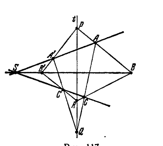
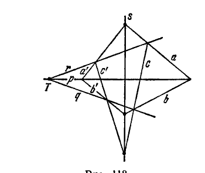

## 11. Принцип двойственности

---
**стр. 353**
---

Она выражает сложное отношение четырех лучей через определяющие их параметры.

Из формулы (Г) легко получить аналитическое представление проективного отображения пучка на пучок, т. е. найти вид функции $k' = f(k)$, где $k$ и $k'$ — параметры, определяющие проективно соответствующие друг другу лучи двух пучков.

В самом деле, если $k_1, k_2, k_3$ — параметры каких-либо трех лучей первого пучка, $k'_1, k'_2, k'_3$ — параметры соответствующих лучей второго, то

$$\frac{k'_3 - k'_1}{k'_2 - k'_3} : \frac{k' - k'_1}{k'_2 - k'} = \frac{k_3 - k_1}{k_2 - k_3} : \frac{k - k_1}{k_2 - k},$$

так как по теореме 45 сложное отношение есть инвариант проективного отображения пучков; выражая из этого уравнения $k'$, найдем:

$$k' = \frac{\alpha k + \beta}{\gamma k + \delta}, \quad (Д)$$

где $\alpha, \beta, \gamma, \delta$ — постоянные (зависящие от $k_1, k_2, k_3, k'_1, k'_2, k'_3$).

Таким образом, проективное отображение пучка на пучок аналитически представляется дробно-линейной функцией. Определитель ее $\Delta = \alpha\delta - \beta\gamma$ отличен от нуля, так как в противном случае отображение, определяемое формулой (Д), не будет взаимно однозначным.

**11. Принцип двойственности**

**§ 120. П р и н ц и п д в о й с т в е н н о с т и н а п р о е к т и в н о й п л о с к о с т и.** В этом разделе мы сформулируем и докажем одно из замечательных положений проективной геометрии, известное под названием *принципа двойственности*. Вначале мы ограничимся двумерным случаем и изложим сущность принципа двойственности в проективной геометрии на плоскости.

В двумерной проективной геометрии рассматриваются объекты двух видов: точки и прямые. Свойства их взаимных отношений определены проективными аксиомами групп I, II, III, из которых только аксиомы I,1—I,3, I,9, II,1—II,6 и III являются аксиомами двумерной геометрии, остальные (т. е. аксиомы I,4—I,8) имеют пространственный характер. Но, как показывает предыдущее изложение, чтобы иметь возможность получать теоремы двумерной проективной геометрии, не пользуясь построениями в трехмерном пространстве, приходится к аксиомам I,1—I,3, I,9, II,1—II,6 и III присоединить еще предложение Дезарга. Перечисленные аксиомы вместе с предложением Дезарга мы будем

---
**стр. 354**
---

называть *двумерными проективными аксиомами*. Анализ основ проективной геометрии обнаруживает, что с каждой двумерной проективной аксиомой может быть сопоставлено некоторое предложение таким образом, что эти два сопоставленных друг с другом предложения, если их надлежащим образом сформулировать, переходят одно в другое при замене слова «точка» словом «прямая» и слова «прямая» — словом «точка». Это обстоятельство, в котором по существу содержится принцип двойственности на плоскости (точно мы выразим его дальше), станет ясным читателю после того, как мы фактически осуществим указанное сопоставление.

Начнем с аксиом первой группы. Ими определяются отношения взаимной принадлежности точек и прямых, выражаемые обычно словами: «точка лежит на прямой» или «прямая проходит через точку». Сейчас нам будет более удобно вместо этих оборотов речи употреблять иные, именно, говорить: «точка принадлежит прямой» или «прямая принадлежит точке». Соблюдая это условие, мы соответственно изменим словесное выражение аксиом I,1—I,3, I,9 и запишем их на левой стороне страницы; справа, рядом с каждой аксиомой приведем предложение, сопоставленное с ней в том смысле, как это было пояснено выше.

Впредь такие два предложения мы будем называть *двойственными* друг другу.

| | |
|---|---|
| **I,1.** Каковы бы ни были две точки $A$ и $B$, существует прямая $a$, принадлежащая точке $A$ и точке $B$. | Каковы бы ни были две прямые $a$ и $b$, существует точка $A$, принадлежащая прямой $a$ и прямой $b$. (Это есть не что иное, как аксиома I,9.) |
| **I,2.** Каковы бы ни были две различные точки $A$ и $B$, существует не более одной прямой, принадлежащей и точке $A$, и точке $B$. | Каковы бы ни были две различные прямые $a$ и $b$, существует не более одной точки, принадлежащей и прямой $a$, и прямой $b$. (Это предложение непосредственно следует из аксиомы I,2.) |
| **I,3.** Каждой прямой принадлежит не менее трех точек. Существуют по крайней мере три точки, не принадлежащие одной прямой. | Каждой точке принадлежит не менее трех прямых. Существуют по крайней мере три прямые, не принадлежащие одной точке. (Доказательство этого утверждения легко проводится при помощи аксиом I,1—I,3.) |

---
**стр. 355**
---

| | |
|---|---|
| **I,9.** Каждые две прямые имеют общую точку. | Каждые две точки имеют общую прямую. (Это есть не что иное, как аксиома I,1.) |

**П р е д л о ж е н и е  Д е з а р г а.**

| | |
|---|---|
| Пусть три точки $A, B, C$ не принадлежат одной прямой, а также три точки | Пусть три прямые $a, b, c$ не принадлежат одной точке, а также три прямые $a', b', c'$ не принадлежат одной точке; |

| | |
|---|---|
| $A', B', C'$ не принадлежат одной прямой; пусть, далее, прямая, принадлежащая точкам $A, B$, с прямой, принадлежащей точкам $A', B'$, имеет общую точку $P$; прямая, принадлежащая точкам $B, C$, с прямой, принадлежащей точкам $B', C'$, имеет общую точку $Q$ и прямая, принадлежащая точкам $A, C$, с прямой, принадлежащей точкам $A', C'$, имеет общую точку $R$. Тогда если точки $P, Q, R$ принадлежат одной прямой $t$, то три прямые, из которых одна принадлежит точкам $A, A'$, другая — точкам $B, B'$ и третья — точкам $C, C'$, имеют общую точку $S$ (рис. 117). | пусть, далее, точка, принадлежащая прямым $a, b$, с точкой, принадлежащей прямым $a', b'$, имеет общую прямую $p$; точка, принадлежащая прямым $b, c$, с точкой, принадлежащей прямым $b', c'$, имеет общую прямую $q$ и точка, принадлежащая прямым $a, c$, с точкой, принадлежащей прямым $a', c'$, имеет общую прямую $r$. Тогда если прямые $p, q, r$ принадлежат одной точке $T$, то три точки, из которых одна принадлежит прямым $a, a'$, другая — прямым $b, b'$ и третья — прямым $c, c'$, имеют общую прямую $s$ (рис. 118). |
| | (Это предложение представляет собой не что иное, как теорему 2, обратную теореме Дезарга.) |

---
**стр. 356**
---

Таким образом, действительно, с каждой двумерной проективной аксиомой первой группы возможно сопоставить некоторое правильное (т. е. вытекающее из этих же аксиом) утверждение, так что сопоставляемые предложения оказываются двойственными друг другу.

Перейдем к рассмотрению аксиом второй группы II,1—II,6.

Основным понятием, с которым оперируют аксиомы II,1—II,6, является понятие о разделенных парах точек на прямой; с помощью этого понятия дается определение разделенных пар прямых, проходящих через одну точку (см. § 89). Ниже выписаны аксиомы второй группы рядом с двойственными им предложениями; справедливость последних непосредственно следует из аксиом I, II и из определения разделенных пар прямых.

**II,1.** *Каковы бы ни были три различные точки $A$, $B$, $C$, принадлежащие одной прямой $u$, существует такая точка $D$, принадлежащая прямой $u$, что пара точек $A$, $B$ разделяет пару точек $C$, $D$.*

*Каковы бы ни были три различные прямые $a$, $b$, $c$, принадлежащие одной точке $U$, существует такая прямая $d$, принадлежащая точке $U$, что пара прямых $a$, $b$ разделяет пару прямых $c$, $d$.*

Если пара $A$, $B$ разделяет пару $C$, $D$, то все четыре точки $A$, $B$, $C$, $D$ различны.

Если пара $a$, $b$ разделяет пару $c$, $d$, то все четыре прямые $a$, $b$, $c$, $d$ различны.

**II,2.** *Если пара точек $A$, $B$ разделяет пару точек $C$, $D$, то пара $B$, $A$ разделяет пару $C$, $D$ и пара $C$, $D$ разделяет пару $A$, $B$.*

*Если пара прямых $a$, $b$ разделяет пару прямых $c$, $d$, то пара $b$, $a$ разделяет пару $c$, $d$ и пара $c$, $d$ разделяет пару $a$, $b$.*

**II,3.** *Каковы бы ни были четыре различные точки $A$, $B$, $C$, $D$, принадлежащие прямой $u$, из них могут быть всегда и единственным образом составлены две разделенные пары.*

*Каковы бы ни были четыре различные прямые $a$, $b$, $c$, $d$, принадлежащие точке $U$, из них могут быть всегда и единственным образом составлены две разделенные пары.*

**II,4.** *Пусть $A$, $B$, $C$, $D$, $E$ — точки, принадлежащие прямой $u$; если пары $C$, $D$ и $C$, $E$ разделяют пару $A$, $B$, то пара $D$, $E$ не разделяет пару $A$, $B$.*

*Пусть $a$, $b$, $c$, $d$, $e$ — прямые, принадлежащие точке $U$; если пары $c$, $d$ и $c$, $e$ разделяют пару $a$, $b$, то пара $d$, $e$ не разделяет пару $a$, $b$.*

---
**стр. 357**
---

**II,5.** *Пусть $A$, $B$, $C$, $D$, $E$ — точки, принадлежащие прямой $u$; если пары $C$, $D$ и $C$, $E$ не разделяют пару $A$, $B$, то пара $D$, $E$ также не разделяет пару $A$, $B$.*

*Пусть $a$, $b$, $c$, $d$, $e$ — прямые, принадлежащие точке $U$; если пары $c$, $d$ и $c$, $e$ не разделяют пару $a$, $b$, то пара $d$, $e$ также не разделяет пару $a$, $b$.*

**II,6.** *Пусть $a$, $b$ и $c$, $d$ — две пары прямых, которые принадлежают одной точке $S$, $u$ и $u'$ — две прямые, не принадлежащие точке $S$; пусть, далее, $A$, $B$, $C$, $D$ — точки, принадлежащие прямой $u$ и, соответственно, прямым $a$, $b$, $c$, $d$, и $A'$, $B'$, $C'$, $D'$ — точки, принадлежащие прямой $u'$ и, соответственно, прямым $a$, $b$, $c$, $d$. Тогда если пара $A$, $B$ разделяет пару $C$, $D$, то пара $A'$, $B'$ разделяет пару $C'$, $D'$.*

*Пусть $A$, $B$ и $C$, $D$ — две пары точек, которые принадлежат одной прямой $s$, $U$ и $U'$ — две точки, не принадлежащие прямой $s$; пусть, далее, $a$, $b$, $c$, $d$ — прямые, принадлежащие точке $U$ и, соответственно, точкам $A$, $B$, $C$, $D$, и $a'$, $b'$, $c'$, $d'$ — прямые, принадлежащие точке $U'$ и, соответственно, точкам $A$, $B$, $C$, $D$. Тогда если пара $a$, $b$ разделяет пару $c$, $d$, то пара $a'$, $b'$ разделяет пару $c'$, $d'$.*

Таким образом, и с аксиомами второй группы могут быть сопоставлены двойственные предложения.

Обратимся, наконец, к аксиоме непрерывности III.

Чтобы иметь возможность формулировать аксиому III (Дедекинда), нам пришлось в свое время предварительно определить линейный порядок точек на разрезанной проективной прямой. Напомним читателю это определение.

Пусть $a$ — произвольная прямая. Выберем на ней какую-либо точку $U$, а для остальных точек прямой $a$ установим отношение, выраженное словом «между», полагая, что из трех точек $A$, $B$, $C$ точка $C$ лежит между $A$ и $B$, если пара $A$, $B$ разделена парой $C$, $U$. Мы говорим, что в множестве точек прямой $a$, которое получается исключением точки $U$, установлен линейный порядок, если это множество упорядочено с соблюдением следующего условия: каждый раз, когда точка $C$ лежит между точками $A$ и $B$ в смысле установленного порядка, точка $C$ лежит между $A$ и $B$ также и в смысле принятого только что определения.

Имея в виду сформулировать предложение, двойственное аксиоме III, мы определим сейчас линейный порядок в множестве всех прямых, за исключением одной, проходящих через одну точку.

Пусть $A$ — произвольная точка. Выберем среди прямых, проходящих через точку $A$, какую-либо прямую $u$, а для остальных

---
**стр. 358**
---

установим отношение, выражаемое словом «между», полагая, что из трех прямых $a$, $b$, $c$ прямая $c$ проходит между $a$ и $b$, если пара $a$, $b$ разделена парой $c$, $u$. Мы будем говорить, что в множестве всех прямых, проходящих через $A$, с исключением прямой $u$, установлен линейный порядок, если это множество упорядочено с соблюдением следующего условия: каждый раз, когда прямая $c$ расположена между прямыми $a$ и $b$ в смысле установленного порядка, прямая $c$ расположена между $a$ и $b$ также и в смысле принятого только что определения.

Теперь мы можем аксиому III и двойственное ей утверждение высказать следующим образом:

**А к с и о м а III.** *Пусть $a$ — произвольная прямая, $U$ — какая угодно точка, принадлежащая прямой $a$, и пусть в множестве остальных точек, принадлежащих этой прямой, введен линейный порядок. Если это множество разбито на два класса так, что:*

*1) каждая точка попадает в один и только в один класс;*

*2) каждый класс содержит точки;*

*3) каждая точка первого класса предшествует каждой точке второго,—*

*то либо в первом классе существует точка, следующая (в смысле установленного порядка) за всеми точками этого класса, либо во втором классе существует точка, предшествующая всем остальным его точкам.*

*Пусть $A$ — произвольная точка, $u$ — какая угодно прямая, принадлежащая точке $A$, и пусть в множестве остальных прямых, принадлежащих этой точке, введен линейный порядок. Если это множество разбито на два класса так, что:*

*1) каждая прямая попадает в один и только в один класс;*

*2) каждый класс содержит прямые;*

*3) каждая прямая первого класса предшествует каждой прямой второго,—*

*то либо в первом классе существует прямая, следующая (в смысле установленного порядка) за всеми прямыми этого класса, либо во втором классе существует прямая, предшествующая всем остальным его прямым.*

В справедливости предложения, двойственного аксиоме III, легко убедиться при помощи операции сечения. В самом деле, пусть $S$ — произвольная точка и $u$ — какая-нибудь прямая, не проходящая через точку $S$. Сопоставим с каждой прямой, проходящей через $S$, принадлежащую ей точку прямой $u$. Если в множестве всех прямых, кроме одной, проходящих через $S$, а также в множестве соответствующих этим прямым точек введен линейный порядок, то соответствующие элементы указанных множеств

---
**стр. 359**
---

будут находиться либо всегда в одинаковых, либо всегда в противоположных отношениях порядка. Поэтому принцип Дедекинда имеет место в множестве прямых, проходящих через $S$, коль скоро он имеет место в множестве точек прямой $u$, т. е. предложение, двойственное аксиоме III, справедливо вследствие этой же аксиомы.

Итак, действительно, каждая аксиома двумерной проективной геометрии имеет двойственное себе предложение. На основании проведенного анализа мы можем высказать следующий принцип:

**П р и н ц и п д в о й с т в е н н о с т и н а п л о с к о с т и.**

*Пусть имеются два множества объектов, называемых, соответственно, точками и прямыми, между которыми установлены отношения принадлежности и порядка с соблюдением требований всех аксиом двумерной проективной геометрии. Если переменить роли этих объектов, т. е. объекты первого множества назвать прямыми, объекты второго — точками, а взаимные отношения между ними оставить без изменения, то при этом требования проективных аксиом снова будут удовлетворены.*

**§ 121.** Очевидно, мы можем развивать проективную геометрию, исходя по желанию либо из первоначально принятых аксиом, либо из двойственных им предложений. С логической точки зрения мы будем в обоих случаях заниматься одной и той же задачей.

Если фактически осуществить такое двойственное построение проективной геометрии, то вместе с каждой проективной теоремой будет получена двойственная ей; тогда все теоремы распределяются в пары таким образом, что, при надлежащей формулировке, одно предложение пары будет переходить в другое путем замены слова «точка» словом «прямая» и обратно. Нетрудно указать такую абстрактно логическую форму записи теорем проективной геометрии, при которой взаимно двойственные предложения соединяются в одно. Для этого нужно совсем отказаться от употребления слов «точка» и «прямая», заменив их словами «объект 1-го рода» и «объект 2-го рода». Каждую абстрактно сформулированную теорему можно будет тогда толковать двойственно, подразумевая один раз под объектами 1-го рода точки, а под объектами 2-го рода — прямые, а другой раз придавая объектам 1-го и 2-го рода противоположный смысл. Получаемые при этих двух толкованиях взаимно двойственные теоремы, б у д у ч и о т н е с е н ы к о д н о й о п р е д е л е н н о й р е а л и з а ц и и проективной геометрии, выражают, вообще говоря, разные факты. Например, утверждение: «два объекта 1-го рода всегда определяют один и только один общий им объект 2-го рода» приводит к двум взаимно двойственным предложениям: 1) через две

---
**стр. 360**
---

различные точки проходит всегда одна и только одна прямая, 2) две различные прямые всегда пересекаются в одной точке.

Если в этих двух предложениях слова «точка» и «прямая» понимать одинаковым образом, то, очевидно, эти предложения будут иметь различный конкретный смысл.

В проективной геометрии имеются теоремы, и среди них важные, которые открывались в разные годы и даже в разные эпохи, но которые, будучи двойственными друг другу, совпадают при абстрактно логическом построении проективной геометрии. Примером могут служить знаменитые теоремы Паскаля и Брианшона (см. § 143), открытые с интервалом более 100 лет и оказавшиеся логически эквивалентными.

С современной точки зрения принцип двойственности не представляется, как особенно поражающее явление. Он легко усматривается при абстрактно логическом взгляде на геометрию. Но в начале XIX века открытие принципа двойственности было в высокой степени оригинальным и прогрессивным; в частности, принцип двойственности сыграл большую роль в развитии абстрактного понимания геометрических объектов.

В нашем предыдущем изложении двойственный характер проективной геометрии постоянно проявлялся в том, что предложения о системе точек прямой сопоставлялись с аналогичными предложениями об элементах пучка. Заметим, что в элементарной геометрии нет двойственности. Так, в отношениях взаимной принадлежности евклидовы точки и прямые не двойственны друг другу; в самом деле, в то время, как на плоскости Евклида две точки всегда имеют общую прямую, две прямые не всегда имеют общую точку (могут быть параллельными). Отсутствует двойственность и в отношениях порядка; именно, все точки евклидовой прямой расположены в линейном порядке, а порядок лучей в пучке — циклический. Легко усматриваются также существенные различия в отношениях конгруэнтности отрезков и углов (которых совсем нет в проективной геометрии); например, на евклидовой плоскости треугольники с соответственно конгруэнтными сторонами равны, а треугольники с соответственно конгруэнтными углами, вообще говоря, не равны.

**§ 122.** Естественно, что присущая двумерной проективной геометрии двойственность имеет определенное аналитическое выражение.

Чтобы получить наряду с двойственным сопоставлением фактов проективной геометрии надлежащее сопоставление соответствующих им аналитических соотношений, мы введем в употребление координаты прямых. Ниже дается их определение.

Пусть на плоскости введена система проективных однородных координат. Тогда каждая точка плоскости определяется отношением

---
**стр. 361**
---

трех чисел $x_1$, $x_2$, $x_3$, а каждая прямая — уравнением вида

$$u_1x_1 + u_2x_2 + u_3x_3 = 0. \qquad (*)$$

Условимся коэффициенты $u_1$, $u_2$, $u_3$ уравнения $(*)$ называть координатами той прямой, которая этим уравнением определяется. Очевидно, координаты $u_1$, $u_2$, $u_3$ являются однородными, так как три числа $u_1$, $u_2$, $u_3$ и три числа $\rho u_1$, $\rho u_2$, $\rho u_3$ определяют одну и ту же прямую. Иначе говоря, для определения прямой достаточно задать отношения $u_1 : u_2 : u_3$. Очевидно также, что любые три числа $u_1$, $u_2$, $u_3$ представляют собой координаты некоторой прямой, за исключением того случая, когда все эти три числа равны нулю.

Из предыдущего следует, что если $(x_1, x_2, x_3)$ — координаты некоторой точки $P$, а $(u_1, u_2, u_3)$ — координаты некоторой прямой $p$, то соотношение

$$u_1x_1 + u_2x_2 + u_3x_3 = 0$$

является условием принадлежности точки $P$ и прямой $p$ друг другу. Отсюда мы имеем два следующих двойственных друг другу предложения:

При постоянных $(u_1, u_2, u_3)$ и текущих $(x_1, x_2, x_3)$ соотношение $(*)$

$$u_1x_1 + u_2x_2 + u_3x_3 = 0$$

определяет всевозможные точки, принадлежащие прямой $(u_1, u_2, u_3)$; в этом смысле оно называется уравнением прямой $(u_1, u_2, u_3)$.

При постоянных $(x_1, x_2, x_3)$ и текущих $(u_1, u_2, u_3)$ соотношение $(*)$

$$x_1u_1 + x_2u_2 + x_3u_3 = 0$$

определяет всевозможные прямые, принадлежащие точке $(x_1, x_2, x_3)$; в этом смысле оно называется уравнением точки $(x_1, x_2, x_3)$*).

Далее заметим, что если $(p_1, p_2, p_3)$ и $(q_1, q_2, q_3)$ — координаты двух точек $P$ и $Q$, то при любом $\lambda$ числа $p_1 + \lambda q_1$, $p_2 + \lambda q_2$, $p_3 + \lambda q_3$ суть координаты некоторой точки $L$ прямой $PQ$. В самом деле, пусть $u_1x_1 + u_2x_2 + u_3x_3 = 0$ — уравнение прямой $PQ$; координаты точек $P$ и $Q$ должны этому уравнению удовлетворять, следовательно, $u_1p_1 + u_2p_2 + u_3p_3 = 0$ и $u_1q_1 + u_2q_2 + u_3q_3 = 0$. Но тогда

$$u_1(p_1 + \lambda q_1) + u_2(p_2 + \lambda q_2) + u_3(p_3 + \lambda q_3) = 0,$$

т. е. координаты точки $L$ удовлетворяют уравнению прямой $PQ$ и, значит, $L$ действительно лежит на прямой $PQ$.

*) Впрочем, при постоянных $x_1$, $x_2$, $x_3$ и переменных $u_1$, $u_2$, $u_3$ соотношение $(*)$ более принято называть уравнением *пучка* с центром $(x_1, x_2, x_3)$.

---
**стр. 362**
---

Аналогично, если $(v_1, v_2, v_3)$ и $(w_1, w_2, w_3)$ — координаты двух прямых $v$ и $w$, то при любом $\lambda$ числа $v_1 + \lambda w_1$, $v_2 + \lambda w_2$, $v_3 + \lambda w_3$ суть координаты некоторой прямой $l$, проходящей через точку пересечения прямых $v$ и $w$.

В самом деле, пусть $O$ — точка пересечения прямых $v, w$ и $x_1 u_1 + x_2 u_2 + x_3 u_3 = 0$ — ее уравнение; координаты прямых $v$ и $w$ должны этому уравнению удовлетворять, следовательно, $x_1 v_1 + x_2 v_2 + x_3 v_3 = 0$ и $x_1 w_1 + x_2 w_2 + x_3 w_3 = 0$. Но тогда

$$x_1 (v_1 + \lambda w_1) + x_2 (v_2 + \lambda w_2) + x_3 (v_3 + \lambda w_3) = 0,$$

т. е. координаты прямой $l$ удовлетворяют уравнению точки $O$ и, значит, $l$ действительно проходит через точку $O$.

В § 119 мы показали, что сложное отношение точек $P, Q; L, M$ с координатами $p_i, q_i, p_i + \lambda q_i, p_i + \mu q_i$ ($i = 1, 2, 3$) выражается формулой

$$(PQLM) = \frac{\lambda}{\mu} \qquad (1)$$

В силу принципа двойственности сложное отношение прямых $v, w, l, m$ с координатами $v_i, w_i, v_i + \lambda w_i, v_i + \mu w_i$ ($i = 1, 2, 3$) может быть выражено вполне аналогичной формулой

$$(vwlm) = \frac{\lambda}{\mu} \qquad (2)$$

Из формул (1) и (2) и из теоремы 48 вытекают следующие двойственные друг другу предложения:

<table>
<tr>
<td>

Если точки $P, Q, L, M$ имеют соответственно координаты $p_i, q_i, p_i + \lambda q_i, p_i + \mu q_i$ ($i = 1, 2, 3$), то необходимым и достаточным условием гармонической разделенности пар $P, Q$ и $L, M$ является равенство

$$\frac{\lambda}{\mu} = -1.$$

</td>
<td>

Если прямые $v, w, l, m$ имеют соответственно координаты $v_i, w_i, v_i + \lambda w_i, v_i + \mu w_i$ ($i = 1, 2, 3$), то необходимым и достаточным условием гармонической разделенности пар $v, w$ и $l, m$ является равенство

$$\frac{\lambda}{\mu} = -1.$$

</td>
</tr>
</table>

Нетрудно понять, что, подобно приведенным примерам, во всех иных случаях аналитические соотношения, отвечающие взаимно двойственным фактам проективной геометрии, переходят друг в друга при замене координат точек координатами прямых и обратно.

**§ 123. П р и н ц и п   д в о й с т в е н н о с т и   в   п р о е к т и в н о м   п р о с т р а н с т в е.** В проективной геометрии пространства мы имеем дело с объектами трех видов, каковыми

---
**стр. 363**
---

являются точки, прямые и плоскости, и с двумя формами их взаимных отношений: принадлежностью и порядком.

Условимся вместо принятых в наглядной геометрии выражений «точка лежит на плоскости» или «плоскость проходит через точку» употреблять выражение «точка принадлежит плоскости» или «плоскость принадлежит точке»; вместо выражений «точка лежит на прямой» или «прямая проходит через точку» употреблять выражение «точка принадлежит прямой» или «прямая принадлежит точке»; вместо выражений «прямая лежит на плоскости» или «плоскость проходит через прямую» употреблять выражения «прямая принадлежит плоскости» или «плоскость принадлежит прямой».

Тогда если мы сформулируем соответствующим образом аксиомы I,1—I,9, которыми устанавливаются свойства отношений взаимной принадлежности объектов, то с каждой из этих аксиом можно будет сопоставить некоторое верное (вытекающее из аксиом I,1—I,9) предложение так, что два сопоставленных друг другу предложения переходят одно в другое путем замены слова «точка» словом «плоскость» и слова «плоскость» — словом «точка» (слово «прямая» должно оставаться без изменения). Предложения, находящиеся в указанном сопоставлении, мы будем называть двойственными друг другу.

Ниже приводится попарная запись аксиом I,1—I,9 и двойственных им предложений, доказательство которых предоставляется читателю.

<table>
<tr>
<td>

**I,1.** Каковы бы ни были две точки $A$ и $B$, существует прямая $a$, принадлежащая точке $A$ и точке $B$.

**I,2.** Каковы бы ни были две различные точки $A$ и $B$, существует не более одной прямой, принадлежащей точкам $A$ и $B$.

**I,3.** Каждой прямой принадлежит не менее трех точек. Существуют по крайней мере три точки, не принадлежащие одной прямой.

**I,4.** Каковы бы ни были три точки $A, B, C$, не принадлежащие одной прямой, суще-

</td>
<td>

Каковы бы ни были две плоскости $\alpha$ и $\beta$, существует прямая $a$, принадлежащая плоскости $\alpha$ и плоскости $\beta$.

Каковы бы ни были две различные плоскости $\alpha$ и $\beta$, существует не более одной прямой, принадлежащей плоскостям $\alpha$ и $\beta$.

Каждой прямой принадлежит не менее трех плоскостей. Существуют по крайней мере три плоскости, не принадлежащие одной прямой.

Каковы бы ни были три плоскости $\alpha, \beta, \gamma$, не принадлежащие одной прямой, существует

</td>
</tr>
</table>

---
**стр. 364**
---

<table>
<tr>
<td>

ствует некоторая плоскость $\alpha$, принадлежащая точкам $A, B, C$. Каждой плоскости принадлежит не менее одной точки.

**I,5.** Каковы бы ни были три точки $A, B, C$, не принадлежащие одной прямой, им принадлежит не более одной общей плоскости.

**I,6.** Если две точки $A, B$, принадлежащие прямой $a$, принадлежат плоскости $\alpha$, то каждая точка, принадлежащая прямой $a$, принадлежит плоскости $\alpha$.

**I,7.** Если двум плоскостям $\alpha, \beta$ принадлежит общая точка $A$, то им принадлежит еще по крайней мере одна общая точка $B$.

**I,8.** Имеется не менее четырех точек, не принадлежащих одной плоскости.

**I,9.** Каждые две прямые, принадлежащие одной плоскости, принадлежат общей точке.

</td>
<td>

некоторая точка $A$, принадлежащая плоскостям $\alpha, \beta, \gamma$. Каждой точке принадлежит не менее одной плоскости.

Каковы бы ни были три плоскости $\alpha, \beta, \gamma$, не принадлежащие одной прямой, им принадлежит не более одной общей точки.

Если две плоскости $\alpha, \beta$, принадлежащие прямой $a$, принадлежат точке $A$, то каждая плоскость, принадлежащая прямой $a$, принадлежит точке $A$.

Если двум точкам $A, B$ принадлежит общая плоскость $\alpha$, то им принадлежит еще по крайней мере одна общая плоскость $\beta$.

Имеется не менее четырех плоскостей, не принадлежащих одной точке.

Каждые две прямые, принадлежащие одной точке, принадлежат общей плоскости.

</td>
</tr>
</table>

Приводить столь же подробную запись предложений, двойственных аксиомам II, III, нет надобности. Способ составления их формулировок достаточно выяснен предыдущим изложением, а доказательства проводятся с помощью совершенно тривиальных рассуждений.

Вследствие того, что все предложения, двойственные проективным аксиомам I, II, III, справедливы (т. е. следуют из этих же аксиом), имеет место

**П р и н ц и п   д в о й с т в е н н о с т и   в   п р о с т р а н с т в е.** *Пусть имеются три множества объектов, называемых соответственно точками, прямыми и плоскостями, между которыми установлены отношения принадлежности и порядка с соблюдением требований всех аксиом проективной геометрии. Если переменить роли этих объектов так, что объекты первого множества назвать плоскостями, объекты третьего — точками (а объектам второго множества сохранить первоначальное название), взаимные же отношения между ними оставить без изменения, то при этом требования проективных аксиом снова будут удовлетворены.*

---
**стр. 365**
---

Очевидно, пространственную проективную геометрию, как и двумерную, можно развивать, исходя по желанию либо из первоначально принятых аксиом, либо из двойственных им предложений.

Если осуществить такое двойственное построение проективной геометрии, то вместе с каждой проективной теоремой будет получена двойственная ей.

Конечно, в тех случаях, когда мы, доказав некоторую проективную теорему, желаем получить двойственную ей, нет надобности фактически проводить ее доказательство; формулировка двойственной теоремы выводится из формулировки данной теоремы при помощи перестановки слов по схеме:

точка $\rightarrow$ плоскость,

прямая $\rightarrow$ прямая,

плоскость $\rightarrow$ точка,

а справедливость ее устанавливается принципом двойственности.

Взаимно двойственные предложения при фиксированном выборе геометрических объектов выражают, вообще говоря, различные конкретные факты. Например, все теоремы о фигурах, составленных из точек и прямых одной плоскости, дают, в качестве двойственных себе, теоремы о телах, составленных из прямых и плоскостей, проходящих через одну точку; иначе говоря, геометрии на плоскости двойственна геометрия в связке.

**§ 124.** Руководствуясь принципом двойственности, мы введем наряду с координатами точек координаты плоскостей. Именно, мы будем называть координатами произвольной плоскости $\alpha$ коэффициенты $u_1, u_2, u_3, u_4$ ее уравнения

$$u_1 x_1 + u_2 x_2 + u_3 x_3 + u_4 x_4 = 0,$$

определяющего плоскость $\alpha$ в какой-либо системе проективных однородных координат.

Очевидно, координаты $(u_1, u_2, u_3, u_4)$ являются однородными, так как четыре числа $u_1, u_2, u_3, u_4$ и четыре числа $\rho u_1, \rho u_2, \rho u_3, \rho u_4$ определяют одну и ту же плоскость. Итак, для определения плоскости достаточно задать отношение $u_1 : u_2 : u_3 : u_4$. Очевидно, что любые четыре числа $u_1, u_2, u_3, u_4$ представляют собой координаты некоторой плоскости, за исключением того случая, когда все эти четыре числа равны нулю.

По предыдущему, если $(x_1, x_2, x_3, x_4)$ — координаты некоторой точки $P$ и $(u_1, u_2, u_3, u_4)$ — координаты некоторой плоскости $\alpha$, то соотношение

$$u_1 x_1 + u_2 x_2 + u_3 x_3 + u_4 x_4 = 0$$

является условием взаимной принадлежности точки $P$ и пло-

---
**стр. 366**
---

скости $\alpha$. Отсюда имеем два двойственных друг другу предложения:

<table>
<tr>
<td>

При постоянных $(u_1, u_2, u_3, u_4)$ и текущих $(x_1, x_2, x_3, x_4)$ соотношение

$$u_1 x_1 + u_2 x_2 + u_3 x_3 + u_4 x_4 = 0$$

определяет всевозможные точки, принадлежащие плоскости $(u_1, u_2, u_3, u_4)$; в этом смысле оно называется уравнением плоскости.

</td>
<td>

При постоянных $(x_1, x_2, x_3, x_4)$ и текущих $(u_1, u_2, u_3, u_4)$ соотношение

$$x_1 u_1 + x_2 u_2 + x_3 u_3 + x_4 u_4 = 0$$

определяет всевозможные плоскости, принадлежащие точке $(x_1, x_2, x_3, x_4)$; в этом смысле оно называется уравнением связки плоскостей.

</td>
</tr>
</table>

Далее нетрудно убедиться в справедливости следующих утверждений:

<table>
<tr>
<td>

Если $x_i, y_i, z_i$ ($i = 1, 2, 3, 4$) — координаты трех точек $X, Y, Z$, то соотношения

$$p_i = \alpha x_i + \beta y_i + \gamma z_i$$

при любых $\alpha, \beta, \gamma$ (кроме $\alpha = \beta = \gamma = 0$) определяют координаты точки $P$, принадлежащей плоскости $XYZ$; поэтому указанные соотношения называются параметрическими уравнениями этой плоскости.

</td>
<td>

Если $\alpha_i, \beta_i, \gamma_i$ ($i = 1, 2, 3, 4$) — координаты трех плоскостей $\alpha, \beta, \gamma$, то соотношения

$$\pi_i = u \alpha_i + v \beta_i + w \gamma_i$$

при любых $u, v, w$ (кроме $u = v = w = 0$) определяют координаты плоскости $\pi$, принадлежащей общей точке плоскостей $\alpha, \beta, \gamma$; поэтому указанные соотношения называются параметрическими уравнениями связки плоскостей с центром в этой точке.

</td>
</tr>
<tr>
<td>

Если $x_i, y_i$ ($s = 1, 2, 3, 4$) <!-- вероятная опечатка оригинала: в индексе напечатано $s$ вместо $i$ --> — координаты двух точек $X, Y$, то соотношения

$$(*) \qquad p_i = \alpha x_i + \beta y_i$$

при любых $\alpha, \beta$ (кроме $\alpha = \beta = 0$) определяют координаты точки $P$, принадлежащей прямой $XY$; поэтому указанные соотношения называются параметрическими уравнениями этой прямой.

</td>
<td>

Если $\alpha_i, \beta_i$ ($i = 1, 2, 3, 4$) — координаты двух плоскостей $\alpha, \beta$, то соотношения

$$(*) \qquad \pi_i = u \alpha_i + v \beta_i$$

при любых $u, v$ (кроме $u = v = 0$) определяют координаты плоскости $\pi$, принадлежащей прямой, по которой пересекаются плоскости $\alpha$ и $\beta$; поэтому указанные соотношения называются параметрическими уравнениями этой прямой (в плоскостных координатах).

</td>
</tr>
</table>

<table>
<tr>
<td>

Если равенства $(*)$ разделить на $\alpha$ и положить $\dfrac{\beta}{\alpha} = \lambda$, то

</td>
<td>

Если равенства $(*)$ разделить на $u$ и положить $\dfrac{v}{u} = t$, то

</td>
</tr>
</table>
