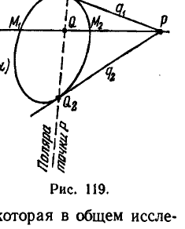
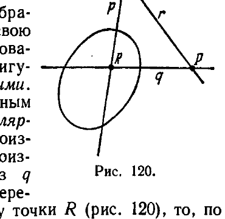
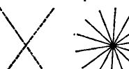

## 13. Образы второй степени. Теория поляр

---
**стр. 376**
---

*Алгебраической поверхностью* называется совокупность точек, координаты которых удовлетворяют уравнению

$$\sum a_{\alpha_1 \alpha_2 \dots \alpha_m} x_{\alpha_1} x_{\alpha_2} \dots x_{\alpha_m} = 0$$

$(\alpha_1, \alpha_2, \dots, \alpha_m = 1, 2, 3, 4),$

левая часть которого представляет собой однородную форму от переменных $x_1, x_2, x_3, x_4$ степени $m$. Число $m$ называется *порядком поверхности*.

*Алгебраической связкой* называется совокупность плоскостей, координаты которых удовлетворяют уравнению

$$\sum a_{\alpha_1 \alpha_2 \dots \alpha_m} u_{\alpha_1} u_{\alpha_2} \dots u_{\alpha_m} = 0$$

$(\alpha_1, \alpha_2, \dots, \alpha_m = 1, 2, 3, 4),$

левая часть которого представляет собой однородную форму переменных $u_1, u_2, u_3, u_4$ степени $m$. Число $m$ называется *классом связки*.

Алгебраические образы называются *вещественными*, если они могут быть представлены уравнениями с вещественными коэффициентами.

Распространяя рассуждения, приведенные в § 126, на трехмерный случай, можно доказать, что

порядок алгебраической поверхности равен числу ее точек (вещественных и мнимых), принадлежащих одной прямой.

класс алгебраической связки равен числу ее плоскостей (вещественных и мнимых), проходящих через одну прямую.

В заключение отметим, что не все свойства уравнений алгебраических образов выражают геометрические свойства этих образов, а лишь те, которые не меняются при любом преобразовании проективных координат.

*Таким образом, задача исследования алгебраических поверхностей и связок в трехмерной проективной геометрии равносильна алгебраической задаче исследования инвариантов однородных форм от четырех аргументов.*

**13. Образы второй степени. Теория поляр**

Общая задача исследования алгебраических образов данного порядка или класса $m$ заключается в разыскании полной системы инвариантов однородного уравнения степени $m$, т. е. такой системы функций от коэффициентов уравнения степени $m$, которые:

1) инвариантны относительно линейного однородного преобразования аргументов левой части уравнения,

2) таковы, что если для двух уравнений степени $m$ с численно заданными коэффициентами эти функции принимают соответственно равные значения, то данные уравнения преобразуются друг в друга при помощи некоторого линейного преобразования аргументов.

---
**стр. 377**
---

Иначе говоря, зная полную систему инвариантов уравнения степени $m$, мы можем по поводу двух произвольных образов порядка или класса $m$ всегда решить вопрос, являются ли они проективно тождественными или нет.

Эта задача для больших $m$ даже в двумерной геометрии представляет огромные трудиости. Для $m = 3$ она была значительно продвинута Ньютоном *), который дал полиую классификацию линий 3-го порядка, т. е. указал все проективно различные виды этих линий, из которых остальные получаются проективными преобразованиями. Случай $m = 2$ наиболее прост и полностью изучен совершенно элементарными средствами. Его мы рассмотрим в настоящем разделе с некоторой подробностью.

Мы будем в своих рассмотрениях ограничиваться преимущественно двумерной геометрией; почти все результаты, которые мы получим, переносятся в трехмерную геометрию путем стандартных изменений формулировок и уравнений. Заметим еще, что при изучении образов второй степени нам достаточно будет исследовать линии второго порядка; свойства пучков второго класса тогда могут быть получены при помощи принципа двойственности.

Мы начнем с изложения теории поляр, которая в общем исследовании образов 2-й степени играет важную роль.

**§ 131. О п р е д е л е н и е и г л а в н е й ш и е с в о й с т в а п о л я р.**

Пусть дана некоторая (вещественная) линия второго порядка, определенная уравнением

$$\sum a_{ik}x_i x_k = 0 \quad (a_{ik} = a_{ki}), \tag{α}$$

которое в подробной записи имеет вид:

$$a_{11}x_1^2 + 2a_{12}x_1x_2 + a_{22}x_2^2 + 2a_{13}x_1x_3 + 2a_{23}x_2x_3 + a_{33}x_3^2 = 0.$$

Мы будем говорить, что точки $P$ и $Q$ гармонически расположены относительно данной линии второго порядка $(\alpha)$, если пара точек $P, Q$ гармонически сопряжена с парой точек $M_1, M_2$, в которых эта линия пересекает прямую $PQ$ (рис. 119).

*Геометрическое место точек, гармонически расположенных с точкой $P$ относительно линии второго порядка, называется* **п о л я р о й** *точки $P$ относительно этой линии.*

Мы докажем сейчас, что поляра является прямой. С этой целью выведем уравнение поляры.

*) См. Ф. Клейн, Высшая геометрия, § 36, ГОНТИ, 1939.

<!-- вероятная опечатка оригинала: «трудиости» вместо «трудности»; «полиую» вместо «полную» -->

---
**стр. 378**
---

Предварительно постараемся получить условие для координат $p_i$ и $q_i$ точек $P$ и $Q$, при котором точки $P$, $Q$ гармонически расположены относительно линии $(\alpha)$. Как нам известно, координаты $x_i$ любой точки $M$, расположенной на прямой $PQ$, имеют вид

$$x_i = p_i + \lambda q_i \quad (i = 1, 2, 3).$$

Общие точки линии $(\alpha)$ и прямой $PQ$ мы найдем, если в качестве $\lambda$ выберем корни $\lambda_1$ и $\lambda_2$ квадратного уравнения

$$\sum a_{ik}(p_i + \lambda q_i)(p_k + \lambda q_k) = 0,$$

которое может быть написано в форме

$$\lambda^2 \sum a_{ik} q_i q_k + \lambda \left(\sum a_{ik} p_i q_k + \sum a_{ik} p_k q_i\right) + \sum a_{ik} p_i p_k = 0,$$

или вследствие симметрии $a_{ik} = a_{ki}$ — в форме

$$\lambda^2 \sum a_{ik} q_i q_k + 2\lambda \sum a_{ik} p_i q_k + \sum a_{ik} p_i p_k = 0.$$

Согласно § 119 две пары точек $p_i, q_i$ и $p_i + \lambda_1 q_i, p_i + \lambda_2 q_i$ гармонически сопряжены, если $\frac{\lambda_1}{\lambda_2} = -1$ или $\lambda_1 + \lambda_2 = 0$. Отсюда и вследствие теоремы Виетта имеем искомое условие гармонического расположения точек $P, Q$ относительно линии $(\alpha)$:

$$\sum a_{ik} p_i q_k = 0. \tag{β}$$

Предполагая $Q$ произвольной точкой, гармонически расположенной с точкой $P$ относительно линии $(\alpha)$, и изменяя обозначения ее координат $q_1, q_2, q_3$ на $x_1, x_2, x_3$, получим уравнение поляры точки $P$

$$\sum a_{ik} p_i x_k = 0 \tag{γ}$$

с текущими координатами $x_k$. В подробной записи уравнение $(\gamma)$ имеет вид

$$(a_{11} p_1 + a_{21} p_2 + a_{31} p_3)x_1 + (a_{12} p_1 + a_{22} p_2 + a_{32} p_3)x_2 +$$
$$+ (a_{13} p_1 + a_{23} p_2 + a_{33} p_3)x_3 = 0. \tag{δ}$$

Мы видим, что это — уравнение первой степени; следовательно, поляра действительно есть прямая линия.

Если мы введем обозначение $\sum a_{ik} p_i p_k = \Phi(p_1, p_2, p_3)$, то уравнение поляры можно будет написать в виде

$$\frac{\partial \Phi}{\partial p_1} x_1 + \frac{\partial \Phi}{\partial p_2} x_2 + \frac{\partial \Phi}{\partial p_3} x_3 = 0.$$

По форме записи оно не отличается от представленного в однородных координатах уравнения прямой, касающейся линии $\Phi(p_1, p_2, p_3) = 0$ в точке $(p_1, p_2, p_3)$; оно хорошо известно в анализе

---
**стр. 379**
---

и в дифференциальной геометрии. Так как определение касательной и вывод ее уравнения, обычные в анализе, опираются лишь на такие свойства линий, которые имеют место в проективной геометрии, то мы вправе утверждать следующую теорему.

**Т е о р е м а 49.** *Если точка $P$ лежит на линии второго порядка, то полярой ее является прямая, касательная к данной линии в этой точке.*

Далее, должна быть отмечена важная теорема, относящаяся к полярам произвольных точек:

**Т е о р е м а 50 (п р и н ц и п в з а и м н о с т и в т е о р и и п о л я р).** *Если поляра точки $P$ проходит через точку $Q$, то поляра точки $Q$ проходит через точку $P$.*

Доказательство этого предложения непосредственно вытекает из уравнения поляры. В самом деле, если $p_i$ — координаты точки $P$, то поляра этой точки имеет уравнение

$$\sum a_{ik}p_i x_k = 0,$$

и если $q_i$ — координаты точки $Q$, то поляра точки $Q$ имеет уравнение

$$\sum a_{ik}q_i x_k = 0.$$

Вследствие симметрии $a_{ik} = a_{ki}$ имеем:

$$\sum a_{ik}p_i q_k = \sum a_{ik}q_i p_k.$$

Поэтому равенство $\sum a_{ik}p_i q_k = 0$, выражающее принадлежность точки $Q$ поляре точки $P$, влечет равенство $\sum a_{ik}q_i p_k = 0$, выражающее принадлежность точки $P$ поляре точки $Q$.

Из теорем 49 и 50 непосредственно вытекает следующая

**Т е о р е м а 51.** *Прямые, проходящие через некоторую точку $P$ и касающиеся линии второго порядка, имеют точки прикосновения на поляре точки $P$ (рис. 119).*

В самом деле, если $q_1$ — касательная и $Q_1$ — ее точка прикосновения, то по теореме 49 прямая $q_1$ является полярой своей точки прикосновения $Q_1$; а так как прямая $q_1$ проходит через точку $P$, то вследствие теоремы 50 поляра точки $P$ проходит через точку $Q_1$, что и утверждается теоремой.

Заметим, что теореме 51 можно дать совершенно наглядное доказательство, рассматривая касательную $PQ_1$ как предел секущей $PM_2M_1$.

**§ 132.** Если прямая $p$ есть поляра точки $P$, то эта точка $P$ называется **полюсом** прямой $p$.

Естественно поставить вопрос: каждая ли прямая имеет полюс? Чтобы решить этот вопрос, сравним уравнение произвольной прямой

$$u_1 x_1 + u_2 x_2 + u_3 x_3 = 0 \tag{8}$$

---
**стр. 380**
---

с уравнением поляры $(\delta)$. Очевидно, прямая $(\varepsilon)$ будет полярой некоторой точки, если ее уравнению можно придать форму уравнения поляры, т. е. если существуют такие числа $p_1, p_2, p_3$, что

$$\left. \begin{aligned} a_{11}p_1 + a_{21}p_2 + a_{31}p_3 = u_1, \\ a_{12}p_1 + a_{22}p_2 + a_{32}p_3 = u_2, \\ a_{13}p_1 + a_{23}p_2 + a_{33}p_3 = u_3; \end{aligned} \right\} \quad (\zeta)$$

тогда точка с координатами $p_1, p_2, p_3$ и будет полюсом прямой $(\varepsilon)$. Система $(\zeta)$ имеет решения при любых значениях $u_1, u_2, u_3$ в том и только в том случае, когда определитель

$$\Delta = \begin{vmatrix} a_{11} & a_{12} & a_{13} \\ a_{21} & a_{22} & a_{23} \\ a_{31} & a_{32} & a_{33} \end{vmatrix}$$

отличен от нуля. Поэтому мы можем высказать следующее предложение:

*Если линия второго порядка удовлетворяет условию $\Delta \neq 0$, то относительно такой линии каждая прямая имеет полюс.*

Линии, для которых $\Delta = 0$, мы будем называть *вырожденными* (наглядное описание вырожденных линий будет дано в § 134).

Следует отметить еще одно важное обстоятельство. Мы можем по формуле $(\delta)$ составить уравнение поляры для любой точки $(p_1, p_2, p_3)$. Однако не всегда при этом будет получаться определенное уравнение, именно, не исключена возможность равенств

$$\begin{aligned} a_{11}p_1 + a_{21}p_2 + a_{31}p_3 = 0, \\ a_{12}p_1 + a_{22}p_2 + a_{32}p_3 = 0, \\ a_{13}p_1 + a_{23}p_2 + a_{33}p_3 = 0. \end{aligned} \quad (*)$$

Не вдаваясь в подробности исследования этого случая, заметим лишь, что если $p_1, p_2, p_3$ удовлетворяют соотношениям $(*)$, то

$$\sum a_{ik} p_i p_k = (a_{11}p_1 + a_{21}p_2 + a_{31}p_3) p_1 + (a_{12}p_1 + a_{22}p_2 + a_{32}p_3) p_2 +$$

$$+ (a_{13}p_1 + a_{23}p_2 + a_{33}p_3) p_3 = 0$$

и, следовательно, точка $(p_1, p_2, p_3)$ лежит на линии второго порядка. Таким образом:

*Неопределенную поляру могут иметь только точки, лежащие на данной линии второго порядка.*

Кроме того, так как при условии $\Delta \neq 0$ система $(*)$ несовместна (решение $p_1 = p_2 = p_3 = 0$ исключается), то можно утверждать предложение: *относительно невырожденной линии второго порядка все точки имеют определенные поляры.*

---
**стр. 381**
---

**§ 133.** Пусть дана какая-нибудь невырожденная линия второго порядка. Тогда мы можем с каждой точкой плоскости сопоставить вполне определенную прямую — ее поляру, а с каждой прямой — вполне определенную точку — ее полюс.

Нетрудно показать, что при этом:

1) разным точкам соответствуют разные прямые,

2) разным прямым соответствуют разные точки;

3) точке пересечения двух прямых соответствует прямая, соединяющая их полюсы (это следует из теоремы 50);

4) прямой, соединяющей две точки, соответствует точка пересечения их поляр (это следует также из теоремы 50).

Вообще, при указанном сопоставлении геометрических элементов каждой фигуре $A$, состоящей из точек и прямых, соответствует некоторая фигура $A'$, которая называется *полярным преобразованием* фигуры $A$ относительно данной линии второго порядка.

Если фигура $A'$ есть полярное преобразование фигуры $A$, то фигура $A$ в свою очередь является полярным преобразованием фигуры $A'$; поэтому такие две фигуры называются также *взаимно полярными*. Фигура, совпадающая со своим полярным преобразованием, называется *автополярной*. Например, если мы возьмем произвольную точку $P$, на поляре ее $p$ — произвольную точку $Q$ и обозначим через $q$ поляру точки $Q$, через $R$ — точку пересечения прямых $p$, $q$ и через $r$ — поляру точки $R$ (рис. 120), то, по теореме 50, прямая $q$ пройдет через $P$, а прямая $r$ — через $P$ и $Q$; мы получим *автополярный трехвершинник*, каждая сторона которого является полярой противоположной вершины и, следовательно, каждая вершина — полюсом противоположной стороны.

Автополярные трехвершинники будут существенно использованы в следующем параграфе. Заметим еще, что взаимно полярные фигуры вместе с тем являются и взаимно двойственными. Именно при помощи полярных преобразований фигур открыл принцип двойственности его автор — Понселе.

**§ 134.** Теперь мы вплотную подходим к решению задачи определения всех проективно различных линий второго порядка и разыскания полной системы инвариантов уравнения второй степени.

Чтобы найти все виды линий второго порядка, мы будем строить такую систему координат, по отношению к которой уравнение произвольно заданной линии второго порядка принимает наиболее простую форму.

---
**стр. 382**
---

Пусть дана произвольная линия второго порядка $k$. Выберем вне этой линии какую угодно точку $P$ и обозначим через $p$ ее поляру; согласно замечанию, сделанному в конце § 132, прямая $p$ будет вполне определенной, так как $P$ не принадлежит линии. Вслед за тем введем проективную систему координат, располагая вершины координатного триэдра так, что одна вершина $A_1(1, 0, 0)$ совместилась в точку $P$, а две другие вершины $A_2(0, 1, 0)$ и $A_3(0, 0, 1)$ расположились как-нибудь на прямой $p$; точку единиц $E(1, 1, 1)$ возьмем произвольно. Пусть

$$\sum a_{ik} x_i x_k = 0$$

— уравнение линии $k$ в установленных координатах. Заметим теперь, что прямая $p$, поскольку она представляет собой сторону $A_2 A_3$ координатного триэдра, имеет уравнение

$$x_1 = 0. \quad (*)$$

С другой стороны, уравнение этой же прямой, как поляры точки $A_1(1, 0, 0)$, может быть составлено по формуле (б) § 131; подставляя в эту формулу $p_1 = 1, p_2 = 0, p_3 = 0$, получим:

$$a_{11} x_1 + a_{12} x_2 + a_{13} x_3 = 0. \quad (**)$$

Так как уравнения $(*)$ и $(**)$ определяют одну прямую, то необходимо

$$a_{12} = 0, \quad a_{13} = 0.$$

Таким образом, уравнение линии $k$ в наших координатах принимает вид

$$a_{11} x_1^2 + a_{22} x_2^2 + 2 a_{23} x_2 x_3 + a_{33} x_3^2 = 0.$$

Если $a_{23} \neq 0$, то мы будем производить дальнейшую специализацию выбора координатного триэдра. Именно, точку $A_2$ выберем на прямой $p$ как угодно, но при условии, чтобы она не принадлежала линии $k$; это возможно, так как в случае $a_{23} \neq 0$ на прямой $x_1 = 0$ существуют точки $(0, x_2, x_3)$, для которых $a_{22} x_2^2 + 2 a_{23} x_2 x_3 + a_{33} x_3^2 \neq 0$. В качестве же $A_3$ возьмем точку пересечения прямой $p$ с полярой точки $A_2$; в выборе точки $A_3$ уже нет произвола, ибо, поскольку $A_2$ не лежит на линии $k$, она имеет определенную поляру.

Построенный нами координатный триэдр $A_1 A_2 A_3$ является автополярным относительно линии $k$, т. е. каждая его сторона представляет собой поляру противоположной вершины. В частности, прямая $A_1 A_3$, уравнение которой

$$x_2 = 0, \quad (***)$$

есть поляра точки $A_2(0, 1, 0)$; подставляя в формулу (б) § 131 $p_1 = 0, p_2 = 1, p_3 = 0$, мы получим уравнение поляры точки $A_2$

---
**стр. 383**
---

в виде

$$a_{21} x_1 + a_{22} x_2 + a_{23} x_3 = 0,$$

или, так как $a_{21} = a_{12} = 0$:

$$a_{22} x_2 + a_{23} x_3 = 0. \quad (****)$$

Сравнивая уравнения $(***)$ и $(****)$, найдем:

$$a_{23} = 0.$$

Следовательно, выбирая надлежащим образом координатный триэдр, мы всегда можем уравнение линии второго порядка привести к виду

$$a_{11} x_1^2 + a_{22} x_2^2 + a_{33} x_3^2 = 0. \quad \text{(I)}$$

Что же касается дальнейших упрощений этого уравнения, то в этом вопросе приходится различать три случая:

1. Если $a_{22} = a_{33} = 0$, то уравнение (I) имеет вид

$$x_1^2 = 0, \quad (1)$$

и дальнейшие его упрощения невозможны.

2. Если $a_{33} = 0$ и $a_{11} \neq 0$, $a_{22} \neq 0$, то при помощи преобразования координат *)

$$x'_1 = \sqrt{|a_{11}|} x_1, \quad x'_2 = \sqrt{|a_{22}|} x_2, \quad x'_3 = x_3$$

уравнение (I) может быть приведено к виду

$$\pm x'_1{}^2 \pm x'_2{}^2 = 0. \quad (2)$$

3. Если $a_{11} \neq 0$, $a_{22} \neq 0$, $a_{33} \neq 0$, то после преобразования

$$x'_1 = \sqrt{|a_{11}|} x_1, \quad x'_2 = \sqrt{|a_{22}|} x_2, \quad x'_3 = \sqrt{|a_{33}|} x_3$$

найдем:

$$\pm x'_1{}^2 \pm x'_2{}^2 \pm x'_3{}^2 = 0. \quad (3)$$

Эти упрощения, которые производятся уже при выбранном координатном триэдре $A_1 A_2 A_3$, требуют, очевидно, изменения точки единиц.

Простейшие уравнения (1), (2), (3) линии второго порядка называются каноническими. При помощи надлежащего изменения нумерации координат и умножения на $-1$ эти уравнения могут быть сведены к следующим:

$$x_1^2 = 0; \quad (1)$$

$$\left. \begin{aligned} x_1^2 + x_2^2 &= 0, \\ x_1^2 - x_2^2 &= 0; \end{aligned} \right\} \quad (2)$$

$$\left. \begin{aligned} x_1^2 + x_2^2 + x_3^2 &= 0, \\ x_1^2 + x_2^2 - x_3^2 &= 0. \end{aligned} \right\} \quad (3)$$

---

*) Напомним еще раз, что мы рассматриваем только вещественные линии и вещественные преобразования (т. е. все коэффициенты уравнений линий и формул преобразований предполагаются вещественными).

---
**стр. 384**
---

Уравнение (1) определяет дважды взятую прямую $x_1 = 0$. Каждое из уравнений (2) определяет пару различных прямых, именно, уравнение $x_1^2 + x_2^2 = 0$ — пару мнимых прямых $x_1 + ix_2 = 0$, $x_1 - ix_2 = 0$, уравнение $x_1^2 - x_2^2 = 0$ — пару вещественных прямых $x_1 + x_2 = 0$, $x_1 - x_2 = 0$.

Все линии второго порядка (1) и (2) — вырожденные, так как для уравнений $x_1^2 = 0$, $x_1^2 + x_2^2 = 0$, $x_1^2 - x_2^2 = 0$ соответственно имеем:

$$\Delta = \begin{vmatrix} 1 & 0 & 0 \\ 0 & 0 & 0 \\ 0 & 0 & 0 \end{vmatrix} = 0, \quad \Delta = \begin{vmatrix} 1 & 0 & 0 \\ 0 & 1 & 0 \\ 0 & 0 & 0 \end{vmatrix} = 0, \quad \Delta = \begin{vmatrix} 1 & 0 & 0 \\ 0 & -1 & 0 \\ 0 & 0 & 0 \end{vmatrix} = 0.$$

Уравнения (3) определяют невырожденные линии второго порядка, так как для этих уравнений

$$\Delta = \begin{vmatrix} 1 & 0 & 0 \\ 0 & 1 & 0 \\ 0 & 0 & \pm 1 \end{vmatrix} \neq 0.$$

Вырожденные линии, следовательно, являются парами прямых. Первому из уравнений (3) соответствует линия, не обладающая ни одной вещественной точкой; она называется *нулевой*. Второму из уравнений (3) соответствует кривая в собственном смысле этого слова; она называется *овальной*. Овальная кривая разбивает (вещественную) проективную плоскость на две области, из которых первая характеризуется условием

$$x_1^2 + x_2^2 - x_3^2 < 0$$

и называется *внутренней*, вторая — условием

$$x_1^2 + x_2^2 - x_3^2 > 0$$

и называется *внешней*. Чтобы наглядно представить себе структуру этих областей, заметим, что прямая $x_3 = 0$ не пересекает внутреннюю область, так как при $x_3 = 0$ и при вещественных $x_1, x_2$ неравенство $x_1^2 + x_2^2 - x_3^2 < 0$ невозможно; поэтому для всех точек внутренней области $x_3 \neq 0$ и мы можем определять их неоднородными координатами $x = \frac{x_1}{x_3}$ и $y = \frac{x_2}{x_3}$. В неоднородных координатах внутренняя область характеризуется соотношением

$$x^2 + y^2 < 1$$

и, следовательно, топологически эквивалентна евклидову кругу*);

---

*) Две фигуры называются *топологически эквивалентными*, если множество точек одной из них допускает взаимно однозначное и в обе стороны непрерывное отображение на множество точек другой. Например, квадрат и круг топологически эквивалентны. Также эквивалентны куб и шар. Напротив, шар и тор топологически различны.

---
**стр. 385**
---

отсюда следует, что внешняя область является листом Мёбиуса (см. § 240).

Теперь мы можем указать и полную систему инвариантов общего уравнения линии второго порядка

$$\sum a_{ik} x_i x_k = 0.$$

В первую очередь мы отметим в качестве инварианта этого уравнения ранг его матрицы

$$A = \begin{Vmatrix} a_{11} & a_{12} & a_{13} \\ a_{21} & a_{22} & a_{23} \\ a_{31} & a_{32} & a_{33} \end{Vmatrix}$$

Здесь мы просто сошлемся на известное в алгебре (в разделе о квадратичных формах) предложение, гласящее: если аргументы $x_i$ квадратичной формы $\sum a_{ik} x_i x_k$ заменить линейными однородными функциями новых аргументов $x'_i$, то при условии, что определитель, составленный из коэффициентов этих функций, отличен от нуля, квадратичная форма $\sum a'_{ik} x'_i x'_k$, получающаяся при таком преобразовании, имеет матрицу $A'$ того же ранга, что и матрица $A$ исходной формы:

$$\text{Rang } A' = \text{Rang } A.$$

Просматривая уравнения (1), (2), (3), мы видим, что ранг матрицы уравнения (1) равен 1, ранг матрицы уравнений (2) равен 2 и ранг матрицы уравнений (3) равен 3.

Так как ранг матрицы является инвариантом, то, имея уравнение произвольной линии второго порядка в любых координатах, мы по рангу его матрицы всегда можем определить, к какой из трех групп канонических уравнений (1), (2), (3) оно может быть приведено.

Далее, инвариантом уравнения $\sum a_{ik} x_i x_k = 0$ является сигнатура его левой части.

Сигнатурой квадратичной формы называется абсолютная величина разности между числом положительных и числом отрицательных членов в ее каноническом представлении. Инвариантность сигнатуры выражает известная в алгебре теорема об инерции квадратичных форм: канонические представления квадратичной формы, получаемые различными вещественными линейными преобразованиями, имеют одинаковую сигнатуру.

Зная, кроме ранга матрицы $A$, еще и сигнатуру левой части общего уравнения кривой второго порядка, мы не только можем указать, к какой из трех групп (1), (2), (3) канонических уравнений оно может быть приведено, но также — и к какому уравнению внутри соответствующей группы.

---
**стр. 386**
---

Следовательно, ранг матрицы и сигнатура уравнения линии второго порядка составляют полную систему его инвариантов.

Мы видим, что уравнение линии второго порядка имеет лишь два инварианта, для целочисленных значений которых имеется только пять различных комбинаций; соответственно этому имеется только пять проективно различных линий второго порядка, все остальные могут быть получены из них проективными преобразованиями.

Классификация линий второго порядка дается следующей таблицей:

| Каноническая форма уравнения | Вид линии | Ранг | Сигнатура |
|---|---|---:|---:|
| $x_1^2 = 0$ | пара слившихся прямых | 1 | 1 |
| $x_1^2 + x_2^2 = 0$ | пара мнимых прямых | 2 | 2 |
| $x_1^2 - x_2^2 = 0$ | пара вещественных прямых | 2 | 0 |
| $x_1^2 + x_2^2 + x_3^2 = 0$ | нулевая линия | 3 | 3 |
| $x_1^2 + x_2^2 - x_3^2 = 0$ | овальная кривая | 3 | 1 |

*(первые три строки — вырожденные линии; последние две — невырожденные)*

В отличие от линий второго порядка линии высших порядков всегда имеют континуальные инварианты и даже в классе линий третьего порядка имеется бесконечное множество проективно различных.

**§ 135.** Теперь мы в немногих словах изложим главнейшие факты из теории пучков второго класса.

Общее уравнение пучка второго класса имеет вид

$$\sum a_{ik}u_i u_k = 0, \tag{α}$$

или, в более подробной записи:

$$a_{11}u_1^2 + 2a_{12}u_1u_2 + a_{22}u_2^2 + 2a_{13}u_1u_3 + 2a_{23}u_2u_3 + a_{33}u_3^2 = 0;$$

здесь $u_1, u_2, u_3$ — текущие координаты произвольной прямой пучка. Мы будем говорить, что прямые $s$ и $t$ гармонически расположены относительно данного пучка второго класса $(\alpha)$, если пара прямых $s$ и $t$ гармонически сопряжена с парой прямых пучка $(\alpha)$, проходящих через общую точку прямых $s$ и $t$.

По координатам $s_i, t_i$ прямых $s, t$ условие гармоничности их расположения относительно пучка $(\alpha)$ может быть записано в виде

$$\sum a_{ik}s_i t_k = 0. \tag{β}$$

Это соотношение получается при помощи вывода, двойственного выводу соотношения $(\beta)$ § 131.

---
**стр. 387**
---

Отсюда следует, что совокупность прямых, гармонически расположенных с фиксированной прямой $s$ относительно пучка $(\alpha)$, определяется уравнением

$$\sum a_{ik}s_i u_k = 0, \tag{γ}$$

где $u_k$ — текущие координаты (т. е. координаты произвольной прямой рассматриваемой совокупности).

Уравнение $(\gamma)$ есть уравнение первой степени; следовательно, прямые, гармонически расположенные с фиксированной прямой $s$, составляют пучок первого класса; центр его $S$ называется *полюсом прямой s относительно данного пучка второго класса*.

Если мы введем обозначение $\sum a_{ik}s_i s_k = \Phi(s_1, s_2, s_3)$, то уравнение $(\gamma)$ можно будет написать в виде

$$\frac{\partial \Phi}{\partial s_1} u_1 + \frac{\partial \Phi}{\partial s_2} u_2 + \frac{\partial \Phi}{\partial s_3} u_3 = 0; \tag{δ}$$

коэффициенты $\frac{\partial \Phi}{\partial s_1}, \frac{\partial \Phi}{\partial s_2}, \frac{\partial \Phi}{\partial s_3}$ уравнения $(\delta)$ суть координаты точки $S$.

Полюс прямой относительно пучка второго класса есть образ, двойственный поляре точки относительно линии второго порядка. Пучок второго класса $(\alpha)$ представляет собой семейство прямых, определяемых уравнениями

$$u_1 x_1 + u_2 x_2 + u_3 x_3 = 0, \tag{*}$$

коэффициенты которых $u_k$ связаны условием

$$\Phi(u_1, u_2, u_3) = 0.$$

Будем искать характеристические точки этого семейства, т. е. точки прикосновения прямых семейства с огибающей. По правилам дифференциальной геометрии характеристическая точка прямой $(u_1, u_2, u_3)$ определяется уравнением $(*)$ при добавочном соотношении

$$x_1 du_1 + x_2 du_2 + x_3 du_3 = 0, \tag{**}$$

где $du_1, du_2, du_3$ связаны равенством

$$\frac{\partial \Phi}{\partial u_1} du_1 + \frac{\partial \Phi}{\partial u_2} du_2 + \frac{\partial \Phi}{\partial u_3} du_3 = 0. \tag{***}$$

Сопоставляя равенства $(**)$ и $(***)$ и принимая во внимание, что кроме условия $(***)$ других ограничений для величин $du_1, du_2, du_3$ нет, можем заключить, что $x_1, x_2, x_3$ пропорциональны числам $\frac{\partial \Phi}{\partial u_1}, \frac{\partial \Phi}{\partial u_2}, \frac{\partial \Phi}{\partial u_3}$. Иначе говоря, $\frac{\partial \Phi}{\partial u_1}, \frac{\partial \Phi}{\partial u_2}, \frac{\partial \Phi}{\partial u_3}$ суть координаты характеристической точки прямой $(u_1, u_2, u_3)$.

---
**стр. 388**
---

По аналогии нам ясно, что координаты касательной к линии $\Phi(p_1, p_2, p_3) = 0$ в точке $(p_1, p_2, p_3)$ суть $\frac{\partial \Phi}{\partial p_1}, \frac{\partial \Phi}{\partial p_2}, \frac{\partial \Phi}{\partial p_3}$. Характеристические точки пучка второго класса определяются уравнением пучка совершенно так же, как касательные к линии второго порядка — уравнением линии.

Координаты полюса прямой $(s_1, s_2, s_3)$ суть $\frac{\partial \Phi}{\partial s_1}, \frac{\partial \Phi}{\partial s_2}, \frac{\partial \Phi}{\partial s_3}$. Отсюда, по принципу двойственности, непосредственно вытекает следующая теорема, двойственная теореме 49:

*Если прямая $s$ принадлежит пучку второго класса, то полюсом ее является характеристическая точка.*

Как и кривые второго порядка, пучки второго класса подразделяются на вырожденные и невырожденные. Признаком вырожденности является то, что определитель $\Delta = 0$. Геометрический смысл вырожденности состоит, по принципу двойственности, в следующем: если вырожденная линия состоит из точек, лежащих на двух прямых (рис. 121, а), то вырожденный пучок состоит из прямых, проходящих через две точки, т. е. представляет собой пару пучков первого класса (рис. 121, б).

Опираясь на принцип двойственности, мы можем теперь быстро установить

**Т е о р е м а 52.** *Совокупность касательных невырожденной кривой второго порядка есть невырожденный пучок второго класса; огибающая невырожденного пучка второго класса есть невырожденная кривая второго порядка.*

**Д о к а з а т е л ь с т в о.** Мы докажем первую часть этой теоремы; тогда справедливость второй части будет обеспечена

---
**стр. 389**
---

принципом двойственности. Пусть

$$a_{11}x_1^2 + 2a_{12}x_1x_2 + a_{22}x_2^2 + 2a_{13}x_1x_3 + 2a_{23}x_2x_3 + a_{33}x_3^2 = 0$$

— уравнение кривой $k$ второго порядка; $p_1, p_2, p_3$ — координаты точки ее прикосновения к прямой $u_1x_1 + u_2x_2 + u_3x_3 = 0$. Сравнивая общее уравнение касательной

$$(a_{11}p_1 + a_{21}p_2 + a_{31}p_3)x_1 + (a_{12}p_1 + a_{22}p_2 + a_{32}p_3)x_2 +$$
$$+ (a_{13}p_1 + a_{23}p_2 + a_{33}p_3)x_3 = 0$$

с уравнением $u_1x_1 + u_2x_2 + u_3x_3 = 0$, получим равенства

$$\begin{aligned}
a_{11}p_1 + a_{21}p_2 + a_{31}p_3 &= \alpha u_1, \\
a_{12}p_1 + a_{22}p_2 + a_{32}p_3 &= \alpha u_2, \\
a_{13}p_1 + a_{23}p_2 + a_{33}p_3 &= \alpha u_3,
\end{aligned} \tag{*}$$

где $\alpha (\neq 0)$ — произвольный множитель пропорциональности. Кроме того, так как точка прикосновения принадлежит касательной, то

$$u_1 p_1 + u_2 p_2 + u_3 p_3 = 0. \tag{**}$$

Если мы выразим из уравнений $(*)$ величины $p_1, p_2, p_3$ (возможность этого обеспечивается неравенством $\Delta \neq 0$) и подставим их выражения в соотношение $(**)$, то получим некоторую зависимость между $u_1, u_2, u_3$, которую можно рассматривать как условие прикосновения прямой с координатами $(u_1, u_2, u_3)$ к данной линии $k$. Эту же зависимость можно получить, приравнивая нулю определитель системы, состоящей из уравнений $(*)$ и $(**)$:

$$\begin{vmatrix}
a_{11} & a_{21} & a_{31} & u_1 \\
a_{12} & a_{22} & a_{32} & u_2 \\
a_{13} & a_{23} & a_{33} & u_3 \\
u_1 & u_2 & u_3 & 0
\end{vmatrix} = 0. \tag{***}$$

Равенство $(***)$ характеризует координаты касательной, следовательно, как уравнение с текущими координатами $u_1, u_2, u_3$, оно определяет пучок касательных к линии $k$.

Мы видим, что $(***)$ есть уравнение второй степени. Значит, касательные к невырожденной линии второго порядка действительно составляют пучок второго класса.

Нужно еще доказать, что этот пучок — невырожденный.

С этой целью заметим, что при развертывании левой части уравнения $(***)$ получается квадратичная форма

$$A_{11}u_1^2 + 2A_{12}u_1u_2 + A_{22}u_2^2 + 2A_{13}u_1u_3 + 2A_{23}u_2u_3 + A_{33}u_3^2 = 0,$$

---
**стр. 390**
---

коэффициенты которой $A_{ik}$ являются минорами элементов $a_{ik}$ матрицы

$$A = \begin{Vmatrix} a_{11} & a_{12} & a_{13} \\ a_{21} & a_{22} & a_{23} \\ a_{31} & a_{32} & a_{33} \end{Vmatrix}.$$

Поэтому, если мы разделим левую часть уравнения пучка на величину $\Delta$ и положим $\frac{A_{ik}}{\Delta} = a^*_{ik}$, то уравнение его примет вид

$$a^*_{11} u_1^2 + 2a^*_{12} u_1 u_2 + a^*_{22} u_2^2 + 2a^*_{13} u_1 u_3 + 2a^*_{23} u_2 u_3 + a^*_{33} u_3^2 = 0,$$

у которого матрица в силу известного в линейной алгебре соотношения $A \cdot A^* = \Delta E$ ($E$ — единичная матрица) есть обратная к матрице $A$. Из этого известного алгебраического предложения вытекает, что определители $\Delta$ и $\Delta^*$ этих матриц связаны соотношением $\Delta \Delta^* = 1$, откуда следует, что $\Delta^* \neq 0$.

*Для каждого невырожденного образа второй степени класс и порядок совпадают (= 2).* Это обстоятельство для образов степени $n > 2$ уже не имеет места. Отметим также, что к невырожденной кривой второго порядка из любой точки плоскости можно провести две касательные, вещественные или мнимые.

**§ 136.** Изложенные нами для случая двумерной геометрии методы исследования образов второй степени, естественно, обобщаются на трехмерный случай и приводят к аналогичным результатам. Согласно теории квадратичных форм, образы второй степени в проективном пространстве характеризуются двумя инвариантами: рангом главной матрицы и сигнатурой левой части уравнения. При помощи линейного преобразования искомый образ

$$a_{11}x_1^2 + a_{22}x_2^2 + a_{33}x_3^2 + a_{44}x_4^2 + 2a_{12}x_1x_2 + 2a_{13}x_1x_3 +$$
$$+ 2a_{14}x_1x_4 + 2a_{23}x_2x_3 + 2a_{24}x_2x_4 + 2a_{34}x_3x_4 = 0$$

---
**стр. 391**
---

может быть проективно преобразована в одну из поверхностей, представленных следующей таблицей:

| Ранг = 1 | Сигнатура | Ранг = 2 | Сигнатура | Ранг = 3 | Сигнатура | Ранг = 4 | Сигнатура |
|---|---:|---|---:|---|---:|---|---:|
| $x_1^2 = 0$ | 1 | $x_1^2 + x_2^2 = 0$ | 2 | $x_1^2 + x_2^2 + x_3^2 = 0$ | 3 | $x_1^2 + x_2^2 + x_3^2 + x_4^2 = 0$ | 4 |
| | | $x_1^2 - x_2^2 = 0$ | 0 | $x_1^2 + x_2^2 - x_3^2 = 0$ | 1 | $x_1^2 + x_2^2 + x_3^2 - x_4^2 = 0$ | 2 |
| | | | | | | $x_1^2 + x_2^2 - x_3^2 - x_4^2 = 0$ | 0 |

Уравнение $x_1^2 = 0$ определяет удвоенную плоскость $x_1 = 0$. Уравнения $x_1^2 + x_2^2 = 0$ и $x_1^2 - x_2^2 = 0$ определяют пары плоскостей; первое — пару мнимых плоскостей $x_1 + ix_2 = 0$ и $x_1 - ix_2 = 0$, второе — пару вещественных плоскостей $x_1 + x_2 = 0$ и $x_1 - x_2 = 0$.

Уравнения $x_1^2 + x_2^2 + x_3^2 = 0$ и $x_1^2 + x_2^2 - x_3^2 = 0$ определяют конус с вершиной в точке $A_4(0, 0, 0, 1)$. Действительно, если точка $M_0(x_1^0, x_2^0, x_3^0, x_4^0)$ принадлежит поверхности, то и любая точка $\overline{M}$ прямой $A_4 M_0$ принадлежит ей. Координаты точки $\overline{M}$ имеют вид

$$\bar{x}_1 = 0 + \lambda x_1^0 = \lambda x_1^0, \quad \bar{x}_3 = 0 + \lambda x_3^0 = \lambda x_3^0,$$
$$\bar{x}_2 = 0 + \lambda x_2^0 = \lambda x_2^0, \quad \bar{x}_4 = 1 + \lambda x_4^0.$$

Действительно, из этих соотношений имеем:

$$\bar{x}_1^2 + \bar{x}_2^2 - \bar{x}_3^2 = \lambda^2((x_1^0)^2 + (x_2^0)^2 - (x_3^0)^2) = 0.$$

Следовательно, всякая точка $\overline{M}$ прямой $A_4 M_0$ принадлежит поверхности, т. е. поверхность есть конус. Конус $x_1^2 + x_2^2 + x_3^2 = 0$ не имеет вещественных образующих и называется *нулевым*; конус $x_1^2 + x_2^2 - x_3^2 = 0$ имеет бесконечно много вещественных образующих и называется *обыкновенным*.

---
**стр. 392**
---

Все перечисленные поверхности называются *вырожденными*; признаком вырожденной поверхности является обращение в нуль определителя матрицы ее уравнения.

Невырожденные поверхности второго порядка представлены в последней графе приведенной выше таблицы.

Первая из них не содержит ни одной вещественной точки и называется *нулевой*.

Вторую называют *овальной*; она топологически эквивалентна евклидовой сфере. Чтобы убедиться в этом, следует заметить, что для всех точек поверхности $x_1^2 + x_2^2 + x_3^2 - x_4^2 = 0$ необходимо $x_4 \neq 0$, поэтому их можно определять неоднородными координатами $x = \frac{x_1}{x_4}$, $y = \frac{x_2}{x_4}$, $z = \frac{x_3}{x_4}$; но в неоднородных координатах уравнение рассматриваемой поверхности имеет вид $x^2 + y^2 + z^2 = 1$ и не отличается от уравнения евклидовой сферы.

Третью поверхность называют *кольцевой*; она топологически эквивалентна тору. Это легко понять, если заметить, что поверхность $x_1^2 + x_2^2 - x_3^2 - x_4^2 = 0$ покрыта прямыми линиями. В самом деле, два уравнения первой степени

$$\left.\begin{aligned}
\mu(x_1 + x_3) &= \lambda(x_2 + x_4), \\
-\lambda(x_1 - x_3) &= \mu(x_2 - x_4)
\end{aligned}\right\}\qquad(*)$$

при любых $\lambda$ и $\mu$ (не равных одновременно нулю) определяют прямую, лежащую на рассматриваемой поверхности, так как уравнение $x_1^2 + x_2^2 - x_3^2 - x_4^2 = 0$ является следствием уравнений $(*)$. Далее, через каждую точку поверхности проходит одна и только одна прямая из системы $(*)$, так как для любых $x_1^0$, $x_2^0$, $x_3^0$, $x_4^0$, удовлетворяющих условию $x_1^{02} + x_2^{02} - x_3^{02} - x_4^{02} = 0$, можно найти одно и только одно отношение $\lambda_0 : \mu_0$ такое, что

$$\begin{aligned}
\mu_0(x_1^0 + x_3^0) &= \lambda_0(x_2^0 + x_4^0), \\
-\lambda_0(x_1^0 - x_3^0) &= \mu_0(x_2^0 - x_4^0).
\end{aligned}$$

Следовательно, при $\lambda = \lambda_0$, $\mu = \mu_0$ прямая $(*)$ проходит через заданную точку $(x_1^0, x_2^0, x_3^0, x_4^0)$. Таким образом, действительные прямые $(*)$ однократно и сплошь покрывают поверхность. Но система этих прямых образует замкнутую «трубку», так как, с одной стороны, проективная прямая замкнута, а с другой, прямые системы $(*)$ проходят через овальную кривую, а именно сечение поверхности $x_1^2 + x_2^2 - x_3^2 - x_4^2 = 0$ плоскостью $x_4 = 0$.

Кроме системы $(*)$, данную поверхность покрывает еще система прямых, определяемых уравнениями

$$\left.\begin{aligned}
\mu(x_1 + x_3) &= \lambda(x_2 - x_4), \\
-\lambda(x_1 - x_3) &= \mu(x_2 + x_4).
\end{aligned}\right\}\qquad(**)$$
