## 14. Конструктивные теоремы и задачи проективной геометрии

---
**стр. 393**
---

Прямые $(*)$ и $(**)$ называются *прямолинейными образующими* поверхности.

Заметим, что хорошо знакомая читателю поверхность евклидова пространства — однополостный гиперболоид — при дополнении евклидова пространства бесконечно удаленными элементами превращается в кольцевую поверхность проективного пространства.

**§ 137.** В этом разделе мы познакомим читателя с некоторыми элементарными теоремами проективной геометрии, относящимися к линиям второго порядка. Они находят себе многочисленные приложения в евклидовых задачах на построение.

У читателя может возникнуть вопрос, имеем ли мы право применять теоремы проективной геометрии к исследованию фигур евклидовой плоскости? Чтобы убедиться в возможности такого применения, достаточно вспомнить, что евклидова плоскость превращается в проективную при помощи добавления бесконечно удаленных элементов. Таким образом, каждый проективный факт можно интерпретировать на плоскости Евклида, если мыслить ее дополненной бесконечно удаленной прямой.

В качестве примера рассмотрим с точки зрения элементарной геометрии сложное отношение четырех точек прямой и сложное отношение четырех лучей пучка.

Пусть $A$, $B$, $C$, $D$ — какие-либо четыре точки евклидовой прямой $a$. Введем на евклидовой плоскости, содержащей прямую $a$, некоторую систему декартовых координат. Ось $x$ для удобства совместим с прямой $a$; абсциссы точек $A$, $B$, $C$, $D$ обозначим через $x_a$, $x_b$, $x_c$, $x_d$. Заметим, что декартова система на евклидовой плоскости является вместе с тем проективной системой, так как в декартовых координатах все прямые имеют уравнения первой степени. Поэтому

$$(ABCD) = \frac{x_c - x_a}{x_b - x_c} : \frac{x_d - x_a}{x_b - x_d}$$

(см. § 115). Но в декартовых координатах $x_c - x_a = AC$, $x_b - x_c = CB$, $x_d - x_a = AD$, $x_b - x_d = DB$, где $AC$, $CB$, $AD$ и $DB$ обозначают взятые с соответствующими знаками длины отрезков с концами $A$ и $C$, $C$ и $B$ и т. д. Следовательно,

$$(ABCD) = \frac{AC}{CB} : \frac{AD}{DB}. \quad (*)$$

Сложное отношение четырех лучей $a$, $b$, $c$, $d$, проходящих через одну точку $O$, в элементарной геометрии может быть определено

---
**стр. 394**
---

формулой

$$(abcd) = \frac{\sin(ac)}{\sin(cb)} : \frac{\sin(ad)}{\sin(db)}, \quad (**)$$

где $(ac)$, $(cb)$ и т. д. обозначают взятые с соответствующими знаками углы между лучами $a$ и $c$, $c$ и $b$ и т. д.*).

Чтобы убедиться в справедливости формулы $(**)$, пересечем лучи $a$, $b$, $c$, $d$ прямой $u$ и обозначим через $A$, $B$, $C$, $D$ точки пересечения, через $h$ — длину перпендикуляра, опущенного из точки $O$ на прямую $u$ (рис. 122). Выражая двумя способами площадь треугольника $OAC$, мы получим:

$$\frac{1}{2} AC \cdot h = \frac{1}{2} OA \cdot OC \cdot \sin(ac).$$

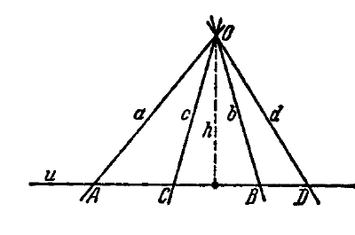

Аналогично из треугольника $OCB$

$$\frac{1}{2} CB \cdot h = \frac{1}{2} OB \cdot OC \cdot \sin(cb).$$

Отсюда

$$\frac{AC}{CB} = \frac{OA}{OB} \cdot \frac{\sin(ac)}{\sin(cb)}. \quad (1)$$

Точно так же, рассматривая треугольники $OAD$ и $ODB$, найдем:

$$\frac{AD}{DB} = \frac{OA}{OB} \cdot \frac{\sin(ad)}{\sin(db)}. \quad (2)$$

Из соотношений (1) и (2) имеем:

$$\frac{AC}{CB} : \frac{AD}{DB} = \frac{\sin(ac)}{\sin(cb)} : \frac{\sin(ad)}{\sin(db)}.$$

После этого ясно, что формула $(**)$ верна, так как сложное отношение $(abcd)$ по определению есть число, равное $(ABCD)$ (см. § 116).

Мы показали сейчас примеры метрической интерпретации проективных объектов. В свою очередь, предложения элементарной геометрии, даже имеющие метрический характер, допускают проективную интерпретацию и часто представляются в новом свете, если их рассматривать с проективной точки зрения.

*) Именно, выберем направление положительных поворотов вокруг точки $O$ и на каждой прямой $a$, $b$, $c$, $d$ введем положительное направление. Тогда под $(ab)$, например, будем подразумевать величину угла, который составляет положительное направление прямой $b$ с положительным направлением прямой $a$; эту величину будем считать положительной, если внутри указанного угла переход от $a$ к $b$ совершается в положительном направлении вокруг $O$, и отрицательной — в противном случае. Можно показать, что правая часть равенства $(**)$ не зависит от того, как выбираются положительные повороты вокруг $O$ и какое направление на каждой из прямых $a$, $b$, $c$, $d$ выбрано в качестве положительного.

---
**стр. 395**
---

Например, теорема элементарной геометрии: прямая, соединяющая точку пересечения диагоналей трапеции с точкой пересечения непараллельных сторон, делит параллельные стороны трапеции пополам — имеет весьма прозрачный проективный смысл, именно: середина отрезка вместе с бесконечно удаленной точкой гармонически разделяет пару его концов. В самом деле, рассматривая трапецию, изображенную на рис. 123, легко признать в ней полный четырехвершинник с одной бесконечно удаленной диагональной точкой; из гармонических свойств этого четырехвершинника следует, что пара точек $A$, $B$ гармонически разделяется парой точек $O$, $\infty$. Иначе можно сказать: евклидов центр отрезка совпадает с его проективным центром.

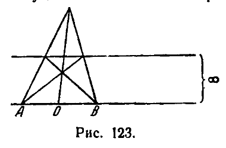

Как было замечено немного выше, каждая декартова система координат на евклидовой плоскости является вместе с тем проективной системой. Отсюда следует, что линии второго порядка, изучаемые в аналитической геометрии, суть те же самые объекты, о которых у нас шла речь в предыдущих разделах, вернее сказать, становятся таковыми после дополнения евклидовой плоскости бесконечно удаленными элементами. В самом деле, если, исходя из декартовых координат $x$, $y$, мы введем однородные координаты $x_1$, $x_2$, $x_3$, полагая $x = \frac{x_1}{x_3}$, $y = \frac{x_2}{x_3}$, то общее уравнение кривой второго порядка в декартовых координатах

$$a_{11}x^2 + 2a_{12}xy + a_{22}y^2 + 2a_{13}x + 2a_{23}y + a_{33} = 0$$

примет вид

$$a_{11}x_1^2 + 2a_{12}x_1x_2 + a_{22}x_2^2 + 2a_{13}x_1x_3 + 2a_{23}x_2x_3 + a_{33}x_3^2 = 0$$

и совпадает с тем, какое мы изучали выше.

Ниже приводится ряд предложений и задач; все их можно рассматривать как предложения и задачи элементарной геометрии.

**§ 138.** Этот параграф в данном разделе занимает совершенно изолированное положение и не связан с остальным материалом раздела. Здесь сообщаются предложения вспомогательного характера, которые будут использованы значительно позднее (в гл. IX).

Рассмотрим в евклидовой плоскости с заданной на ней системой декартовых координат какой-нибудь круг $k$. Пусть дано взаимно однозначное отображение внутренней области круга $k$ на себя; обозначим это отображение символом $\varphi$. Предположим, что $\varphi$ отображает точки, лежащие на одной прямой, в точки, также лежащие на одной прямой, а точки, не лежащие на одной прямой, в точки, также не лежащие на одной прямой. Иначе говоря, мы предполагаем, что отображение $\varphi$ каждую хорду круга $k$ переводит снова в хорду и разные хорды переводит в разные хорды.

---
**стр. 396**
---

При этих условиях для отображения $\varphi$ координаты образа выражаются через координаты прообраза формулами

$$x' = \frac{a_1 x + b_1 y + c_1}{\alpha x + \beta y + \gamma},$$

$$y' = \frac{a_2 x + b_2 y + c_2}{\alpha x + \beta y + \gamma} \quad (1)$$

где $a_1$, $b_1$, $\ldots$, $\gamma$ — некоторые постоянные, удовлетворяющие неравенству

$$\Delta = \begin{vmatrix} a_1 & b_1 & c_1 \\ a_2 & b_2 & c_2 \\ \alpha & \beta & \gamma \end{vmatrix} \neq 0. \quad (2)$$

Д о к а з а т е л ь с т в о. Пусть $P$ — произвольная точка, лежащая внутри $k$; $a$, $b$, $c$, $d$ — четыре хорды, проходящие через $P$. Предположим, что $a$, $b$ гармонически разделяют $c$, $d$. Тогда можно построить четырехвершинник $G$, вершины которого находятся на хордах $a$, $b$, а диагональные точки — на хордах $c$, $d$. При отображении $\varphi$ точка $P$ перейдет в некоторую точку $P'$, хорды $a$, $b$, $c$, $d$ перейдут в некоторые хорды $a'$, $b'$, $c'$, $d'$. Четырехвершинник $G$ перейдет в четырехвершинник $G'$, у которого вершины будут находиться на хордах $a'$, $b'$, а диагональные точки — на хордах $c'$, $d'$.

Значит, хорды $a'$, $b'$ гармонически разделяют хорды $c'$, $d'$. Мы видим, что при отображении $\varphi$ каждая гармоническая четверка хорд имеет образом также гармоническую четверку хорд. Следовательно, каждый пучок хорд отображается на соответствующий ему пучок хорд проективно.

Выберем внутри $k$ четыре точки $A$, $B$, $C$, $D$ так, чтобы никакие три из них не лежали на одной прямой. Пусть $A'$, $B'$, $C'$, $D'$ — образы этих точек; в силу условий, наложенных на отображение $\varphi$, среди точек $A'$, $B'$, $C'$, $D'$ никакие три не лежат на одной прямой.

Согласно теореме 37 существует проективное отображение всей плоскости (дополненной бесконечно удаленными точками) на себя, которое переводит точки $A$, $B$, $C$, $D$ в точки $A'$, $B'$, $C'$, $D'$. Обозначим это отображение через $\psi$. Докажем, что внутри круга $k$ отображения $\varphi$ и $\psi$ совпадают, т. е. что для любой точки, лежащей внутри $k$, образ относительно $\varphi$ совпадает с образом относительно $\psi$.

Пусть $M$ — произвольная точка внутри $k$; $M'$ и $M''$ — ее образы относительно отображений $\varphi$ и $\psi$. Оба отображения $\varphi$ и $\psi$ проективно отображают пучок хорд с центром $A$ в пучок хорд с центром $A'$; причем в первом случае хорда $AM$ отображается на хорду $A'M'$, во втором — на хорду $A'M''$. И в том и в другом случае тройка различных хорд $AB$, $AC$, $AD$ пучка с центром $A$ отображается в одну и ту же тройку различных хорд $A'B'$, $A'C'$, $A'D'$ пучка с центром $A'$; но по теореме 18 проективное отображение пучков однозначно определяется заданием трех пар соответствующих элементов. Следовательно, хорда $A'M'$ должна совпасть с хордой $A'M''$, т. е. точки $M'$ и $M''$ должны лежать на одной прямой с точкой $A'$. Аналогичными рассуждениями установим, что точки $M'$ и $M''$ должны лежать на одной прямой с точкой $B'$ и на одной прямой с точкой $C'$. Так как $A'$, $B'$, $C'$ не лежат на одной прямой, то из предыдущих заключений следует, что $M'$ и $M''$ совпадают. Итак, внутри круга $k$ отображение $\varphi$ совпадает с некоторым проективным отображением данной плоскости (дополненной бесконечно удаленными элементами) на себя. Согласно § 112 декартовы координаты образа и прообраза любого проективного отображения связаны формулами вида (1) при условии (2). Тем самым наше утверждение доказано.

Из приведенного доказательства вытекает также следующее предложение.

---
**стр. 397**
---

Пусть $M_1M_2$ — две произвольные точки внутри круга $k$; $M'_1$, $M'_2$ — их образы относительно $\psi$; пусть $P$, $Q$ и $P'$, $Q'$ — точки, в которых прямые $M_1M_2$ и $M'_1M'_2$ пересекают окружность $k$, обозначенные так, что порядок следования точек $P$, $Q$, $M_1$, $M_2$ на прямой $M_1M_2$ подобен порядку следования точек $P'$, $Q'$, $M'_1$, $M'_2$ на прямой $M'_1M'_2$. Тогда

$$(P'Q'M'_1M'_2) = (PQM_1M_2). \quad (3)$$

В самом деле, при указанных условиях точки $P'$, $Q'$, $M'_1$, $M'_2$ являются образами точек $P$, $Q$, $M_1$, $M_2$ относительно отображения $\psi$. А так как отображение $\psi$ проективно, то сложное отношение точек $PQM_1M_2$ равно сложному отношению их образов $P'Q'M'_1M'_2$.

**§ 139. Признак перспективного соответствия.**

Далее мы будем иметь дело только с проективными соответствиями между двумя прямыми и между двумя пучками; все изучаемые объекты будут предполагаться принадлежащими одной плоскости. Особое значение для нас сейчас будут иметь так называемые *перспективные соответствия*. Соответствие между точками двух прямых называется *перспективным*, если прямые, соединяющие соответствующие точки, проходят через одну точку плоскости (называемую *центром перспективы*; рис. 124).

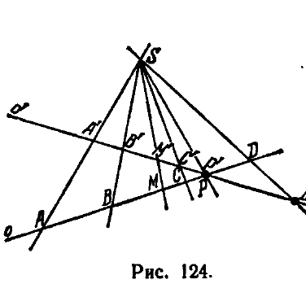

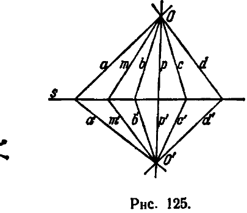

Соответствие между лучами двух пучков называется *перспективным*, если точки пересечения соответствующих лучей лежат на одной прямой (называемой *осью перспективы*; рис. 125).

Очевидно, каждое перспективное соответствие является проективным (вследствие теоремы 6 § 86; см. также § 103). Однако далеко не каждое проективное соответствие является перспективным.

Следующие две теоремы дают полезный признак, выделяющий перспективные соответствия среди всех проективных.

Т е о р е м а 53. *Для того чтобы проективное соответствие между точками двух прямых было перспективным, необходимо и достаточно, чтобы точке пересечения этих прямых, рассматри-*

---
**стр. 398**
---

ваемой в качестве элемента одной из них, на другой прямой соответствовала эта же самая точка.

**Т е о р е м а 54.** *Для того чтобы проективное соответствие между лучами двух пучков было перспективным, необходимо и достаточно, чтобы общему лучу этих пучков, рассматриваемому в качестве элемента одного из них, в другом пучке соответствовал этот же самый луч.*

Из этих двух теорем достаточно доказать одну: тогда справедливость другой будет обеспечена принципом двойственности. Приведем доказательство теоремы 53.

**Д о к а з а т е л ь с т в о  н е о б х о д и м о с т и.** Доказательство необходимости усматривается непосредственно: в самом деле, если между прямыми $o$ и $o'$ установлено перспективное соответствие с центром перспективы $S$, то пары соответствующих точек определяются пересечением прямых $o$ и $o'$ с лучами, исходящими из $S$; но луч, проходящий через общую точку прямых $o$ и $o'$, очевидно, определяет пару соответствующих точек $P$, $P'$, которые сливаются друг с другом (рис. 124).

**Д о к а з а т е л ь с т в о  д о с т а т о ч н о с т и.** Пусть между точками прямых $o$ и $o'$ установлено проективное соответствие так, что точке $P$ прямой $o$, в которой пересекаются прямые $o$ и $o'$, соответствует на прямой $o'$ точка $P'$, совпадающая с точкой $P$. Возьмем на прямой $o$ две точки $A$ и $B$, на прямой $o'$ — соответствующие им точки $A'$ и $B'$ и обозначим через $S$ точку пересечения прямых $AA'$, $BB'$. Далее, обозначим через $M$ произвольную точку прямой $o$, через $M' = f(M)$ — точку, отвечающую ей в данном соответствии, и через $M^* = \varphi(M)$ — точку, в которой луч $SM$ пересекает прямую $o'$. Соответствие $M^* = \varphi(M)$ по построению является перспективным (с центром перспективы $S$), следовательно, и проективным; кроме того, очевидно, в соответствии $M^* = \varphi(M)$ точкам $A$, $B$, $P$ отвечают точки $A'$, $B'$, $P'$. Таким образом, мы имеем проективные соответствия $M' = f(M)$ и $M^* = \varphi(M)$ с тремя общими парами соответствующих точек $A$, $A'$; $B$, $B'$ и $P$, $P'$. По теореме 15 эти соответствия не могут быть различными, т. е. $M' = M^*$. Отсюда следует, что данное соответствие $M' = f(M)$ является перспективным с центром перспективы $S$. Теорема доказана.

**§ 140. Г р а ф и ч е с к о е  п о с т р о е н и е  п р о е к т и в н ы х  с о о т в е т с т в и й  п о  д а н н ы м  т р е м  п а р а м  с о о т в е т с т в у ю щ и х  э л е м е н т о в.**

Пусть на прямой $o$ даны три точки $A$, $B$, $C$, а на другой прямой $o'$ — три точки $A'$, $B'$, $C'$. Мы знаем, что существует единственное проективное отображение $M' = f(M)$ прямой $o$ на прямую $o'$, переводящее точки $A$, $B$, $C$ соответственно в точки $A'$, $B'$, $C'$. Наша цель сейчас — указать графический способ построения для каждой точки $M$ прямой $o$ соответствующей точки $M' = f(M)$ прямой $o'$. С этой целью

---
**стр. 399**
---

соединим прямою какие-нибудь две соответствующие точки из числа данных, например, $B$ и $B'$, и возьмем на соединяющей прямой точки $S$ и $S'$ (рис. 126).

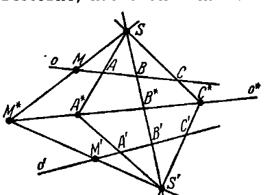

Далее установим между лучами пучков с центрами $S$ и $S'$ соответствие, назначая в качестве соответствующего лучу $SM$ пучка $S$ луч $S'M'$ пучка $S'$. Так как соответствие $M' = f(M)$ — проективное, то и установленное нами соответствие между лучами пучков $S$ и $S'$ будет проективным. Но оно будет, сверх того, и перспективным, так как лучу $SB$ пучка $S$ соответствует совпадающий с ним луч $S'B'$ пучка $S'$ (см. теорему 54). Следовательно, все соответствующие лучи пучков $S$ и $S'$ пересекаются на одной прямой, каковой является ось перспективы. Отсюда имеем требуемое построение: после выбора точек $S$ и $S'$ проводим лучи $SA$, $S'A'$, $SC$, $S'C'$ и строим прямую $A^*C^*$, как показано на рис. 126. Это и будет ось перспективы пучков $S$ и $S'$.

Чтобы построить на прямой $o'$ точку $M'$, соответствующую точке $M$ прямой $o$, достаточно провести луч $SM$ и точку $M^*$, в которой он встретит прямую $A^*C^*$, соединить с точкой $S'$; прямая $S'M^*$ пересечет прямую $o'$ в искомой точке $M' = f(M)$.

Построение проективно соответствующих лучей двух пучков является двойственным к описанному сейчас построению. Мы изложим его без подробных объяснений.

Пусть $O$ и $O'$ — центры двух пучков, между лучами которых установлено проективное соответствие и требуется по данному произвольному лучу $m$ пучка $O$ построить соответствующий луч $m' = f(m)$ пучка $O'$, зная три луча $a$, $b$, $c$ пучка $O$ и три соответствующих им луча $a'$, $b'$, $c'$ пучка $O'$. Для этого следует через точку пересечения каких-либо соответствующих лучей из числа данных, например, через точку пересечения лучей $b$ и $b'$, провести произвольно две прямые $s$ и $s'$ (рис. 127), далее, точку пересечения прямых $a$, $s$ нужно соединить прямою с точкой пересечения прямых $a'$, $s'$ и точку пересечения прямых $c$, $s$ соединить прямою с точкой пересечения прямых $c'$, $s'$; проведенные таким образом прямые

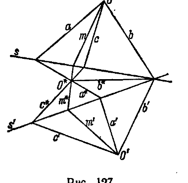

---
**стр. 400**
---

определят своим пересечением точку $O^*$. После этого построение луча $m' = f(m)$ проводится, как показано на рис. 127: точка пересечения луча $m$ с прямой $s$ соединяется с точкой $O^*$, и определяется точка пересечения соединяющей прямой с прямой $s'$; луч, идущий из $O'$ в эту точку, и будет искомым лучом $m' = f(m)$.

Заметим, что соответствие между элементами одномерных многообразий, устанавливаемое при помощи некоторой последовательности операций проектирования и сечения, всегда является проективным (так как эти операции переводят гармонические группы элементов в гармонические же группы элементов). На основании изложенного в этом параграфе мы можем утверждать, что каким бы ни было проективное соответствие между элементами одномерных многообразий, оно всегда может быть получено как результат некоторой последовательности операций проектирования и сечения.

**§ 141. Проективное построение образов второй степени (теоремы Штейнера).**

Проективное соответствие между образами первой степени может быть использовано для построения образов второй степени. Метод такого построения содержится в нижеприводимых теоремах Штейнера.

**Т е о р е м а 55.** *Совокупность точек пересечения проективно соответствующих лучей двух пучков есть линия второго порядка, проходящая через центры этих пучков.*

**Д о к а з а т е л ь с т в о.** Введем на плоскости какую-либо систему проективных координат, которые в данном случае удобно взять неоднородными. Пусть $S_1(x_1, y_1)$ и $S_2(x_2, y_2)$ — центры двух пучков, между лучами которых установлено некоторое проективное соответствие. Если

$$y - y_1 = k(x - x_1) \quad (1)$$

— уравнение произвольного луча первого пучка,

$$y - y_2 = k'(x - x_2) \quad (2)$$

— уравнение соответствующего луча второго, то, как нам известно, параметр $k'$ является дробно-линейной функцией параметра $k$:

$$k' = \frac{\alpha k + \beta}{\gamma k + \delta} \quad (\alpha\delta - \beta\gamma \neq 0) \quad (3)$$

(см. § 119). Чтобы получить уравнение линии, описываемой при изменении $k$ точкой пересечения лучей (1) и (2), нужно исключить параметры $k$ и $k'$ из уравнений (1), (2) и (3). Результат исключения

---
**стр. 401**
---

имеет вид

$$\gamma (y - y_1) (y - y_2) + \delta (y - y_2) (x - x_1) -$$
$$- \alpha (y - y_1) (x - x_2) - \beta (x - x_1) (x - x_2) = 0 \quad (*)$$

и является, очевидно, уравнением второй степени относительно $x$ и $y$.

Таким образом, действительно, общие точки пересечения соответствующих лучей пучков $S_1$ и $S_2$ составляют линию второго порядка. То, что эта линия проходит через $S_1$ и $S_2$, усматривается сразу; в самом деле, как значения $x = x_1$, $y = y_1$, так и значения $x = x_2$, $y = y_2$ удовлетворяют уравнению $(*)$, значит, точки $S_1$ и $S_2$ принадлежат этой кривой. Впрочем, то, что точки $S_1$ и $S_2$ принадлежат множеству общих точек пересечения соответствующих лучей пучков $S_1$ и $S_2$, ясно без всяких вычислений, например, точка $S_2$ принадлежит к этому множеству, так как луч $S_1S_2$ пучка $S_1$ пересекает в точке $S_2$ все лучи второго пучка, в том числе и соответствующий себе.

*Заметим, попутно, что общему лучу $S_1S_2$ пучков $S_1$ и $S_2$, если его отнести к первому пучку, во втором пучке соответствует луч $t_2$, касающийся в точке $S_2$ линии второго порядка, образованной проективно соответствующими лучами пучков $S_1$ и $S_2$; а если луч $S_1S_2$ отнести ко второму пучку, то в первом пучке ему будет соответствовать луч $t_1$, касающийся в точке $S_1$ этой линии.*

В самом деле, пусть $M$ — точка пересечения двух соответствующих лучей $m$ и $m'$, $s$ — общий луч пучков $S_1$ и $S_2$, $t_2$ — касательная в точке $S_2$ (рис. 128). Предположим, что точка $M$ стремится по кривой к $S_2$; тогда $m$ стремится к $s$, $m'$ к $t_2$. Но проективное соответствие непрерывно (это следует из его аналитического представления). Поэтому предельные положения соответствующих лучей

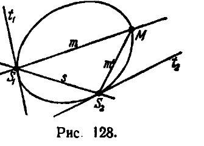

$$s = \lim_{M \to S_2} m \quad \text{и} \quad t_2 = \lim_{M \to S_2} m'$$

являются соответствующими лучами, т. е. лучу $s$, как лучу первого пучка, во втором пучке соответствует луч $t_2$. Аналогично доказывается, что лучу $s$, как лучу второго пучка, в первом пучке соответствует луч $t_1$.

Уместно поставить вопрос: всякую ли линию второго порядка можно образовать при помощи двух проективных пучков, т. е. пучков, между лучами которых установлено проективное соответствие? Естественно, что при помощи проективных пучков с вещественными лучами можно построить лишь такие линии второго порядка, которые обладают бесконечным множеством вещественных точек. Следовательно, не могут быть построены: вырожденная линия второго порядка, составленная из двух мнимых прямых, и невырожденная нулевая линия (это и понятно, так как, коль скоро мы остаемся в пределах наглядно геометрических конструкций, образы, составленные из мнимых элементов, выпадают из поля нашего зрения).

---
**стр. 402**
---

Что же касается остальных линий второго порядка: дважды взятой вещественной прямой, пары различных вещественных прямых и овальной линии (см. § 134), то все они могут быть построены вышеописанным способом:

1) **Д в а ж д ы  в з я т а я  в е щ е с т в е н н а я  п р я м а я** представляет собой геометрическое место общих точек соответствующих лучей проективных пучков, если центры этих пучков совпадают и если луч одного из пучков, совпадающий с соответствующим лучом другого, оказывается кратным. Например, пучки

$$y = kx, \quad y = k'x \quad (*)$$

с общим центром $(0, 0)$, между лучами которых установлено соответствие

$$k' = \frac{k}{1+k}, \quad (**)$$

имеют в качестве множества общих точек соответствующих лучей дважды взятую координатную ось, так как при исключении параметров $k$, $k'$ из уравнений $(*)$ и $(**)$ получается $y^2 = 0$.

2) **П а р а  р а з л и ч н ы х  в е щ е с т в е н н ы х  п р я м ы х** образуется пересечением соответствующих лучей двух пучков, находящихся в перспективном соответствии. При этом ось перспективы является одной прямой пары, общий луч пучков — другой.

3) **О в а л ь н а я  л и н и я** образуется пересечением соответствующих лучей двух пучков в том случае, когда между этими пучками установлено проективное, но не перспективное, соответствие: действительно, в этом случае общие точки соответствующих лучей не располагаются на прямых линиях$^{*)}$.

Из теоремы 55 по принципу двойственности следует

**Т е о р е м а 56.** *Совокупность прямых, соединяющих соответствующие точки двух фиксированных прямых, находящихся в проективном соответствии, есть пучок второго класса, содержащий эти две прямые.*

Если фиксированные прямые $s_1$ и $s_2$ находятся в перспективном соответствии, то пучок второго класса, рассматриваемый в теореме 56, вырождается в пару пучков первого класса; один из них будет иметь своим центром центр перспективы данного соответствия, другой — общую точку прямых $s_1$ и $s_2$.

$^{*)}$ Напомним читателю, что все овальные линии второго порядка проективно эквивалентны.

---
**стр. 403**
---

Если прямые $s_1$ и $s_2$ находятся в проективном, но не в перспективном соответствии, то пучок второго класса, определяемый, как указано в теореме 56, является невырожденным. По теореме 52 этот пучок имеет огибающую, которая представляет собой невырожденную линию второго порядка. А поскольку пучок содержит прямые $s_1$ и $s_2$, огибающая его линия второго порядка касается этих прямых.

На рис. 129 изображен невырожденный пучок второго класса, порождаемый проективным соответствием между прямыми $s_1$ и $s_2$, и изображена также огибающая этот пучок линия второго порядка $k$; буквами $T_1$, $T_2$ обозначены точки прикосновения линии $k$ с прямыми $s_1$ и $s_2$, буквами $M$, $M'$ — две произвольные соответствующие друг другу точки. Из чертежа можно усмотреть, что если точка $M$ стремится к $S$, то $M'$ стремится к $T_2$.

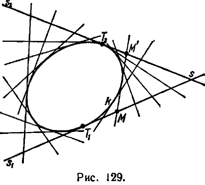

*Таким образом, если общую точку прямых $s_1$, $s_2$ мы отнесем к одной из этих прямых, то на другой ей будет соответствовать точка прикосновения с линией $k$ (т. е. характеристическая точка пучка второго класса).*

Это предложение, очевидно, является двойственным к установленному выше предложению о касательных к кривой второго порядка с точками прикосновения в центрах образующих эту кривую проективных пучков (двойственное сопоставление касательных к кривой и характеристических точек пучка отмечено в конце § 127).

**§ 142. О б р а т н ы е  т е о р е м ы  Ш т е й н е р а.**

В предыдущем параграфе мы показали, что каждая линия второго порядка может быть определена как геометрическое место общих точек соответствующих лучей двух проективных пучков, и что она проходит через центры этих пучков.

Следующая теорема устанавливает, что центры проективных пучков, образующих линию второго порядка, являются рядовыми ее точками.

**Т е о р е м а 57.** *Пусть $k$ — невырожденная линия второго порядка, $P$ и $P'$ — две произвольные ее точки. Если с каждым лучом $m$ пучка $P$ сопоставлен луч $m' = f(m)$ пучка $P'$, пересекающий луч $m$ на линии $k$, то соответствие $m' = f(m)$ — проективное.*

**З а м е ч а н и е.** По отношению к вырожденным линиям эта теорема верна лишь при некоторых ограничениях на расположение

---
**стр. 404**
---

точек $P$ и $P'$; именно, если линия $k$ представляет собой пару прямых, то обе точки должны находиться на одной из них. В противном случае соответствие $m' = f(m)$ не будет взаимно однозначным.

Д о к а з а т е л ь с т в о. Мы знаем, что линия $k$ может быть образована при помощи двух проективных пучков; пусть $S$ и $S'$ — центры проективных пучков, образующих линию $k$ (рис. 130). Зафиксируем на линии некоторую точку $M$ и обозначим через $N$ переменную точку линии, через $n$ и $n'$ — лучи $SN$ и $S'N$; по условию выбора точек $S, S'$ соответствие $n' = \varphi(n)$ — проективное. Пусть, далее, $U$ — точка пересечения прямой $PM$ с лучом $n$, $V$ — точка пересечения прямой $P'M$ с лучом $n'$ *).

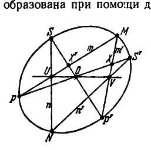

Так как соответствие $n' = \varphi(n)$ — проективное, то соответствие, по которому точке $U$ прямой $PM$ относится точка $V$ прямой $P'M$, будет проективным соответствием между точками прямых $PM$ и $P'M$. Но, более того, это соответствие является перспективным; в самом деле, если точка $U$, перемещаясь по прямой $PM$, совпадет с точкой $M$, то и соответствующая ей точка $V$ одновременно совместится с точкой $M$, а это обстоятельство согласно теореме 53 и обеспечивает перспективный характер соответствия $U \sim V$. Найдем центр перспективы этого соответствия. С этой целью заметим, что если точка $N$ совпадает с точкой $P$, то и точка $U$ совпадает с $P$, а соответствующим положением точки $V$ будет точка $X$, находящаяся на пересечении прямых $P'M$ и $PS'$. Таким образом, точки $P$ и $X$ соответствуют друг другу; следовательно, центр перспективы находится на прямой $PX$, или, что то же самое, на прямой $PS'$; аналогично рассуждая, убедимся, что центр перспективы расположен на прямой $P'S$. На рис. 130 он обозначен буквой $O$. Итак, прямая $UV$ всегда проходит через точку $O$.

Зафиксируем теперь точку $N$, а точку $M$ вообразим переменной. Будем рассматривать соответствие $m' = f(m)$ лучей, направленных из точек $P$ и $P'$ в точку $M$, вместе с ним соответствие $V = \Phi(U)$ между точками прямых $SN$ и $S'N$ (эти прямые теперь неподвижны); здесь соответствующие точки $U, V$ определяются пересечением прямых $SN$ и $S'N$ с соответствующими лучами $m, m'$ пучков $P, P'$. По предыдущему прямая $UV$ всегда проходит через точку $O$ (которая

---
**стр. 405**
---

не меняется при изменении $M$); отсюда следует, что соответствие $V = \Phi(U)$ — перспективное, а поэтому соответствие $m' = f(m)$ является проективным (так как оно устанавливается при помощи некоторой последовательности операций проектирования и сечения). Теорема доказана.

На основании принципа двойственности *) из этой теоремы вытекает

**Теорема 58.** *Пусть $k$ — невырожденная линия второго порядка, $t$ и $t'$ — две ее касательные; если с каждой точкой $M$ прямой $t$ сопоставлена точка $M' = f(M)$ прямой $t'$ так, что прямая $MM'$ касается линии $k$, то соответствие $M' = f(M)$ — проективное.*

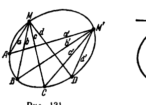

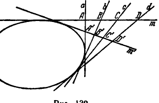

Из теорем 57 и 58 и из теоремы 46 вытекают, между прочим, следующие два предложения, двойственные друг другу:

1) *Если $M$ и $M'$ — любые две точки линии второго порядка, $a, b, c, d$ и $a', b', c', d'$ — лучи, идущие из этих точек к произвольным точкам $A, B, C, D$ этой линии (рис. 131), то имеет место равенство сложных отношений*

$$(abcd) = (a'b'c'd').$$

2) *Если $m$ и $m'$ — любые две касательные к линии второго порядка; $A, B, C, D$ и $A', B', C', D'$ — точки на прямых $m$ и $m'$, определяемые пересечением с четырьмя произвольными касательными $a, b, c, d$ (рис. 132), то имеет место равенство сложных отношений*

$$(ABCD) = (A'B'C'D').$$

**§ 143. Построение линии второго порядка по данным пяти ее элементам.** Полученные в предыдущем параграфе результаты позволяют утверждать ряд приводимых ниже предложений.

*) Применение его в данном случае обеспечено теоремой 52.

---
**стр. 406**
---

1) *Пять точек плоскости, из которых никакие три не лежат на одной прямой, всегда определяют единственную проходящую через них невырожденную линию второго порядка.*

В самом деле, пусть даны на плоскости пять точек, никакие три из которых не лежат на одной прямой. Обозначим какие-нибудь две из них буквами $S, S'$, три другие — буквами $A, B, C$. Проведем, далее, из точек $S$ и $S'$ лучи $a, b, c$ и $a', b', c'$ в точки $A, B, C$ и установим между лучами пучков с центрами $S$ и $S'$ проективное соответствие так, чтобы лучам $a, b, c$ отвечали лучи $a', b', c'$. Тогда геометрическое место точек пересечения соответствующих лучей пучков $S$ и $S'$ будет линией второго порядка, проходящей через данные точки; другой линии быть не может, так как проективное соответствие однозначно определяется заданием трех пар соответствующих элементов.

В § 140 мы изложили способ построения соответствующих пар лучей двух проективных пучков; применяя его в данном случае, можно построить, зная пять точек линии второго порядка, как угодно много других ее точек.

Между прочим, рис. 130 представляет схему прибора для вычерчивания линии второго порядка; в самом деле, вообразим, что по данным пяти точкам $S, P, N, P', S'$ установлены неподвижные стержни $P'S, SN, NS'$ и $S'P$, с которыми соединены при помощи скользящих шарниров в точках $U, V$ и неподвижных шарниров в точках $P, O, P'$ подвижные стержни $PM, P'M$ и $UV$. Тогда, если стержень $UV$ вращается вокруг точки $O$, то связанные с ним стержни $PM$ и $P'M$ вращаются так, что точка их пересечения $M$ вычерчивает линию второго порядка, проходящую через данные точки $S, P, N, P', S'$.

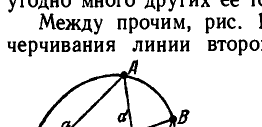

2) *Четыре точки плоскости, никакие три из которых не находятся на одной прямой, и прямая, проходящая через одну из них, определяют единственную линию второго порядка, проходящую через эти точки и касающуюся данной прямой.*

В самом деле, обозначим данные элементы так, как показано на рис. 133, и установим между лучами пучков $S$ и $S'$ проективное соответствие по трем парам соответствующих лучей $a, a'; b, b'; c, c'$. Тогда геометрическое место точек пересечения соответствующих лучей пучков $S$ и $S'$ будет линией второго порядка, проходящей через точки $A, B, S, S'$ и касающейся прямой $c'$ в точке $S'$ (см. § 141).

3) *Три точки плоскости, не лежащие на одной прямой, и две прямые, из которых одна проходит через одну из трех данных точек,

---
**стр. 407**
---

а другая — через одну из двух других, определяют единственную линию второго порядка, проходящую через эти три точки и касающуюся данных прямых.

В самом деле, обозначим данные элементы так, как показано на рис. 134, и установим между лучами пучков $S$ и $S'$ проективное соответствие по трем парам соответствующих лучей $a, a'; b, b'; c, c'$. Тогда геометрическое место точек пересечения соответствующих лучей пучков $S$ и $S'$ будет линией второго порядка, проходящей через точки $S, A, S'$ и касающейся прямых $b$ и $c'$.

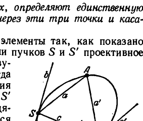

На основании принципа двойственности из доказанных здесь предложений следует, что невырожденная линия второго порядка, как огибающая пучка второго класса, однозначно определяется заданием пяти своих элементов в одной из следующих комбинаций:

1) данные элементы — пять касательных;

2) данные элементы — четыре касательных и точка прикосновения на одной из них;

3) данные элементы — три касательных и точки прикосновения на двух из них.

**§ 144. Теоремы Паскаля и Брианшона.** Теперь мы остановимся на двух предложениях проективной геометрии, которые известны под названием теорем Паскаля и Брианшона.

**Теорема 59 (теорема Паскаля).** Каким бы ни был шестивершинник, вписанный в линию второго порядка, точки пересечения его противоположных сторон лежат на одной прямой (рис. 135).

**Теорема 60 (теорема Брианшона).** Каким бы ни был шестивершинник, описанный вокруг линии второго порядка, прямые, соединяющие его противоположные вершины, проходят через одну точку (рис. 136).

Эти две теоремы, очевидно, двойственны друг другу; поэтому достаточно доказать одну из них.

Внимательный анализ предыдущего материала обнаруживает, что теорема Паскаля является лишь перефразировкой теоремы Штейнера о построении линии второго порядка с помощью двух проективных пучков, и, следовательно, в скрытом виде доказана нами ранее. Чтобы убедиться в этом, нужно прежде всего указать правило, позволяющее распознавать пары противоположных сторон шестивершинника при любом расположении его вершин. С такой целью занумеруем числами 1, 2, 3, 4, 5, 6 стороны

---
**стр. 408**
---

шестивершинника в порядке их последовательного соединения; противоположными сторонами мы назовем те, номера которых отличаются на три, т. е. 1 и 4, 2 и 5, 3 и 6. Заметив это, вернемся к фигуре, изображенной на рис. 130. Здесь мы имеем вписанный в линию второго порядка шестивершинник, стороны которого, перечисляемые в порядке их соединения, суть $SN, NS', S'P, PM, MP', P'S$; дадим им соответственно номера 1, 2, 3, 4, 5, 6. На рис. 130 точка пересечения сторон 1, 4

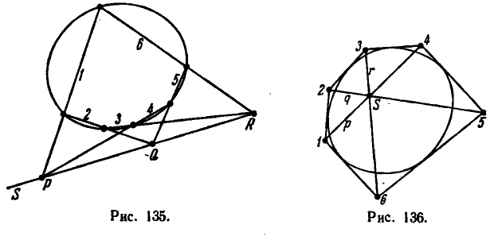

обозначена буквой $U$, точка пересечения сторон 2, 5 — буквой $V$ и точка пересечения сторон 3, 6 — буквой $O$. В свое время было доказано, что три точки $U, O, V$ лежат на одной прямой и что точки $S, P, N, P', S', M$ на кривой совершенно произвольны; следовательно, тогда же была доказана и теорема Паскаля.

Теорема Брианшона, как уже было отмечено, вытекает из теоремы Паскаля по принципу двойственности.

**§ 145. Предельные случаи теорем Паскаля и Брианшона.** Представим себе, что точки, определяющие какую-либо сторону вписанного шестивершинника, сливаются (например, точки, определяющие сторону 3 на рис. 135); тогда эта сторона превращается в касательную и получается фигура, изображенная на рис. 137. Соответственно имеем теорему.

*Касательная к линии второго порядка, проведенная в одной из вершин вписанного пятивершинника, пересекается со стороной, противоположной этой вершине, в точке, которая лежит на прямой, проходящей через точки пересечения остальных пар несмежных сторон этого пятивершинника.*

Двойственный этому предельный случай теоремы Брианшона мы получим, полагая, что две смежные стороны описанного шестисторонника сливаются в одну, а общая их вершина превращается

---
**стр. 409**
---

в точку прикосновения (рис. 138). Соответственно имеем теорему.

*Прямая, соединяющая точку прикосновения одной из сторон описанного пятисторонника с противоположной вершиной, проходит через общую точку прямых, соединяющих остальные две пары несмежных вершин этого пятисторонника.*

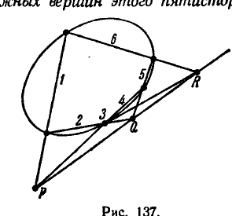

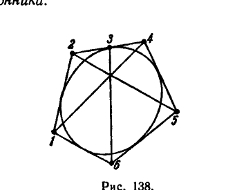

Другие предельные случаи теоремы Паскаля для вписанного четырехвершинника и вписанного трехвершинника и предельные

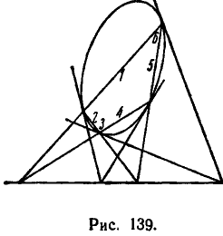

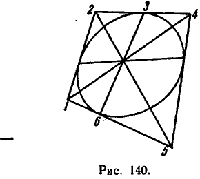

случаи теоремы Брианшона для описанного четырехсторонника и описанного трехсторонника без объяснений представлены рис. 139, 140, 141 и 142.

**§ 146. Задачи построения касательной в данной точке кривой второго порядка и точки прикосновения данной касательной.**

З а д а ч а. Зная пять точек кривой второго порядка, построить касательную в одной из них.

Эта задача решается при помощи теоремы Паскаля для вписанного пятивершинника. Пусть отрезки, соединяющие данные точки,

---
**стр. 410**
---

помечены числами 1, 2, 4, 5, 6, как на рис. 137, а назначенная точка — числом 3; тогда, определяя сначала точки $P$, $Q$, а затем точку $R$, и соединяя точку $R$ с точкой 3, получим искомую касательную.

З а д а ч а. Зная пять касательных кривой второго порядка, построить точку прикосновения одной из них.

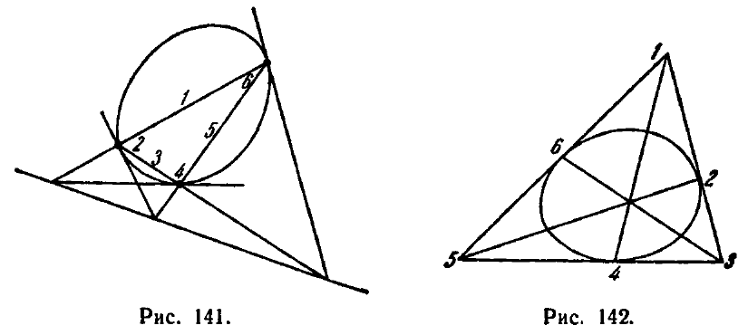

Эта задача решается при помощи теоремы Брианшона для описанного пятисторонника. Пусть точки пересечения данных касательных помечены числами 1, 2, 4, 5, 6, как на рис. 138. Тогда, соединяя прямыми точки 1, 4 и точки 2, 5, находим точку пересечения этих прямых; прямая, соединяющая эту точку с точкой 6, пересечением с прямой 2, 4 определит на ней искомую точку прикосновения.

**§ 147. Проективное соответствие между точками кривой второго порядка.** Мы подробно рассматривали в этом разделе проективное соответствие между элементами одномерных многообразий первой степени. Для многих вопросов проективной геометрии полезно обобщить понятие проективного соответствия на множество элементов одномерных многообразий второй степени.

Мы покажем сейчас, как выполняется такое обобщение, причем в своих рассуждениях будем иметь в виду к о н к р е т н ы й случай многообразия второй степени, именно, о в а л ь н у ю кривую второго порядка.

Условимся называть две пары точек $A$, $B$ и $C$, $D$ линии второго порядка $k$ гармонически сопряженными, если они проектируются из какой-нибудь точки $M$ линии $k$ двумя парами гармонически сопряженных лучей. На основании первого из двух предложений, приведенных в конце § 142, мы можем утверждать, что свойство гармонической сопряженности двух пар точек $A$, $B$ и $C$, $D$ линии второго порядка не связано с выбором точки $M$ и, таким образом,

---
**стр. 411**
---

определяется исключительно расположением самих точек $A$, $B$, $C$, $D$.

*Взаимно однозначное соответствие между точками двух различных или совпадающих линий второго порядка $k_1$ и $k_2$ называется проективным, если в этом соответствии гармонически сопряженным парам точек линии $k_1$ отвечают также гармонически сопряженные пары точек линии $k_2$.*

Высказанное определение, как видим, вполне аналогично определению проективного соответствия между точками прямых. Установление проективного соответствия мы будем еще называть *проективным отображением* линии $k_1$ на линию $k_2$. В том случае, когда линии $k_1$ и $k_2$ совпадают, говорят, что линия проективно отображена на себя. Именно этим случаем мы будем сейчас интересоваться.

Пусть дано проективное отображение некоторой линии второго порядка $k$ на самое себя; выберем на линии $k$ какую-нибудь точку $A$ и обозначим через $A'$ ее образ. Далее, установим между лучами пучков с центрами $A$ и $A'$ соответствие, сопоставляя с произвольным лучом $m'$ пучка $A'$ луч $m$ пучка $A$ так, чтобы точка пересечения луча $m$ с линией $k$ была образом точки пересечения луча $m'$ с этой линией. Нетрудно сообразить, что установленное соответствие является проективным. В самом деле, если $m'$, $n'$ и $p'$, $q'$ — две гармонически сопряженные пары лучей пучка $A'$, то, по определению гармонической сопряженности на линии второго порядка, пары точек $M$, $N$ и $P$, $Q$, в которых лучи $m'$, $n'$, $p'$, $q'$ пересекают линию, будут также гармонически сопряжены; при проективном отображении кривой на себя пары точек $M$, $N$ и $P$, $Q$ переходят в гармонически сопряженные пары точек $M'$, $N'$ и $P'$, $Q'$, которые из точки $A$ проектируются гармонически сопряженными парами лучей $m$, $n$ и $p$, $q$. Но именно эти лучи в пучке $A$ и сопоставляются с лучами $m'$, $n'$, $p'$, $q'$ пучка $A'$. Таким образом, при установленном соответствии гармоническим группам элементов пучка $A'$ отвечают гармонические группы элементов пучка $A$, а это и является характеристическим свойством проективного соответствия.

По поводу установленного соответствия между лучами пучков $A$ и $A'$ можно сказать больше: оно не только проективное, но и перспективное. Это следует из того, что лучу $A'A$ пучка $A'$ отвечает луч $AA'$ пучка $A$ (см. теорему 54).

Следовательно, соответствующие лучи пучков $A$ и $A'$ пересекаются на одной прямой — на оси перспективы этих пучков. Отсюда имеем следующий весьма простой способ графической реализации проективного отображения линии второго порядка на себя, пригодный в том случае, когда это отображение определено заданием трех пар соответствующих точек (этот способ заключает в себе и

---
**стр. 412**
---

доказательство того, что три пары соответствующих точек определяют проективное отображение). Пусть даны три пары проективно соответствующих точек линии второго порядка: $A$, $A'$; $M_1$, $M'_1$; $M_2$, $M'_2$ (рис. 143). Построим сначала ось перспективы пучков $A$ и $A'$, для чего найдем точку пересечения прямых $AM'_1$ и $A'M_1$ и точку пересечения прямых $AM'_2$ и $A'M_2$; прямая, соединяющая эти точки, и будет осью перспективы. После того как она построена, мы можем для каждой точки $M$ линии найти соответствующую точку $M'$, проектируя точку $M$ из $A'$ на ось перспективы и потом проектируя полученную на оси точку из $A$ на кривую. На рис. 143 показано построение точек $M'_3$, $M'_4$, $\ldots$, соответствующих точкам $M_3$, $M_4$, $\ldots$

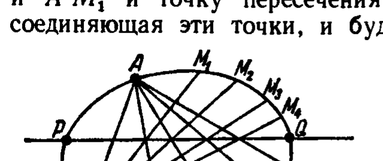

Заметим еще, что точки пересечения оси перспективы пучков $A$ и $A'$ с линией второго порядка являются неподвижными точками в проективном отображении линии на себя. В самом деле, из вышеописанного построения проективно соответствующих точек линии второго порядка непосредственно следует, что в том случае, когда точка $M$ линии одновременно лежит на оси перспективы, соответствующая ей точка совпадает с нею, т. е. точка $M$ отображается на себя. На рис. 143 можно видеть, как с приближением переменной точки линии к точке $Q$, в которой эту линию пересекает ось, соответствующая точка также приближается к точке $Q$.

В тот момент, когда переменная точка совмещается с $Q$, она совпадает с соответствующей себе. Поэтому неподвижную точку отображения называют еще двойной.

На основании изложенного, построение двойных точек проективного отображения начерченной линии второго порядка на самое себя сводится к построению оси перспективы пучков $A$ и $A'$. Если ось перспективы этих пучков линию не пересекает, двойных точек отображения нет.

Замечательно, что ось перспективы пучков $A$ и $A'$ совпадает с осью перспективы любой другой пары пучков, проектирующих соответствующие точки линии и имеющих центры в двух соответствующих точках. В самом деле, пусть $A$, $B$, $C$ — три точки линии, $A'$, $B'$, $C'$ — точки, соответствующие им в некотором проективном отображении этой линии на себя (рис. 144). Выберем сначала в качестве центров пучков, проектирующих соответствующие точки линии, точки $A$ и $A'$. Ось перспективы этих пучков $s_a$ определится точкой пересечения прямых $A'B$ и $AB'$ и точкой пере-

---
**стр. 413**
---

сечения прямых $A'C$ и $AC'$. Затем выберем в качестве центров проектирующих пучков точки $B$ и $B'$. Ось перспективы этих пучков $s_b$ определится точкой пересечения прямых $B'A$ и $BA'$ и точкой пересечения прямых $B'C$ и $BC'$. Но в силу теоремы Паскаля полученные три точки лежат на одной прямой и, следовательно, оси $s_a$ и $s_b$ совпадают.

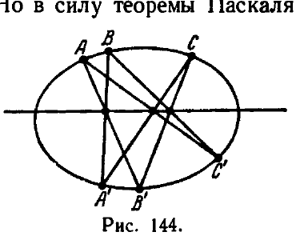

Общую ось перспективы пучков $A$ и $A'$, $B$ и $B'$ и т. д. называют просто *осью перспективы проективного отображения кривой второго порядка на самое себя*.

Все изложенное позволяет высказать следующее утверждение.

*Если дано проективное отображение кривой второго порядка на самое себя, то, каковы бы ни были две пары соответствующих точек $M$, $N$ и $M'$, $N'$, прямые $MN'$ и $M'N$ пересекаются всегда на определенной прямой, и эта прямая есть ось перспективы данного отображения.*

**§ 148. Построение двойных точек проективного отображения прямой на самое себя.** Результаты, полученные в предыдущем параграфе, позволяют решить следующую задачу.

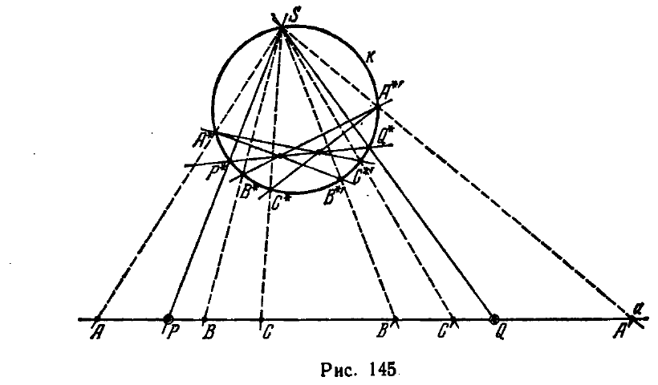

З а д а ч а. Построить двойные точки проективного отображения прямой $a$ на самое себя, если даны три пары соответствующих точек этого отображения $A$ и $A'$, $B$ и $B'$, $C$ и $C'$.

Р е ш е н и е. Пользуясь циркулем, построим произвольную окружность $k$ (рис. 145) и выберем на ней какую-нибудь точку $S$,

---
**стр. 414**
---

Далее, установим между точками окружности $k$ соответствие, назначая для произвольной точки $M^*$ этой окружности соответствующую точку $M^{*\prime}$ так, чтобы пара точек $M^*$, $M^{*\prime}$ проектировалась из точки $S$ в пару точек прямой $a$, соответствующих друг другу в данном проективном отображении. Очевидно, соответствие $M^* \sim M^{*\prime}$ является проективным (на окружности), а двойные точки его проектируются из $S$ в двойные точки данного проективного отображения прямой $a$ на себя.

Таким образом, задача приводится к построению двойных точек проективного отображения на себя окружности $k$. Чтобы построить их, спроектируем точки $A$, $B$, $C$, $A'$, $B'$, $C'$ из точки $S$ на окружность $k$; мы получим на окружности точки $A^*$, $B^*$, $C^*$, $A^{*\prime}$, $B^{*\prime}$, $C^{*\prime}$. Затем построим ось перспективы соответствия $M^* \sim M^{*\prime}$, определенного тремя парами соответствующих точек, $A^*$ и $A^{*\prime}$, $B^*$ и $B^{*\prime}$, $C^*$ и $C^{*\prime}$, и определим точки $P^*$, $Q^*$, в которых построенная ось пересекает окружность. Проектируя точки $P^*$, $Q^*$ из центра $S$ на прямую $a$, найдем искомые двойные точки $P$, $Q$. (Все построения указаны на рис. 145.)

**§ 149. Построение точек пересечения произвольной прямой с линией второго порядка, определенной пятью точками.**

З а д а ч а. Линия второго порядка $k$ определена пятью точками $S$, $S'$, $A$, $B$, $C$ (рис. 146); найти точки ее пересечения с произвольной прямой $a$ (линия $k$ не предполагается фактически начерченной, известны только ее точки $S$, $S'$, $A$, $B$, $C$).

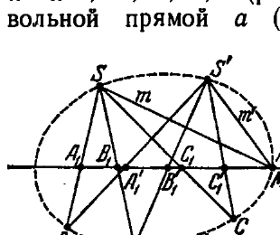

Эта задача приводится к предыдущей. В самом деле, линию $k$ мы можем рассматривать как геометрическое место точек пересечения проективно соответствующих лучей $m$, $m'$ пучков с центрами $S$, $S'$, если соответствие $m \sim m'$ определено так, что лучам $SA$, $SB$, $SC$ отвечают лучи $S'A$, $S'B$, $S'C$. Пары проективно соответствующих лучей $m$, $m'$, пересекаясь с прямой $a$, определяют на ней пары проективно соответствующих точек $M$, $M'$; в частности, пары соответствующих лучей $SA$ и $S'A$, $SB$ и $S'B$, $SC$ и $S'C$ определяют на прямой $a$ пары соответствующих точек $A_1$ и $A'_1$, $B_1$ и $B'_1$, $C_1$ и $C'_1$. Точки пересечения прямой $a$ с линией $k$ суть те, в которых сходятся соответствующие лучи $m$, $m'$; следовательно, они представляют собой двойные точки проективного соответствия $M \sim M'$. Таким образом, чтобы решить задачу, мы должны построить двойные точки проективного отображения прямой $a$ на себя, полагая, что это отображение определено тремя парами точек

---
**стр. 415**
---

$A_1$ и $A'_1$, $B_1$ и $B'_1$, $C_1$ и $C'_1$. Требуемое построение указано в предыдущем параграфе.

З а м е ч а н и е. В том случае, когда прямая $a$ проходит через одну из данных пяти точек, построение единственной неизвестной точки ее пересечения с линией $k$ значительно упрощается. В этом случае можно воспользоваться теоремой Паскаля.

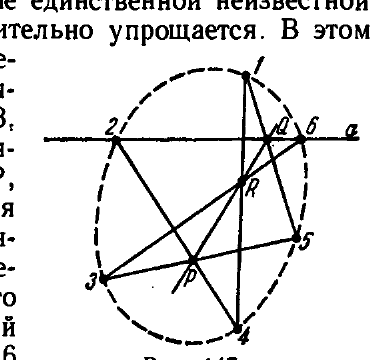

На рис. 147 данные точки линии $k$ помечены числами 1, 2, 3, 4, 5, искомая точка пересечения прямой $a$ с линией $k$ — числом 6, буквы $P$, $Q$, $R$ обозначают точки пересечения противоположных сторон шестивершинника 1, 2, 3, 4, 5, 6; так как этот шестивершинник вписан в линию второго порядка $k$, точки $P$, $Q$, $R$ лежат на одной прямой. Поэтому построение точки 6 можно вести следующим образом: сначала найти точки $P$ и $Q$, затем, проводя прямую $PQ$, — точку $R$, наконец, соединяя точки 3 и $R$ прямой, найти точку 6.

**§ 150. Проведение касательных из данной точки плоскости к линии второго порядка, определенной пятью точками.**

З а д а ч а. Пятью точками $A$, $B$, $C$, $D$, $E$ определена линия второго порядка $k$, и дана произвольная точка $P$. Провести из точки $P$ касательные к линии $k$.

Р е ш е н и е. Проведем через точку $P$ и какие-нибудь две из данных пяти точек, например $A$ и $B$, две прямые линии $PA$ и $PB$ (рис. 148). Следуя только что изложенному методу, найдем точки $A_1$ и $B_1$, в которых прямые $PA$ и $PB$ встречают линию $k$. Затем построим полный четырехвершинник $ABA_1B_1$; из его гармонических свойств следует, что диагональ его $p$ является полярой точки $P$ относительно линии $k$ (определение поляры см. в § 131). Наконец, найдем точки $M_1$ и $M_2$ пересечения поляры $p$ с линией $k$ и соединим их прямыми $t_1$ и $t_2$ с точкой $P$. Из теоремы 51 следует, что $t_1$ и $t_2$ являются искомыми касательными.

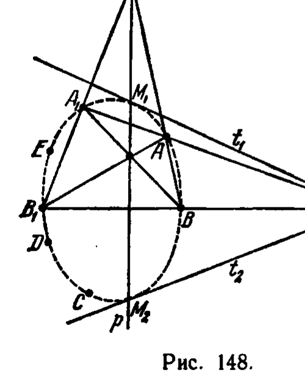

**§ 151. Вторая теорема Дезарга.** Мы изложим сейчас одну интересную теорему проективной геометрии о пучках

---
**стр. 416**
---

кривых второго порядка, известную под названием второй теоремы Дезарга.

Пучком кривых второго порядка называется совокупность кривых, которые при различных значениях параметра $\lambda$ (с учетом $\lambda = \infty$) определяются уравнением

$$a_{11}x^2 + 2a_{12}xy + a_{22}y^2 + 2a_{13}x + 2a_{23}y + a_{33} +$$
$$+ \lambda (b_{11}x^2 + 2b_{12}xy + b_{22}y^2 + 2b_{13}x + 2b_{23}y + b_{33}) = 0, \quad (*)$$

где $a_{ik}$, $b_{ik}$ — постоянные, $x$, $y$ — текущие (проективные) координаты; очевидно, пучок представляет собой совокупность линий, проходящих через четыре точки пересечения двух линий:

$$a_{11}x^2 + 2a_{12}xy + a_{22}y^2 + 2a_{13}x + 2a_{23}y + a_{33} = 0$$

и

$$b_{11}x^2 + 2b_{12}xy + b_{22}y^2 + 2b_{13}x + 2b_{23}y + b_{33} = 0;$$

эти четыре точки, называемые базисными точками пучка, могут быть как вещественными, так и мнимыми.

**Т е о р е м а 61 (Д е з а р г а).** *Линии второго порядка, принадлежащие какому-нибудь пучку, пересекают всякую прямую, которая не проходит через базисные точки пучка, в парах соответствующих точек одной инволюции.*

Прежде чем доказывать эту теорему, напомним читателю понятие инволюции. В § 113 мы называли инволюцией на прямой такое проективное отображение прямой на себя, при котором каждая точка прямой после двукратного отображения возвращается на место, т. е. если точка $M' = f(M)$ является образом точки $M$, то $M'' = f(M') = M$. В проективных координатах на прямой координаты $x$, $x'$ соответствующих в инволюции точек $M$, $M'$ связаны соотношением

$$x' = \frac{\alpha x + \beta}{\gamma x + \delta}$$

при условии $\alpha = -\delta$ (см. § 113).

Приступим теперь к доказательству. Пусть $a$ — произвольная прямая, о которой идет речь в теореме Дезарга. Предположим координатную систему выбранной так, что ее ось $x$ совпадает с прямой $a$. Тогда для определения точек пересечения линий пучка с прямой $a$ достаточно будет в уравнении (*) положить $y = 0$. Получим:

$$a_{11}x^2 + 2a_{13}x + a_{33} + \lambda (b_{11}x^2 + 2b_{13}x + b_{33}) = 0. \quad (**)$$

Пусть $x$, $x'$ — координаты двух точек $M$, $M'$, в которых пересекает прямую $a$ линия пучка, соответствующая некоторому значению $\lambda$.

---
**стр. 417**
---

По теореме Виета, из (**) имеем:

$$x + x' = - \frac{2 (a_{13} + \lambda b_{13})}{a_{11} + \lambda b_{11}}, \quad (\alpha)$$

$$xx' = \frac{a_{33} + \lambda b_{33}}{a_{11} + \lambda b_{11}}. \quad (\beta)$$

Постараемся теперь найти зависимость между $x$ и $x'$; для этого исключим $\lambda$ из соотношений $(\alpha)$ и $(\beta)$. В результате исключения получим:

$$\begin{vmatrix} a_{11} (x + x') + 2a_{13} & b_{11} (x + x') + 2b_{13} \\ a_{11} xx' - a_{33} & b_{11} xx' - b_{33} \end{vmatrix} = 0,$$

откуда

$$x' = \frac{(a_{11}b_{33} - a_{33}b_{11}) x + 2 (a_{13}b_{33} - a_{33}b_{13})}{2 (a_{13}b_{11} - a_{11}b_{13}) x - (a_{11}b_{33} - a_{33}b_{11})}. \quad (\gamma)$$

Мы видим, что $x'$ выражается через $x$ при помощи дробно-линейной функции; следовательно, соответствие $M (x) \sim M' (x')$ является проективным. Далее, сопоставляя формулу $(\gamma)$ с общей формулой $x' = \frac{\alpha x + \beta}{\gamma x + \delta}$, мы видим, что условие $\delta = -\alpha$, характеризующее инволюцию, в данном случае выполнено.

Покажем, что определитель $\Delta$ преобразования $(\gamma)$ не равен нулю. Но $\Delta = - (a_{11}b_{33} - a_{33}b_{11})^2 - 4 (a_{13}b_{11} - a_{11}b_{13}) (a_{13}b_{33} - a_{33}b_{13})$ есть взятый с обратным знаком результат уравнений $a_{11}x^2 + 2a_{13}x + a_{33} = 0$ и $b_{11}x^2 + 2b_{13}x + b_{33} = 0$; если $\Delta = 0$, то эти уравнения имеют общий корень, т. е. прямая $a$ проходит через базисную точку пучка, а это исключено условием теоремы. Следовательно, $\Delta \neq 0$ и теорема доказана.

В следующих двух параграфах даются приложения второй теоремы Дезарга.

**§ 152. П о с т р о е н и е д в о й н ы х т о ч е к и н в о л ю ц и и.** В § 113 мы сказали, что инволюция на прямой определяется двумя парами соответствующих точек; по теореме 42, § 113, две пары соответствующих точек определяют инволюцию однозначно. Поставим задачу построения пар соответствующих точек инволюции, если заданы две ее пары, и построения двойных точек, если инволюция определена двумя парами соответствующих точек.

Пусть $A$, $A'$ и $B$, $B'$ — две пары соответствующих точек в некоторой инволюции на прямой $a$. Проведем окружность $k_a$, проходящую через точки $A$ и $A'$, и окружность $k_b$, проходящую через $B$ и $B'$ (см. рис. 149а и 149б). Эти окружности можно выбрать так, чтобы они пересекались в двух точках $O_1$ и $O_2$. Система окружностей, проходящих через точки $O_1$ и $O_2$, представляет собой пучок кривых второго порядка. По второй теореме Дезарга окружности этой системы пересекают прямую $a$

---
**стр. 418**
---

в парах соответствующих точек одной инволюции. Таким образом, проводя через точки $O_1$ и $O_2$ различные окружности и определяя точки их пересечения с прямой $a$, мы получим различные пары точек, соответствующих друг другу в инволюции, определяемой парами $A$, $A'$ и $B$, $B'$. Проводя через точки $O_1$ и $O_2$ две окружности $k_m$ и $k_n$, касающиеся прямой $a$, мы найдем двойные точки инволюции, а именно, точки прикосновения окружностей $k_m$ и $k_n$ с прямой $a$. На рис. 149а двойные точки обозначены буквами $M$ и $N$.

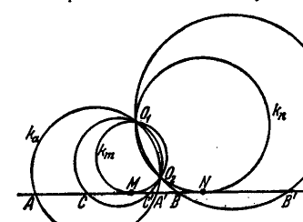

Сопоставляя рис. 149а и 149б, легко понять, что две пары точек $A$, $A'$ и $B$, $B'$ определяют гиперболическую инволюцию (т. е. обладающую двойными точками), если эти пары точек не разделяют друг друга, и эллиптическую (т. е. не имеющую двойных точек) — в том случае, когда они друг друга разделяют.

**§ 153. Определение кривой второго порядка по данным четырем ее точкам и одной касательной.**

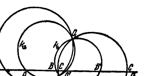

З а д а ч а. Даны четыре точки и касательная линии второго порядка. Найти точку прикосновения данной касательной.

Эту задачу можно рассматривать, как задачу определения кривой второго порядка по данным четырем ее точкам и одной касательной; в самом деле, после того, как мы определим точку прикосновения данной касательной, мы будем знать пять точек кривой, а пятью точками кривая второго порядка определяется вполне.

Р е ш е н и е. Пусть $A$, $B$, $C$, $D$ — четыре данные точки искомой линии второго порядка и $t$ — данная ее касательная. Рассмотрим пучок линий второго порядка с базисными точками $A$, $B$, $C$, $D$. Линии этого пучка согласно второй теореме Дезарга пересекают прямую $t$ в парах соответствующих точек одной инволюции. Искомая линия включается в указанный пучок и точка ее прикосновения

---
**стр. 419**
---

является двойной точкой этой инволюции. Таким образом, задача приводится к разыскиванию двойных точек инволюции. Для определения их нужно знать две пары соответствующих точек. Мы получим их, пересекая прямую $t$ двумя какими-либо линиями пучка. Для этой цели удобнее всего взять две вырожденные линии пучка, например, пару прямых $AB$, $CD$ и пару прямых $AD$, $BC$ (рис. 150).

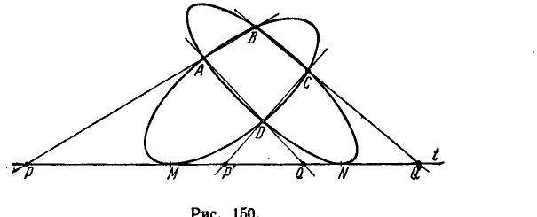

Пусть $P$, $P'$ и $Q$, $Q'$ — пары точек, в которых эти вырожденные линии второго порядка пересекают прямую $t$. Если пары $P$, $P'$ и $Q$, $Q'$ не разделяют друг друга, то, применяя метод, изложенный в предыдущем параграфе, мы найдем две двойные точки инволюции $M$ и $N$. Каждая из них является точкой прикосновения с прямой $t$ некоторой линии второго порядка, проходящей через данные точки $A$, $B$, $C$, $D$. В этом случае, следовательно, задача имеет два решения.

Если пары $P$, $P'$ и $Q$, $Q'$ разделяют одна другую, то инволюция, определенная этими парами, не имеет двойных точек. В этом случае задача (на вещественной плоскости) решений не имеет.

**§ 154.** Мы привели в этом разделе ряд конкретных теорем о проективных свойствах линий второго порядка. Источником их является изложенное нами выше построение линии второго порядка при помощи двух проективных пучков. Естественно поставить вопрос, можно ли распространить те же методы на теорию линий высших порядков. В принципе это возможно. Например, линии третьего порядка можно строить при помощи двух проективных пучков, из которых один является пучком линий второго порядка, а другой — пучком прямых. Как именно, — мы сейчас покажем.

Пусть

$$a_{11}x^2 + 2a_{12}xy + a_{22}y^2 + 2a_{13}x + 2a_{23}y + a_{33} +$$
$$+ \lambda (b_{11}x^2 + 2b_{12}xy + b_{22}y^2 + 2b_{13}x + 2b_{23}y + b_{33}) = 0 \quad (*)$$

---
**стр. 420**
---

— пучок линий второго порядка и

$$y - y_1 = \lambda' (x - x_1) \quad (**)$$

— пучок прямых. Сопоставим с линией пучка (*), отвечающей некоторому значению параметра $\lambda$, ту прямую пучка (**), которая отвечает значению параметра $\lambda'$, определяемому формулой

$$\lambda' = \frac{\alpha \lambda + \beta}{\gamma \lambda + \delta}, \quad (***)$$

где $\alpha$, $\beta$, $\gamma$, $\delta$ — постоянные, удовлетворяющие условию $\alpha \delta - \beta \gamma \neq 0$.

Такое соответствие между элементами пучков (*) и (**) будем называть проективным.

Результат исключения параметров $\lambda$ и $\lambda'$ из соотношений (*), (**) и (***) представляет собой уравнение

$$\Phi (x, y) = 0$$

третьей степени относительно $x$, $y$. Отсюда имеем:

*Геометрическое место точек пересечения соответствующих линий двух проективных пучков, из которых один представляет собой пучок кривых второго порядка, а другой — пучок прямых, является линией третьего порядка.*

Обобщая понятие проективного соответствия на случай двух пучков линий второго порядка, можно подобным же образом конструктивно определить линии четвертого порядка и т. д.

Проективное соответствие между пучками линий первого, второго и т. д. порядков представляется возможным высказать в чисто геометрических терминах; вместе с тем, следовательно, возможно дать конструктивное и чисто геометрическое определение образов высших степеней. Основанное на этой идее исследование конкретных свойств образов высших степеней предпринималось некоторыми авторами, однако оно отнюдь не так просто и наглядно, как исследование линий второго порядка, и по своему специальному характеру выходит из рамок задач этой книги *).

*) Читателю, желающему более подробно ознакомиться с конструктивными предложениями проективной геометрии, мы рекомендуем книгу: Н. А. Глаголев, Проективная геометрия.
