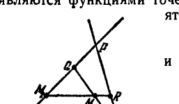

## 2. Проективная группа и её основные подгруппы

---
**стр. 426**
---

произведение $h^{-1}g$ превращает $A$ в $B$. Отсюда следует эквивалентность фигур $A$ и $B$.

Мы видим, что условия, определяющие группу преобразований, нужны для обеспечения основных свойств эквивалентности фигур (рефлексивности и транзитивности), без которых не было бы смысла употреблять термин «эквивалентны».

Следуя Ф. Клейну, мы назовем *геометрическими* такие свойства фигур пространства $M$ и такие связанные с фигурами величины, которые инвариантны относительно любого преобразования из данной группы $G$ и которые, следовательно, одинаковы у всех эквивалентных фигур. Систему предложений о свойствах фигур и величин, инвариантных относительно всех преобразований группы $G$, мы будем называть *геометрией группы $G$*.

Идея Клейна рассматривать различные геометрии как теории инвариантов соответствующих групп, позволила вскрыть глубокие связи между геометриями, открытыми и исследованными к восьмидесятым годам XIX столетия. Эта идея была изложена Клейном при вступлении на эрлангенскую кафедру в 1872 году, в его лекции «Сравнительное рассмотрение новейших геометрических исследований», известной теперь под названием «Эрлангенской программы».

Конкретные приложения теоретико-групповых методов Клейна содержатся в следующем разделе.

**2. Проективная группа и ее основные подгруппы**

**§ 159.** В предыдущем параграфе мы определили понятие геометрии данной группы. Высказанное там определение является чрезвычайно общим, так как не накладывает никаких ограничений на пространство $M$ и группу $G$. Понятно, что геометрия данной группы $G$ будет содержательна лишь в том случае, когда эта группа $G$ и пространство $M$, на котором она задается, в достаточной мере конкретизированы. В последующем мы ограничимся рассмотрением геометрии проективной группы.

Исследование, которое будет нами проведено, покажет нам в новом свете и в определенной системе все те различные геометрии, которые изучались в предыдущих главах. Чтобы не усложнять изложения громоздкими алгебраическими выкладками, мы будем вести его для двумерного случая. Так как при этом мы будем пользоваться исключительно аналитическим методом, то распространение полученных результатов на случай высших размерностей не представит никакого труда. Для этого лишь нужно будет каждое из соотношений, которые нам встретятся, заменить соотношением такой же структуры, но с бо́льшим числом переменных. Указанное видоизменение легко выполнит сам читатель,

---
**стр. 427**
---

**§ 160. Проективная группа.** Рассмотрим проективную плоскость, т. е. совокупность точек, определяемых тройками однородных координат $(x_1, x_2, x_3)$. Взаимно однозначное отображение плоскости на себя, при котором каждой точке $M(x_1, x_2, x_3)$ соответствует точка $M'(x'_1, x'_2, x'_3)$ с координатами

$$\left.
\begin{aligned}
\rho' x'_1 &= c_{11}x_1 + c_{12}x_2 + c_{13}x_3, \\
\rho' x'_2 &= c_{21}x_1 + c_{22}x_2 + c_{23}x_3, \\
\rho' x'_3 &= c_{31}x_1 + c_{32}x_2 + c_{33}x_3,
\end{aligned}
\right\} \qquad (1)$$

где $c_{ik}$ — вещественные постоянные, удовлетворяющие условию

$$\Delta = \begin{vmatrix} c_{11} & c_{12} & c_{13} \\ c_{21} & c_{22} & c_{23} \\ c_{31} & c_{32} & c_{33} \end{vmatrix} \neq 0,$$

а $\rho'$ — любое число $\neq 0$, представляет собой проективное отображение, или, как мы еще говорим, проективное преобразование проективной плоскости.

В § 106 мы показали, что совокупность проективных преобразований обладает групповыми свойствами; именно, по теореме 23а преобразование, обратное проективному, само является проективным, а по теореме 23б произведение двух проективных преобразований есть проективное преобразование. Вследствие этого и на основании § 157 мы можем утверждать, что *совокупность проективных преобразований является группой.*

Заметим, что групповые свойства совокупности проективных преобразований легко установить чисто аналитическими средствами (в § 106 они установлены геометрически). В самом деле, пусть

$$\rho'_1 x'_i = \sum_{\alpha=1}^3 c_{i\alpha}^{(1)} x_\alpha \quad (i = 1, 2, 3) \qquad (2)$$

и

$$\rho'_2 x''_i = \sum_{\alpha=1}^3 c_{i\alpha}^{(2)} x'_\alpha \quad (i = 1, 2, 3) \qquad (3)$$

— аналитические представления двух проективных преобразований $M' = f_1(M)$ и $M' = f_2(M)$. Рассмотрим произвольную точку $M(x_1, x_2, x_3)$; первое преобразование переводит ее в некоторую точку $M'(x'_1, x'_2, x'_3)$, а второе переводит точку $M'(x'_1, x'_2, x'_3)$ в точку $M''(x''_1, x''_2, x''_3)$. Согласно формулам (2) и (3) мы имеем:

$$\rho'_2 x''_i = \sum_{\alpha=1}^3 c_{i\alpha}^{(2)} x'_\alpha = \sum_{\alpha=1}^3 c_{i\alpha}^{(2)} \left( \frac{1}{\rho_1} \sum_{\beta=1}^3 c_{\alpha\beta}^{(1)} x_\beta \right) = \frac{1}{\rho_1} \sum_{\beta=1}^3 \left( \sum_{\alpha=1}^3 c_{i\alpha}^{(2)} c_{\alpha\beta}^{(1)} \right) x_\beta.$$

---
**стр. 428**
---

Если мы положим $\rho'_1 \rho'_2 = \rho''$, $\sum_{\alpha=1}^{3} c_{i\alpha}^{(2)} c_{\alpha\beta}^{(1)} = c_{i\beta}$, то предыдущие соотношения можно будет записать в виде

$$\rho'' x''_i = \sum_{\beta=1}^{3} c_{i\beta} x_{\beta} \quad (i = 1, 2, 3). \quad (4)$$

Мы видим, что соотношения (4), аналитически представляющие преобразование $M'' = f_2(M') = f_2(f_1(M))$, т. е. произведение двух данных преобразований, имеют такую же структуру, как и соотношения (1). Далее, обозначим через $C^{(1)}$, $C^{(2)}$ и $C$ матрицы, составленные соответственно из величин $c_{ik}^{(1)}$, $c_{ik}^{(2)}$ и $c_{ik}$. Вследствие равенств $\sum_{\alpha=1}^{3} c_{i\alpha}^{(2)} c_{\alpha k}^{(1)} = c_{ik}$ матрица $C$ является произведением матриц $C^{(1)}$ и $C^{(2)}$:

$$C = C^{(2)} C^{(1)}. \quad (5)$$

Таким образом, произведение двух проективных преобразований (2) и (3) есть линейное преобразование (4), матрица которого равна произведению матриц преобразований (2) и (3).

Пусть $\Delta^{(1)}$, $\Delta^{(2)}$ и $\Delta$ — определители матриц $C^{(1)}$, $C^{(2)}$ и $C$. Из формулы (5) следует числовое равенство

$$\Delta = \Delta^{(1)} \Delta^{(2)}. \quad (6)$$

Отсюда, если $\Delta^{(1)} \neq 0$ и $\Delta^{(2)} \neq 0$, то и $\Delta \neq 0$. Тем самым доказано, что произведение проективных преобразований есть линейное преобразование с определителем, отличным от нуля, т. е. проективное преобразование.

Чтобы убедиться, что преобразование, обратное проективному, тоже является проективным, достаточно заметить, что при $\Delta \neq 0$ из соотношений (1) величины $x_1$, $x_2$, $x_3$ выражаются через $x'_1$, $x'_2$, $x'_3$ линейно. Далее, линейное преобразование, получаемое обращением формул (1), очевидно, имеет матрицу, обратную матрице преобразования (1); определитель ее $\Delta'$ равен $\frac{1}{\Delta}$. Следовательно, $\Delta' \neq 0$.

Поскольку преобразование, обратное проективному, представляет собой линейное преобразование с определителем, отличным от нуля, оно само является проективным. Итак, путем несложных алгебраических выкладок мы установили, что совокупность проективных преобразований является группой, так как удовлетворяет двум условиям, которые согласно § 157 характеризуют группу преобразований.

Группу проективных преобразований называют *проективной*. Каждое отдельное преобразование проективной группы определяется при помощи численного задания величин $c_{ik}$ в формулах (1).

---
**стр. 429**
---

Однако, вследствие однородности формул (1), для определения преобразования (1) достаточно задать восемь о т н о ш е н и й величин $c_{ik}$. Эти восемь отношений называются *параметрами проективной группы*.

В том случае, когда каждое преобразование, входящее в (какую бы то ни было) группу, определяется путем численного задания $n$ независимых параметров, говорят, что это — *$n$-членная группа*. Таким образом, проективная группа (на плоскости) является восьмичленной.

**§ 161. И н в а р и а н т ы   п р о е к т и в н о й   г р у п п ы.**

Проективная геометрия представляет собой дисциплину, изучающую такие свойства фигур и такие связанные с фигурами величины, которые инвариантны относительно любого проективного преобразования. Поэтому мы можем проективную геометрию определить как геометрию проективной группы.

При изучении проективной геометрии особый интерес представляют инварианты проективной группы, так как именно они в проективной геометрии являются геометрическими величинами.

Мы назовем инвариантом $n$ произвольных точек относительно проективной группы скалярную функцию $F(M_1, M_2, \dots, M_n)$, не равную тождественно постоянной, но принимающую равные значения на таких системах $n$ точек, которые переводятся друг в друга при помощи проективного преобразования *).

Заметим, что проективная группа не имеет инвариантов от трех и менее точек. Это легко доказать рассуждением «от противного». В самом деле, допустим, что существует инвариант трех точек $F(M_1, M_2, M_3)$. Выберем на плоскости какие-нибудь три точки $M_1^0, M_2^0, M_3^0$ и обозначим через $c$ значение функции $F(M_1^0, M_2^0, M_3^0)$. Пусть $M_1, M_2, M_3$ — л ю б ы е три точки. Мы знаем, что, каковы бы ни были три точки $M_1, M_2, M_3$ и три точки $M_1^0, M_2^0, M_3^0$, существует проективное преобразование, переводящее точки $M_1, M_2, M_3$ в точки $M_1^0, M_2^0, M_3^0$. Поэтому $F(M_1, M_2, M_3) = c = \text{const}$ вопреки определению инварианта. Точно так же можно доказать, что проективная группа не имеет инварианта четырех п р о и з в о л ь н ы х точек. Но относительно проективной группы существует инвариант четырех точек, л е ж а щ и х   н а   о д н о й   п р я м о й: таковым является сложное отношение (см. § 115).

При $n \geqslant 5$ существуют уже инварианты произвольной системы $n$ точек. Замечательно, что все они могут быть выражены через

---
**стр. 430**
---

сложные отношения. Это обстоятельство станет ясным, если рассмотреть простейший случай $n = 5$.

Пусть $M_1, M_2, M_3, M_4, M_5$ — пять произвольных точек плоскости. При помощи построения, указанного на рис. 151, мы можем по данным точкам $M_1, M_2, M_3, M_4, M_5$ определить две четверки прямолинейно расположенных точек $M_1, Q, M_2, P$ и $M_5, R, M_4, P$. Очевидно, сложные отношения $(M_1 Q M_2 P) = f_1$ и $(M_5 R M_4 P) = f_2$ являются функциями точек $M_1, M_2, M_3, M_4, M_5$, каковое обстоятельство мы выразим записью

$$f_1 = f_1 (M_1, M_2, M_3, M_4, M_5)$$

и

$$f_2 = f_2 (M_1, M_2, M_3, M_4, M_5).$$

Эти функции являются инвариантами проективной группы. В самом деле, пусть $M'_1, M'_2, M'_3, M'_4, M'_5$ — новая система пяти точек и $P', Q', R'$ — три точки, определенные по точкам $M'_i$ так же, как $P, Q, R$ — по точкам $M_i$. Если некоторое проективное отображение переводит точки $M_1, \dots, M_5$ в точки $M'_1, \dots, M'_5$, то это же отображение переведет точки $P, Q, R$ в точки $P', Q', R'$, вследствие чего $(M_1 Q M_2 P) = (M'_1 Q' M'_2 P')$ и $(M_5 R M_4 P) = (M'_5 R' M'_4 P')$. Таким образом, всякий раз, когда система точек $M_1, \dots, M_5$ проективно эквивалентна системе $M'_1, \dots, M'_5$, имеют место равенства $f_1(M_1, \dots, M_5) = f_1(M'_1, \dots, M'_5)$ и $f_2(M_1, \dots, M_5) = f_2(M'_1, \dots, M'_5)$. А это и означает, что $f_1$ и $f_2$ являются проективными инвариантами.

Более того, легко установить, что и обратно, если имеем $f_1(M_1, \dots, M_5) = f_1(M'_1, \dots, M'_5)$ и $f_2(M_1, \dots, M_5) = f_2(M'_1, \dots, M'_5)$, то система пяти точек $M_1, \dots, M_5$ проективно эквивалентна системе $M'_1, \dots, M'_5$. В самом деле, пусть $M_1, \dots, M_5$ и $M'_1, \dots, M'_5$ — две системы точек, удовлетворяющие соотношениям $f_1(M_1, \dots, M_5) = f_1(M'_1, \dots, M'_5)$ и $f_2(M_1, \dots, M_5) = f_2(M'_1, \dots, M'_5)$. Мы можем построить проективное отображение $M' = \varphi(M)$, которое переводит четыре точки $M_1, M_2, M_4, M_5$ в четыре точки $M'_1, M'_2, M'_4, M'_5$; при этом же отображении точка $P$ перейдет в точку $P'$. По условию $f_1(M_1, \dots, M_5) = f_1(M'_1, \dots, M'_5)$, т. е. $(M_1 Q M_2 P) = (M'_1 Q' M'_2 P')$, и потому отображение $M' = \varphi(M)$ должно перевести точку $Q$ в точку $Q'$. Аналогично, из равенства $f_2(M_1, \dots, M_5) = f_2(M'_1, \dots, M'_5)$ следует, что отображение $M' = \varphi(M)$ переводит точку $R$ в точку $R'$. Но тогда, очевидно, отображение $M' = \varphi(M)$ переводит точку $M_3$ в точку $M'_3$. Тем самым эквивалентность системы $M_1, \dots, M_5$ системе $M'_1, \dots, M'_5$ доказана.

---
**стр. 431**
---

Предположим теперь, что $F(M_1, M_2, M_3, M_4, M_5)$ — какой угодно проективный инвариант пяти точек. Возьмем произвольную систему точек $M_1, M_2, M_3, M_4, M_5$ и будем ее деформировать так, чтобы величины $f_1(M_1, M_2, M_3, M_4, M_5)$ и $f_2(M_1, M_2, M_3, M_4, M_5)$ оставались неизменными. По предыдущему, все системы, получаемые такой деформацией, эквивалентны исходной и, следовательно, при этой деформации функция $F(M_1, M_2, M_3, M_4, M_5)$ сохраняет неизменную величину. Таким образом, если $f_1$ и $f_2$ получают определенные численные значения, то $F$ также получает определенное численное значение, следовательно, $F$ есть некоторая функция от $f_1$ и $f_2$, т. е. $F$ имеет вид $F = \Phi(f_1, f_2)$.

Совершенно аналогичными рассуждениями можно показать, что любой проективный инвариант $F(M_1, M_2, \dots, M_n)$ при $n \geqslant 5$ выражается через сложные отношения. Поэтому сложное отношение называют основным инвариантом проективной группы.

**§ 162. Г р у п п ы   а в т о м о р ф и з м о в.**

Пусть дана какая-нибудь группа преобразований $G$ произвольного пространства $M$. Преобразования группы $G$, преобразующие в самое себя некоторое точечное множество $U$ пространства $M$, называются *автоморфными преобразованиями* или, короче, *автоморфизмами относительно множества $U$*; автоморфизмы могут перемещать точки множества $U$, но только так, что каждая точка множества $U$ перемещается в точку этого же множества.

Совокупность всех преобразований группы $G$, автоморфных относительно некоторого множества $U$, является группой.

В самом деле:

1) Если каждое из двух преобразований группы $G$ преобразует множество $U$ в самое себя, то произведение этих преобразований есть преобразование группы $G$, обладающее тем же свойством, т. е. произведение двух автоморфизмов есть автоморфизм.

2) Если некоторое преобразование группы $G$ преобразует множество $U$ в самое себя, то обратное преобразование есть преобразование группы $G$, обладающее тем же свойством, т. е. преобразование, обратное автоморфизму, есть автоморфизм.

На основании изложенного в § 157 эти свойства характеризуют групповой характер совокупности автоморфизмов.

**§ 163. Аффинная группа.**

Отметим на проективной плоскости произвольную прямую: условимся называть ее *бесконечно удаленной* и обозначать символом $\infty$. Совокупность проективных преобразований, автоморфных относительно прямой $\infty$, по предыдущему, является подгруппой проективной группы. Мы будем называть ее *аффинной группой*, а каждое принадлежащее ей преобразование — *аффинным*.

Очевидно, аффинные преобразования переводят конечные точки проективной плоскости (т. е. точки, не принадлежащие

---
**стр. 432**
---

прямой $\infty$) в конечные же точки. Поэтому аффинные преобразования являются также взаимно однозначными преобразованиями множества конечных точек проективной плоскости, т. е. взаимно однозначными преобразованиями проективной плоскости, разрезанной вдоль прямой $\infty$.

Проективную плоскость без прямой $\infty$ мы будем называть *аффинной плоскостью* *).

Постараемся получить аналитическое представление аффинных преобразований. С этой целью введем на проективной плоскости, из рассмотрения которой мы сейчас исходили, проективные однородные координаты $(x_1, x_2, x_3)$ так, чтобы в этих координатах прямая $\infty$ имела уравнение $x_3 = 0$. Пусть формулы

$$\left. \begin{aligned} \rho' x'_1 &= c_{11} x_1 + c_{12} x_2 + c_{13} x_3, \\ \rho' x'_2 &= c_{21} x_1 + c_{22} x_2 + c_{23} x_3, \\ \rho' x'_3 &= c_{31} x_1 + c_{32} x_2 + c_{33} x_3 \end{aligned} \right\} \quad (*)$$

определяют некоторое проективное преобразование. Это преобразование будет аффинным, если из $x_3 = 0$ при любых $x_1, x_2$ следует равенство $x'_3 = 0$ (т. е. если прямая $x_3 = 0$ отображается на самое себя). А для этого необходимо и достаточно, чтобы коэффициенты $c_{31}$ и $c_{32}$ были равны нулю. Таким образом, мы получаем следующие представления аффинных преобразований:

$$\left. \begin{aligned} \rho' x'_1 &= c_{11} x_1 + c_{12} x_2 + c_{13} x_3, \\ \rho' x'_2 &= c_{21} x_1 + c_{22} x_2 + c_{23} x_3, \\ \rho' x'_3 &= c_{33} x_3. \end{aligned} \right\} \quad (**)$$

Так как для каждой конечной точки $x_3 \neq 0$, то аффинная плоскость может быть арифметизирована в целом при помощи неоднородных координат $\frac{x_1}{x_3} = x$, $\frac{x_2}{x_3} = y$. Поэтому при исследовании аффинной группы употребление однородных координат излишне. Мы получим аналитическое представление аффинной группы в неоднородных координатах, если разделим первое и второе из равенств (**) на третье и положим $\frac{x_1}{x_3} = x$, $\frac{x_2}{x_3} = y$, $\frac{x'_1}{x'_3} = x'$, $\frac{x'_2}{x'_3} = y'$; если еще при этом ввести обозначения $\frac{c_{i1}}{c_{33}} = a_i$, $\frac{c_{i2}}{c_{33}} = b_i$, $\frac{c_{i3}}{c_{33}} = c_i$, то результат можно будет записать в виде

$$\left. \begin{aligned} x' &= a_1 x + b_1 y + c_1, \\ y' &= a_2 x + b_2 y + c_2. \end{aligned} \right\} \quad (A)$$

*) По своей топологической структуре аффинная плоскость не отличается от евклидовой.

---
**стр. 433**
---

Каждое преобразование вида (A) является аффинным, но при условии $\Delta = \begin{vmatrix} a_1 & b_1 \\ a_2 & b_2 \end{vmatrix} \neq 0$; в противном случае это преобразование не будет взаимно однозначным.

Так как формулы (A) содержат шесть параметров, то аффинная группа является шестичленной.

**§ 164. И н в а р и а н т ы   а ф ф и н н о й   г р у п п ы.** Геометрию аффинной группы называют *аффинной*.

Аффинная геометрия, изучающая свойства фигур и связанные с фигурами величины, инвариантные относительно аффинной группы, существенно отличается от проективной геометрии. Например, в то время как в проективной геометрии (на проективной плоскости) всякие две прямые пересекаются, в аффинной геометрии (на аффинной плоскости) существуют параллельные прямые. Именно, прямые проективной плоскости, сходящиеся в некоторой точке прямой $\infty$, при разрезе проективной плоскости вдоль прямой $\infty$ превращаются в параллельные прямые аффинной плоскости (так как общая их точка при разрезе удаляется). Очевидно, в аффинной геометрии имеет место евклидов постулат о параллельных: через каждую точку вне данной прямой проходит одна и только одна прямая, параллельная данной. Заметим еще, что на аффинной прямой, как и на евклидовой, имеет место линейный порядок точек (см. § 94).

Обратимся к вопросу об инвариантах аффинной группы, т. е. о величинах, геометрических с точки зрения аффинной геометрии.

Прежде всего, заметим, что все проективные инварианты вместе с тем являются и аффинными инвариантами. В самом деле, если некоторая функция инвариантна относительно всех проективных преобразований, то она инвариантна и при всех аффинных преобразованиях, так как аффинные преобразования составляют часть проективных. Напротив, существуют аффинные не проективные инварианты.

Основным аффинным инвариантом является *простое отношение трех точек, лежащих на одной прямой*. Простое отношение трех точек $M_1 (x_1, y_1)$, $M_2 (x_2, y_2)$, $M_3 (x_3, y_3)$, для обозначения которого мы введем символ $(M_1 M_2 M_3)$, может быть определено любой из двух формул *):

$$(M_1 M_2 M_3) = \frac{x_2 - x_1}{x_3 - x_2},$$

$$(M_1 M_2 M_3) = \frac{y_2 - y_1}{y_3 - y_2}.$$

*) То, что эти формулы определяют одну величину, легко доказать, пользуясь уравнением прямой: $y = kx + l$.

---
**стр. 434**
---

Доказательство инвариантности функции $(M_1 M_2 M_3)$ не представляет никакого труда. В самом деле, пусть $M_1', M_2', M_3'$ — три точки, получающиеся при помощи какого-либо преобразования вида (A) из точек $M_1, M_2, M_3$. Если через $x_i', y_i'$ мы обозначим координаты точек $M_i'$, то из формул (A) получим:

$$x_2' - x_1' = a_1 (x_2 - x_1) + b_1 (y_2 - y_1) =$$
$$= (M_1 M_2 M_3) [a_1 (x_3 - x_2) + b_1 (y_3 - y_2)],$$
$$x_3' - x_2' = a_1 (x_3 - x_2) + b_1 (y_3 - y_2),$$

откуда

$$(M_1' M_2' M_3') = \frac{x_2' - x_1'}{x_3' - x_2'} = (M_1 M_2 M_3),$$

а это и означает, что функция $(M_1 M_2 M_3)$ инвариантна относительно любого аффинного преобразования. Аффинных инвариантов трех произвольно расположенных точек (не лежащих на одной прямой) не существует. Это объясняется тем, что произвольные три точки, не принадлежащие одной прямой, можно аффинно преобразовать в какие угодно другие три точки, не лежащие на одной прямой (в § 161 мы указали, что проективная группа не имеет инвариантов четырех произвольных точек; доказательство предложения о том, что аффинная группа не имеет инварианта трех произвольных точек, вполне аналогично). При $n \geqslant 4$ существуют аффинные инварианты произвольной системы $n$ точек. Замечательно, что все они могут быть выражены через простые отношения (это можно доказать при помощи рассуждений, аналогичных тем, какие мы проводили в § 161). Поэтому простое отношение трех точек прямой и называется *основным инвариантом аффинной группы*.

**З а м е ч а н и е.** Аффинную плоскость и, соответственно, аффинную геометрию можно определить совершенно независимо от проективной геометрии при помощи надлежащей системы аксиом. Именно, аффинной плоскостью можно назвать совокупность объектов двух видов — точек и прямых, удовлетворяющих требованиям аксиом пяти групп, из которых:

первая группа, определяющая отношения взаимной принадлежности объектов, содержит первые три аксиомы I группы системы аксиом евклидовой геометрии (§ 12) (т. е. двумерные аксиомы I группы);

вторая группа, определяющая порядок точек на прямой, совпадает со второй группой аксиом евклидовой геометрии (так как на аффинной прямой имеет место линейный порядок точек, то аффинные аксиомы порядка должны совпадать с аксиомами порядка евклидовой геометрии);

третья группа содержит аксиому непрерывности Дедекинда;

четвертая группа содержит аксиому параллельности Евклида;

---
**стр. 435**
---

пятая группа содержит предложение Дезарга (формулировку которого следует несколько изменить, учитывая существование параллельных прямых) *).

Для определения аффинного пространства следует принять все аксиомы трехмерной геометрии Евклида, кроме аксиом конгруэнтности.

В свое время мы доказали, что аксиомы, лежащие в основании элементарной геометрии, составляют полную систему. Точно так же можно доказать, что система аксиом аффинной геометрии полна. Между тем система аффинных аксиом является частью гильбертовой системы. Это обстоятельство на первый взгляд кажется парадоксальным. Однако объяснение его несложно.

Дело в том, что полнота аффинных аксиом, означающая, что любая их реализация изоморфна одной определенной реализации (например, арифметической), не препятствует прибавлению к аффинным аксиомам новых аксиом конгруэнтности, поскольку вместе с этими аксиомами вводится также и новое отношение геометрических объектов (именно, отношение конгруэнтности). В связи с этим см. определение полноты системы аксиом, высказанное в § 75.

**§ 165. А ф ф и н н а я   у н и м о д у л я р н а я   г р у п п а.** Аффинное преобразование

$$\left. \begin{aligned} x' &= a_1 x + b_1 y + c_1, \\ y' &= a_2 x + b_2 y + c_2 \end{aligned} \right\} \quad (*)$$

мы будем называть *унимодулярным*, если

$$\Delta = \begin{vmatrix} a_1 & b_1 \\ a_2 & b_2 \end{vmatrix} = \pm 1.$$

Нетрудно показать, что аффинные унимодулярные преобразования составляют группу. В самом деле:

1) Произведение двух аффинных унимодулярных преобразований есть аффинное унимодулярное преобразование.

Чтобы доказать это, заметим, что если преобразование

$$\left. \begin{aligned} x'' &= a_1 x + b_1 y + c_1, \\ y'' &= a_2 x + b_2 y + c_2 \end{aligned} \right\}$$

является произведением преобразований

$$\left. \begin{aligned} x' &= a_1^{(1)} x + b_1^{(1)} y + c_1^{(1)}, \\ y' &= a_2^{(1)} x + b_2^{(1)} y + c_2^{(1)} \end{aligned} \right\}$$

*) См. Д. Гильберт, Основания геометрии.

---
**стр. 436**
---

и

$$\left. \begin{aligned} x'' &= a_1^{(2)} x' + b_1^{(2)} y' + c_1^{(2)}, \\ y'' &= a_2^{(2)} x' + b_2^{(2)} y' + c_2^{(2)} \end{aligned} \right\},$$

то матрицы этих преобразований связаны соотношением

$$\begin{Vmatrix} a_1 & b_1 \\ a_2 & b_2 \end{Vmatrix} = \begin{Vmatrix} a_1^{(2)} & b_1^{(2)} \\ a_2^{(2)} & b_2^{(2)} \end{Vmatrix} \cdot \begin{Vmatrix} a_1^{(1)} & b_1^{(1)} \\ a_2^{(1)} & b_2^{(1)} \end{Vmatrix}.$$

Отсюда для определителей этих матриц имеет место равенство $\Delta = \Delta^{(1)} \Delta^{(2)}$. Следовательно, если $\Delta^{(1)} = \pm 1$ и $\Delta^{(2)} = \pm 1$, то $\Delta = \pm 1$.

2) Преобразование, обратное аффинному унимодулярному, является аффинным унимодулярным.

Чтобы доказать это, достаточно заметить, что взаимно обратные аффинные преобразования имеют взаимно обратные матрицы, а следовательно, и взаимно обратные определители, т. е. если $\Delta_1$ — определитель данного преобразования, $\Delta_2$ — определитель обратного ему, то $\Delta_2 = \frac{1}{\Delta_1}$. Отсюда, если $\Delta_1 = \pm 1$, то $\Delta_2 = \pm 1$.

Мы видим, что совокупность унимодулярных преобразований удовлетворяет двум условиям, которые согласно § 157 определяют групповой характер совокупности преобразований. Таким образом, унимодулярные преобразования действительно составляют группу. Мы будем называть ее, как и основанную на ней геометрию, *аффинной унимодулярной*.

Аффинная унимодулярная группа является пятичленной, так как в случае унимодулярного преобразования шесть параметров формул (*) связаны одним уравнением $a_1 b_2 - a_2 b_1 = \pm 1$ и, следовательно, независимых из них имеется только пять.

Очевидно, все объекты общей аффинной геометрии являются, вместе с тем, и объектами аффинной унимодулярной геометрии. Но в последней имеются объекты, не принадлежащие первой, так как класс инвариантов аффинной унимодулярной группы шире класса инвариантов общей аффинной группы.

Мы покажем сейчас, что аффинная унимодулярная группа имеет инвариант трех произвольно расположенных точек. Пусть три произвольные точки аффинной плоскости $M_1 (x_1, y_1)$, $M_2 (x_2, y_2)$, $M_3 (x_3, y_3)$ при некотором аффинном унимодулярном преобразовании переходят в три точки $M_1' (x_1', y_1')$, $M_2' (x_2', y_2')$, $M_3' (x_3', y_3')$. Тогда, как нетрудно установить прямым вычислением, имеет место равенство

$$\begin{vmatrix} 1 & 1 & 1 \\ x_1' & x_2' & x_3' \\ y_1' & y_2' & y_3' \end{vmatrix} = \begin{vmatrix} a_1 & b_1 \\ a_2 & b_2 \end{vmatrix} \cdot \begin{vmatrix} 1 & 1 & 1 \\ x_1 & x_2 & x_3 \\ y_1 & y_2 & y_3 \end{vmatrix} = \pm \begin{vmatrix} 1 & 1 & 1 \\ x_1 & x_2 & x_3 \\ y_1 & y_2 & y_3 \end{vmatrix}.$$

---
**стр. 437**
---

Отсюда видно, что абсолютная величина определителя $\begin{vmatrix} 1 & 1 & 1 \\ x_1 & x_2 & x_3 \\ y_1 & y_2 & y_3 \end{vmatrix}$ является инвариантом трех точек $M_1, M_2, M_3$.

В аффинной унимодулярной геометрии с каждым треугольником $M_1 M_2 M_3$ можно сопоставить инвариант

$$S = \text{абс. вел. } \frac{1}{2} \begin{vmatrix} 1 & 1 & 1 \\ x_1 & x_2 & x_3 \\ y_1 & y_2 & y_3 \end{vmatrix}.$$

Число $S$ называется *площадью* треугольника $M_1 M_2 M_3$. Очевидно, в аффинной унимодулярной геометрии можно определить также понятие площади многоугольника и площади криволинейной фигуры. Именно, площадью многоугольника можно назвать сумму площадей составляющих его треугольников, а площадью криволинейной фигуры — предел последовательности площадей многоугольников, аппроксимирующих эту фигуру.

Таким образом, унимодулярная геометрия имеет в числе своих объектов площади фигур.

**§ 166. О р т о г о н а л ь н а я   г р у п п а.** Аффинное преобразование

$$\left. \begin{aligned} x' &= a_1 x + b_1 y + c_1, \\ y' &= a_2 x + b_2 y + c_2 \end{aligned} \right\} \quad (1)$$

называется *ортогональным*, если матрица его

$$A = \begin{Vmatrix} a_1 & b_1 \\ a_2 & b_2 \end{Vmatrix} \quad (2)$$

удовлетворяет условию

$$AA' = I, \quad (3)$$

где штрих обозначает операцию транспонирования, а $I$ — единичная матрица, т. е.

$$A' = \begin{Vmatrix} a_1 & a_2 \\ b_1 & b_2 \end{Vmatrix}, \quad I = \begin{Vmatrix} 1 & 0 \\ 0 & 1 \end{Vmatrix}.$$

Докажем, что совокупность ортогональных преобразований обладает групповыми свойствами.

1) Произведение двух ортогональных преобразований есть ортогональное преобразование.

**Д о к а з а т е л ь с т в о.** Пусть даны ортогональные преобразования с матрицами $A_1$ и $A_2$; произведение их есть аффинное преобразование с матрицей $A = A_2 A_1$. На основании правила перемножения матриц мы можем написать тождество

$$AA' = (A_2 A_1) (A_2 A_1)' = (A_2 A_1) (A_1' A_2') = A_2 (A_1 A_1') A_2'.$$

---
**стр. 438**
---

Отсюда и вследствие равенств $A_1 A_1' = I$, $A_2 A_2' = I$ имеем:

$$AA' = A_2 I A_2' = A_2 A_2' = I.$$

Тем самым требуемое доказано.

2) Преобразование, обратное ортогональному, является ортогональным.

**Д о к а з а т е л ь с т в о.** Пусть $A$ — матрица некоторого ортогонального преобразования и $B = A^{-1}$ — матрица преобразования, обратного ему. Из условия ортогональности $AA' = I$ следует, что $A' = A^{-1}$. Таким образом, $B = A'$. Отсюда

$$BB' = A' (A')' = A' A = A^{-1} A = I.$$

Тем самым требуемое доказано.

Таким образом, совокупность ортогональных преобразований есть группа. Мы будем называть ее *ортогональной группой*.

Из равенства (3) следует, что определитель матрицы $A$ равен $\pm 1$. Отсюда заключаем, что ортогональная группа является подгруппой унимодулярной группы.

Условие ортогональности, записанное в матричной форме (3), равносильно трем скалярным соотношениям:

$$\left. \begin{aligned} a_1^2 + b_1^2 &= 1, \\ a_2^2 + b_2^2 &= 1, \\ a_1 a_2 + b_1 b_2 &= 0. \end{aligned} \right\} \quad (4)$$

Поскольку ортогональная группа выделяется из аффинной при помощи наложения трех связей на шесть параметров $a_i, b_i, c_i$, она является трехчленной.

Условиям ортогональности можно придать форму, отличную от формы (4). В самом деле, как показано выше (при доказательстве ортогональности преобразования, обратного данному), матрица $A$ ортогонального преобразования удовлетворяет соотношению

$$A' A = I.$$

Отсюда имеем:

$$\left. \begin{aligned} a_1^2 + a_2^2 &= 1, \\ b_1^2 + b_2^2 &= 1, \\ a_1 b_1 + a_2 b_2 &= 0. \end{aligned} \right\} \quad (4')$$

Системы равенств (4) и (4') равносильны друг другу.

В отличие от всех ранее рассмотренных групп, ортогональная группа имеет инвариант двух точек. Таковым является, например, функция двух точек $M_1 (x_1, y_1)$, $M_2 (x_2, y_2)$

$$\rho (M_1, M_2) = \sqrt{(x_2 - x_1)^2 + (y_2 - y_1)^2}.$$

---
**стр. 439**
---

Инвариантность этой функции может быть установлена при помощи простых выкладок. Именно, пусть $M_1' (x_1', y_1')$ и $M_2' (x_2', y_2')$ — две точки, полученные ортогональным преобразованием из точек $M_1 (x_1, y_1)$ и $M_2 (x_2, y_2)$. Мы имеем:

$$\rho (M_1', M_2') = \sqrt{(x_2' - x_1')^2 + (y_2' - y_1')^2} =$$
$$= \sqrt{[a_1 (x_2 - x_1) + b_1 (y_2 - y_1)]^2 + [a_2 (x_2 - x_1) + b_2 (y_2 - y_1)]^2} =$$
$$= \sqrt{(a_1^2 + a_2^2) (x_2 - x_1)^2 + 2(a_1 b_1 + a_2 b_2) (x_2 - x_1) (y_2 - y_1) + (b_1^2 + b_2^2) (y_2 - y_1)^2}.$$

Отсюда вследствие соотношений (4') получаем:

$$\rho (M_1', M_2') = \sqrt{(x_2 - x_1)^2 + (y_2 - y_1)^2} = \rho (M_1, M_2).$$

В геометрии ортогональной группы величина $\rho (M_1, M_2)$ называется *расстоянием* между точками $M_1$ и $M_2$. Расстояние представляет собой основной инвариант этой геометрии, так как все остальные инварианты могут быть выражены через расстояния.

Едва ли нужно объяснять, что геометрия ортогональной группы есть элементарная (евклидова) геометрия.

**§ 167. С р а в н е н и е   р а з л и ч н ы х   г е о м е т р и й.**

Мы рассмотрели проективную группу с ее основными подгруппами: аффинной, аффинной унимодулярной и ортогональной. Этим группам соответствуют геометрии: проективная, аффинная, аффинная унимодулярная и элементарная (евклидова).

Из перечисленных групп наиболее обширной является группа, лежащая в основе проективной геометрии (проективная группа), наиболее узкой — группа, лежащая в основе элементарной геометрии (ортогональная группа). Наряду с этим из перечисленных геометрий проективная геометрия имеет самый бедный класс объектов, элементарная — самый богатый. В элементарной геометрии можно рассматривать и аффинные объекты (простое отношение трех точек прямой, параллельность и т. д.) и проективные (сложное отношение четырех точек и т. д.). Напротив, в проективной геометрии не рассматриваются собственно аффинные свойства фигур, а в аффинной геометрии не рассматриваются метрические свойства, т. е. свойства, определяемые измерением отрезков.

Вообще, очевидно, чем шире группа, лежащая в основании геометрии, тем уже класс геометрических объектов. Это понятно, так как чем больше преобразований содержит группа, тем меньше соотношений и функций, остающихся инвариантными при всех ее преобразованиях. Но в связи с этим необходимо отметить, что свойства фигур и связанные с фигурами величины, инвариантные
