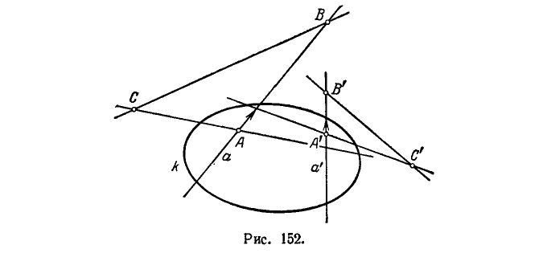
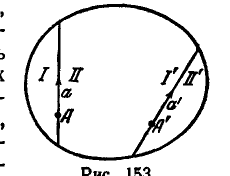
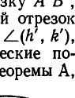
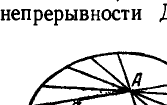
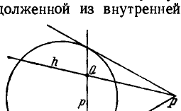
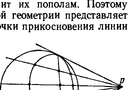

## 3. Геометрии Лобачевского, Римана и Евклида в проективной схеме

---
**стр. 440**
---

относительно какой-нибудь группы, являются более «стойкими», чем свойства фигур и величин, инвариантные относительно любой ее подгруппы, так как они выдерживают без изменений более многообразные преобразования.

**3. Геометрии Лобачевского, Римана и Евклида в проективной схеме**

**§ 168. Г р у п п а  а в т о м о р ф и з м о в  о т н о с и т е л ь н о  н е в ы р о ж д е н н о й  л и н и и  в т о р о г о  п о р я д к а.**

В этом разделе мы покажем, что геометрия Евклида, геометрия Лобачевского и геометрия Римана являются геометриями некоторых групп проективных автоморфизмов.

Пусть на проективной плоскости дана некоторая невырожденная линия второго порядка $k$. Мы будем рассматривать группу проективных автоморфизмов относительно линии $k$, т. е. группу проективных преобразований, отображающих линию $k$ на самое себя (то, что совокупность произвольных автоморфизмов составляет группу, доказано в § 162).

Имеют место следующие две важные теоремы:

**Т е о р е м а  А.** *Если $k$ — овальная линия и $A, A'$ — две произвольные точки, расположенные во внутренней области линии $k$, то существуют два и только два автоморфизма относительно $k$, переводящие точку $A$ в точку $A'$ и произвольно данное направление при точке $A$ — в произвольно данное направление при точке $A'$.*

**Т е о р е м а  Б.** *Если $k$ — нулевая линия и $A, A'$ — две произвольные точки проективной плоскости, то существуют два и только два автоморфизма относительно $k$, переводящие точку $A$ в точку $A'$ и произвольно данное направление при точке $A$ — в произвольно данное направление при точке $A'$*).*

**Д о к а з а т е л ь с т в о  теоремы А.** Пусть $a$ и $a'$ — прямые, проходящие через $A$ и $A'$ в данных направлениях (рис. 152). Обозначим через $C$ и $C'$ полюсы этих прямых относительно $k$, через $B$ — точку, в которой поляра точки $A$ пересекает прямую $a$, через $B'$ — точку, в которой поляра точки $A'$ пересекает прямую $a'$. Трехвершинник $ABC$ является автополярным относительно $k$, т. е. все его стороны суть поляры противоположных вершин. Аналогичным свойством обладает трехвершинник $A'B'C'$.

Введем на плоскости систему проективных однородных координат $x_1, x_2, x_3$, принимая трехвершинник $ABC$ в качестве координатного: $A(0, 0, 1)$, $B(1, 0, 0)$, $C(0, 1, 0)$. В этих координатах

---
*) Определение нулевой и овальной линий второго порядка дано в § 134; в теореме Б проективную плоскость следует мыслить пополненной мнимыми элементами, иначе понятие нулевой линии не будет иметь смысла.

---
**стр. 441**
---

уравнение линии $k$ будет иметь вид (см. § 134):

$$a_{11}x_1^2 + a_{22}x_2^2 + a_{33}x_3^2 = 0.$$

Выбирая надлежащим образом точку единиц $E(1, 1, 1)$, приведем уравнение линии $k$ к виду

$$x_1^2 + x_2^2 - x_3^2 = 0. \quad (1)$$

Заметим, что именно члены, содержащие первые две координаты, должны входить в уравнение с одинаковыми знаками, так как точка $A(0, 0, 1)$ лежит во внутренней области относительно линии $k$ (для этой точки левая часть уравнения (1) отрицательна; см. § 134).

Введем затем на плоскости новую систему проективных однородных координат $x'_1, x'_2, x'_3$, принимая в качестве координатного трехвершинник $A', B', C'$ так, чтобы его вершины имели следующие координаты: $A'(0, 0, 1)$, $B'(1, 0, 0)$, $C'(0, 1, 0)$. При надлежащем выборе точки единиц $E'(1, 1, 1)$ уравнение линии $k$ в новых координатах будет

$${x'_1}^2 + {x'_2}^2 - {x'_3}^2 = 0. \quad (2)$$

(В это уравнение с одинаковыми знаками должны входить именно члены, содержащие первые две координаты, так как точка $A'(0, 0, 1)$ лежит во внутренней области относительно линии $k$).

Предположим, что существует автоморфизм относительно линии $k$, который переводит точку $A$ в точку $A'$, прямую $a$ — в прямую $a'$ и заданное направление — в заданное направление (последнее означает, что точки, лежащие на прямой $a$ в заданном на ней циклическом порядке, переводятся в точки, расположенные в циклическом порядке, заданном на прямой $a'$). Так как при этом линия $k$ преобразуется в себя, то полюс прямой $a$ относительно $k$ должен перейти в полюс прямой $a'$ относительно $k$ и поляра точки $A$ должна перейти в поляру точки $A'$; иначе говоря, точки $A, B, C$

---
**стр. 442**
---

должны перейти в точки $A', B', C'$ (соответственно). В таком случае автоморфизм $\varphi$ должен представляться формулами

$$\rho' x'_1 = c_{11} x_1, \quad \rho' x'_2 = c_{22} x_2, \quad \rho' x'_3 = c_{33} x_3, \quad (3)$$

где $x_1, x_2, x_3$ — старые координаты прообраза, $x'_1, x'_2, x'_3$ — новые координаты образа. Преобразуя уравнение (2) по формулам (3), получим:

$$c_{11}^2 x_1^2 + c_{22}^2 x_2^2 - c_{33}^2 x_3^2 = 0. \quad (4)$$

Это есть уравнение прообраза линии $k$ в старых координатах. Так как $\varphi$ — автоморфизм относительно линии $k$, то уравнения (1) и (4) должны быть эквивалентны; отсюда следует, что должны иметь место равенства

$$|c_{11}| = |c_{22}| = |c_{33}|.$$

Так как в формулах (3) множитель $\rho'$ можно брать произвольно, то без потери общности мы можем считать модули чисел $c_{11}, c_{22}, c_{33}$ равными единице и число $c_{11}$ положительным. Допустим для определенности записи последующих формул, что заданное направление в точке $A$ идет в область тех точек прямой $AB$, для которых $\frac{x_1}{x_3} > 0$, и заданное направление в точке $A'$ идет в область тех точек прямой $A'B'$, для которых $\frac{x'_1}{x'_3} > 0$; тогда необходимо должно быть $c_{33} > 0$, и мы получаем лишь две возможности: 1) $c_{11} = 1, c_{22} = 1, c_{33} = 1$; 2) $c_{11} = 1, c_{22} = -1, c_{33} = 1$. Таким образом, могут быть лишь два автоморфизма относительно $k$, удовлетворяющие условиям теоремы:

1) $\rho' x'_1 = x_1, \quad \rho' x'_2 = x_2, \quad \rho' x'_3 = x_3,$ $\quad (5)$

2) $\rho' x'_1 = x_1, \quad \rho' x'_2 = -x_2, \quad \rho' x'_3 = x_3.$ $\quad (6)$

Но очевидно, что каждое из этих проективных преобразований действительно является автоморфизмом относительно $k$ и каждое из них переводит точку $A$ в точку $A'$, прямую $a$ в прямую $a'$ и заданное направление на прямой $a$ в заданное направление на прямой $a'$. Тем самым теорема A доказана.

Доказательство теоремы Б получается почти дословным повторением предыдущего при замене уравнения $x_1^2 + x_2^2 - x_3^2 = 0$ на уравнение $x_1^2 + x_2^2 + x_3^2 = 0$ (пересказывая предыдущее доказательство применительно к теореме Б, нужно исключить указания по поводу членов, которые должны входить в уравнение с одинаковыми знаками; эти указания теряют смысл, так как все члены уравнения $x_1^2 + x_2^2 + x_3^2 = 0$ имеют одинаковые знаки).

**З а м е ч а н и е.** Из доказательства теоремы А видно, что каждый автоморфизм относительно овальной линии $k$ преобразует

---
**стр. 443**
---

внутренние точки этой линии также во внутренние, так как, согласно формулам (5) и (6), при $x_1^2 + x_2^2 - x_3^2 < 0$ будет $x_1'^2 + x_2'^2 - x_3'^2 < 0$.

Содержание теорем А и Б можно высказать еще следующим образом:

1) *Каковы бы ни были два линейных элемента, расположенные во внутренней области овальной линии $k$, существуют два и только два автоморфизма относительно линии $k$, налагающих первый линейный элемент на второй.*

2) *Каковы бы ни были два линейных элемента проективной плоскости, существуют два и только два автоморфизма относительно заданной нулевой линии $k$, налагающих первый линейный элемент на второй.*

Аналогичным свойством обладают движения (вместе с зеркальными отражениями) на евклидовой плоскости. В силу этой глубокой аналогии мы будем называть автоморфизмы относительно невырожденной линии второго порядка $k$ *проективными движениями*. Линию $k$, которая при данном проективном движении преобразуется в себя, назовем *абсолютом* этого движения. Движения с овальным абсолютом будем именовать *гиперболическими*, движения с нулевым абсолютом — *эллиптическими*.

На рис. 153 изображены овальная линия $k$ и два каких-либо линейных элемента, приложенных к точкам $A$ и $A'$. Прямые, по которым направлены эти линейные элементы, обозначены буквами $a$ и $a'$. Каждая из прямых $a$ и $a'$ разделяет внутреннюю область овальной линии $k$ на два сегмента; мы обозначили их соответственно через $I, II$ и $I', II'$. Из рассуждений, с помощью которых была доказана теорема А, непосредственно следует, что из двух автоморфизмов с абсолютом $k$, налагающих первый данный линейный элемент на второй, один отображает сегмент $I$ на сегмент $I'$ и сегмент $II$ на сегмент $II'$, а другой отображает сегмент $I$ на сегмент $II'$ и сегмент $II$ на сегмент $I'$.

Если точка $A'$ совпадает с точкой $A$ и линейный элемент при точке $A'$ совпадает с линейным элементом при точке $A$, то два автоморфизма, налагающие первый линейный элемент на второй, суть автоморфизмы, оставляющие данный при точке $A$ линейный элемент без изменения. Один из этих автоморфизмов будет тождественным отображением, другой будет отображать сегмент $I$ на сегмент $II$ и сегмент $II$ — на сегмент $I$. Этот второй автоморфизм аналогичен евклидову зеркальному отражению.

**§ 169. П р о е к т и в н а я  м е т р и к а.**

Условимся называть геометрию группы гиперболических движений с общим абсолютом — *гиперболической*, геометрию группы эллиптических движений с общим абсолютом — *эллиптической*.

---
**стр. 444**
---

В любой из таких геометрий две фигуры считаются равными, или конгруэнтными, если одна из них преобразуется в другую при помощи некоторого автоморфизма относительно определяющего геометрию абсолюта (т. е. при помощи некоторого проективного движения). Как в гиперболической, так и в эллиптической геометрии существуют инварианты двух точек. Например, инвариантом двух произвольных точек $P, Q$ является сложное отношение $(PQUV)$, где $U, V$ — точки пересечения прямой $PQ$ с абсолютом, а также любая функция этого сложного отношения. Особый интерес представляет инвариант вида $c \ln (PQUV)$, где $c$ — постоянная. Мы покажем, что этот инвариант обладает свойствами, аналогичными тем, какие в элементарной геометрии характеризуют длину отрезка. Случаи гиперболической и эллиптической геометрии при этом целесообразно рассмотреть отдельно.

Сначала мы изучим свойства инварианта $c \ln (PQUV)$ в гиперболической геометрии.

Пусть $k$ — овальная линия второго порядка, определяющая в качестве абсолюта гиперболическую геометрию, $P, Q$ — две произвольные точки, расположенные во внутренней области линии $k$. Так как $P, Q$ лежат внутри $k$, то точки $U, V$, в которых прямая $PQ$ пересекает линию $k$, вещественны; кроме того, пара $P, Q$ не разделяет пару $U, V$. При таком расположении точек $P, Q, U, V$ величина $(PQUV)$ положительна, следовательно, $\ln (PQUV)$ является вещественным числом. Далее, если направление отрезка $PQ$ противоположно направлению отрезка $UV$, то $(PQUV) > 1$ и $\ln (PQUV) > 0$, если же направления отрезков $PQ$ и $UV$ совпадают, то $(PQUV) < 1$ и $\ln (PQUV) < 0$.

Предположим, что имеет место первый случай. Возьмем на отрезке $PQ$ произвольную точку $R$. Непосредственным вычислением легко показать, что

$$(PQUV) = (PRUV) \cdot (RQUV).$$

Логарифмируя это равенство, мы получим соотношение

$$\ln (PQUV) = \ln (PRUV) + \ln (RQUV). \quad (*)$$

При том расположении точек, которое предположено нами, $(PQUV) > 1$, $(PRUV) > 1$ и $(RQUV) > 1$, следовательно, все члены равенства $(*)$ положительны.

Если отрезки $PQ$ и $UV$ имеют одинаковые направления, то все члены равенства $(*)$ отрицательны. И в том и в другом случае из $(*)$ следует, что

$$|\ln (PQUV)| = |\ln (PRUV)| + |\ln (RQUV)|.$$

Таким образом, если с произвольным отрезком $PQ$, лежащим внутри

---
**стр. 445**
---

абсолюта $k$, мы сопоставим положительное число

$$\rho (PQ) = |c \ln (PQUV)|,$$

то при этом

1) с конгруэнтными отрезками будут сопоставлены равные числа, так как $\rho(PQ)$ — инвариант автоморфизмов абсолюта $k$;

2) числа, сопоставленные с отрезком $PQ$ и с частями этого отрезка $PR$ и $RQ$, будут удовлетворять равенству

$$\rho (PQ) = \rho (PR) + \rho (RQ).$$

Точно такими же свойствами характеризуется длина отрезка в элементарной геометрии. На основании этой аналогии мы назовем положительное число $\rho(PQ)$ длиной отрезка $PQ$ в гиперболической геометрии с абсолютом $k$.

Наряду с положительным числом $\rho (PQ)$, с произвольным отрезком $PQ$ можно сопоставить относительное число

$$s(PQ) = c \ln (PQUV),$$

которое в том случае, когда постоянная $c$ выбрана в е щ е с т в е н н о й, либо совпадает с длиной $\rho(PQ)$ отрезка $PQ$, либо отличается от нее знаком.

Обратимся теперь к рассмотрению инварианта $c \ln (PQUV)$ в эллиптической геометрии.

Абсолют эллиптической геометрии, который мы обозначим буквой $k$, представляет собой нулевую линию второго порядка; она определяется в проективных координатах уравнением с вещественными коэффициентами, но состоит исключительно из мнимых точек. Каковы бы ни были вещественные точки $P, Q$ на проективной плоскости, точки $U, V$, в которых прямая $PQ$ пересекает абсолют, являются мнимыми, причем координаты точки $U$ суть числа, комплексно сопряженные с координатами точки $V$. Нетрудно показать, что при этих условиях сложное отношение $(PQUV)$ представляет собой комплексное число с модулем, равным единице. В самом деле, если мы введем на прямой $PQ$ систему проективных неоднородных координат и обозначим через $p, q, u, v$ координаты точек $P, Q, U, V$, то $u = \alpha + \beta i$, $v = \alpha - \beta i$ и

$$(PQUV) = \frac{u - p}{q - u} : \frac{v - p}{q - v} = \frac{[(\alpha - p) + \beta i] [(q - \alpha) + \beta i]}{[(\alpha - p) - \beta i] [(q - \alpha) - \beta i]}.$$

Мы видим, что сложное отношение $(PQUV)$ есть частное двух комплексно сопряженных чисел, следовательно, $|(PQUV)| = 1$.

Как всякое число, модуль которого равен 1, сложное отношение $(PQUV)$ может быть представлено в виде

$$(PQUV) = e^{i\varphi},$$

---
**стр. 446**
---

где $\varphi$ — вещественная величина, определенная с точностью до слагаемого $\pm 2\pi k$ ($k = 1, 2, \ldots$). Отсюда следует, что $\ln(PQUV) = i\varphi$ является величиной чисто мнимой и многозначной.

Таким образом, если мы возьмем ч и с т о м н и м у ю постоянную $c$, то с произвольным отрезком $PQ$ будет сопоставлена вещественная многозначная величина

$$s(PQ) = c \ln(PQUV). \qquad (**)$$

Чтобы сопоставить с произвольным отрезком $PQ$ одно определенное значение этой величины, рассмотрим на проективной прямой, содержащей данный отрезок $PQ$, вещественную переменную точку $X$. Положим $(PXUV) = e^{i\theta}$. При $X \equiv P$ имеем:

$$(PPUV) = 1 \quad \text{и} \quad \theta = \theta_0 = \ldots = -4\pi,\ -2\pi,\ 0,\ +2\pi,\ +4\pi,\ \ldots;$$

если $X$ занимает произвольное положение внутри отрезка $PQ$, то из уравнения $(PXUV) = e^{i\theta}$ определяется счетное множество соответствующих значений $\theta$. В том случае, когда $X$, оставаясь внутри отрезка $PQ$, приближается к точке $P$, каждое из этих значений приближается к одному определенному значению $\theta_0$. То значение $\theta$, которое приближается к $\theta_0 = 0$, обозначим через $\tilde{\theta}$ и будем называть главным. Условимся также называть главным значением $\ln(PQUV)$ предел, к которому стремится величина $\tilde{\theta}$ в том случае, когда $X$, оставаясь внутри отрезка $PQ$, стремится к точке $Q$.

Теперь мы можем с каждым отрезком $PQ$ сопоставить вполне определенное вещественное число

$$s(PQ) = c \ln(PQUV), \qquad (**)$$

где $c$ — мнимая постоянная, $\ln(PQUV)$ — главное значение натурального логарифма величины $(PQUV)$.

Очевидно, при этом

1) с конгруэнтными отрезками будут сопоставлены равные числа, так как $s(PQ)$ — инвариант автоморфизмов абсолюта $k$;

2) числа, сопоставленные с отрезком $PQ$ и с частями этого отрезка $PR$ и $RQ$, имея одинаковые знаки, будут удовлетворять равенству

$$s(PQ) = s(PR) + s(RQ).$$

Эти свойства инварианта $s(PQ)$ дают основание назвать число $|s(PQ)|$ длиною отрезка $PQ$ в эллиптической геометрии с абсолютом $k$.

Заметим, между прочим, что в эллиптической геометрии длина всей проективной прямой, равная длине отрезка $PQ$ с соединенными концами, выражается числом $2\pi|c|$.

---
**стр. 447**
---

Определив понятие длины отрезка, мы можем перейти к определению расстояния между двумя точками.

В гиперболической геометрии, где полем служит внутренняя область абсолюта, расстоянием между двумя точками называется длина единственного отрезка, соединяющего эти точки.

В эллиптической геометрии, где полем служит вся вещественная проективная плоскость*), расстоянием между двумя точками называется длина меньшего из двух отрезков, определяемых этими точками.

В обеих геометриях расстояние $\rho(X, Y)$ между произвольными точками $X$, $Y$ обладает следующими свойствами:

1) $\rho(X, X) = 0$.

2) $\rho(X, Y) = \rho(Y, X) > 0$, если $X \not\equiv Y$.

3) $\rho(X, Y) + \rho(Y, Z) \geqslant \rho(X, Z)$.

Эти свойства совпадают с известными свойствами расстояния в евклидовом пространстве. Доказательства мы не приводим, так как первые два очевидны, а третье требует доказательства.

Так определенную величину $\rho(X, Y)$ мы будем называть *проективной метрикой*, притом *эллиптической или гиперболической* в зависимости от вида абсолюта $k$.

З а м е ч а н и е. Согласно теоремам A и B, группа автоморфизмов абсолюта $k$ транзитивна относительно линейных элементов. Из этого следует, что процесс измерения длин можно построить следующим образом. Выберем некоторый отрезок $AB$ в качестве единицы измерения. Для всякого другого отрезка $PQ$ существует автоморфизм, переводящий точку $A$ в точку $P$ и направление $AB$ в направление $PQ$. Если при этом точка $B$ переходит в точку $P_1$, лежащую внутри $PQ$, то отрезок $PP_1$ конгруэнтен отрезку $AB$. Откладывая далее последовательно отрезки $P_1P_2 \equiv AB$, $P_2P_3 \equiv AB$ и т. д., мы определим, сколько отрезков, конгруэнтных отрезку $AB$,

*) Напомним читателю, что абсолютом эллиптической геометрии является нулевая линия, которая состоит из мнимых точек и не разделяет вещественную проективную плоскость на какие-либо области.

---
**стр. 448**
---

содержит отрезок $PQ$. Так будет найдена целая часть длины отрезка $PQ$. Далее могут быть найдены десятые доли длины, сотые и т. д.

Таким образом, длина отрезка выражается величиной $c \ln(PQUV)$, где $U$ и $V$ — точки пересечения прямой $PQ$ с абсолютом $k$. При этом постоянная $c$ зависит от выбранной единицы измерения $AB$ и определяется равенством

$$c = \frac{1}{\ln(AB\, UV)}.$$

**§ 170.** Покажем, что гиперболическая геометрия внутри овального абсолюта является геометрией Лобачевского.

Пусть $k$ — овальная линия второго порядка, считаемая абсолютом. Точки проективной плоскости, лежащие внутри линии $k$, будем называть *гиперболическими точками*, а отрезки проективных прямых, расположенные внутри $k$ (хорды линии $k$), — *гиперболическими прямыми*. Саму линию $k$, равно как и точки, лежащие на ней, не будем считать гиперболическими объектами, так что гиперболические прямые представляют собой открытые отрезки.

Очевидно, указанные отношения принадлежности удовлетворяют требованиям аксиом I группы евклидовой геометрии.

В самом деле, интерпретируя надлежащим образом простейшие свойства хорд линии второго порядка, находим, что:

1) через любые две гиперболические точки проходит гиперболическая прямая (аксиома I, 1);

2) через любые две гиперболические точки проходит только одна гиперболическая прямая (аксиома I, 2);

3) на всякой гиперболической прямой существуют две гиперболические точки (а значит, бесконечно много); существуют три гиперболические точки, не лежащие на одной гиперболической прямой (аксиома I, 3).

Остальные аксиомы I группы относятся к пространству и здесь не рассматриваются.

Что касается аксиом II группы (порядка), то на всяком открытом отрезке точки расположены в линейном порядке, так что аксиомы II, 1—II, 3 выполняются. Справедлива также аксиома Паша (II, 4), так как она верна и в проективной плоскости (см. § 89).

Таким образом, в гиперболической геометрии оказываются выполненными требования всех аксиом порядка.

Обратимся к аксиомам конгруэнтности.

---
**стр. 449**
---

На рис. 154 изображены два гиперболических отрезка $AB$ и $A'B'$ и два гиперболических угла $(h, k)$ и $(h', k')$. В гиперболической геометрии отрезок $AB$ считается конгруэнтным отрезку $A'B'$, если существует автоморфизм абсолюта $k$, отображающий отрезок $AB$ на отрезок $A'B'$; $\angle(h, k)$ считается конгруэнтным $\angle(h', k')$, если существует автоморфизм, переводящий гиперболические полупрямые $h$, $k$ в гиперболические полупрямые $h'$, $k'$. Из теоремы A, доказанной в § 168, следует, что на каждой гиперболической прямой по каждую сторону от любой ее точки можно отложить отрезок, конгруэнтный произвольно данному отрезку, и что к каждой полупрямой с любой стороны можно приложить угол, конгруэнтный произвольно данному углу.

Таким образом, вследствие теоремы A в гиперболической геометрии оказываются удовлетворенными основные требования аксиом III, 1 и III, 4. Вследствие группового характера совокупности автоморфизмов два отрезка, конгруэнтные третьему, конгруэнтны между собой; тем самым удовлетворено требование аксиомы III, 2.

Путем несложного анализа можно убедиться, что и все остальные требования аксиом конгруэнтности в гиперболической геометрии удовлетворены (излагать этот анализ мы не будем).

Наконец, в гиперболической геометрии справедлив принцип непрерывности Дедекинда, так как он осуществляется на каждой проективной прямой. Отсюда и из теоремы 41 (§ 23) следует, что в гиперболической геометрии верны предложения Архимеда и Кантора.

Итак, в гиперболической геометрии внутренней области абсолюта $k$ удовлетворяются требования всех аксиом I—IV. Но тогда, как мы знаем, должно удовлетворяться либо требование аксиомы о параллельных Евклида, либо требование аксиомы о параллельных Лобачевского. Очевидно, имеет место второй случай. В самом деле, через произвольную точку $A$ внутри линии $k$ проходит бесконечно много хорд, не пересекающих данную хорду $a$ (рис. 155), а это означает, что в гиперболической геометрии через каждую точку проходит бесконечно много не пересекающих данную гиперболическую прямую.

На основании всего изложенного приходим к следующему предложению: *гиперболическая геометрия внутренней области овального абсолюта есть неевклидова геометрия Лобачевского.*

15 Н. В. Ефимов

---
**стр. 450**
---

**§ 171.** Интересно рассмотреть, как выглядят различные конкретные факты геометрии Лобачевского при интерпретации их внутри абсолюта $k$.

Отметим некоторые из них.

Например, гиперболическая прямая $h$ перпендикулярна к гиперболической прямой $p$, если она на проективной плоскости проходит через полюс прямой $p$ относительно абсолюта $k$.

В самом деле, пусть $h$ и $p$ — гиперболические прямые, пересекающиеся в точке $Q$; пусть, кроме того, прямая $h$, будучи продолженной из внутренней области абсолюта, проходит через полюс $P$ прямой $p$ (рис. 156).

Произведем гармоническое отображение проективной плоскости на самое себя, выбрав в качестве центра этого отображения точку $P$ и в качестве оси — ее поляру $p$. Из определения поляры и из определения гармонического отображения (см. § 131 и замечание в конце § 106) следует, что при указанном отображении отрезки внутренней области абсолюта $k$, разделяемые прямой $p$, переходят друг в друга. Таким образом, это отображение по отношению к линии $k$ является автоморфизмом, который с точки зрения гиперболической геометрии может рассматриваться как зеркальное отражение относительно прямой $p$.

Далее очевидно, что части прямой $h$, разделенные точкой $Q$, отображаются друг на друга, тогда как прямая $p$ остается неподвижной. Следовательно, смежные углы, определяемые прямыми $h$ и $p$, с точки зрения гиперболической геометрии абсолюта $k$ конгруэнтны друг другу, и значит, прямая $h$ перпендикулярна к прямой $p$.

Заметим попутно, что известный в теории поляр принцип взаимности (который гласит: если одна прямая содержит полюс другой, то вторая содержит полюс первой) в гиперболической геометрии означает взаимность свойства перпендикулярности двух прямых (если одна прямая перпендикулярна к другой, то вторая перпендикулярна к первой).

Остановимся еще на интерпретации известных в неевклидовой геометрии эквидистант и орициклов (см. §§ 36—40).

Пусть $k_1$ — овальная линия второго порядка, расположенная во внутренней области абсолюта $k$ и касающаяся абсолюта в точках его пересечения с прямой $p$ (рис. 157). Очевидно, при гиперболическом зеркальном отражении относительно любой прямой, проходящей через точку $P$, являющуюся полюсом прямой $p$ от-

---
**стр. 451**
---

носительно абсолюта, линия $k_1$ отображается на себя. Следовательно, все хорды линии $k_1$, направленные в точку $P$, являются гиперболически конгруэнтными отрезками; кроме того, прямая $p$ перпендикулярна к этим хордам и делит их пополам. Поэтому линия $k_1$ в гиперболической геометрии представляет эквидистанту с осью $p$. При стремлении обеих точек прикосновения линии $k_1$ с абсолютом к одной точке линия $k_1$ превращается в *о р и ц и к л*.

В книге Бальдуса «Неевклидова геометрия» читатель найдет еще ряд примеров интерпретации различных соотношений гиперболической геометрии.

**§ 172.** Докажем теперь, что эллиптическая геометрия является геометрией Римана (см. §§ 63—68).

Так как мы установили эллиптическую геометрию на проективной плоскости, представляющей собой бесконечно удаленную плоскость евклидова пространства $E$, дополненную бесконечно удаленными элементами, то в нашем распоряжении имеется прямоугольная декартова система координат $x$, $y$, $z$ с началом $O$ и притом однородная система координат $x_1$, $x_2$, $x_3$, $x_4$ (см. § 102). Уравнением $x_4 = 0$ задается бесконечно удаленная плоскость. На этой плоскости уравнение $x_1^2 + x_2^2 + x_3^2 = 0$ определяет нулевую линию второго порядка, которую мы и приняли за абсолют эллиптической геометрии на плоскости $x_4 = 0$. Установим, как это было сделано в § 127, основные отношения римановой геометрии (см. § 67).

Отношения связи и порядка в римановой геометрии тождественны соответствующим отношениям проективной геометрии. Наша задача сводится к тому, чтобы показать, что конгруэнтность фигур в смысле эллиптической геометрии тождественна конгруэнтности фигур в смысле римановой геометрии, и обратно,

15*

---
**стр. 452**
---

Рассмотрим какую-нибудь сферу $k$, центр которой предположим находящимся в точке $O$. Сопоставим с произвольной точкой $M$ плоскости $x_4 = 0$ пару диаметрально противоположных точек сферы $k$, которые получаются проектированием точки $M$ из центра сферы $k$. С произвольной фигурой $F$ плоскости $x_4 = 0$ сопоставим на сфере $k$ фигуру, состоящую из пар диаметрально противоположных точек, которые соответствуют точкам фигуры $F$. Согласно § 67 две фигуры плоскости $x_4 = 0$ считаются конгруэнтными в смысле римановой геометрии, если конгруэнтны соответствующие им фигуры на сфере $k$. Отсюда следует, что на плоскости $x_4 = 0$ каждое движение в смысле римановой геометрии представляет собой такое преобразование точек, при котором образы и прообразы суть проекции образов и прообразов при некотором вращении сферы $k$ вокруг центра или при некотором зеркальном отражении сферы $k$ относительно диаметральной плоскости.

Заметим теперь, что каждое вращение сферы $k$ вокруг центра или зеркальное отражение этой сферы относительно диаметральной плоскости определяется в декартовых прямоугольных координатах формулами вида:

$$x' = c_{11}x + c_{12}y + c_{13}z,$$
$$y' = c_{21}x + c_{22}y + c_{23}z, \quad (1)$$
$$z' = c_{31}x + c_{32}y + c_{33}z,$$

где $x', y', z'$ — координаты образа, $x, y, z$ — координаты прообраза. Коэффициенты в формулах (1) связаны условием

$$x'^2 + y'^2 + z'^2 = x^2 + y^2 + z^2. \quad (2)$$

Если $x, y, z$ — декартовы координаты какой-нибудь точки на сфере $k$, то проекция этой точки на плоскость $x_4 = 0$ имеет в качестве однородных координат числа $x_1, x_2, x_3$, пропорциональные $x, y, z$ (см. § 102). Отсюда следует, что на плоскости $x_4 = 0$ каждое движение в смысле римановой геометрии определяется формулами вида:

$$\rho x'_1 = c_{11}x_1 + c_{12}x_2 + c_{13}x_3,$$
$$\rho x'_2 = c_{21}x_1 + c_{22}x_2 + c_{23}x_3,$$
$$\rho x'_3 = c_{31}x_1 + c_{32}x_2 + c_{33}x_3,$$

где $x'_1, x'_2, x'_3$ — координаты образа, $x_1, x_2, x_3$ — координаты прообраза, $\rho$ — любое число, не равное нулю. Вследствие тождества (2) всякий раз, когда $x_1^2 + x_2^2 + x_3^2 = 0$, будет также $x'^2_1 + x'^2_2 + x'^2_3 = 0$. Таким образом, на плоскости $x_4 = 0$ каждое движение в смысле римановой геометрии является проективным преобразованием, автоморфным относительно нулевой линии $x_1^2 + x_2^2 + x_3^2 = 0$. Этим доказано, что на плоскости $x_4 = 0$ каждое движение в смысле римановой геометрии будет также движением в смысле эллиптической

---
**стр. 453**
---

геометрии с абсолютом $x_1^2 + x_2^2 + x_3^2 = 0$. Докажем обратное, т. е. что каждое движение в смысле эллиптической геометрии является движением в смысле римановой геометрии. Рассмотрим какое-нибудь движение в смысле эллиптической геометрии; обозначим его символом $f$. Возьмем в плоскости $x_4 = 0$ произвольную точку $M$ и произвольную направленную прямую $a$, проходящую через $M$. Движение $f$ переводит точку $M$ в некоторую точку $M'$ и направленную прямую $a$ в некоторую направленную прямую $a'$. Пусть $f_1$ и $f_2$ — два движения в смысле римановой геометрии, каждое из которых переводит $M$ в $M'$ и $a$ в $a'$. Согласно ранее доказанному $f_1$ и $f_2$ суть движения в смысле эллиптической геометрии. Но в эллиптической геометрии существуют т о л ь к о  д в а движения, переводящие $M$ в $M'$ и $a$ в $a'$ (см. § 168, теорема Б). Следовательно, $f$ совпадает либо с $f_1$, либо с $f_2$, т. е. произвольно взятое движение в смысле эллиптической геометрии является движением в смысле римановой геометрии. Итак, на плоскости $x_4 = 0$ множество всех движений в смысле эллиптической геометрии совпадает с множеством всех движений в смысле римановой геометрии. Тем самым тождественность этих геометрий доказана.

**§ 173. Г р у п п а   К л е й н а.** Теперь мы покажем, что и геометрия Евклида является геометрией некоторой группы проективных автоморфизмов.

Возьмем на проективной плоскости какую-нибудь прямую и обозначим ее символом $\infty$; на прямой $\infty$ возьмем любые две мнимые точки $I_1$ и $I_2$, которые в произвольной системе проективных однородных координат имеют комплексно сопряженные координаты.

Для удобства последующих выкладок предположим координатную систему выбранной с таким расчетом, чтобы прямая $\infty$ представлялась уравнением $x_3 = 0$ и чтобы координатами точек $I_1$ и $I_2$ были числа $(1, i, 0)$ и $(1, -i, 0)$.

Мы будем рассматривать совокупность проективных преобразований, автоморфных относительно пары точек $I_1$ и $I_2$. Эту совокупность, которая согласно § 162 является группой, мы назовем группой Клейна.

Постараемся получить аналитические представления автоморфизмов Клейна. С этой целью прежде всего заметим, что все автоморфизмы Клейна являются вместе с тем автоморфизмами относительно прямой $x_3 = 0$, поэтому они могут быть аналитически представлены формулами

$$
\begin{aligned}
\rho' x'_1 &= c_{11}x_1 + c_{12}x_2 + c_{13}x_3, \\
\rho' x'_2 &= c_{21}x_1 + c_{22}x_2 + c_{23}x_3, \\
\rho' x'_3 &= c_{33}x_3
\end{aligned}
\qquad (*)
$$

(подробнее по этому поводу см. § 163).

---
**стр. 454**
---

Далее мы должны учесть две возможности:

автоморфизм может каждую точку $I_1$ и $I_2$ оставить на своем месте;
автоморфизм может перевести точку $I_1$ в точку $I_2$ и точку $I_2$ — в точку $I_1$.

В первом случае, подставляя в уравнения (*) сначала

$$x_1 = 1, \quad x_2 = i, \quad x_3 = 0, \quad x'_1 = 1, \quad x'_2 = i, \quad x'_3 = 0, \quad \rho' = \rho_1,$$

потом

$$x_1 = 1, \quad x_2 = -i, \quad x_3 = 0, \quad x'_1 = 1, \quad x'_2 = -i, \quad x'_3 = 0, \quad \rho' = \rho_2,$$

получим:

$$\rho_1 = c_{11} + ic_{12}, \quad \rho_1 i = c_{21} + ic_{22}$$

и

$$\rho_2 = c_{11} - ic_{12}, \quad -\rho_2 i = c_{21} - ic_{22}.$$

Отсюда

$$c_{21} = -c_{12}, \quad c_{22} = c_{11}.$$

Во втором случае, подставляя в уравнения (*) сначала

$$x_1 = 1, \quad x_2 = i, \quad x_3 = 0, \quad x'_1 = 1, \quad x'_2 = -i, \quad x'_3 = 0, \quad \rho' = \sigma_1,$$

потом

$$x_1 = 1, \quad x_2 = -i, \quad x_3 = 0, \quad x'_1 = 1, \quad x'_2 = i, \quad x'_3 = 0, \quad \rho' = \sigma_2,$$

найдем:

$$\sigma_1 = c_{11} + ic_{12}, \quad -\sigma_1 i = c_{21} + ic_{22}$$

и

$$\sigma_2 = c_{11} - ic_{12}, \quad \sigma_2 i = c_{21} - ic_{22}.$$

Отсюда

$$c_{21} = c_{12}, \quad c_{22} = -c_{11}.$$

Таким образом, формулы, представляющие автоморфизмы Клейна, необходимо имеют вид:

$$
\left.
\begin{aligned}
\rho' x'_1 &= c_{11}x_1 + c_{12}x_2 + c_{13}x_3, \\
\rho' x'_2 &= \mp c_{12}x_1 \pm c_{11}x_2 + c_{23}x_3, \\
\rho' x'_3 &= c_{33}x_3,
\end{aligned}
\right\}
\quad (**)
$$

Причем верхние знаки второй строки соответствуют автоморфизмам первого типа, а нижние соответствуют автоморфизмам второго типа. Вполне очевидно также, что эти формулы при любых значениях своих параметров определяют автоморфизмы Клейна; в самом деле, если мы подставим в формулы (**) $x_1 = 1,$

---
**стр. 455**
---

$x_2 = \pm i, x_3 = 0$, то получим $x'_1 : x'_2 : x'_3 = 1 : \pm i : 0$. Следовательно, аналитическое представление группы Клейна в однородных координатах найдено.

Имея в виду рассматривать группу Клейна на аффинной плоскости, которая получается путем разреза проективной плоскости вдоль прямой $x_3 = 0$ и для всех точек которой $x_3 \neq 0$, мы перейдем к неоднородным координатам. Положим

$$\frac{x_1}{x_3} = x, \quad \frac{x_2}{x_3} = y, \quad \frac{x'_1}{x'_3} = x', \quad \frac{x'_2}{x'_3} = y'.$$

Разделим почленно первые два равенства (**) на третье. Мы получим соотношения

$$x' = \frac{c_{11}}{c_{33}} x + \frac{c_{12}}{c_{33}} y + \frac{c_{13}}{c_{33}}, \quad y' = \mp \frac{c_{12}}{c_{33}} x \pm \frac{c_{11}}{c_{33}} y + \frac{c_{23}}{c_{33}}.$$

Для удобства последующих выкладок введем новую запись параметров, полагая

$$\frac{c_{11}}{c_{33}} = r \cos \varphi, \quad \frac{c_{12}}{c_{33}} = -r \sin \varphi, \quad \frac{c_{13}}{c_{33}} = u, \quad \frac{c_{23}}{c_{33}} = v,$$

Тогда указанные равенства можно будет записать в следующей форме:

$$
\left.
\begin{aligned}
x' &= r (x \cos \varphi - y \sin \varphi) + u, \\
y' &= r (\pm x \sin \varphi \pm y \cos \varphi) + v.
\end{aligned}
\right\}
\quad (***)
$$

Из этих формул видно, что группа Клейна совпадает с совокупностью таких преобразований евклидовой плоскости, которые получаются путем сочетания движений, зеркальных отражений и изменения расстояний между всеми точками в $r$ раз. Такие преобразования называют *преобразованиями подобия*.

Таким образом, имеет место следующее фундаментальное предложение:

*Если подобные фигуры евклидовой плоскости считать эквивалентными, то евклидову геометрию можно рассматривать как геометрию группы Клейна.*

Заметим, что совокупность мнимых прямых, проходящих через точку $I_1$ или через точку $I_2$, представляет собой вырожденный пучок второго класса. Поскольку он отображается на себя при всех преобразованиях группы Клейна, мы назовем его *абсолютом* группы. Применяя этот термин, можно сказать, что геометрия Евклида есть геометрия группы автоморфизмов относительно некоторого вырожденного абсолюта.

**§ 174. С в о й с т в а   ц и к л и ч е с к и х   т о ч е к   и   ф о р м у л а   Л а г е р р а.** Теперь мы будем исходить из рассмотрения евклидовой плоскости. Введем на ней декартовы

---
**стр. 456**
---

ортогональные координаты $x$, $y$ и вслед за тем однородные координаты $x_1, x_2, x_3$, считая, что точка с декартовыми координатами $x, y$ имеет однородные координаты $x_1, x_2, x_3$ ($x_3 \neq 0$), если $x_1 : x_3 = x$, $x_2 : x_3 = y$. Наконец, дополним евклидову плоскость бесконечно удаленной прямой $x_3 = 0$. Точки $I_1(1, i, 0)$ и $I_2(1, -i, 0)$ называются круговыми или циклическими точками дополненной евклидовой плоскости; они являются общими точками всех окружностей. В самом деле, уравнение каждой окружности в однородных координатах

$$x_1^2 + x_2^2 + 2Ax_1x_3 + 2Bx_2x_3 + Cx_3^2 = 0 \quad (*)$$

удовлетворяется при $x_1 = 1, x_2 = \pm i, x_3 = 0$, следовательно, окружность (*) проходит через точки $I_1$ и $I_2$.

Мнимые прямые, проходящие через какую-либо циклическую точку, называются *изотропными или минимальными*.

Уравнение изотропной прямой, проходящей через точку $I_1$, имеет вид $x_1 + ix_2 + cx_3 = 0$; уравнение изотропной прямой, проходящей через точку $I_2$, имеет вид $x_1 - ix_2 + cx_3 = 0$. В неоднородных координатах изотропные прямые определяются уравнениями вида

$$y = ix + l$$

или

$$y = -ix + l.$$

Расстояние между любыми двумя конечными точками изотропной прямой равно нулю. Действительно, если точки $X_1(x_1, y_1)$ и $X_2(x_2, y_2)$ лежат на изотропной прямой, то имеем

$$y_2 - y_1 = \pm i (x_2 - x_1),$$

откуда

$$\rho (X_1, X_2) = \sqrt{(x_2 - x_1)^2 + (y_2 - y_1)^2} = (x_2 - x_1) \sqrt{1 + i^2} = 0.$$

Благодаря указанному свойству изотропные прямые и называют минимальными. Очевидно, через каждую вещественную точку $(x_0, y_0)$ проходят две изотропные прямые:

$$y - y_0 = \pm i (x - x_0);$$

обозначим их через $j_1$ и $j_2$. Пусть $u_1$ и $u_2$ — две вещественные прямые, проходящие через $(x_0, y_0)$, с угловыми коэффициентами $k_1$ и $k_2$. Мы можем составить сложное отношение двух пар прямых $(u_1, u_2)$ и $(j_1, j_2)$, пользуясь формулой, выведенной в § 119:

$$(u_1 u_2 j_1 j_2) = \frac{i - k_1}{k_2 - i} : \frac{-i - k_1}{k_2 + i}.$$

---
**стр. 457**
---

Эта величина является инвариантом группы Клейна, и естественно ожидать, что она связана определенным соотношением с евклидовой величиной угла между прямыми $u_1$ и $u_2$. Действительно, обозначив величину $\angle(u_1, u_2)$ через $\varphi$, так что

$$\operatorname{tg} \varphi = \frac{k_2 - k_1}{1 + k_1 k_2},$$

и произведя нижеуказанные преобразования правой части предыдущего равенства, найдем:

$$(u_1 u_2 j_1 j_2) = \frac{i - k_1}{k_2 - i} : \frac{-i - k_1}{k_2 + i} = \frac{(i - k_1)(k_2 + i)}{(k_2 - i)(-i - k_1)} =$$

$$= \frac{k_1 k_2 + 1 - i(k_2 - k_1)}{k_1 k_2 + 1 + i(k_2 - k_1)} = \frac{1 - i \operatorname{tg} \varphi}{1 + i \operatorname{tg} \varphi} = \frac{\cos \varphi - i \sin \varphi}{\cos \varphi + i \sin \varphi} = e^{-2i\varphi}.$$

Отсюда $-2i\varphi = \ln (u_1 u_2 j_1 j_2)$ и

$$\varphi = \frac{i}{2} \ln (u_1 u_2 j_1 j_2). \quad (**)$$

Формула (**), известная под названием *формулы Лагерра*, представляет евклидов угол в виде проективного инварианта. Она аналогична формулам, выражающим длину отрезка в гиперболической и в эллиптической геометриях (см. § 169). Источником этой аналогии является принцип двойственности (подробнее об этом: К л е й н, Неевклидова геометрия, гл. VI).

На основании изложенного в последних параграфах читатель может убедиться, что теоретико-групповые методы сводят в единую систему главнейшие геометрические системы (Евклида, Лобачевского, Римана) и тем самым позволяют видеть нечто единое в том, что казалось бы, является противоположным.
