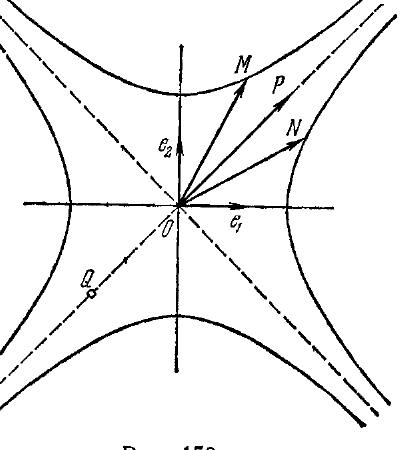

## 2. Евклидовы пространства и пространство Минковского

---
**стр. 475**
---

величин $x_i$, т. е. имеют вид (2). Неравенство нулю определителя матрицы $Q$ следует из однозначной обратимости формул (2), которая обеспечена условием теоремы.

**§ 188.** *Взаимно однозначное и коллинеарное отображение аффинного пространства на себя называется аффинным преобразованием этого пространства.* Согласно доказанной теореме каждое аффинное преобразование представляется в аффинных координатах линейными формулами вида (2) с не равным нулю определителем матрицы $Q$. Для каждого аффинного преобразования существует обратное преобразование, которое также является аффинным; это следует из доказанной теоремы (так как коллинеарное преобразование представляется линейными формулами, то обратное ему преобразование также представляется линейными формулами и, следовательно, коллинеарно). Очевидно, далее, что произведение двух аффинных преобразований есть аффинное преобразование. Таким образом, все аффинные преобразования данного аффинного пространства составляют группу; ее называют *аффинной группой* этого пространства. Теория инвариантов аффинной группы $n$-мерного аффинного пространства называется *$n$-мерной аффинной геометрией*. Введенные выше понятия прямой, плоскости, гиперплоскости, параллельности и т. д. инвариантны относительно аффинной группы; соответственно этому они являются объектами аффинной геометрии.

**2. Евклидовы пространства и пространство Минковского**

**§ 189.** Пусть дано $n$-мерное (вещественное) аффинное пространство $\mathfrak{A}$. Предположим, что с каждой парой векторов $x, y$ этого пространства сопоставлено некоторое вещественное число, обозначаемое далее символом $xy$, причем соблюдены требования следующих трех аксиом:

1. $xy = yx$.

2. $x(\lambda y + \mu z) = \lambda(xy) + \mu(xz)$, где $\lambda, \mu$ — любые вещественные числа.

Из этих аксиом, в частности, следует, что для нулевого вектора $\theta$ и любого вектора $x$ будет $\theta x = 0$ (так как $\theta = 0 \cdot x$, то $\theta x = x\theta = x(0 \cdot x) = 0(xx) = 0$).

3. Если $xy = 0$ для какого-нибудь $x$ и для любого $y$, то $x = \theta$.

Число $xy$ называется *скалярным произведением* векторов $x$ и $y$. *Аффинное $n$-мерное пространство с заданным скалярным произведением его векторов называется евклидовым $n$-мерным пространством* (нашим определением введено вещественное евклидово пространство, поскольку мы полагали, что $\mathfrak{A}$ — вещественное аффинное пространство и $(x, y)$ — вещественные числа),

---
**стр. 476**
---

**§ 190.** Рассматривая какое-нибудь евклидово $n$-мерное пространство, возьмем в нем произвольную аффинную систему координат; пусть $O$ — начало этой системы, $e_1, \dots, e_n$ — базис. Обозначим через $g_{ik}$ скалярное произведение произвольной пары базисных векторов $e_i, e_k$:

$$e_i e_k = g_{ik}, \tag{1}$$

согласно аксиоме 1 должно быть $g_{ik} = g_{ki}$. Пусть теперь $x$ и $y$ — любые векторы,

$$x = \sum_{i=1}^{n} x_i e_i, \quad y = \sum_{k=1}^{n} y_k e_k \tag{2}$$

— их разложения по данному базису. Перемножим скалярно левые и правые части равенств (2); перемножая правые части почленно (на основании аксиомы 2) и пользуясь таблицей умножения (1) базисных векторов, мы получим:

$$xy = \sum_{i,k=1}^{n} g_{ik} x_i y_k \tag{3}$$

правая часть этого равенства представляет собой билинейную форму от координат векторов $x, y$ с коэффициентами $g_{ik}$.

Обозначим через $g$ определитель матрицы $(g_{ik})$; из аксиомы 3 следует, что $g \neq 0$ (т. е. матрица $(g_{ik})$ является невырожденной).

В самом деле, если $g = 0$, то можно подобрать вектор $x \neq 0$ так, что для его координат $x_i$ все суммы $\sum_{i=1}^{n} g_{ik} x_i$ ($k = 1, 2, \dots, n$) будут равны нулю; но тогда $xy = 0$ при любом $y$, что исключено аксиомой 3.

*Итак, в $n$-мерном евклидовом пространстве скалярное произведение $xy$ выражается билинейной формой от координат векторов $x, y$, коэффициенты которой составляют симметричную и невырожденную матрицу.*

Пусть теперь дано аффинное $n$-мерное пространство и мы хотим ввести в нем скалярное произведение, т. е. сделать это пространство евклидовым. С этой целью выберем в данном пространстве аффинную систему координат, назначим числа $g_{ik}$, соблюдая условие $g_{ik} = g_{ki}$, и с произвольной парой векторов $x, y$ сопоставим число $xy$ по формуле (3). Аксиомы 1 и 2 при этом будут соблюдаться, так как выбранная матрица $g_{ik}$ симметрична и правая часть равенства (3) линейна относительно аргументов $x_i$ и относительно аргументов $y_i$. Для соблюдения аксиомы 3 необходимо числа $g_{ik}$ брать так, чтобы определитель $g$ матрицы $(g_{ik})$ был не равен нулю. Легко убедиться, что это условие является также и достаточным. В самом деле, допустим что $g \neq 0$; если $xy = 0$

---
**стр. 477**
---

при любом $y$, то из (3) следует равенство $\sum_{i=1}^{n} g_{ik} x_i = 0$ ($k = 1, 2, \dots, n$), а так как $g \neq 0$, то из этих равенств получаем $x_i = 0$ или $x = \theta$.

Итак, если в $n$-мерном аффинном пространстве определить число $xy$ по формуле (3), взяв в правой части любую билинейную форму с симметричной и невырожденной матрицей, то $xy$ будет удовлетворять всем трем аксиомам скалярного произведения.

З а м е ч а н и е. Как было сейчас показано, аксиома 3 равносильна невырожденности матрицы $(g_{ik})$. Поэтому аксиому 3 называют *условием невырожденности*.

**§ 191.** В евклидовом пространстве рассматриваются следующие важные понятия:

1. *Ортогональность векторов, прямых и т. д.* Векторы $x$ и $y$ называются *ортогональными* или *перпендикулярными* друг к другу, если $xy = 0$. Две прямые называются ортогональными, если ортогональны их направляющие векторы; прямая и плоскость ортогональны, если направляющий вектор прямой ортогонален каждому направляющему вектору плоскости; аналогично определяется ортогональность прямой и гиперплоскости.

2. *Норма вектора.* Норма вектора $x$ обозначается символом $\|x\|$ и определяется равенством

$$\|x\| = \sqrt{x^2}, \tag{1}$$

где $x^2 = xx$. Для определенности мы будем предполагать перед корнем знак плюс. Однако следует иметь в виду, что данное выше общее определение скалярного произведения не исключает случая $x^2 < 0$; в этом случае вектор имеет мнимую норму. Не исключается также возможность $\|x\| = 0$ при $x \neq \theta$.

Вектор $x$ называется *единичным*, если $x^2 = 1$, *мнимо-единичным*, если $x^2 = -1$, *изотропным*, если $x^2 = 0$ при $x \neq \theta$.

Из формул (3) § 190 и (1) § 191 следует выражение нормы вектора в координатах:

$$\|x\|^2 = \sum_{i,k=1}^{n} g_{ik} x_i x_k. \tag{2}$$

Здесь справа стоит квадратичная форма, аргументами которой являются координаты вектора $x$; ее называют *метрической формой евклидова пространства*. Поскольку $\operatorname{Det} g_{ik} \neq 0$, метрическая форма является невырожденной.

3. *Расстояние между двумя точками.* Расстояние между точками $A$ и $B$ полагается равным норме вектора $AB$:

$$\rho(A, B) = \|AB\|.$$

Будем обозначать координаты точек большими буквами (чтобы не путать их с координатами векторов). Пусть точки $A$ и $B$ имеют

---
**стр. 478**
---

координаты $(X_1, X_2, \dots, X_n)$ и $(X_1^*, X_2^*, \dots, X_n^*)$. Тогда координатами вектора $AB$ будут $x_1 = X_1^* - X_1$, $x_2 = X_2^* - X_2$ и т. д.; отсюда и из формулы (2) получаем:

$$\rho^2 (A, B) = \sum_{i,k=1}^{n} g_{ik} (X_i^* - X_i)(X_k^* - X_k). \tag{3}$$

Общее определение евклидова пространства не исключает, что расстояние между некоторыми точками может быть мнимым или равным нулю. Пусть $A$ — фиксированная точка с координатами $X_i^0$, $M$ — переменная точка, координаты которой мы обозначим через $X_i$. Будем искать все точки $M$, которые находятся на нулевом расстоянии от $A$; для координат этих точек получается уравнение

$$\sum_{i,k=1}^{n} g_{ik} (X_i - X_i^0)(X_k - X_k^0) = 0. \tag{4}$$

Если метрическая форма является знакоопределенной, то уравнение (4) удовлетворяется только при $X_i = X_i^0$; в этом случае $\rho (A, M) = 0$ только тогда, когда $M$ совпадает с $A$. Если же метрическая форма знакопеременна, то уравнение (4) определяет действительный невырожденный конус второго порядка с вершиной $A$, называемый *изотропным конусом* в точке $A$ (изотропный конус не вырожден, поскольку не вырождена метрическая форма; см. § 186). Прямые, образующие изотропный конус, называются *изотропными прямыми*. Каждая изотропная прямая характеризуется тем, что для любой пары ее точек расстояние равно нулю.

**§ 192.** В аффинном пространстве каждая прямая, плоскость или гиперплоскость в свою очередь является аффинным пространством соответствующей размерности (см. § 181). Если аффинное пространство превращено в евклидово, т. е. для любой пары его векторов определено скалярное произведение, то тем самым определено скалярное произведение для любой пары векторов данной прямой, данной плоскости или данной гиперплоскости. Поэтому данная прямая, данная плоскость или данная гиперплоскость становится евклидовым пространством соответствующей размерности, если внутри этой прямой, плоскости или гиперплоскости соблюдается условие невырожденности, чего может и не быть. Именно, по условию невырожденности, если $xy = 0$ для определенного $x$ и для любого $y$, то $x = \theta$; но может случиться, что на некоторой прямой, плоскости или гиперплоскости есть вектор $x \neq \theta$ такой, что $xy = 0$ для любого $y$, *лежащего на этой прямой, плоскости или гиперплоскости*. Например, скалярное произведение любых двух векторов, лежащих на изотропной прямой, равно нулю. Аналогично прямым те плоскости и гиперплоскости

---
**стр. 479**
---

евклидова пространства, внутри которых не соблюдается условие невырожденности, называются *изотропными*.

**§ 193.** Пусть $e_1, \dots, e_n$ — базис аффинной системы координат, в которой метрическая форма пространства имеет вид (2) § 191. Перейдем к новому базису $e'_1, \dots, e'_n$, полагая

$$e'_i = \sum_{k=1}^{n} p_{ik} e_k, \quad i = 1, 2, \dots, n, \quad \operatorname{Det} p_{ik} \neq 0; \tag{1}$$

тогда старые координаты $x_k$ произвольного вектора $x$ выражаются через его новые координаты $x'_i$ формулами

$$x_k = \sum_{i=1}^{n} p_{ik} x'_i, \quad k = 1, 2, \dots, n. \tag{2}$$

(См. § 180; положения нового и старого начал координат нас не интересуют, поскольку мы сейчас имеем дело с координатами векторов, а не точек; формулы преобразования координат векторов однородны, т. е. свободные члены в правых частях этих формул равны нулю.) Подставим в метрическую форму (2) § 191 вместо $x_1, x_2, \dots, x_n$ их выражения через $x'_1, x'_2, \dots, x'_n$; тем самым мы приведем метрическую форму к новым координатам. Согласно теории квадратичных форм коэффициенты $p_{ik}$ линейного преобразования (2) можно подобрать так (соблюдая условие $\operatorname{Det} p_{ik} \neq 0$), что в новых координатах метрическая форма примет канонический вид, т. е. будет содержать только члены с квадратами координат, число этих членов будет равно $n$ (вследствие невырожденности формы), а коэффициентами при них будут служить числа $+1$ или $-1$. Иначе говоря, если мы обозначим коэффициенты преобразованной формы через $\sigma_{ik}$, то получим:

$$\sigma_{ii} = \pm 1, \quad i = 1, 2, \dots, n,$$
$$\sigma_{ik} = 0, \quad i \neq k, \quad i, k = 1, 2, \dots, n.$$

В найденных специальных координатах имеем:

$$\|x\|^2 = {x'_1}^2 + \dots + {x'_m}^2 - {x'_{m+1}}^2 - \dots - {x'_n}^2;$$

здесь первые $m$ коэффициентов $\sigma_{ii}$ положительны, чего всегда можно достигнуть надлежащей нумерацией координат. Случаи, когда в этом выражении все коэффициенты положительны ($m = n$) или все отрицательны ($m = 0$), не исключаются. Учтем, что $e'_i e'_k = \sigma_{ik}$; отсюда следует, что

$${e'_1}^2 = \dots = {e'_m}^2 = +1, \quad {e'_{m+1}}^2 = \dots = {e'_n}^2 = -1,$$
$$e'_i e'_k = 0, \quad i \neq k,$$

---
**стр. 480**
---

т. е. базисные векторы единичны или мнимо-единичны и попарно ортогональны. Такой базис называется *ортонормированным*. Нами доказано, что в каждом евклидовом пространстве существует ортонормированный базис.

Приведение квадратичной формы к каноническому виду, как показано в § 180, может быть осуществлено бесконечным числом способов; поэтому и ортонормированных базисов существует бесконечно много. При этом по закону инерции число отрицательных членов в каноническом представлении метрической формы не зависит от способа приведения. Это число, равное числу мнимо-единичных векторов в любом ортонормированном базисе, выражает геометрические свойства данного евклидова пространства и называется его **индексом**.

Если индекс равен нулю, то формулы для нормы вектора, скалярного произведения и т. п. совпадают по своему виду с привычными формулами аналитической геометрии; евклидово пространство с нулевым индексом называется *собственно евклидовым*. Остальные евклидовы пространства называются *псевдоевклидовыми*. Евклидово пространство с индексом, равным единице, называется *пространством Минковского*.

**§ 194.** Пусть в пространстве Минковского введена система координат с каким-нибудь началом $O$ и с ортонормированным базисом $e_1, \dots, e_n$. Базисные векторы мы предположим занумерованными так, что $e_1^2 = \dots = e_{n-1}^2 = +1$, $e_n^2 = -1$. Тогда норма вектора $x$ с координатами $x_i$ выразится формулой

$$\| x \|^2 = x_1^2 + \dots + x_{n-1}^2 - x_n^2; \tag{1}$$

для скалярного произведения двух векторов $x, y$ с координатами $x_i, y_i$ получим выражение

$$xy = x_1 y_1 + \dots + x_{n-1} y_{n-1} - x_n y_n; \tag{2}$$

для квадрата расстояния между двумя точками $A (X_i)$, $B (X_i^*)$ будем иметь

$$\rho^2 (A, B) = (X_1^* - X_1)^2 + \dots + (X_{n-1}^* - X_{n-1})^2 - (X_n^* - X_n)^2. \quad (3)$$

Изотропный конус с вершиной $A (X_1^0, \dots, X_n^0)$ в данных

---
**стр. 481**
---

координатах определяется уравнением

$$(X_1 - X_1^0)^2 + \dots + (X_{n-1} - X_{n-1}^0)^2 - (X_n - X_n^0)^2 = 0 \quad (4)$$

и является действительным и невырожденным. Точки, в которых левая часть уравнения (4) отрицательна, составляют внутреннюю область изотропного конуса; внутренняя область распадается на две полости, в одной из которых $X_n > X_n^0$, в другой $X_n < X_n^0$.

**§ 195.** Для наглядности рассмотрим некоторые объекты пространства Минковского в случаях $n = 2$ и $n = 3$.

1. Построим модель двумерной геометрии Минковского на евклидовой плоскости. Условимся, прежде всего, точки, векторы и линейные операции над векторами понимать обычным образом. Выберем систему аффинных координат с началом $O$ и базисом $e_1, e_2$; координаты $X_1, X_2$ произвольной точки $M$ будут также иметь обычный смысл (например, $X_1$ изображается отрезком, который отсекает прямая, проходящая через $M$ параллельно второй оси; конечно, этот отрезок должен измеряться масштабом $e_1$). Более того, ничто не мешает нам взять векторы $e_1, e_2$ одинаковой длины и перпендикулярными друг другу с евклидовой точки зрения. Тогда выбранная система координат будет просто декартовой прямоугольной. Однако скалярное произведение двух векторов $x, y$ с координатами $x_i, y_i$ ($i = 1, 2$) мы введем в смысле геометрии Минковского, полагая

$$xy = x_1 y_1 - x_2 y_2;$$

соответственно норма вектора $x$ определится равенством

$$\| x \|^2 = x_1^2 - x_2^2.$$

Изотропный конус, вершину которого для простоты мы возьмем в начале координат, дается уравнением

$$X_1^2 - X_2^2 = 0;$$

он состоит из двух евклидовых координатных биссектрис (рис. 158). Вектор $OP$ на любой из этих биссектрис имеет норму, равную нулю; любые точки $P, Q$ координатной биссектрисы находятся на нулевом расстоянии друг от друга. Внутренняя область изотропного конуса определяется неравенством $X_1^2 - X_2^2 < 0$; ее составляют точки, лежащие внутри двух вертикальных углов, один из которых ограничен верхними лучами биссектрис, другой —

---
**стр. 482**
---

нижними. Всякая точка $M$, расположенная во внутренней области изотропного конуса, находится на мнимом расстоянии от начала координат. Пусть $\rho (O, M) = ai$; тогда все точки, которые имеют то же расстояние от точки $O$, удовлетворяют уравнению

$$X_1^2 - X_2^2 = -a^2.$$

В смысле геометрии Минковского эти точки составляют окружность мнимого радиуса $ai$; в евклидовом смысле они лежат на обыкновенной гиперболе (поскольку последнее уравнение определяет гиперболу с вершинами на второй координатной оси). Всякая точка $N$, расположенная во внешней области изотропного конуса, находится на действительном расстоянии от точки $O$. Пусть $\rho (O, N) = a$; тогда все точки, находящиеся на том же расстоянии от $O$, удовлетворяют уравнению

$$X_1^2 - X_2^2 = a^2.$$

В евклидовом смысле это уравнение определяет гиперболу с вершинами на первой координатной оси; в смысле геометрии Минковского эта же гипербола является окружностью действительного радиуса $a$. Векторы $OM$ и $ON$ с координатами $(x_1, x_2)$, $(y_1, y_2)$ перпендикулярны друг другу в смысле Минковского, если $x_1 y_1 - x_2 y_2 = 0$; в евклидовом смысле это равенство выражает симметрию направлений $OM$ и $ON$ относительно координатных биссектрис. В частности, два вектора, лежащие на одной координатной биссектрисе, перпендикулярны друг другу в смысле геометрии Минковского.

2. Построение модели трехмерной геометрии Минковского можно выполнить аналогично предыдущему в трехмерном евклидовом пространстве. Положим в основу обычную прямоугольную систему координат с базисом $e_1, e_2, e_3$; для двух произвольных векторов $x, y$ с координатами $x_i, y_i$ ($i = 1, 2, 3$) определим скалярное произведение в смысле Минковского формулой

$$xy = x_1 y_1 + x_2 y_2 - x_3 y_3.$$

Тогда норма вектора $x$ будет определяться формулой

$$\| x \|^2 = x_1^2 + x_2^2 - x_3^2,$$

изотропный конус — уравнением

$$X_1^2 + X_2^2 - X_3^2 = 0,$$

его внутренняя область — неравенством

$$X_1^2 + X_2^2 - X_3^2 < 0.$$

---
**стр. 483**
---

С евклидовой точки зрения изотропный конус является обычным конусом вращения вокруг третьей координатной оси; его внутренняя область состоит из двух полостей этого конуса. Всякая точка, лежащая внутри изотропного конуса, находится на мнимом расстоянии от начала координат. Если это расстояние равно $ai$, то все точки, которые находятся на том же расстоянии от точки $O$, образуют сферу мнимого радиуса $ai$, в евклидовом смысле она является двухполостным гиперболоидом, имеющим уравнение

$$X_1^2 + X_2^2 - X_3^2 = - a^2.$$

Евклидов однополостный гиперболоид, который определяется уравнением

$$X_1^2 + X_2^2 - X_3^2 = a^2,$$

изображает в геометрии Минковского сферу действительного радиуса $a$.

Если в формулах, выражающих $xy$ и $\| x \|^2$, третьи координаты положить равными нулю, то получатся двумерные формулы обычной векторной алгебры. Это означает, что в координатной плоскости, которая проходит через векторы $e_1$, $e_2$, имеет место собственно евклидова геометрия. Вообще, всякая плоскость, которая проходит через начало координат и не содержит ни одной образующей изотропного конуса, является двумерным собственно евклидовым пространством (поскольку на ней нет изотропных прямых). Всякая плоскость, которая проходит через начало координат и пересекает изотропный конус по двум образующим, является двумерным пространством Минковского. Изотропный конус метрики Минковского *на этой плоскости* и его внутренняя область определяются пересечением плоскости с пространственным изотропным конусом. Если плоскость, секущая пространственный изотропный конус, превращается в его касательную плоскость, то прямые, из которых составлен изотропный конус *плоскости*, сливаются и внутренняя область этого конуса исчезает. Изотропный конус такой плоскости оказывается вырожденным. Следовательно, каждая плоскость, касательная к изотропному конусу трехмерного пространства Минковского, является изотропной плоскостью этого пространства.

Свойства четырехмерного пространства Минковского следует представлять себе по естественной аналогии с рассмотренной трехмерной моделью.

**§ 196.** Каждое аффинное преобразование пространства Минковского, при котором расстояние между любыми двумя точками равно расстоянию между их образами, мы будем называть *движением* в этом пространстве. Пусть в пространстве Минковского, которое мы предположим четырехмерным, введена аффинная

---
**стр. 484**
---

система координат с началом $O$ и ортонормированным базисом $e_1, e_2, e_3, e_4$ ($e_4^2 = -1$). Тогда каждое аффинное преобразование, переводящее точку $M(X_i)$ в точку $M'(X'_i)$, представляется формулами вида (2) § 187; мы запишем их сокращенно:

$$X'_i = \sum_{k=1}^4 q_{ik}X_k + b_i, \quad i = 1, 2, 3, 4. \tag{1}$$

Легко понять, что преобразование (1), вообще говоря, не будет сохранять расстояния между точками; для этого его коэффициенты должны удовлетворять некоторым условиям. Постараемся найти эти условия. Прежде всего рассмотрим частный случай преобразования (1):

$$X'_i = X_i + b_i. \tag{2}$$

Пусть точки $M(X_i)$ и $N(X_i^*)$ переводятся преобразованием (2) в точки $M'(X'_i)$ и $N'(X_i^{*'})$; если $x_i = X_i^* - X_i$ — координаты вектора $MN$, $x'_i = X_i^{*'} - X_i'$ — координаты вектора $M'N'$, то вследствие формул (2) имеем: $x'_i = x_i$; отсюда следует, что нормы векторов $MN$ и $M'N'$ одинаковы. Таким образом, преобразование (2) при любых $b_i$ сохраняет расстояние между точками; этот частный случай движения называется *параллельным сдвигом*. Очевидно, параллельный сдвиг можно подобрать так, что начало координат переместится в любую заранее назначенную точку. В другом частном случае преобразования (1), когда $b_i = 0$, начало координат остается на месте. Любое преобразование вида (1) можно получить путем последовательного проведения двух рассмотренных преобразований: сначала параллельным сдвигом переместить начало координат вместе с базисом в новое положение, затем произвести преобразование, которое в этих новых координатах задается формулами вида (1) с той же матрицей ($q_{ik}$), но со свободными членами, равными нулю. Так как параллельный сдвиг явно не представляет интереса, то в дальнейшем мы будем считать формулы (1) однородными:

$$X'_i = \sum_{k=1}^4 q_{ik}X_k. \tag{3}$$

Пусть $M(X_i)$ и $N(X_i^*)$ — две произвольные точки, $M'(X'_i)$ и $N'(X_i^{*'})$ — их образы, $x_i = X_i^* - X_i$ и $x'_i = X_i^{*'} - X_i'$ — координаты векторов $MN$ и $M'N'$. Из формул (3) имеем:

$$x'_i = \sum_{k=1}^n q_{ik}x_k. \tag{4}$$ <!-- вероятная опечатка оригинала: в (4) верхний предел суммы n вместо 4 -->

Равенство расстояний $\rho(M', N')$ и $\rho(M, N)$ равносильно равенству

---
**стр. 485**
---

норм векторов $M'N'$ и $MN$, следовательно, формулы (3) будут определять движение, если коэффициенты $q_{ik}$ подобраны так, что

$$x_1'^2 + x_2'^2 + x_3'^2 - x_4'^2 = x_1^2 + x_2^2 + x_3^2 - x_4^2. \tag{5}$$

При этом соотношение (5) должно соблюдаться, как следствие равенств (4), при любых $x_1, x_2, x_3, x_4$. Обозначим через $\sigma_{ik}$ коэффициенты метрической формы в ортонормированных координатах ($\sigma_{11} = \sigma_{22} = \sigma_{33} = +1$, $\sigma_{44} = -1$, $\sigma_{ik} = 0$, если $i \neq k$), запишем левую часть (5) в виде двойной суммы с коэффициентами $\sigma_{ik}$ и применим формулы (4):

$$x_1'^2 + x_2'^2 + x_3'^2 - x_4'^2 = \sum_{i,k=1}^4 \sigma_{ik} x'_i x'_k = \sum_{i,k=1}^4 \sigma_{ik} \left( \sum_{\alpha=1}^4 q_{i\alpha} x_{\alpha} \right) \left( \sum_{\beta=1}^4 q_{k\beta} x_{\beta} \right) =$$

$$= \sum_{\alpha,\beta=1}^4 \left( \sum_{i,k=1}^4 \sigma_{ik} q_{i\alpha} q_{k\beta} \right) x_{\alpha} x_{\beta};$$

правую часть (5) также напишем в виде двойной суммы:

$$x_1^2 + x_2^2 + x_3^2 - x_4^2 = \sum_{\alpha,\beta=1}^4 \sigma_{\alpha\beta} x_{\alpha} x_{\beta}.$$

Вследствие (5) полученные выражения должны быть одинаковыми; отсюда

$$\sum_{i,k=1}^4 \sigma_{ik} q_{i\alpha} q_{k\beta} = \sigma_{\alpha\beta} \quad (\alpha, \beta = 1, 2, 3, 4). \tag{6}$$

Это и есть искомые условия на коэффициенты $q_{ik}$, при соблюдении которых преобразование (3) или (1) является движением. Условиям (6) можно придать матричную запись. Обозначим, как и раньше, через $Q$ матрицу с элементами $q_{ik}$, через $Q^*$ — матрицу с элементами $q^*_{\alpha i} = q_{i\alpha}$ ($Q^*$ получается из $Q$ транспонированием), через $I$ — матрицу с элементами $\sigma_{ik}$. Тогда соотношения (6) можно записать в виде

$$\sum_{i,k=1}^4 q^*_{\alpha i} \sigma_{ik} q_{k\beta} = \sigma_{\alpha\beta} \quad (\alpha, \beta = 1, 2, 3, 4). \tag{7}$$

Но в таком виде они, очевидно, эквивалентны одному матричному равенству:

$$Q^* I Q = I \tag{8}$$

или в подробной записи:

$$\begin{pmatrix} q_{11} & q_{21} & q_{31} & q_{41} \\ q_{12} & q_{22} & q_{32} & q_{42} \\ q_{13} & q_{23} & q_{33} & q_{43} \\ q_{14} & q_{24} & q_{34} & q_{44} \end{pmatrix} \begin{pmatrix} 1 & 0 & 0 & 0 \\ 0 & 1 & 0 & 0 \\ 0 & 0 & 1 & 0 \\ 0 & 0 & 0 & -1 \end{pmatrix} \begin{pmatrix} q_{11} & q_{12} & q_{13} & q_{14} \\ q_{21} & q_{22} & q_{23} & q_{24} \\ q_{31} & q_{32} & q_{33} & q_{34} \\ q_{41} & q_{42} & q_{43} & q_{44} \end{pmatrix} = \begin{pmatrix} 1 & 0 & 0 & 0 \\ 0 & 1 & 0 & 0 \\ 0 & 0 & 1 & 0 \\ 0 & 0 & 0 & -1 \end{pmatrix}.$$

Таким образом, аффинное преобразование (1) является движением

---
**стр. 486**
---

тогда и только тогда, когда его матрица $Q$ удовлетворяет условию (8).

Заметим, что неравенство нулю определителя матрицы $Q$ отсюда уже вытекает само собой; более того, из соотношения (8) имеем: $(\operatorname{Det} Q)^2 = 1$, следовательно,

$$\operatorname{Det} Q = \pm 1. \tag{9}$$

**§ 197.** С помощью формул (6) легко показать, что при любом движении в пространстве Минковского сохраняются скалярное произведение и ортогональность векторов. В самом деле, пусть векторы $x = \sum x_i e_i$, $y = \sum y_i e_i$ в результате движения переходят в векторы $x' = \sum x'_i e_i$, $y' = \sum y'_i e_i$ (разложенные по тому же базису). Тогда

$$x'y' = x'_1 y'_1 + x'_2 y'_2 + x'_3 y'_3 - x'_4 y'_4 = \sum_{i,k=1}^4 \sigma_{ik} x'_i y'_k =$$

$$= \sum_{i,k=1}^4 \sigma_{ik} \left( \sum_{\alpha=1}^4 q_{i\alpha} x_{\alpha} \right) \left( \sum_{\beta=1}^4 q_{k\beta} y_{\beta} \right) = \sum_{\alpha,\beta=1}^4 \left( \sum_{i,k=1}^4 \sigma_{ik} q_{i\alpha} q_{k\beta} \right) x_{\alpha} y_{\beta} =$$

$$= \sum_{\alpha,\beta=1}^4 \sigma_{\alpha\beta} x_{\alpha} y_{\beta} = x_1 y_1 + x_2 y_2 + x_3 y_3 - x_4 y_4 = xy.$$

Итак, $x'y' = xy$. В частности, если $xy = 0$, то $x'y' = 0$, т. е. образы ортогональных векторов ортогональны. Отсюда получается важный вывод: *в пространстве Минковского всякое движение переводит ортонормированный базис в ортонормированный базис.*

**§ 198.** Если при некотором движении данная точка пространства остается на месте, то изотропный конус пространства, имеющий вершину в данной точке, также остается на месте (его точки перемещаются в новые положения, но остаются на нем). В самом деле, предположим, например, что остается неподвижным начало координат $O$. Если $M$ — произвольная точка изотропного конуса с вершиной $O$, то $\rho(O, M) = 0$, а так как при движении расстояния сохраняются, для образа $M'$ точки $M$ имеем $\rho(O, M') = 0$; следовательно, $M'$ лежит на том же изотропном конусе. Аналогичными рассуждениями можно показать, что при таком движении точки, лежащие внутри изотропного конуса, остаются в его внутренней области; не исключено, однако, что две полости изотропного конуса меняются местами.

**§ 199.** Множество всех движений в пространстве Минковского составляет группу, так как произведение двух движений есть движение и преобразование, обратное движению, также является движением.

Эти групповые свойства с очевидностью вытекают из определения движений. Группа движений в пространстве Минковского

---
**стр. 487**
---

представляет собой одну из подгрупп аффинной группы. Из группы всех движений в пространстве Минковского в свою очередь можно выделить подгруппу движений, оставляющих на месте некоторую точку. Еще более узкую группу составляют те движения, при которых остается на месте каждая полость изотропного конуса.

**§ 200. Преобразование**

$$X'_i = \sum_{k=1}^4 q_{ik}X_k + b_i, \quad \operatorname{Det} q_{ik} \neq 0, \quad i = 1, 2, 3, 4,$$

представляющее некоторое движение в пространстве Минковского, называется *общим преобразованием Лоренца*. Общее преобразование Лоренца характеризуется условием (8) § 196 на матрицу $Q = (q_{ik})$. Числа $b_i$, которые могут быть любыми, не играют существенной роли при изучении общих преобразований Лоренца; поэтому, отвлекаясь от чисел $b_i$, часто общим преобразованием Лоренца называют однородное преобразование

$$X'_i = \sum_{k=1}^4 q_{ik} X_k, \quad i = 1, 2, 3, 4, \tag{1}$$

при том же условии на матрицу $Q$. Множество всех общих преобразований Лоренца составляет группу, которая называется *общей группой Лоренца*.

Если преобразование (1) представляет движение в пространстве Минковского, при котором каждая полость изотропного конуса остается на месте, то такое преобразование называется просто *преобразованием Лоренца*. Эти преобразования, помимо условия (8) § 196 на матрицу $Q$, характеризуются тем, что точку $(0, 0, 0, x_4)$, $x_4 > 0$, переводят в точку $(x'_1, x'_2, x'_3, x'_4)$, $x'_4 > 0$. Преобразования Лоренца составляют группу, называемую *группой Лоренца*.

**§ 201. Преобразованиям Лоренца (или общим преобразованиям Лоренца) можно дать еще иное геометрическое истолкование.**

Пусть дана система координат с началом $O$ и ортонормированным базисом $e_1, e_2, e_3, e_4$ (${e_4}^2 = -1$); пусть, далее, вводится новая система координат с началом $O'$ и ортонормированным базисом $e'_1, e'_2, e'_3, e'_4$ (${e'_4}^2 = -1$). Тогда, если

$$e'_i = \sum_{k=1}^4 p_{ik} e_k \tag{1}$$

— разложения векторов нового базиса по старому базису, а

$$X'_i = \sum_{k=1}^4 q_{ik} X_k + b_i \tag{2}$$

— выражения новых координат через старые координаты, то матрица $Q = (q_{ik})$ получается из матрицы $P = (p_{ik})$ с помощью

---
**стр. 488**
---

транспонирования и обращения: $Q = (P^*)^{-1}$ (см. § 180). Так как старый и новый базисы являются ортонормированными, то в обозначениях § 196 имеем:

$$e_i e_k = \sigma_{ik}, \quad e'_i e'_k = \sigma_{ik}.$$

Отсюда

$$\sigma_{ik} = e'_i e'_k = \sum_{\alpha=1}^{4} p_{i\alpha} e_\alpha \sum_{\beta=1}^{4} p_{k\beta} e_\beta = \sum_{\alpha, \beta=1}^{4} (e_\alpha e_\beta) p_{i\alpha} p_{k\beta} = \sum_{\alpha, \beta=1}^{4} \sigma_{\alpha\beta} p_{i\alpha} p_{k\beta}. \tag{3}$$

Если ввести элементы матрицы $P^*$, т. е. $p^*_{\beta k} = p_{k\beta}$, то предыдущие равенства примут вид

$$\sum_{\alpha, \beta=1}^{4} p_{i\alpha} \sigma_{\alpha\beta} p^*_{\beta k} = \sigma_{ik} \quad (i, k = 1, 2, 3, 4). \tag{4}$$

Все эти соотношения равносильны одному матричному равенству

$$PIP^* = I. \tag{5}$$

Но так как матрицы $P^*$ и $Q$ взаимно обратны, то

$$P^*Q = E, \quad Q^*P = E,$$

где $E$ — единичная матрица. Поэтому, умножая обе части равенства (5) слева на матрицу $Q^*$, справа — на матрицу $Q$, получим:

$$Q^*PIP^*Q = EIE = I = Q^*IQ,$$

или

$$Q^*IQ = I. \tag{6}$$

Последнее равенство в точности совпадает с равенством (8) § 196. Следовательно, всякое преобразование координат, соответствующее переходу от одной ортонормированной системы к новой ортонормированной системе, есть общее преобразование Лоренца (вообще говоря, неоднородное). Обратно, если базис $e_1, e_2, e_3, e_4$ является ортонормированным и соблюдено условие (6), то, поскольку из (6) следует (5), затем (4), затем (3), мы получим $e'_i e'_k = \sigma_{ik}$, т. е. новый базис будет также ортонормированным. Следовательно, всякое общее преобразование Лоренца можно рассматривать как преобразование ортонормированных координат. При таком истолковании общих лоренцовых преобразований среди них просто лоренцовы преобразования характеризуются тем, что базисные векторы $e_4$ и $e'_4$ находятся в одной полости изотропного конуса.

**§ 202.** В заключение этого раздела мы укажем на замечательную связь, которая имеет место между группой Лоренца и группой движений в геометрии Лобачевского. Для простоты изложения будем рассматривать трехмерное пространство Минковского с

---
**стр. 489**
---

изотропным конусом

$$X_1^2 + X_2^2 - X_3^2 = 0. \tag{1}$$

Пересечем этот конус плоскостью $X_3 = 1$. В сечении образуется окружность

$$X_1^2 + X_2^2 = 1, \quad X_3 = 1, \tag{2}$$

которую мы будем обозначать буквой $k$. Пусть задано однородное преобразование Лоренца

$$\left. \begin{aligned} X'_1 &= q_{11}X_1 + q_{12}X_2 + q_{13}X_3, \\ X'_2 &= q_{21}X_1 + q_{22}X_2 + q_{23}X_3, \\ X'_3 &= q_{31}X_1 + q_{32}X_2 + q_{33}X_3; \end{aligned} \right\} \tag{3}$$

ему соответствует движение в пространстве Минковского, переводящее произвольную точку $M(X_1, X_2, X_3)$ в точку $M'(X'_1, X'_2, X'_3)$ и оставляющее на месте начало координат.

С данным преобразованием Лоренца мы сопоставим некоторое преобразование плоскости $X_3 = 1$. Именно, если $P$ — точка пересечения прямой $OM$ с плоскостью $X_3 = 1$, $P'$ — точка пересечения с той же плоскостью прямой $OM'$, то мы будем считать $P'$ образом точки $P$. Это преобразование нетрудно выразить в координатах.

Пусть $(x, y, 1)$ — координаты точки $P$; так как $O, P, M$ лежат на одной прямой, то

$$\frac{x}{X_1} = \frac{y}{X_2} = \frac{1}{X_3}.$$

Следовательно,

$$x = \frac{X_1}{X_3}, \quad y = \frac{X_2}{X_3}.$$

Аналогично, если $(x', y', 1)$ — координаты $P'$, то

$$x' = \frac{X'_1}{X'_3}, \quad y' = \frac{X'_2}{X'_3}.$$

Отсюда и из формул (3) получаем:

$$\left. \begin{aligned} x' &= \frac{q_{11}x + q_{12}y + q_{13}}{q_{31}x + q_{32}y + q_{33}}, \\ y' &= \frac{q_{21}x + q_{22}y + q_{23}}{q_{31}x + q_{32}y + q_{33}} \end{aligned} \right\} \tag{4}$$

Поскольку $\operatorname{Det} q_{ik} \neq 0$, то отображение плоскости $X_3 = 1$ на себя, которое выражено формулами (4), является проективным (см. § 112). Учтем, что данное в пространстве преобразование Лоренца оставляет на месте изотропный конус и его внутреннюю область; отсюда следует, что на плоскости $X_3 = 1$ преобразование (4) оставляет на месте окружность $k$ и ее внутреннюю область. Поэтому

---
**стр. 490**
---

преобразование (4) есть неевклидово движение в метрике Лобачевского, которая определена на плоскости $X_3 = 1$ внутри абсолюта $k$ (см. § 170). Мы показали, что каждое преобразование Лоренца индуцирует внутри $k$ на плоскости $X_3 = 1$ некоторое неевклидово движение. Покажем теперь, что по заранее данному внутри $k$ неевклидову движению можно найти, и притом однозначно, индуцирующее его преобразование Лоренца.

Пусть дано неевклидово движение формулами вида (4). Тогда искомое преобразование Лоренца должно иметь вид

$$\left. \begin{aligned} X'_1 &= \lambda (q_{11}X_1 + q_{12}X_2 + q_{13}X_3), \\ X'_2 &= \lambda (q_{21}X_1 + q_{22}X_2 + q_{23}X_3), \\ X'_3 &= \lambda (q_{31}X_1 + q_{32}X_2 + q_{33}X_3), \end{aligned} \right\} \tag{5}$$

где $\lambda$ — некоторое число $\neq 0$. При любом $\lambda \neq 0$ формулы (5) задают в пространстве аффинное преобразование. Докажем, что при надлежащем выборе $\lambda$ это аффинное преобразование будет преобразованием Лоренца.

В самом деле, преобразование (4) оставляет на месте окружность $k$ и ее внутреннюю область; отсюда следует, что аффинное преобразование (5) оставляет на месте изотропный конус и его внутреннюю область. Алгебраически это означает, что вследствие равенств (5) имеет место соотношение

$${X'_1}^2 + {X'_2}^2 - {X'_3}^2 = \sigma (X_1^2 + X_2^2 - X_3^2), \tag{6}$$

где $\sigma$ пропорционально $\lambda^2$ с положительным множителем пропорциональности. Выберем $\lambda$, соблюдая равенство $\sigma = 1$; тогда преобразование (5) будет выражать движение в пространстве Минковского. Заметим еще, что $q_{33} \neq 0$, так как в противном случае внутренняя точка $(0, 0, 1)$ изотропного конуса будет переводиться преобразованием (5) в наружную точку $(\lambda q_{13}, \lambda q_{23}, 0)$, что исключено. Поэтому мы можем выбрать знак $\lambda$ так, что $\lambda q_{33} > 0$. При этом условии преобразование (5) оставляет каждую полость изотропного конуса на месте и, следовательно, является преобразованием Лоренца. Ясно, что требуемый выбор $\lambda$ однозначен.

Итак, трехмерные однородные преобразования Лоренца взаимно однозначно сопоставлены с движениями в двухмерной геометрии Лобачевского. При этом легко проверить, что с произведением двух преобразований Лоренца сопоставлено произведение соответствующих неевклидовых движений. *Следовательно, трехмерная однородная группа Лоренца и группа движений в двухмерной геометрии Лобачевского изоморфны.*

Аналогично можно показать изоморфизм четырехмерной однородной группы Лоренца и группы движений в трехмерной геометрии Лобачевского.
