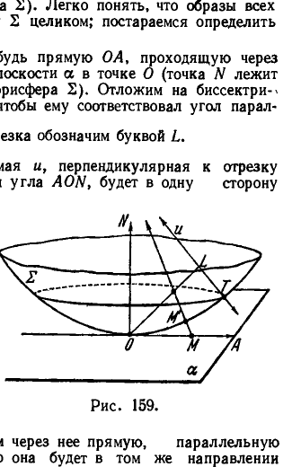
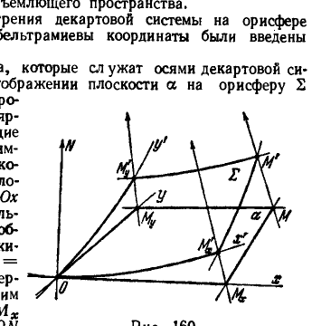
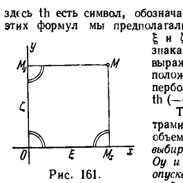

## 2. Вычисление расстояния между двумя точками на плоскости Лобачевского

---
**стр. 512**
---

Наконец, производя замену переменных в интеграле (III), найдем следующее выражение для площади $\sigma$ области $\Sigma$:

$$\sigma = \iint\limits_{\Sigma} dx\,dy = \iint\limits_{\Sigma} \left| \frac{\partial(x, y)}{\partial(u, v)} \right| du\,dv = \iint\limits_{\Sigma} \sqrt{ \begin{vmatrix} \frac{\partial x}{\partial u} & \frac{\partial x}{\partial v} \\ \frac{\partial y}{\partial u} & \frac{\partial y}{\partial v} \end{vmatrix}^2 } du\,dv =$$

$$= \iint\limits_{\Sigma} \sqrt{EG - F^2}\,du\,dv, \qquad \text{(III*)}$$

Таким образом, мы получили три формулы:

$$ds^2 = E\,du^2 + 2F\,du\,dv + G\,dv^2, \qquad \text{(I*)}$$

$$\cos \varphi = \frac{E\,du\,\delta u + F(du\,\delta v + dv\,\delta u) + G\,dv\,\delta v}{\sqrt{E\,du^2 + 2F\,du\,dv + G\,dv^2} \sqrt{E\,\delta u^2 + 2F\,\delta u\,\delta v + G\,\delta v^2}}, \qquad \text{(II*)}$$

$$\sigma = \iint\limits_{\Sigma} \sqrt{EG - F^2}\,du\,dv, \qquad \text{(III*)}$$

которые в произвольной координатной системе выражают длины, углы и площади на евклидовой плоскости. Они содержат формулы (I) — (III) и (I') — (III') как частные случаи.

Теперь легко заметить, что выражения для $\cos \varphi$ и $\sigma$ совершенно определенным образом конструируются из квадратичной формы $ds^2$.

Именно, числитель в правой части формулы (II*) есть билинейная форма, получаемая поляризацией формы (I*), а в интеграле формулы (III*) под знаком радикала стоит не что иное, как дискриминант формы (I*).

Следовательно, метрика евклидовой плоскости определяется в каждой системе координат квадратичной формой (I*), которая по этой причине называется *метрической*.

Исследования математиков и механиков XIX столетия показали, что геометрические системы, в которых измерение величин, подобно тому, как это имеет место на евклидовой плоскости, аналитически определяются к в а д р а т и ч н о й дифференциальной формой, оказываются весьма общим явлением в геометрии. Они собственно и составляют предмет дифференциальной геометрии. Например, вычисление длин, углов и площадей на каждой поверхности евклидова пространства, как известно из теории поверхностей (и что мы в свое время подробно напомним читателю), ведется по формулам точно такой же структуры, что и (I*) — (III*).

Наша ближайшая цель — доказать, что в указанный класс геометрических систем включается неевклидова геометрия Лобачевского, т. е. что и в этой геометрии метрика определяется некоторой квадратичной дифференциальной формой.

**2. Вычисление расстояния между двумя точками на плоскости Лобачевского**

**§ 216.** Имея в виду исследовать дифференциально-геометрический характер метрики плоскости Лобачевского, мы должны прежде всего вывести формулу, выражающую расстояние между двумя точками через их координаты (в какой-нибудь достаточно удобной координатной системе).

Формула (1) § 215 выражает евклидово расстояние между двумя точками через их декартовы координаты; в основе этой формулы лежит теорема Пифагора.

---
**стр. 513**
---

В неевклидовой геометрии Лобачевского теоремы Пифагора нет, а получение теоремы, сходной с нею, довольно хлопотливо; кроме того, координатные системы, которые на плоскости Лобачевского можно ввести по аналогии с декартовой, здесь оказываются во многих отношениях не очень удобными для использования.

Поэтому мы не пойдем по пути развертывания синтетической теории Лобачевского, а изберем другой путь, непосредственно приводящий к решению поставленной задачи. Заранее оговоримся, что плоскость Лобачевского будет при этом рассматриваться не изолированно, а как объект пространства Лобачевского.

Обозначим рассматриваемую плоскость (в пространстве Лобачевского) буквой $\alpha$ и отметим на этой плоскости какую-нибудь точку $O$. Существуют две орисферы, которые касаются плоскости $\alpha$ в точке $O$ (они расположены по разные стороны от $\alpha$); выберем из них какую-нибудь одну и обозначим ее буквой $\Sigma$. Все дальнейшее основано на том, что элементарная геометрия орисферы $\Sigma$ есть геометрия Евклида (см. § 47).

Мы установим сейчас некоторое специальное отображение плоскости $\alpha$ в орисферу $\Sigma$. Именно, произвольной точке $M$ плоскости $\alpha$ поставим на орисфере $\Sigma$ в соответствие точку $M'$, где орисфера пересекается с прямой, проходящей через $M$ параллельно перпендикуляру к $\alpha$ в точке $O$ (рис. 159; направление параллельности предполагается установленным в ту сторону от плоскости $\alpha$, с которой расположена орисфера $\Sigma$). Легко понять, что образы всех точек плоскости $\alpha$ не заполняют орисферу $\Sigma$ целиком; постараемся определить заполненную ими область.

Рассмотрим в плоскости $\alpha$ какую-нибудь прямую $OA$, проходящую через точку $O$; пусть $ON$ — перпендикуляр к плоскости $\alpha$ в точке $O$ (точка $N$ лежит с той стороны от $\alpha$, с какой находится орисфера $\Sigma$). Отложим на биссектрисе угла $AON$ отрезок $l$, выбрав его так, чтобы ему соответствовал угол параллельности

$$\Pi(l) = \frac{\pi}{4};$$

конец этого отрезка обозначим буквой $L$.

Вследствие выбора величины $l$ прямая $u$, перпендикулярная к отрезку $OL$ в его конце $L$ и лежащая в плоскости угла $AON$, будет в одну сторону параллельна лучу $OA$, в другую — лучу $ON$ (рис. 159). Поскольку прямая $u$ параллельна $ON$, она является осью орисферы $\Sigma$ и, следовательно, пересекает $\Sigma$ в некоторой точке $T$.

Возьмем теперь на луче $OA$ произвольную точку $M$ (отличную от точки $O$) и проведем через нее луч, параллельный $ON$. Этот луч проходит в плоскости $AON$ между параллельными прямыми $TL$ и $ON$. Следовательно, точка $M'$, в которой он пересекает орицикл $OT$, лежит между точками $O$ и $T$. С другой стороны, если мы возьмем на орицикле $OT$ между $O$ и $T$ любую точку $P'$ и проведем через нее прямую, параллельную прямой $ON$ по направлению от $O$ к $N$, то она будет в том же направлении параллельна прямой $u$; эта прямая в другом направлении будет уклоняться от прямой $u$ в сторону луча $OA$ и, следовательно, пересечет луч $OA$ в какой-то точке $P$. Это означает, что каждая точка орицикла $OT$, лежащая между $O$ и $T$, является образом некоторой точки луча $OA$. Наконец, ясно, что точка $O$ соответствует сама себе. Итак, образы всех точек луча $OA$ заполняют дугу орицикла $OT$ с одним исключенным концом $T$.

---
**стр. 514**
---

Отсюда непосредственно заключаем, что образы всех точек плоскости $\alpha$ заполняют на орисфере $\Sigma$ область, которую «заметает» дуга $OT$ (с исключенным концом $T$), вращаясь вокруг прямой $ON$.

С точки зрения геометрии на орисфере эта область представляет собой не что иное, как внутреннюю часть круга $k$, центром которого является точка $O$, а радиусом — дуга орицикла $OT$. Дуга $OT$ называется *радиусом кривизны* пространства Лобачевского. Если мы выберем какую-нибудь дугу орицикла в качестве единицы измерения длин на орисфере $\Sigma$, то длина дуги $OT$ будет выражена некоторым числом $R$. Число $R$ (при выбранном масштабе) мы также будем называть *радиусом кривизны*.

Сопоставим с выбранным масштабом некоторую определенную часть пространства; пусть это будет, например, внутренняя область сферы $E$, радиус которой равен расстоянию между концами масштабной дуги орицикла. Число $\frac{1}{R}$ можно рассматривать как «меру неевклидовости» пространства внутри $E$. Именно, чем больше $R$, тем менее отличается пространство Лобачевского внутри $E$ от евклидова. Точный смысл последнего утверждения заключается в следующем: если $x$ — любой отрезок, лежащий внутри $E$, то угол параллельности $\Pi(x)$ равномерно стремится к $\frac{\pi}{2}$ при $R \to \infty$ (см. § 230).

В предельном случае $R = \infty$ круг $k$ распространяется на всю орисферу $\Sigma$, но тогда орисфера $\Sigma$ совпадает с плоскостью $\alpha$ и пространство оказывается евклидовым.

Введем на орисфере $\Sigma$ декартову прямоугольную систему координат $(x'; y')$ с началом в точке $O$ и с выбранным уже ранее масштабом. В этих координатах граница круга $k$ представится уравнением

$$x'^2 + y'^2 = R^2$$

Теперь мы установим некоторую координатную систему и на плоскости Лобачевского $\alpha$. Именно, с каждой точкой $M$ плоскости $\alpha$ мы сопоставим в качестве координат два числа:

$$x = \frac{x'}{R}, \quad y = \frac{y'}{R},$$

где $x', y'$ — декартовы координаты образа $M'$ этой точки на орисфере $\Sigma$.

Из предыдущего следует, что координаты любой точки плоскости $\alpha$ удовлетворяют неравенству

$$x^2 + y^2 < 1;$$

обратно, если два заранее данных числа $x, y$ удовлетворяют такому неравенству, то на плоскости $\alpha$ существует (точно одна) точка, координаты которой суть данные числа $x, y$. Числа $x, y$ называются *бельтрамиевыми координатами* точки $M$.

**§ 217.** Теперь мы уточним нашу задачу и сформулируем ее следующим образом: *вывести формулу, выражающую расстояние между двумя точками $M_1 (x_1; y_1)$ и $M_2 (x_2; y_2)$ плоскости $\alpha$ через данные их бельтрамиевы координаты $x_1, y_1$ и $x_2, y_2$.*

Для удобства читателя вывод требуемой формулы разделен на этапы.

1. В предыдущем параграфе мы установили некоторое специальное отображение плоскости $\alpha$ на внутреннюю часть круга $k$ орисферы $\Sigma$. Это отображение обладает следующим свойством, на котором основываются все дальнейшие заключения: образы точек произвольной прямой плоскости $\alpha$ составляют

---
**стр. 515**
---

внутри круга $k$ дугу некоторого орицикла. В самом деле, при построении образа точки $M$ плоскости $\alpha$ мы проводим через $M$ луч, параллельный лучу $ON$, до пересечения с орисферой $\Sigma$ (см. рис. 159); точка пересечения $M'$ и есть образ точки $M$. Пусть в плоскости $\alpha$ дана произвольная прямая $a$. Проведем через каждую ее точку луч, параллельный лучу $ON$; все проведенные лучи располагаются в одной плоскости $\lambda$, параллельной лучу $ON$, и заполняют в этой плоскости некоторую полосу. Кроме того, все проведенные лучи являются нормалями орисферы $\Sigma$; следовательно, плоскость $\lambda$ пересекает орисферу $\Sigma$ нормально. Но нормальное сечение орисферы $\Sigma$ плоскостью $\lambda$ есть орицикл, часть которого, лежащая внутри $k$, и представляет собой собрание образов всех точек прямой $a$. Итак, образы всех точек произвольно взятой на плоскости $\alpha$ прямой $a$ составляют дугу орицикла, что и утверждалось.

2. Рассмотрим какое-нибудь движение плоскости $\alpha$ по самой себе, т. е. некоторое отображеине плоскости $\alpha$ на себя такое, что расстояние между любыми двумя ее точками равно расстоянию между их образами. Запишем это отображение символически в виде $M^* = \phi (M)$, где $M$ — произвольная точка плоскости $\alpha$, $M^*$ — ее образ; запишем также символически в виде $M' = \psi (M)$ ранее рассмотренное нами отображение плоскости $\alpha$ на внутреннюю часть круга $k$ орисферы $\Sigma$. Два отображеиия $M^* = \phi (M)$ и $M' = \psi (M)$ индуцируют отображение $M'^* = \chi (M')$ внутренней части круга $k$ на самое себя; здесь $M'$ — произвольная точка, лежащая внутри $k$, $M'^*$ — ее образ, причем $M'^* = \chi (M') = \psi (M^*)$, $M^* = \phi (M)$, $M = \psi^{-1} (M')$, где $\psi^{-1}$ — символ, обозначающий отображение, обратное отображению $\psi$. Иначе говоря, при движении точек плоскости $\alpha$ перемещаются их образы на орисфере $\Sigma$; это перемещение и представлено символической записью $M'^* = \chi (M')$.

Заметим теперь, что при движении $M^* = \phi (M)$ точки, расположенные на какой-нибудь прямой плоскости $\alpha$, переходят в точки, также расположенные на прямой; короче: при движении плоскости $\alpha$ по себе все ее прямые переходят в прямые же. Далее, как было установлено в предыдущем пункте, при отображении $M' = \psi (M)$ точки, расположенные на какой-нибудь прямой плоскости $\alpha$, переходят в точки, составляющие внутри $k$ дугу орицикла; короче: при отображении $M' = \psi (M)$ плоскости $\alpha$ на круг $k$ прямые этой плоскости переходят в дуги орициклов. Сопоставляя эти два обстоятельства, заключаем, что при отображении $M'^* = \chi (M')$ круга $k$ на себя все дуги орициклов, лежащие внутри $k$, переходят также в дуги орициклов.

В смысле элементарной геометрии орисферы $\Sigma$, которая есть геометрия Евклида, орициклы суть прямые линии. Приняв это во внимание, мы можем предыдущее заключение высказать следующим образом: при помощи отображения $M'^* = \chi (M')$ внутренняя часть круга $k$ отображается на себя так, что все хорды круга $k$ переходят снова в хорды.

3. Определим сложное отношение четырех точек орицикла точно так же, как определяется сложное отношение четырех точек евклидовой прямой (см. § 137, формулу (*)).

Пусть $M_1 M_2$ — две произвольные точки, лежащие на орисфере $\Sigma$ внутри круга $k$, $M'_1{}^* M'_2{}^*$ — их образы относительно отображения $\chi$; пусть $P', Q'$ и $P'^*, Q'^*$ — точки, в которых орициклы $M'_1 M'_2$ и $M'_1{}^* M'_2{}^*$ пересекают окружность $k$, обозначенные так, что порядок следования точек $P', Q', M'_1, M'_2$ на орицикле $M'_1 M'_2$ подобен порядку следования точек $P'^*, Q'^*, M'_1{}^*, M'_2{}^*$ на орицикле $M'_1{}^* M'_2{}^*$. Тогда

$$(P'^* Q'^* M'_1{}^* M'_2{}^*) = (P' Q' M'_1 M'_2)$$

(см. § 138).

---
**стр. 516**
---

4. Последний результат является ключом к решению нашей задачи. Мы ищем формулу, которая позволяет вычислять расстояние между произвольными точками $M_1$ и $M_2$ плоскости $\alpha$, если известны их бельтрамиевы координаты. Рассмотрим образы $M'_1$ и $M'_2$ точек $M_1$ и $M_2$ при отображении $M' = \psi (M)$ плоскости $\alpha$ на внутреннюю часть круга $k$ орисферы $\Sigma$ (см. пункт 2) и проведем на $\Sigma$ через $M'_1$ и $M'_2$ орицикл; обозначим через $P'$ и $Q'$ точки его пересечения с границей круга $k$. Пусть $(P' Q' M'_1 M'_2)$ — сложное отношение точек $P'$, $Q'$, $M'_1$, $M'_2$, которое определяется на орисфере $\Sigma$ в обычном евклидовом смысле. Мы утверждаем, что расстояние между произвольно взятыми точками $M_1, M_2$ на плоскости Лобачевского $\alpha$ выражается формулой

$$\rho (M_1, M_2) = c \left| \ln (P' Q' M'_1 M'_2) \right|, \qquad (*)$$

где $c$ — положительная постоянная, выбор которой соответствует выбору масштаба.

Д о к а з а т е л ь с т в о. Прежде всего заметим, что $\rho (M_1, M_2) > 0$, если точки $M_1$ и $M_2$ различны. Действительно, если $M_1$ и $M_2$ — разные точки, то

$$\frac{P' M'_1}{M'_1 Q'} \neq \frac{P' M'_2}{M'_2 Q'},$$

следовательно, $(P' Q' M'_1 M'_2) \neq 1$ и $\ln (P' Q' M'_1 M'_2) \neq 0$. Далее мы установим следующие факты.

1) Пусть при каком-нибудь движении $M^* = \phi (M)$ плоскости $\alpha$ по себе точки $M_1, M_2$ переходят в точки $M^*_1, M^*_2$. Точкам $M_1, M_2, M^*_1, M^*_2$ плоскости $\alpha$ соответствуют на орисфере $\Sigma$ точки $M'_1, M'_2, M'^*_1, M'^*_2$, а движению $M^* = \phi (M)$ соответствует отображение $M'^* = \chi (M')$ круга $k$ на себя, переводящее $M'_1, M'_2$ в $M'^*_1, M'^*_2$. Обозначим, как это делалось выше, через $P', Q'$ точки пересечения орицикла $M'_1 M'_2$ с границей круга $k$; аналогично, при помощи точек $M'^*_2 M'^*_2$ определим точки $P'^*, Q'^*$. Если обозначения $P', Q'$ и $P'^*, Q'^*$ надлежащим образом согласованы, то на основании пункта 3 мы имеем равенство сложных отношений

$$(P'^* Q'^* M'^*_1 M'^*_2) = (P' Q' M'_1 M'_2).$$

Отсюда тотчас следует равенство

$$\rho (M^*_1, M^*_2) = \rho (M_1, M_2).$$

2) Возьмем на прямой $M_1 M_2$ третью точку $M_3$ так, чтобы точка $M_2$ лежала между $M_1$ и $M_3$. На орисфере $\Sigma$ точкам $M_1, M_2, M_3$ соответствуют точки $M'_1, M'_2, M'_3$, лежащие на одном орицикле, причем $M'_2$ лежит между $M'_1$ и $M'_3$. Символы $P'$ и $Q'$ пусть имеют старый смысл; мы только предположим, что на орицикле $M'_1 M'_2 M'_3$ направление $P' Q'$ противоположно направлению $M'_1 M'_2 M'_3$. При последнем условии будет $\frac{P' M'_1}{M'_1 Q'} > \frac{P' M'_2}{M'_2 Q'}$, следовательно, $(P' Q' M'_1 M'_2) > 1$ и точно так же

$$(P' Q' M'_2 M'_3) < 1, \quad (P' Q' M'_1 M'_3) < 1.$$

---
**стр. 517**
---

Напишем равенства

$$(P' Q' M'_1 M'_3) = \frac{P' M'_1}{M'_1 Q'} : \frac{P' M'_3}{M'_3 Q'} = \left( \frac{P' M'_1}{M'_1 Q'} : \frac{P' M'_2}{M'_2 Q'} \right) \cdot \left( \frac{P' M'_2}{M'_2 Q'} : \frac{P' M'_3}{M'_3 Q'} \right) =$$

$$= (P' Q' M'_1 M'_2) (P' Q' M'_2 M'_3).$$

Отсюда

$$\ln (P' Q' M'_1 M'_3) = \ln (P' Q' M'_1 M'_2) + \ln (P' Q' M'_2 M'_3).$$

Так как все рассматриваемые сложные отношения больше единицы, то логарифмы их положительны и, следовательно, совпадают со своими абсолютными величинами. Мы можем, таким образом, написать

$$\left| \ln (P' Q' M'_1 M'_3) \right| = \left| \ln (P' Q' M'_1 M'_2) \right| + \left| \ln (P' Q' M'_2 M'_3) \right|,$$

что приводит к равенству

$$\rho (M_1 M_3) = \rho (M_1 M_2) + \rho (M_2 M_3).$$

3) Пусть некоторый отрезок $E_1 E_2$ назначен в качестве единицы длины. Так как $E_1, E_2$ — различные точки, то $c_1 = \left| \ln (P'_e Q'_e E'_1 E'_2) \right| > 0$ (здесь $P'_e, Q'_e$ — точки пересечения орицикла $E'_1 E'_2$ с границей круга $k$). Если в формуле (*) мы положим $c = \frac{1}{c_1}$, то получим:

$$\rho (E_1 E_2) = 1.$$

Итак, формула (*) относит каждому отрезку определенное положительное число, причем

1) равным отрезкам соответствуют равные числа;

2) если $M_2$ — точка отрезка $M_1 M_3$ и отрезкам $M_1 M_2$ и $M_2 M_3$ соответствуют числа $\rho (M_1 M_2) = a$, $\rho (M_2 M_3) = b$, то отрезку $M_1 M_3$ соответствует число $\rho (M_1 M_3) = a + b$;

3) некоторому отрезку $E_1 E_2$ соответствует число, равное 1.

Но этими условиями однозначно определяется длина отрезка (см. § 20). Тем самым доказано, что формула (*) выражает длину отрезка $M_1 M_2$.

На этом заканчивается принципиальная часть вывода искомой формулы; все дальнейшее сводится к элементарным вычислениям.

5. Как и в § 216, мы будем обозначать через $x, y$ бельтрамиевы координаты точки $M$ плоскости $\alpha$, через $x', y'$ — декартовы координаты ее образа $M'$ на орисфере $\Sigma$; при этом $x' = Rx$, $y' = Ry$.

Вместе с данными точками $M_1 (x_1; y_1)$, $M_2 (x_2; y_2)$ на плоскости $\alpha$, расстояние между которыми мы должны выразить, рассмотрим их образы $M'_1 (x'_1; y'_1)$, $M'_2 (x'_2; y'_2)$ на $\Sigma$. Пусть $M' (x'; y')$ — произвольная точка орицикла $M'_1 M'_2$; полагая $\frac{M'_1 M'}{M' M'_2} = \lambda$, мы получим известные соотношения

$$x' = \frac{x'_1 + \lambda x'_2}{1 + \lambda}, \quad y' = \frac{y'_1 + \lambda y'_2}{1 + \lambda}. \qquad (1)$$

Пусть $\lambda = \lambda_1$ и $\lambda = \lambda_2$ — значения параметра $\lambda$, при которых точка $M'$ попадает в положения $P'$ и $Q'$ на границе круга $k$; мы имеем:

$$(P' Q' M'_1 M'_2) = \frac{P' M'_1}{M'_1 Q'} : \frac{P' M'_2}{M'_2 Q'} = \frac{M'_1 P'}{P' M'_2} : \frac{M'_1 Q'}{Q' M'_2} = \frac{\lambda_1}{\lambda_2}.$$

---
**стр. 518**
---

Чтобы найти $\lambda_1$, $\lambda_2$, нам следует подставить правые части равенств (1) в уравнение границы круга $k$

$$x'^2 + y'^2 = R^2$$

и решить полученное квадратное уравнение относительно $\lambda$. Выполняя эту подстановку и переходя к бельтрамиевым координатам данных точек, получим:

$$(x_1 + \lambda x_2)^2 + (y_1 + \lambda y_2)^2 - (1 + \lambda)^2 = 0;$$

полагая здесь для краткости

$$x_1^2 + y_1^2 - 1 = \Omega_{11},$$
$$x_1 x_2 + y_1 y_2 - 1 = \Omega_{12},$$
$$x_2^2 + y_2^2 - 1 = \Omega_{22},$$

мы напишем последнее уравнение в виде

$$\Omega_{22}\lambda^2 + 2\Omega_{12}\lambda + \Omega_{11} = 0,$$

откуда

$$\lambda_{1,2} = \frac{-\Omega_{12} \pm \sqrt{\Omega_{12}^2 - \Omega_{11}\Omega_{22}}}{\Omega_{22}}.$$

При надлежащей нумерации корней $\lambda_1$, $\lambda_2$ получаем:

$$(P'Q'M'_1 M'_2) = \frac{\lambda_1}{\lambda_2} = \frac{\Omega_{12} - \sqrt{\Omega_{12}^2 - \Omega_{11}\Omega_{22}}}{\Omega_{12} + \sqrt{\Omega_{12}^2 - \Omega_{11}\Omega_{22}}} < 1^*).$$

Следовательно,

$$\rho(M_1, M_2) = c \ln \frac{\Omega_{12} - \sqrt{\Omega_{12}^2 - \Omega_{11}\Omega_{22}}}{\Omega_{12} + \sqrt{\Omega_{12}^2 - \Omega_{11}\Omega_{22}}}. \quad (2)$$

Это и есть искомая формула. Мы сделаем только еще один шаг, именно наложим определенное условие на выбор постоянной $c$. Дело в том, что в свое время мы предположили установленным некоторый масштаб на орисфере $\Sigma$; кроме того, мы ввели масштаб на плоскости $\alpha$. До тех пор, пока выбор этих двух масштабов ничем взаимно не обусловлен, постоянная $c$ остается неопределенной.

Выбор масштабов будет связан следующим условием. Пусть $M$ — произвольная точка на плоскости $\alpha$, $M'$ — ее образ на орисфере $\Sigma$; предположим, что точка $M$ приближается по прямой к точке $O$, тогда точка $M'$ будет приближаться к точке $O$ по орициклу. Мы потребуем равенства

$$\lim_{M \to O} \frac{OM}{OM'} = 1,$$

где $OM$ — длина прямолинейного отрезка, $OM'$ — длина дуги орицикла. При этом условии определим постоянную $c$.

Будем считать для удобства выкладок, что точка $M'$ находится на оси $Ox'$ декартовой системы орисферы $\Sigma$. Тогда

$$OM' = x' = Rx, \quad OM = \rho(O, M) = c \ln \frac{1 + x}{1 - x}$$

---
*) Здесь следует учесть, что все величины $\Omega_{11}$, $\Omega_{12}$, $\Omega_{22}$ отрицательны.

---
**стр. 519**
---

[мы пользуемся формулой (2), полагая $x_1 = 0$, $y_1 = 0$, $x_2 = x$, $y_2 = 0$] и, следовательно,

$$\lim_{M \to O} \frac{OM}{OM'} = \lim_{x \to 0} \frac{c}{Rx} \ln \frac{1 + x}{1 - x} = \frac{2c}{R} = 1;$$

отсюда $c = R/2$.

Формула, выражающая неевклидово расстояние между двумя точками через их бельтрамиевы координаты, получает окончательный вид:

$$\rho(M_1, M_2) = \frac{R}{2} \ln \frac{\Omega_{12} - \sqrt{\Omega_{12}^2 - \Omega_{11}\Omega_{22}}}{\Omega_{12} + \sqrt{\Omega_{12}^2 - \Omega_{11}\Omega_{22}}} . \quad (3)$$

**§ 218.** Мы хотим теперь дать такое описание бельтрамиевой системы координат, которое не использовало бы объемлющего пространства.

Будем пока исходить из рассмотрения декартовой системы на орисфере $\Sigma$, как это делалось в § 216, где бельтрамиевы координаты были введены впервые.

Пусть $Ox'$ и $Oy'$ — два орицикла, которые служат осями декартовой системы орисферы $\Sigma$ (рис. 160). При отображении плоскости $\alpha$ на орисферу $\Sigma$ орициклы $Ox'$ и $Oy'$ имеют своими прообразами две взаимно перпендикулярные прямые плоскости $\alpha$, проходящие через точку $O$; мы обозначим их символами $Ox$ и $Oy$. Возьмем на плоскости $\alpha$ внутри угла, составленного положительными направлениями прямых $Ox$ и $Oy$, произвольную точку $M$ с бельтрамиевыми координатами $x, y$; ее образ $M'$ на орисфере $\Sigma$ имеет (положительные) декартовы координаты $x' = Rx$, $y' = Ry$. Опустим из точки $M$ перпендикуляр на прямую $Ox$ и обозначим его основание через $M_x$. Из точки $M_x$ проведем луч, параллельный лучу $ON$ ($ON$ имеет тот же смысл, что и в § 216); точку его пересечения с орисферой $\Sigma$ обозначим символом $M'_x$.

Теперь заметим, что 1) точка $M'_x$ лежит на орицикле $Ox'$ и именно на его положительной части; 2) точки $M, M', M_x, M'_x$ лежат в одной плоскости; 3) прямая $MM_x$ перпендикулярна к плоскости $NOM_x$, следовательно, проходящая через нее плоскость $MM'M_xM'_x$ также перпендикулярна к плоскости $NOM_x$; 4) последнее обстоятельство позволяет заключить, что дуга орицикла $M'M'_x$ перпендикулярна к орициклу $Ox'$. Итак, точка $M'_x$, которая по построению соответствует на орисфере $\Sigma$ точке $M_x$, представляет собой в смысле геометрии орисферы основание перпендикуляра, опущенного из точки $M'$ на ось $Ox'$. Аналогичным образом строятся точки $M_y$ и $M'_y$ на $Oy$ и $Oy'$ (общая картина наших построений изображена на рис. 160). На основании изложенного мы имеем:

$$OM'_x = x' = Rx,$$
$$OM'_y = y' = Ry.$$

---
**стр. 520**
---

Положим

$$OM_x = \xi, \quad OM_y = \zeta$$

и выразим эти величины через $x$ и $y$. Найдем $\xi$; другая величина $\zeta$ получится аналогично. Так как декартовы координаты точки $M'_x$ нам известны, они суть $x'$ и $0$, то мы знаем и бельтрамиевы координаты точки $M_x$: $x$ и $0$. Таким образом, для определения $\xi$ нам достаточно применить формулу (3) § 217, полагая в ней $x_1 = 0$, $y_1 = 0$ и $x_2 = x$, $y_2 = 0$. Мы получаем:

$$\xi = \frac{R}{2} \ln \frac{1 + x}{1 - x};$$

точно так же найдем:

$$\zeta = \frac{R}{2} \ln \frac{1 + y}{1 - y} .$$

Обращение этих равенств дает нужные нам выражения бельтрамиевых координат:

$$x = \operatorname{th} \frac{\xi}{R}, \quad y = \operatorname{th} \frac{\zeta}{R}; \qquad (1)$$

здесь $\operatorname{th}$ есть символ, обозначающий гиперболический тангенс. При выводе этих формул мы предполагали числа $x, y, \xi$ и $\zeta$ положительными; но если под $\xi$ и $\zeta$ подразумевать отрезки $OM_x$ и $OM_y$, взятые со своим знаком по обычному правилу, то формулы (1) будут выражать бельтрамиевы координаты при любом положении точки $M$. Это следует из того, что гиперболический тангенс есть нечетная функция, т. е. $\operatorname{th}(-\alpha) = -\operatorname{th}\alpha$.

Теперь мы имеем возможность описать бельтрамиевы координаты, совершенно отвлекаясь от объемлющего плоскость пространства: на плоскости выбираются две взаимно перпендикулярные оси $Ox$ и $Oy$ и масштаб; из произвольной точки $M$ на ось $Ox$ опускается перпендикуляр $MM_x$, на ось $Oy$ — перпендикуляр $MM_y$ (рис. 161). Тем самым определяются два числа $OM_x = \xi$ и $OM_y = \zeta$. Бельтрамиевы координаты точки $M$ суть числа

$$x = \operatorname{th} \frac{\xi}{R}, \quad y = \operatorname{th} \frac{\zeta}{R} .$$

Если мы пожелаем по наперед заданным бельтрамиевым координатам $x, y$ построить соответствующую им точку, то мы должны сначала найти отрезки $\xi$ и $\zeta$, затем отложить их от начала координат на соответствующих осях и, наконец, в концах отложенных отрезков восставить к осям перпендикуляры; пересечением этих перпендикуляров и определится точка с данными координатами $x, y$.

Указанные перпендикуляры будут иметь точку пересечения в том и только в том случае, когда данные числа $x, y$ удовлетворяют неравенству

$$x^2 + y^2 < 1;$$

выполнение этого неравенства, как мы знаем, необходимо и достаточно для того, чтобы числа $x, y$ были бельтрамиевыми координатами какой-нибудь точки плоскости Лобачевского (см. § 216).

---
**стр. 521**
---

Замечательно, что в бельтрамиевых координатах прямая определяется уравнением первой степени. В самом деле, пусть $u$ — некоторая прямая плоскости $\alpha$, $M$ — переменная точка этой прямой с текущими бельтрамиевыми координатами $x, y$. На орисфере $\Sigma$ образом прямой $u$ является орицикл $u'$, образом точки $M$ — точка $M'$ с декартовыми координатами $x', y'$. Так как в геометрии орисферы орицикл $u'$ играет роль прямой, то в декартовых координатах ему соответствует уравнение первой степени

$$A'x' + B'y' + C' = 0.$$

Полагая в этом уравнении $x' = Rx$, $y' = Ry$ и вводя величины $A'R = A$, $B'R = B$, $C' = C$, получим уравнение данной прямой:

$$Ax + By + C = 0.$$

Мы видим, что это есть уравнение первой степени (при дополнительном условии: $x^2 + y^2 < 1$).

**§ 219.** Несколько позднее нам придется сталкиваться с преобразованием бельтрамиевых координат.

Пусть на плоскости Лобачевского даны две системы бельтрамиевых координат (предположим для простоты, что с одним и тем же масштабом). Произвольная точка $M$ плоскости в одной из этих систем имеет координаты $(x; y)$, в другой — $(\bar{x}; \bar{y})$; величины $(\bar{x}; \bar{y})$ суть функции от $x, y$. Нам важно будет знать, что эти функции 1) непрерывно дифференцируемы, 2) имеют отличный от нуля якобиан.

Докажем это. Произведем движение плоскости по себе, совмещающее новые координатные оси со старыми осями. Точка $M$ при этом перейдет в точку $M^* = \varphi(M)$. Нетрудно сообразить, что старые координаты $(x^*; y^*)$ точки $M^*$ равны новым координатам точки $M$. Таким образом,

$$x^* = \bar{x}, \quad y^* = \bar{y}.$$

Рассмотрим снова знакомое нам отображение плоскости на орисферу $\Sigma$, касающуюся плоскости в начале старой системы координат. Движение $M^* = \varphi(M)$ индуцирует отображение на себя внутренней области круга $k$ орисферы $\Sigma$; как и раньше, мы запишем его символически в виде $M'^* = \chi(M')$.

Отображение $M'^* = \chi(M')$ переводит хорды круга $k$ снова в хорды. Отсюда и на основании § 138 заключаем, что в декартовой системе координат $(x', y')$, которая на $\Sigma$ соответствует бельтрамиевой системе $(x, y)$ данной плоскости, это отображение представляется формулами вида

$$\left.
\begin{aligned}
x'^* &= \frac{a'_1 x' + b'_1 y' + c'_1}{\alpha' x' + \beta' y' + \gamma'} \\
y'^* &= \frac{a'_2 x' + b'_2 y' + c'_2}{\alpha' x' + \beta' y' + \gamma'}
\end{aligned}
\right\} \quad (*)$$

при условии

$$\Delta = \begin{vmatrix} a'_1 & b'_1 & c'_1 \\ a'_2 & b'_2 & c'_2 \\ \alpha' & \beta' & \gamma' \end{vmatrix} \neq 0.$$

Пользуясь соотношениями $x' = Rx$, $y' = Ry$, $x'^* = Rx^* = R\bar{x}$, $y'^* = Ry^* = R\bar{y}$,

---
**стр. 522**
---

получим из формул (*):

$$\bar{x} = \frac{a'_1 R x + b'_1 R y + c'_1}{\alpha' R^2 x + \beta' R^2 y + \gamma' R},$$
$$\bar{y} = \frac{a'_2 R x + b'_2 R y + c'_2}{\alpha' R^2 x + \beta' R^2 y + \gamma' R}. \qquad (**)$$

Введем новые обозначения коэффициентов, полагая

$$\begin{aligned}
a'_1 R &= a_1, & b'_1 R &= b_1, & c'_1 &= c_1, \\
a'_2 R &= a_2, & b'_2 R &= b_2, & c'_2 &= c_2, \\
\alpha' R^2 &= \alpha, & \beta' R^2 &= \beta, & \gamma' R &= \gamma.
\end{aligned}$$

Тогда формулы (**) примут вид

$$\left.
\begin{aligned}
\bar{x} &= \frac{a_1 x + b_1 y + c_1}{\alpha x + \beta y + \gamma} \\
\bar{y} &= \frac{a_2 x + b_2 y + c_2}{\alpha x + \beta y + \gamma}
\end{aligned}
\right\} \qquad (***)$$

причем

$$\Delta = \begin{vmatrix} a_1 & b_1 & c_1 \\ a_2 & b_2 & c_2 \\ \alpha & \beta & \gamma \end{vmatrix} \neq 0$$

(так как $\Delta = R^3 \Delta'$ и $\Delta' \neq 0$). Формулы (***) дают выражения новых бельтрамиевых координат произвольной точки $M$ через ее старые бельтрамиевы координаты (коэффициенты $a_1, b_1, \dots, \gamma$ в этих формулах зависят от того, как расположены новые оси относительно старых осей). Убедимся теперь, что формулы (***) имеют смысл при всех допустимых значениях бельтрамиевых координат, т. е. при всех значениях $x, y$, удовлетворяющих условию $x^2 + y^2 < 1$. В самом деле, если бы при $x_0^2 + y_0^2 < 1$ оказалось $\alpha x_0 + \beta y_0 + \gamma = 0$, то для значений $x, y$, достаточно близких к $x_0, y_0$ и удовлетворяющих условиям $x^2 + y^2 < 1$, $\alpha x + \beta y + \gamma \neq 0$, соответствующие значения $\bar{x}, \bar{y}$ могли бы быть сколь угодно большими; но это невозможно вследствие неравенства $\bar{x}^2 + \bar{y}^2 < 1$.

Итак, $\bar{x}, \bar{y}$ выражаются через $x, y$ при помощи рациональных дробей, знаменатели которых отличны от нуля при всех допустимых значениях $x, y$. Отсюда следует, что $\bar{x}, \bar{y}$ непрерывно дифференцируемы по $x, y$ во всех точках плоскости Лобачевского.

Далее, несложное вычисление приводит к формуле

$$D\left(\frac{\bar{x}, \bar{y}}{x, y}\right) = \frac{\Delta}{(\alpha x + \beta y + \gamma)^3}.$$

Отсюда заключаем, что функции $\bar{x}, \bar{y}$ во всех точках плоскости Лобачевского имеют не равный нулю якобиан.
